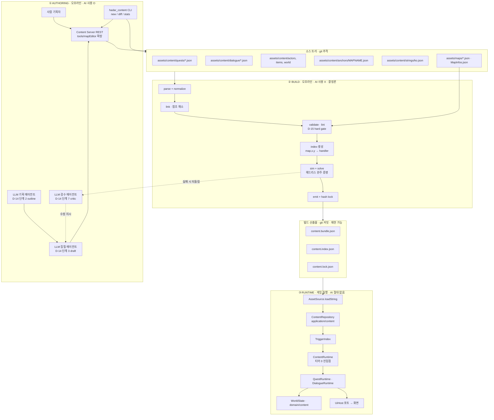
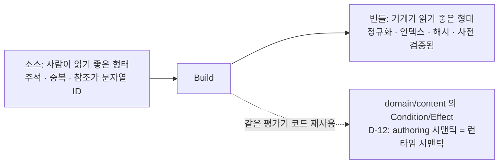
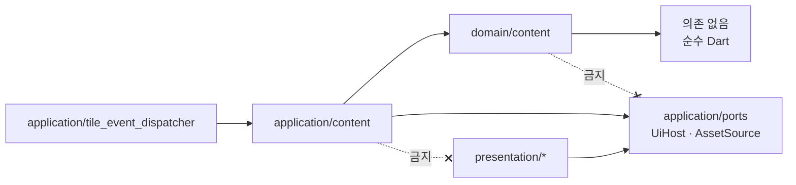
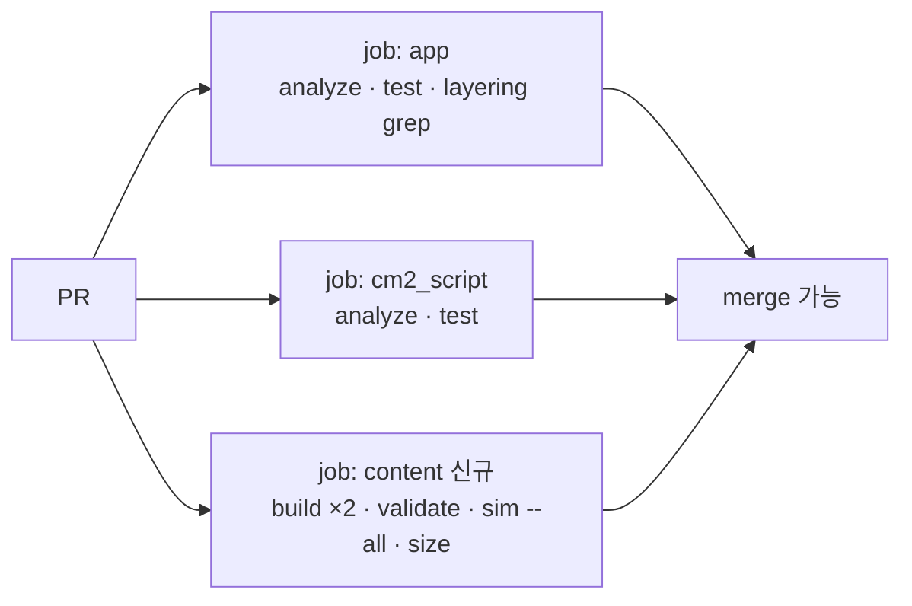

# BP-20 · 목표 아키텍처 전체 그림

> `상태: 참고` — 현황 조사·참조 자료. 사실 정본은 [`_meta/GROUND_TRUTH.md`](_meta/GROUND_TRUTH.md) 이며,
> 이 장의 **결론·권고는 1차 노선 기준**이라 [`issues/DECISION-LOG.md`](../issues/DECISION-LOG.md) 2차 판정이 우선한다.

> **문서 ID**: BP-20 · **상태**: 개정 1판(검수 반영) · **선행 문서**: [BP-11 갭 분석](11_gap_analysis.md), [BP-10 현행 감사](10_current_architecture_audit.md)
> **독자**: 런타임 구현자 · 툴체인 구현자 · 리뷰어
> **한 줄 요약**: AI 는 오프라인 Authoring 에서만 쓰고, Build 가 결정론적으로 구워내고, Runtime 은 구워진 번들을 해석만 한다 — 이 3구획 경계와 기존 Hadar 코드와의 접합점 6곳을 확정한다.

---

## 0. 이 장의 역할과 범위

| 항목 | 내용 |
|---|---|
| 구획 | 3구획 **전부**를 조망한다(이 장만 유일하게 전 구획을 다룬다) |
| 확정하는 것 | 경계, 아티팩트 흐름, 코드 배치, 접합점, 소유권, 결정론 전략, 예산, 불변식 |
| 확정하지 않는 것 | 필드 단위 스키마(→ BP-21~27), API 시그니처(→ BP-31), 프롬프트(→ BP-37) |
| 근거 결정 | [D-01](_meta/DECISIONS.md), D-02, D-03, D-10, D-11, D-12, D-13, D-17, **D-18(SSoT 소유권 표)**, **D-19(`pendingNavigation` 승격)** |

**개정 1판에서 바뀐 것** (검수 `_meta/reviews/REVIEW_BP-20.md` 반영)

| # | 지적 | 처리 |
|---|---|---|
| F-01 | 접합점이 5곳이 아니라 **6곳** — 지연 이동(`pendingNavigation`)이 통째로 빠져 있었다 | §5.1 에 (f) 추가, **§5.7 신설**, R-20-14 · INV-20-19 (D-19) |
| F-02 | 세이브 v2 봉투를 스스로 정의해 [BP-25](25_world_state_and_save.md) 와 3곳 충돌 | §5.3 을 **개요 + 링크로 축소**, **R-20-4 철회** (D-18) |
| F-07 | 난수 소비 모델("카운터 미사용")이 BP-25 R-25-7 · BP-27 §9.2 의 `rngCursor` 와 정면 충돌 | §7.2 초판 규범 **철회**, [BP-27](27_runtime_engine.md) 채택 (D-18) |
| F-03·F-05 | `currentEncounterId`·적 ID 다리가 없는데 있는 것처럼 씀 | §5.5 에 선행 작업 3건 + **R-20-13** 확정 |
| F-04 | Effect 24종 중 8종이 `WorldStateMutator` 로 적용 불가한데 실행기의 자리가 없었다 | §4.1·§4.2 에 `DeferredEffect` / `HDEffectBridge` / `debug_commands` 반영, §4.4 예산 갱신 |
| F-10 | INV-20-05 가 [BP-28](28_migration_and_coexistence.md) T-28-4/5 와 이미 충돌 | 명제 정밀화 + **INV-20-05b** 신설 |
| F-06·F-08·F-09 | lock 필드명 발명 / D-11 을 조용히 좁힘 / 저널 플로우 배치 미정 | §7.3 필드명 제거, R-20-2 에 충돌 표시, §5.4 를 BP-41 로 위임 |
| S-02·S-03 | 기준선 수치 오차 | `application/` 2,800 → **3,451줄**, `domain/content/` 13 → **18파일** |
| — | GROUND_TRUTH **부록 B·C·D** 미반영 | 부록 B-1/B-2/B-3/B-4, C-1/C-2/C-4, D-1/D-2 를 §5.2·§5.3·§5.5·§7.1·§9 에 반영 |

**중복 금지 규약**: 아래 항목은 이 장에서 *이름만* 언급하고 정의는 해당 장에 있다.

| 주제 | 정의가 있는 장 |
|---|---|
| `pack.json` 필드, 디렉토리 규약, ID 문법 | [BP-21 Content Pack 명세](21_content_pack_spec.md) |
| 세계관/장소/팩션 데이터 모델 | [BP-22 World Bible 모델](22_world_bible_model.md) |
| Quest/Stage/Objective 필드 | [BP-23 퀘스트 모델](23_quest_model.md) |
| Dialogue/Node/Choice 필드 | [BP-24 대화 모델](24_dialogue_model.md) |
| Condition/Effect DSL 의 op·do 전량과 시그니처 | [BP-21 Content Pack 명세](21_content_pack_spec.md) |
| **세이브 v2 봉투 전체**(필드명, `mapDelta`, 레거시 플래그 보관 위치), `WorldState` 필드, 마이그레이션 규칙 | [BP-25 월드 상태·세이브](25_world_state_and_save.md) |
| **`content.lock.json` / `content.bundle.json` / `content.index.json` 의 필드 정의** | [BP-21 §2.3](21_content_pack_spec.md), [BP-35](35_ci_and_build.md) |
| Anchor kind 별 필드, 엔티티 레지스트리, 트리거 인덱스 키 | [BP-26 엔티티·앵커](26_entity_registry_and_anchors.md) |
| **런타임 실행 경로** — 티어 0 삽입 코드, `pendingNavigation` 처리, `WorldRng`·`rngCursor` 소유자, 대화/퀘스트 루프, 공개 클래스 12종 시그니처 | [BP-27 런타임 엔진](27_runtime_engine.md) |
| cm2/네이티브 공존·이관 절차, 이관 상태 기계, 레거시 플래그 다리 | [BP-28 공존·이관](28_migration_and_coexistence.md) |
| 저널 플로우 클래스의 배치와 UI | [BP-41 저널 UI](41_journal_ui_spec.md) |
| CLI/서버/MCP 명세 | [BP-30](30_toolchain_overview.md), [BP-31](31_content_server_api.md) |
| 빌드 파이프라인·CI 잡 구성 | [BP-35 콘텐츠 빌드·CI](35_ci_and_build.md) |

> **D-18 적용**: 위 표는 [D-18(SSoT 소유권 표)](_meta/DECISIONS.md)의 이 장 몫이다. 충돌 시 **소유 장이 이긴다.**
> 이 장은 소유하지 않은 주제를 **재서술하지 않고 링크**한다. 초판(2026-08-30)에서 세이브 v2 봉투(§5.3)와
> 난수 소비 모델(§7.2)을 직접 정의해 BP-25·BP-27 과 충돌했고, 개정판에서 양쪽 모두 소유 장에 반환했다.

---

## 1. 한 장의 그림

### 1.1 3구획과 아티팩트 흐름



### 1.2 구획별 AI 사용 여부 — 규범표

| 구획 | LLM 호출 | 네트워크 | 비결정 난수 | 실행 시점 | 실패 시 |
|---|---|---|---|---|---|
| ① Authoring | **허용** (D-14 단계 2·3·7 에 한정) | 허용 | 허용 | 배포 전, 개발자 머신/CI | 단계에서 정지, 다음 단계 진입 금지 |
| ② Build | **금지** | 금지(로컬 파일만) | **금지** | 배포 전, CI | hard gate 실패 → 커밋 불가 |
| ③ Runtime | **금지** | **금지** | **금지**(시드 난수만) | 플레이 중 | 로드 거부 또는 레거시 티어 폴백 |

> **R-20-1** 런타임 코드(`lib/domain/content/`, `lib/application/content/`)는 HTTP 클라이언트·LLM SDK·`dart:io` 를 import 하지 않는다. CI grep 으로 고정한다(§9 INV-20-03).

---

## 2. 왜 3구획인가

### 2.1 네 가지 축에서의 도출

| 축 | 요구 | 3구획이 주는 것 | 이 요구가 나온 근거 |
|---|---|---|---|
| 결정론 | 같은 입력 → 같은 플레이 | Build 가 해시 잠금(`content.lock.json`), Runtime 은 시드 난수만 | D-01 |
| 검증 가능성 | "이 퀘스트 완주 가능"을 배포 전에 증명 | Build 가 솔버를 돌릴 수 있는 **닫힌 데이터**를 만든다 | D-15, D-13 |
| 배포 안전성 | LLM 이 만든 문장이 검수 없이 플레이어에게 닿지 않음 | Authoring → Build hard gate 가 물리적 관문 | D-14 단계 5·6·7 |
| 오프라인 제약 | 게임은 네트워크 없이 돈다 | Runtime 이 읽는 것은 번들 파일 하나뿐 | D-17 |

### 2.2 반례 반박 — "런타임에 LLM 을 부르면 안 되나?"

| 반례 주장 | 반박 | 근거 |
|---|---|---|
| "NPC 대사를 실시간 생성하면 무한 콘텐츠" | 세이브가 깨진다. `WorldState` 는 플래그·퀘스트 상태를 **ID 로** 저장하는데, 생성된 대사에는 안정적 ID 가 없어 다음 세션에 같은 상태로 복원할 수 없다 | D-08 |
| "품질은 프롬프트로 잡으면 된다" | 잡을 수 없다. cm2 조차 미등록 함수가 조용히 0 을 반환해 오분기하는 상황인데(GROUND_TRUTH §9), 런타임 생성물은 정적 검증 대상 자체가 없다 | D-02 |
| "요즘은 온디바이스도 된다" | 명시적 스코프 밖. 800×480 고정 레이아웃의 턴제 루프에 초 단위 지연이 들어가면 원작 조작감이 붕괴한다 | D-17 |
| "웹 빌드에서 API 만 부르면 되잖아" | 웹 빌드는 GitHub Pages 정적 호스팅(`deploy_web.yml`)이다. 백엔드가 없고, 만들면 키 관리·비용·오프라인 불가가 따라온다 | CLAUDE.md 배포 절 |
| "버그 리포트는 그때그때 고치면 된다" | 재현이 불가능하다. 비결정 생성물은 최소 재현 시퀀스를 만들 수 없어 D-13 의 트레이스 기반 회귀가 성립하지 않는다 | D-13 |
| "그럼 Build 를 없애고 소스를 직접 읽으면?" | 참조 무결성·도달성·사이클 검사가 런타임으로 밀려온다. 플레이 도중 "퀘스트 3단계에서 대상 NPC 없음"이 터진다. Build 는 그 실패를 **배포 전으로 앞당기는 장치**다 | D-15 |

### 2.3 Build 를 별도 구획으로 분리하는 추가 이유



- 소스 최적화 목표(가독성·diff 친화성)와 런타임 최적화 목표(조회 O(1)·파싱 최소)는 **정반대**다. 한 포맷으로 둘 다 만족시키려 하면 둘 다 나빠진다.
- Build 가 있으면 팩 합성(D-03 `dependsOn`)을 런타임이 아니라 빌드 시점에 해소할 수 있다. 런타임은 이미 합쳐진 하나의 번들만 본다.

---

## 3. 아티팩트 흐름표

### 3.1 단계별 입출력

| # | 단계 | 구획 | 입력 | 출력 | 생산자 | 소비자 | 검증 지점 |
|---|---|---|---|---|---|---|---|
| 1 | context | ① | `world/*.json`, 기존 팩 요약, 스키마, 스타일 가이드 | `.work/context.json` | CLI `hadar_content context` | 기획 에이전트 | 스키마 버전 일치 |
| 2 | outline | ① AI | context | `.work/outline.json` (QuestOutline) | 기획 LLM | 집필 LLM | QuestOutline 스키마 |
| 3 | draft | ① AI | outline + context | `quests/<id>.json`, `dialogue/<id>.json`, `strings/ko.json` 조각 | 집필 LLM | bind | JSON 스키마 강제 |
| 4 | bind | ① | draft + `assets/maps/*.json` | `anchors/<MAP>.json`, 맵 편집 diff | Content Server + 맵 에디터 API | lint | 앵커-통행 충돌 0 |
| 5 | lint | ② | 소스 트리 전체 | `.work/lint.json` | CLI `validate`/`lint` | sim | D-15 hard gate |
| 6 | sim | ② | 소스 + 헤드리스 하네스 | `.work/trace/*.json`, `solve.json` | `SimDriver` + `QuestSolver` | critic | 완주 증명 성공 |
| 7 | critic | ① AI | draft + trace | `.work/critic.json` (루브릭 점수) | 검수 LLM | commit | soft gate 임계 |
| 8 | commit | ② | 통과된 소스 | `build/content.bundle.json` 외 3종, 변경 요약 | CLI `build` | 런타임 · git | 재빌드 해시 일치 |
| 9 | load | ③ | `build/*.json` | 메모리 `ContentRepository` | `AssetSource` | `ContentRuntime` | `contentVersion` 호환 |
| 10 | play | ③ | 번들 + 세이브 | 갱신된 `WorldState` | `ContentRuntime` | 세이브 v2 | 스키마 버전 일치 |

### 3.2 파일별 소유·수명

| 파일 | 소유자 | git | 손으로 편집 | 재생성 가능 | 비고 |
|---|---|---|---|---|---|
| `assets/content/**/*.json` (소스) | 사람 + AI(API 경유) | 추적 | **API/CLI 경유만** (D-12 원칙 4) | 불가 | 진짜 원본 |
| `assets/content/build/content.bundle.json` | Build | 추적 | **금지** | 가능 | 소스에서 100% 재현 |
| `assets/content/build/content.index.json` | Build | 추적 | **금지** | 가능 | 조회 가속용 |
| `assets/content/build/content.lock.json` | Build | 추적 | **금지** | 가능 | 해시·`legacyFlagMap` 증빙 |
| `.work/**` | 파이프라인 중간물 | **미추적** | — | 가능 | 단계 재개용 |
| `assets/maps/*.json` | 맵 에디터 | 추적 | 에디터 경유 | 불가 | 지형·배치만 소유(§6) |
| `save_data_*.json` / SharedPreferences | 런타임 | 미추적 | — | 불가 | 세이브 v2 |

> **왜 `build/` 를 커밋하나** — 빌드 산출물을 커밋하지 않으면 `flutter run` 이 Dart 툴체인 외에 `hadar_content build` 선행 실행을 요구하게 되고, 웹 배포 워크플로(`deploy_web.yml`)에 단계를 추가해야 한다. 커밋해두면 **재빌드 해시 일치**(INV-20-06)가 곧 "커밋된 산출물이 소스와 같다"는 증명이 되므로, 커밋이 오히려 검증 수단이 된다.

---

## 4. 런타임 구성요소 지도

### 4.1 `domain/content/` — 무엇을 알고 무엇을 모르는가

| 파일 | 아는 것 | 모르는 것 | 재사용처 |
|---|---|---|---|
| `content_ids.dart` | ID 문법(D-04), 타입 접두사, 슬러그 규칙 | 어떤 ID 가 실제로 존재하는지 | CLI 린트, 런타임 |
| `condition.dart` | Condition op 집합(D-05), `evaluate(WorldStateView)` | 파일, 화면, 맵 | CLI 솔버, 런타임 |
| `effect.dart` | Effect do 집합(D-05)의 파싱·검증·직렬화. `EffectApplier.apply(WorldStateMutator)` 가 **순수 변이만** 적용하고, 나머지는 `DeferredEffect` 로 **분류해서 돌려준다** | 화면 출력, 맵, 전투, 저장 시점 | CLI 시뮬레이터(지연 효과를 기록만 하는 sink), 런타임 |
| `world_event.dart` | 월드 이벤트 타입 집합 | 발행 큐 | 양쪽 |
| `world_rng.dart` | `WorldRng` — 시드 난수의 유일한 소유자(§7.2) | 전투 규칙 | 양쪽 |
| `strings.dart` | `stringKey → 텍스트` 조회, 누락 시 키 반환 | 렌더링 | 양쪽 |
| `quest.dart` / `stage.dart` / `objective.dart` | 퀘스트 FSM 구조(D-06) | 언제 전이가 트리거되는지 | CLI 도달성 검사, 런타임 |
| `dialogue.dart` / `node.dart` / `choice.dart` | 대화 그래프 구조(D-07) | 콘솔 페이지 넘김 | CLI 도달성 검사, 런타임 |
| `actor.dart` / `item.dart` / `place.dart` / `anchor.dart` | 엔티티 정체성과 좌표 바인딩(D-09) | 스프라이트, 타일 렌더 | 양쪽 |
| `world_state.dart` | 상태 컨테이너 + 직렬화(D-08) | SharedPreferences, 파일 경로 | 양쪽 |

**의존 방향 규칙**



- `domain/content/` → **아무것도 import 하지 않는다.** `application/ports/` 조차 모른다.
- `application/content/` → `domain/content/` + `application/ports/` 만 본다.
- 역방향(`domain` → `application`) 화살표는 존재하지 않는다.

> **Effect 24종 중 8종은 `WorldState` 밖을 건드린다.** `add_gold`·`add_food`(→ `HDParty.inventory`),
> `warp`(→ 맵 전환), `change_tile`(→ `MapModel` + 세이브 델타), `start_battle`(→ `HDBattle`),
> `play_dialogue`(→ `DialogueRuntime`), `heal_party`·`grant_exp`(→ `HDPlayer`), `set_encounter`(→ `HDParty.encounter`).
> §6.1 소유권표가 골드·식량을 `WorldState` 가 아닌 곳에 두었으므로 이는 정의상 `WorldStateMutator` 로 적용 불가다.
> 그래서 `domain/content/effect.dart` 는 이 8종을 **`DeferredEffect` 로 분류만** 하고, 실제 실행은
> `application/content/content_effect_bridge.dart` 의 `HDEffectBridge` 가 맡는다(§4.2).
> **CLI 재사용 영향** — CLI 는 `HDEffectBridge` 대신 지연 효과를 트레이스에 적어두기만 하는 기록용 sink 를 쓴다.
> 따라서 D-12 의 "authoring 시맨틱 = 런타임 시맨틱" 은 순수 16종에 대해서는 **코드 동일성**으로,
> 지연 8종에 대해서는 **분류 동일성 + 시뮬레이터의 모델링**으로 성립한다. 이 구분을 지우면 솔버가
> "warp 했더니 도달 가능해졌다" 를 증명할 수 없다. 클래스 시그니처 전문은 [BP-27 §1.1·§2](27_runtime_engine.md).

### 4.2 `application/content/` — 유스케이스 배치

| 파일 | 책임 | 부르는 포트 | 부르지 않는 것 |
|---|---|---|---|
| `content_repository.dart` | 번들 3파일 로드·캐시·팩 합성 결과 보관 | `AssetSource.loadString` | `rootBundle`, `dart:io` |
| `trigger_index.dart` | `(map,x,y,kind)` → 앵커 핸들러 O(1) 조회 | 없음 | — |
| `content_runtime.dart` | 티어 0 진입점(`handleTile`). 앵커 해석, 상호작용 락, 지연 효과 실행 | `UiHost`(간접) | 타일 렌더 |
| `dialogue_runtime.dart` | 노드 순회, `lines` 출력, `choices` 프롬프트 | `UiHost.addLog/showWindowMenu/setHeader/waitForAnyKey` | 위젯 |
| `quest_runtime.dart` | 목표 판정, 스테이지 전이, 저널 기록 | `UiHost.addLog` | — |
| `world_event_bus.dart` | `talk/enter/defeat/acquire/…` 이벤트 발행·구독 | 없음 | — |
| **`content_effect_bridge.dart`** | 지연 효과 8종의 실제 실행 — `warp`·`start_battle`·`change_tile`·`heal_party`·`grant_exp`·`add_gold`·`add_food`·`set_encounter` | `UiHost`, `PartyMovementHost`, 그리고 **같은 계층의** `HDGameSession`·`HDBattle`·`HDParty` | `presentation/`, `hd_game_main.dart` |
| **`debug_commands.dart`** | 치트/검증용 상태 조작. `--dart-define` 가드 뒤에서만 등록 | `UiHost` | 릴리스 빌드 |

- `HDEffectBridge` 가 `application/content/` 안에서 `HDGameSession`·`HDBattle` 을 부르는 것은 **같은 계층 내부 참조**라
  CI grep 2종에 걸리지 않는다(§4.3). 이 표의 클래스 시그니처 원문은 [BP-27 §1.2](27_runtime_engine.md) 가 소유한다.
- **저널 플로우 클래스(`showJournal`)는 이 표에 없다.** 배치는 [BP-41](41_journal_ui_spec.md) 이 정한다(§5.4, §10.2).

### 4.3 계층 규칙 CI 통과 증명

`.github/workflows/ci.yml:50-75` 의 "Check layering invariants" 는 두 grep 이 **빈 결과**여야 통과한다.

```bash
# 검사 1
grep -rn -E "^import .*(presentation/|hd_game_main\.dart)" lib/application/ lib/domain/
# 검사 2
grep -rn -E "package:flutter/material|package:bonfire|package:flame" lib/application/ lib/domain/
```

신규 파일들의 import 헤더가 이를 통과함을 파일별로 명세한다.

| 신규 파일 | 허용 import 화이트리스트 | 검사 1 | 검사 2 |
|---|---|---|---|
| `lib/domain/content/*.dart` | `dart:convert`, `dart:math`, 같은 폴더 상대 경로 | 통과(presentation 미언급) | 통과(flutter 미언급) |
| `lib/application/content/*.dart` | 위 + `../../domain/content/*`, `../ports/*`, `package:flutter/foundation.dart`(ChangeNotifier 필요 시에만) | 통과 | 통과(`foundation` 은 패턴에 없음) |

> **R-20-2** `lib/domain/content/` 는 `package:flutter/foundation.dart` 조차 import 하지 않는다. D-12 가 요구하는 "CLI 가 평가기를 그대로 import" 를 가능하게 하려면 Flutter 의존이 0이어야 한다. `ChangeNotifier` 가 필요하면 그 파일은 `application/content/` 로 올린다.
>
> **명시적 충돌 표시** — 이 요구사항은 **D-11 의 괄호 주석(`Flutter foundation 만 import`)을 더 좁힌다.** 근거는 D-12 의 CLI 공유 요건이다.
> [BP-27 §1.1](27_runtime_engine.md) 은 `domain/content/*.dart` 의 import 전량에 `package:flutter/foundation.dart`(`@immutable`, `kDebugMode`)를 포함시켰으므로 그쪽과도 어긋난다.
> 결정을 뒤집는 것이 아니라 **충돌 사실을 기록**하는 것이며, 해소는 Q-20-1 이 받는다. 구현자는 D-11 만 읽고 `ChangeNotifier` 를 쓰지 말 것.
>
> **RK-20-1 / Q-20-1** 순수 Dart CLI(`tools/content_cli/`)가 `hadar2026_app/lib/domain/content/` 를 path 의존으로 끌어오면 `hadar2026_app` 의 `sdk: flutter` 의존까지 딸려와 `dart pub get` 이 실패한다. D-11 의 배치는 유지하되, 실제 공유 수단은 BP-30/BP-35 가 정한다(후보: ① `packages/hadar_content_core/` 로 물리 분리 후 `lib/domain/content/` 는 re-export만, ② pub workspace, ③ 빌드 시 소스 복사). **R-20-2 를 지키면 어느 안을 골라도 코드 수정 없이 이동 가능**하다는 점이 이 요구사항의 존재 이유다.
>
> **RK-20-2 (GROUND_TRUTH 부록 B-4)** `lib/application/menu_flows.dart:2` 가 `import 'dart:io';` 를, `:504/:522/:540` 이 `exit(0)` 를 갖고 있다.
> CLAUDE.md 는 `application/` 의 `dart:io` 를 금지하지만 **CI grep 2종은 이를 검사하지 않아 통과한다.** 즉 계층 CI 는 현재 완전하지 않다.
> 신규 콘텐츠 코드가 같은 구멍으로 새지 않도록 INV-20-03 의 grep 패턴에 `dart:io`·`dart:html` 을 추가한다(§9).

### 4.4 파일 수 / 규모 예산

| 폴더 | 예상 파일 수 | 예상 총 줄 수 | 비교 기준 |
|---|---|---|---|
| `lib/domain/content/` | **18** (D-11 열거 14 + `world_event`·`world_rng`·`strings` + `node`/`choice` 분리분) | 1,400 ~ 2,000 | 현 `domain/` 전체와 유사 규모 |
| `lib/application/content/` | **8** (§4.2 표) | 1,200 ~ 1,800 | 현 `application/battle.dart` 538줄 × 2~3 |
| 접합점 수정분 | **6 파일** (§5 의 (a)~(f)) | +200 미만 | §5 |

> 초판의 13/6/5 는 D-11 의 열거를 잘못 세고(14개), `HDEffectBridge`·`debug_commands`·지연 이동 접합점을 빠뜨린 값이었다. 최종 파일 목록의 소유는 [BP-27 §1](27_runtime_engine.md).

---

## 5. 기존 시스템과의 접합점 6곳

### 5.1 요약

| # | 접합점 | 대상 파일 | 성격 | 결정 |
|---|---|---|---|---|
| (a) | 타일 디스패치 티어 0 | `lib/application/tile_event_dispatcher.dart:106` | 신규 분기 삽입 | D-10 |
| (b) | 세이브 v2 | `lib/application/save_manager.dart:18` | 포맷 확장 + 마이그레이션 | D-08 |
| (c) | 메인 메뉴 저널 항목 | `lib/application/menu_flows.dart:34` | 메뉴 항목 추가 | D-16-1 |
| (d) | 전투 승리 이벤트 발행 | `lib/application/battle.dart:240` | 이벤트 훅 추가 | D-16-6 |
| (e) | 번들 로드 | `lib/presentation/host/bundle_asset_source.dart:22` + `pubspec.yaml:65` | 포트 재사용 + 에셋 등록 | D-03 |
| **(f)** | **지연 이동 예약(`pendingNavigation`)** | `lib/application/scripting/script_engine_adapter.dart:34`(필드) · `lib/application/tile_event_dispatcher.dart:99`(autoFlush 판정) · `lib/hd_game_main.dart:74,80`(소비) | 개념 승격 + 판정식 확장 | **D-19** |

> **초판 정정** — 초판은 이 절을 "접합점 5곳"이라 부르며 전수를 주장했으나, **(f) 가 빠져 있었다.**
> `pendingNavigation` 은 두 문서 어디에도 등장하지 않았고, 그 결과 Effect `warp` 의 실행 경로가 설계에 없었다.
> D-19 가 이를 명시적 설계 대상으로 못 박았고, 이 개정에서 §5.7 로 편입했다.

---

### 5.2 (a) `HDTileEventDispatcher` — 티어 0 삽입

**현재** (`tile_event_dispatcher.dart:120-146`)

```dart
final native = HDNativeScriptRunner();
final cm2Path = HDGameSession().currentMapCm2Path;
// ...
if (native.currentMapScript != null) {
  await _emitJsonDialog(map, x, y, host, action);
  await native.processMapEvent(action, x, y);
  return;
}

if (cm2Path != null) {
  HDScriptEngine().setTargetPos(x, y);
  HDScriptEngine().setScriptMode(action.scriptMode);
  await HDScriptEngine().run();
  if (HDScriptEngine().handled) return;
  await _emitJsonDialog(map, x, y, host, action);
  return;
}
```

**변경 후** — 앞에 티어 0 한 블록만 추가한다. 아래 코드는 손대지 않는다.

```dart
// TIER 0 — content pack. 앵커가 있으면 콘텐츠 런타임이 전담하고 종료.
if (await ContentRuntime().handleTile(
      mapName: HDGameSession().currentMapName,
      x: x, y: y, action: action,
      isInteraction: isInteraction, host: host)) {
  return;
}

final native = HDNativeScriptRunner();     // 이하 기존 코드 그대로
```

| 성질 | 값 |
|---|---|
| 신호 규약 | `Future<bool>` — `true` = 처리함, 아래 티어 진입 금지 |
| 앵커 없음 | `false` 반환 → 기존 3티어가 **문자 그대로 이전과 동일하게** 동작 |
| 재진입 가드 | 기존 `_isScriptRunning`(`:34`) 를 그대로 사용. 의미를 "한 번에 하나의 상호작용"으로 문서화 |
| 필요한 선행 작업 1 | `HDGameSession` 에 `currentMapName` 필드 추가(현재 없음 — GROUND_TRUTH §7 의 세이브 누락 항목과 동일 원인) |
| 필요한 선행 작업 2 | **지연 이동 경로 정비**(§5.7). 티어 0 이 `true` 를 반환하는 것만으로는 맵 전환이 성립하지 않는다 |
| 필요한 선행 작업 3 | `MapInfos.json` 의 `json`/`cm2` 필드 채우기 — GROUND_TRUTH 부록 D-1 기준 **등록 이름 15개 중 7개가 존재하지 않는 파일로 해석**되며, 부록 D-2 에 따라 그 실패가 `true`(성공)로 보고된다. 티어 0 은 `currentMapName` 을 키로 쓰므로 이름 해석이 깨진 채로는 앵커 조회가 무의미하다([BP-28 §2.5](28_migration_and_coexistence.md) T-28-2) |
| 상세 | [BP-28 §2](28_migration_and_coexistence.md) |

---

### 5.3 (b) `HDSaveManager` — v2

> **소유권** — 세이브 v2 봉투의 **필드 정의 전체**(키 이름, `mapDelta`, 레거시 플래그 보관 위치, `envelope`, 마이그레이션 규칙)는
> [**BP-25 §5**](25_world_state_and_save.md) 가 SSoT 다(D-18). 초판은 이 자리에서 페이로드를 키 단위로 나열했고
> 그 정의가 BP-25 와 세 곳에서 충돌했다(`map` vs `mapDelta`, `nativeScript` vs `legacy.nativeFlags`, `envelope` 누락).
> 개정판은 그 코드블록을 **삭제**하고, 이 장이 소유하는 **접합 사실(제어 흐름)만** 남긴다.

**이 장이 확정하는 것 — 제어 흐름 2가지**

| 지점 | 코드 | 접합 사실 |
|---|---|---|
| 저장 | `save_manager.dart:18` | 페이로드 리터럴의 `'version': 1` 이 `2` 로 바뀌고, 봉투 구성은 BP-25 §5.1 을 따른다 |
| 로드 | `save_manager.dart:47` 이후 | `data['version']` 으로 분기한다. `case 1` → `_migrateV1ToV2`, `case 2` → 그대로, 그 밖 → **로드 거부**(미래 버전) |
| 맵 복원 | `save_manager.dart:86` | 현재 `session.setNewMap(loadedMap)` 을 **직접** 호출한다. 이 경로는 `loadMapFromFile` 을 타지 않으므로 네이티브 스크립트 스왑(`game_session.dart:117-128`)과 `currentMapCm2Path` 갱신이 **일어나지 않는다**(GROUND_TRUTH 부록 C-2) |

**개요** — v2 가 해소하는 것은 GROUND_TRUTH §7·부록 C 의 저장 누락 4건이다: 현재 맵 **이름**,
`HDNativeScriptRunner.flags`/`.variables`, `map.events`(부록 C-1 — `MapModel.toJson()` 이 `events` 를 저장하지 않아
로드 직후 JSON 대사 티어가 통째로 무력화된다), 그리고 난수 커서(§7.2). BP-25 는 이 중 `map.events` 를
"저장하지 않고 **맵 이름으로 재로드**해 원본 `events` 를 복원" 하는 방식으로 해소한다 — 그래서 `currentMapName` 이
세이브 v2 의 필수 필드이자 티어 0 의 조회 키가 된다(§5.2 선행 작업 1).

> **부록 C-1·C-2 가 티어 0 에 주는 함의** — 세이브를 로드한 직후에는 (1) `map.events` 가 비어 있고 (2) 네이티브 스크립트가
> 붙어 있지 않다. 즉 **티어 1 과 티어 3 이 동시에 죽은 상태**다. 티어 0 은 `currentMapName` + 번들만 있으면 동작하므로
> 이 상태에서도 유일하게 살아 있는 티어가 된다. 이는 콘텐츠 티어의 장점이자, [BP-28 §4](28_migration_and_coexistence.md)
> 의 동등성 검증이 **세이브 로드 직후 상태를 기준선으로 삼으면 안 되는** 이유이기도 하다.

### 5.4 (c) `HDMenuFlows` — 저널 항목

**현재** (`menu_flows.dart:34-42`, `:55-77`)

```dart
final choices = [
  "당신의 명령을 고르시오 ===>",
  "일행의 상황을 본다",     // 1
  "개인의 상황을 본다",     // 2
  "일행의 건강 상태를 본다", // 3
  "마법을 사용한다",        // 4
  "초능력을 사용한다",      // 5
  "여기서 쉰다",           // 6
  "게임 선택 상황",         // 7
];
```

**변경 후** — 8번을 **끝에** 추가한다.

```dart
final choices = [
  "당신의 명령을 고르시오 ===>",
  // 1~7 기존 그대로 (기존 근육 기억 · 스크린샷 · 문서 보존)
  "일행의 상황을 본다",
  "개인의 상황을 본다",
  "일행의 건강 상태를 본다",
  "마법을 사용한다",
  "초능력을 사용한다",
  "여기서 쉰다",
  "게임 선택 상황",
  "임무를 확인한다",        // 8 ← 신규
];

switch (selected) {
  // ... case 1~7 그대로
  case 8:
    await HDJournalFlows().showJournal();   // 클래스 배치는 BP-41 이 정한다
    break;
}
```

| 결정 | 근거 |
|---|---|
| 기존 인덱스를 **밀지 않는다** | `showWindowMenu` 는 1-based 인덱스를 그대로 `switch` 에 쓴다. 중간 삽입은 7개 분기를 전부 흔든다 |
| 항목 활성/비활성 | 진행 중 퀘스트 0건이면 `enabledCount` 로 흐리게(포트에 이미 있는 인자) |
| **`HDJournalFlows` 의 계층 배치** | **이 장이 정하지 않는다.** `application/content/` 인지 `HDMenuFlows` 옆인지 `presentation/panels/` 와 짝인지는 [BP-41](41_journal_ui_spec.md) 소유(§10.2). §4.2 표에 이 클래스가 없는 것은 누락이 아니라 위임이다 |
| UI 스펙 | [BP-41 저널 UI](41_journal_ui_spec.md) |

---

### 5.5 (d) `HDBattle` — 승리 이벤트 발행

**현재** (`battle.dart:240-264`)

```dart
if (_battleResult == 1) {
  // Win
  _host.clearLogs();
  int totExp = enemies.fold(0, (xp, e) { /* ... */ });
  await _host.addLog("전투에서 승리하여 경험치 $totExp을 얻었다.");
  for (var p in _party.players) { /* exp + 레벨업 */ }
  _party.gold += enemies.fold(0, (g, e) => g + e.level * 5);
}
```

**변경 후** — 보상 처리 **뒤에** 이벤트 1줄. 전투 로직은 무변경.

```dart
if (_battleResult == 1) {
  // ... 기존 보상 처리 그대로 ...
  _party.gold += enemies.fold(0, (g, e) => g + e.level * 5);

  // 신규: 퀘스트 defeat 목표를 자동 진행시키기 위한 발행 (D-16-6)
  WorldEventBus().publish(WorldEvent.defeat(
    enemyIds: [for (final e in enemies) e.data.id],   // 정수. §5.5 표 참조
    encounterId: currentEncounterId,                  // 신설 필드. null 이면 자유 조우
  ));
  currentEncounterId = null;                          // 소비 후 리셋
}
```

| 성질 | 값 |
|---|---|
| 방향 | `HDBattle` → `WorldEventBus` **단방향**. 전투는 퀘스트를 모른다 |
| 구독자 | `QuestRuntime` 이 `Objective.kind == defeat` 를 카운트 |
| 같은 패턴을 적용할 다른 지점 | 아이템 획득(`acquire`), 맵 진입(`reach`), 대화 선택(`choose`) — 각각의 발행 지점은 [BP-27 §이벤트 버스](27_runtime_engine.md) |
| 주의 | 발행은 `notifyListeners()` 와 마찬가지로 **동기 호출 금지 구간**(빌드 중)에 걸리지 않도록 `gotoEndBattle` 안쪽에서만 |
| **필요한 선행 작업 1** | **`HDBattle.currentEncounterId` (nullable `String`) 신설.** `grep -n "encounterId" battle.dart` → 현재 **0건**이다. Effect `start_battle(encounterId)` 가 세우고, `gotoEndBattle` 이 소비 후 `null` 로 리셋한다. 구조 변경의 소유는 [BP-27 §7.1](27_runtime_engine.md) |
| **필요한 선행 작업 2** | **적 ID 다리.** `HDEnemy.data.id` 는 **정수**이고, 사용 가능한 적은 `enemyTable` 의 **id 1~74(74종)** 다 — `battle.dart:43-46` 의 `if (enemyTableId <= 0 …) return;` 때문에 **id 0(`Orc`)은 영원히 소환할 수 없다**(GROUND_TRUTH 부록 B-1). D-04 는 플래그 다리만 확정했고 적 ID 다리는 아무 결정도 없었다 |
| **필요한 선행 작업 3** | 전투 결과 코드 정본 확정. `battle.dart:27` 은 `1=Win, 0=Lose, 2=Run away` 인데 `assets/const.cm2:53-55` 는 `0=EVADE, 1=WIN, 2=LOSE` 로 **0 과 2 의 의미가 뒤바뀌어 있다**(GROUND_TRUTH 부록 B-2). 콘텐츠 조건이 어느 쪽을 보는지는 [BP-27](27_runtime_engine.md) 이 정하고, cm2 와의 공존 규칙은 [BP-28 §7.4](28_migration_and_coexistence.md) 가 받는다 |

**R-20-13 자유 조우와 적 ID 다리 — 이 장이 확정한다**

| 항목 | 확정 |
|---|---|
| 자유 조우의 `encounterId` | **`null` 로 둔다.** 합성 ID(`encounter.core.random.<map>`)를 만들지 않는다 |
| 그 결과 | `Objective.kind = defeat(encounterId)` 목표는 **자유 조우로 진행되지 않는다.** 이는 버그가 아니라 의도다 — "지정된 조우를 이겨라"와 "아무 슬라임이나 N마리 잡아라"는 다른 목표다 |
| 자유 조우로 진행되는 것 | `defeat(enemyId, count)` 형태. `WorldEvent.defeat.enemyIds` 로 매칭된다 |
| `WorldEvent.defeat.enemyIds` 의 타입 | **정수 유지.** `HDBattle` 을 문자열 ID 로 바꾸지 않는다(76종 하드코딩 테이블을 건드리는 비용이 이득보다 크다) |
| 인덱스 키(§8.3) | 따라서 `"defeat:enemy:5"` 처럼 **정수 키**를 쓴다. 초판의 `"defeat:enemy.core.skeleton"` 예시는 잘못이었다 |
| 오서링 측 가독성 | 빌드가 `content.lock.json` 에 `legacyEnemyMap: {"enemy.core.skeleton": 5}` 를 생성해 **소스에서는 문자열 ID 로 쓰고 빌드가 정수로 낮춘다.** 필드명·파일 위치의 소유는 [BP-21 §2.3](21_content_pack_spec.md) |
| 범위 검증 | 빌드는 매핑 대상 정수가 **1~74** 인지 검사한다. 0 또는 75 이상은 hard fail(부록 B-1) |

---

### 5.6 (e) `AssetSource` — 번들 로드

**현재** (`bundle_asset_source.dart:22-27`)

```dart
@override
Future<String> loadString(String path) async {
  if (!kIsWeb && await File(path).exists()) {
    return File(path).readAsString();
  }
  return rootBundle.loadString(path);
}
```

**변경 후** — **코드 변경 없음.** 콘텐츠 번들도 그냥 이 포트로 읽는다.

```dart
// application/content/content_repository.dart
Future<void> load() async {
  final bundle = await HDHosts().assets.loadString(
      'assets/content/build/content.bundle.json');
  final index  = await HDHosts().assets.loadString(
      'assets/content/build/content.index.json');
  final lock   = await HDHosts().assets.loadString(
      'assets/content/build/content.lock.json');
  // ...
}
```

**필요한 유일한 변경은 `pubspec.yaml`** — 현재 에셋 선언은 **비재귀**다(`pubspec.yaml:65-69`).

```yaml
  assets:
    - assets/
    - assets/images/
    - assets/maps/
    - assets/fonts/
    - assets/content/build/     # ← 신규. build/ 만 등록한다
```

| 결정 | 근거 |
|---|---|
| `assets/content/build/` **만** 등록, 소스 폴더는 등록 안 함 | 비재귀 선언이라 `world/`·`quests/` 등은 자동으로 번들에서 빠진다 → 웹 페이로드에 원본 JSON 이 실리지 않는다(§8) |
| 데스크톱에서 소스 편집이 즉시 반영되는가 | 아니다. 소스 → 번들은 Build 를 거쳐야 한다. 다만 **번들 파일 자체**는 `File(path).exists()` 우회 덕분에 재빌드 없이 반영된다 → `hadar_content build` 후 `flutter run` 리로드만으로 확인 가능 |
| 웹 | `kIsWeb` 분기로 `rootBundle` 사용. 번들이 에셋에 포함되어 있어야 하므로 위 pubspec 항목이 필수 |

---

### 5.7 (f) 지연 이동 예약 — `pendingNavigation` (D-19)

#### 5.7.1 왜 이것이 접합점인가

**현행 코드에서 맵 전환은 즉시 실행되지 않는다.** cm2 의 `LoadScript` 는 전환을 *예약*만 하고,
소비는 디스패치가 끝난 뒤 파사드가 한다.

```dart
// application/scripting/script_engine_adapter.dart:34
({String path, bool hasExplicit, int nx, int ny})? pendingNavigation;

// hd_game_main.dart:74
bool get hasPendingNavigation => HDScriptEngine().pendingNavigation != null;
// hd_game_main.dart:80
Future<void> navigateToPending() => HDScriptEngine().executePendingNavigation();
```

그리고 결정적으로, **narrative 사이클의 flush 여부가 이 필드에 직접 결합돼 있다.**

```dart
// application/tile_event_dispatcher.dart:96-103
} finally {
  if (narrativeOpened) {
    await host.endNarrative(
      autoFlush: HDScriptEngine().pendingNavigation == null,   // :99
    );
  }
  _isScriptRunning = false;
}
```

#### 5.7.2 손대지 않으면 무슨 일이 나는가

| # | 시나리오 | 결과 |
|---|---|---|
| 1 | 콘텐츠 티어가 Effect `warp` 를 **예약**하지만 cm2 필드를 안 씀 | `pendingNavigation == null` → `autoFlush: true` → **맵이 바뀌기 직전에 오버레이가 한 번 닫힌다.** cm2 `LoadScript` 와 화면 동작이 달라진다 |
| 2 | 콘텐츠 티어가 `warp` 를 **즉시 실행**(`loadMapFromFile`) | `_isScriptRunning == true` 이고 narrative 가 열린 채로 맵 교체·네이티브 스크립트 스왑(`game_session.dart:117-128`)·`HDBattle().init()` 이 돈다. 새 맵 `onLoad` 의 대사가 **직전 맵의 narrative 사이클 안**에 섞인다 |
| 3 | 아무것도 안 함 | Effect `warp` 에 **실행 경로가 존재하지 않는다** |

> 초판이 "접합점 5곳 전수"를 주장한 것은 이 때문에 **거짓**이었다. D-19 가 이를 적발해 `pendingNavigation` 을
> "cm2 엔진 소유가 아니라 세션/런타임 공용 개념"으로 승격시켰다.

#### 5.7.3 이 장이 확정하는 것과 넘기는 것

| 항목 | 처리 |
|---|---|
| **접합점이라는 사실** | 이 장이 확정(§5.1 (f)) |
| **`autoFlush` 판정이 두 종류의 대기 전환을 모두 봐야 한다는 요구** | 이 장이 확정(R-20-14) |
| 예약 저장소의 **이름·소유자·타입** (`ContentRuntime.pendingNavigation` / `PendingWarp` 등) | [**BP-27 §2.7·§4.2·§4.4**](27_runtime_engine.md) 소유(D-18·D-19) |
| 소비 시점·충돌 규칙·재진입 상호작용 | [BP-27 §4.4](27_runtime_engine.md) |
| cm2 티어와의 공존 중 규약 | [BP-28 §2.6](28_migration_and_coexistence.md) |

BP-27 이 채택한 형태(참고용, 정의는 그쪽):

```diff
@@ tile_event_dispatcher.dart:96-103 (finally)
       if (narrativeOpened) {
         await host.endNarrative(
-          autoFlush: HDScriptEngine().pendingNavigation == null,
+          autoFlush: HDScriptEngine().pendingNavigation == null &&
+                     ContentRuntime().pendingNavigation == null,
         );
       }
```

> **R-20-14** `autoFlush` 판정식은 **"전환 대기가 하나라도 있으면 flush 하지 않는다"** 는 술어다.
> 대기 저장소가 몇 개든(현재 2개: cm2 엔진, 콘텐츠 런타임) 이 술어가 유지되어야 한다.
> 판정식을 특정 엔진 필드에 직접 묶는 초판 코드 형태로 되돌리지 않는다.
>
> **INV-20-19** 로 고정한다(§9).

---

## 6. 데이터 소유권 경계

### 6.1 3자 소유권표 — 겹침 0 증명

| 데이터 항목 | 맵 JSON | 콘텐츠 팩 | 세이브 v2 | 겹침 |
|---|:---:|:---:|:---:|:---:|
| 타일 지형(A5/B 인덱스, z0~z3) | ● | | | 없음 |
| 통행 판정(objUpper z3) | ● | | | 없음 |
| 그림자/광원(z4) | ● | | | 없음 |
| region(z5, `ixEvent`) | ● | | | 없음 |
| 맵 크기·`displayName` | ● | | | 없음 |
| **런타임 타일 덮어쓰기**(`change_tile` 결과) | | | ● | 없음(§6.2) |
| NPC 정체성·성격·소속 | | ● | | 없음 |
| NPC 좌표 바인딩(앵커) | | ● | | 없음 |
| NPC 현재 상태(`npcStates`) | | | ● | 없음 |
| 대화 텍스트·그래프 | | ● | | 없음 |
| 대화 진행 중 임시 노드 포인터 | | | (휘발) | 없음 |
| 퀘스트 정의(스테이지·목표·보상) | | ● | | 없음 |
| 퀘스트 진행(state/stage/counters) | | | ● | 없음 |
| 아이템 카탈로그(이름·효과) | | ● | | 없음 |
| 아이템 보유 수량 | | | ● | 없음 |
| 플래그/변수 **정의**(이름·의미) | | ● | | 없음 |
| 플래그/변수 **값** | | | ● | 없음 |
| 표시 문자열(`strings/ko.json`) | | ● | | 없음 |
| 파티 스탯·골드·식량 | | | ● | 없음 |
| 시드 | | | ● | 없음 |
| 팩 버전(`contentVersion`) | | ● (원본) | ● (스냅샷) | **의도된 중복** |

### 6.2 겹침이 없다는 것의 의미 — 규칙 3개

| 규칙 | 내용 | 위반 시 증상 |
|---|---|---|
| **정의 vs 값 분리** | 팩은 *무엇이 존재하는가*, 세이브는 *지금 어떤 상태인가* | 팩 업데이트가 진행 중 세이브를 깬다 |
| **지형 vs 의미 분리** (D-09) | 맵 JSON 은 좌표·타일만, 팩은 그 좌표에 무엇이 있는지만 | AI 가 맵을 고치면 대사가 사라진다(현행 문제) |
| **덮어쓰기는 세이브 소유** | `change_tile` 은 맵 JSON 을 수정하지 않고 세이브의 타일 오버레이에만 기록 | 맵 파일이 플레이어마다 달라져 diff 가 무의미해진다 |

> **현행 위반 사례**: `assets/maps/Map002.json` 은 이벤트 18개의 `dialogLines` 를 **맵 파일 안에** 갖고 있다(GROUND_TRUTH §6). 이는 "지형 vs 의미" 규칙 위반이며, D-09 가 해소한다. 기존 데이터는 레거시 폴백으로만 남긴다([BP-28 §3](28_migration_and_coexistence.md)).
>
> **`contentVersion` 중복이 허용되는 이유**: 세이브 쪽은 "저장 당시 어떤 팩이었나"의 **스냅샷**이고 팩 쪽은 현재 값이다. 두 값의 *차이*가 마이그레이션 판정 입력이므로, 중복이 아니라 비교 대상 쌍이다.

---

## 7. 결정론 보장 전략

### 7.1 비결정성의 4가지 원천과 대응

| # | 원천 | 대응 | 검증 |
|---|---|---|---|
| 1 | 난수 | `WorldRng`(시드 + 커서) **만** 사용. 시드 없는 `Random()` 금지 | grep 게이트: `application/content`·`domain/content` 에 `Random()` 무인자 호출 0건 |
| 2 | 컬렉션 이터레이션 순서 | 직렬화·해시·평가 순회 시 **키 정렬 후** 순회. 구현 규약: `JsonEncoder` 에 넣기 전 모든 object 키를 **`SplayTreeMap` 으로 재구성**한다 | 단위 테스트(`SplayTreeMap` 재구성 함수의 계약) + **별도 프로세스 2회 빌드** 해시 비교 |
| 3 | 부동소수 | 콘텐츠 계층에서 `double` **전면 금지**. 확률은 `chance(percent:int)` 로 0~100 정수 | 스키마가 `double` 을 거부 |
| 4 | 시각/환경 | `DateTime.now()` 는 세이브 봉투의 `savedAtWallClock` 같은 **표시 전용** 필드에만. 조건 평가·게임 규칙 입력 금지 | 평가기 시그니처에 시계 인자 없음 + CI grep |

> **규칙 2 의 검증을 "골든 파일 비교" 로 두었던 초판은 순환 논증이었다.** 골든 자체가 한 번의 실행 결과이므로
> 프로세스 간 해시 불안정을 잡지 못한다. Dart 의 `Map`/`Set` 기본 구현은 삽입 순서(`LinkedHashMap`)라 String 키는
> 런 간 안정적이지만, `HashMap` 을 명시하거나 사용자 정의 키를 쓰면 `Object.hashCode` 가 개입해 프로세스마다 순서가 달라진다.
> 그래서 **직렬화 시점의 `SplayTreeMap` 재구성**을 구현 규약으로 못 박고, INV-20-02 의 재빌드를 **별도 프로세스**로 명시한다.

> **현행 코드의 결정론 위반은 이미 존재한다**(GROUND_TRUTH 부록 C-4).
> `domain/party/player.dart:71` 이 `damaged(20 + (DateTime.now().millisecondsSinceEpoch % 20))` 로 **벽시계로 데미지를 정하고**,
> `application/battle.dart` 에 시드 없는 `Random()` 이 **14곳** 있다. 즉 지금 게임은 동일 입력 재현이 불가능하다.
> 이 두 가지의 교정 태스크(난수 주입, `WorldRng` 도입)는 [BP-27 §9](27_runtime_engine.md) 가 소유하며,
> **골든 회귀 테스트(INV-20-05, [BP-28 §4](28_migration_and_coexistence.md))의 선결 조건**이다.

### 7.2 시드 난수 규약 — 소유는 [BP-27](27_runtime_engine.md)

> **초판 정정 / D-18 적용** — 초판은 "`callSiteId` 해시 시드, **소비 카운터 사용하지 않음**"을 규범으로 적었다.
> 이는 [BP-25 R-25-7](25_world_state_and_save.md)·[BP-27 §9.2](27_runtime_engine.md) 의 `rngCursor` 를 **금지하는** 문장이었다.
> D-18 이 난수 소유를 **BP-27** 에 배정했으므로, 이 절은 BP-27 을 따르고 초판 규범을 **철회**한다.

| 성질 | 확정값(BP-27 소유) | 이 장이 이 값에 기대는 것 |
|---|---|---|
| 소유 클래스 | `WorldRng` (`domain/content/world_rng.dart`) — 시드 난수의 **유일한** 소유자 | §4.1 파일 표 |
| 상태 | `WorldState.seed` + **`WorldState.rngCursor`** (둘 다 세이브에 저장) | 세이브/로드를 거쳐도 수열이 이어진다 |
| 소비 | `nextInt(maxExclusive)` 1회마다 `rngCursor += 1` | INV-20-08 |
| 호출 지점 분리 | `WorldRng.stream(label)` 로 하위 스트림 분기 — 대화 난수가 전투 커서와 섞이지 않게 | 초판의 `callSiteId` 가 노리던 성질을 커서 방식으로 달성 |
| 검증기 취급 | 솔버는 `chance` 의 **양 분기를 모두 탐색**(D-05) | INV-20-13 |

**초판 방식을 철회한 이유(기록)**

| 항목 | 초판(`callSiteId` 해시) | 채택(`rngCursor`) |
|---|---|---|
| 같은 대화를 다시 진입하면 | **항상 같은 결과** — 재시도해도 안 바뀜 | 커서가 밀려 다른 결과. save-scumming 방지에 유리 |
| 평가 순서 변경에 대한 내성 | 강함 | 약함(순서가 바뀌면 수열이 달라짐) |
| 안정 해시 함수 필요 | **필요** — Dart `String.hashCode` 는 런 간 안정성이 보장되지 않아 자체 FNV-1a 등을 정의해야 함 | 불필요 |
| 세이브 필드 | 없음 | `rngCursor` 1개 추가 |
| 판정 | 해시 안정성이라는 추가 부담을 지면서 얻는 것이 "재진입 시 고정"뿐이고, 그 성질은 오히려 논쟁적이다 | **채택** |

> Q-20-9(초판 등록 예정이던 충돌 질문)는 이 철회로 **해소**되었다(§10.3).

### 7.3 해시 잠금

> **필드명은 이 장이 정하지 않는다.** `content.lock.json` 의 **필드 정의**는 [BP-21 §2.3](21_content_pack_spec.md)(및 생성 절차는 [BP-35](35_ci_and_build.md))가 소유한다 —
> 초판이 `bundleHash`·`schemaHash` 등을 발명해 BP-21 의 `buildInputHash` 와 이름이 갈렸다. 아래 표는 **무엇을 해시 대상에 넣어야 하는가**만 규정한다.

| # | 해시 대상 | 해시 방식 | 이 대상이 필요한 이유 |
|---|---|---|---|
| 1 | 각 소스 파일 | 정규화 JSON(키 정렬, 공백 제거)의 SHA-256 | 어느 파일이 바뀌어 번들이 달라졌는지 diff 로 추적 |
| 2 | 병합 번들 | 산출 바이트의 SHA-256 | 재빌드 동일성 판정(INV-20-02) |
| 3 | 스키마 파일 집합 | SHA-256 | 스키마가 바뀌면 번들이 같아도 의미가 다르다 |
| 4 | 레거시 다리(`legacyFlagMap`, `legacyEnemyMap`) | SHA-256 | 매핑이 흔들리면 v1 세이브 마이그레이션 결과가 달라진다 |
| 5 | 이관 상태 롤업 | SHA-256 | 런타임이 읽는 값이므로([BP-28 §3.2](28_migration_and_coexistence.md) R-28-5) 결정론 대상에 포함 |

> **재빌드 결정론 정의** — 같은 소스 트리 + 같은 CLI 버전에서 `hadar_content build` 를 **별도 프로세스로** 두 번 돌리면 세 산출물의 바이트가 **완전히 동일**해야 한다. 타임스탬프·빌드 머신 이름·절대 경로·순서가 정의되지 않은 컬렉션의 직렬화를 산출물에 넣지 않는다(넣으면 이 성질이 깨진다). 상세 절차는 [BP-35](35_ci_and_build.md).

---

## 8. 성능 / 용량 예산

### 8.1 현행 기준선 (실측)

| 항목 | 값 |
|---|---|
| `assets/` 전체 | 9.7 MB |
| `assets/maps/` | 1.2 MB |
| 최대 맵 JSON | `Map013.json` / `GROUND1.json` 161 KB |
| cm2 전체 | 17 파일 / 4,056 줄 |
| 앱 코드 `application/` 총합 | **3,451 줄** (`find lib/application -name '*.dart' | xargs wc -l`, `scripting/maps/` 4파일 370줄 포함) |

### 8.2 목표 예산

| 항목 | 목표 | 상한(초과 시 CI 경고) | 근거 |
|---|---|---|---|
| `content.bundle.json` (core 팩) | ≤ 400 KB | 1 MB | 최대 맵 JSON 의 2.5~6배. 웹 첫 로드에서 체감 없음 |
| `content.index.json` | ≤ 120 KB | 256 KB | 앵커 수 × 약 80 B |
| `content.lock.json` | ≤ 60 KB | 128 KB | 파일당 해시 1줄 |
| 팩 1개 추가 시 증분 | ≤ 250 KB | — | 에피소드 단위 팩 기준 |
| 웹 배포 페이로드 증가분 | ≤ +600 KB | +1.5 MB | 소스 폴더 미등록(§5.6) 전제 |
| 부팅 시 번들 파싱 | ≤ 40 ms (데스크톱) / ≤ 150 ms (웹) | 300 ms | 스플래시 구간 안에 들어가야 함. **측정 수단**: `UiHost.preloadAssets()` 구간을 `Stopwatch` 로 감싸 `kDebugMode` 에서 로그. CI 게이트가 아니라 **soft 지표**(M4 까지 자동 측정 없음) |
| 타일 상호작용 1회의 티어 0 조회 | **O(1)** 해시 | — | §8.3 |
| 퀘스트 목표 재평가 1회 | ≤ 활성 퀘스트 수 × 목표 수 | — | 전역 스캔 금지 |

### 8.3 인덱스 조회 복잡도

```
content.index.json
  byTile: { "TOWN1:34:12": ["anchor.core.town1_gate_guard"], ... }   → O(1)
  byActor: { "npc.core.lore_gate_guard": ["anchor..."] }             → O(1)
  byQuestObjective: { "defeat:enemy:5": ["quest..."] }               → O(1)   ★ 적은 정수 키(R-20-13)
```

| 대비 | 현행 | 목표 |
|---|---|---|
| 타일 이벤트 조회 | `_emitJsonDialog` 의 `map.events` **선형 탐색**(`tile_event_dispatcher.dart:166`) | 해시 1회 |
| 좌표당 이벤트 다중 | 불가(첫 이벤트만, `:176` `return`) | 리스트 반환 + 조건으로 선택 |
| 상태 참조 | 없음 | Condition 평가 |

### 8.4 웹 빌드 고려사항

| 항목 | 처리 |
|---|---|
| `dart:io` 불가 | `ContentRepository` 는 `AssetSource` 만 사용 → 이미 해결(§5.6) |
| 에셋 비재귀 선언 | `assets/content/build/` 명시 등록 필수 |
| gzip | GitHub Pages 가 자동 gzip. JSON 은 압축률이 좋아 실 전송량은 목표치의 20~30% 수준 |
| 첫 페인트 지연 | 번들 로드를 `preloadAssets()`(이미 있는 `UiHost` 메서드) 단계에 합류시켜 별도 대기 구간을 만들지 않는다 |
| 캐시 무효화 | 번들 파일명에 해시를 넣지 **않는다**(경로 고정). Flutter 웹의 `assets` 매니페스트가 버전 관리를 담당 |

---

## 9. 아키텍처 불변식 (Invariants)

각 불변식은 **자동 검증 수단**을 반드시 갖는다. 수단이 없는 명제는 불변식이 아니라 열망이다.

| ID | 명제 | 검증 수단 | 실행 위치 | 실패 시 |
|---|---|---|---|---|
| **INV-20-01** | 콘텐츠 팩만 바뀌면 Dart 코드 변경 없이 새 퀘스트가 동작한다 | 테스트: 픽스처 팩 A/B 두 벌을 `MemoryAssetSource` 로 바인딩해 같은 바이너리로 서로 다른 퀘스트를 완주 | `flutter test` | 런타임에 하드코딩된 콘텐츠 지식이 있다는 뜻 → 반려 |
| **INV-20-02** | 동일 소스 재빌드 시 세 산출물의 바이트 해시가 같다 | CI: **별도 프로세스로** `hadar_content build` 2회 실행 후 `sha256sum` 비교(같은 프로세스 2회는 `hashCode` 기인 순서 흔들림을 못 잡는다 — §7.1) | CI 콘텐츠 잡 | 비결정 요소(타임스탬프·경로·순서) 혼입 |
| **INV-20-03** | `domain/content/`·`application/content/` 는 presentation·material·bonfire·flame·**`dart:io`·`dart:html`** 을 import 하지 않는다 | 기존 CI grep 2종(`ci.yml:50-75`) + **3번째 패턴 추가**. `dart:io` 를 넣는 이유는 `menu_flows.dart:2` 가 이미 이 규칙을 어긴 채 CI 를 통과하고 있기 때문(GROUND_TRUTH 부록 B-4) | CI app 잡 | 계층 위반 · 웹 빌드 파손 |
| **INV-20-04** | `domain/content/` 는 Flutter 를 **전혀** import 하지 않는다 | 신규 grep: `grep -rn "package:flutter" lib/domain/content/` 가 빈 결과 | CI app 잡(기존 check 함수에 1줄 추가) | D-12 의 CLI 공유가 불가능해짐 |
| **INV-20-05** | **앵커가 없고 [BP-28](28_migration_and_coexistence.md) T-28-1/2/4/5 적용 전인** 맵의 타일 상호작용 동작은 **티어 0 도입** 전후로 동일하다 | 테스트: 앵커 0개 팩을 바인딩하고 `HDTileEventDispatcher.check` 의 `UiHost` 호출 시퀀스를 골든 비교 | `flutter test` | 무중단 이관 전제(D-10) 붕괴 |
| **INV-20-05b** | T-28-1/2/4/5 적용이 만드는 골든 diff 는 **[BP-28 §2.4](28_migration_and_coexistence.md) 의 전수 대조표에 열거된 변화로만** 구성된다 | 테스트: 골든 갱신 PR 이 `approvedDeltas` 목록과 1:1 대조되어야 통과 | `flutter test` + 리뷰 | 계획되지 않은 회귀가 "이관이니까" 로 통과됨 |
| **INV-20-06** | 커밋된 `build/` 산출물은 커밋된 소스와 일치한다 | CI: 재빌드 후 `git diff --exit-code assets/content/build/` | CI 콘텐츠 잡 | 손편집 또는 빌드 누락 |
| **INV-20-07** | 런타임 코드에 LLM/네트워크 호출이 없다 | grep을 **import 형태로 좁힌다**: `package:http`, `package:dio`, `dart:html`, `WebSocket`, `anthropic`, `openai`. (주석 URL 이 걸리지 않도록 맨 `http` 는 쓰지 않는다) | CI app 잡 | D-01·D-17 위반 |
| **INV-20-08** | 런타임 난수는 전부 `WorldRng` 를 거친다 | grep: `lib/domain/content/`·`lib/application/content/` 에 `Random()` 무인자 호출 0건. **기존 코드의 14곳(`battle.dart`)과 `DateTime.now()` 1곳(`player.dart:71`)은 [BP-27 §9](27_runtime_engine.md) 의 교정 태스크 완료 시점에 이 게이트에 편입**한다 | CI app 잡 | 재현 불가 버그 발생 |
| **INV-20-09** | 콘텐츠 계층 스키마에 `double`/`num` 타입 필드가 없다 | 스키마 검사: `90_appendix_schemas.md` 의 JSON Schema 를 순회해 `"type":"number"` 0건 | CLI `validate` | 부동소수 비결정 |
| **INV-20-10** | 모든 ID 참조가 해소된다(미해결 참조 0) | CLI `validate` hard gate | CI 콘텐츠 잡 | D-15 |
| **INV-20-11** | 모든 대화 노드가 진입점에서 도달 가능하고 종료 노드에 도달한다 | CLI `validate` 그래프 검사 | CI 콘텐츠 잡 | D-07 |
| **INV-20-12** | 퀘스트 스테이지 그래프에 사이클이 없다 | CLI `validate` 위상 정렬 | CI 콘텐츠 잡 | D-06 |
| **INV-20-13** | 모든 활성 퀘스트가 솔버로 완주 증명된다 | CLI `sim --all` + `solve` | CI 콘텐츠 잡 | D-13, D-15 |
| **INV-20-14** | `HDTileAction.scriptMode` 와일 값은 변하지 않는다 | 기존 `test/domain/map/tile_action_test.dart` | `flutter test` | cm2 티어가 조용히 오분기 |
| **INV-20-15** | v1 세이브는 항상 v2 로 로드된다 | 테스트: 고정된 v1 세이브 픽스처 → 로드 → `WorldState` 필드 단언 | `flutter test` | 기존 플레이어 세이브 손실 |
| **INV-20-16** | 한 번에 하나의 상호작용만 실행된다(재진입 가드) | 테스트: 티어 0 실행 중 `check()` 재호출이 즉시 반환 | `flutter test` | D-10 의 가드 재정의 |
| **INV-20-17** | 팩 ID 는 재사용되지 않는다(`retiredIds` 는 다시 등장하지 않음) | CLI `validate` | CI 콘텐츠 잡 | D-04 |
| **INV-20-18** | 콘텐츠 번들 크기가 상한을 넘지 않는다 | CI: 파일 크기 측정 후 §8.2 상한 비교 | CI 콘텐츠 잡 | 웹 페이로드 폭증 |
| **INV-20-19** | 전환 대기가 하나라도 있으면 narrative 가 flush 되지 않는다(§5.7 R-20-14) | 테스트: 티어 0 이 `warp` 를 예약한 상호작용에서 `endNarrative` 가 `autoFlush: false` 로 불린다. cm2 `LoadScript` 경로도 같은 단언 | `flutter test` | Effect `warp` 시 오버레이 깜빡임, cm2 와 동작 불일치 |
| **INV-20-20** | 적 ID 매핑은 사용 가능한 범위(1~74) 안에 있다 | CLI `validate`: `legacyEnemyMap` 의 모든 값이 `1 <= v <= 74`(부록 B-1) | CI 콘텐츠 잡 | `registerEnemy` 가 조용히 무시해 전투가 빈 채로 시작 |
| **INV-20-21** | 세이브 로드 직후에도 티어 0 이 동작한다 | 테스트: v2 세이브 픽스처 로드 → `currentMapName` 복원 → 같은 좌표에서 `handleTile` 이 `true` | `flutter test` | 부록 C-1/C-2 로 티어 1·3 이 죽은 상태에서 티어 0 마저 죽으면 로드 후 상호작용이 전무해진다 |

### 9.1 CI 잡 배치



- 기존 두 잡(`ci.yml:15`, `:77`)은 그대로 두고 **세 번째 잡을 추가**한다. 기존 잡의 실행 시간에 영향 없음.
- INV-20-03/04/07/08 은 이미 있는 `check()` 셸 함수에 인자만 추가하면 되므로 `app` 잡에 흡수한다.
  현재 baseline 실측: `grep -rniE "package:http|package:dio|dart:html|anthropic|openai" hadar2026_app/lib/` → **0건**.
  즉 INV-20-07 은 **최초 커밋부터 green** 이므로 게이트를 바로 켤 수 있다. 반면 INV-20-03 에 `dart:io` 를 넣으면
  `menu_flows.dart` 가 **즉시 빨간불**이 되므로(부록 B-4), 그 패턴만 [BP-27 §9](27_runtime_engine.md) 의 `exit(0)` 제거 뒤에 켠다.
- **INV-20-01/05/21 은 `flutter test` 에서 돌아야 한다.** 레거시 경로(`HDGameSession`·`HDScriptEngine`·`HDSaveManager`)가
  `package:flutter/foundation.dart`·`shared_preferences` 에 의존하므로 순수 Dart `content` 잡에서는 구동할 수 없다(Q-20-1).
- **INV-20-01/05 의 구조적 한계(GROUND_TRUTH 부록 B-3)** — 타일 상호작용의 **트리거**는 `application/` 이 아니라
  Bonfire 스프라이트의 폴링 안에 있다(`presentation/panels/player_sprite.dart:103` `update(dt)`, `:193/:362/:405` 에서
  `HDGameMain().checkTileEvent(...)` 직접 호출). 따라서 포트를 페이크로 바꿔도 **이동·상호작용 루프 자체는 헤드리스로 돌지 않는다.**
  위 불변식들은 `HDTileEventDispatcher.check(...)` 를 **직접 호출**하는 형태로만 성립하며,
  "이동 루프를 `application/` 으로 추출" 은 [BP-27](27_runtime_engine.md)·[BP-34](34_headless_sim_and_solver.md) 의 선결 과제다.
- 상세 워크플로 YAML 은 [BP-35](35_ci_and_build.md).

---

## 10. 이 장이 확정한 것 / 다음 장으로 넘긴 것 / 열린 질문

### 10.1 이 장이 확정한 것

| ID | 확정 사항 |
|---|---|
| R-20-1 | 런타임 코드는 HTTP·LLM SDK·`dart:io` 를 import 하지 않는다 |
| R-20-2 | `lib/domain/content/` 는 Flutter 를 전혀 import 하지 않는다. **이는 D-11 의 괄호 주석과 [BP-27 §1.1](27_runtime_engine.md) 을 좁히는 것이며, 충돌 사실을 §4.3 에 기록했다** |
| R-20-3 | 티어 0 은 **불리언 신호 하나**로 위·아래 티어를 가른다. 앵커가 없으면 `false` 를 반환해 기존 3티어를 그대로 통과시킨다. **메서드 이름과 시그니처는 [BP-27 §2.7](27_runtime_engine.md) 이 소유**한다(`ContentRuntime.handleTile`) |
| ~~R-20-4~~ | **철회.** 세이브 v2 봉투의 **필드 확정 권한은 [BP-25 §5](25_world_state_and_save.md) 에 있다**(D-18). 이 장은 §5.3 의 제어 흐름 3가지만 확정한다 |
| R-20-5 | 메인 메뉴는 8번 "임무를 확인한다" 를 **끝에** 추가한다. 기존 1~7 인덱스 불변 |
| R-20-6 | `HDBattle` 은 승리 보상 처리 뒤 `WorldEventBus` 로 단방향 발행만 한다. 전투 코드는 퀘스트를 모른다 |
| R-20-7 | `pubspec.yaml` 에는 `assets/content/build/` 만 등록한다. 소스 폴더는 번들에 싣지 않는다 |
| R-20-8 | 콘텐츠 계층에 `double` 을 쓰지 않는다. 확률은 0~100 정수 |
| R-20-9 | 빌드 산출물에 타임스탬프·머신명·절대경로·**순서가 정의되지 않은 컬렉션의 직렬화**를 넣지 않는다 |
| R-20-10 | 소유권 3규칙: 정의 vs 값 분리 / 지형 vs 의미 분리 / 덮어쓰기는 세이브 소유 |
| R-20-11 | 불변식 **21개**(INV-20-01 ~ 21, 05b 포함)를 전부 자동 검증한다. 수단 없는 명제는 불변식으로 인정하지 않는다 |
| R-20-12 | CI 에 세 번째 잡 `content` 를 추가하고, 기존 두 잡은 grep 인자만 늘린다. **레거시 경로를 구동하는 불변식은 `content`(순수 Dart) 잡이 아니라 `app`(`flutter test`) 잡에 둔다** |
| **R-20-13** | 자유 조우의 `encounterId` 는 `null` 이다(합성 ID 를 만들지 않는다). `WorldEvent.defeat.enemyIds` 와 인덱스 키는 **정수**를 쓰고, 오서링 측 문자열 ID 는 빌드가 `legacyEnemyMap` 으로 낮춘다. 매핑 값의 유효 범위는 **1~74** |
| **R-20-14** | `endNarrative` 의 `autoFlush` 판정은 **"전환 대기가 하나라도 있으면 flush 하지 않는다"** 는 술어다. 특정 엔진 필드에 직접 묶지 않는다(§5.7, INV-20-19) |
| **R-20-15** | 이 장은 **소유하지 않은 주제를 재서술하지 않는다**(D-18 §0 표). 초판에서 세이브 봉투와 난수 소비 모델을 재서술해 충돌을 만든 것이 이 규칙의 도입 배경이다 |

### 10.2 다음 장으로 넘긴 것

| 넘긴 내용 | 받는 장 |
|---|---|
| `pack.json` 필드 정의, 팩 합성·`dependsOn` 해소 알고리즘, ID 문법 EBNF | [BP-21](21_content_pack_spec.md) |
| `world/lore·factions·places` 스키마와 톤 축 | [BP-22](22_world_bible_model.md) |
| Quest/Stage/Objective 전 필드, 분기 `next` 평가 순서 | [BP-23](23_quest_model.md) |
| Dialogue 진입 조건 평가, `once` 선택지 처리, 콘솔 페이지네이션 규약 | [BP-24](24_dialogue_model.md) |
| **세이브 v2 봉투 전체**(필드명·`mapDelta`·`legacy` 블록·`envelope`), `WorldState` 직렬화 포맷, v1→v2 마이그레이션 상세, `legacyFlagMap` 역참조 규칙 | [BP-25](25_world_state_and_save.md) |
| Anchor kind 별 필드, 앵커-통행 충돌 판정 알고리즘, 트리거 인덱스 키 | [BP-26](26_entity_registry_and_anchors.md) |
| **`ContentRuntime.handleTile` 내부 흐름, 공개 클래스 12종 시그니처, `pendingNavigation` 의 이름·소유자·타입, `WorldRng`/`rngCursor`, `HDBattle.currentEncounterId` 구조 변경, 결정론 위반 교정 태스크** | [BP-27](27_runtime_engine.md) |
| 4티어 디스패치 상세, 이관 상태 기계, shadow 검증, **전투 결과 코드(0/2 뒤바뀜) 공존 규칙** | [BP-28](28_migration_and_coexistence.md) |
| CLI 서브커맨드·서버 엔드포인트·MCP 도구 이름 | [BP-30](30_toolchain_overview.md), [BP-31](31_content_server_api.md) |
| hard/soft gate 임계값 수치 | [BP-33](33_validation_and_lint.md), [BP-53](53_acceptance_criteria.md) |
| CI YAML 전문, 빌드 캐시 전략 | [BP-35](35_ci_and_build.md) |
| 저널 UI 800×480 배치 **및 `HDJournalFlows` 클래스의 계층 배치** | [BP-41](41_journal_ui_spec.md) |
| 아이템/인벤토리 도메인 신설, `add_gold`/`add_food` 의 저장소 정본 판정 | [BP-42](42_item_and_inventory.md) |
| `content.lock.json`·`content.bundle.json`·`content.index.json` 의 **필드 이름**(`buildInputHash`, `legacyEnemyMap` 등) | [BP-21](21_content_pack_spec.md), [BP-35](35_ci_and_build.md) |
| 이동·상호작용 루프를 `presentation/panels/player_sprite.dart` 폴링에서 `application/` 으로 추출(부록 B-3) | [BP-27](27_runtime_engine.md), [BP-34](34_headless_sim_and_solver.md) |

### 10.3 열린 질문

| ID | 질문 | 영향 | 결정 기한 |
|---|---|---|---|
| **Q-20-1** | 순수 Dart CLI 가 `lib/domain/content/` 를 어떻게 공유하는가(물리 분리 / workspace / 복사)? D-11 배치는 유지하되 수단 미정. **[BP-27 §1.1](27_runtime_engine.md) 이 `foundation` import 를 허용해 R-20-2 와 어긋난 상태이므로, 이 질문의 답이 그 충돌도 함께 해소해야 한다** | 툴체인 구현 착수 시점 · shadow 하네스 실행 위치 | BP-30 작성 전 |
| **Q-20-2** | 팩 합성에서 같은 ID 를 두 팩이 정의하면 오류인가, 후순위 덮어쓰기인가? | 팩 합성 알고리즘 | BP-21 |
| **Q-20-3** | `WorldState` 를 `HDGameSession` 안에 두는가, 독립 싱글턴 `WorldState()` 로 두는가? 후자는 `HDGameSession` 비대화를 막지만 세이브 조립이 두 군데로 갈린다 | 세이브 코드 형태 | BP-25 |
| **Q-20-4** | 티어 0 이 처리한 뒤에도 네이티브 `onPostEvent` 는 불러야 하는가? 현재 `onPostEvent` 는 어디서도 호출되지 않는다(디스패처가 `processMapEvent` 만 호출) | 이관 호환성 | BP-28 |
| **Q-20-5** | 번들을 한 파일로 유지하는가, 팩별로 쪼개 지연 로드하는가? 팩이 5개를 넘으면 부팅 예산(§8.2)이 위태로움 | 로드 전략 | 팩 3개 도달 시점 |
| **Q-20-6** | `content.index.json` 을 별도 파일로 두는 대신 번들 안에 넣으면? 파일 1개가 줄지만 인덱스만 다시 굽는 증분 빌드가 불가능해짐 | 빌드 시간 | BP-35 |
| ~~**Q-20-7**~~ | ~~`chance` 의 `callSiteId` 해시 함수를 무엇으로 고정하는가?~~ → **해소.** `callSiteId` 해시 방식 자체를 철회하고 [BP-27](27_runtime_engine.md) 의 `WorldRng` + `rngCursor` 를 채택했으므로 안정 해시 함수가 필요 없다(§7.2) | — | 해소(2026-08-30) |
| **Q-20-8** | 세이브에 번들 해시를 통째로 넣어 "이 세이브는 이 번들에서만 유효" 로 못 박을 것인가? 안전하지만 팩 핫픽스마다 세이브가 죽는다 | 운영 정책 | BP-25 |
| ~~**Q-20-9**~~ | ~~§7.2 의 "소비 카운터 미사용" 과 BP-25 R-25-7 의 `rngCursor` 충돌~~ → **해소.** D-18 이 난수 소유를 BP-27 에 배정했고, 이 장이 초판 규범을 철회했다(§7.2) | — | 해소(2026-08-30) |
| **Q-20-10** | 세이브 로드 직후 `map.events` 가 비고 네이티브 스크립트가 안 붙는 상태(부록 C-1/C-2)에서, **로드 직후 자동으로 `loadMapFromFile` 을 한 번 태울 것인가**? 태우면 events·네이티브·cm2 가 모두 복원되지만 `onLoad` 의 위치 재배치가 저장된 좌표를 덮어쓸 위험이 있다 | 세이브 로드 경로 | BP-25 / BP-27 |
| **Q-20-11** | 전투 결과 코드(`battle.dart:27` 의 `0=Lose/2=Run` vs `const.cm2:53-55` 의 `0=EVADE/2=LOSE`) 중 무엇을 정본으로 삼는가? Dart 를 바꾸면 기존 cm2 가 고쳐지고, cm2 상수를 바꾸면 17개 파일의 의미가 바뀐다 | 콘텐츠 조건 `battle_result` | BP-27 (규칙은 [BP-28 §7.4](28_migration_and_coexistence.md)) |
| **Q-20-12** | `application/` 의 `dart:io`·`exit(0)`(부록 B-4)를 CI 게이트로 막는 시점은 언제인가? 지금 켜면 `menu_flows.dart` 때문에 즉시 빨간불이다 | INV-20-03 | BP-27 §9 완료 시점 |

---

## 부록 A. 이 장이 인용한 코드 위치

| 참조 | 경로:줄 | 인용 목적 |
|---|---|---|
| 티어 분기 | `hadar2026_app/lib/application/tile_event_dispatcher.dart:106-157` | 티어 0 삽입 지점 |
| 재진입 가드 | `hadar2026_app/lib/application/tile_event_dispatcher.dart:34` | 가드 의미 재정의 |
| JSON 선형 탐색 | `hadar2026_app/lib/application/tile_event_dispatcher.dart:166-178` | 인덱스 대비 |
| 세이브 페이로드 | `hadar2026_app/lib/application/save_manager.dart:18-24` | v2 확장 |
| 메인 메뉴 | `hadar2026_app/lib/application/menu_flows.dart:34-77` | 저널 항목 |
| 전투 승리 | `hadar2026_app/lib/application/battle.dart:240-264` | 이벤트 발행 |
| 에셋 포트 구현 | `hadar2026_app/lib/presentation/host/bundle_asset_source.dart:22-27` | 번들 로드 |
| 에셋 선언 | `hadar2026_app/pubspec.yaml:65-69` | 비재귀 선언 |
| 합성 루트 | `hadar2026_app/lib/application/ports/host_binding.dart:60-75` | 테스트 바인딩 |
| 계층 CI | `.github/workflows/ci.yml:50-75` | 불변식 실행 위치 |
| 헤드리스 선례 | `hadar2026_app/test/application/map_navigation_test.dart` | INV-20-01 의 참고 형태 |
| **지연 이동 필드** | `hadar2026_app/lib/application/scripting/script_engine_adapter.dart:34` | §5.7 (f) |
| **autoFlush 판정** | `hadar2026_app/lib/application/tile_event_dispatcher.dart:99` | §5.7 · INV-20-19 |
| **지연 이동 소비** | `hadar2026_app/lib/hd_game_main.dart:74,80` | §5.7 |
| **맵 복원(네이티브 스왑 없음)** | `hadar2026_app/lib/application/save_manager.dart:86` | §5.3 · 부록 C-2 |
| **적 등록 하한 가드** | `hadar2026_app/lib/application/battle.dart:43-46` | R-20-13 · INV-20-20 |
| **전투 결과 코드** | `hadar2026_app/lib/application/battle.dart:27` ↔ `hadar2026_app/assets/const.cm2:53-55` | Q-20-11 |
| **상호작용 폴링 위치** | `hadar2026_app/lib/presentation/panels/player_sprite.dart:103,193,362,405` | §9.1 헤드리스 한계 |
| **계층 규칙 위반 잔존** | `hadar2026_app/lib/application/menu_flows.dart:2,504,522,540` | INV-20-03 · Q-20-12 |
