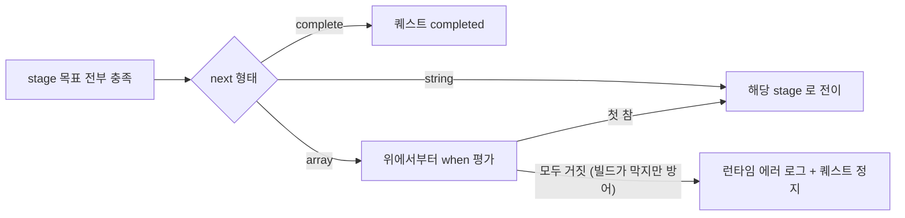
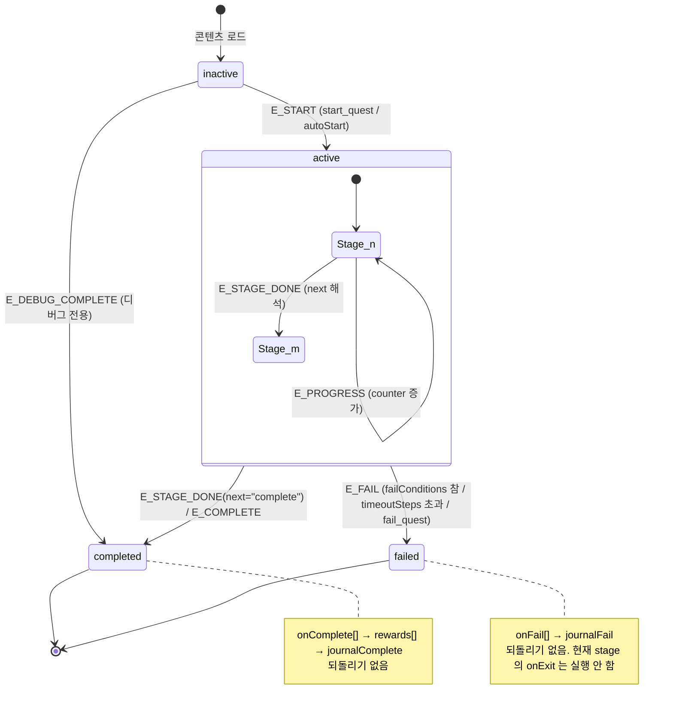
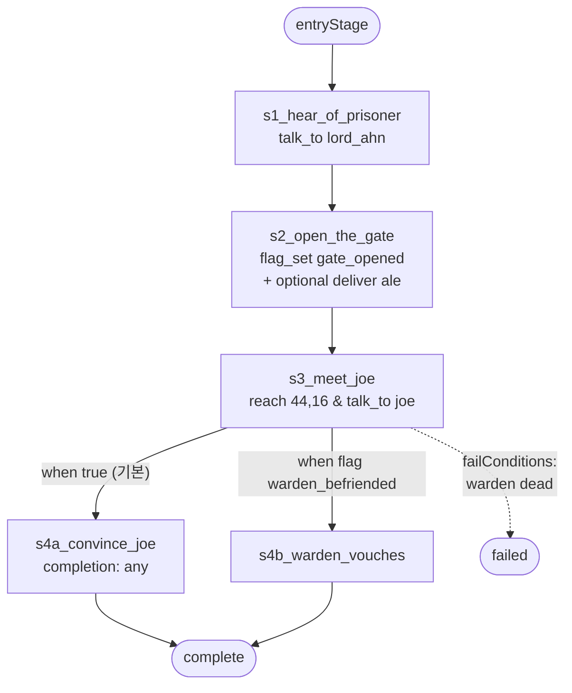
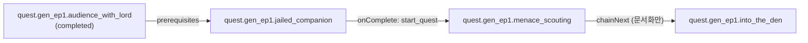

# 퀘스트 데이터 모델과 상태 기계

> `상태: 보류` — **설계는 유효하나 현재 노선에서는 구현하지 않는다.**
> 지금 노선은 원작 방식(플래그 + cm2)의 **sample-first** 다 → [`issues/MILESTONES.md`](../issues/MILESTONES.md).
> 이 장이 필요해지는 신호는 [`issues/MILESTONES.md` §5](../issues/MILESTONES.md) 에 있다. **읽고 바로 구현하지 말 것.**

> **문서 ID**: BP-23 · **상태**: 초안 · **선행 문서**: [BP-21](21_content_pack_spec.md), [BP-22](22_world_bible_model.md)
> **독자**: 런타임 구현자 · 콘텐츠 툴체인 구현자 · 생성 에이전트 프롬프트 작성자
> **한 줄 요약**: 퀘스트를 "Stage 유한 상태 기계 + 닫힌 열거형 Objective" 로 못박아 LLM 이 생성하고 빌드가 정적으로 완주 가능성을 증명할 수 있는 데이터로 만든다.

**파이프라인 구획(D-01)**: 이 장의 스키마는 **Authoring** 산출물이고, 제약 검사는 **Build**, 상태 기계 실행은 **Runtime** 이다. 런타임에는 LLM 도 네트워크도 없다.

**선행 결정**: [D-05](_meta/DECISIONS.md) Condition/Effect DSL, [D-06](_meta/DECISIONS.md) Quest 골격, [D-08](_meta/DECISIONS.md) WorldState.
**이 장은 Condition/Effect 의 `op`/`do` 를 재정의하지 않는다.** 정의는 [BP-21](21_content_pack_spec.md) 에 있고 여기서는 참조만 한다.
**앵커/액터 스키마**는 [BP-26](26_entity_registry_and_anchors.md) / [BP-22](22_world_bible_model.md) 소관이다.

**개정 이력**

| 판 | 반영 내용 |
|---|---|
| 2026-08-30 (초판) | Quest/Stage/Objective 스키마, 상태 기계, 그래프 제약, 보상 티어표, 월드 이벤트 12종 |
| **2026-08-30 (2판)** | **BP-90 미해소 3건을 이 장이 소유 장으로서 해소.** `I-09` — `defeat.params.enemy` 범위를 **`1~74`** 로 정정(GROUND_TRUTH 부록 B-1: `battle.dart:44` 의 `<= 0` 가드로 id 0 `Orc` 은 영원히 소환 불가), `QV-17`·§23.4.4·§23.6.2·§23.9.2~3·§23.12.3 동시 갱신, `Q-23-5` **종결**. `I-16` — `survive.turns` 상한을 **`counter.target` 과 같은 999** 로 통일(§23.4.3(9)·§23.4.4·§23.6.2), 근거를 §23.4.3(9) 상세에 기록. `I-18` — **payload 정본을 §23.11.1 12행 표 하나로 단일화**하고 §23.4.3 의 payload 전재를 **링크로 교체**(D-25 의 "전재 금지" 를 이 장 안에도 적용), `dialogueId` 가 **선택**인 의미를 R-23-24 로 명문화. 파생으로 [BP-91](91_appendix_worked_example.md) `W-07`(payload 정본 미정) 도 근거가 소멸 |

---

## 23.1 설계 목표와 비목표

### 23.1.1 목표 (R-23-1 ~ R-23-6)

| ID | 요구사항 | 성립 근거 / 검사 위치 |
|---|---|---|
| R-23-1 | 퀘스트 1건은 **단일 JSON 파일**로 완결되고, 다른 파일 없이도 스키마 검증을 통과해야 한다 | `hadar_content validate` (D-12) |
| R-23-2 | 임의의 퀘스트에 대해 빌드가 **"완주 가능한 입력 시퀀스가 존재한다"** 를 증명하거나 반증할 수 있어야 한다 | `QuestSolver` (D-13, [BP-34](34_headless_sim_and_solver.md)) |
| R-23-3 | 목표 진행은 **월드 이벤트 12종**(§23.11)에만 반응한다. 그 밖의 진행 경로는 없다 | `world_event_bus.dart` (D-11) |
| R-23-4 | 퀘스트 상태는 **단조(monotonic)** 하다. 되돌아가는 전이가 없다 | §23.5 불법 전이표 |
| R-23-5 | 자유 텍스트는 전부 `strings/ko.json` 의 **문자열 키**로 격리되고, 퀘스트 파일에는 표시 문자열이 직접 들어가지 않는다 | `QV-07` |
| R-23-6 | 스키마 확장은 `schemaVersion` 증가 없이는 불가능하다. 미지의 필드/열거값은 빌드 하드 실패 | `QV-01` |

### 23.1.2 비목표 — **일부러 표현하지 못하게 막는 것**

표현력을 깎아서 검증 가능성을 사는 거래다. 각 항목은 "이걸 허용하면 어떤 검사가 불가능해지는가" 로 정당화한다.

| 금지 | 왜 금지하나 | 대체 표현 |
|---|---|---|
| 임의 스크립트 실행 (`eval`, cm2 호출, Dart 콜백) | 정적 분석이 즉시 불가능해진다. cm2 는 미등록 함수가 조용히 0 을 반환해 오분기한다(GROUND_TRUTH §9) | Effect 배열 (D-05 닫힌 집합) |
| Stage 그래프의 **사이클** | 솔버의 상태 공간 탐색이 종료를 보장할 수 없다 | 반복이 필요하면 `counter.target` 을 올린다 |
| **되돌리기 전이** (completed → active 등) | 세이브/로드 시맨틱이 비결정적이 되고, 저널 히스토리가 모순된다 | 후속 퀘스트를 새로 시작(`start_quest`) |
| Objective 의 **동적 target** (`count: "var.xxx"`) | 목표량이 실행 시점에 정해지면 도달 가능성 증명이 불가능 | 상수 `target` + 분기 stage |
| Objective **완료의 취소** (아이템을 팔면 목표가 되감김) | 상태 기계가 비단조가 되어 솔버 탐색 공간이 폭발한다 | §23.4.6 **완료 래치** + `failConditions` 로 명시 |
| Stage 간 **동시 활성** (한 퀘스트가 두 stage 를 동시에) | "현재 stage" 라는 단일 값이 깨져 저널·세이브가 표현 불가 | 목표를 한 stage 안에 `completion:"any"` 로 묶는다 |
| **시간 기반 타이머** (실시간 초) | 결정론이 깨진다(D-01) | `survive(turns)` = 이동 스텝 카운트 (§23.4.5) |
| 퀘스트가 다른 퀘스트의 **stage 를 직접 설정** | 소유권이 흐려져 참조 무결성 검사가 약해진다 | `advance_quest(id, stage)` 는 허용하되 `QV-12` 로 경고 |
| 자연어 조건 (`"플레이어가 착하게 굴었으면"`) | 평가 불가 | `var_cmp` 로 수치화 (예: `var.core.party.reputation_lore`) |

### 23.1.3 트레이드오프 요약

```
표현력 ────────────────────────────────────────────► 
   cm2 스크립트        (표현력 상, 검증 0)   ← 레거시로만 존속 (D-02)
   네이티브 Dart       (표현력 상, 검증 중)  ← 특수 연출 전용
   ★ Quest JSON       (표현력 중, 검증 상)  ← AI 생성 타깃
   순수 선형 대사      (표현력 하, 검증 상)  ← 레거시 dialogLines
◄──────────────────────────────────────────── 검증 가능성
```

우리가 고른 지점은 "Stage DAG + 닫힌 Objective 열거형 + 순수 Condition" 이다.
이 지점에서만 **§23.6 의 위상 정렬 검사**와 **솔버 완주 증명**이 동시에 성립한다.

---

## 23.2 Quest 스키마 완전 명세

### 23.2.1 전 필드 표

| 필드 | 타입 | 필수 | 기본 | 제약 | 설명 |
|---|---|---|---|---|---|
| `id` | string | ✔ | — | `quest.<pack>.<slug>` (D-04). 팩 전역 유일, 불변 | 퀘스트 식별자 |
| `schemaVersion` | int | ✔ | — | `pack.json#schemaVersion` 과 일치 | 스키마 버전 |
| `title` | stringKey | ✔ | — | `strings/ko.json` 에 존재해야 함 | 저널 제목 |
| `summary` | stringKey | ✔ | — | 동상 | 저널 1줄 요약 |
| `pack` | string | ✔ | — | `id` 의 pack 세그먼트와 일치 | 소속 팩 |
| `act` | int | ✔ | — | 1~9 | 시나리오 막. 진행 순서 정렬 및 린트용 |
| `tier` | int | ✔ | — | 1~5 | 난이도/보상 등급 (§23.9) |
| `giver` | actorId? | — | null | `actors/` 에 존재 | 의뢰인 |
| `place` | placeId? | — | null | `world/places.json` 에 존재 | 주 무대 |
| `prerequisites` | Condition | — | `{"op":"true"}` | D-05 op 만 | 수주 가능 조건 |
| `autoStart` | bool | — | `false` | — | true 면 `prerequisites` 가 참이 되는 순간 자동 시작 |
| `repeatable` | bool | — | `false` | v1 은 `false` 만 허용 (`QV-14`) | 반복 수주 (v2 예약) |
| `stages` | Stage[] | ✔ | — | 1개 이상, `index` 오름차순 | 상태 기계 노드 |
| `entryStage` | stageId | — | `stages[0].id` | `stages` 안에 존재 | 시작 stage |
| `onComplete` | Effect[] | — | `[]` | D-05 do 만 | 완료 시 효과 (보상 이전에 실행) |
| `onFail` | Effect[] | — | `[]` | 동상 | 실패 시 효과 |
| `rewards` | Effect[] | — | `[]` | 동상. 보상 전용 do 만 권장(§23.9) | 완료 보상 |
| `failConditions` | Condition? | — | null | null 이면 실패 불가 퀘스트 | 실패 판정식 |
| `journal` | {stageId→stringKey} | ✔ | — | 모든 stage 를 덮어야 함 (`QV-08`) | stage 별 저널 텍스트 |
| `journalComplete` | stringKey | — | `title` | — | 완료 시 저널 마지막 줄 |
| `journalFail` | stringKey? | — | null | `failConditions` 가 있으면 필수 (`QV-09`) | 실패 시 저널 마지막 줄 |
| `tags` | string[] | — | `[]` | 소문자 slug, 최대 8개 | 검색/린트 분류 (`main`,`side`,`fetch`,`escort`,`lore`…) |
| `mutex` | questId[] | — | `[]` | 존재하는 questId | 상호 배타 퀘스트 (§23.7.3) |
| `chainNext` | questId[] | — | `[]` | 존재하는 questId | 완료 시 개시 후보 (문서화용, 실제 개시는 `start_quest`) |
| `generatedBy` | string? | — | null | — | 생성 에이전트/모델 식별. 감사용 |

**stringKey 타입**: `string` 이되 반드시 `strings/ko.json` 의 키. 관례 `quest.<pack>.<slug>.<part>`.

### 23.2.2 완전 예시 — `quest.gen_ep1.jailed_companion`

로어성(`TOWN1`, displayName "로어성")에서 성주 로드안이 감옥 문을 열어 주고, 그 안에 갇힌 Joe 를 동료로 삼는 퀘스트.
레거시 `town1_map_script.dart:74` 의 정수 플래그 33/34 를 이름 있는 플래그로 옮긴 실사례다.

```jsonc
{
  "id": "quest.gen_ep1.jailed_companion",
  "schemaVersion": 1,
  "title": "quest.gen_ep1.jailed_companion.title",       // "감옥의 사내"
  "summary": "quest.gen_ep1.jailed_companion.summary",
  "pack": "gen_ep1",
  "act": 1,
  "tier": 1,
  "giver": "npc.core.lord_ahn",                          // 로드안 — 로어성의 성주
  "place": "place.core.lore_castle",                     // TOWN1 이 렌더하는 장소
  "autoStart": false,

  // 수주 조건: 로어성에 들어와 있고, 아직 아무도 동료로 없고,
  // 이전 퀘스트(성주 알현)를 마쳤을 것.
  "prerequisites": {
    "op": "and",
    "args": [
      { "op": "quest_state", "id": "quest.gen_ep1.audience_with_lord", "state": "completed" },
      { "op": "not", "arg": { "op": "flag", "id": "flag.gen_ep1.party.joe_recruited" } }
    ]
  },

  "entryStage": "s1_hear_of_prisoner",

  "stages": [
    {
      "id": "s1_hear_of_prisoner",
      "index": 0,
      "title": "quest.gen_ep1.jailed_companion.s1.title",
      "journal": "quest.gen_ep1.jailed_companion.s1.journal",
      "completion": "all",
      "onEnter": [
        { "do": "journal", "entryKey": "quest.gen_ep1.jailed_companion.s1.journal" }
      ],
      "onExit": [],
      "objectives": [
        {
          "id": "o_talk_lord",
          "kind": "talk_to",
          "params": { "actor": "npc.core.lord_ahn" },
          "hidden": false
        }
      ],
      // 단일 전이
      "next": "s2_open_the_gate"
    },
    {
      "id": "s2_open_the_gate",
      "index": 1,
      "title": "quest.gen_ep1.jailed_companion.s2.title",
      "journal": "quest.gen_ep1.jailed_companion.s2.journal",
      "completion": "all",
      "onEnter": [],
      "onExit": [
        // 문지기가 문을 여는 연출은 대화 쪽(BP-24)에서 이미 change_tile 로 처리된다.
        // 여기서는 상태만 확정.
        { "do": "set_flag", "id": "flag.gen_ep1.jailed_companion.gate_opened" }
      ],
      "objectives": [
        {
          "id": "o_gate_flag",
          "kind": "flag_set",
          "params": { "flag": "flag.gen_ep1.jailed_companion.gate_opened" }
        },
        {
          // 선택 목표: 문지기에게 술 한 잔 사주면 나중에 평판이 오른다.
          "id": "o_buy_drink",
          "kind": "deliver",
          "params": { "item": "item.core.lore_ale", "actor": "npc.core.lore_gate_warden" },
          "optional": true,
          "hidden": true
        }
      ],
      "next": "s3_meet_joe"
    },
    {
      "id": "s3_meet_joe",
      "index": 2,
      "title": "quest.gen_ep1.jailed_companion.s3.title",
      "journal": "quest.gen_ep1.jailed_companion.s3.journal",
      "completion": "all",
      "onEnter": [],
      "onExit": [],
      "objectives": [
        {
          "id": "o_reach_cell",
          "kind": "reach",
          // 좌표 형태. town1_map_script.dart 가 열어 주는 (44,14) 감옥문 안쪽.
          "params": { "map": "TOWN1", "x": 44, "y": 16, "radius": 2 }
        },
        {
          "id": "o_talk_joe",
          "kind": "talk_to",
          "params": { "actor": "npc.core.joe" }
        }
      ],
      // 조건 분기: 술을 사줬으면 문지기가 증언해 주는 짧은 우회로가 열린다.
      "next": [
        {
          "when": { "op": "flag", "id": "flag.gen_ep1.jailed_companion.warden_befriended" },
          "go": "s4b_warden_vouches"
        },
        { "when": { "op": "true" }, "go": "s4a_convince_joe" }
      ]
    },
    {
      "id": "s4a_convince_joe",
      "index": 3,
      "title": "quest.gen_ep1.jailed_companion.s4a.title",
      "journal": "quest.gen_ep1.jailed_companion.s4a.journal",
      "completion": "any",                 // 둘 중 하나만 충족하면 됨
      "onEnter": [],
      "onExit": [],
      "objectives": [
        {
          "id": "o_choose_trust",
          "kind": "choose",
          "params": { "dialogue": "dlg.gen_ep1.joe_cell", "choice": "c_trust_him" }
        },
        {
          "id": "o_bring_proof",
          "kind": "acquire",
          "params": { "item": "item.core.wardens_seal", "count": 1 },
          "counter": { "target": 1 }
        }
      ],
      "next": "complete"
    },
    {
      "id": "s4b_warden_vouches",
      "index": 4,
      "title": "quest.gen_ep1.jailed_companion.s4b.title",
      "journal": "quest.gen_ep1.jailed_companion.s4b.journal",
      "completion": "all",
      "onEnter": [],
      "onExit": [],
      "objectives": [
        {
          "id": "o_talk_warden_again",
          "kind": "talk_to",
          "params": { "actor": "npc.core.lore_gate_warden" }
        }
      ],
      "next": "complete"
    }
  ],

  // 실패 가능 퀘스트: 문지기가 죽으면(전투 이벤트가 npc_state 를 dead 로) 되돌릴 수 없다.
  "failConditions": {
    "op": "npc_state", "id": "npc.core.lore_gate_warden", "state": "dead"
  },

  "onComplete": [
    { "do": "set_flag", "id": "flag.gen_ep1.party.joe_recruited" },
    { "do": "set_npc_state", "id": "npc.core.joe", "state": "companion" }
  ],
  "onFail": [
    { "do": "set_npc_state", "id": "npc.core.joe", "state": "lost" }
  ],
  "rewards": [
    { "do": "grant_exp", "amount": 900 },        // tier 1 권장 범위 200~1500 (§23.9)
    { "do": "add_gold", "delta": 250 },          // tier 1 권장 범위 100~400
    { "do": "give_item", "id": "item.core.rusty_key", "count": 1 },
    { "do": "add_var", "id": "var.core.party.reputation_lore", "delta": 5 }
  ],

  "journal": {
    "s1_hear_of_prisoner": "quest.gen_ep1.jailed_companion.s1.journal",
    "s2_open_the_gate":    "quest.gen_ep1.jailed_companion.s2.journal",
    "s3_meet_joe":         "quest.gen_ep1.jailed_companion.s3.journal",
    "s4a_convince_joe":    "quest.gen_ep1.jailed_companion.s4a.journal",
    "s4b_warden_vouches":  "quest.gen_ep1.jailed_companion.s4b.journal"
  },
  "journalComplete": "quest.gen_ep1.jailed_companion.done",
  "journalFail":     "quest.gen_ep1.jailed_companion.failed",

  "tags": ["main", "act1", "recruit"],
  "mutex": [],
  "chainNext": ["quest.gen_ep1.menace_scouting"],
  "generatedBy": "draft-agent@2026-08-30"
}
```

### 23.2.3 레거시 대응표 (이 예시가 대체하는 것)

| 레거시 | 위치 | 신규 표현 |
|---|---|---|
| `isFlagSet(33)` | `town1_map_script.dart:76` | `flag.gen_ep1.jailed_companion.gate_opened` (+ `legacyFlagMap: {…: 33}`, D-04) |
| `isFlagSet(34)` | `town1_map_script.dart:81` | `flag.gen_ep1.party.joe_recruited` |
| `game.map?.setTile(44, 14, 0)` | `town1_map_script.dart:79` | `{"do":"change_tile","map":"TOWN1","x":44,"y":14,"tile":0}` |
| `isOn(45, 8)` / `isOn(50, 27)` 좌표 하드코딩 | 동 파일 | 앵커 `anchor.core.town1_gate_warden` / `…_lord_ahn` (D-09, [BP-26](26_entity_registry_and_anchors.md)) |

---

## 23.3 Stage 스키마

### 23.3.1 전 필드 표

| 필드 | 타입 | 필수 | 기본 | 제약 | 설명 |
|---|---|---|---|---|---|
| `id` | string | ✔ | — | 퀘스트 내 유일, `^[a-z][a-z0-9_]{2,31}$` | stage 식별자 (퀘스트 지역 이름공간) |
| `index` | int | ✔ | — | 0부터, 퀘스트 내 유일, 연속일 필요 없음 | 저널 정렬 및 진행률 계산 기준 |
| `title` | stringKey | ✔ | — | — | 저널의 현재 목표 제목 |
| `journal` | stringKey | ✔ | — | `Quest.journal[stage.id]` 과 동일해야 함 (`QV-08`) | 저널 본문 |
| `objectives` | Objective[] | ✔ | — | 1개 이상 (`QV-05`) | 목표 목록 |
| `completion` | `"all"` \| `"any"` | — | `"all"` | — | 전이 판정 방식 (§23.3.3) |
| `onEnter` | Effect[] | — | `[]` | D-05 | 진입 효과 |
| `onExit` | Effect[] | — | `[]` | D-05 | 이탈 효과 |
| `next` | 3형태 | ✔ | — | §23.3.2 | 전이 규칙 |
| `timeoutSteps` | int? | — | null | 1~99999 | 이 stage 진입 후 N 스텝 내 미완료면 `failConditions` 와 동일하게 실패 (§23.8.4) |

### 23.3.2 `next` 의 3형태

| 형태 | JSON | 의미 | 빌드 검사 |
|---|---|---|---|
| 단일 stageId | `"next": "s2_open_the_gate"` | 무조건 그 stage 로 | 대상 stage 존재 (`QV-03`) |
| 종료 | `"next": "complete"` | 퀘스트 완료로 전이 | 최소 1개의 stage 가 `"complete"` 에 도달 가능해야 함 (`QV-04`) |
| 조건 분기 | `"next": [{"when": Condition, "go": stageId\|"complete"}, …]` | **위에서부터 첫 참**을 취한다 | 배열 마지막 원소는 `{"op":"true"}` 여야 함 (`QV-06`) |



> **런타임 방어**: 빌드가 `QV-06` 으로 막지만, 손상된 번들에서 모든 `when` 이 거짓이면
> 런타임은 **전이하지 않고 stage 를 유지**하며 `[QUEST][ERR]` 로그를 남긴다. 절대 crash 하지 않는다.

### 23.3.3 `completion` 시맨틱

| 값 | 전이 조건 | `optional:true` 목표 취급 |
|---|---|---|
| `"all"` | `optional` 이 아닌 목표가 **전부** 완료 | 전이 판정에서 제외. 완료 여부는 저널·보상 분기에서만 참조 |
| `"any"` | `optional` 이 아닌 목표 중 **하나라도** 완료 | 동상 |

- `completion:"any"` + 모든 목표가 `optional:true` → `QV-05` 하드 실패 (전이 불가 stage).
- `hidden:true` 목표는 저널에 표시하지 않을 뿐, 전이 판정에는 정상 참여한다.

### 23.3.4 진입·이탈 효과의 실행 순서

```
stage 전이 1회 = 다음 순서로 원자적 실행 (중간에 다른 월드 이벤트를 처리하지 않는다)

  1. prev.onExit[]        순서대로 apply
  2. WorldState.quests[q].stage ← next
  3. WorldState.quests[q].counters ← 새 stage 의 objective 로 초기화 (전부 0)
  4. journal 엔트리 append  (questId, stageId, entryKey, at)
  5. next.onEnter[]       순서대로 apply
  6. 재평가 루프: 5 에서 발생한 상태 변화로 새 stage 가 즉시 충족되면 1 로 돌아간다
                  (최대 8회, 초과 시 QV-13 위반으로 간주하고 정지 + 에러 로그)
```

- **주의**: `onEnter` 가 `set_flag` 를 하고 그 stage 의 목표가 같은 `flag_set` 이면 즉시 자동 전이한다.
  이건 "연출 없는 통과 stage" 를 만드는 정당한 패턴이지만, 사이클이 되면 6번의 8회 상한에 걸린다.
- **주의**: `onExit` 는 **전이할 때만** 실행된다. 퀘스트가 실패하면 현재 stage 의 `onExit` 는 **실행되지 않고** `Quest.onFail` 만 실행된다.

---

## 23.4 Objective 스키마와 kind 별 명세

### 23.4.1 공통 필드

| 필드 | 타입 | 필수 | 기본 | 설명 |
|---|---|---|---|---|
| `id` | string | ✔ | — | stage 내 유일. `^o_[a-z0-9_]{1,29}$` 관례 |
| `kind` | enum(9종) | ✔ | — | D-06 확정 집합. 그 외 값은 `QV-02` 하드 실패 |
| `params` | object | ✔ | — | kind 별 스키마 (§23.4.3) |
| `optional` | bool | — | `false` | true 면 stage 전이 판정에서 제외 |
| `hidden` | bool | — | `false` | true 면 저널 미표시 (진행률 분모에서도 제외) |
| `counter` | `{target:int}`? | — | kind 기본값 | 필요 진행 횟수. **1 이상 999 이하** — 이 상한이 전 kind 공통이며 kind 별 기본값도 이 범위를 벗어날 수 없다(`I-16`, §23.4.3(9)) |
| `label` | stringKey? | — | 자동 생성 | 저널에 표시할 목표 문구. 생략 시 §23.10.3 자동 문구 |

### 23.4.2 kind 분류 — 누적형 vs 상태형

| 분류 | kind | counter 증가 방식 | 초기 스캔 |
|---|---|---|---|
| **누적형** | `talk_to`, `deliver`, `defeat`, `choose`, `survive` | 월드 이벤트 1건 = +1 | 없음 (stage 진입 시 0) |
| **상태형** | `reach`, `acquire`, `flag_set`, `var_reach` | 이벤트 수신 시 WorldState 를 다시 읽어 **절대값**으로 설정 | stage 진입 시 1회 즉시 평가 |

> **상태형의 초기 스캔이 필요한 이유**: 플레이어가 목표를 받기 *전에* 이미 아이템을 갖고 있거나 그 자리에 서 있을 수 있다.
> 스캔이 없으면 "이미 가진 열쇠를 다시 주우러 가야 하는" 데드락이 생긴다. `QuestSolver` 는 이 스캔을 전제로 탐색한다.

### 23.4.3 kind 별 완전 명세

> **payload 는 여기 적지 않는다 — 정본은 §23.11.1 의 12행 표 하나다** (`I-18` 해소).
> 초판은 아래 표의 "진행 이벤트" 칸에 payload 를 **괄호로 다시 적었고**, 그 결과 같은 장 안에서
> `talk` payload 가 `{actorId, dialogueId, map, x, y}`(여기)와 `{actorId, dialogueId?, map, x, y}`(§23.11.1)로
> **`?` 유무가 갈렸다.** D-25 가 결정 문서에 금지한 "소유 장의 스키마를 옮겨 적기" 와 **같은 종류의 오류가
> 한 장 안에서 재현된 것**이므로, 이 절은 payload 를 **인용하지 않고 §23.11.1 을 가리킨다.**
> "진행 조건" 칸이 `payload.<필드>` 를 참조하는 것은 필드 **사용**이지 정의가 아니므로 그대로 둔다.

- **R-23-24** (`I-18` 해소) 이 장에서 payload 를 **정의하는 곳은 §23.11.1 뿐**이다. 다른 절·다른 장이
  payload 필드를 나열하는 것은 금지하며, 필요하면 §23.11.1 을 링크한다. 검수는 "일치하는가" 가 아니라
  **"§23.4.3 이 payload 를 다시 적고 있지 않은가"** 를 본다(D-25 4항의 같은 검사).

#### (1) `talk_to` — NPC 와 대화

| 항목 | 값 |
|---|---|
| params | `{ "actor": actorId }` |
| counter 기본 | `{target: 1}` |
| 진행 이벤트 | `talk` (payload 정본 §23.11.1 #1) |
| 진행 조건 | `payload.actorId == params.actor` — **`payload.dialogueId` 는 보지 않는다.** 대화가 붙지 않은 actor 앵커도 `talk` 을 발행하므로(R-23-25) 이 목표는 "말을 걸었다" 만으로 진행한다 |
| 카운터 | 대화 **1회당 1** (같은 NPC 반복 대화도 누적. target>1 이면 "세 번 찾아가기" 표현 가능) |
| 완료 판정 | 이벤트 처리 직후, 대화 그래프가 끝난 뒤 (§23.4.7) |
| 실패 조건 | 없음. NPC 소멸은 `failConditions` 의 `npc_state` 로 별도 표현 |
| 예시 | `{"id":"o_talk_lord","kind":"talk_to","params":{"actor":"npc.core.lord_ahn"}}` |
| 빌드 검사 | actorId 존재(`QV-03`), 해당 actor 가 어떤 앵커에도 배치되지 않았으면 `QV-10` 경고 |

#### (2) `reach` — 장소/좌표 도달

| 항목 | 값 |
|---|---|
| params | `{ "place": placeId }` **또는** `{ "map": string, "x": int, "y": int, "radius": int }` (둘 중 정확히 하나) |
| radius | 기본 0. 체비셰프 거리(`max(|dx|,|dy|) <= radius`) |
| counter 기본 | `{target: 1}` |
| 진행 이벤트 | `step_tile`, `map_changed`, `enter_place` |
| 진행 조건 | place 형: `enter_place.placeId == params.place` / 좌표 형: `step_tile` 또는 `map_changed` 후 파티 좌표가 반경 안 |
| 카운터 | 상태형. 반경 안이면 target, 밖이면 이전 값 유지(**래치**, §23.4.6) |
| 완료 판정 | 이벤트 처리 직후. stage 진입 시 초기 스캔 있음 |
| 실패 조건 | 없음 |
| 예시 | `{"id":"o_reach_cell","kind":"reach","params":{"map":"TOWN1","x":44,"y":16,"radius":2}}` |
| 빌드 검사 | 좌표 형: 해당 맵이 `MapInfos.json` 에 있고 (x,y) 가 맵 범위 안이며 **통행 가능 타일**이어야 함(`QV-11`, 맵 에디터 `/api/ai/maps/{f}/passability` 재사용). place 형: `places.json` 존재 |

#### (3) `acquire` — 아이템 획득

| 항목 | 값 |
|---|---|
| params | `{ "item": itemId, "count": int }` (count 기본 1) |
| counter 기본 | `{target: params.count}` — 둘 다 있으면 `QV-05` 로 일치 강제 |
| 진행 이벤트 | `item_gained`, `item_lost` |
| 진행 조건 | 이벤트 발생 시 `WorldState.inventory[item]` 을 다시 읽어 `min(보유량, target)` 을 counter 로 |
| 카운터 | 상태형 + 래치. 완료 후 아이템을 잃어도 counter 는 target 을 유지 |
| 완료 판정 | 이벤트 처리 직후. stage 진입 시 초기 스캔 있음 |
| 실패 조건 | 아이템 소실로 진행이 불가해지는 상황은 `failConditions` 에 명시적으로 쓴다 (기본은 실패 아님) |
| 예시 | `{"id":"o_bring_proof","kind":"acquire","params":{"item":"item.core.wardens_seal","count":1}}` |
| 빌드 검사 | itemId 존재. **해당 아이템을 주는 `give_item` 이 콘텐츠 어딘가에 존재해야 함**(`QV-15`) — 없으면 획득 불가 목표 |

#### (4) `deliver` — 아이템 전달

| 항목 | 값 |
|---|---|
| params | `{ "item": itemId, "actor": actorId, "count": int }` (count 기본 1) |
| counter 기본 | `{target: params.count}` |
| 진행 이벤트 | `talk` (전달은 대화 안의 `take_item` Effect 로 일어난다) |
| 진행 조건 | 같은 상호작용 안에서 `talk(actorId==params.actor)` **그리고** `item_lost(item==params.item, delta)` 가 함께 관측되면 `delta` 만큼 +1 |
| 카운터 | 누적형 |
| 완료 판정 | 대화 그래프 종료 직후 (한 상호작용의 이벤트를 묶어 판정, §23.4.7) |
| 실패 조건 | 없음 |
| 예시 | `{"id":"o_buy_drink","kind":"deliver","params":{"item":"item.core.lore_ale","actor":"npc.core.lore_gate_warden"},"optional":true}` |
| 빌드 검사 | 해당 actor 의 대화 그래프 어딘가에 `{"do":"take_item","id":<item>}` 이 존재해야 함 (`QV-16`). 없으면 전달할 방법이 없음 |

#### (5) `defeat` — 적 격파

| 항목 | 값 |
|---|---|
| params | `{ "encounter": encounterId }` **또는** `{ "enemy": int, "count": int }` (둘 중 하나) |
| enemy | `enemy_data.dart` 의 정수 id (**1~74**). 이름이 아니라 id (`QV-17` 이 범위 검사). **하한이 1인 이유는 아래 상세** |
| counter 기본 | `{target: params.count ?? 1}` |
| 진행 이벤트 | `battle_won` (payload 정본 §23.11.1 #4) |
| 진행 조건 | encounter 형: `payload.encounterId` 일치 → +1 / enemy 형: `payload.enemyIds` 안의 일치 개수만큼 +N |
| 카운터 | 누적형 |
| 완료 판정 | `HDBattle.gotoEndBattle` 의 승리 분기가 끝난 뒤 (보상 지급 후) |
| 실패 조건 | 전멸(`battle_lost`)은 게임오버 흐름이 처리하므로 퀘스트 실패로 보지 않는다 |
| 예시 | `{"id":"o_clear_den","kind":"defeat","params":{"enemy":74,"count":1}}` (Neo-Necromancer 1기) |
| 빌드 검사 | **enemy id 1~74**, encounterId 존재. `tier` 대비 적 레벨이 ±2 밖이면 밸런스 경고 (§23.9.4) |

**상세 — `enemy` 하한은 0 이 아니라 1 이다** (`I-09` 해소, 심각도 높음)

초판은 `0~74` 로 썼다. **틀렸다.** GROUND_TRUTH [부록 B-1](_meta/GROUND_TRUTH.md) 이 확정한 실측:

```dart
// hadar2026_app/lib/application/battle.dart:43-46
void registerEnemy(int enemyTableId) {
  if (enemyTableId <= 0 || enemyTableId >= enemyTable.length) return;
  enemies.add(HDEnemy(enemyTable[enemyTableId]));
}
```

- `enemyTable` 은 **75 엔트리(id 0~74)** 지만 `<= 0` 가드 때문에 **id 0(`Orc`)은 어떤 경로로도 전투에 등장하지 않는다.**
  cm2 의 `Battle::RegisterEnemy(0)` 도 같은 가드에 걸려 **조용히 무시**된다(부록 F-1 의 침묵 실패 계열).
- 따라서 `{"kind":"defeat","params":{"enemy":0}}` 는 **스키마·린트를 통과하고 런타임에서 영원히 진행되지 않는다.**
  `battle_won.enemyIds` 에 0 이 실릴 일이 없으므로 counter 가 절대 오르지 않고, 그 목표를 담은 스테이지는
  **영구 교착**한다. 이것이 이 불일치의 심각도가 "높음" 인 이유다 — 빌드가 통과시키는 데드락이다.
- **확정: 실사용 가능한 적은 74종, 유효 id 는 `1~74`.** `QV-17` 의 범위 검사도 `1 <= enemy <= 74` 다.
  이로써 [BP-33](33_validation_and_lint.md) `V-L2-018` 과 [BP-21 R-21-57](21_content_pack_spec.md)(참조 전용 타입 `enemy`,
  유효 id 1~74)과 **세 장이 같은 범위**를 말한다. `Q-23-5` 종결(§23.14.3).
- **보상 티어표(§23.9)에 대한 파급은 수치 0**임을 검산했다 — §23.9.2 의 각주 참조.
  전투 보상식은 `max(1, ((id+1)^3) ÷ 8)` 이므로 id 0 의 단일 exp 는 1 이고 id 1 도 1 이다.
  레벨 1 대역의 단일 exp 범위(1~8)·3기 exp(3~24)·3기 골드(15)가 **id 0 을 빼도 그대로**다.
  즉 이 정정은 **id 열거만 바꾸고 권장 보상 범위는 바꾸지 않는다.**

#### (6) `flag_set` — 이름 있는 플래그

| 항목 | 값 |
|---|---|
| params | `{ "flag": flagId }` |
| counter 기본 | `{target: 1}` |
| 진행 이벤트 | `flag_changed` (payload 정본 §23.11.1 #7) |
| 진행 조건 | `payload.flagId == params.flag && payload.value == true` |
| 카운터 | 상태형 + 래치 |
| 완료 판정 | 이벤트 처리 직후. stage 진입 시 초기 스캔 있음 |
| 실패 조건 | 없음 |
| 예시 | `{"id":"o_gate_flag","kind":"flag_set","params":{"flag":"flag.gen_ep1.jailed_companion.gate_opened"}}` |
| 빌드 검사 | 해당 flagId 를 `set_flag` 하는 Effect 가 콘텐츠 어딘가에 있어야 함 (`QV-15`) |

#### (7) `var_reach` — 수치 도달

| 항목 | 값 |
|---|---|
| params | `{ "var": varId, "cmp": ">=", "value": int }` (`cmp` 는 D-05 `var_cmp` 와 동일 6종, 기본 `">="`) |
| counter 기본 | `{target: 1}` (충족/미충족의 이진값) |
| 진행 이벤트 | `var_changed` (payload 정본 §23.11.1 #8) |
| 진행 조건 | `payload.varId == params.var` 이고 비교식이 참 |
| 카운터 | 상태형 + 래치 |
| 완료 판정 | 이벤트 처리 직후. stage 진입 시 초기 스캔 있음 |
| 실패 조건 | 없음 |
| 예시 | `{"id":"o_rep","kind":"var_reach","params":{"var":"var.core.party.reputation_lore","cmp":">=","value":10}}` |
| 빌드 검사 | 해당 varId 를 `set_var`/`add_var` 하는 Effect 가 존재하고, **도달 가능한 최대값 ≥ value** 여야 함 (`QV-18`, 정적 상한 계산) |

#### (8) `choose` — 특정 선택지 선택

| 항목 | 값 |
|---|---|
| params | `{ "dialogue": dialogueId, "choice": choiceId }` |
| counter 기본 | `{target: 1}` |
| 진행 이벤트 | `dialogue_choice` (payload 정본 §23.11.1 #9) |
| 진행 조건 | 둘 다 일치 |
| 카운터 | 누적형 |
| 완료 판정 | 선택 확정 직후, 선택지의 `effects` 를 적용한 뒤 |
| 실패 조건 | 없음. **반대 선택지를 고른 것을 실패로 만들고 싶으면** `failConditions` 에 그 선택의 플래그를 쓴다 |
| 예시 | `{"id":"o_choose_trust","kind":"choose","params":{"dialogue":"dlg.gen_ep1.joe_cell","choice":"c_trust_him"}}` |
| 빌드 검사 | dialogueId 존재 + 그 대화 그래프 안에 해당 choiceId 존재 + **그 선택지가 도달 가능**해야 함 ([BP-24](24_dialogue_model.md) `DV-04` 와 공유) |

#### (9) `survive` — N 스텝 버티기

| 항목 | 값 |
|---|---|
| params | `{ "turns": int }` |
| **"turn" 의 정의** | **파티의 이동 1보 = `step_tile` 이벤트 1건**. 실시간 초가 아니다(결정론, D-01) |
| counter 기본 | `{target: params.turns}` |
| 진행 이벤트 | `step_tile` |
| 진행 조건 | stage 진입 이후의 `step_tile` 마다 +1 |
| 카운터 | 누적형 |
| 완료 판정 | counter ≥ target 인 `step_tile` 처리 직후 |
| 실패 조건 | 이 목표만으로는 실패하지 않는다. "버티는 동안 죽으면 실패" 는 `failConditions` 에 쓴다 |
| 예시 | `{"id":"o_hold_line","kind":"survive","params":{"turns":40}}` |
| 빌드 검사 | **`turns` 1~999**(§23.4.1 `counter.target` 과 같은 상한). 40 미만이면 "체감이 없다" 경고, 500 초과면 "지루하다" 경고 (soft, D-15) |

**상세 — 상한을 999 로 통일했다** (`I-16` 해소)

초판은 `counter.target` 을 **1~999**(§23.4.1)로, `survive.turns` 를 **1~9999** 로 썼다.
`survive` 는 누적형이고 counter 기본값이 `{target: params.turns}` 이므로
**`turns = 2000` 인 목표는 두 제약을 동시에 만족할 수 없다** — 스키마상 `params` 는 통과하는데
그것이 유도하는 `counter` 가 스키마 위반이 된다. 어느 한쪽으로 통일해야 한다.

**`counter.target` 쪽(999)을 정본으로 채택한다.** 근거 4가지 —

| # | 근거 |
|---|---|
| 1 | **`counter` 가 더 일반적인 제약이다.** 상한은 9종 kind 전부에 걸리는 공통 필드에 있고, `turns` 는 그 기본값을 만드는 kind 하나의 인자다. 특수한 쪽이 일반적인 쪽을 넘어서는 구조는 어느 kind 를 추가해도 같은 사고를 재생산한다. 반대로 999 → 9999 로 완화하면 `acquire.count`/`deliver.count`(둘 다 1~999)까지 함께 올려야 하고, 그 두 값은 **인벤토리 `maxStack` 최대 99**([BP-42 §2.4](42_item_and_inventory.md))를 이미 크게 넘는다 |
| 2 | **플레이 시간.** `turn` 은 실시간 초가 아니라 **파티 이동 1보**다. 이 장 자신이 `500` 초과에 "지루하다" soft 경고를 걸어 두었으므로, hard 상한 9999 는 soft 경고선의 **20배**다. 규칙이 스스로 못 쓰게 한 대역에 하드 상한을 두는 것은 의미가 없다. 999보는 [BP-91](91_appendix_worked_example.md) 예제의 전 구간(61보)의 **16배**이고, 원작 최대 맵 100×100 을 감안해도 한 스테이지 분량으로 충분히 크다 |
| 3 | **콘솔 표시.** 진행률은 `n/target` 으로 progress 레인에 1줄 요약된다(§23.10.5). 512px 폭 콘솔에서 `999/999`(7자)와 `9999/9999`(9자)는 둘 다 들어가지만, 저널 목표 줄은 자동 문구(§23.10.3)와 한 줄을 나눠 쓰므로 자릿수를 늘릴 이유가 없다 |
| 4 | **솔버 탐색 비용.** counter 값은 `QuestSolver` 상태의 구성 요소다(D-13). `survive` counter 는 `step_tile` 마다 +1 이므로 상한이 곧 **그 목표 하나가 만드는 상태 축의 길이**이며, 도미넌스 가지치기가 걸려도 증인 액션열이 상한만큼 길어진다. 999 는 [BP-34](34_headless_sim_and_solver.md) 의 "솔버 1건 < 5s" 예산 안이지만 9999 는 근거가 없다 |

> **완화는 승격이 필요 없다**([BP-21 §7.2](21_content_pack_spec.md)): 나중에 999 가 부족해지면 상한만 넓히면 되고
> `schemaVersion` 을 올리지 않는다. 반대 방향(강화)이 승격 사항이므로, **지금 좁혀 두는 쪽이 되돌리기 싸다.**

### 23.4.4 params 스키마 요약 (기계 판독용)

```jsonc
{
  "talk_to":   { "actor": "actorId" },
  "reach":     { "oneOf": [ {"place":"placeId"},
                            {"map":"string","x":"int","y":"int","radius":"int?=0"} ] },
  "acquire":   { "item": "itemId", "count": "int?=1" },
  "deliver":   { "item": "itemId", "actor": "actorId", "count": "int?=1" },
  "defeat":    { "oneOf": [ {"encounter":"encounterId"},
                            {"enemy":"int(1..74)","count":"int?=1"} ] },
  "flag_set":  { "flag": "flagId" },
  "var_reach": { "var": "varId", "cmp": "string?='>='", "value": "int" },
  "choose":    { "dialogue": "dialogueId", "choice": "choiceId" },
  "survive":   { "turns": "int(1..999)" }
}
```

### 23.4.5 완료 판정 시점 — 한 상호작용 = 한 배치(batch)

`HDTileEventDispatcher.check` 는 재진입 가드(`_isScriptRunning`)로 **한 번에 하나의 상호작용**만 허용한다
(`tile_event_dispatcher.dart:49`, D-10 이 이 의미를 문서화하도록 요구). 이걸 그대로 목표 판정 단위로 쓴다.

```
한 상호작용(= beginNarrative … endNarrative 1쌍) 동안:
  1. 발생한 월드 이벤트를 큐에 모은다 (즉시 판정하지 않는다)
  2. endNarrative 직전에 큐를 순서대로 흘려 목표 카운터를 갱신한다
  3. 갱신 결과로 stage 전이가 생기면 §23.3.4 의 원자적 전이를 수행
  4. 전이로 열린 저널 갱신 알림을 progress 로그에 1줄 낸다 (BP-41)
```

**왜 배치인가**: `deliver` 는 `talk` + `item_lost` 두 이벤트의 **동시 발생**을 봐야 한다.
즉시 판정하면 순서에 따라 놓친다. 또 대화 중간에 stage 가 바뀌어 저널 알림이 대사를 덮는 사고를 막는다.

**예외**: `battle_won` 은 전투가 상호작용 밖에서도 일어나므로(랜덤 인카운터) 전투 종료 직후 단독 배치로 처리한다.

### 23.4.6 완료 래치 (Completion Latch)

> **규칙 R-23-4 의 구현**: 어떤 objective 든 `counter >= target` 이 된 순간
> `WorldState.quests[q].counters[objId]` 를 `target` 으로 **고정**하고 이후 어떤 이벤트로도 낮추지 않는다.

| 상황 | 래치 없음 | **래치 있음 (채택)** |
|---|---|---|
| `acquire(rusty_key)` 완료 후 열쇠를 씀 | 목표가 되감김 → 플레이어 혼란 | 목표 유지. 열쇠 사용은 다음 stage 의 전제 |
| `flag_set` 후 다른 스크립트가 `clear_flag` | stage 가 이전으로 돌아감(불법 전이) | 목표 유지 |
| `reach` 후 그 자리를 떠남 | 계속 서 있어야 함 | 목표 유지 |
| 솔버 탐색 | 상태가 비단조 → 방문 집합이 무의미 | 단조 → 도달 집합이 확장만 함, **종료 보장** |

래치의 대가: "아이템을 잃으면 퀘스트가 막힌다" 를 자동으로 표현하지 못한다.
그건 `failConditions` 에 **명시적으로** 써야 한다. 명시 강제가 곧 검증 가능성이다.

### 23.4.7 진행률 계산

```
stage 진행률 = (완료된 non-optional & non-hidden 목표 수) / (전체 non-optional & non-hidden 목표 수)
퀘스트 진행률 = (현재 stage.index) / (도달 가능한 최대 index + 1)     ← 분기가 있으면 근사치
목표 개별 진행률 = counter / target                                   ← target>1 일 때만 "3/5" 로 표시
```

표시 규칙은 [BP-41](41_journal_ui_spec.md) 소관. 여기서는 **계산식만** 확정한다.

---

## 23.5 상태 기계 정의

### 23.5.1 상태 다이어그램



### 23.5.2 전이표 (현재상태 × 사건 → 다음상태 + 효과)

| # | 현재 상태 | 사건 | 조건 | 다음 상태 | 효과 (순서대로) |
|---|---|---|---|---|---|
| T1 | `inactive` | `E_START` | `prerequisites` 참 | `active(entryStage)` | `quests[q]={state:active, stage:entryStage, counters:0, startedAt:now}` → 상태형 목표 초기 스캔 → `entryStage.onEnter[]` → 저널 append |
| T2 | `inactive` | `E_START` | `prerequisites` 거짓 | `inactive` (변화 없음) | `[QUEST][WARN] prerequisites unmet` 로그. **에러 아님** |
| T3 | `inactive` | `E_AUTOSTART_TICK` | `autoStart && prerequisites` 참 | `active(entryStage)` | T1 과 동일 |
| T4 | `active` | `E_WORLD_EVENT` | 목표 배치 판정 결과 counter 증가 | `active` (동일 stage) | counter 갱신 + 래치. 진행률 변화 시 progress 1줄 |
| T5 | `active` | `E_STAGE_DONE` | `completion` 충족 && `next` = stageId | `active(next)` | §23.3.4 원자 전이 |
| T6 | `active` | `E_STAGE_DONE` | `completion` 충족 && `next` = `"complete"` | `completed` | `stage.onExit[]` → `onComplete[]` → `rewards[]` → `journalComplete` → `updatedAt` |
| T7 | `active` | `E_STAGE_DONE` | `next` 배열, 첫 참 분기 = stageId | `active(그 stage)` | §23.3.4 |
| T8 | `active` | `E_STAGE_DONE` | `next` 배열, 모두 거짓 | `active` (변화 없음) | `[QUEST][ERR] no branch matched` 로그. 정지 |
| T9 | `active` | `E_FAIL_CHECK` | `failConditions` 참 | `failed` | `onFail[]` → `journalFail` → `updatedAt`. **`onExit` 실행 안 함** |
| T10 | `active` | `E_FAIL_CHECK` | `stage.timeoutSteps` 초과 | `failed` | T9 와 동일 |
| T11 | `active` | `E_START` (중복 시작) | — | `active` (변화 없음) | `[QUEST][WARN] already active` 로그. **멱등** |
| T12 | `active` | `E_ADVANCE(stage)` (`advance_quest` Effect) | 대상 stage 존재 | `active(그 stage)` | `onExit` **생략**, counters 초기화, 대상 `onEnter[]` 실행. 강제 점프 |
| T13 | `active` | `E_COMPLETE` (`complete_quest` Effect) | — | `completed` | T6 과 동일 (단 `onExit` 생략) |
| T14 | `active` | `E_FAIL` (`fail_quest` Effect) | — | `failed` | T9 와 동일 |
| T15 | `completed` | 모든 사건 | — | `completed` | 무시 + `[QUEST][WARN] terminal` 로그 |
| T16 | `failed` | 모든 사건 | — | `failed` | 동상 |
| T17 | 임의 | `E_LOAD_SAVE` | 세이브의 contentVersion 호환 | 세이브의 상태 | [BP-25](25_world_state_and_save.md) 의 마이그레이션 규칙 |
| T18 | `active` | `E_QUEST_REMOVED` (콘텐츠에서 퀘스트가 사라짐) | — | 격리 | 세이브의 항목을 `orphaned` 로 보존, UI 미표시. 로드 실패시키지 않음 |

### 23.5.3 불법 전이 목록 (런타임이 거부하고 로그를 남긴다)

| 불법 전이 | 왜 불법 | 런타임 동작 |
|---|---|---|
| `completed` → `active` | 단조성 위반, 저널 히스토리 모순 | 무시 + ERR 로그. 디버그 빌드에서만 `assert` |
| `failed` → `active` | 동상 | 동상 |
| `completed` → `failed` / `failed` → `completed` | 종단 상태 간 이동 | 동상 |
| `active(s3)` → `active(s1)` (index 역행) | Stage DAG 위반 | 빌드가 `QV-04` 로 사전 차단. 런타임은 무시 + ERR |
| `inactive` → `failed` | 시작하지 않은 퀘스트는 실패할 수 없다 | 무시 + WARN |
| 한 퀘스트가 두 stage 동시 활성 | 자료구조상 불가(`stage` 는 단일 문자열) | 표현 불가 |

> **디버그 예외**: `hadar_content sim` 과 인게임 디버그 커맨드는 상태를 임의로 세팅할 수 있다.
> 이 경로는 **릴리스 빌드에서 컴파일 제외**(`kDebugMode` 가드)한다.

### 23.5.4 재진입 / 중복 시작

| 상황 | 처리 |
|---|---|
| 같은 대화에서 `start_quest` 를 두 번 | T11 로 두 번째는 멱등 무시 |
| 두 NPC 가 같은 퀘스트를 준다 | 정상. 먼저 준 쪽이 T1, 나중은 T11 |
| `autoStart` 퀘스트의 `prerequisites` 가 매 이벤트마다 참 | 첫 T3 이후 상태가 `active` 이므로 T11 로 무시 |
| 대화 도중 `warp` 로 맵이 바뀌며 상호작용이 끊김 | 배치 큐는 `endNarrative` 전에 flush 되므로 이미 처리 완료. `pendingNavigation` 은 그 뒤에 실행 (`script_engine_adapter.dart:39`) |
| 세이브 → 로드 → 같은 NPC 재대화 | 대화 재방문 정책([BP-24](24_dialogue_model.md) §24.9)이 결정. 퀘스트는 T11 로 안전 |

---

## 23.6 퀘스트 그래프 제약

### 23.6.1 제약 목록

| ID | 제약 | 등급 |
|---|---|---|
| `QV-03` | 모든 참조(`next` 대상, actorId, itemId, placeId, flagId, varId, dialogueId, stringKey)가 해소된다 | **Hard** |
| `QV-04` | Stage 그래프에 **사이클이 없다**(DAG) | **Hard** |
| `QV-04b` | `entryStage` 로부터 **도달 불가능한 stage 가 없다** | **Hard** |
| `QV-04c` | 모든 stage 에서 `"complete"` 에 **도달 가능**하다 | **Hard** |
| `QV-05` | 모든 stage 는 non-optional objective 를 1개 이상 갖는다. objective id 는 stage 내 유일 | **Hard** |
| `QV-05b` | **고립 objective 금지** — 어떤 월드 이벤트로도 진행될 수 없는 목표가 없다 (§23.6.3) | **Hard** |
| `QV-06` | `next` 가 배열이면 마지막 원소의 `when` 은 `{"op":"true"}` | **Hard** |
| `QV-13` | `onEnter` 즉시전이 연쇄 길이 ≤ 8 | **Hard** |
| `QV-19` | stage 수 ≤ 24, 퀘스트당 objective 총합 ≤ 60 | Soft(경고) |

### 23.6.2 빌드 검사 알고리즘 (의사코드)

```pseudo
function validateQuestGraph(quest) -> Diagnostics:
    D = []
    S = { s.id : s for s in quest.stages }

    # ── 0. 기본 무결성 ───────────────────────────────────────────
    if duplicated(s.id for s in quest.stages):        D += HARD("QV-05 duplicate stage id")
    if duplicated(s.index for s in quest.stages):     D += HARD("QV-05 duplicate stage index")
    if quest.entryStage not in S:                     D += HARD("QV-03 entryStage unresolved")

    # ── 1. 인접 리스트 구성 (successors) ─────────────────────────
    succ = {}                       # stageId -> [stageId | "complete"]
    for s in quest.stages:
        outs = []
        if s.next is string:
            outs = [s.next]
        else:                                          # 조건 분기 배열
            if s.next[-1].when != {"op":"true"}:       D += HARD("QV-06 no default branch @" + s.id)
            outs = [b.go for b in s.next]
        for t in outs:
            if t != "complete" and t not in S:         D += HARD("QV-03 next unresolved: " + t)
        succ[s.id] = outs

    # ── 2. 사이클 검출 = Kahn 위상 정렬 ──────────────────────────
    indeg = { id: 0 for id in S }
    for u in S: for v in succ[u]: if v != "complete": indeg[v] += 1
    queue = [ id for id in S if indeg[id] == 0 ]
    order = []
    while queue:
        u = queue.pop()
        order.append(u)
        for v in succ[u]:
            if v == "complete": continue
            indeg[v] -= 1
            if indeg[v] == 0: queue.append(v)
    if len(order) != len(S):
        cyc = [ id for id in S if id not in order ]
        D += HARD("QV-04 stage cycle: " + join(cyc))     # 사이클 구성원을 그대로 보고

    # ── 3. entryStage 로부터의 도달성 (전방 BFS) ─────────────────
    reach = bfs(succ, from = quest.entryStage)
    for id in S:
        if id not in reach:                              D += HARD("QV-04b unreachable stage: " + id)

    # ── 4. "complete" 도달성 (역방향 BFS) ────────────────────────
    canFinish = { u for u in S if "complete" in succ[u] }
    changed = true
    while changed:
        changed = false
        for u in S:
            if u in canFinish: continue
            if any(v in canFinish for v in succ[u]):
                canFinish.add(u); changed = true
    for id in reach:
        if id not in canFinish:                          D += HARD("QV-04c dead-end stage: " + id)

    # ── 5. 고립 objective ────────────────────────────────────────
    for s in quest.stages:
        if count(o for o in s.objectives if not o.optional) == 0:
            D += HARD("QV-05 stage has no required objective: " + s.id)
        if s.completion == "any" and all(o.optional for o in s.objectives):
            D += HARD("QV-05 'any' stage with only optional objectives: " + s.id)
        for o in s.objectives:
            D += validateObjectiveReachable(o)           # §23.6.3

    # ── 6. onEnter 즉시전이 연쇄 ─────────────────────────────────
    D += simulateImmediateChains(quest, maxDepth = 8)     # QV-13

    return D
```

**복잡도**: stage 수 `N`, 간선 수 `E` 에 대해 O(N+E). 퀘스트당 N ≤ 24 이므로 빌드 시간에 영향 없음.
전 팩 검사는 퀘스트 수에 선형이며 **결정론적**이다(D-01 Build 구획).

### 23.6.3 고립 objective 검사 (`QV-05b`)

```pseudo
function validateObjectiveReachable(o) -> Diagnostics:
    switch o.kind:
      case talk_to:
          # 그 actor 가 어떤 앵커에 배치되어 있고 대화가 붙어 있는가
          if not anchorIndex.hasActor(o.params.actor):       return HARD("QV-10 actor not placed")
      case reach:
          if o.params.place: if not places.has(...):         return HARD("QV-03")
          else:              if not map.passable(x,y):       return HARD("QV-11 unreachable tile")
      case acquire:
          if not effectIndex.anyGiveItem(o.params.item):     return HARD("QV-15 item never granted")
      case deliver:
          if not dialogueIndex.anyTakeItemFrom(o.params.actor, o.params.item):
                                                            return HARD("QV-16 no delivery point")
      case defeat:
          if o.params.enemy not in 1..74:                    return HARD("QV-17 enemy id out of range — id 0(Orc) 은 battle.dart:44 가드로 소환 불가")
          if o.params.encounter and not encounters.has(...): return HARD("QV-03")
      case flag_set:
          if not effectIndex.anySetFlag(o.params.flag):      return HARD("QV-15 flag never set")
      case var_reach:
          if staticUpperBound(o.params.var) < o.params.value: return HARD("QV-18 var unreachable")
      case choose:
          if not dialogueIndex.choiceReachable(o.params.dialogue, o.params.choice):
                                                            return HARD("QV-03/DV-04")
      case survive:
          if not (1 <= o.params.turns <= 999):               return HARD("QV-02 range — counter.target 상한과 동일")
    return OK
```

`effectIndex` / `dialogueIndex` / `anchorIndex` 는 빌드가 만드는 **역참조 인덱스**로, `content.index.json`(D-03)에 함께 굽는다.

### 23.6.4 그래프 예시 (§23.2.2 퀘스트)



- 위상 정렬 결과: `s1 → s2 → s3 → {s4a, s4b} → complete` — 사이클 없음.
- `reach(s1)={s1,s2,s3,s4a,s4b}` — 도달 불가 stage 없음.
- `canFinish` 가 전부 참 — dead-end 없음.

---

## 23.7 동시 진행 / 의존 퀘스트

### 23.7.1 선행 조건 (`prerequisites`)

| 평가 시점 | 동작 |
|---|---|
| `start_quest` Effect 실행 시 | 거짓이면 T2 로 무시 + WARN. **대화가 실패로 끝나지는 않는다** |
| `autoStart:true` 퀘스트 | 매 월드 이벤트 배치의 끝에서 1회 평가 (§23.8.2 와 같은 훅) |
| 저널 UI 의 "수주 가능" 표시 | 표시 안 함 — v1 저널은 `active`/`completed`/`failed` 만 보여준다 ([BP-41](41_journal_ui_spec.md)) |

**린트 권장**: `prerequisites` 안의 `quest_state` 참조는 **선행 퀘스트가 같은 팩이거나 `dependsOn` 에 있는 팩**이어야 한다(`QV-20`).

### 23.7.2 퀘스트 체인



| 표현 | 실제 개시 여부 | 용도 |
|---|---|---|
| `prerequisites` 의 `quest_state(...,"completed")` | ✘ (수주 가능해지기만) | 느슨한 순서 |
| `onComplete: [{"do":"start_quest","id":…}]` | ✔ 즉시 개시 | 강한 연쇄 |
| `chainNext: [...]` | ✘ **순수 메타데이터** | 린트/저널 정렬/생성 에이전트 컨텍스트 |

`chainNext` 에 있는데 어디서도 `start_quest` 되지 않고 `prerequisites` 도 참조하지 않으면 `QV-21` 경고("연결이 문서에만 있음").

### 23.7.3 상호 배타 (`mutex`)

```pseudo
on T1 (quest q 시작):
    for m in q.mutex:
        if state(m) == active:
            → q 시작을 거부 (T2 와 동일 처리, WARN)      # 선착순
        if state(m) == inactive:
            → m 을 "locked" 로 표시                        # WorldState.quests[m].state = "failed"
                                                           #   + journalFail 없이 저널 미표시
```

- `mutex` 는 **대칭이어야 한다**: `a.mutex ∋ b` 이면 `b.mutex ∋ a`. 아니면 `QV-22` 하드 실패.
- 배타 퀘스트끼리 **같은 stringKey/아이템을 보상으로 주면** 경고(`QV-23`) — 어느 쪽을 골라도 같으면 선택의 의미가 없다.
- 솔버는 mutex 그룹마다 **각 분기를 독립 시나리오로** 탐색한다([BP-34](34_headless_sim_and_solver.md)).

### 23.7.4 자동 실패 전파

한 퀘스트가 실패하면 그에 의존하는 퀘스트는 어떻게 되는가.

| 의존 형태 | 전파 |
|---|---|
| `prerequisites` 로만 참조 | **전파 없음**. 그 퀘스트는 영원히 `inactive` 로 남는다(수주 불가) |
| `active` 상태에서 선행 퀘스트가 실패 | **전파 없음**이 기본. 전파를 원하면 `failConditions` 에 `quest_state(선행,"failed")` 를 **명시**한다 |
| `mutex` 상대가 실패 | 전파 없음 (이미 잠긴 상태) |
| 실패한 퀘스트의 `onFail` 이 `fail_quest(다른퀘)` | 명시적 전파. 허용하되 `QV-12` 로 "타 퀘스트 상태 직접 조작" 경고 |

> **원칙**: 전파는 **항상 명시**한다. 암묵 전파는 저널 표시와 솔버 결과가 어긋나는 주된 원인이다.

### 23.7.5 동시 진행 상한

| 항목 | 값 | 근거 |
|---|---|---|
| 동시 `active` 퀘스트 수 | 상한 없음(자료구조) / **UI 권장 상한 12** | 저널 목록이 800×480 안에서 스크롤 없이 읽히는 한계 ([BP-41](41_journal_ui_spec.md)) |
| 한 배치에서 전이하는 퀘스트 수 | 상한 없음 | 각 퀘스트가 독립 상태 기계 |
| 저널 알림 줄 수 | 배치당 최대 3줄, 초과분은 "외 N건" | 콘솔 progress 가 밀리는 것을 방지 |

---

## 23.8 실패 가능 퀘스트

### 23.8.1 실패의 성질

| 속성 | 값 |
|---|---|
| 되돌릴 수 있는가 | **아니오**. `failed` 는 종단 상태 (T15/T16) |
| 세이브에 남는가 | 예. `WorldState.quests[q] = {state:"failed", stage:<실패 시점 stage>, …}` |
| 저널에 남는가 | 예. `journalFail` 이 마지막 줄로 append 되고 항목은 회색 처리 (BP-41) |
| 게임 진행을 막는가 | **막으면 안 된다**. 메인 퀘스트에 `failConditions` 를 다는 것은 `QV-24` 하드 실패 (`tags` 에 `main` 포함 시) |

### 23.8.2 `failConditions` 평가 시점

**매 틱이 아니라 매 배치**다. 이유: 매 프레임/매 틱 평가는 결정론 검증이 어렵고 비용이 크다.

```pseudo
# world_event_bus.dart 의 배치 종료 훅 (§23.4.5 의 2번 직후)
function afterBatch(events):
    for q in worldState.quests where q.state == "active":
        # (a) 목표/전이 처리는 이미 끝났다
        # (b) 실패 판정
        if quest(q).failConditions != null and evaluate(failConditions, worldStateView):
            transition(q, E_FAIL)                          # T9
            continue
        if currentStage(q).timeoutSteps != null:
            if q.stepsInStage > currentStage(q).timeoutSteps:
                transition(q, E_FAIL)                      # T10
    for q in inactiveAutoStartQuests():
        if evaluate(prerequisites): transition(q, E_START) # T3
```

| 평가 트리거 | 포함 | 비고 |
|---|---|---|
| 상호작용 배치 종료 | ✔ | talk/sign/enter/event 전부 |
| 전투 종료 배치 | ✔ | `battle_won` / 도주 / 전멸 후 |
| `step_tile` 배치 | ✔ | 이동 1보마다. `timeoutSteps` 카운트도 여기서 |
| `map_changed` 배치 | ✔ | 맵 전환 직후 |
| 저장 직후 / 로드 직후 | ✔ (1회) | 로드된 상태가 이미 실패 조건이면 즉시 실패 확정 |
| 렌더 프레임 | ✘ | 절대 아님 |
| 실시간 타이머 | ✘ | 절대 아님 (D-01) |

### 23.8.3 `failConditions` 작성 규칙

| 규칙 | 이유 | 검사 |
|---|---|---|
| `chance` op 사용 금지 | 실패가 운이면 재현/증명 불가 | `QV-25` Hard |
| `time_of_day` 단독 사용 금지 | 밤에 자동 실패는 플레이어가 배울 수 없음 | `QV-26` 경고 |
| 실패 조건은 **플레이어의 행동으로 도달 가능**해야 함 | 도달 불가 실패는 죽은 코드 | 솔버가 실패 경로 탐색 (`QV-27`) |
| `journalFail` 필수 | 왜 실패했는지 알려야 함 | `QV-09` Hard |
| `onFail` 은 상태를 **정리**만 하고 새 퀘스트를 시작하지 않기를 권장 | 실패 직후 연쇄는 이해하기 어려움 | `QV-28` 경고 |

### 23.8.4 `timeoutSteps`

- 단위는 `step_tile` 이벤트(파티 1보). 실시간 아님.
- `WorldState.quests[q].stepsInStage` 가 stage 전이 때마다 0 으로 리셋된다.
- 권장값: 최소 60(맵 하나를 가로지를 정도), 최대 2000. 범위 밖은 soft 경고.
- 100×100 맵(`TOWN1`, `GROUND1`)의 대각 이동이 ~200보이므로 **"같은 맵 안에서 처리" = 300**, **"대륙을 가로질러야 함" = 1200** 을 기준선으로 삼는다.

### 23.8.5 실패가 다른 퀘스트에 미치는 영향 (요약표)

| 영향 대상 | 기본 | 명시 방법 |
|---|---|---|
| 후속 퀘스트 수주 | 불가(선행이 `completed` 가 아니므로) | `prerequisites` 를 `or` 로 넓혀 실패 루트도 열 수 있다 |
| 진행 중 퀘스트 | 영향 없음 | 그쪽 `failConditions` 에 `quest_state(…,"failed")` 추가 |
| NPC 상태 | 영향 없음 | `onFail` 에 `set_npc_state` |
| 월드 플래그 | 영향 없음 | `onFail` 에 `set_flag` |
| 저널 | 실패 항목이 회색으로 남음 | — |

---

## 23.9 보상 모델

### 23.9.1 보상은 Effect 배열이다 (D-05 재사용, 재정의 없음)

`rewards` 에 쓰이는 `do` 는 D-05 의 닫힌 집합 그대로다. 보상 용도로 **권장**되는 부분집합:

| do | 보상 용도 | 린트 범위 |
|---|---|---|
| `grant_exp(amount)` | 경험치 | §23.9.3 |
| `add_gold(delta)` | 골드 | §23.9.3 |
| `give_item(id, count)` | 아이템 | §23.9.4 |
| `add_food(delta)` | 식량 | 10~50 (파티 시작 food=100) |
| `add_var(id, delta)` | 평판 등 | 절대값 ≤ 20 |
| `heal_party(percent)` | 회복 | 25 / 50 / 100 중 하나 |
| `unlock_place(id)` | 지역 개방 | 개수 제한 없음 |
| `set_flag` / `set_npc_state` | 상태 확정 | `onComplete` 로 옮기기 권장(`QV-29` 경고) |

**`rewards` 에 쓰면 안 되는 do** (`QV-30` Hard): `warp`, `start_battle`, `play_dialogue`, `fail_quest`, `set_encounter`.
보상 지급 도중 맵을 옮기거나 전투를 시작하면 저널 알림과 화면 전환이 충돌한다. 이런 연출은 `onComplete` 에 둔다.

### 23.9.2 밸런스 축의 근거 데이터 (실측)

**경험치 테이블** (`hadar2026_app/lib/domain/party/player.dart:167`, 21단계):

| 레벨 | 누적 exp | 직전 대비 Δ |
|---|---|---|
| 1 | 0 | — |
| 2 | 1,500 | 1,500 |
| 3 | 6,000 | 4,500 |
| 4 | 20,000 | 14,000 |
| 5 | 50,000 | 30,000 |
| 6 | 150,000 | 100,000 |
| 7 | 250,000 | 100,000 |
| 8 | 500,000 | 250,000 |
| 9 | 800,000 | 300,000 |
| 10 | 1,050,000 | 250,000 |
| 11 | 1,320,000 | 270,000 |
| 12~20 | 1,620,000 … 5,100,000 | 300,000 → 540,000 |

**전투 보상 공식** (`hadar2026_app/lib/application/battle.dart:242`):

```
totExp = Σ_enemies max(1, ((id + 1)^3) ÷ 8)     ← 각 생존 파티원에게 전액 지급
gold   = Σ_enemies (enemy.level × 5)
```

`maxEnemy = 3` 이므로 **1회 전투 = 최대 3기**.
적 테이블(`hadar2026_app/lib/domain/battle/enemy_data.dart`)의 id ↔ 레벨 ↔ 단일 exp:

| 적 레벨 | id 범위 | 단일 exp (최소~최대) | 3기 전투 exp | 3기 골드 |
|---|---|---|---|---|
| 1 | 1–3 (Troll, Serpent, Earth Worm) — **id 0 `Orc` 은 소환 불가**(`I-09`) | 1 ~ 8 | 3 ~ 24 | 15 |
| 2 | 4–7 (Dwarf, Giant, Phantom, Wolf) | 15 ~ 64 | 45 ~ 192 | 30 |
| 3 | 8–11 (Imp, Goblin, Python, Insects) | 91 ~ 216 | 273 ~ 648 | 45 |
| 4 | 12–15 (Giant Spider … Salamander) | 274 ~ 512 | 822 ~ 1,536 | 60 |
| 5 | 16–19 (Blood Bat … Kelpie) | 614 ~ 1,000 | 1,842 ~ 3,000 | 75 |
| 6 | 20–23 (Gazer, Ghost, Slime, Rock-Man) | 1,157 ~ 1,728 | 3,471 ~ 5,184 | 90 |
| 7 | 24–27 (Kobold, Mummy, Devil Hunter …) | 1,953 ~ 2,744 | 5,859 ~ 8,232 | 105 |
| 8 | 28–31 | 3,048 ~ 4,096 | 9,144 ~ 12,288 | 120 |
| 9 | 32–35 | 4,492 ~ 5,832 | 13,476 ~ 17,496 | 135 |
| 10 | 36–39 | 6,331 ~ 8,000 | 18,993 ~ 24,000 | 150 |
| 11–15 | 40–54 | 8,615 ~ 20,796 | 25,845 ~ 62,388 | 165 ~ 225 |
| 16–20 | 55–64 | 21,952 ~ 34,328 | 65,856 ~ 102,984 | 240 ~ 300 |
| 21–30 | 65–74 (… Black Knight, ArchiMage, Neo-Necromancer) | 35,937 ~ 52,734 | 107,811 ~ 158,202 | 315 ~ 450 |

> **적 종수 — 정본 확정** (`Q-23-5` 종결 · `I-09`): [GROUND_TRUTH 부록 B-1](_meta/GROUND_TRUTH.md) 이
> §10 의 "76종" 서술을 **폐기**하고 확정했다 — `enemyTable` 엔트리는 **75개(id 0~74)** 이고
> (`grep -c "EnemyData("` 가 76 을 내는 것은 생성자 선언이 함께 잡히기 때문),
> 그중 **id 0(`Orc`)은 `battle.dart:44` 의 `<= 0` 가드로 소환 불가**하므로
> **실사용 가능한 적은 74종(id 1~74)** 이다. 이 장은 `defeat` 목표와 티어표 모두 **1~74** 를 쓴다.
>
> **위 exp 표의 수치는 이 정정으로 바뀌지 않는다** (검산): 단일 exp 는 `max(1, ((id+1)^3) ÷ 8)` 이므로
> id 0 → 1, id 1 → 1 로 **같은 값**이다. 레벨 1 행의 최소값 1 은 id 1 이 그대로 만들고, 최대값 8 은 id 3 이 만든다.
> 3기 exp 3~24 와 3기 골드 15(= 레벨 1 × 5 × 3)도 불변이다. 즉 §23.9.3 의 **권장 보상 범위는 재산정이 필요 없다** —
> 바뀐 것은 표의 **id 열거뿐**이다.

**파티 초기 자산**: `PartyInventory{food: 100, gold: 500}` (GROUND_TRUTH §10).

### 23.9.3 티어별 권장 보상 범위 (확정)

산정 규칙 두 가지:

- **경험치**: `그 티어 대표 레벨의 다음 레벨업까지 필요한 Δexp 의 10~40%`
  → 퀘스트 하나가 레벨 하나를 통째로 주지 않되, 3~10건이면 한 레벨이 오른다.
- **골드**: `그 티어 대표 전투 5~25회분`

| tier | 대상 파티 레벨 | 대응 적 레벨 (id) | 기준 Δexp | **grant_exp 권장** | 기준 전투골드 | **add_gold 권장** | give_item 등급 |
|---|---|---|---|---|---|---|---|
| **1** | 1–2 | 1–4 (**id 1–15**) | 1,500 ~ 4,500 | **200 ~ 1,500** | 15 ~ 60 | **100 ~ 400** | 1 |
| **2** | 3–4 | 5–8 (id 16–31) | 14,000 ~ 30,000 | **1,500 ~ 10,000** | 75 ~ 120 | **300 ~ 1,000** | 1–2 |
| **3** | 5–6 | 9–14 (id 32–51) | 100,000 | **10,000 ~ 40,000** | 135 ~ 210 | **800 ~ 2,500** | 2–3 |
| **4** | 7–9 | 15–20 (id 52–64) | 250,000 ~ 300,000 | **25,000 ~ 120,000** | 225 ~ 300 | **2,000 ~ 6,000** | 3–4 |
| **5** | 10+ | 21–30 (id 65–74) | 270,000 ~ 540,000 | **50,000 ~ 200,000** | 315 ~ 450 | **5,000 ~ 15,000** | 4–5 |

> tier 1 의 id 대역만 `0–15` → **`1–15`** 로 정정됐다(`I-09`). 대역이 16개에서 15개로 줄었을 뿐이고
> **`grant_exp`/`add_gold` 권장 범위는 그대로**다 — 근거는 §23.9.2 의 검산(id 0 과 id 1 의 단일 exp 가 둘 다 1).
> tier 2~5 는 id 0 을 포함하지 않았으므로 영향이 없다.

보조 축:

| do | tier1 | tier2 | tier3 | tier4 | tier5 |
|---|---|---|---|---|---|
| `add_food` | 0~20 | 0~30 | 10~40 | 10~50 | 20~50 |
| `add_var`(평판) | 1~5 | 2~8 | 3~10 | 5~15 | 5~20 |
| `heal_party` | 0 또는 25 | 0 / 25 / 50 | 0 / 50 | 0 / 50 / 100 | 0 / 100 |
| `give_item` 개수 | 0~1 | 0~2 | 1~2 | 1~3 | 1~3 |

### 23.9.4 린트가 검사하는 것 (`QV-31` ~ `QV-36`)

| ID | 검사 | 등급 |
|---|---|---|
| `QV-31` | `grant_exp.amount` 가 `tier` 권장 범위 밖 | Soft — 2배 초과 시 Hard |
| `QV-32` | `add_gold.delta` 가 `tier` 권장 범위 밖 | Soft — 3배 초과 시 Hard |
| `QV-33` | `give_item` 의 아이템 `grade` 와 `quest.tier` 차이 > 1 | Soft |
| `QV-34` | 같은 팩 안에서 `tier` 가 같은데 총 보상 가치가 4배 이상 차이 | Soft (팩 내 상대 비교) |
| `QV-35` | `rewards` 가 비어 있고 `onComplete` 도 비어 있음 (아무 일도 안 일어나는 퀘스트) | Hard |
| `QV-36` | 같은 유니크 아이템(`item.unique:true`)을 두 퀘스트가 보상으로 줌 | Hard |

**총 보상 가치** 정의(비교 전용, 게임 규칙 아님):

```
value = grant_exp
      + add_gold      × 50        # 골드 1 ≈ exp 50 (tier1 기준 900exp/250gold 에서 역산)
      + add_food      × 20
      + Σ give_item(itemValue(grade))   # grade 1..5 → 300 / 2,000 / 12,000 / 60,000 / 200,000
      + add_var       × 200
      + heal_party    × 10
```

### 23.9.5 `onComplete` vs `rewards` 의 분업

| | `onComplete` | `rewards` |
|---|---|---|
| 목적 | **세계 상태 변경** (플래그, NPC 상태, 지역 개방, 후속 퀘스트 개시) | **플레이어 자산 지급** (exp, gold, item, food) |
| 실행 순서 | 먼저 | 나중 |
| 밸런스 린트 대상 | 아님 | **맞음** (§23.9.4) |
| 저널 표시 | 안 함 | 지급 내역을 progress 로그에 요약 1줄 |

분리 이유: 밸런스 린트가 "보상"만 정확히 집계할 수 있어야 하고, 검수 에이전트(D-14 7단계)가
"이 퀘스트가 세계를 어떻게 바꾸는가" 와 "얼마를 주는가" 를 따로 평가해야 한다.

---

## 23.10 저널 표현

### 23.10.1 데이터 모델 (D-08 `WorldState.journal` 재사용)

```jsonc
// WorldState.journal 은 append-only 리스트
{ "questId": "quest.gen_ep1.jailed_companion",
  "stageId": "s2_open_the_gate",
  "entryKey": "quest.gen_ep1.jailed_companion.s2.journal",
  "at": 1417 }        // at = 세션 누적 step 카운트 (실시간 아님, 결정론)
```

### 23.10.2 문자열 키 규약

| 용도 | 키 형식 | 필수 |
|---|---|---|
| 퀘스트 제목 | `<questId>.title` | ✔ |
| 요약 | `<questId>.summary` | ✔ |
| stage 제목 | `<questId>.<stageId>.title` | ✔ |
| stage 저널 | `<questId>.<stageId>.journal` | ✔ |
| 완료 | `<questId>.done` | 권장 (기본은 `.title`) |
| 실패 | `<questId>.failed` | `failConditions` 있으면 ✔ |
| 목표 문구 | `<questId>.<stageId>.<objectiveId>.label` | 선택 (§23.10.3) |

`QV-07` 은 위 키가 전부 `strings/ko.json` 에 있는지 검사한다. **역방향**(쓰이지 않는 키)은 `QV-37` 경고.

### 23.10.3 목표 문구 자동 생성 (label 생략 시)

런타임이 `label` 없는 목표를 저널에 그릴 때 쓰는 템플릿. 자유 텍스트가 아니라 **고정 템플릿 + 이름 치환**이므로 번역 가능하고 검증 가능하다.

| kind | 템플릿 | 예 |
|---|---|---|
| `talk_to` | `{actorName}와(과) 이야기한다` | `로드안과 이야기한다` |
| `reach` | `{placeName}(으)로 간다` / `{mapName} ({x},{y}) 부근으로 간다` | `로어성 (44,16) 부근으로 간다` |
| `acquire` | `{itemName} {n}개를 구한다` | `문지기의 인장 1개를 구한다` |
| `deliver` | `{itemName}을(를) {actorName}에게 건넨다` | `로어 에일을 문지기에게 건넨다` |
| `defeat` | `{enemyName} {n}기를 쓰러뜨린다` | `Black Knight 3기를 쓰러뜨린다` |
| `flag_set` | `{stageTitle}` (플래그 이름은 노출 금지) | stage 제목을 그대로 |
| `var_reach` | `{stageTitle}` | 동상 |
| `choose` | `{stageTitle}` | 동상 |
| `survive` | `{n}보 동안 버틴다` | `40보 동안 버틴다` |

> `flag_set`/`var_reach`/`choose` 는 내부 식별자를 UI 에 노출하면 안 되므로 자동 문구를 만들지 않고
> stage 제목으로 대체한다. 이 세 kind 가 stage 의 **유일한** non-hidden 목표이면 `label` 을 요구한다(`QV-38`).

### 23.10.4 표시 규칙 (계산식만 — 화면 스펙은 [BP-41](41_journal_ui_spec.md))

| 상황 | 표시 |
|---|---|
| `active` | 제목(흰색) + 현재 stage 저널 + 목표 체크리스트 |
| 목표 `counter/target`, target=1 | `[ ]` / `[v]` |
| 목표 `counter/target`, target>1 | `[3/5]` |
| 목표 `optional:true` | 문구 앞에 `(선택)` |
| 목표 `hidden:true` | **표시하지 않음** (완료돼도) |
| `completed` | 제목(회색) + `journalComplete` 1줄. 목표 체크리스트 미표시 |
| `failed` | 제목(어두운 회색) + `journalFail` 1줄 |
| `mutex` 로 잠긴 퀘스트 | **표시하지 않음** |
| 저널 히스토리 | `WorldState.journal` 을 questId 로 묶어 `at` 오름차순 |

### 23.10.5 진행 알림 (콘솔 progress 레인)

퀘스트 상태가 바뀌면 `UiHost.addLog(msg, isDialogue: false)` 로 progress 레인에 1줄을 남긴다.
`isDialogue:false` 인 이유: 대화 오버레이를 덮지 않고, `maxProgressLines=200` 롤링 버퍼에 쌓여 스크롤백으로 남는다.

| 사건 | 문구 템플릿 | 최대 줄 |
|---|---|---|
| 퀘스트 시작 | `[임무] {title} — 시작` | 1 |
| stage 전이 | `[임무] {title} — {stageTitle}` | 1 |
| 목표 진행(target>1) | `[임무] {label} ({c}/{t})` | 1 |
| 완료 | `[임무] {title} — 완료` + 보상 요약 1줄 | 2 |
| 실패 | `[임무] {title} — 실패` | 1 |
| 배치당 총합 | 3줄 초과 시 `[임무] 외 {n}건 갱신` | 3 |

---

## 23.11 월드 이벤트 → 목표 진행 매핑표

### 23.11.1 이벤트 이름 집합 (v1 확정 — 12종, 닫힌 집합)

`lib/application/content/world_event_bus.dart` (D-11) 가 발행하는 전부다. 추가는 `schemaVersion` 증가 필요.

> **이 표가 이름과 payload 의 유일한 정본이다** (D-18 · D-20 · `I-01`/`I-18` 해소).
> D-20 은 **이름 12종만** 고정하고 payload 를 담지 않으며(D-20a·D-25), 이 장의 §23.4.3 도
> payload 를 다시 적지 않고 이 표를 가리킨다(R-23-24). [BP-21](21_content_pack_spec.md)·[BP-25](25_world_state_and_save.md)·[BP-27](27_runtime_engine.md)·[BP-34](34_headless_sim_and_solver.md)·[BP-90](90_appendix_schemas.md)·[BP-91](91_appendix_worked_example.md) 은
> 전부 이 12행을 **링크**하며, 사본을 두지 않는다. `?` 는 **선택 필드**(있어도 되고 없어도 된다)를 뜻한다.

| # | 이벤트 | payload | 발행 지점 (현행 코드) |
|---|---|---|---|
| 1 | `talk` | `{actorId, dialogueId?, map, x, y}` | Content tier 의 actor 앵커 상호작용 (D-10 tier 0) |
| 2 | `enter_place` | `{placeId, map, x, y}` | place 경계 진입 (앵커 `kind:"trigger"` 또는 맵↔place 매핑) |
| 3 | `step_tile` | `{map, x, y, action}` | `HDTileEventDispatcher.check` 진입 시 매 이동 (`tile_event_dispatcher.dart:41`) |
| 4 | `battle_won` | `{encounterId?, enemyIds:[int], map, x, y}` | `HDBattle.gotoEndBattle` 승리 분기 (`battle.dart:239`) |
| 5 | `item_gained` | `{itemId, delta, total}` | `give_item` Effect 적용 후 |
| 6 | `item_lost` | `{itemId, delta, total}` | `take_item` Effect 적용 후 |
| 7 | `flag_changed` | `{flagId, value:bool}` | `set_flag` / `clear_flag` Effect 적용 후 |
| 8 | `var_changed` | `{varId, oldValue, newValue}` | `set_var` / `add_var` Effect 적용 후 |
| 9 | `dialogue_choice` | `{dialogueId, nodeId, choiceId}` | 선택지 확정 직후 ([BP-24](24_dialogue_model.md) §24.7) |
| 10 | `map_changed` | `{fromMap?, toMap, x, y}` | `HDGameSession.loadMapFromFile` 성공 후 |
| 11 | `gold_changed` | `{delta, total}` | `add_gold` Effect / 전투 골드 (`battle.dart:261`) |
| 12 | `party_rested` | `{hours, map, x, y}` | `HDMenuFlows.restHere` 완료 후 |

**`talk.dialogueId` 가 왜 선택인가** (`I-18` 의 의미 확정)

- **R-23-25** `talk` 은 **대화 그래프가 아니라 상호작용 자체**를 보고한다. actor 앵커를 마주 보고 확인키를 눌러
  콘텐츠 티어가 그 앵커를 처리하면 **그 시점에** 발행되며, `dialogueId` 는 **그 상호작용이 실제로 어떤 대화를
  열었을 때만** 채워진다. 아래 3경우는 `dialogueId` 가 **없는 정상 발행**이다.
  1. 앵커에 대화가 아예 붙지 않은 actor — 배치만 되고 라우팅 파일이 없는 상태. [BP-26](26_entity_registry_and_anchors.md) 의 린트가 **경고**로 잡지만 하드 실패가 아니며, 런타임은 앵커를 처리하고 `talk` 을 낸다.
  2. 라우팅의 모든 진입 조건이 `false` 로 평가되어 **열 대화가 선택되지 않은** 경우([BP-24](24_dialogue_model.md) §24.4 의 진입 라우팅).
  3. `npc_state` 가 `terminal` 이라 대화가 닫힌 경우.
- **따라서 `talk_to` 목표는 `dialogueId` 를 조건에 쓰지 않는다**(§23.4.3(1)). "말을 걸었다" 가 목표이고
  "무슨 대화가 열렸다" 는 목표가 아니다. 특정 대화를 조건으로 삼고 싶으면 `choose`(`dialogue_choice`) 나
  그 대화가 세우는 플래그를 쓰는 `flag_set` 을 쓴다.
- **필수로 바꾸지 않는 이유**: 필수로 두면 위 1~3 에서 런타임이 **발행할 값이 없어 이벤트를 못 낸다.**
  그러면 배치만 된 NPC 를 대상으로 한 `talk_to` 목표가 영구 교착하고, 이는 `I-09` 가 만든 것과
  **같은 종류의 데드락**이다. 관측 가능한 사실(누구에게 말을 걸었는가)만 필수로 두는 쪽이 안전하다.
- **`optional` 이 아니라 `nullable` 이 아니다**: 필드를 **생략**한다. `"dialogueId": null` 을 쓰지 않는다 —
  트레이스가 바이트 비교 골든이므로(BP-34) 표기가 둘이면 골든이 갈린다.

### 23.11.2 매핑표 (이벤트 × objective kind)

`P` = 카운터 진행, `S` = 상태 재평가, `T` = 타임아웃 카운트, `F` = 실패 조건 재평가, `–` = 무관.

| 이벤트 \ kind | `talk_to` | `reach` | `acquire` | `deliver` | `defeat` | `flag_set` | `var_reach` | `choose` | `survive` | timeout | fail |
|---|---|---|---|---|---|---|---|---|---|---|---|
| `talk` | **P** | – | – | **P**¹ | – | – | – | – | – | – | F |
| `enter_place` | – | **S** | – | – | – | – | – | – | – | – | F |
| `step_tile` | – | **S** | – | – | – | – | – | – | **P** | **T** | F |
| `battle_won` | – | – | – | – | **P** | – | – | – | – | – | F |
| `item_gained` | – | – | **S** | – | – | – | – | – | – | – | F |
| `item_lost` | – | – | **S** | **P**¹ | – | – | – | – | – | – | F |
| `flag_changed` | – | – | – | – | – | **S** | – | – | – | – | F |
| `var_changed` | – | – | – | – | – | – | **S** | – | – | – | F |
| `dialogue_choice` | – | – | – | – | – | – | – | **P** | – | – | F |
| `map_changed` | – | **S** | – | – | – | – | – | – | – | – | F |
| `gold_changed` | – | – | – | – | – | – | – | – | – | – | F |
| `party_rested` | – | – | – | – | – | – | – | – | – | – | F |

¹ `deliver` 는 **같은 배치 안의** `talk` + `item_lost` 조합을 본다. 둘 중 하나만으로는 진행하지 않는다.

### 23.11.3 발행 규칙

| 규칙 | 내용 |
|---|---|
| 순서 | 배치 안에서 **발생 순서 그대로** 보존한다. 재정렬 금지 |
| 중복 억제 | 같은 배치에서 동일 `(이벤트, payload)` 가 반복되면 첫 건만 남긴다 — 단 `step_tile`, `defeat` 는 예외(누적이 의미 있음) |
| Effect 유발 이벤트 | Effect 가 발행한 이벤트도 같은 배치 큐에 들어간다. 무한 연쇄는 §23.3.4 의 8회 상한으로 차단 |
| 레거시 경로 | cm2 의 `Flag::Set` / 네이티브의 `setFlag` 도 `legacyFlagMap` 역참조로 `flag_changed` 를 발행한다 (D-04, [BP-28](28_migration_and_coexistence.md)) |
| 헤드리스 | `SimDriver` 는 같은 버스를 그대로 쓴다. 이벤트 로그가 곧 트레이스 JSON (D-13) |

### 23.11.4 이벤트가 없는 kind 는 없다 (커버리지 증명)

9종 objective 전부가 적어도 하나의 이벤트로 진행된다 → `QV-05b` 의 전제가 성립.

```
talk_to   ← talk
reach     ← step_tile | map_changed | enter_place
acquire   ← item_gained | item_lost
deliver   ← talk ∧ item_lost
defeat    ← battle_won
flag_set  ← flag_changed
var_reach ← var_changed
choose    ← dialogue_choice
survive   ← step_tile
```

`gold_changed` / `party_rested` 는 objective 진행에는 쓰이지 않고 **Condition 재평가(`gold_cmp`)와 실패 판정**에만 쓰인다.
"쓰이지 않는 이벤트" 가 아니라 "목표 진행에 안 쓰이는 이벤트" 다.

---

## 23.12 AI 생성 친화성 체크리스트

### 23.12.1 이 스키마가 LLM 생성에 적합한 이유

| 성질 | 스키마의 구현 | 얻는 것 |
|---|---|---|
| **닫힌 열거형** | `kind` 9종, `op`/`do` D-05 고정, `completion` 2종, `next` 3형태 | 모델이 지어낸 값이 즉시 `QV-02` 로 잡힌다. 침묵 실패가 없다 |
| **참조 무결성** | 모든 참조가 `<type>.<pack>.<slug>` 문자열 (D-04) | 존재 여부를 사전 조회로 O(1) 검사 |
| **자유 텍스트 격리** | 표시 문자열은 전부 stringKey | 퀘스트 파일에서 문체 오류가 발생할 수 없다. 문체 검사는 `strings/ko.json` 한 곳에서 |
| **국소성** | 퀘스트 1건 = 파일 1개 | 컨텍스트 윈도우에 스키마 + 세계관 + 퀘스트 1개만 넣으면 된다 |
| **단조 상태 기계** | 완료 래치 + DAG + 종단 상태 | 솔버가 종료를 보장, 생성물의 "완주 가능" 을 증명 가능 |
| **결정론** | `chance` 는 시드 난수, 실시간 없음 | 같은 입력 → 같은 트레이스 → 회귀 골든 비교 가능 |
| **수치 근거** | tier ↔ exp/gold 테이블(§23.9.3)이 실측에서 유도 | 모델에게 "숫자를 만들어 내라" 대신 "표에서 고르라" 를 시킬 수 있다 |
| **기계 판독 params** | §23.4.4 의 params 스키마를 그대로 프롬프트에 넣는다 | JSON 모드 / 구조화 출력의 스키마로 직결 ([BP-37](37_prompt_contracts.md)) |
| **오류 메시지에 hint** | `{error, hint}` 규약 (맵 에디터 API 선례, GROUND_TRUTH §11) | 에이전트가 자기 수정 루프를 돌 수 있다 |
| **부분 실패 격리** | 퀘스트 단위 검증 → 실패한 1건만 반려 | 배치 생성에서 나머지가 살아남는다 |

### 23.12.2 생성 시 흔한 오류 10가지와 검사 위치

| # | 오류 유형 | 구체적 증상 | 잡는 검사 | 등급 |
|---|---|---|---|---|
| 1 | **없는 kind 발명** | `"kind": "collect"`, `"kind": "escort"` | `QV-02` 스키마 열거형 | Hard |
| 2 | **params 형태 혼동** | `{"kind":"acquire","params":{"itemId":…}}` (`item` 이어야 함), `defeat` 에 적 **이름** 문자열 | `QV-02` params 스키마 + `QV-17` id 범위 | Hard |
| 3 | **미해결 참조** | `npc.core.old_sage` 를 만들지 않고 `talk_to` 에 씀 | `QV-03` 참조 무결성 (`content.index.json` 역참조) | Hard |
| 4 | **stage 사이클** | `s3.next = "s2"` 로 되돌아가는 "재시도" 표현 | `QV-04` Kahn 위상 정렬 (§23.6.2) | Hard |
| 5 | **도달 불가 stage** | 분기 배열을 쓰면서 어떤 `go` 도 가리키지 않는 stage 를 남김 | `QV-04b` 전방 BFS | Hard |
| 6 | **기본 분기 누락** | `next` 배열의 모든 원소에 조건이 붙어 전부 거짓이 될 수 있음 | `QV-06` 마지막 원소 `{"op":"true"}` 강제 | Hard |
| 7 | **고립 목표** | 아무도 주지 않는 아이템을 `acquire`, 아무도 세우지 않는 `flag_set` | `QV-15`/`QV-16`/`QV-18` 역참조 인덱스 | Hard |
| 8 | **문자열 키 누락/불일치** | `journal` 맵의 키와 `stage.id` 가 어긋남, `strings/ko.json` 에 키 없음 | `QV-07`(키 존재) + `QV-08`(journal 커버리지) | Hard |
| 9 | **보상 폭주** | tier 1 퀘스트에 `grant_exp: 50000`, `add_gold: 99999` | `QV-31`/`QV-32` (권장 범위 대비 2~3배 초과 시 Hard) | Soft→Hard |
| 10 | **메인 퀘스트에 실패 조건** | `tags:["main"]` 인데 `failConditions` 로 진행을 막음 | `QV-24` | Hard |

**부록 — 추가로 자주 나오는 5가지** (등급 Soft):

| # | 오류 | 검사 |
|---|---|---|
| 11 | 좌표를 통행 불가 타일에 지정 (`reach` 목표가 벽 안) | `QV-11` (맵 에디터 passability API 재사용) |
| 12 | `mutex` 를 한쪽에만 선언 | `QV-22` (대칭성) |
| 13 | 아무 일도 안 일어나는 퀘스트 (`rewards`/`onComplete` 둘 다 빈 배열) | `QV-35` |
| 14 | `chance` 를 `failConditions` 에 사용 | `QV-25` |
| 15 | stage 하나에 목표 12개 이상 (저널이 안 들어감) | `QV-19` |

### 23.12.3 생성 에이전트에게 줄 "하지 말 것" 목록 (프롬프트 삽입용)

```
- kind 는 정확히 다음 9개 중에서만 고른다: talk_to, reach, acquire, deliver, defeat,
  flag_set, var_reach, choose, survive. 새로 만들지 않는다.
- op / do 는 BP-21 의 목록에서만 고른다. 없는 op 를 쓰면 빌드가 실패한다.
- 표시되는 모든 한국어 문장은 strings/ko.json 의 키로만 참조한다. 퀘스트 파일에 한국어를 직접 쓰지 않는다.
- next 가 배열이면 마지막 원소는 반드시 {"when": {"op":"true"}, "go": ...} 이다.
- 이전 stage 로 되돌아가는 next 를 만들지 않는다.
- 존재하지 않는 NPC/아이템/장소를 참조하지 않는다. 필요하면 먼저 만들 것을 outline 에 적는다.
- exp / gold 는 tier 별 권장 범위표(BP-23 §23.9.3)에서 고른다. 임의로 만들지 않는다.
- tags 에 "main" 이 있으면 failConditions 를 넣지 않는다.
- 적은 이름이 아니라 정수 id(**1~74**)로 지정한다. **0 은 유효 id 가 아니다** — 런타임이 소환하지 못한다(§23.4.3(5)).
```

---

## 23.13 제안 — v1 확정 집합 밖 (참고용, **채택 아님**)

D-06 의 kind 9종은 확정이다. 아래는 콘텐츠를 만들다 보면 부족해질 지점의 **관찰**이며, v2 스키마 논의 재료다.

| 제안 kind | 무엇이 아쉬운가 | v1 우회 |
|---|---|---|
| `escort` | 동행 NPC 를 목적지까지 데려가기 | `reach` + `failConditions(npc_state=dead)` 로 근사 |
| `avoid` | "발각되지 않고 통과" 같은 부정 목표 | `flag_set` 으로 발각 플래그를 만들고 `failConditions` 에 넣기 |
| `spend_gold` | 상점에서 N골드 쓰기 | `var_reach` + `gold_changed` 훅으로 누적 변수를 만들면 되지만 Effect 가 필요 |
| `use_magic` | 특정 마법 사용 | 이벤트 `magic_cast` 가 없어 표현 불가. 이벤트 집합 확장이 선행 |
| `time_reach` | 특정 시간대까지 대기 | `time_of_day` 는 Condition 에만 있고 이벤트가 없다 |

**주의**: 위 어느 것도 v1 에 넣지 않는다. 이벤트 집합(§23.11.1) 확장 없이 kind 만 늘리면 §23.11.4 의 커버리지 증명이 깨진다.

---

## 23.14 이 장이 확정한 것 / 넘긴 것 / 열린 질문

### 23.14.1 확정한 것

| # | 확정 사항 |
|---|---|
| 1 | Quest / Stage / Objective 3단 스키마의 **전 필드**와 기본값·제약 (§23.2 / §23.3 / §23.4) |
| 2 | `next` 의 3형태와 조건 분기의 **"위에서부터 첫 참 + 마지막은 반드시 `true`"** 규칙 |
| 3 | Objective 9종의 params 스키마, 진행 이벤트, 카운터 방식(누적형/상태형), 완료 판정 시점, 빌드 검사 |
| 4 | **완료 래치** — 목표는 한 번 충족되면 되감기지 않는다. 되감김이 필요하면 `failConditions` 로 명시 |
| 5 | **배치 판정** — 한 상호작용(`beginNarrative`…`endNarrative`)의 이벤트를 모아 `endNarrative` 직전에 한 번 판정 |
| 6 | 상태 기계 18개 전이(T1~T18)와 6종 불법 전이, 중복 시작의 멱등성 |
| 7 | 그래프 제약 `QV-03`~`QV-06`, `QV-13`, `QV-19` + Kahn 위상 정렬/BFS 기반 검사 알고리즘 |
| 8 | 동시 진행·체인·mutex·자동 실패 전파 규칙 (**전파는 항상 명시**) |
| 9 | `failConditions` 평가 시점 = **매 배치** (틱/프레임 아님), `timeoutSteps` 단위 = 이동 1보 |
| 10 | **티어별 권장 보상 범위표** (§23.9.3) — 실측 exp 테이블·전투 공식·적 테이블에서 유도 |
| 11 | `onComplete`(세계 변경) vs `rewards`(자산 지급) 분업, `rewards` 금지 do 5종 |
| 12 | 저널 문자열 키 규약, 목표 문구 자동 생성 템플릿, 진행 알림은 `addLog(isDialogue:false)` |
| 13 | **월드 이벤트 12종 확정 집합**과 objective kind × 이벤트 전체 매핑표 (§23.11) |
| 14 | 린트 규칙 `QV-01`~`QV-38` 과 각 규칙의 Hard/Soft 등급 |
| 15 | AI 생성 흔한 오류 15종 ↔ 검사 대응표, 프롬프트 삽입용 "하지 말 것" 목록 |
| **16** | **`defeat.params.enemy` 유효 범위 `1~74`** (`I-09`) — id 0(`Orc`)은 `battle.dart:44` 의 `<= 0` 가드로 소환 불가이므로 유효 id 가 아니다. 티어표의 id 열거도 정정했고, 권장 보상 범위는 검산 결과 **불변**(§23.9.2). `Q-23-5` 종결 |
| **17** | **`counter.target` 과 `survive.turns` 의 상한을 999 로 통일** (`I-16`) — 일반 제약이 특수 인자를 이긴다. 근거 4항(제약의 일반성·플레이 시간·콘솔 표시·솔버 탐색 비용)을 §23.4.3(9)에 기록. 완화는 승격 불필요이므로 좁혀 두는 쪽이 되돌리기 싸다 |
| **18** | **payload 정본을 §23.11.1 하나로 단일화** (`I-18`, R-23-24) — §23.4.3 의 payload 전재 5건을 링크로 교체. `talk.dialogueId` 는 **선택**이며, 대화가 붙지 않은/열리지 않은 actor 도 `talk` 을 발행한다(R-23-25). 필수로 두면 `I-09` 와 같은 종류의 데드락이 생긴다 |

### 23.14.2 다음 장으로 넘긴 것

| 항목 | 넘긴 곳 |
|---|---|
| Condition/Effect 의 `op`/`do` 정식 스키마·평가 시맨틱 | [BP-21](21_content_pack_spec.md) |
| actorId / placeId / itemId 의 스키마와 `npc_state` 상태값 집합 | [BP-22](22_world_bible_model.md), [BP-26](26_entity_registry_and_anchors.md) |
| `WorldState.quests` 직렬화 포맷, 세이브 v1→v2 마이그레이션, `legacyFlagMap` | [BP-25](25_world_state_and_save.md) |
| `world_event_bus` / `quest_runtime` 의 클래스 설계와 배치 큐 구현 | [BP-27](27_runtime_engine.md) |
| `content.index.json` 의 역참조 인덱스(`effectIndex`/`dialogueIndex`/`anchorIndex`) 포맷 | [BP-21](21_content_pack_spec.md), [BP-35](35_ci_and_build.md) |
| `QV-*` 규칙의 CLI 출력 형식·`{error, hint}` 문구·종료 코드 | [BP-33](33_validation_and_lint.md) |
| `QuestSolver` 의 상태 공간 표현·가지치기·완주 증명 알고리즘 | [BP-34](34_headless_sim_and_solver.md) |
| 저널 화면 레이아웃(800×480), 메인 메뉴 "임무" 항목 삽입 위치 | [BP-41](41_journal_ui_spec.md) |
| 아이템 `grade` 정의, 유니크 아이템, 인벤토리 상한 | [BP-42](42_item_and_inventory.md) |
| encounterId 의 정의(적 조합 프리셋)와 `enemy_data` 와의 관계 | [BP-42](42_item_and_inventory.md), [BP-27](27_runtime_engine.md) |
| 선택지/대사 텍스트 길이 제약과 `choose` 목표의 대화 측 표현 | [BP-24](24_dialogue_model.md) |

### 23.14.3 열린 질문

| ID | 질문 | 현재 잠정안 |
|---|---|---|
| `Q-23-1` | `survive.turns` 의 단위를 이동 스텝으로 고정했는데, 던전 안에서 "전투 N턴 버티기" 를 원하면? | v1 은 스텝 고정. 전투 턴이 필요하면 `battle_turn` 이벤트 추가 = **13번째 이벤트이므로 `schemaVersion` 승격 사항**. 참고: D-31 로 `schemaVersion` 2 는 이미 발행됐고 **`battle_turn` 은 그 승격에 포함되지 않았다** — 이 질문은 v3 후보로 남는다 |
| `Q-23-2` | `repeatable` 퀘스트(반복 의뢰)를 v2 에서 어떻게 표현할 것인가. 완료 래치·단조성과 정면 충돌 | 잠정: "반복" 은 매번 **새 questId 인스턴스**를 만드는 방향. 상태 기계는 손대지 않음 |
| `Q-23-3` | `advance_quest(id, stage)` 는 stage 강제 점프라 DAG 검사를 우회한다. 아예 금지할 것인가 | v1 은 허용 + `QV-12` 경고. 실제 사용 사례가 없으면 v2 에서 제거 |
| `Q-23-4` | 퀘스트 진행률의 분모를 "도달 가능한 최대 index" 로 근사했는데, 분기 길이가 크게 다르면 진행률이 튄다 | 잠정: stage 마다 `weight:int?` 를 v2 에 추가하는 안. v1 은 근사 유지 |
| ~~`Q-23-5`~~ | *(종결)* 적 종수 논쟁 — GROUND_TRUTH §10 은 76종, 실측 `enemyTable` 은 75종 | **[GROUND_TRUTH 부록 B-1](_meta/GROUND_TRUTH.md) 이 §10 의 "76종" 을 폐기하고 확정**: 엔트리 75개(id 0~74) · **실사용 가능 74종(id 1~74)**. 이 장은 `defeat` 범위와 티어표를 전부 `1~74` 로 정정했다(§23.4.3(5) · §23.9.2 · `I-09` 해소) |
| `Q-23-6` | `mutex` 로 잠긴 퀘스트를 세이브에 `failed` 로 기록하면, 저널 통계(완료율)에서 실패로 집계된다 | 잠정: `state:"failed"` + `lockedBy:questId` 부가 필드로 구분. [BP-25](25_world_state_and_save.md) 에서 확정 |
| `Q-23-7` | 배치 판정을 `endNarrative` 직전에 두면, 대화 도중 `warp` 로 상호작용이 잘린 경우 순서가 미묘하다 | 현행 `pendingNavigation` 이 `endNarrative` **이후**에 실행되므로 안전. 테스트로 고정할 것 (`T-`) |
| `Q-23-8` | 동시 `active` 퀘스트 UI 권장 상한 12 는 근거가 약하다 | [BP-41](41_journal_ui_spec.md) 이 실제 레이아웃으로 확정 |
