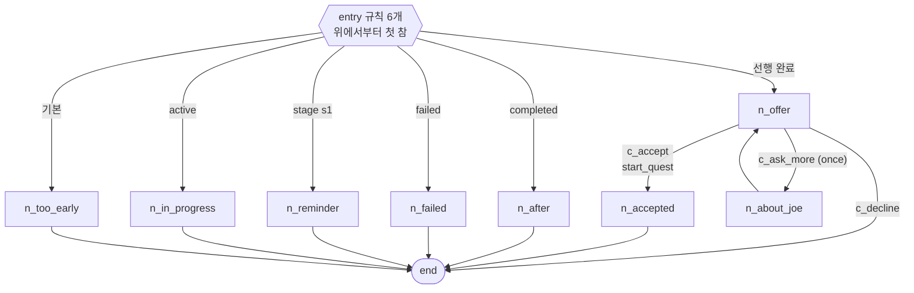
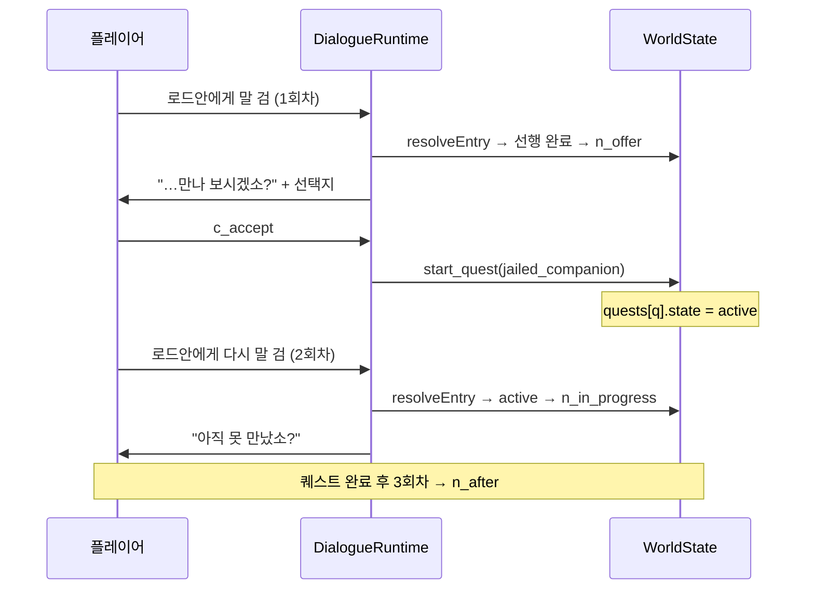
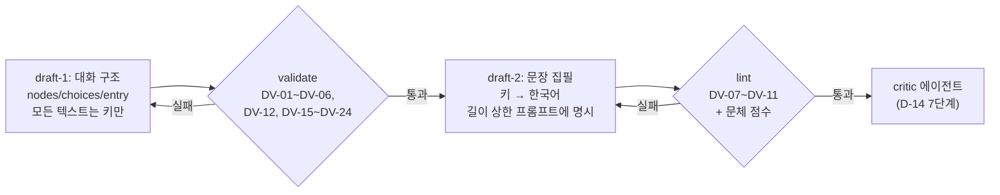

# 대화 그래프 모델

> `상태: 보류` — **설계는 유효하나 현재 노선에서는 구현하지 않는다.**
> 지금 노선은 원작 방식(플래그 + cm2)의 **sample-first** 다 → [`issues/MILESTONES.md`](../issues/MILESTONES.md).
> 이 장이 필요해지는 신호는 [`issues/MILESTONES.md` §5](../issues/MILESTONES.md) 에 있다. **읽고 바로 구현하지 말 것.**

> **문서 ID**: BP-24 · **상태**: 초안 · **선행 문서**: [BP-21](21_content_pack_spec.md), [BP-23](23_quest_model.md)
> **독자**: 런타임 구현자 · 콘텐츠 툴체인 구현자 · 집필 에이전트 프롬프트 작성자
> **한 줄 요약**: 조건부 분기 대화를 "진입 규칙 + 노드 그래프" 로 표현하되, 512×320 콘솔의 실제 픽셀 예산과 `UiHost` 의 실제 메서드에 맞춰 출력 규약과 길이 상한을 수치로 못박는다.

**파이프라인 구획(D-01)**: 스키마 = **Authoring**, 그래프 검사·길이 검사 = **Build**, 노드 순회와 `UiHost` 출력 = **Runtime**.

**선행 결정**: [D-05](_meta/DECISIONS.md) Condition/Effect, [D-07](_meta/DECISIONS.md) Dialogue 골격, [D-10](_meta/DECISIONS.md) 디스패치 티어.
**Condition/Effect 의 `op`/`do` 는 [BP-21](21_content_pack_spec.md) 소관이며 여기서 재정의하지 않는다.**
**앵커(어느 좌표에서 이 대화가 열리는가)는 [BP-26](26_entity_registry_and_anchors.md), 화자 액터 정의는 [BP-22](22_world_bible_model.md) 소관이다.**

---

## 24.1 설계 목표와 비목표

### 24.1.1 목표 (R-24-1 ~ R-24-7)

| ID | 요구사항 | 검사 위치 |
|---|---|---|
| R-24-1 | 같은 NPC 가 **세계 상태에 따라 다른 첫마디**를 할 수 있어야 한다 (D-16 §3 의 최소 요구) | `entry` 규칙 (§24.3) |
| R-24-2 | 대화 1건은 **단일 JSON 파일**로 완결되고 단독 스키마 검증을 통과한다 | `hadar_content validate` |
| R-24-3 | 모든 노드는 **종료(`"end"`)에 도달 가능**하고, 진입점에서 **도달 불가한 노드가 없다** | `DV-02`/`DV-03` |
| R-24-4 | 대화 텍스트는 전부 stringKey. 대화 파일에 한국어가 직접 들어가지 않는다 | `DV-06` |
| R-24-5 | 출력은 **현행 `UiHost` 인터페이스만**으로 그려진다. 새 UI 포트를 추가하지 않는다 | §24.4 의사코드 |
| R-24-6 | 한 노드의 표시 결과가 **콘솔 픽셀 예산 안에서 잘리지 않는다** | `DV-08`~`DV-11` (§24.5) |
| R-24-7 | 대화 실행은 **한 번에 하나**(`HDTileEventDispatcher._isScriptRunning` 가드와 동일 의미, D-10) | 런타임 가드 + 테스트 |

### 24.1.2 비목표 — 일부러 못 하게 막는 것

| 금지 | 왜 | 대체 |
|---|---|---|
| 노드 안의 **지역 변수/스택** | 상태 기계급 복잡도. 도달성 검사가 즉시 무의미해진다 | `var.<pack>.…` 전역 변수 (D-04) |
| **서브루틴 호출/복귀** (`gosub`/return 스택) | 그래프가 문맥 의존이 되어 정적 도달성이 안 나온다 | `play_dialogue` Effect 로 **꼬리 호출**만 (§24.7.4) |
| 노드 안 **반복문** | 종료 보장 불가 | 사이클 + `once` 선택지 (§24.8.3) |
| **동적 텍스트 조립** (문자열 연산) | 문체 검사·번역 불가 | 고정 템플릿 + 치환 토큰 (§24.6.4) |
| **타이밍 연출** (n초 대기, 타이핑 효과) | 결정론 위반(D-01), 헤드리스에서 의미 없음 | 페이지 분할로 리듬 표현 |
| **선택지 안의 선택지** (중첩 메뉴) | `UiHost.showMenu` 는 1단 메뉴 (`ui_host.dart:13`) | 다음 노드로 내려가서 다시 선택지 |
| 노드가 **다른 대화의 노드**를 직접 `go` | 파일 단위 검증이 깨진다 | `play_dialogue(id)` 로 대화 단위 전이 |
| **분기 조건 없는 랜덤 대사 분기** | 재현 불가 | `repeatPool` (§24.9.3) — 시드 기반, 결정론 |

### 24.1.3 스코프 한 줄 요약

> **분기 대화는 지원한다. 대화 안에 게임 로직을 짜 넣는 것은 지원하지 않는다.**
> 로직은 퀘스트([BP-23](23_quest_model.md))가, 상태는 `WorldState`([BP-25](25_world_state_and_save.md))가 갖는다.
> 대화는 **읽고, 고르고, Effect 를 쏘는** 세 가지만 한다.

---

## 24.2 Dialogue / Node / Choice 스키마 완전 명세

### 24.2.1 Dialogue

| 필드 | 타입 | 필수 | 기본 | 제약 | 설명 |
|---|---|---|---|---|---|
| `id` | string | ✔ | — | `dlg.<pack>.<slug>` (D-04), 불변 | 대화 식별자 |
| `schemaVersion` | int | ✔ | — | `pack.json` 과 일치 | 스키마 버전 |
| `pack` | string | ✔ | — | `id` 의 pack 세그먼트와 일치 | 소속 팩 |
| `speaker` | actorId | ✔ | — | `actors/` 에 존재 | 기본 화자 |
| `kind` | `"talk"`\|`"sign"`\|`"narration"` | — | `"talk"` | — | 헤더 기본값과 앵커 종류 검사에 쓰임 (§24.6) |
| `entry` | EntryRule[] | ✔ | — | 1개 이상, 마지막은 무조건 `when` 없음(=기본) | 조건부 진입 (§24.3) |
| `nodes` | {nodeId → Node} | ✔ | — | 1개 이상 | 노드 사전 |
| `repeatPool` | nodeId[] | — | `[]` | 전부 `nodes` 안에 존재 | 재방문 잡담 풀 (§24.9.3) |
| `maxDepth` | int | — | 32 | 4~64 | 한 대화 실행에서 방문 가능한 노드 수 상한 (§24.8.4) |
| `tags` | string[] | — | `[]` | 최대 8개 | `quest_hook`, `ambient`, `shop`, `lore` … |
| `generatedBy` | string? | — | null | — | 생성 감사용 |

**EntryRule**: `{ "when": Condition?, "go": nodeId }` — `when` 생략 = 항상 참(기본 규칙).

### 24.2.2 Node

| 필드 | 타입 | 필수 | 기본 | 제약 | 설명 |
|---|---|---|---|---|---|
| `id` | string | ✔ | — | 대화 내 유일, `^[a-z][a-z0-9_]{1,31}$` | 노드 식별자 (`nodes` 키와 일치해야 함) |
| `speaker` | actorId? | — | `Dialogue.speaker` | `actors/` 에 존재 | 이 노드의 화자 |
| `header` | stringKey? | — | §24.6.2 규칙 | — | 헤더 줄. `""` 로 명시하면 헤더 없음 |
| `lines` | stringKey[] | — | `[]` | 각 항목이 `strings/ko.json` 에 존재 | 본문. 순서대로 출력 |
| `onEnter` | Effect[] | — | `[]` | D-05 do | 노드 진입 효과 (§24.7) |
| `choices` | Choice[]? | — | null | 1~6개 | 선택지. 있으면 `next` 무시 |
| `next` | nodeId \| `"end"` | — | `"end"` | `choices` 가 없을 때 필수 취급 | 다음 노드 |
| `once` | bool | — | `false` | — | true 면 1회 방문 후 `visitedNodes` 에 기록되어 재진입 차단 (§24.9.2) |
| `pauseAfter` | bool | — | `true` | — | false 면 이 노드 끝에서 `waitForAnyKey()` 를 생략하고 다음 노드로 곧장 이어 붙인다 |
| `tags` | string[] | — | `[]` | — | 린트 분류 |

### 24.2.3 Choice

| 필드 | 타입 | 필수 | 기본 | 제약 | 설명 |
|---|---|---|---|---|---|
| `id` | string | ✔ | — | 노드 내 유일, `^c_[a-z0-9_]{1,29}$` | 선택지 id. `choose` objective 가 참조 ([BP-23](23_quest_model.md) §23.4.3) |
| `text` | stringKey | ✔ | — | 존재 + 길이 제약(§24.5.4) | 표시 문구 |
| `when` | Condition? | — | `{"op":"true"}` | D-05 op | 표시 조건 |
| `effects` | Effect[] | — | `[]` | D-05 do | 선택 확정 시 효과 |
| `go` | nodeId \| `"end"` | ✔ | — | 존재 | 다음 노드 |
| `once` | bool | — | `false` | — | true 면 한 번 고른 뒤 영구히 목록에서 빠짐 (§24.8.3) |
| `hint` | stringKey? | — | null | — | v1 미사용(예약). 렌더링하지 않음 |

**취소(Esc) 처리**: `UiHost.showMenu` 는 취소 시 `0` 을 반환한다(`ui_host.dart:13`).
대화 선택지에서 취소는 **마지막 선택지를 고른 것과 동일**하게 취급한다.
따라서 **선택지 목록의 마지막 항목은 언제나 "빠져나갈 수 있는" 선택지**여야 한다(`DV-12`).

### 24.2.4 완전 예시 1 — 단순 NPC 잡담 (`dlg.core.town1_tavern_keeper`)

로어성 주점(`town1_map_script.dart:66` 의 `isOn(23,30)` 주점 간판 근처)의 주인.

```jsonc
{
  "id": "dlg.core.town1_tavern_keeper",
  "schemaVersion": 1,
  "pack": "core",
  "speaker": "npc.core.tavern_keeper",
  "kind": "talk",

  // 진입 규칙: 위에서부터 첫 참. 마지막은 when 없음(기본).
  "entry": [
    { "when": { "op": "not", "arg": { "op": "flag", "id": "flag.core.town1.tavern_first_visit" } },
      "go": "n_first" },
    { "go": "n_repeat" }
  ],

  "nodes": {
    "n_first": {
      "id": "n_first",
      "header": "str.core.speaker.tavern_keeper",     // "@B주점 주인:"
      "lines": [
        "dlg.core.town1_tavern_keeper.first.1",       // "어서 오슈. 로어 주점은 처음이오?"
        "dlg.core.town1_tavern_keeper.first.2"        // "여긴 성 안에서 소문이 제일 빨리 도는 곳이라오."
      ],
      "onEnter": [
        { "do": "set_flag", "id": "flag.core.town1.tavern_first_visit" }
      ],
      "once": true,
      "next": "n_repeat"
    },
    "n_repeat": {
      "id": "n_repeat",
      "header": "str.core.speaker.tavern_keeper",
      "lines": [ "dlg.core.town1_tavern_keeper.repeat.1" ],
      "next": "end"
    },
    "n_rumor_menace": {
      "id": "n_rumor_menace",
      "header": "str.core.speaker.tavern_keeper",
      "lines": [ "dlg.core.town1_tavern_keeper.rumor.menace" ],
      "next": "end"
    },
    "n_rumor_lord": {
      "id": "n_rumor_lord",
      "header": "str.core.speaker.tavern_keeper",
      "lines": [ "dlg.core.town1_tavern_keeper.rumor.lord" ],
      "next": "end"
    }
  },

  // 재방문 잡담 풀: n_repeat 대신 여기서 시드 기반으로 하나를 고른다 (§24.9.3)
  "repeatPool": [ "n_repeat", "n_rumor_menace", "n_rumor_lord" ],
  "maxDepth": 8,
  "tags": ["ambient", "lore"]
}
```

### 24.2.5 완전 예시 2 — 퀘스트 수주 분기 (`dlg.gen_ep1.lord_ahn_jail`)

[BP-23](23_quest_model.md) §23.2.2 의 `quest.gen_ep1.jailed_companion` 을 주고받는 대화.
`town1_map_script.dart:88` 의 로드안(`isOn(50,27)`) 대사를 데이터로 옮긴 형태다.

```jsonc
{
  "id": "dlg.gen_ep1.lord_ahn_jail",
  "schemaVersion": 1,
  "pack": "gen_ep1",
  "speaker": "npc.core.lord_ahn",
  "kind": "talk",

  // 표준 패턴 A (§24.3.3): 완료 → 진행중 → 미수주 → 기본, 위에서부터.
  "entry": [
    { "when": { "op": "quest_state", "id": "quest.gen_ep1.jailed_companion", "state": "completed" },
      "go": "n_after" },
    { "when": { "op": "quest_state", "id": "quest.gen_ep1.jailed_companion", "state": "failed" },
      "go": "n_failed" },
    { "when": { "op": "quest_stage", "id": "quest.gen_ep1.jailed_companion", "stage": "s1_hear_of_prisoner" },
      "go": "n_reminder" },
    { "when": { "op": "quest_state", "id": "quest.gen_ep1.jailed_companion", "state": "active" },
      "go": "n_in_progress" },
    { "when": { "op": "quest_state", "id": "quest.gen_ep1.audience_with_lord", "state": "completed" },
      "go": "n_offer" },
    { "go": "n_too_early" }
  ],

  "nodes": {
    "n_too_early": {
      "id": "n_too_early",
      "header": "str.core.speaker.lord_ahn",              // "@B로드안:"
      "lines": [ "dlg.gen_ep1.lord_ahn_jail.too_early.1" ],
      "next": "end"
    },

    "n_offer": {
      "id": "n_offer",
      "header": "str.core.speaker.lord_ahn",
      "lines": [
        "dlg.gen_ep1.lord_ahn_jail.offer.1",              // "이 안쪽 감옥에 갇힌 사내가 하나 있소."
        "dlg.gen_ep1.lord_ahn_jail.offer.2",              // "Joe 라 하오. 쓸모가 있을 게요."
        "dlg.gen_ep1.lord_ahn_jail.offer.3"               // "문을 열어 주겠소. 만나 보시겠소?"
      ],
      "choices": [
        { "id": "c_accept",
          "text": "dlg.gen_ep1.lord_ahn_jail.c.accept",   // "만나 보겠습니다"
          "effects": [
            { "do": "start_quest", "id": "quest.gen_ep1.jailed_companion" }
          ],
          "go": "n_accepted" },
        { "id": "c_ask_more",
          "text": "dlg.gen_ep1.lord_ahn_jail.c.ask",      // "그자는 어떤 사람입니까?"
          "once": true,
          "go": "n_about_joe" },
        { "id": "c_decline",
          "text": "dlg.gen_ep1.lord_ahn_jail.c.decline",  // "나중에 오겠습니다"
          "go": "end" }
      ]
    },

    "n_about_joe": {
      "id": "n_about_joe",
      "header": "str.core.speaker.lord_ahn",
      "lines": [
        "dlg.gen_ep1.lord_ahn_jail.about.1",
        "dlg.gen_ep1.lord_ahn_jail.about.2"
      ],
      "next": "n_offer"                                   // 사이클 — c_ask_more 가 once 라 무한 루프 불가 (§24.8.3)
    },

    "n_accepted": {
      "id": "n_accepted",
      "header": "str.core.speaker.lord_ahn",
      "lines": [ "dlg.gen_ep1.lord_ahn_jail.accepted.1" ],
      "onEnter": [
        { "do": "set_flag",   "id": "flag.gen_ep1.jailed_companion.lord_promised" },
        { "do": "change_tile", "map": "TOWN1", "x": 44, "y": 14, "tile": 0 },
        { "do": "journal",    "entryKey": "quest.gen_ep1.jailed_companion.s1.journal" }
      ],
      "next": "end"
    },

    "n_reminder": {
      "id": "n_reminder",
      "header": "str.core.speaker.lord_ahn",
      "lines": [ "dlg.gen_ep1.lord_ahn_jail.reminder.1" ],
      "next": "end"
    },

    "n_in_progress": {
      "id": "n_in_progress",
      "header": "str.core.speaker.lord_ahn",
      "lines": [ "dlg.gen_ep1.lord_ahn_jail.progress.1" ],
      "next": "end"
    },

    "n_after": {
      "id": "n_after",
      "header": "str.core.speaker.lord_ahn",
      "lines": [
        "dlg.gen_ep1.lord_ahn_jail.after.1",
        "dlg.gen_ep1.lord_ahn_jail.after.2"
      ],
      "next": "end"
    },

    "n_failed": {
      "id": "n_failed",
      "header": "str.core.speaker.lord_ahn",
      "lines": [ "dlg.gen_ep1.lord_ahn_jail.failed.1" ],
      "next": "end"
    }
  },

  "repeatPool": [],
  "maxDepth": 16,
  "tags": ["quest_hook", "act1"]
}
```



---

## 24.3 조건부 진입 (`entry`)

### 24.3.1 평가 규칙

```pseudo
function resolveEntry(dialogue, worldStateView) -> nodeId:
    for rule in dialogue.entry:              # 선언 순서 그대로
        if rule.when == null: return rule.go # 기본 규칙
        if evaluate(rule.when, worldStateView): return rule.go
    # 여기 도달 = 빌드 검사(DV-01)를 통과하지 못한 손상 번들
    log("[DLG][ERR] no entry matched: " + dialogue.id)
    return null                               # 대화를 열지 않고 조용히 종료
```

| 규칙 | 내용 | 검사 |
|---|---|---|
| **위에서부터 첫 참** | 순서가 곧 우선순위. 좁은 조건을 위에 | — |
| **기본 노드 필수** | `entry` 의 **마지막 원소는 `when` 이 없어야** 한다 | `DV-01` **Hard** |
| 기본 규칙은 하나 | `when` 없는 원소가 마지막이 아닌 위치에 있으면 그 아래가 죽는다 | `DV-01b` **Hard** |
| 상한 | `entry` 원소 12개 이하 | `DV-13` Soft |
| 부작용 없음 | `entry` 의 `when` 은 순수 Condition. Effect 를 쓸 수 없다 (스키마상 불가) | — |

### 24.3.2 도달 불가 진입 규칙 (`DV-01c`)

두 규칙이 있고 위 규칙의 조건이 아래 규칙의 조건을 **포함**하면 아래가 죽는다.
빌드는 다음 세 가지 명백한 경우만 잡는다(완전한 SAT 판정은 하지 않는다).

| 패턴 | 예 | 진단 |
|---|---|---|
| 동일 조건 반복 | `quest_state(q,"active")` 가 두 번 | `DV-01c` 경고 |
| `{"op":"true"}` 가 마지막이 아닌 위치 | — | `DV-01b` Hard |
| `quest_state(q,"active")` 위에 `quest_stage(q, …)` 가 없음 | stage 별 분기가 `active` 뒤에 오면 절대 안 걸림 | `DV-01d` 경고 |

> 예시 2 에서 `n_reminder`(stage 분기)가 `n_in_progress`(active 분기)보다 **위**에 있는 이유가 `DV-01d` 다.

### 24.3.3 상태별 다른 첫마디를 만드는 표준 패턴 3가지

#### 패턴 A — 퀘스트 3상태 분기 (가장 흔함)

```jsonc
"entry": [
  { "when": {"op":"quest_state","id":"quest.X","state":"completed"}, "go": "n_after"      },
  { "when": {"op":"quest_state","id":"quest.X","state":"failed"   }, "go": "n_failed"     },
  { "when": {"op":"quest_state","id":"quest.X","state":"active"   }, "go": "n_in_progress"},
  { "when": {"op":"true"},                                           "go": "n_offer"      }
]
```

- 순서 고정: **completed → failed → active → 기본**. 이 순서를 벗어나면 `DV-01d`.
- 세분화가 필요하면 `active` 위에 `quest_stage` 분기를 **추가로** 끼운다.

#### 패턴 B — 스테이지 세분 분기 (긴 퀘스트의 의뢰인)

```jsonc
"entry": [
  { "when": {"op":"quest_state","id":"quest.X","state":"completed"},        "go":"n_after"   },
  { "when": {"op":"quest_stage","id":"quest.X","stage":"s3_meet_joe"},      "go":"n_hint_s3" },
  { "when": {"op":"quest_stage","id":"quest.X","stage":"s2_open_the_gate"}, "go":"n_hint_s2" },
  { "when": {"op":"quest_state","id":"quest.X","state":"active"},           "go":"n_generic" },
  { "when": {"op":"true"},                                                  "go":"n_offer"   }
]
```

- `quest_stage` 분기는 반드시 `quest_state(active)` **위**에.
- stage 마다 힌트를 다르게 주면 저널 없이도 길을 찾을 수 있다 → 저널 UI 부담 감소.

#### 패턴 C — 첫 만남 / 재방문 (퀘스트와 무관한 NPC)

```jsonc
"entry": [
  { "when": {"op":"not","arg":{"op":"flag","id":"flag.core.met.<npc_slug>"}}, "go":"n_first" },
  { "when": {"op":"true"},                                                    "go":"n_repeat"}
]
```

- `n_first` 는 `once:true` + `onEnter: [{"do":"set_flag","id":"flag.core.met.<npc_slug>"}]`.
- `n_repeat` 이 `repeatPool` 의 원소이면 재방문마다 다른 잡담이 나온다 (§24.9.3).
- 플래그 이름 규약: `flag.<pack>.met.<npc_slug>` — 린트가 이 관례를 검사한다(`DV-14` Soft).

---

## 24.4 런타임 출력 규약

### 24.4.1 쓰는 `UiHost` 메서드 (전부 기존 것, 신규 없음)

| 메서드 | 시그니처 (`lib/application/ports/ui_host.dart`) | 대화에서의 용도 |
|---|---|---|
| `beginNarrative()` | `void` | 상호작용 시작 — **디스패처가 이미 호출**(`tile_event_dispatcher.dart:64`). 대화 런타임은 다시 부르지 않는다(멱등이지만 소유권을 넘기지 않음) |
| `clearLogs()` | `void` | 본문 + **헤더**를 함께 지운다. 노드/페이지 경계에서만 |
| `setHeader(text)` | `void` | 헤더 줄. `clearLogs()` 뒤에 **반드시 다시** 호출 |
| `addLog(msg, isDialogue: true)` | `Future<void>` | 본문 1항목. 내부에서 픽셀 폭 480 기준 자동 줄바꿈 |
| `waitForAnyKey()` | `Future<void>` | 페이지/노드 경계의 "아무 키" |
| `showMenu(items, clearLogs: false)` | `Future<int>` | **선택지** (§24.4.3) |
| `endNarrative({autoFlush})` | `Future<void>` | 상호작용 종료 — **디스패처가 호출**(`tile_event_dispatcher.dart:98`) |

**쓰지 않는 것**: `showWindowMenu`(§24.4.3 근거), `showMessageWindow`(§24.4.5), `refresh`(맵 변경 Effect 가 자체 호출), `preloadAssets`.

### 24.4.2 노드 1개를 그리는 정확한 호출 순서

```pseudo
# DialogueRuntime.renderNode — lib/application/content/dialogue_runtime.dart (D-11)
async function renderNode(node, ctx) -> Transition:

    # ── 1. 진입 효과 (텍스트보다 먼저) ─────────────────────────────
    #    파괴적 효과(warp / start_battle / play_dialogue)는 즉시 적용하지 않고
    #    ctx.deferred 에 쌓는다. §24.7.3
    applyEffects(node.onEnter, ctx)

    # ── 2. 헤더 결정 ────────────────────────────────────────────────
    header = resolveHeader(node, ctx)          # §24.6.2. null 이면 헤더 없음

    # ── 3. 페이지 예산 계산 (§24.5.2) ───────────────────────────────
    headerCost = (header != null && header != "") ? 3 : 0
    menuCost   = (node.choices != null) ? 1 + visibleChoiceCount(node, ctx) : 0
    pageBudget = 13 - headerCost - menuCost                 # HDConfig.maxLinesPerPage = 13
    assert pageBudget >= 1                                  # 빌드 DV-11 이 보장

    # ── 4. 본문 출력 ────────────────────────────────────────────────
    #    ctx.host.clearLogs() 는 노드 진입 시 1회. 헤더는 그 "뒤에" 세운다
    #    (clearLogs 가 헤더까지 지우기 때문 — ui_host.dart clearLogs 주석 참조)
    ctx.host.clearLogs()
    if header != null: ctx.host.setHeader(header)

    emitted = 0
    for key in node.lines:
        text = strings.resolve(key, ctx)                    # 치환 토큰 처리 §24.6.4
        wrapped = wrapCount(text)                           # 빌드가 미리 계산해 번들에 굽는다
        if emitted + wrapped > pageBudget:
            # 페이지 넘김: 우리가 직접 한다. addLog 의 내부 flush(13줄)는
            # 헤더/메뉴 높이를 모르므로 신뢰하지 않는다. §24.5.3
            await ctx.host.waitForAnyKey()
            ctx.host.clearLogs()
            if header != null: ctx.host.setHeader(header)   # 헤더 재설정 필수
            emitted = 0
        await ctx.host.addLog(text, isDialogue: true)
        emitted += wrapped

    # ── 5. 선택지가 없으면: 일시정지 후 다음 노드 ───────────────────
    if node.choices == null:
        if node.pauseAfter: await ctx.host.waitForAnyKey()
        return Transition(go: node.next)                    # nodeId | "end"

    # ── 6. 선택지 ───────────────────────────────────────────────────
    visible = [ c for c in node.choices
                if evaluate(c.when, ctx) and not ctx.isChoiceConsumed(dialogue.id, node.id, c.id) ]
    if visible.isEmpty:
        # 빌드 DV-05 가 막지만 방어: 조용히 노드를 빠져나간다
        log("[DLG][ERR] all choices filtered out @" + node.id)
        return Transition(go: "end")

    items = [ resolveChoiceTitle(node, ctx) ] + [ strings.resolve(c.text) for c in visible ]
    #        ^ items[0] 은 제목 행 (ui_host.dart showMenu 규약)

    sel = await ctx.host.showMenu(items, clearLogs: false)  # ★ clearLogs:false — 대사가 위에 남는다
    chosen = (sel == 0) ? visible.last : visible[sel - 1]   # 취소 = 마지막 선택지 (§24.2.3)

    # ── 7. 선택 확정: 원자적 처리 ───────────────────────────────────
    if chosen.once: ctx.consumeChoice(dialogue.id, node.id, chosen.id)
    ctx.emitWorldEvent("dialogue_choice",
                       {dialogueId: dialogue.id, nodeId: node.id, choiceId: chosen.id})
    applyEffects(chosen.effects, ctx)                        # §24.7.2 원자성

    return Transition(go: chosen.go)
```

### 24.4.3 `showMenu` vs `showWindowMenu` — **`showMenu` 채택**

| 축 | `showMenu` (콘솔 인라인) | `showWindowMenu` (오버레이 창) |
|---|---|---|
| 렌더 위치 | 콘솔 패널 본문 **하단 고정**, 대사는 위에 그대로 남는다 (`console_panel.dart` `_BodyArea`: 대사 → `Spacer()` → `_MenuBlock`) | 맵/콘솔 위를 덮는 400px 폭 창 (`selection_window_data.dart`: `w=400`, 기본 `x=200,y=100`) |
| `clearLogs` 제어 | 인자로 `clearLogs:false` 지정 가능 (`ui_host.dart:13`) | 없음 — 창이 대사를 물리적으로 가림 |
| 표시 폭 | 콘솔 내부 480px → 한글 30자 | 창 내부 약 336px → 한글 21자 |
| 최대 표시 항목 | 남는 세로 공간만큼 | `maxVisibleItems = 6` + 스크롤 |
| 렌더 게이트 | `menu != null && HDGameMain.isScriptRunning` (`console_panel.dart:46`, `hd_game_main.dart:86` → `HDTileEventDispatcher().isScriptRunning`) | 게이트 없음 |
| 기존 용례 | **`HDSelect.run()`** — cm2 `Select::Run` 이 쓰는 경로 (`select.dart:37`, `clearLogs:false` 주석에 "선택지를 대사에 붙여 둔다" 라고 명시) | `menu_flows.dart` **전량**(메인 메뉴·전투·마법·세이브), `battle.dart:95/304`, `magic_system.dart:71/239` |

**결정: 대화 선택지는 `showMenu(items, clearLogs: false)` 를 쓴다.**

근거 4가지:

1. **문맥 보존이 대화의 본질**이다. 선택은 방금 읽은 대사에 대한 응답인데, `showWindowMenu` 는 그 대사를 창으로 덮는다. `select.dart:31-35` 의 주석이 이미 같은 판단을 코드에 남겨 뒀다 — *"keeps the menu visually attached to the dialogue line that prompted it"*.
2. **원작 재현**. cm2 의 `Select::Init/Add/Run` 이 정확히 이 경로로 렌더된다(`select.dart:37`). `L1_ep1d1.cm2` 의 "지형변화 아이템을 사용하시겠습니까? / 예 / 아니오" 가 이 모양으로 나온다. 대화 그래프가 cm2 를 대체하는 이상 표현이 달라지면 이관이 회귀로 보인다.
3. **글자 예산**. 480px vs 336px — 인라인이 한글 9자를 더 쓴다(§24.5.4). 400px 창은 선택지 문구를 20자 아래로 눌러 문체를 해친다.
4. **렌더 게이트가 이미 맞다**. `showMenu` 는 `HDTileEventDispatcher().isScriptRunning` 일 때만 그려지는데, Content tier 는 `HDTileEventDispatcher.check` 안(D-10 tier 0)에서 돌므로 항상 참이다. 별도 배선이 필요 없다.

**예외 — `showWindowMenu` 를 쓰는 곳**: 대화가 **타일 상호작용 밖**에서 열릴 때(저널 UI 에서 회상 재생, 디버그 뷰어). 이때는 `isScriptRunning` 이 거짓이라 인라인 메뉴가 **아예 그려지지 않는다**. `DialogueRuntime` 은 진입 시 이 상태를 확인해 렌더 경로를 고른다.

```pseudo
menuFn = ctx.insideTileDispatch
       ? (items) => host.showMenu(items, clearLogs: false)
       : (items) => host.showWindowMenu(items)
```

이 분기는 **런타임 1곳에만** 존재하고 콘텐츠 데이터에는 노출되지 않는다.

### 24.4.4 대화 1건 전체의 호출 순서 (디스패처 포함)

```
HDTileEventDispatcher.check(isInteraction: true)
├─ _isScriptRunning = true                        ← "한 번에 하나" 가드 (D-10)
├─ host.beginNarrative()
├─ host.clearLogs()
├─ _dispatchScripted()
│   ├─ if action == sign: host.setHeader('@B푯말에 써 있기를:')   ← 현행 tile_event_dispatcher.dart:110
│   └─ ★ Content tier (tier 0)
│       └─ ContentRuntime.handleAnchor(map, x, y, action)
│           └─ DialogueRuntime.run(dialogueId)
│               ├─ entryNode = resolveEntry(...)                  ← §24.3.1
│               ├─ loop (depth <= maxDepth):
│               │     t = renderNode(node)                        ← §24.4.2
│               │     if t.go == "end": break
│               │     if ctx.deferred.hasBlocking: break          ← §24.7.3
│               │     node = nodes[t.go]
│               └─ flushWorldEventBatch()                         ← BP-23 §23.4.5
├─ finally:
│   ├─ host.endNarrative(autoFlush: pendingNavigation == null)
│   └─ _isScriptRunning = false
└─ (그 다음) executePendingNavigation()  ← warp/start_battle 는 여기서 실행 (§24.7.3)
```

### 24.4.5 `showMessageWindow` 를 쓰지 않는 이유

`showMessageWindow` 는 400×200 고정 팝업이며 **높이 상한이 하드코딩**되어 있어 긴 글이 잘린다
(`hd_config.dart` `messageWindowWidth/Height`, "overlong messages clip rather than grow the box").
현행 `HDTileEventDispatcher` 도 SIGN 을 팝업이 아니라 **헤더 + 본문**으로 콘솔에 그리도록 이미 바뀌었다
(`tile_event_dispatcher.dart` `_emitJsonDialog` 주석: *"SIGN/TALK/ENTER all share the dialog area now"*).
대화 그래프는 그 결정을 그대로 따른다. → 푯말도 노드다.

---

## 24.5 페이지네이션과 길이 제약

### 24.5.1 픽셀 예산 (실측 상수에서 유도)

| 항목 | 값 | 출처 |
|---|---|---|
| 콘솔 패널 | 512 × 320 | `HDConfig.consoleWidth/Height` |
| 패딩 | 좌우 16, 상하 8 | `console_panel.dart` `EdgeInsets.symmetric(horizontal:16, vertical:8)` |
| 내부 영역 | **480 × 304** | 512−32, 320−16 |
| 본문 글꼴 | 16pt, 행높이 1.2 | `HDConfig.consoleFontSize`, `consoleLineHeight` |
| **1행 높이** | **19.2px** | 16 × 1.2 |
| 섹션 간격 | 28.8px | `HDConfig.dialogSectionGap` = 16 × 1.2 × 1.5 |
| 헤더 블록 | 19.2 + 28.8 = **48px (= 2.5행 → 3행으로 계상)** | `console_panel.dart` 헤더 + `SizedBox(dialogSectionGap)` |
| 푸터 블록 | 28.8 + 19.2 = 48px | 하단 `SizedBox` + `_Footer` (항상 자리 차지) |
| **본문 영역(헤더 없음)** | 304 − 48 = **256px → 13행** | `HDConfig.maxLinesPerPage = 13` 과 정확히 일치 |
| **본문 영역(헤더 있음)** | 256 − 48 = **208px → 10행** | — |
| 줄바꿈 기준 폭 | **480px** | `flutter_ui_host.dart` `_consoleWidth = consoleWidth − 32` |

### 24.5.2 페이지 예산 공식 (확정)

```
pageBudget(줄) = 13 − headerCost − menuCost

  headerCost = 헤더가 있으면 3, 없으면 0
  menuCost   = 선택지가 있으면 (1 + 표시되는 선택지 수), 없으면 0
```

| 헤더 | 선택지 수 | **본문 최대 줄** |
|---|---|---|
| 없음 | 0 | **13** |
| 없음 | 2 | 10 |
| 없음 | 3 | 9 |
| 없음 | 4 | 8 |
| 없음 | 6 | 6 |
| **있음** | 0 | **10** |
| 있음 | 2 | 7 |
| 있음 | 3 | **6** ← 가장 흔한 조합 |
| 있음 | 4 | 5 |
| 있음 | 5 | 4 |
| 있음 | 6 | **3** |

### 24.5.3 `addLog` 의 내부 페이지 넘김을 신뢰하지 않는 이유

`HDFlutterUiHost.addLog` 는 `events.length >= 13` 일 때만 `waitForAnyKey()` + `clearEvents()` 를 한다
(`flutter_ui_host.dart` — "Internal page flush within a single dialogue").
이 판정은 **헤더 높이도 메뉴 높이도 모른다**. 따라서

- 헤더가 있으면 11~13번째 줄은 **패널 밖으로 밀려 보이지 않는데도** flush 가 일어나지 않는다.
- 선택지가 붙으면 `_BodyArea` 의 `Spacer()` 가 음수 공간이 되어 레이아웃 오버플로가 난다.

→ **대화 런타임이 §24.5.2 의 예산으로 직접 페이지를 끊는다.** `addLog` 의 내부 flush 는 안전망으로만 남는다.
페이지를 끊을 때 `clearLogs()` 가 헤더까지 지우므로 **매 페이지마다 `setHeader` 를 다시 호출**해야 한다
(`ui_host.dart` `clearLogs` 주석: *"Also clears the dialogue header … the header lives with the body it titles"*).

### 24.5.4 한 줄에 들어가는 글자 수 (추정)

| 문자 종류 | 16pt 기준 폭 | 480px 에 들어가는 수 |
|---|---|---|
| 한글 음절 (전각) | ≈ 16.0px | **30자** |
| 라틴 소문자·숫자 (반각, 비례폭) | ≈ 8.0px 평균 | ≈ 60자 |
| 공백 | ≈ 4.4px | — |
| `@X` / `@@` 색상 태그 | **0px** (렌더 시 제거, `hd_text_utils.dart` `_parseToChunks`) | 폭에는 안 잡히지만 **문자열 길이에는 포함**된다 |

> **줄바꿈 알고리즘의 함정**: `HDTextUtils.splitToLines` 는 `text.split(' ')` 로 **어절 단위**로만 끊는다.
> 공백 없는 연속 문자열이 480px 를 넘으면 **줄이 나뉘지 않고 그대로 넘쳐 잘린다**.
> 한국어는 어절이 길어지기 쉬우므로 이게 실제 위험이다.

### 24.5.5 확정 길이 상한

| 대상 | **권장** | **경고(Soft)** | **에러(Hard)** | 근거 |
|---|---|---|---|---|
| 대사 1줄 = `lines[]` 항목 하나 | **≤ 28자(한글 환산)** | 29~45자 | **> 45자** | 28자면 확실히 1행. 45자 초과는 2행을 넘겨 리듬이 깨짐 |
| **공백 없는 연속 구간(어절)** | ≤ 20자 | 21~29자 | **≥ 30자** | 30자 = 480px. 줄바꿈이 안 돼 **잘린다** (§24.5.4) |
| 노드 본문 총 wrapped 줄 수 | **≤ pageBudget (1페이지)** | pageBudget 초과 ~ 3페이지 | **> 3페이지** | 한 노드에서 "아무 키" 를 3번 넘게 누르면 지루함 |
| `lines[]` 항목 수 | ≤ 6 | 7~12 | **> 12** | 항목당 최소 1행이므로 12행이면 13행 예산을 넘김 |
| **선택지 텍스트** | **≤ 18자** | 19~24자 | **> 24자** | 인라인 메뉴 폭 480px(30자) 안에서 절대 안 접히게 6자 여유 |
| 선택지 제목 행(`items[0]`) | ≤ 26자 | 27~30자 | **> 30자** | 동상 |
| 선택지 개수(표시되는 것) | **2~4** | 5~6 | **> 6** 또는 **< 1** | `HDSelectionWindow.maxVisibleItems = 6` 과 정합. 창 경로로 빠져도 스크롤이 안 생김 |
| 헤더 텍스트 | ≤ 20자 | 21~28자 | **> 28자** | 헤더는 줄바꿈 없이 한 행 |
| 노드 수 / 대화 | ≤ 24 | 25~48 | **> 48** | 검수/유지보수 한계 |
| `maxDepth` | 16 | — | 4 미만 또는 64 초과 | §24.8.4 |

**"한글 환산 길이" 정의** (린트가 쓰는 계산):

```
weight(ch) = 2  if U+1100..U+11FF, U+3130..U+318F, U+AC00..U+D7A3 (한글)
                or U+3000..U+303F, U+FF00..U+FFEF (전각 기호)
           = 0  if 색상 태그 시퀀스 '@' + [0-9A-Ga-g@] 의 2글자
           = 1  otherwise
한글환산길이 = Σ weight(ch) ÷ 2
```

### 24.5.6 초과 시 빌드 동작

| 위반 | ID | 동작 |
|---|---|---|
| 어절 ≥ 30자 | `DV-08` | **Hard 실패**. `{error, hint}` 로 "여기에 공백을 넣으세요" + 해당 문자열 키·위치 |
| 대사 1줄 > 45자 | `DV-09` | **Hard 실패** |
| 노드 본문 > 3페이지 | `DV-10` | **Hard 실패**. hint: "노드를 나누세요" |
| `pageBudget < 1` (헤더 3 + 선택지 6 = 9, 본문 4행 이상) | `DV-11` | **Hard 실패**. 선택지를 줄이거나 본문을 이전 노드로 |
| 선택지 텍스트 > 24자 | `DV-08b` | **Hard 실패** |
| 위 수치의 "경고" 구간 | 각 규칙 | **Soft** — `hadar_content lint` 가 경고, 검수 에이전트(D-14 7단계)가 판단 |

빌드는 각 노드의 **wrapped 줄 수를 미리 계산해 `content.bundle.json` 에 굽는다**(`_wrap: {키: 줄수}`).
런타임은 `TextPainter` 측정을 반복하지 않고 이 값을 읽는다 — 결정론 + 성능.

> **계산 방식의 일치**: 빌드의 줄 수 계산기는 `HDTextUtils.splitToLines` 와 **같은 어절 분할 규칙**을 쓴다.
> 폭 측정만 "한글 16px / 반각 8px" 근사로 대체한다. 근사 오차로 실제와 어긋나는 경우를 잡기 위해
> 위젯 테스트 1개(`test/presentation/host/dialogue_wrap_test.dart`)가 대표 문자열 20종의 줄 수를 대조한다. → `Q-24-3`

---

## 24.6 화자와 헤더

### 24.6.1 헤더 문자열 규약

```
"str.core.speaker.lord_ahn" → "@B로드안:"
```

| 규칙 | 내용 |
|---|---|
| 형식 | `@B` + 표시 이름 + `:` — `@B` 는 시안(`hd_text_utils.dart` colorTable `'B'`) |
| 키 이름공간 | `str.<pack>.speaker.<actor_slug>` — 액터마다 하나, 대화마다 만들지 않는다 |
| 길이 | ≤ 20자 (§24.5.5). 태그 `@B` 는 폭 0 |
| 자동 생성 | 액터 파일의 `displayName` 에서 빌드가 `str.<pack>.speaker.<slug>` 를 **자동 생성**한다. 수동 작성 불필요 |

### 24.6.2 헤더 결정 순서 (`resolveHeader`)

```pseudo
function resolveHeader(node, ctx) -> string?:
    if node.header == "":        return null                 # 명시적 "헤더 없음"
    if node.header != null:      return strings.resolve(node.header)
    speaker = node.speaker ?? dialogue.speaker
    switch dialogue.kind:
      case "talk":      return strings.resolve("str." + speaker.pack + ".speaker." + speaker.slug)
      case "sign":      return null    # ★ 디스패처가 이미 세운 기본 헤더를 그대로 둔다
      case "narration": return null
```

### 24.6.3 SIGN 기본 헤더와의 관계

`HDTileEventDispatcher._dispatchScripted` 는 **Content tier 보다 먼저** SIGN 헤더를 세운다
(`tile_event_dispatcher.dart:110`):

```dart
if (action == HDTileAction.sign) {
  host.setHeader('@B푯말에 써 있기를:');
}
```

| 대화 `kind` | 노드 `header` | 결과 |
|---|---|---|
| `"sign"` | 생략 | **`@B푯말에 써 있기를:` 유지** (디스패처 기본값) |
| `"sign"` | `"str.gen_ep1.sign.warning"` | 노드 값이 덮어씀 (예: `@B붉은 글씨로:`) |
| `"sign"` | `""` | 헤더 없음 |
| `"talk"` | 생략 | 화자 이름 헤더 |
| `"narration"` | 생략 | 헤더 없음 (본문 전체가 지문) |

**주의 (실행 순서 함정)**: `renderNode` 는 4단계에서 `clearLogs()` 를 부르는데 이것이 **디스패처가 세운 SIGN 헤더도 지운다**.
따라서 `kind:"sign"` 대화의 런타임은 디스패처 기본 헤더 문자열을 **진입 시점에 캡처**해 두고,
`resolveHeader` 가 null 을 돌려주면 그 캡처값을 다시 세운다.

```pseudo
ctx.inheritedHeader = host.currentHeader   # ContentRuntime 진입 즉시 캡처
...
header = resolveHeader(node, ctx) ?? (dialogue.kind == "sign" ? ctx.inheritedHeader : null)
```

> `UiHost` 에는 헤더 getter 가 없다(`ui_host.dart` 는 `setHeader` 만 정의). 캡처를 하려면
> 포트에 `String get header` 를 추가하거나, `ContentRuntime` 이 SIGN 기본 문자열을 상수로 갖고 있어야 한다.
> **v1 결정: 상수로 갖는다** — 포트를 넓히지 않기 위해서(R-24-5). 상수 값은 `tile_event_dispatcher.dart:110` 과
> 동기화되어야 하며 테스트 1개가 두 값의 일치를 고정한다. → `Q-24-1`

### 24.6.4 화자 이름 표시 규칙과 치환 토큰

| 규칙 | 내용 |
|---|---|
| 이름 노출 | 헤더에서만. **본문에 "로드안: " 을 직접 쓰지 않는다** (`DV-07` 검사 — 본문이 `:` 로 시작하는 이름 패턴이면 경고) |
| 아직 이름을 모르는 NPC | 액터의 `displayNameUnknown`(예: "낯선 사내")을 쓰고, `flag.<pack>.met.<slug>` 로 전환. 전환 판정은 **빌드가 헤더 키를 2개 굽고 런타임이 고른다** |
| 파티원 이름 | 본문에서 치환 토큰 `{p0.name}` 사용 가능 (§아래) |
| 다중 화자 노드 | 불가. 화자가 바뀌면 **노드를 나눈다** |

**치환 토큰 (닫힌 집합, v1)**:

| 토큰 | 치환값 | 출처 |
|---|---|---|
| `{p0.name}` … `{p5.name}` | 파티 슬롯 n 의 이름 | `HDParty.players[n].name.text` |
| `{p0.class}` | 클래스 이름 (에스퍼/싸이보그/초능력자) | `HDPlayer.classId` |
| `{party.gold}` | 현재 골드 | `PartyInventory.gold` |
| `{map.name}` | 현재 맵 표시 이름 | `MapModel.displayName` |
| `{item.<itemId>}` | 아이템 표시 이름 | `items.json` |
| `{actor.<actorId>}` | 액터 표시 이름 | `actors/` |

- **그 밖의 토큰은 빌드 하드 실패**(`DV-06b`). 조용히 빈 문자열로 대체하지 않는다.
- 치환은 **길이 검사 후**에 일어나므로, 린트는 토큰을 **최장 후보 길이**로 계산한다(예: `{p0.name}` = 6자).

### 24.6.5 색상 태그 사용 정책

| 태그 | 색 | 용도 | 정책 |
|---|---|---|---|
| `@B` | 시안 | **헤더 전용** | 본문에서 사용 금지 (`DV-07b` 경고) |
| `@7` | 회색 | 지문·나레이션·내적 독백 | `L1_ep1d1.cm2` 가 실제로 쓰는 관례. `kind:"narration"` 의 기본 |
| `@E` | 노랑 | 고유명사 강조(아이템·지명 1회) | 노드당 최대 2회 (`DV-07c` 경고) |
| `@C` | 빨강 | 위험·경고 | 노드당 최대 1회 |
| 그 외 (`@0`~`@A`,`@D`,`@F`,`@G`) | — | v1 미사용 | 사용 시 경고 |
| `@@` | — | 색 복귀 | 여는 태그를 썼으면 **같은 문자열 안에서 닫는다** (`DV-07d` Hard) |

- 색상 태그는 **문자열 파일(`strings/ko.json`) 안에만** 존재한다. 대화 JSON 에는 나타나지 않는다.
- 태그가 줄바꿈을 건너 색을 이어가는 것은 `splitToLines` 가 처리한다(`hd_text_utils.dart` 의 sentinel chunk). 걱정할 필요 없음.

---

## 24.7 효과 실행 시점

### 24.7.1 `onEnter` 와 텍스트 출력의 순서

```
노드 진입
  → onEnter[] 순서대로 적용        ← 텍스트보다 먼저
  → clearLogs() → setHeader()
  → lines 출력
  → (선택지 / next)
```

**먼저 실행하는 이유**: `onEnter` 의 `set_flag`/`set_var` 가 그 노드 본문의 **치환 토큰**과 선택지의 `when` 에 반영되어야 한다.
"효과를 반영한 세계에서 이 노드를 그린다" 가 일관된 규칙이다.

**반례 대비**: 본문에서 "방금 얻은 아이템"을 언급하고 싶으면 `onEnter` 에 `give_item` 을 두면 된다 — 순서가 맞는다.
반대로 "아직 못 얻은 상태"를 그려야 하면 노드를 나눠 다음 노드의 `onEnter` 로 옮긴다.

### 24.7.2 선택지 효과의 원자성

```
선택 확정 1회 = 다음이 끊기지 않고 실행된다

  1. once 소비 기록          (ctx.consumeChoice)
  2. dialogue_choice 이벤트 발행 (BP-23 §23.11)
  3. effects[] 순서대로 적용
  4. go 로 전이
```

| 보장 | 내용 |
|---|---|
| 부분 적용 없음 | `effects` 중간에 실패해도 앞선 것은 롤백하지 않는다. **Effect 는 실패하지 않도록 설계**(D-05 는 전부 전면 성공 연산) |
| 입력 차단 | 1~4 사이에 `waitForAnyKey`/`showMenu` 를 호출하지 않는다. 사용자 입력이 끼어들 틈이 없다 |
| 이벤트 순서 | `dialogue_choice` 를 **effects 보다 먼저** 발행한다. 그래야 `choose` 목표가 그 선택 자체를 보고, `effects` 가 유발한 `flag_changed` 는 그 뒤에 온다 |
| 중복 방지 | 같은 선택지를 두 번 확정할 수 없다(`showMenu` 가 이미 닫힘). `once` 는 **세션 간**에도 유지(WorldState 에 기록) |

### 24.7.3 파괴적 효과 — `warp` / `start_battle` / `play_dialogue`

이 셋은 **화면과 실행 컨텍스트를 갈아엎는다**. 대화 도중 즉시 실행하면
콘솔이 지워지고 남은 `lines` 가 허공에 출력되며, `endNarrative` 의 짝이 어긋난다.

**현행 메커니즘 재사용**: cm2 의 `LoadScript` 는 타일 디스패치 중이면 즉시 실행하지 않고
`HDScriptEngine.pendingNavigation` 에 **적재만** 한다(`script_engine_adapter.dart:297-308`).
그리고 `HDTileEventDispatcher` 는 `endNarrative(autoFlush: pendingNavigation == null)` 로
"이동이 예약돼 있으면 마지막 키 대기를 생략" 한다(`tile_event_dispatcher.dart:98`).
대화 그래프도 **정확히 같은 규약**을 따른다.

| do | 분류 | 대화 중 처리 |
|---|---|---|
| `warp(map,x,y)` | **차단성(blocking)** | `ctx.deferred` 에 적재 → 현재 노드의 본문 출력까지만 마치고 **대화 즉시 종료** → `endNarrative` 이후 실행 |
| `start_battle(encounterId)` | **차단성** | 동상 |
| `play_dialogue(id)` | **차단성(꼬리 호출)** | 동상 — 현재 대화를 끝내고 지정 대화를 새로 연다 (§24.7.4) |
| `change_tile` | 비차단 | 즉시 적용 + `HDHosts().ui.refresh()` (세션 알림 아님 — CLAUDE.md 의 `refresh` 규약) |
| `set_flag`/`clear_flag`/`set_var`/`add_var` | 비차단 | 즉시 |
| `give_item`/`take_item`/`add_gold`/`add_food` | 비차단 | 즉시 |
| `start_quest`/`advance_quest`/`complete_quest`/`fail_quest` | 비차단 | 즉시 (상태만 바뀜, 화면은 배치 종료 후 요약) |
| `set_npc_state`/`unlock_place`/`journal`/`grant_exp`/`heal_party`/`set_encounter` | 비차단 | 즉시 |

**규칙**:

| ID | 규칙 | 등급 |
|---|---|---|
| `DV-15` | 한 노드/선택지의 `effects` 에 차단성 do 는 **최대 1개** | Hard |
| `DV-16` | 차단성 do 는 `effects` 배열의 **마지막 원소**여야 한다 | Hard |
| `DV-17` | 차단성 do 를 가진 노드의 `next` / 선택지의 `go` 는 `"end"` 여야 한다 | Hard |
| `DV-18` | `onEnter` 에 차단성 do 가 있으면 그 노드의 `lines` 는 **1페이지 이내** | Hard |

```pseudo
# 실행 흐름
applyEffects(effects, ctx):
    for e in effects:
        if isBlocking(e):
            ctx.deferred = e            # DV-15 로 1개 보장
            ctx.stopAfterThisNode = true
        else:
            apply(e, ctx)               # 즉시

# DialogueRuntime.run 의 루프 끝
if ctx.stopAfterThisNode: break
...
# ContentRuntime 이 디스패처의 finally 이후에 실행
if ctx.deferred != null: enqueuePending(ctx.deferred)   # pendingNavigation 과 같은 자리
```

### 24.7.4 `play_dialogue` = 꼬리 호출 (서브루틴 아님)

```
A 대화 노드 nX: effects [{"do":"play_dialogue","id":"dlg.core.B"}]  →  go: "end"
  → A 종료 → B 시작.  B 가 끝나도 A 로 돌아오지 않는다.
```

- 복귀가 없으므로 **호출 스택이 없다** → 그래프가 문맥 독립을 유지하고 도달성 검사가 성립한다(§24.1.2).
- 연쇄 상한: 한 상호작용에서 `play_dialogue` 연쇄 **4회**. 초과 시 정지 + ERR 로그(`DV-19`).
- 사이클(`A → B → A`)은 빌드가 **대화 단위 그래프**에서도 검출한다(`DV-20` Hard).

---

## 24.8 그래프 제약과 검증

### 24.8.1 제약 목록

| ID | 제약 | 등급 |
|---|---|---|
| `DV-01` | `entry` 마지막 원소는 `when` 없음(기본 노드 필수) | Hard |
| `DV-01b` | `when` 없는 `entry` 원소가 마지막 이외의 위치에 없음 | Hard |
| `DV-02` | `entry` 의 모든 `go` 에서 출발해 **도달 불가한 노드가 없다** | Hard |
| `DV-03` | 모든 노드에서 `"end"` 에 **도달 가능**하다 | Hard |
| `DV-04` | 모든 `Choice` 는 **도달 가능**하다 (노드가 도달 가능 + `when` 이 항상 거짓이 아님) | Hard |
| `DV-05` | 어떤 노드도 "표시 가능한 선택지가 0개" 가 될 수 없다 (§24.8.2) | Hard |
| `DV-06` | 모든 stringKey 가 `strings/ko.json` 에 존재 | Hard |
| `DV-12` | 선택지 목록의 **마지막 항목은 `when` 이 없는(항상 표시) 이탈 가능 선택지** | Hard |
| `DV-21` | `nodes` 사전의 키와 `node.id` 가 일치 | Hard |
| `DV-22` | `choices` 와 `next` 를 동시에 선언하지 않음 (선언 시 `next` 무시 경고) | Soft |

### 24.8.2 "선택지 0개" 방지 (`DV-05` / `DV-12`)

선택지는 `when` 과 `once` 로 사라질 수 있다. 전부 사라지면 플레이어가 갇힌다.

```pseudo
function validateChoiceFloor(node) -> Diagnostics:
    if node.choices == null: return OK
    last = node.choices[-1]
    if last.when != null and last.when != {"op":"true"}:
        return HARD("DV-12 last choice must be unconditional @" + node.id)
    if last.once == true:
        return HARD("DV-12 last choice must not be 'once' @" + node.id)
    if len(node.choices) > 6:  return HARD("DV-08b too many choices")
    if len(node.choices) < 1:  return HARD("DV-05 empty choices")
    return OK
```

즉 **마지막 선택지는 언제나 있다**. 이것이 `DV-05` 를 구조적으로 보장하고,
동시에 §24.2.3 의 "취소 = 마지막 선택지" 규칙을 안전하게 만든다.

### 24.8.3 사이클 — **허용한다** (조건부)

퀘스트 Stage 와 달리 대화는 사이클이 자연스럽다("더 물어보기" → 원래 노드로).
[BP-23](23_quest_model.md) 은 사이클을 금지했지만 여기서는 다르게 간다.

| 항목 | 규칙 |
|---|---|
| 사이클 허용 여부 | **허용** |
| 무한 루프 방지 1 | **`maxDepth`** — 한 실행에서 방문한 노드 수가 `maxDepth`(기본 32)를 넘으면 정지하고 `"end"` 로 빠진다. WARN 로그 |
| 무한 루프 방지 2 | **소모성 사이클 강제** — 사이클을 이루는 간선 중 최소 하나는 `once:true` 선택지이거나, `when` 이 사이클 안의 Effect 로 **거짓이 될 수 있어야** 한다 (`DV-23`) |
| 무한 루프 방지 3 | 사이클 안의 모든 노드가 `lines` 를 갖고 `pauseAfter:true` → 플레이어가 키를 눌러야 진행하므로 프리즈가 아니다 | 
| 검사 방법 | 강결합 성분(SCC, Tarjan) 을 구하고, 크기 ≥ 2 이거나 자기 루프인 SCC 마다 §위 조건을 확인 |

```pseudo
function validateCycles(dialogue) -> Diagnostics:
    D = []
    G = buildNodeGraph(dialogue)            # node -> [next | choice.go ...]
    for scc in tarjanSCC(G):
        if len(scc) == 1 and not hasSelfLoop(scc[0]): continue
        # 이 SCC 를 벗어나는 간선이 존재하는가
        if not hasExitEdge(scc, G):
            D += HARD("DV-24 inescapable cycle: " + join(scc))
            continue
        # 소모성 간선이 있는가
        consumable = any(c.once for n in scc for c in choices(n))
                  or any(mutatesOwnCondition(n, scc) for n in scc)
        if not consumable:
            D += SOFT("DV-23 cycle without a consuming edge: " + join(scc))
    return D
```

예시 2 의 `n_offer ⇄ n_about_joe` 사이클은 `c_ask_more.once = true` 이므로 소모성이며,
`c_accept` / `c_decline` 이라는 이탈 간선도 있다 → 통과.

### 24.8.4 최대 깊이

| 항목 | 값 | 근거 |
|---|---|---|
| `maxDepth` 기본 | **32** | 한 대화에서 32번 노드를 넘기면 이미 너무 길다 |
| 허용 범위 | 4 ~ 64 | 범위 밖은 `DV-25` Hard |
| 초과 시 런타임 | 정지 → `"end"` 로 빠짐 + `[DLG][WARN] maxDepth exceeded` | crash 없음 |
| `play_dialogue` 연쇄 | 4 | `DV-19` |
| 솔버 탐색 상한 | `maxDepth × 표시 가능한 선택지 조합` | [BP-34](34_headless_sim_and_solver.md) |

### 24.8.5 검사 알고리즘 (의사코드)

```pseudo
function validateDialogue(dlg, index) -> Diagnostics:
    D = []
    # 1. 키/참조
    for (k, n) in dlg.nodes:
        if k != n.id:                       D += HARD("DV-21 key/id mismatch: " + k)
        if n.speaker and not index.actors.has(n.speaker):  D += HARD("DV-06 actor")
        for key in n.lines:
            if not index.strings.has(key):  D += HARD("DV-06 string key: " + key)
        D += validateTokens(n)                                   # DV-06b
        D += validateLength(n)                                   # DV-08..DV-11 (§24.5)
        D += validateChoiceFloor(n)                              # DV-05 / DV-12
        D += validateBlockingEffects(n)                          # DV-15..DV-18

    # 2. entry
    if dlg.entry[-1].when != null:          D += HARD("DV-01 no default entry")
    for r in dlg.entry[:-1]:
        if r.when == null:                  D += HARD("DV-01b unreachable entry below default")
    D += detectEntryShadowing(dlg.entry)                         # DV-01c / DV-01d

    # 3. 도달성 (전방 BFS: entry 의 모든 go 에서 출발)
    roots = { r.go for r in dlg.entry } | set(dlg.repeatPool)
    reach = bfs(nodeGraph(dlg), roots)
    for id in dlg.nodes:
        if id not in reach:                 D += HARD("DV-02 unreachable node: " + id)

    # 4. 종료 도달 (역방향 고정점)
    canEnd = { n for n in dlg.nodes if endsHere(n) }              # next=="end" or 어떤 choice.go=="end"
    repeat until stable:
        for n in dlg.nodes:
            if any(succ in canEnd for succ in successors(n)): canEnd.add(n)
    for id in reach:
        if id not in canEnd:                D += HARD("DV-03 no path to end: " + id)

    # 5. 선택지 도달성
    for n in reach:
        for c in choices(n):
            if isAlwaysFalse(c.when):       D += HARD("DV-04 dead choice: " + n.id + "/" + c.id)
            if c.go not in dlg.nodes and c.go != "end":
                                            D += HARD("DV-06 choice target: " + c.go)
    # 6. 사이클
    D += validateCycles(dlg)                                     # DV-23 / DV-24
    # 7. 대화 간 그래프 (play_dialogue)
    D += index.crossDialogueCycleCheck(dlg)                      # DV-20
    return D
```

`isAlwaysFalse` 는 완전한 SAT 판정을 하지 않는다. 명백한 경우만 잡는다:
`{"op":"false"}`, `{"op":"and", args 안에 서로 모순되는 var_cmp}`, `{"op":"and",[X, {"op":"not",X}]}`.

---

## 24.9 대화 재방문 정책

### 24.9.1 재방문의 세 축

| 축 | 저장 위치 | 지속 범위 |
|---|---|---|
| `entry` 조건 (상태 변화) | `WorldState` 전체 | 영구 |
| `once` 노드 방문 기록 | `WorldState.dialogueVisits: Set<"dlgId#nodeId">` | 영구 (세이브에 포함) |
| `once` 선택지 소비 기록 | `WorldState.choicesTaken: Set<"dlgId#nodeId#choiceId">` | 영구 |
| `repeatPool` 커서 | `WorldState.vars["var.<pack>.dlg.<slug>.pool"]` | 영구 |

> 위 3개 컬렉션은 D-08 의 `WorldState` 를 확장한다. 스키마 확정은 [BP-25](25_world_state_and_save.md).

### 24.9.2 `once` 노드

| 상황 | 동작 |
|---|---|
| `once:true` 노드에 처음 진입 | 정상 렌더 → 종료 시 `dialogueVisits` 에 기록 |
| 이미 방문한 `once` 노드로 전이 시도 | **건너뛰고 `next`(또는 `go`) 로 즉시 진행**. `onEnter` 도 실행하지 않는다 |
| `once` 노드가 `choices` 를 가짐 | 허용하되 `DV-26` 경고 — 선택지가 있는 노드는 보통 다시 와야 한다 |
| `once` 노드가 `entry` 의 유일한 대상 | `DV-27` **Hard** — 두 번째 대화에서 진입점이 사라진다 |
| 체이닝된 `once` 노드가 연속으로 스킵 | `maxDepth` 안에서 안전. 전부 스킵되면 `"end"` |

### 24.9.3 반복 대사 풀 (`repeatPool`)

같은 NPC 를 계속 말 걸어도 지루하지 않게 하는 장치. **시드 기반이라 결정론적**이다.

```pseudo
function pickRepeatNode(dlg, ctx) -> nodeId:
    pool = [ n for n in dlg.repeatPool if isEligible(n, ctx) ]   # once 소진 노드 제외
    if pool.isEmpty: return dlg.entry[-1].go                     # 기본 노드로 폴백
    cursorVar = "var." + dlg.pack + ".dlg." + dlg.slug + ".pool"
    i = ctx.vars[cursorVar] ?? 0
    ctx.vars[cursorVar] = (i + 1) % len(pool)                     # 순환 — 난수보다 낫다
    return pool[i]
```

| 규칙 | 내용 |
|---|---|
| 선택 방식 | **순환(round-robin)**. `chance` 난수를 쓰지 않는다 — 같은 대사가 연속으로 나오는 사고를 원천 차단 |
| 진입 경로 | `entry` 의 어떤 규칙이 `repeatPool` 의 원소를 가리키면, 런타임이 그 규칙에 한해 풀 순환을 적용 |
| 크기 | 2~6개 권장. 1개면 `repeatPool` 을 쓰지 말고 그냥 노드로 (`DV-28` 경고) |
| 도달성 | `repeatPool` 원소는 `entry` 로부터 도달 불가해도 **BFS 루트에 포함**되므로 `DV-02` 를 통과한다 (§24.8.5 3번) |
| 내용 | 잡담/소문/힌트. **상태를 바꾸는 `onEnter` 를 넣지 않는다** (`DV-29` 경고) |

### 24.9.4 상태 변화 후 갱신



| 규칙 | 내용 |
|---|---|
| 갱신 시점 | **다음 대화 진입 시**. 대화 도중에 `entry` 를 다시 평가하지 않는다 |
| 대화 중 상태가 바뀌면 | 현재 대화는 계속 진행. 선택지의 `when` 만 그 시점 상태로 평가된다 |
| 세이브/로드 후 | `WorldState` 가 그대로 복원되므로 같은 규칙이 그대로 성립 |
| 콘텐츠 업데이트로 노드가 사라짐 | `dialogueVisits` 의 고아 항목은 무시(로드 실패 아님). [BP-25](25_world_state_and_save.md) |

---

## 24.10 레거시 변환

### 24.10.1 `dialogLines`(RPG Maker code 401) → 단일 노드 대화

현행 `HDTileEventDispatcher._emitJsonDialog` 는 `(x,y)` 가 일치하는 **첫 이벤트**의 `dialogLines` 를
순서대로 `host.addLog` 한다(GROUND_TRUTH §4). 조건도 상태 참조도 없다. 그래서 변환이 기계적이다.

```pseudo
function convertLegacyEvent(mapName, ev) -> (Dialogue, Anchor, Strings):
    slug   = mapName.lower() + "_" + ev.x + "_" + ev.y
    dlgId  = "dlg.core." + slug
    action = tileActionAt(mapName, ev.x, ev.y)          # HDTileProperties.getUnitAction

    keys = []
    for (i, line) in enumerate(ev.dialogLines):
        if line.strip() == "": continue                 # 빈 줄은 페이지 리듬용 — 유지하려면 str.blank
        k = dlgId + ".l" + i
        strings[k] = line                               # 원문 그대로. 색상 태그도 그대로
        keys.append(k)

    dialogue = {
      id: dlgId, schemaVersion: 1, pack: "core",
      speaker: (action == talk) ? "npc.core.unknown_" + slug : "npc.core.narrator",
      kind: (action == sign) ? "sign" : (action == talk) ? "talk" : "narration",
      entry: [ { go: "n_main" } ],                      # 조건 없음 = 기본 노드 하나
      nodes: { "n_main": { id: "n_main", lines: keys, next: "end" } },
      maxDepth: 4, tags: ["legacy"]
    }
    anchor = {
      id: "anchor.core." + slug,
      kind: (action == sign) ? "sign" : (action == talk) ? "actor" : "trigger",
      dialogue: dlgId, x: ev.x, y: ev.y
    }                                                   # 앵커 스키마는 BP-26
    return (dialogue, anchor, strings)
```

| 항목 | 규칙 |
|---|---|
| 헤더 | SIGN 은 생략(디스패처 기본값 유지), TALK 은 `npc.core.unknown_*` 임시 액터 → **사람이 나중에 실명화** |
| 빈 줄 | 원문의 빈 줄은 `addLog` 가 `''` 를 넣는다. 변환기는 **버린다**. 리듬이 필요하면 `str.core.blank` 를 명시 |
| 길이 초과 | §24.5.5 를 넘는 레거시 대사가 있으면 변환기가 **경고만** 하고 통과시킨다(`--legacy-lenient`). `tags:["legacy"]` 가 붙은 대화는 `DV-09`/`DV-10` 이 Soft 로 강등 |
| 좌표 중복 | `(x,y)` 가 같은 이벤트가 둘 이상이면 첫 번째만 변환(현행 동작과 동일) + 나머지는 리포트 |
| 실행 순서 보존 | 변환 후에도 D-10 tier 0 가 먼저 처리하므로 결과가 같다. 앵커가 없는 맵은 기존 3티어 그대로 |

**대상 규모(실측)**: `Map002.json` 18건, `Map011.json` 9건, `Map010.json` 8건, `Map003.json` 3건 = **38건**.
`TOWN1/GROUND1/DEN1/DEN2` 등 주요 맵의 events 는 0 이므로 변환 대상이 아니다(GROUND_TRUTH §6).

### 24.10.2 cm2 `Talk` / `Select::*` 연속 → 그래프 대응표

| cm2 구문 | 대화 그래프 표현 | 비고 |
|---|---|---|
| `Talk("문장")` | `node.lines += ["<stringKey>"]` | 문장은 `strings/ko.json` 으로 |
| `Talk("")` | `node.lines += ["str.core.blank"]` | 빈 줄 유지가 필요할 때만 |
| `SetHeader("@B…")` | `node.header` | |
| `PressAnyKey()` | **표현 없음** — 런타임이 페이지 예산으로 자동 삽입 (§24.5.2) | 명시적 정지가 꼭 필요하면 노드를 나눈다 |
| `Log("…")` | 표현 없음 — 진행 로그는 퀘스트 알림([BP-23](23_quest_model.md) §23.10.5)이 담당 | |
| `Select::Init()` / `Select::Add(t)` × N / `Select::Run()` | `node.choices` = N−1 개 (`Add` 의 **첫 항목이 제목** = `items[0]`) | `select.dart:37` 규약과 동일 |
| `temp.assign(Select::Result())` + `if (Equal(temp,1)) …` | `choices[0].go` / `choices[0].effects` | `Result()` 는 1-based, 0=취소 |
| `Flag::Set(N)` | `{"do":"set_flag","id":"flag.<pack>.…"}` (`legacyFlagMap` 역참조, D-04) | |
| `Flag::IsSet(N)` | `{"op":"flag","id":"…"}` — `entry.when` 또는 `choice.when` | |
| `Not(Flag::IsSet(N))` | `{"op":"not","arg":{"op":"flag",…}}` | |
| `Variable::Set/Add(N,v)` | `{"do":"set_var"}` / `{"do":"add_var"}` | |
| `Variable::Get(N)` 비교 | `{"op":"var_cmp","cmp":…,"value":…}` | |
| `On(x,y)` / `OnArea(x1,y1,x2,y2)` | **앵커**로 대체 ([BP-26](26_entity_registry_and_anchors.md)) — 대화 파일에 좌표가 없다 | D-09 의 핵심 |
| `ScriptMode()` 비교 (`FLAG_TALK` 등) | 앵커의 `kind` 로 대체. 대화 파일은 모른다 | `HDTileAction.scriptMode` 는 와이어 값 유지 |
| `Map::ChangeTile(x,y,t)` | `{"do":"change_tile","map":…,"x":…,"y":…,"tile":…}` | |
| `Battle::Init/RegisterEnemy/ShowEnemy/Start(n)` | `{"do":"start_battle","encounterId":"…"}` (**차단성**, §24.7.3) | 적 조합은 encounter 정의로 승격 |
| `Battle::Result()` 분기 | 대화 안에서 못 본다. 전투 후 `battle_won` 이벤트 → 퀘스트가 처리 | 대화가 전투 결과로 분기하려면 `play_dialogue` 를 전투 후 앵커에 |
| `LoadScript("x.cm2")` / `Map::LoadFromFile` | `{"do":"warp","map":…,"x":…,"y":…}` (**차단성**) | `pendingNavigation` 과 같은 자리 |
| `WarpPrevPos()` | `{"do":"warp", …}` — 앵커에 복귀 좌표를 명시 | 암묵 상태 제거 |
| `halt()` | `node.next = "end"` | |
| `Party::PlusGold(n)` | `{"do":"add_gold","delta":n}` | |
| `Player::GetName(n)` | 치환 토큰 `{p0.name}` (§24.6.4) | |
| `DisplayMap()` / `DisplayStatus()` | 표현 없음 — `change_tile` 등이 `refresh()` 를 자체 호출 | |
| `Wait(n)` / `TextAlign(…)` | **변환하지 않음**. 연출은 v1 스코프 밖 | 필요하면 cm2 로 남긴다 (D-10 tier 2 공존) |

### 24.10.3 변환 예 — `L1_ep1d1.cm2` 의 "지형변화 아이템" 블록

```
# cm2 원본 (assets/L1_ep1d1.cm2, FLAG_EVENT / On(13,13))
if (Not(Flag::IsSet(GFD0_GET_WALL_REMOVER)))
    Talk("@7이쪽 벽면이 무기고를 향해 있다. …")
    Talk("")
    Talk("@7하지만 지금 나에게는 아무런 도구도 없다. …")
else
    Talk("@7이쪽 벽면이 무기고를 향해 있다. …")
    Select::Init() / Add("지형변화 아이템을 사용하시겠습니까?") / Add("예") / Add("아니오") / Run()
    if (Equal(temp, 1))
        Map::ChangeTile(13,13,43) … ×4
        Talk("@7이 안은 불이 켜져 있지 않아서 …")
        Flag::Set(GFD1_WALL_REMOVER_USED)
```

```jsonc
{
  "id": "dlg.core.d1_weak_wall",
  "schemaVersion": 1, "pack": "core",
  "speaker": "npc.core.narrator", "kind": "narration",
  "entry": [
    { "when": {"op":"has_item","id":"item.core.wall_remover"}, "go": "n_have_tool" },
    { "go": "n_no_tool" }
  ],
  "nodes": {
    "n_no_tool": {
      "id": "n_no_tool",
      "lines": [ "dlg.core.d1_weak_wall.no_tool.1",
                 "str.core.blank",
                 "dlg.core.d1_weak_wall.no_tool.2" ],
      "next": "end"
    },
    "n_have_tool": {
      "id": "n_have_tool",
      "lines": [ "dlg.core.d1_weak_wall.have_tool.1" ],
      "choices": [
        { "id": "c_use",  "text": "dlg.core.d1_weak_wall.c.use",
          "effects": [
            { "do": "change_tile", "map": "D1", "x": 13, "y": 13, "tile": 43 },
            { "do": "change_tile", "map": "D1", "x": 14, "y": 13, "tile": 43 },
            { "do": "change_tile", "map": "D1", "x": 15, "y": 13, "tile": 43 },
            { "do": "change_tile", "map": "D1", "x": 16, "y": 13, "tile": 43 },
            { "do": "take_item",  "id": "item.core.wall_remover", "count": 1 },
            { "do": "set_flag",   "id": "flag.core.d1.wall_remover_used" }
          ],
          "go": "n_opened" },
        { "id": "c_skip", "text": "dlg.core.d1_weak_wall.c.skip", "go": "end" }
      ]
    },
    "n_opened": {
      "id": "n_opened",
      "lines": [ "dlg.core.d1_weak_wall.opened.1" ],
      "once": true,
      "next": "end"
    }
  },
  "maxDepth": 8, "tags": ["legacy", "act1"]
}
```

**변환으로 얻은 것**: 좌표 `On(13,13)` 이 앵커로 빠지고, 정수 플래그가 이름을 얻고,
"도구 소지" 판정이 `Flag::IsSet` 대신 실제 인벤토리(`has_item`)를 보게 되며(D-16 §2),
`c_use` 선택지가 `choose` objective 의 참조 대상이 될 수 있게 됐다.

**변환하지 않은 것**: `Map::SetRow` 로 맵을 그리는 블록(`town1.cm2` 후반부)은 대화가 아니다.
이런 맵 정의는 맵 JSON 으로 이관하거나 cm2 로 남긴다([BP-28](28_migration_and_coexistence.md)).

---

## 24.11 AI 생성 친화성

### 24.11.1 이 모델이 생성에 적합한 이유

| 성질 | 구현 | 얻는 것 |
|---|---|---|
| 노드 사전 구조 | `nodes: {id → Node}` | 부분 생성/부분 수정이 가능. 노드 하나만 다시 써도 된다 |
| 텍스트 완전 격리 | 모든 표시 문자열이 stringKey | 대화 구조 생성과 문장 집필을 **두 번의 호출로 분리**할 수 있다 (D-14 3단계) |
| 길이가 숫자로 고정 | §24.5.5 의 표 | "짧게 써" 대신 "28자 이내" 를 지시 → 검증 가능 |
| 진입 패턴 3종 | §24.3.3 | 모델이 매번 구조를 발명하지 않고 템플릿을 채운다 |
| 닫힌 Effect 집합 | D-05 | 지어낸 `do` 가 즉시 잡힌다 |
| 그래프 검사가 국소적 | 대화 1개 = 파일 1개, 교차 참조는 `play_dialogue` 뿐 | 컨텍스트가 작다 |
| 오류에 hint 동봉 | `{error, hint}` (맵 에디터 선례) | 자기 수정 루프 |

### 24.11.2 생성 시 흔한 오류 10가지와 검사 위치

| # | 오류 | 구체적 증상 | 검사 | 등급 |
|---|---|---|---|---|
| 1 | **도달 불가 선택지** | `when` 이 절대 참이 될 수 없음(`quest_state(q,"completed")` 인데 그 노드는 퀘스트 시작 전에만 열림) | `DV-04` + 솔버 교차 검증 | Hard |
| 2 | **조건 없는 중복 entry** | 같은 `when` 을 두 규칙에 쓰거나, `{"op":"true"}` 를 중간에 둠 | `DV-01b` / `DV-01c` | Hard / Soft |
| 3 | **기본 entry 누락** | 모든 `entry` 에 조건이 붙어 어떤 상태에서는 대화가 안 열림 | `DV-01` | Hard |
| 4 | **문자열 키 누락** | 대화 JSON 은 키를 참조하는데 `strings/ko.json` 에 안 넣음 | `DV-06` | Hard |
| 5 | **본문에 한국어 직접 기입** | `"lines": ["어서 오슈"]` — 키가 아니라 문장 | `DV-06`(키 미존재로 자동 검출) + `DV-06c` 패턴 검사 | Hard |
| 6 | **화자 불일치** | 헤더는 로드안인데 대사 내용은 문지기 말투 / 노드마다 `speaker` 가 오락가락 | `DV-07`(본문 이름 접두 검사) + 검수 에이전트 루브릭 (D-14 7단계, Soft) | Soft |
| 7 | **지식 범위 위반** | NPC 가 플레이어만 아는 정보를 먼저 말함(퀘스트 미수주인데 아이템 이름을 앎) | 정적으로 완전 검출 불가 → **`entry` 조건 vs 참조 엔티티 교차 검사**(`DV-30` Soft) + 검수 에이전트 | Soft |
| 8 | **길이 초과** | 한 줄 60자, 공백 없는 긴 어절, 선택지 30자 | `DV-08`/`DV-08b`/`DV-09`/`DV-10` | Hard |
| 9 | **종료 없는 노드** | `next` 생략 + `choices` 없음 → 기본 `"end"` 로 빠지긴 하지만, 사이클 안에서는 갇힘 | `DV-03` / `DV-24` | Hard |
| 10 | **파괴적 효과의 오배치** | `warp` 뒤에 대사를 더 쓰거나, `start_battle` + `go: "n_next"` | `DV-16` / `DV-17` | Hard |

**추가로 자주 나오는 5가지**:

| # | 오류 | 검사 |
|---|---|---|
| 11 | 마지막 선택지에 `when` 이나 `once` 를 달아 이탈로가 사라짐 | `DV-12` Hard |
| 12 | 선택지 7개 이상 | `DV-08b` Hard |
| 13 | 존재하지 않는 치환 토큰 (`{player.name}`, `{npc.name}`) | `DV-06b` Hard |
| 14 | 색상 태그를 열고 안 닫음 (`@E` 만 있고 `@@` 없음) | `DV-07d` Hard |
| 15 | 벗어날 수 없는 사이클 (모든 노드가 서로만 가리킴) | `DV-24` Hard |

### 24.11.3 생성 에이전트에게 줄 "하지 말 것" 목록 (프롬프트 삽입용)

```
- lines / text / header 에는 문자열 "키" 만 쓴다. 한국어 문장을 직접 쓰지 않는다.
  문장은 strings 출력 블록에 따로 낸다.
- entry 의 마지막 원소에는 when 을 넣지 않는다(기본 노드).
- entry 순서는 completed → failed → (quest_stage 분기) → active → 기본 이다.
- 선택지는 2~4개. 마지막 선택지는 조건 없이 항상 보이고 once 가 아니어야 한다.
- 선택지 문구는 18자 이내(한글 기준). 대사 한 줄은 28자 이내.
- 공백 없이 30자 이상 이어지는 구간을 만들지 않는다. 반드시 어절을 띄운다.
- 헤더가 있는 노드의 본문은 10줄을 넘기지 않는다. 선택지가 3개면 6줄이다.
- warp / start_battle / play_dialogue 는 effects 의 마지막에 하나만 두고,
  그 노드/선택지의 다음은 반드시 "end" 로 한다.
- 다른 대화의 노드 id 를 go 로 가리키지 않는다. 대화를 넘길 때는 play_dialogue 를 쓴다.
- 치환 토큰은 {p0.name} {p0.class} {party.gold} {map.name} {item.<id>} {actor.<id>} 만 쓴다.
- 색상 태그는 헤더 @B, 지문 @7, 강조 @E, 경고 @C 만. 연 태그는 같은 문자열에서 @@ 로 닫는다.
```

### 24.11.4 2단계 생성 권장 (구조 → 문장)



구조와 문장을 나누는 이유: 구조 오류는 **Hard 게이트**로 기계가 잡고, 문장 품질은 **Soft 게이트 + 검수 에이전트**가 본다.
한 번에 시키면 길이 위반 하나 때문에 그래프까지 다시 생성되어 낭비가 크다.

---

## 24.12 이 장이 확정한 것 / 넘긴 것 / 열린 질문

### 24.12.1 확정한 것

| # | 확정 사항 |
|---|---|
| 1 | Dialogue / Node / Choice 3단 스키마의 **전 필드**와 기본값·제약 (§24.2) |
| 2 | `entry` = **위에서부터 첫 참**, **마지막 원소는 `when` 없음(기본 노드) 필수**, 순서 규칙(completed→failed→stage→active→기본) |
| 3 | 상태별 첫마디 표준 패턴 3종 (퀘스트 3상태 / 스테이지 세분 / 첫 만남·재방문) |
| 4 | **선택지는 `showMenu(items, clearLogs:false)`** 로 그린다 — 근거 4가지(§24.4.3). `showWindowMenu` 는 타일 디스패치 밖에서만 |
| 5 | 노드 1개의 **정확한 `UiHost` 호출 순서** — `onEnter` → `clearLogs` → `setHeader` → `addLog`×N → (`waitForAnyKey`) → `showMenu` |
| 6 | 페이지 예산 공식 **`pageBudget = 13 − headerCost(3) − menuCost(1+선택지수)`** 와 조합별 표 |
| 7 | `addLog` 의 내부 13줄 flush 를 **신뢰하지 않고** 런타임이 직접 페이지를 끊는다. 페이지마다 `setHeader` 재호출 |
| 8 | 길이 수치 — **한 줄 28자 권장 / 45자 에러**, **공백 없는 어절 30자 에러**, **선택지 18자 권장 / 24자 에러**, **선택지 2~4개 권장 / 6개 초과 에러**, 헤더 20자 |
| 9 | "한글 환산 길이" 계산식(전각 2, 색상 태그 0, 그 외 1, ÷2) |
| 10 | 헤더 규약 `@B<이름>:`, `str.<pack>.speaker.<slug>` 자동 생성, SIGN 기본 헤더(`@B푯말에 써 있기를:`) 상속 규칙과 `clearLogs` 함정 |
| 11 | 색상 태그 정책 — `@B` 헤더 전용 / `@7` 지문 / `@E` 강조 2회 / `@C` 경고 1회, 태그는 strings 파일 안에만 |
| 12 | 치환 토큰 **닫힌 6종** (`{pN.name}`,`{pN.class}`,`{party.gold}`,`{map.name}`,`{item.*}`,`{actor.*}`) |
| 13 | 효과 실행 시점 — `onEnter` 는 텍스트보다 **먼저**, 선택지 효과는 **원자적**, `dialogue_choice` 이벤트는 effects **보다 먼저** 발행 |
| 14 | 파괴적 효과 3종(`warp`/`start_battle`/`play_dialogue`)은 **지연 큐**로. `pendingNavigation` 과 같은 자리에서 실행. `DV-15`~`DV-19` |
| 15 | 사이클 **허용** + 3중 방지(`maxDepth` 32 / 소모성 간선 강제 / 탈출 간선 존재), 퀘스트 Stage 와의 정책 차이를 명시 |
| 16 | **마지막 선택지는 무조건 표시되고 `once` 가 아니다** → 취소(Esc=0)를 안전하게 마지막 선택으로 매핑 |
| 17 | 재방문 정책 — `once` 노드 스킵, `repeatPool` **순환(난수 아님)**, 갱신은 다음 진입 시 |
| 18 | 레거시 변환 — `dialogLines` → 단일 노드(대상 38건), cm2 구문 24종 ↔ 그래프 대응표 |
| 19 | 검증 규칙 `DV-01`~`DV-30` 과 검사 알고리즘 의사코드 |
| 20 | 2단계 생성(구조 → 문장) 권장과 AI 흔한 오류 15종 ↔ 검사 대응표 |

### 24.12.2 다음 장으로 넘긴 것

| 항목 | 넘긴 곳 |
|---|---|
| `op`/`do` 정식 스키마와 평가 시맨틱 | [BP-21](21_content_pack_spec.md) |
| `strings/ko.json` 포맷, 키 이름공간, 미사용 키 정리 | [BP-21](21_content_pack_spec.md) |
| 액터 `displayName`/`displayNameUnknown`/`npc_state` 값 집합 | [BP-22](22_world_bible_model.md) |
| 어느 좌표에서 어떤 대화가 열리는가(앵커 `kind` ↔ `HDTileAction` 매핑) | [BP-26](26_entity_registry_and_anchors.md) |
| `WorldState.dialogueVisits` / `choicesTaken` / 풀 커서 변수의 직렬화 | [BP-25](25_world_state_and_save.md) |
| `DialogueRuntime` / `ContentRuntime` 클래스 설계, 지연 큐와 `pendingNavigation` 통합 | [BP-27](27_runtime_engine.md) |
| cm2·네이티브와의 공존 순서, tier 0 삽입 지점의 실제 코드 변경 | [BP-28](28_migration_and_coexistence.md) |
| `DV-*` 의 CLI 출력·hint 문구·종료 코드 | [BP-33](33_validation_and_lint.md) |
| 선택지 조합 탐색(모든 분기 커버) 알고리즘 | [BP-34](34_headless_sim_and_solver.md) |
| 2단계 생성의 프롬프트 원문과 출력 스키마·루브릭 | [BP-37](37_prompt_contracts.md) |
| 문체·어투·존댓말 규칙, NPC별 말투 시트 | [BP-43](43_content_style_guide.md) |
| `encounterId` 정의(적 조합 프리셋) | [BP-42](42_item_and_inventory.md), [BP-27](27_runtime_engine.md) |
| 저널에서 대화 회상을 재생할 때의 UI | [BP-41](41_journal_ui_spec.md) |

### 24.12.3 열린 질문

| ID | 질문 | 잠정안 |
|---|---|---|
| `Q-24-1` | SIGN 기본 헤더를 `ContentRuntime` 이 **상수 복제**로 갖는 것은 `tile_event_dispatcher.dart:110` 과 이중 관리다. `UiHost` 에 `String get header` 를 추가할 것인가 | v1 은 상수 + 일치 테스트. 포트를 넓히는 것은 R-24-5 위반이라 보류 |
| `Q-24-2` | 헤더 비용을 3행으로 계상했는데 실측은 2.5행(48px)이다. 0.5행이 낭비된다 | 안전 마진으로 3행 유지. 정확히 쓰려면 `dialogSectionGap` 을 헤더 뒤에서만 1.0배로 줄이는 UI 변경이 필요 → [BP-41](41_journal_ui_spec.md) 에서 재검토 |
| `Q-24-3` | 빌드의 줄 수 계산기(한글 16px 근사)와 런타임 `TextPainter` 실측이 어긋날 수 있다 | 대표 문자열 20종 대조 위젯 테스트로 고정. 어긋나면 근사식을 보정 |
| `Q-24-4` | `pauseAfter:false` 로 여러 노드를 이어 붙이면 페이지 예산이 노드 경계를 넘는다. 예산을 누적 계산해야 하는가 | v1: `pauseAfter:false` 체인의 **합계**로 검사. 체인 길이 상한 3 (`DV-31` 신설 후보) |
| `Q-24-5` | 취소(Esc)를 "마지막 선택지" 로 매핑했는데, 마지막이 가장 파괴적인 선택인 대화를 작가가 만들면 사고다 | `DV-32` 후보: 마지막 선택지의 `effects` 에 차단성 do 가 있으면 경고 |
| `Q-24-6` | `repeatPool` 커서를 `WorldState.vars` 에 두면 이름 있는 변수 공간이 대화 수만큼 오염된다 | 잠정: `var.<pack>.dlg.*` 를 예약 접두로 두고 저널/디버그 UI 에서 숨김. [BP-25](25_world_state_and_save.md) 확정 |
| `Q-24-7` | "지식 범위 위반"(오류 #7)은 정적으로 완전 검출이 불가능하다. Soft 만으로 충분한가 | 검수 에이전트 루브릭에 필수 항목으로 넣고, `DV-30` 은 "entry 조건에 없는 퀘스트/아이템을 본문이 언급" 정도만 잡는다 |
| `Q-24-8` | 레거시 `dialogLines` 변환에서 TALK 화자를 `npc.core.unknown_<slug>` 임시 액터로 만드는데, 이 임시 액터가 그대로 방치될 위험 | `tags:["legacy"]` + `unknown_` 접두 액터 수를 CI 가 리포트하고 마일스톤마다 0 을 목표로 ([BP-50](50_roadmap.md)) |
