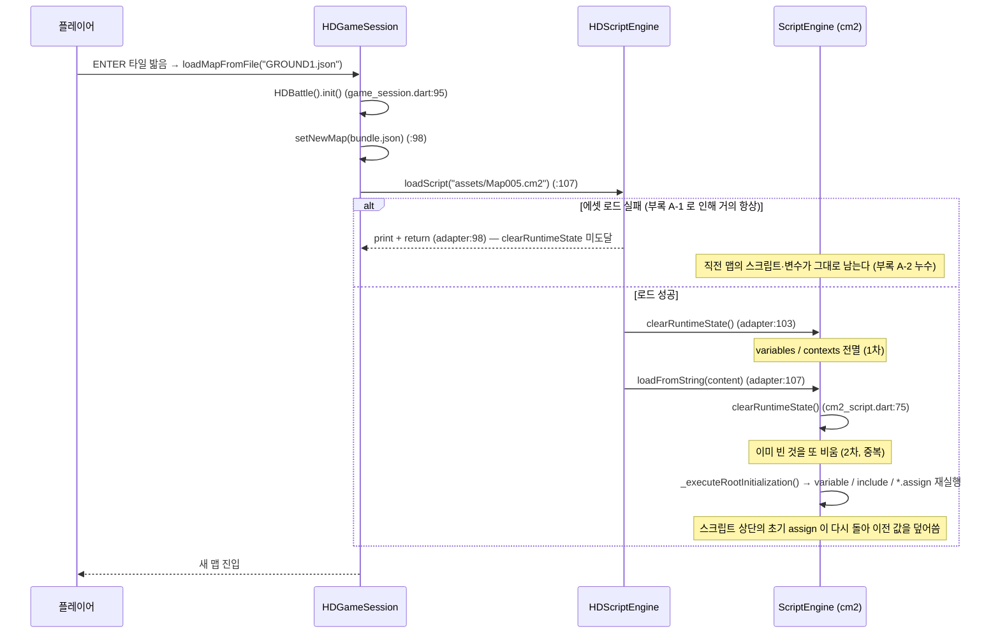
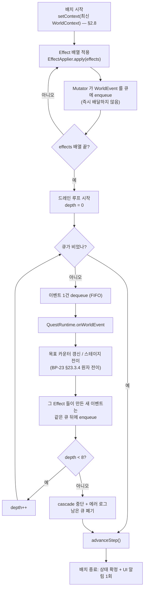

# 월드 상태 통합과 세이브 v2

> `상태: 보류` — **설계는 유효하나 현재 노선에서는 구현하지 않는다.**
> 지금 노선은 원작 방식(플래그 + cm2)의 **sample-first** 다 → [`issues/MILESTONES.md`](../issues/MILESTONES.md).
> 이 장이 필요해지는 신호는 [`issues/MILESTONES.md` §5](../issues/MILESTONES.md) 에 있다. **읽고 바로 구현하지 말 것.**

> **문서 ID**: BP-25 · **상태**: 개정 3판(D-29 반영) · **선행 문서**: [BP-20](20_target_architecture.md), [BP-21](21_content_pack_spec.md)
> **독자**: 런타임 구현자 · **한 줄 요약**: 3중으로 갈라진 이름 없는 정수 상태를 `WorldState` 하나로 모으고,
> 읽기(`WorldStateView`)/쓰기(`WorldStateMutator`) 를 분리하며, 세이브를 v2 로 올려 v1 을 무손실 마이그레이션한다.

**개정 이력**

| 판 | 내용 |
|---|---|
| 초판 | `WorldState` 14필드 · View/Mutator 분리 · 이벤트 큐 EV-1~8 · 세이브 v2 봉투 · v1 마이그레이션 |
| **개정 2판** | 검수 반영. D-20(이벤트 이름 12종 소유는 BP-23) · D-22(`mapDelta` 의 `base` 구분) · D-08a(논리 시각 `step`) 반영. 초판이 쓰던 이벤트 변형 이름 6종을 **폐기 이력으로 남기고**(§4.2) 소유 장 링크로 대체 |
| **개정 3판** | **D-29 반영** — 폐기된 `siteId` 표기를 정본 `<contextId>#<evalPath>`([BP-21 §6.5](21_content_pack_spec.md)) 로 전량 치환하고, **정의는 링크로만** 넘겼다(D-18·D-25: 소유 장의 스키마를 전재하지 않는다). `T-25-08b` 테스트 이름도 정본 표기로 고쳤다. **Q-52-4(이름 통합 미완)는 종결** — §3.1.1 이 폐기/정본 대조표로 그 사실을 남긴다 |

**파이프라인 구획(D-01)**: 이 장은 **Runtime** 이다. 단, §6 마이그레이션과 §7 버전 매트릭스가 참조하는
`legacyFlagMap` / `pack.version` / `migrations` 는 **Build** 산출물이다(→ [BP-21](21_content_pack_spec.md), [BP-35](35_ci_and_build.md)).
런타임은 그 산출물을 **읽기만** 하고 만들지 않는다.

## 0. 이 장의 소유 범위 (D-18)

D-18 의 SSoT 소유권 표에 따라 **이 장이 소유하는 것**과 **링크로만 다루는 것**을 먼저 못 박는다.
소유하지 않는 주제를 이 장에서 재정의하지 않는다 — 충돌 시 소유 장이 이긴다.

| 주제 | 소유 | 이 장의 태도 |
|---|---|---|
| **세이브 포맷 v2 봉투 전체**(필드명·`mapDelta`·레거시 플래그 보관 위치) | **BP-25 (이 장)** | §5 가 정본 |
| **`WorldState` 필드 전량** | **BP-25 (이 장)** | §2 가 정본 |
| **v1→v2 마이그레이션 / 세이브↔콘텐츠 호환 판정** | **BP-25 (이 장)** | §6·§7 이 정본 |
| **이벤트 큐(배치) 처리 규칙** | **BP-25 (이 장)** | §4.3 EV-1~8 이 정본. 단 "배치" 라는 이름과 판정 단위는 [BP-23 §23.4.5](23_quest_model.md) 와 **같은 것**이다 |
| 월드 이벤트 **이름 집합 12종과 payload** | **BP-23** (D-20) | §4.2 는 **링크만**. 이름·payload 재서술 금지 |
| Condition/Effect **op·do 전량** | **BP-21** (D-18) | 이름만 인용. 시그니처 재서술 금지 |
| ID 문법·문자열 키·`pack.json#migrations` **스텝 스키마** | **BP-21** | §7 은 판정 매트릭스만. 스텝 스키마는 [BP-21 §7.3](21_content_pack_spec.md) 링크 |
| Quest/Stage/Objective, Dialogue/Node/Choice **스키마** | **BP-23** / **BP-24** | 링크 |
| 앵커·트리거 인덱스 | **BP-26** | 링크 |
| **런타임 실행 경로**(디스패처 티어 0, `pendingNavigation`, `WorldRng`·`rngCursor` 소유자, 대화/퀘스트 루프) | **BP-27** | 링크. 본 장은 **저장 형태**만 |
| 이관 상태 기계·cm2 공존 | **BP-28** | 링크 |
| 아이템 실제 데이터·인벤토리 게임 규칙 | **BP-42** | 링크 |

> **식별자 표기**: 이 장은 `R-25-n`(요구사항), `INV-n`(불변식), `EV-n`(이벤트 큐 규칙), `SC-n`(세이브 호환 케이스),
> `SV-n`(용량 대책), `S1~S5`(현행 저장소), `T-25-nn`(**테스트 케이스** ID) 를 쓴다.
> `T-25-nn` 은 실행 태스크가 아니다 — [BP-51 §1](51_task_breakdown.md) 이 이를 `T-058` 하나로 묶어 관리한다.
> `SC-n` 은 GROUND_TRUTH 부록 `C-1~C-4`(세이브/결정론 실측)와 구분하기 위해 두 글자 접두사를 쓴다.

---

## 1. 현황 정밀 서술 — 상태가 3중으로 갈라져 있다

### 1.1 세 저장소의 소유자·수명·저장 여부

| # | 저장소 | 타입 | 코드 위치 | **실제로 쓰는 주체** | 수명 | 초기화 시점 | 세이브 |
|---|---|---|---|---|---|---|---|
| S1 | `HDGameOption.flags` | `List<bool>(256)` | `hadar2026_app/lib/domain/game_option.dart:9` | cm2 `Flag::Set/Reset` (`script_engine_adapter.dart:362`, `:369`) | 앱 프로세스 전체 | `HDGameOption.reset()` (`game_option.dart:20`) — **호출 지점 0건** | **O** (`save_manager.dart:22`) |
| S2 | `HDGameOption.variables` | `List<int>(256)` | `game_option.dart:10` | cm2 `Variable::Set/Add` (`script_engine_adapter.dart:376`, `:383`) | 앱 프로세스 전체 | 동상 | **O** |
| S3 | `HDNativeScriptRunner.flags` | `Map<int,bool>` | `native_script_runner.dart:22` | **(현재 없음)** — 아래 참조 | 앱 프로세스 전체 | `startNewGame()` 에서 `clear()` (`:39`) | **X** |
| S4 | `HDNativeScriptRunner.variables` | `Map<int,int>` | `native_script_runner.dart:23` | **(현재 없음)** | 앱 프로세스 전체 | 동상 (`:40`) | **X** |
| S5 | `HDScriptEngine.variables` | `Map<String,dynamic>` (cm2 엔진 내부) | `script_engine_adapter.dart:77` → `packages/cm2_script/lib/src/cm2_script.dart` | cm2 `variable` / `name.assign` | **맵 하나** | 맵 전환마다 전멸(§1.2) | **X** |

#### S3/S4 는 write-dead 다 (부록 A-3)

`HDNativeScriptRunner.setFlag`(`native_script_runner.dart:95`) 와 `isFlagSet`(`:91`) 은 실제 구현을 갖고 있지만
**레포 전체에 호출자가 0건**이다. 네이티브 맵 스크립트(`town1_map_script.dart:40`, `:79`)가 부르는 것은
자기 부모 클래스의 **미구현 스텁**이다:

```dart
// hadar2026_app/lib/application/scripting/map_script.dart:41-48
bool isFlagSet(int index) {
  // Requires implementation in GameModel / State
  return false;                 // ← 항상 false
}
void setFlag(int index) {
  // Requires implementation in GameModel / State
}                               // ← 아무 일도 하지 않는다
```

**결론**: S3/S4 는 **영원히 비어 있다.** "네이티브 스크립트가 세운 플래그가 저장되지 않는다" 는 진단은 정확하지 않다 —
정확한 진단은 **"네이티브 스크립트가 애초에 플래그를 세울 수 없다"** 이고, 그래서 네이티브 맵의 모든 조건 분기가
항상 거짓으로 평가된다. D-16-3("조건부 대화 필요")의 직접 근거다.

이 사실이 §5 의 세이브 포맷에 미치는 영향은 §5.2 의 **결정 SV-D1** 에서 다룬다.

#### 이름이 없다는 것의 실패 양식

세 저장소 전부 **이름이 없다.** 의미는 `assets/const.cm2` 의 상수 정의나 소스 주석에만 있고,
런타임에는 `flags[37]` 같은 정수 인덱스만 남는다. `Flag::Set` 핸들러는 범위 검사만 한다:

```dart
// hadar2026_app/lib/application/scripting/script_engine_adapter.dart:362
e.registerCommand('Flag::Set', (stmt, eng) async {
  final flagId = eng.getVal(stmt.args[0]);
  final idx = flagId is num ? flagId.toInt() : int.tryParse(flagId.toString()) ?? -1;
  if (idx >= 0 && idx < HDConfig.maxFlags) {
    flags()[idx] = true;          // ← else 가 없다
  }
});
```

부록 F-1 이 확정한 대로, `Flag::Set(300)` 은 **아무 일도 하지 않고 아무 로그도 남기지 않는다.**
`Flag::Reset` / `Variable::Set` / `Variable::Add` 전부 같다. 이것은 §9(미등록 심볼의 침묵 실패)와
**원인이 다른 별개 계열**이다 — 정상 문법·정상 심볼인데 값이 범위 밖일 때 생긴다.
**정수 인덱스에는 "범위 밖" 이라는 실패 양식이 내재한다.** 이름 있는 상태 키(D-04)를 채택해야 하는 직접 근거다.

### 1.2 맵 전환 시 cm2 전역이 날아가는 경로 (실측 추적)

```
HDGameSession.loadMapFromFile(fileName)            game_session.dart:85
  └─ HDScriptEngine().loadScript(_resolveCm2Asset(bundle.cm2Path!))   game_session.dart:107
       └─ HDScriptEngine.loadScript(assetPath)     script_engine_adapter.dart:92
            ├─ (실패 시) print + return             script_engine_adapter.dart:98   ← 부록 A-2
            ├─ _engine.clearRuntimeState()          script_engine_adapter.dart:103  ← 1차 소실
            └─ _engine.loadFromString(content)      script_engine_adapter.dart:107
                 └─ ScriptEngine.loadFromString     packages/cm2_script/lib/src/cm2_script.dart:74
                      └─ clearRuntimeState()        cm2_script.dart:75   ← 2차 소실 (중복 호출)
```

`clearRuntimeState()` 의 실체(`packages/cm2_script/lib/src/cm2_script.dart:67`):

```dart
void clearRuntimeState() {
  variables.clear();       // cm2 의 모든 이름 있는 변수
  _contexts.clear();       // Context::Set/Get 으로 만든 컨텍스트 전부
  _currentContextName = null;
  halted = false;
}
```



**두 갈래 모두 나쁘다.**
- 성공 경로: cm2 로 "이 마을 문지기와 이미 대화했다" 를 만들어도 대륙에 나갔다 오면 초기화된다.
- 실패 경로(부록 A-1 때문에 **등록 맵 15개 중 13개가 여기**): 직전 맵의 스크립트가 그대로 남아
  `currentMapCm2Path != null` 판정이 항상 참이 되고, 디스패치 3티어 중 **cm2 티어가 항상 선택**된다.

`native_script_runner.dart:20-21` 의 주석이 이 사실을 인정하고 있다 —
*"Script-owned state that must survive map transitions (per-map cm2 loads wipe HDScriptEngine globals), so it lives here, not there."*
그런데 그렇게 옮긴 S3/S4 는 §1.1 대로 **애초에 도달 불가능**하다. 두 저장소가 각각 다른 방식으로 무력하다.

### 1.3 세이브가 실제로 담는 것과 빠뜨리는 것

```dart
// hadar2026_app/lib/application/save_manager.dart:18
final Map<String, dynamic> data = {
  'version': 1,
  'party': session.party.toJson(),
  'gameSystem': session.gameSystem.toJson(),
  'gameOption': session.gameOption.toJson(),
  'map': session.map?.toJson(),
};
```

| 항목 | v1 저장 | 비고 |
|---|---|---|
| 파티(좌표·능력치·food/gold) | O | `party.toJson()` — `domain/party/party.dart:182` |
| `gameOption.flags/variables` | O | 이름 없는 정수 배열 그대로 |
| `gameOption.scriptFile` | O | 로드 시 `loadScript` 재실행의 근거 (`save_manager.dart:68`) |
| 맵 **타일 스냅샷** | O | `MapModel.toJson()` — `domain/map/map_model.dart:50` |
| 맵 **이름** | **X** | 어디에도 없다. `currentMapCm2Path`(`game_session.dart:83`)도 저장 안 됨 |
| 맵 **events[]** | **X** | 부록 C-1 |
| 네이티브 러너 flags/variables (S3/S4) | **X** | 어차피 write-dead(§1.1) |
| cm2 엔진 변수 (S5) | **X** | 어차피 맵 전환에서 소실 |

### 1.4 이 장이 전제하는 선행 결함 (GROUND_TRUTH 부록)

세이브·상태 설계는 아래 결함 위에 서 있다. **이 결함들이 고쳐지지 않으면 v2 설계의 일부가 성립하지 않는다.**
각 결함의 해소 태스크 번호는 [BP-51 §2](51_task_breakdown.md) 의 대응표를 따른다.

| 부록 | 사실 | 이 장에 미치는 영향 | 해소 태스크 |
|---|---|---|---|
| **A-1** | `map_navigation.dart:43` 이 `cm2Path = 'Map{id:03d}.cm2'` 를 **무조건** 설정. 실존 파일은 `Map002/003.cm2` 둘뿐 | §6.3 의 `scriptFile` 단서를 무력화 | T-005 |
| **A-2** | `loadScript` 가 실패 시 `clearRuntimeState()` 전에 early return(`adapter:98`) → 직전 맵 스크립트 누수 | §1.2 실패 경로. `scriptFile` 이 갱신되지 않음 | T-010 |
| **A-3** | `HDMapScript.isFlagSet/setFlag` 가 미구현 스텁 | S3/S4 가 write-dead → §5.2 SV-D1 | T-033 → T-111 |
| **B-2** | `battle.dart:27` 의 `0:Lose/2:Run` 과 `const.cm2:53-55` 의 `EVADE=0/LOSE=2` 가 **역전** | 전투 결과를 조건/실패 퀘스트에 쓸 수 없다 | T-025 → T-026 (정본 결정은 [BP-27 §7.1](27_runtime_engine.md)) |
| **B-3** | 이동·상호작용 트리거가 `presentation/panels/player_sprite.dart:103` 의 `update(dt)` 폴링 안에 있음 | §2.4 의 `step` 증가 트리거에 **소유자가 없다** | T-086 |
| **B-4** | `menu_flows.dart:2` 가 `dart:io`, `:504/:522/:540` 이 `exit(0)` | §8.1 의 "앱 백그라운드 자동 저장" 전제(웹)와 충돌. 헤드리스 세이브 테스트를 죽인다 | T-022 · T-023 |
| **C-1** | `MapModel.toJson()` 이 `events` 를 저장하지 않음 → 로드 후 JSON 대사 티어 영구 사망 | §5.3 근거 2 | T-014 |
| **C-2** | `save_manager.dart:86` 이 `setNewMap` 을 직접 호출 → 네이티브 맵 스크립트 미부착 | §5.3 근거 3 | T-015 |
| **C-3** | 맵 스냅샷 세이브 ~570KB → 웹 저장 한계 근접 | §8.3 | T-064 · T-065 |
| **C-4** | 벽시계 데미지 1곳 + 무시드 `Random()` 14곳 | §2.4 가 진단, 해소는 [BP-27 §9](27_runtime_engine.md) | T-017~T-020 |
| **D-1** | `MapInfos.json` 등록 15개 중 **7개가 존재하지 않는 파일로 해석**. TOWN1/GROUND1/DEN1/DEN2 는 동명 파일이 있는데도 `Map00N.json` 으로 해석돼 깨진다 | §5.3 의 "이름으로 재로드" 가 **지금은 작동하지 않는다** | T-004 · T-005 |
| **D-2** | 로드 실패가 `true`(성공)로 보고됨. 맵은 안 바뀌고 스크립트만 교체 | §6.3 맵 이름 추론이 **틀린 이름을 얻을 수 있다** | T-006 · T-007 |
| **F-2** | `bundle.json == null` 이어도 `mapScriptFactory` 조회는 실행 → 네이티브 스크립트가 **지오메트리 없는 맵에 부착** | 세이브 복원 시 같은 사고가 재현될 수 있다 | T-012 |
| **F-3** | `_battleResult` 초기값이 `1`(Win). `init()` 도 1 로 되돌림 → 전투 없이 `Battle::Result()` 가 승리 반환 | 전투 결과 기반 상태 전이를 신뢰할 수 없다 | T-027 |
| **G-2** | `Town2MapScript` 가 `mapScriptFactory` 에 등록돼 있으나 `TOWN2` 가 인덱스에도 파일에도 없어 **한 번도 실행된 적 없음** | 도달 불가 등록 항목 검출의 소유 문제 → [BP-27 §7.4](27_runtime_engine.md) | T-012 |

**추가 선행 결함 (이 장이 새로 확정)**: `HDSaveManager.loadGame` 은 **`GameReloadException` 을 던지지 않는다**
(`save_manager.dart:99`, `:104` 는 `true`/`false` 만 반환). 그 예외를 던지는 곳은 `menu_flows.dart:519`, `:536` 뿐이고
둘 다 `processGameOver`(필드 사망 / 전투 전멸) 경로다. 즉 **인게임 로드(`selectGameOption` case 4 → `selectLoadMenu`,
`menu_flows.dart:306-307`)는 현재 실행 루프를 되감지 않는다.** GROUND_TRUTH §7 의 서술("성공 로드는 `GameReloadException` 을
던져 현재 실행 루프를 되감고")은 이 점에서 부정확하다. §4.5·§8.2 가 이 소유 문제를 확정한다.

### 1.5 이 장이 세우는 요구사항

| ID | 요구사항 | 근거 |
|---|---|---|
| R-25-1 | 런타임 상태의 단일 저장소는 `WorldState` 하나다. S1·S2 는 레거시 다리를 통해서만, S3~S5 는 폐기 경로로 흡수된다 | §1.1, D-08 |
| R-25-2 | 모든 상태 키는 **이름**을 갖는다(D-04). 정수 인덱스는 마이그레이션·레거시 다리에만 존재한다 | §1.1, 부록 F-1 |
| R-25-3 | 상태는 맵 전환에서 소실되지 않는다 | §1.2 |
| R-25-4 | 세이브는 `currentMapName` 을 담고, 맵은 **`base` 종류에 따라** 복원한다(D-22). 이름은 **로드 성공이 확정된 뒤에만** 갱신한다 | §5.3, §5.4, 부록 D-2 |
| R-25-5 | Condition 평가는 **상태를 전혀 바꾸지 않는다.** `chance` 를 포함해도 그렇다(D-21 무커서 해시) | D-05, D-21, §3 |
| R-25-6 | v1 세이브는 데이터 손실 없이 v2 로 올라가거나, 실패 시 **명시적으로** 실패한다(조용한 부분 로드·폴백 금지) | D-08, §6 |
| R-25-7 | 상태 변경은 결정론적이어야 한다. 벽시계 시각을 `WorldState` 에 넣지 않는다(D-08a) | D-01, D-08a, §2.4 |
| R-25-8 | 월드 이벤트의 **이름과 payload 는 이 장이 정의하지 않는다.** [BP-23 §23.11.1](23_quest_model.md) 이 정본이다(D-18·D-20) | D-20 |
| R-25-9 | 세이브 쓰기/읽기는 **전부 검증 후 한 번에 커밋**한다. 커밋 지점 이전에 세션을 바꾸지 않는다 | §8.2 |

---

## 2. `WorldState` 완전 명세 (D-08 + D-08a 상세화)

### 2.1 필드 표

`domain/content/world_state.dart` 에 둔다(D-11). **이 표가 정본이다**(D-18).

| # | 필드 | 타입 | 필수 | 기본값 | 불변식 | 직렬화 형태 |
|---|---|---|---|---|---|---|
| 1 | `schemaVersion` | `int` | O | `2` | `>= 2`. 런타임 상수와 비교해 §7 매트릭스로 분기 | 정수 |
| 2 | `contentVersion` | `Map<String,String>` | O | `{}` | 키는 packId(D-04), 값은 semver | 객체, **키 정렬** |
| 3 | `flags` | `Set<String>` | O | `{}` | 원소는 `flag.<pack>.<domain>.<name>`. 합성 id 금지(§2.6) | **정렬된 배열** |
| 4 | `vars` | `Map<String,int>` | O | `{}` | 키는 `var.…`, 값은 64비트 정수. 값 0 도 보존 | 객체, 키 정렬 |
| 5 | `quests` | `Map<String,QuestProgress>` | O | `{}` | §2.2 | 객체, 키 정렬 |
| 6 | `inventory` | `Map<String,int>` | O | `{}` | 값 `>= 1`. 0 이 되면 **키 제거** | 객체, 키 정렬 |
| 7 | `npcStates` | `Map<String,String>` | O | `{}` | 값은 해당 actor 가 선언한 `states[]` 중 하나([BP-22](22_world_bible_model.md)) | 객체, 키 정렬 |
| 8 | `visited` | `Set<String>` | O | `{}` | 원소는 placeId | 정렬된 배열 |
| 9 | `journal` | `List<JournalEntry>` | O | `[]` | **링 버퍼**(§2.7). `journalHead` 와 함께 해석 | 배열(입력 순서) |
| 10 | `journalHead` | `int` | O | `0` | 폐기된 앞부분의 개수. 단조 증가 | 정수 |
| 11 | `dialogueMemory` | `Map<String,Set<String>>` | O | `{}` | 키 dialogueId, 값은 소비된 `nodeId`/`nodeId#choiceId` 집합(§2.6) | 객체, 키 정렬 + 값 배열 정렬 |
| 12 | `seed` | `int` | O | `0` | 새 게임 시작 시 1회 결정. 이후 불변 | 정수 |
| 13 | `step` | `int` | O | `0` | **논리 시각**(D-08a). 단조 증가. §2.4 | 정수 |
| 14 | `rngCursor` | `int` | O | `0` | **쓰기 경로 전용** 난수 커서(D-21). Condition 은 절대 건드리지 않는다 | 정수 |

`orphans`(마이그레이션 잔여물)는 **`WorldState` 의 필드가 아니다.** 세이브 최상위에 둔다 — §5.1·§6.4.
`currentMapName` 도 `WorldState` 가 아니라 세이브 최상위다 — 세션 상태이지 월드 상태가 아니기 때문이다(§5.1).

### 2.2 중첩 타입 (D-08a 반영)

```
QuestProgress {
  state:       "inactive" | "active" | "completed" | "failed"   // D-05 quest_state op 값과 동일 집합
  stage:       stageId | null       // state == active 일 때만 non-null
  counters:    Map<objectiveId, int>
  startedStep: int                  // WorldState.step 스냅샷  (D-08a: 구 startedAt)
  updatedStep: int                  // WorldState.step 스냅샷  (D-08a: 구 updatedAt)
}

JournalEntry {
  questId:  string
  stageId:  string | null
  entryKey: stringKey               // strings/ko.json 의 키
  atStep:   int                     // WorldState.step 스냅샷  (D-08a: 구 at)
}
```

> **D-08a**: *"퀘스트/저널의 시각 필드는 전부 이 `step` 을 기록한다(`startedStep`, `updatedStep`, `atStep`)."*
> 초판이 쓰던 `startedAt`/`updatedAt`/`at` 은 **전량 폐기**다. 벽시계가 필요하면 §5.1 의 `envelope` 에만 둔다.

불변식(런타임 assert 대상, [BP-27 §8](27_runtime_engine.md)):

| ID | 불변식 |
|---|---|
| INV-1 | `quests[q].state == active` ⇔ `quests[q].stage != null` |
| INV-2 | `state ∈ {completed, failed}` 인 퀘스트는 `active` 로 돌아가지 않는다(D-06). 디버그 커맨드만 예외(§9) |
| INV-3 | `inventory[i] >= 1` — 0 이하가 되면 키 제거 |
| INV-4 | `counters[o] <= objective.counter.target`. 도달 시 **완료 래치**로 고정되어 낮아지지 않는다([BP-23 §23.4.6](23_quest_model.md)) |
| INV-5 | `flags` / `visited` / `dialogueMemory` 의 값은 집합이므로 중복 없음. 직렬화는 항상 정렬 |
| INV-6 | `step` 은 감소하지 않는다 |
| INV-7 | `journal` 의 `atStep` 은 비감소 수열 |
| INV-8 | `startedStep <= updatedStep` |
| INV-9 | `journalHead + journal.length` 는 감소하지 않는다(총 발행 저널 수) |

### 2.3 Dart 골격과 정렬 직렬화

```dart
// lib/domain/content/world_state.dart   (Flutter foundation 만 import — D-11)
class MutableWorldState implements WorldStateView, WorldStateMutator {
  static const int kWorldStateSchemaVersion = 2;

  final int schemaVersion;
  final Map<String, String> contentVersion = {};
  final Set<String> flags = {};
  final Map<String, int> vars = {};
  final Map<String, QuestProgress> quests = {};
  final Map<String, int> inventory = {};
  final Map<String, String> npcStates = {};
  final Set<String> visited = {};
  final List<JournalEntry> journal = [];
  int journalHead = 0;
  final Map<String, Set<String>> dialogueMemory = {};
  final int seed;
  int step = 0;
  int rngCursor = 0;

  /// 실행 문맥. WorldState 에 저장되지 않고 런타임이 매 배치 전에 갱신한다(§2.8).
  WorldContext context = const WorldContext.empty();

  /// **정렬(canonical) 직렬화.** 같은 상태는 항상 같은 바이트열이 되어야 한다(D-15).
  Map<String, dynamic> toJson();
  static MutableWorldState fromJson(Map<String, dynamic> json);

  /// 세이브 무결성 확인용. context 는 해시 대상이 아니다.
  String contentHash();     // sha256(canonicalJson) 앞 16자
}
```

Dart 의 `Map`/`Set` 은 삽입 순서를 유지하므로(LinkedHashMap), 정렬하지 않으면 같은 상태가 플레이 경로에 따라
다른 바이트열이 된다 → D-15 의 "결정론 재빌드 해시 일치" 게이트를 통과할 수 없다. **모든 집합·맵은 출력 시 정렬한다.**

### 2.4 시간 — 벽시계를 쓰지 않는다 (D-08a)

`step` 은 **월드 스텝 카운터**다. [BP-23 §23.11.1](23_quest_model.md) 이 정의한 월드 이벤트를 **한 배치 처리할 때마다** 1 증가한다.

| 증가 트리거 | 현재 코드 소유자 | 상태 |
|---|---|---|
| 파티가 한 칸 이동 완료 | **소유자 없음** — 이동 루프가 `presentation/panels/player_sprite.dart:103` 의 `update(dt)` 폴링 안에 있다(부록 B-3) | **선결 과제**. `application/` 으로 추출해야 `step` 을 올릴 수 있다 → [BP-51 T-086](51_task_breakdown.md) |
| 타일 상호작용 1회 종료 | `HDTileEventDispatcher.check` 의 `finally`(`tile_event_dispatcher.dart:96-103`) | 가능 |
| 전투 1회 종료 | `HDBattle.gotoEndBattle`(`battle.dart:236`) | 가능 |
| 메뉴 액션 1회(휴식 등) | `HDMenuFlows.restHere`(`menu_flows.dart:146`) | 가능 |

> **경고**: 첫 행이 해소되기 전에는 `survive`/`reach`/타임아웃 목표([BP-23 §23.4](23_quest_model.md))가 진행되지 않고,
> 헤드리스 시뮬레이터(D-13)도 이동을 구동할 수 없다. `presentation` 에서 `WorldStateMutator` 를 부르는 것은
> D-11 배치·CI 계층 grep 과 정면 충돌하므로 **우회하지 않는다.** 추출이 유일한 해법이다.

벽시계(`DateTime.now()`)는 `WorldState` 어디에도 들어가지 않는다. 표시용 날짜가 필요하면 세이브 **봉투**에만 둔다(§5.1).
현재 코드의 벽시계 의존(`domain/party/player.dart:71`)의 제거는 [BP-27 §9](27_runtime_engine.md) 소관이다.

### 2.5 크기 추정

canonical JSON(공백 없음, UTF-8) 기준. ID 가 D-04 형식이라 길다는 점을 반영했다.

| 요소 | 단가(바이트) | 산출 근거 |
|---|---|---|
| flag 1개 | ~46 | `"flag.gen_ep1.quest.missing_scholar.met_client",` |
| var 1개 | ~48 | 키 40자 + `":` + 값 + 쉼표 |
| quest 1개 | ~192 | id + state/stage/startedStep/updatedStep + counters 2개 |
| inventory 1개 | ~34 | `"item.core.rusty_key":3,` |
| npcState 1개 | ~58 | actorId + 상태 문자열 |
| visited 1개 | ~30 | placeId |
| journal 1개 | ~122 | questId + stageId + entryKey + atStep |
| dialogueMemory 1항목 | ~40 | `"n3#c_ask",` (dialogueId 키는 항목들이 공유) |

| 규모 | flags | vars | quests | inv | npc | visited | journal | dlgMem | **worldState 계** |
|---|---|---|---|---|---|---|---|---|---|
| 소(프로토타입) | 50 (2.3K) | 20 (1.0K) | 5 (1.0K) | 10 (0.3K) | 15 (0.9K) | 10 (0.3K) | 30 (3.7K) | 30 (1.2K) | **≈ 11K** |
| 중(1 에피소드) | 300 (13.8K) | 120 (5.8K) | 40 (7.7K) | 40 (1.4K) | 80 (4.6K) | 50 (1.5K) | 200 (24.4K) | 200 (8.0K) | **≈ 67K** |
| 대(전작 분량) | 1200 (55K) | 500 (24K) | 150 (29K) | 120 (4.1K) | 300 (17K) | 200 (6K) | 500 (61K) | 800 (32K) | **≈ 228K** |

**플래그 N개의 대략식**: `bytes ≈ 46·N_flag + 48·N_var + 192·N_quest + 122·N_journal + 40·N_dlgMem + 상수(≈320)`.

세이브 **전체** 총량은 `worldState` 만이 아니다. 누락 없이 세면:

| 블록 | 소 | 중 | 대 | 근거 |
|---|---|---|---|---|
| `worldState` | 11K | 67K | 228K | 위 표 |
| `gameOption.flags` (256칸 bool) | 1.6K | 1.6K | 1.6K | `[false,true,…]` — v2 에서도 **유지**(§5.2) |
| `gameOption.variables` (256칸 int) | 0.8K | 0.8K | 0.8K | 대부분 0 |
| `party`(6칸, 빈 슬롯 생략 후) | ~1.5K | ~2.5K | ~3K | `party.dart:182` |
| `gameSystem` | ~0.3K | ~0.3K | ~0.3K | |
| `envelope` + `orphans` | ~0.4K | ~0.6K | ~1K | §5.1 |
| `mapDelta` (`base: asset`) | ~0.3K | ~2K | ~6K | 변경 칸 수십 건 |
| `mapDelta` (`base: generated`, RLE) | 8~40K | 8~40K | 8~40K | §5.4.3 |
| **합계 (asset base)** | **≈ 16K** | **≈ 75K** | **≈ 241K** | |
| **합계 (generated base)** | **≈ 24~56K** | **≈ 81~113K** | **≈ 249~281K** | |

### 2.6 `dialogueMemory` — 1회성 기록을 플래그에 섞지 않는다

[BP-24 §24.9.2](24_dialogue_model.md) 의 `Node.once` 와 [BP-24 §24.2.3](24_dialogue_model.md) 의 `Choice.once` 는
"이미 봤다/골랐다" 를 기록해야 한다. 이것을 `flags` 에 합성 id 로 넣는 것은 **금지**한다.

| 방식 | 문제 |
|---|---|
| `flag.<pack>.dlg.<dialogueId>.<nodeId>.<choiceId>` 합성 | D-04 슬러그 규칙(3~48자) 초과. 대화 100개×선택 3개 = 300 플래그가 `flags` 에 영구 누적. §6.2 의 `legacyFlagMap` 역참조·§6.4 orphan 처리·§2.5 크기 추정이 전부 오염된다 |
| **`dialogueMemory` 전용 필드 (채택)** | 키 공간이 분리되어 플래그 의미론을 오염하지 않는다. 대화 단위로 통째 삭제 가능(재방문 리셋) |

```
dialogueMemory: {
  "dlg.gen_ep1.guard_intro": ["n1", "n3#c_ask_about_scholar"]
}
```

- 원소가 `nodeId` 뿐이면 **노드 1회성**(`Node.once`), `nodeId#choiceId` 이면 **선택지 1회성**(`Choice.once`).
- 조회 API 는 §3.2 의 `isNodeConsumed` / `isChoiceConsumed` 다. [BP-24](24_dialogue_model.md) 의 `ctx.consumeChoice(...)` 가 §3.3 의 `consumeChoice` 로 내려온다.
- **`WorldState` 에 있으므로 세이브된다.** 이것이 `visitedNodes` 를 런타임 임시 변수로 두지 않는 이유다.

### 2.7 `journal` 은 링 버퍼다

초판은 `journal` 을 "append-only" 라 하면서 "상한 500 초과 시 앞에서 폐기" 라 했다 — 모순이다. 확정:

| 규칙 | 내용 |
|---|---|
| 추가는 뒤로만 | `appendJournal` 은 항상 끝에 붙인다 |
| 상한 | `kMaxJournalEntries = 500` |
| 초과 시 | **head 를 전진**시킨다: `journal.removeAt(0)` + `journalHead++` |
| 결정론 | `journalHead` 가 상태에 저장되므로 "같은 상태" 의 정의가 폐기 이력에 의존하지 않는다 |
| 저널 UI | `journalHead` 를 오프셋으로 써서 "총 N건 중 최근 500건" 을 표시([BP-41](41_journal_ui_spec.md)) |

### 2.8 `WorldContext` — 상태가 아닌 실행 문맥

D-05 의 op 중 `map_is`, `gold_cmp`, `party_level_cmp`, `party_has_class`, `time_of_day` 다섯은
`WorldState` 의 필드로 답할 수 없다. 이들을 위해 **저장되지 않는 문맥 값 객체**를 둔다.

```dart
// lib/domain/content/world_state.dart — 순수 값 객체, 직렬화 대상 아님
class WorldContext {
  const WorldContext({
    required this.currentMap,      // String?  — 현재 맵 논리 이름
    required this.gold,            // int
    required this.food,            // int
    required this.maxPartyLevel,   // int      — players 중 level.physical 최대
    required this.classes,         // Set<int> — 파티에 존재하는 characterClass 집합
    required this.timeOfDay,       // TimeOfDay — v1 은 항상 day (아래)
  });
  const WorldContext.empty();
}

enum TimeOfDay { day, night }
```

| 항목 | 갱신 주체 | 갱신 시점 |
|---|---|---|
| `currentMap` | `ContentRuntime` | `HDGameSession.loadMapFromFile` **성공 확정 후**(§5.3, D-22) |
| `gold` / `food` / `maxPartyLevel` / `classes` | `ContentRuntime` | **월드 이벤트 배치를 드레인하기 직전 1회**(§4.3 드레인 시작 지점). 배치 도중에는 고정 |
| `timeOfDay` | — | **v1 에서는 항상 `day`** |

> **`time_of_day` 규약(본문 확정)**: D-05 는 `time_of_day` 를 v1 확정 op 집합에 넣었지만
> D-16 은 시간대를 1차 스코프 밖 후보로 뒀다. 이 장은 **"v1 런타임에서 `timeOfDay` 는 항상 `day`"** 로 확정한다.
> 따라서 `{"op":"time_of_day","value":"night"}` 는 **항상 거짓**이다.
> 이것이 D-02 가 지적한 "조용한 오분기" 가 되지 않도록, **빌드가 `time_of_day` 사용을 경고(soft gate)로 보고**해야 한다
> ([BP-33](33_validation_and_lint.md) 에 요청). 결정 재검토 요청은 §11.3 Q-25-1 에 남긴다.

`WorldContext` 는 **읽기 전용**이며 `contentHash()` 대상이 아니다. 갱신 시점을 배치 경계로 못 박았기 때문에
같은 배치 안에서 조건을 여러 번 평가해도 값이 흔들리지 않는다 — Condition 순수성(R-25-5)이 유지된다.

---

## 3. 읽기/쓰기 접근 규약 — View 와 Mutator 분리

### 3.1 왜 나누는가

| 이유 | 설명 |
|---|---|
| **순수성 보장** | D-05 는 Condition 을 "부작용 없음, 순수 함수" 로 확정했다. 읽기 전용 인터페이스만 주면 **컴파일 타임에** 위반이 잡힌다 |
| **`chance` 도 순수하다 (D-21 · D-21a)** | `chance(p) := (splitmix64(seed, step, hash("<contextId>#<evalPath>")) % 100) < p`. `seed`·`step` 은 View 로 읽히고 `"<contextId>#<evalPath>"` 는 **빌드가 굽은 상수**다. **커서를 소비하지 않으므로** 조건 평가가 상태를 바꾸지 않는다. 키의 **정의·형식·부여 규칙은 [BP-21 §6.5](21_content_pack_spec.md) 소유**이며 이 장은 링크만 한다(D-18·D-25) |
| **시뮬레이터/솔버 재사용** | D-13 의 `QuestSolver` 는 상태를 노드로 보고 탐색한다. 조건 평가가 상태를 건드리면 탐색이 오염된다. D-21 덕분에 솔버는 `chance` 의 **양 분기를 자유롭게 탐색**할 수 있다 |
| **CLI 검증기 공유** | D-12 는 `hadar_content` CLI 가 `domain/content/` 평가기를 그대로 import 한다고 확정했다. View 는 실제 상태 말고 솔버가 만든 가상 상태로도 구현할 수 있다 |
| **이벤트 발행 강제** | Mutator 를 통해서만 쓰게 하면 모든 변경을 한 지점에서 가로채 이벤트 큐로 흘려보낼 수 있다(§4). 필드 직접 대입은 이벤트를 빠뜨린다 |

#### 3.1.1 `chance` 해시 키의 이름 — 폐기 표기와 정본 (D-21a · D-29)

D-21 초판은 이 키를 `siteId` 라 불렀고 이 장의 개정 2판까지 그 이름을 썼다. 그런데
[BP-21 §6.5](21_content_pack_spec.md) 가 같은 것을 `<contextId>#<evalPath>` 로 이미 정의하고 있었다 —
**한 개념에 두 이름이 붙어 있었다.**

| 표기 | 상태 | 근거 |
|---|---|---|
| ~~`siteId`~~ | **폐기** | D-21a. "같은 것의 두 이름" 이었음이 Q-52-4 로 적발됨 |
| `<contextId>#<evalPath>` | **정본** | D-18(DSL 소유는 BP-21) → 정의는 [BP-21 §6.5](21_content_pack_spec.md) |

- **Q-52-4(이름 통합 미완)는 종결이다.** 이 장에 남아 있던 `siteId` **4곳**(§3.1 순수성 표 · §3.2 op 대응표 ·
  `T-25-08b` 테스트 이름 · §11.2 넘김 항목)을 정본 표기로 치환했다. 개정 3판 이후 이 장의 `siteId` 등장은
  **이 절의 폐기 이력뿐**이며 살아 있는 사용은 없다.
- **이 장은 키의 정의를 재서술하지 않는다.** `contextId` 가 무엇을 가리키고 `evalPath` 를 어떻게 만드는지,
  선택 필드 `seedKey` 로 구조 경로 변경의 파급을 끊는 탈출구까지 전부 [BP-21 §6.5](21_content_pack_spec.md) 소유다.
  D-25 가 못 박은 대로 — **소유 장의 정의를 옮겨 적는 행위 자체가 오류원**이다(D-20a 의 9행 오기가 그 예).
- 이 장이 이 키에 대해 갖는 관심은 **딱 두 가지**다: ① 키가 **빌드 상수**여서 `WorldStateView` 에
  난수 인자를 추가하지 않는다(R-25-5), ② 키가 커서를 밀지 않으므로 `rngCursor` 가 **세이브에서 변하지 않는다**.

### 3.2 `WorldStateView` (읽기 전용)

```dart
// lib/domain/content/world_state.dart
/// Condition 평가와 UI 조회가 쓰는 유일한 읽기 창구. 구현체는 부작용이 없어야 한다.
abstract class WorldStateView {
  // --- 결정론 기반값 (chance 해시의 입력) ---
  int get schemaVersion;
  int get step;
  int get seed;

  // --- 저장되는 상태 ---
  bool    hasFlag(String id);                         // 미등록 id → false
  int     getVar(String id);                          // 미설정 → 0
  int     itemCount(String id);                       // >= 0
  QuestState questState(String id);                   // 미등록 → inactive
  String? questStage(String id);                      // active 아니면 null
  int     objectiveCounter(String questId, String objectiveId);   // >= 0
  bool    isVisited(String placeId);
  String? npcState(String actorId);                   // 미설정 → null
  bool    isNodeConsumed(String dialogueId, String nodeId);
  bool    isChoiceConsumed(String dialogueId, String nodeId, String choiceId);
  String? packVersion(String packId);                 // §7 판정용

  // --- 실행 문맥 (§2.8, 저장 안 됨) ---
  WorldContext get context;

  // --- 덤프/UI 전용, 전부 unmodifiable ---
  List<JournalEntry> get journalView;
  int get journalHead;
  Set<String> get flagsView;
  Map<String, int> get varsView;
}
```

**계약** — 전 메서드 공통:

| 항목 | 규약 |
|---|---|
| 사전조건 | 없음. id 형식 검증을 하지 않는다(빌드가 이미 했다) |
| 사후조건 | 호출해도 상태가 바뀌지 않는다. 같은 상태·같은 인자면 항상 같은 값 |
| 예외 | **절대 던지지 않는다** |
| 미지 id | 위 표의 "기본값" 을 반환. 디버그 빌드는 `assert` 로 시끄럽게([BP-27 §8](27_runtime_engine.md)) |

**"절대 던지지 않는다" 는 의도적**이다. 조건 평가 중 예외가 나면 대화 한복판에서 게임이 멈춘다.
콘텐츠 데이터 오류는 **빌드(D-15 hard gate)에서 잡히므로**, 런타임 평가기는 "모르는 것 = 거짓" 으로 처리한다.

**op 커버리지 확인** — D-05 가 확정한 op 전량이 이 인터페이스로 평가 가능하다:

| op 계열 | 창구 |
|---|---|
| `true`/`false`/`and`/`or`/`not` | 구조 |
| `flag` / `var_cmp` / `has_item` | `hasFlag` / `getVar` / `itemCount` |
| `quest_state` / `quest_stage` | `questState` / `questStage` |
| `visited` / `npc_state` | `isVisited` / `npcState` |
| `map_is` | `context.currentMap` |
| `gold_cmp` | `context.gold` |
| `party_level_cmp` | `context.maxPartyLevel` |
| `party_has_class` | `context.classes` |
| `time_of_day` | `context.timeOfDay` — v1 은 항상 `day`(§2.8) |
| `chance` | `seed` + `step` + 빌드가 굽은 `"<contextId>#<evalPath>"` 해시 (D-21·D-21a, 정의는 [BP-21 §6.5](21_content_pack_spec.md)). **인자 추가 없음** |

`ConditionEvaluator.evaluate` 의 시그니처에 **난수 인자가 없다**는 것이 R-25-5 의 타입 수준 강제다.
구현 상세는 [BP-27 §2.4·§9.2](27_runtime_engine.md).

### 3.3 `WorldStateMutator` (쓰기 전용)

```dart
// lib/domain/content/world_state.dart
/// Effect 적용이 쓰는 유일한 쓰기 창구. 모든 변경은 월드 이벤트를 큐에 넣을 수 있다.
abstract class WorldStateMutator {
  WorldStateView get view;              // 쓰기 도중 읽기가 필요할 때(예: add_var)

  void setFlag(String id);
  void clearFlag(String id);
  void setVar(String id, int value);
  void addVar(String id, int delta);

  void giveItem(String id, {int count = 1});
  int  takeItem(String id, {int count = 1});     // 실제로 빠져나간 개수

  void setQuestState(String questId, QuestState state);
  void setQuestStage(String questId, String stageId);
  void resetObjectiveCounters(String questId, Iterable<String> objectiveIds);
  void bumpObjectiveCounter(String questId, String objectiveId, int delta, {int? target});

  void setNpcState(String actorId, String state);
  void markVisited(String placeId);
  void appendJournal(JournalEntry entry);

  void consumeNode(String dialogueId, String nodeId);
  void consumeChoice(String dialogueId, String nodeId, String choiceId);
  void forgetDialogue(String dialogueId);        // 재방문 리셋([BP-24 §24.9](24_dialogue_model.md))

  void advanceStep();                            // §2.4 트리거에서만
  void setContext(WorldContext ctx);             // §2.8, 배치 시작 시 1회

  /// **쓰기 경로 전용 시드 난수** (D-21). Effect·전투만 쓴다.
  /// Condition 평가는 이 메서드에 도달할 수 없다 — WorldStateView 에 없기 때문.
  int nextRandom(int maxExclusive);
}
```

**계약**:

| 메서드 | 사전조건 | 사후조건 | 위반 시(디버그 / 릴리스) |
|---|---|---|---|
| `setFlag`/`clearFlag` | 없음 | `flag_changed` 를 큐에 넣는다(값이 실제로 바뀐 경우만) | — |
| `setVar`/`addVar` | 없음 | `var_changed` 를 큐에 넣는다(값이 바뀐 경우만) | — |
| `giveItem` | `count >= 1` | 인벤토리 증가, `item_gained` 큐잉 | `assert` / `count<=0` 무시 |
| `takeItem` | `count >= 1` | 0 클램프, 0 되면 키 제거(INV-3), `item_lost` 큐잉 | `assert` / 무시 |
| `setQuestState` | INV-2 | 상태 전이 + `updatedStep = step` | `assert` / 역행 무시 + 로그 |
| `setQuestStage` | 해당 퀘스트가 `active` | INV-1 유지, `updatedStep = step` | `assert` / `active` 로 승격 후 진행 |
| `bumpObjectiveCounter` | `delta != 0` | `target` 클램프 + **완료 래치**(INV-4) | `assert` / 무시 |
| `appendJournal` | `entry.atStep == step` | 링 버퍼 규칙(§2.7) 적용 | `assert` / `atStep` 을 `step` 으로 교정 |
| `consumeNode`/`consumeChoice` | 없음 | `dialogueMemory` 에 추가(멱등) | — |
| `advanceStep` | 없음 | `step` 이 정확히 1 증가(INV-6) | — |
| `setContext` | **드레인 중이 아님** | `context` 교체 | `assert` / 무시(배치 도중 문맥 변경 금지) |
| `nextRandom` | `maxExclusive > 0` | `rngCursor += 1`, 결정론적 값 반환 | `assert` / `0` 반환 |

**이벤트 큐잉 규칙**: Mutator 는 이벤트를 **큐에 넣기만** 하고 배달하지 않는다(EV-1).
이벤트 이름·payload 는 [BP-23 §23.11.1](23_quest_model.md) 이 정본이다(R-25-8).

### 3.4 구현체와 사용 규칙

| 소비자 | 받는 타입 | 이유 |
|---|---|---|
| `ConditionEvaluator.evaluate` | `WorldStateView` | D-05 순수성 |
| `EffectApplier.apply` | `WorldStateMutator` | 변경 지점 단일화 |
| `QuestRuntime` 목표 판정 | `WorldStateView` | 판정은 읽기, 전이만 Mutator |
| `DialogueRuntime` | `WorldStateMutator`(내부에서 `.view`) | 노드 진입 조건은 View 로 |
| 저널 UI ([BP-41](41_journal_ui_spec.md)) | `WorldStateView` | UI 는 절대 쓰지 않는다 |
| `HDSaveManager` | `MutableWorldState` | 직렬화/역직렬화 전용 |
| `QuestSolver` (D-13) | `WorldStateView` + 복제본 Mutator | 탐색 노드마다 복제. `chance` 는 양 분기 탐색(D-21) |
| 디버그 커맨드(§9) | `WorldStateMutator` | 유일하게 INV-2 를 어길 수 있는 경로 |

**금지 규칙**: `MutableWorldState` 를 public getter 로 외부에 내주지 않는다.
`ContentRuntime` 이 **두 얼굴 중 하나만** 넘기는 것이 유일한 접근 경로다(구현은 [BP-27 §2.7](27_runtime_engine.md)).
직렬화가 필요한 `HDSaveManager` 만 의도가 드러나는 이름(`stateForPersistence`)으로 접근한다.

---

## 4. 변경 알림과 월드 이벤트

### 4.1 왜 이벤트가 필요한가

D-16 의 6번: 전투 승리/아이템 획득/입장이 **퀘스트 목표를 자동으로 진행시키려면** 상태 변경이 관찰 가능해야 한다.
폴링은 카운터형 목표를 셀 수 없고, 퀘스트 수에 비례해 비싸진다.

### 4.2 이벤트 카탈로그 — **BP-23 소유** (D-20)

> **이 장은 이벤트 이름과 payload 를 정의하지 않는다.**
> 정본은 **[BP-23 §23.11.1 "이벤트 이름 집합 (v1 확정 — 12종, 닫힌 집합)"](23_quest_model.md)** 이다.
> `talk`, `enter_place`, `step_tile`, `battle_won`, `item_gained`, `item_lost`, `flag_changed`,
> `var_changed`, `dialogue_choice`, `map_changed`, `gold_changed`, `party_rested` 12종.
> 초판이 쓰던 `talked_to` / `entered_place` / `choice_made` / `item_delivered` / `turn_survived` /
> `quest_state_changed` 는 **전량 폐기**한다(D-20).
> objective kind × 이벤트 매핑표와 커버리지 증명도 [BP-23 §23.11.2·§23.11.4](23_quest_model.md) 소관이다.

이 장이 다루는 것은 **"이 저장소의 어떤 변경이 어떤 이벤트를 큐에 넣는가"** 뿐이다.

| `WorldStateMutator` 호출 | 큐잉하는 이벤트 | 발행 가능 여부 |
|---|---|---|
| `setFlag` / `clearFlag` (값이 실제로 바뀔 때만) | `flag_changed` | ✅ 지금 가능 |
| `setVar` / `addVar` (값이 실제로 바뀔 때만) | `var_changed` | ✅ 지금 가능 |
| `giveItem` | `item_gained` | ⛔ **미발행** — 인벤토리 개념이 아직 없다 |
| `takeItem` | `item_lost` | ⛔ **미발행** — 동상 |
| `consumeChoice` (대화 런타임이 함께 발행) | `dialogue_choice` | ✅ 가능 |
| `markVisited` | `enter_place` | ⛔ **미발행** — 장소(place) 개념이 아직 없다 |

**미발행 이벤트의 의존관계 (D-20 말미 요구사항)**:

| 이벤트 | 발행 지점이 없는 이유 | 생기는 조건 |
|---|---|---|
| `item_gained` / `item_lost` | `PartyInventory` 가 `food`/`gold` 정수 2개뿐이다(`domain/party/party.dart:13-16`). 아이템 목록 자체가 없다 | **[BP-42](42_item_and_inventory.md)** 가 아이템 카탈로그와 인벤토리를 신설한 뒤 |
| `enter_place` | `place` 엔티티와 맵↔place 매핑이 없다 | **[BP-22](22_world_bible_model.md)** 가 `places.json` 을, [BP-26](26_entity_registry_and_anchors.md) 가 place 바인딩을 만든 뒤 |

> **따라서** `acquire`/`deliver` objective 와 place 형 `reach` objective 는 **v1 런타임에서 진행되지 않는다.**
> [BP-23 §23.11.4](23_quest_model.md) 의 커버리지 증명은 "이벤트 집합이 kind 를 덮는다" 를 말하는 것이지
> "지금 발행된다" 를 말하는 것이 아니다. 이 구분을 [BP-33](33_validation_and_lint.md) 의 lint 가
> **"현재 발행되지 않는 이벤트에만 의존하는 목표" 경고**로 잡아야 한다.

나머지 이벤트(`talk`, `step_tile`, `battle_won`, `map_changed`, `gold_changed`, `party_rested`)의
발행 지점은 런타임 실행 경로이므로 [BP-27 §7](27_runtime_engine.md) 소관이다.

### 4.3 큐(배치) 처리 순서 — EV-1~8 (이 장 소유)

> **용어 정합**: 이 장의 "드레인 사이클" 은 [BP-23 §23.4.5](23_quest_model.md) 의 **"배치(batch)"** 와 **같은 것**이다.
> BP-23 은 목표 판정 관점에서, 이 장은 큐 자료구조 관점에서 같은 경계를 서술한다. 경계는 하나뿐이다:
> **한 상호작용(`beginNarrative` … `endNarrative` 1쌍) = 한 배치 = 한 드레인.**



**확정 규칙**:

| ID | 규칙 |
|---|---|
| EV-1 | 이벤트는 **즉시 배달하지 않는다.** `Effect[]` 배열 하나가 전부 적용된 뒤에 드레인한다. 배열 중간에 퀘스트가 전이돼서 뒤쪽 Effect 의 전제가 바뀌는 것을 막는다 |
| EV-2 | 큐는 **FIFO**. 발행 순서 = 처리 순서 = 결정론. [BP-23 §23.11.3](23_quest_model.md) "재정렬 금지" 와 같은 규칙 |
| EV-3 | 드레인 중 발행된 이벤트는 **같은 큐 뒤에 붙는다**(깊이 우선 아님) |
| EV-4 | `maxCascadeDepth = 8`. **[BP-23 §23.3.4](23_quest_model.md) 의 "재평가 루프 최대 8회" 와 같은 수치·같은 의미다.** 초과 시 남은 큐를 폐기하고 **에러** 로그(`QV-13` 위반). 릴리스에서도 게임을 멈추지 않는다 |
| EV-5 | 드레인은 **재진입 불가**. 이미 드레인 중이면 `publish` 는 큐에 넣기만 하고 즉시 반환 |
| EV-6 | 같은 배치 안에서 동일 `(이벤트, payload)` 가 반복되면 **첫 건만** 남긴다. 단 `step_tile` 은 예외(누적이 의미 있음) — [BP-23 §23.11.3](23_quest_model.md) 과 동일 |
| EV-7 | UI 알림(저널 배지 / progress 1줄)은 **드레인이 끝난 뒤 1회**. 한 배치에서 스테이지가 3번 전이해도 알림은 병합해 1회, 최대 3줄 + "외 N건"([BP-23 §23.9](23_quest_model.md)) |
| EV-8 | `advanceStep()` 은 **드레인 종료 직후 정확히 1회**. 배치 도중에는 `step` 이 고정되므로 같은 배치의 `chance` 값이 흔들리지 않는다(D-21) |

**Effect 연쇄의 종료 보장 (증명 스케치)**:

1. 한 드레인의 반복 횟수는 `depth < 8` 로 상한이 있다(EV-4).
2. 각 반복에서 처리하는 이벤트 수는 유한하다(큐는 유한, EV-6 이 중복을 제거).
3. 스테이지 전이 자체도 [BP-23 §23.3.4](23_quest_model.md) 의 재평가 루프 8회 상한을 갖는다.
4. 지연 효과(§4.4)는 드레인에 참여하지 않고 **드레인 종료 후 1건만** 실행되므로 연쇄에 기여하지 않는다.
→ **드레인은 반드시 유한 시간에 종료한다.** 사이클 검출은 별도로 하지 않는다(깊이 상한이 필요충분).

### 4.4 재진입·무한 루프 방지 — 지연 효과

효과가 다시 효과를 부르는 경로는 두 가지다.

| 경로 | 예시 | 방어 |
|---|---|---|
| **Effect → 퀘스트 전이 → `onEnter` Effect → …** | `set_flag` → 목표 충족 → 다음 스테이지 `onEnter` 가 또 `set_flag` | EV-4 + [BP-23 §23.3.4](23_quest_model.md) |
| **Effect → 대화 시작(`play_dialogue`) → 대화 Effect → …** | 대화 노드가 자기를 다시 여는 대화를 연다 | `play_dialogue` 는 **지연 효과**. 즉시 실행하지 않고 대기 슬롯에 넣는다 |

D-05 가 확정한 do 전량을 **즉시/지연** 둘로 나눈다.

| 분류 | do (D-05 확정 집합에서) | 실행 시점 |
|---|---|---|
| **즉시 효과 (19)** | `set_flag`, `clear_flag`, `set_var`, `add_var`, `give_item`, `take_item`, `add_gold`, `add_food`, `start_quest`, `advance_quest`, `complete_quest`, `fail_quest`, `set_npc_state`, `change_tile`, `journal`, `heal_party`, `grant_exp`, `set_encounter`, `unlock_place` | Mutator 즉시 |
| **지연 효과 (3)** | `warp`, `start_battle`, `play_dialogue` | 드레인 완료 후, **한 개만** |

- 합계 22 — D-05 가 확정한 do 전량과 일치한다.
- 지연 효과가 한 배치에서 2개 이상 지정되면 **첫 번째만 실행하고 나머지는 경고**한다.
  ([BP-33](33_validation_and_lint.md) 의 hard gate 가 원래 막아야 하지만 런타임도 안전해야 한다.)
- 지연 효과의 **실행 주체와 순서**는 [BP-27 §2.7·§4.4](27_runtime_engine.md) 소관이다.
  `warp` 이 쓰는 `pendingNavigation` 은 D-19 로 세션/런타임 공용 개념으로 승격됐고 이름·소유자는 BP-27 이 확정한다.

### 4.5 트랜잭션·중단 — `GameReloadException` 소유자 확정

**확정 (F-07 해소)**:

| 주체 | 책임 |
|---|---|
| `HDSaveManager.loadGame(slot)` | **던지지 않는다.** `true`/`false` 만 반환한다(현행 유지) |
| 호출자 `HDMenuFlows.selectLoadMenu` | `loadGame` 이 `true` 를 반환하면 **호출자가** `GameReloadException` 을 던진다 |
| 적용 범위 | 현재 `processGameOver` 경로(`menu_flows.dart:519`, `:536`)만 던진다. **인게임 로드(`selectGameOption` case 4, `menu_flows.dart:306-307`)에도 던지기를 추가하는 것이 이 장의 변경 범위에 포함된다** — 그러지 않으면 로드 후에도 직전 실행 루프가 이어져 v2 의 원자적 교체(§8.2)가 무의미해진다 |

중단 시 처리:

| 중단 원인 | 처리 |
|---|---|
| `GameReloadException` | 이벤트 큐 **폐기**, 드레인 플래그 해제, 상호작용 락 해제. 로드된 `WorldState` 가 진실이므로 롤백이 필요 없다. **로그하지 않는다**(`game_reload_exception.dart:4-5` 정책) |
| 맵 전환(지연 `warp`) | 드레인 완료 후 실행하므로 상태는 이미 확정. 큐는 비어 있음 |
| 전투 진입(지연 `start_battle`) | 드레인 완료 후 실행. 전투가 발행하는 `battle_won` 은 **새 배치**([BP-23 §23.4.5](23_quest_model.md) 의 "전투 종료 직후 단독 배치") |
| 전투 전멸 → `processGameOver` → 로드 성공 | 위 `GameReloadException` 경로와 동일. 대화가 열려 있었다면 대화 루프도 함께 되감긴다 |

---

## 5. 세이브 v2 포맷 (이 장 소유 — D-18)

### 5.1 전체 구조

```json
{
  "version": 2,
  "envelope": {
    "savedAtWallClock": "2026-08-30T12:34:56.000Z",
    "appVersion": "0.4.0",
    "slotLabel": "본 게임 데이타",
    "playStep": 4821,
    "stateHash": "9f2c41ab77de0031"
  },
  "currentMapName": "TOWN1",
  "party":      { "…": "HDParty.toJson() (party.dart:182), 빈 플레이어 슬롯 생략" },
  "gameSystem": { "…": "HDGameSystem.toJson()" },
  "gameOption": {
    "flags":      [false, true, "…256칸"],
    "variables":  [0, 0, "…256칸"],
    "mapType":    0,
    "scriptFile": "assets/Map004.cm2"
  },
  "mapDelta": {
    "base": "asset:assets/maps/TOWN1.json",
    "cells": [[12, 34, "ixTile", 88], [12, 35, "ixObj1", 0]],
    "tileOverrides": { "1234": 88 },
    "handicapData": [0, 0, 0, 0]
  },
  "worldState": {
    "schemaVersion": 2,
    "contentVersion": { "core": "1.2.0", "gen_ep1": "0.3.1" },
    "flags": ["flag.core.prolog.done", "flag.gen_ep1.quest.missing_scholar.met_client"],
    "vars": { "var.core.party.reputation_lore": 12 },
    "quests": {
      "quest.gen_ep1.missing_scholar": {
        "state": "active",
        "stage": "stage_2_search",
        "counters": { "o_find_notes": 2 },
        "startedStep": 310,
        "updatedStep": 4102
      }
    },
    "inventory": { "item.core.rusty_key": 1 },
    "npcStates": { "npc.core.lore_gate_guard": "friendly" },
    "visited": ["place.core.lore_castle"],
    "journal": [
      { "questId": "quest.gen_ep1.missing_scholar", "stageId": "stage_1_intro",
        "entryKey": "journal.gen_ep1.missing_scholar.s1", "atStep": 310 }
    ],
    "journalHead": 0,
    "dialogueMemory": { "dlg.gen_ep1.guard_intro": ["n1", "n3#c_ask_about_scholar"] },
    "seed": 774411,
    "step": 4821,
    "rngCursor": 1938
  },
  "orphans": {
    "legacyFlag": [37, 91],
    "legacyVar": [[12, 400]]
  }
}
```

**최상위 블록의 소속 근거**:

| 블록 | 왜 여기인가 | `contentHash()` 대상 |
|---|---|---|
| `envelope` | 슬롯 목록 UI 가 세이브 전체를 파싱하지 않고 라벨·시각을 보여주기 위한 **메타데이터**. 벽시계를 담는 유일한 곳(D-08a) | **아니오** |
| `currentMapName` | 세션 상태이지 월드 상태가 아니다 | 아니오 |
| `mapDelta` | 맵 데이터. §5.4 | 아니오 |
| `worldState` | 월드 상태 전량 | **예** |
| `orphans` | 마이그레이션 잔여물. `WorldState` 에 넣으면 `contentHash` 를 오염시키고 §2.1 의 14필드 정의가 흔들린다 | 아니오 |

### 5.2 v1 ↔ v2 차이표

| 항목 | v1 | v2 | 이유 |
|---|---|---|---|
| `version` | `1` | `2` | 분기 판정 |
| `envelope` | 없음 | 신설 | 슬롯 UI + 무결성 해시 |
| `currentMapName` | **없음** | **필수** | §5.3 |
| `party` / `gameSystem` | 있음 | 유지(+빈 슬롯 생략) | 마이그레이션 비용 0 |
| `gameOption` | 있음 | **유지** | cm2 가 여전히 정수 플래그를 읽는다(`script_engine_adapter.dart:512`). 병존 기간과 폐기 시점은 [BP-28](28_migration_and_coexistence.md) 소관 |
| `map` (전체 스냅샷, ~570KB) | 있음 | **`mapDelta` 로 교체**(`base` 분기) | §5.4, D-22 |
| `map.events` | 저장 안 됨(부록 C-1) | **`base: asset` 이면 이름 재로드로 복원**. `base: generated` 이면 애초에 events 가 없다 | §5.3 |
| `worldState` | 없음 | 신설 | D-08 |
| `orphans` | 없음 | 신설(최상위) | §6.4 |
| `legacy.nativeFlags/Variables` | 없음 | **신설하지 않음** | 아래 SV-D1 |
| 스크립트 생성 맵에서의 저장 | 가능(전체 스냅샷) | **가능**(`base: generated` + RLE) | **기능 후퇴 없음.** D-22 |

#### 결정 SV-D1 — `legacy.nativeFlags` 를 두지 않는다

초판은 "S3/S4 저장 누락 해소" 를 위해 `legacy.nativeFlags/nativeVariables` 블록을 신설했다. **철회한다.**

- 부록 A-3 대로 S3/S4 는 **write-dead** 다(§1.1). 저장해 봐야 항상 `{}` 인 죽은 필드다.
- 진짜 결함은 "저장 안 됨" 이 아니라 **"`HDMapScript` 의 플래그 API 가 미배선"** 이다.
- **따라서**: 스텁(`map_script.dart:41-48`)을 `HDNativeScriptRunner` 로 위임하도록 고치는 선결 태스크
  ([BP-51 T-033 → T-111](51_task_breakdown.md))가 완료되면, 그때 네이티브 스크립트는
  **정수가 아니라 이름 있는 플래그**(`WorldState.flags`)를 쓰도록 배선한다 — S3/S4 자체를 폐기한다.
- D-08 이 요구한 "현재 저장 누락은 v2 에서 반드시 해소된다" 는 **저장이 아니라 통합으로 해소**된다.

### 5.3 `currentMapName` 이 왜 필수인가

v1 은 타일 스냅샷만 저장하고 이름을 저장하지 않는다(§1.3). 그 결과:

1. **맵 이름 기반 기능이 전부 불가능하다.** D-05 의 `map_is`, [BP-26](26_entity_registry_and_anchors.md) 의 앵커 조회(키가 `(map,x,y,kind)`),
   `map_changed`/`enter_place` 이벤트 — 전부 "지금 어느 맵인가" 를 알아야 한다. 로드 직후에는 답이 없다.
2. **`map.events` 가 복원되지 않는다**(부록 C-1). 이름이 있으면 원본 JSON 을 다시 읽어 events 를 되살릴 수 있다.
3. **네이티브 맵 스크립트가 붙지 않는다**(부록 C-2). 스왑은 `game_session.dart:117-128`, 즉 `loadMapFromFile` 안에만 있고
   `save_manager.dart:86` 은 `setNewMap` 을 직접 부른다.
4. **용량**. 이름으로 재로드하면 570KB 스냅샷이 필요 없다(§8.3).

**v2 복원 규약**: `base` 에 따라 갈린다 — §5.4.2.

#### 스테일 방지 (D-22, 부록 D-2)

`currentMapName` 은 **로드 성공이 확정된 뒤에만** 갱신한다.

| 상황 | 처리 |
|---|---|
| `loadMapFromFile` 이 `bundle == null` 로 조기 반환(`game_session.dart:88`) | `currentMapName = null` 로 **무효화**. 직전 값을 남기지 않는다 |
| `bundle.json == null`(cm2-only, 부록 D-2 로 현재 대부분) | 맵 지오메트리가 바뀌지 않았으므로 이름도 갱신하지 않는다 → `null` |
| cm2 `Map::Init` 실행(`script_engine_adapter.dart:241`) | `currentMapName = null` + 맵 base 를 `generated` 로 표시 |
| 정상 로드 | `currentMapName = bundle.mapName` |

`currentMapName == null` 인 상태에서 저장하면 `base: "generated"` 로 **강등**해 전체 스냅샷을 저장한다(§5.4.3).
**저장을 거부하지 않는다** — v1 대비 기능 후퇴가 없어야 하기 때문이다.
훅 코드는 [BP-27 §7.4](27_runtime_engine.md).

> **주의**: 부록 D-1 때문에 지금은 `TOWN1`/`GROUND1`/`DEN1`/`DEN2` 가 등록되어 있음에도
> `Map004.json` 등 **없는 파일**로 해석돼 `bundle.json == null` 이 된다. 즉 **현재 코드 상태로는
> 대부분의 세이브가 `base: generated` 가 된다.** [BP-51 T-004·T-005](51_task_breakdown.md) 가 해소되기 전까지는 그것이 정상이다.

### 5.4 `mapDelta` — base 종류 분기 (D-22, 이 장 소유)

#### 5.4.1 공통

| 필드 | 타입 | 의미 |
|---|---|---|
| `base` | `"asset:<path>"` \| `"generated"` | 맵의 출처 |
| `tileOverrides` | `{ "<index>": <tileId> }` | `MapModel.tileOverrides`(`map_model.dart:21`). base 무관하게 항상 그대로 |
| `handicapData` | `int[4]` | 4바이트 고정(`map_model.dart:18`) |

#### 5.4.2 `base: "asset:<path>"` — 원본 대비 델타

```json
"mapDelta": {
  "base": "asset:assets/maps/Map013.json",
  "cells": [[12, 34, "ixTile", 88], [12, 35, "ixEvent", 0]],
  "tileOverrides": {},
  "handicapData": [0,0,0,0]
}
```

| 항목 | 규약 |
|---|---|
| `cells` | `[x, y, field, value]` 4원소 배열의 배열. `field ∈ {ixTile, ixObj0, ixObj1, shadow, ixEvent}` |
| 정렬 | `(y, x, field)` 사전순. 결정론(D-15) |
| 산출 | 저장 시 원본을 다시 읽어 인덱스별 비교 |
| 복원 | `currentMapName` → `HDMapNavigation.loadByName` → 원본 파싱 → `cells` 적용 |
| 규모 | `Map::SetTile`/`change_tile` 이 만든 변경만이라 수십 건 이하 |

#### 5.4.3 `base: "generated"` — 전체 스냅샷, RLE 인코딩

`Map::Init`(`script_engine_adapter.dart:241`) + `Map::SetRow`(`:262`) 로 런타임 생성된 맵은 디스크에 원본이 없다.
실사용 cm2 **8개**가 여기 해당한다: `L1_ep1d0.cm2`(SetRow 50행), `L1_ep1d1`(30), `L1_ep1d2`~`d5`(각 50),
`L1_ep1d5_1`(50), `town1.cm2`(30).

**현행 포맷(`{"ixTile":…,"ixObj0":…}` 반복, 칸당 ~57B)을 쓰지 않는다.**
5개 정수 **평행 배열 + 런렝스**로 인코딩한다.

```json
"mapDelta": {
  "base": "generated",
  "w": 50, "h": 50,
  "enc": "rle5",
  "layers": {
    "ixTile":  [[10, 1200], [11, 43], [72, 8], "…"],
    "ixObj0":  [[0, 2500]],
    "ixObj1":  [[0, 2500]],
    "shadow":  [[0, 1800], [15, 700]],
    "ixEvent": [[0, 2500]]
  },
  "tileOverrides": {},
  "handicapData": [0,0,0,0]
}
```

| 규칙 | 내용 |
|---|---|
| 스캔 순서 | 행 우선(`index = y * w + x`), 0 부터 |
| 런 표현 | `[value, runLength]`. `runLength >= 1` |
| 검증 | 각 레이어의 `sum(runLength) == w * h`. 어긋나면 로드 실패(`MAP_SNAPSHOT_CORRUPT`) |
| 결정론 | 인코딩은 순수 함수. 같은 맵 → 같은 배열 |
| `enc` | 지금은 `"rle5"` 하나. 다른 값이면 `schemaVersion` 승격 필요 |

**크기 효과** (실측 근거: 칸당 ~57B → 100×100 이면 570KB, 부록 C-3):

| 맵 | 칸 수 | 현행 JSON | rle5 (런 수 추정) | 절감 |
|---|---|---|---|---|
| `town1.cm2` 30×30 | 900 | ~51KB | 런 ~400 → **~4KB** | 92% |
| `L1_ep1d0` 50×50 | 2,500 | ~143KB | 런 ~1,100 → **~11KB** | 92% |
| 100×100 (최악) | 10,000 | ~570KB | 런 ~4,500 → **~45KB** | 92% |

런 하나가 `[10,1200],` = 약 10바이트다. `Map::SetRow` 로 만든 맵은 행 단위로 같은 값이 이어져 압축률이 매우 높다.
**최악의 경우(모든 칸이 다름)에도** 칸당 5레이어 × ~6B = 30B < 57B 이므로 현행보다 항상 작다.

#### 5.4.4 복원 절차

```
if base.startsWith("asset:"):
    origin = HDMapNavigation.loadByName(currentMapName)     # 부작용 없는 파싱 (§8.2)
    if origin == null or origin.json == null:
        return Fail(MAP_SOURCE_MISSING, currentMapName)
    model = origin.json
    for (x, y, field, value) in cells: model.setField(x, y, field, value)
else:  # "generated"
    model = MapModel(width: w, height: h)
    for layer, runs in layers:
        i = 0
        for (value, n) in runs:
            for k in 0..n-1: model.data[i + k].setField(layer, value)
            i += n
        assert i == w * h                                    # 아니면 MAP_SNAPSHOT_CORRUPT
model.tileOverrides = tileOverrides
model.handicapData  = handicapData
```

`base: generated` 로 복원한 맵은 **`events` 가 비어 있다** — 원래도 없었다(cm2 가 만든 맵이므로).
따라서 부록 C-1 의 손실이 재현되지 않는다.

---

## 6. v1 → v2 마이그레이션 (이 장 소유)

### 6.1 알고리즘 (의사코드)

```
function migrateV1toV2(raw: Json, lock: ContentLock) -> MigrationResult:
    if raw.version == 2: return Ok(parseV2(raw))
    if raw.version != 1: return Fail(UNKNOWN_VERSION, raw.version)

    report = MigrationReport()
    v2 = SaveV2()
    ws = MutableWorldState(seed: deriveSeedFrom(raw))   # 결정론: 세이브 내용 해시에서 유도

    # 1. 정수 플래그 → 이름 공간 (D-04 legacyFlagMap 역참조)
    reverse = invert(lock.legacyFlagMap)                # {intIndex: flagId}
    for i in 0 .. 255:
        if raw.gameOption.flags[i] == true:
            if reverse.contains(i): ws.flags.add(reverse[i]); report.mappedFlags += 1
            else:                   report.orphanFlags.add(i)

    # 2. 정수 변수 → 이름 공간
    reverseVar = invert(lock.legacyVarMap)
    for i in 0 .. 255:
        v = raw.gameOption.variables[i]
        if v == 0: continue                             # §6.2 — 0 은 "미설정" 과 구분 불가
        if reverseVar.contains(i): ws.vars[reverseVar[i]] = v; report.mappedVars += 1
        else:                      report.orphanVars.add((i, v))

    # 3. gameOption 원본 보존 (레거시 cm2 가 계속 읽는다 — §5.2)
    v2.gameOption = raw.gameOption

    # 4. 맵 이름 추론 (§6.3) — 실패해도 저장을 포기하지 않는다
    name = inferMapName(raw)                            # null 가능
    v2.currentMapName = name

    # 5. 맵 데이터 → mapDelta (§5.4)
    if name != null:
        origin = MapNavigation.loadByName(name)         # 부작용 없는 파싱
        if origin?.json != null:
            v2.mapDelta = diffCells("asset:" + origin.path, origin.json, raw.map)
        else:
            v2.mapDelta = encodeGenerated(raw.map)      # 원본 없음 → 강등
            report.notes.add(MAP_DEMOTED_TO_GENERATED)
    else:
        v2.mapDelta = encodeGenerated(raw.map)          # 이름 미상 → 강등 (D-22)
        report.notes.add(MAP_NAME_UNRESOLVED_DEMOTED)

    # 6. 콘텐츠 버전 각인: v1 세이브에는 없다 → 현재 팩 버전으로 각인 (§7 의 SC-1 취급)
    for pack in lock.packs:
        ws.contentVersion[pack.id] = pack.version
        report.stampedPacks.add(pack.id)

    # 7. 퀘스트/인벤토리/저널/대화기억은 v1 에 존재하지 않는다 → 빈 상태
    #    (v1 시대에는 퀘스트 코드가 레포 전체에 0건 — GROUND_TRUTH §10)

    # 8. 논리 시각 초기화
    ws.step = 0; ws.rngCursor = 0; ws.journalHead = 0

    # 9. 네이티브 러너 상태: v1 에 없고, 애초에 write-dead 였다 (§1.1, SV-D1)
    #    손실 보고 없음 — 손실된 것이 없다.

    v2.version   = 2
    v2.worldState = ws
    v2.orphans   = { legacyFlag: report.orphanFlags, legacyVar: report.orphanVars }
    v2.envelope  = makeEnvelope(raw, report)
    return Ok(v2, report)
```

### 6.2 `legacyFlagMap` 역참조

D-04 는 빌드가 `content.lock.json` 에 `legacyFlagMap: {flagId: intIndex}` 를 생성한다고 확정했다.
마이그레이션은 이것을 뒤집어 쓴다. **방향은 `flagId → int`** 이므로 역참조가 필요하다.

| 상황 | 처리 |
|---|---|
| 1:1 대응 | `flags.add(flagId)` |
| 한 정수에 여러 flagId (빌드 버그) | 빌드 hard gate 가 막아야 하지만, 런타임은 **flagId 정렬 후 첫 번째**를 택하고 경고. 결정론 유지가 목적 |
| 정수가 map 에 없음 | §6.4 orphan |
| 값이 `false` 인 플래그 | 옮기지 않는다. `Set<String>` 은 "있음=참" 이므로 거짓은 부재로 표현 |

변수는 `legacyVarMap` 을 같은 방식으로 쓴다. **값 0 은 옮기지 않는다** — v1 의 `variables` 는 항상 256칸이 채워져 있어
"설정된 적 없음" 과 "0 으로 설정함" 을 구분할 수 없기 때문이다. D-05 의 `var_cmp` 가 미설정을 0 으로 보므로 의미 동등하다.

> **미해결 의존**: D-04 는 `legacyFlagMap` 만 확정했고 `legacyVarMap` 은 어느 결정에도 없다.
> [BP-21](21_content_pack_spec.md) 의 `content.lock.json` 스키마에도 아직 이 필드가 없다.
> **이 장은 `legacyVarMap` 을 필요로 하며, 생성 책임은 [BP-21](21_content_pack_spec.md)/[BP-35](35_ci_and_build.md) 에 있다** —
> 아직 받지 않은 상태이므로 §11.2 에 명시적으로 넘긴다.

### 6.3 맵 이름 추론 — 단서 순위 재정렬

초판은 `gameOption.scriptFile` 을 1순위(확신도 높음)로 뒀다. **부록 A-1/A-2 때문에 틀렸다.**

| 실측 | 결과 |
|---|---|
| `map_navigation.dart:43` 이 `cm2Path = 'Map{id:03d}.cm2'` 를 **무조건** 설정(부록 A-1) | 대상 파일이 대부분 없다 |
| `assets/*.cm2` 중 실존하는 `MapNNN.cm2` 는 **`Map002.cm2`, `Map003.cm2` 둘뿐** | 등록 15개 중 13개는 로드 실패 |
| `loadScript` 는 실패 시 `scriptFile` 갱신 **전에** early return(`script_engine_adapter.dart:98`, 부록 A-2) | 맵을 옮겨도 `scriptFile` 이 직전 값(대개 `assets/startup.cm2`)으로 **스테일** |

따라서 순위를 다음으로 확정한다.

| 순위 | 단서 | 확신도 | 비고 |
|---|---|---|---|
| **1** | **타일 배열 해시** — `raw.map.data` 의 `ixTile` 열을 canonical 인코딩해 sha256. `assets/maps/*.json` 전부를 같은 방식으로 해싱해 대조 | **높음** | 유일 매칭일 때만 채택. 100×100 맵이 5개라 크기만으로는 부족하지만 해시는 유일하다 |
| 2 | `MapInfos.json` 의 `cm2` 필드와 `scriptFile` 이 정확히 일치 | 중간 | 현재 데이터에는 `cm2` 필드가 없다(GROUND_TRUTH §6) — 미래 대비 |
| 3 | `scriptFile` 이 `assets/MapNNN.cm2` 형태 → `MapInfos.json` 에서 `id == NNN` | **낮음** | 부록 A-1/A-2 로 대부분 스테일. **오답 가능** |
| 4 | 후보 2개 이상 | — | `MAP_NAME_AMBIGUOUS` → 이름 없이 `generated` 로 강등 |
| 5 | 후보 0개 | — | `MAP_NAME_UNRESOLVED` → 이름 없이 `generated` 로 강등 |

**초판과의 차이**: 초판은 이름 추론 실패를 **로드 거부**로 처리했다. D-22 반영 후에는 **강등**으로 바꾼다 —
`base: generated` 로 맵 전체를 담을 수 있으므로 데이터 손실이 없기 때문이다.
**단, 강등된 세이브는 앵커(콘텐츠 티어)가 붙지 않는다**(맵 이름을 모르므로). 이 사실을 §6.5 문구로 알린다.

조용한 폴백은 여전히 금지다 — "모르겠으니 TOWN1 로 보낸다" 는 하지 않는다(R-25-6).

### 6.4 알 수 없는 플래그 처리 — `orphans`

`orphans` 는 **세이브 최상위**에 있다(`worldState` 밖, `envelope` 옆). §5.1 JSON 참조.

| 정책 | 내용 |
|---|---|
| 폐기하지 않는다 | 나중에 `legacyFlagMap` 이 보강되면 재마이그레이션이 가능하다 |
| 조건 평가에 영향 없음 | orphan 은 `hasFlag` 로 조회되지 않는다 |
| `contentHash()` 대상 아님 | `WorldState` 밖이므로 결정론 해시에 들어가지 않는다(§5.1) |
| 로그 | 디버그 빌드는 목록 출력, 릴리스는 개수만 |
| CLI | `hadar_content migrate --report` 가 사람이 읽을 목록을 뽑는다(D-12) |

### 6.5 마이그레이션 실패 시 사용자에게 보이는 동작

`HDMenuFlows.selectLoadMenu`(`menu_flows.dart:434`)의 기존 UX 를 그대로 쓴다 — 새 UI 를 만들지 않는다.

| 결과 코드 | 콘솔 출력(한국어) | 이후 동작 |
|---|---|---|
| `UNKNOWN_VERSION` | `이 저장 데이타는 이 버전에서 읽을 수 없습니다.` | 로드 취소, 메뉴 복귀 |
| `MAP_SOURCE_MISSING` | `저장 당시의 지역 자료를 찾을 수 없습니다.` | 로드 취소 |
| `MAP_SNAPSHOT_CORRUPT` | `저장된 지형 자료가 손상되었습니다.` | 로드 취소 |
| `CONTENT_TOO_OLD` (§7 SC-5) | `저장 데이타가 현재 이야기보다 최신입니다.` | 로드 취소 |
| `PACK_MISSING` (SC-6) | `이 저장 데이타가 쓰던 이야기가 없습니다.` | 로드 취소 |
| `SCHEMA_TOO_NEW` (SC-8) | `저장 데이타가 이 버전보다 최신입니다.` | 로드 취소 |
| 성공 + 맵 이름 강등 | 기존 문구 + `(위치 정보 없이 복원되었습니다)` | 정상 진행. 앵커는 붙지 않음(§6.3) |
| 성공 + orphan 있음 | 기존 문구 `게임을 무사히 불러왔습니다` 유지 | 정상 진행. orphan 은 로그만 |

**부분 로드 금지 (R-25-9)**: 실패는 `loadGame` 이 `false` 를 반환하고 **세션 상태를 전혀 건드리지 않은 채** 끝나야 한다.
현재 구현은 party → gameSystem → gameOption → map 을 순차로 덮다가 중간에 예외가 나면 반쯤 덮인 채 `false` 를 반환한다
(`save_manager.dart:49-105`). v2 절차는 §8.2 가 확정한다.

---

## 7. 세이브 ↔ 콘텐츠 버전 호환 판정 (SC-1~SC-9)

> **`pack.json#migrations` 의 스텝 스키마는 이 장이 정의하지 않는다.**
> 정본은 **[BP-21 §7.3](21_content_pack_spec.md)** 이다 — 항목 키는 `{from: <int schemaVersion>, to: <int>, steps: [...]}`,
> 스텝 판별 필드는 `kind`, 닫힌 집합은 `rename_id`, `rename_field`, `set_default`, `drop_field`,
> `retire_id`, `remap_enum`, `split_file` 7종.
> 초판이 쓰던 `{from:"1.2.x", to:"1.3.0", ops:[{op:…}]}` 는 **폐기**한다.

이 장은 **"어떤 조합일 때 로드를 허용/거부/마이그레이션하는가"** 만 정한다.
정책은 [BP-21 §7.4](21_content_pack_spec.md) 와 **일치시켰다**(충돌 해소).

| # | 상황 | 판정 | 동작 | BP-21 §7.4 와의 관계 |
|---|---|---|---|---|
| SC-1 | 완전히 같음 | **SAME** | 그대로 로드 | 자명 |
| SC-2 | 세이브 팩 version < 현재, **MAJOR 동일** | **MIGRATE** | 해당 팩의 `migrations` 를 `from` 낮은 것부터 **순서대로** 적용 후 로드 | *"정상 로드 + migrations 적용"* — 일치. patch 상승도 여기 포함(초판의 "patch 는 migrations 미적용" 은 폐기) |
| SC-3 | 세이브 팩 version < 현재, **MAJOR 다름** | **REFUSE** | 로드 거부, `CONTENT_TOO_OLD` 계열 문구 | *"MAJOR 가 다름 → 로드 거부(호환 보장 없음)"* — 일치. 초판의 `MIGRATE_STRICT` 는 폐기 |
| SC-4 | 세이브 팩 version **>** 현재 팩 version | **REFUSE** | 로드 거부, `CONTENT_TOO_OLD` | *"로드 거부"* — 일치 (D-08 도 동일) |
| SC-5 | 세이브에 있고 현재 **없는** 팩, 진행 중 퀘스트 **없음** | **DROP + WARN** | 그 팩의 flags/vars/quests/inventory/npcStates/visited/dialogueMemory 엔트리를 드롭하고 경고 | *"상태를 드롭 + 경고"* — 일치 |
| SC-6 | 세이브에 있고 현재 없는 팩, **진행 중 퀘스트 있음** | **REFUSE** | 로드 거부, `PACK_MISSING` | *"진행 중 퀘스트가 있으면 로드 거부"* — 일치 |
| SC-7 | 세이브에 없고 **새로 추가된** 팩 | **COMPATIBLE** | 그 팩의 상태는 전부 초기값. `contentVersion` 에 추가 | *"정상. 새 콘텐츠가 초기 상태로 시작"* — 일치 (팩 합성 전제 D-03) |
| SC-8 | `worldState.schemaVersion` > 런타임 상수 | **REFUSE** | `SCHEMA_TOO_NEW`. 앱 업데이트 필요 | 앞으로 읽을 수 없는 필드를 추측하지 않는다 |
| SC-9 | `worldState.schemaVersion` < 런타임 상수 | **MIGRATE** | 스키마 마이그레이션 체인(2→3→4) 순차 적용. 어느 한 단계가 없으면 **전체 거부** | [BP-21 R-21-42](21_content_pack_spec.md) 의 "N-1 까지 자동" 과 정합 |

**공통 규칙**:

- **연쇄 적용**: `from` 이 낮은 것부터 순서대로. **건너뛰기 없음.** 중간 단계가 비면 전체 거부.
- **순수 데이터 변환**: 마이그레이션은 Condition/Effect 를 **실행하지 않는다.** 실행하면 결정론이 깨진다.
- **드롭 대상 식별**: 상태 키는 `<type>.<pack>.<slug>` 이므로(D-04) packId 로 접두사 매칭해 드롭한다.
  `retiredIds`([BP-21](21_content_pack_spec.md))로 다른 팩이 인수한 id 는 드롭 대신 **개명**한다.

---

## 8. 저장 트리거와 원자성

### 8.1 언제 저장하는가

| 트리거 | 종류 | 슬롯 | 비고 |
|---|---|---|---|
| 메뉴 "현재의 게임을 저장" | 수동 | 사용자 선택 0~3 | 기존 `HDMenuFlows.selectSaveMenu`(`menu_flows.dart:466`) 그대로 |
| 맵 전환 완료 직후 | 자동 | `auto` (전용 슬롯) | 크래시 복구용. 사용자 슬롯을 덮지 않는다 |
| **배치 종료 시점에 퀘스트 스테이지가 1회 이상 전이했다면** | 자동 | `auto` | 아래 병합 규칙 |
| 전투 종료 직후 | 자동 | `auto` | `battle_won` 배치 종료 후 |
| 앱 백그라운드 전환 | 자동 | `auto` | 웹/모바일. **부록 B-4(`dart:io`/`exit(0)`) 해소가 선행**되어야 웹에서 안전하다 |
| **대화 도중** | **금지** | — | `DialogueRuntime` 이 노드 사이 중간 상태를 갖는다. 재개 지점이 없다 |
| **전투 도중** | **금지** | — | `HDBattle.playerCommands` 가 세이브 대상이 아니다 |

**자동 저장 병합 규칙 (EV-7 과의 정합)**: 스테이지 전이는 **드레인 한복판**에서 일어난다(§4.3 흐름도 I).
한 배치에서 3번 전이해도 **자동 저장은 배치 종료 후 1회**로 병합한다. 저장 시점은 `advanceStep()` **뒤**다 —
그래야 저장된 `step` 이 배치 종료 상태와 일치한다.

### 8.2 원자성 — 부분 저장/부분 로드 방지

#### 저장 (2단계 커밋)

`SharedPreferences` 에는 트랜잭션이 없으므로 스테이징 키로 흉내낸다.

```
1. mapDelta 산출 (base 판정 → asset 이면 원본 파싱 후 diff, generated 면 RLE 인코딩)
2. worldState / party / gameOption 직렬화 (canonical)
3. stateHash = sha256(canonical(worldState)) → envelope 에 기록
4. 예상 크기 검사 (SV-4). 초과 시 중단하고 사유 반환
5. prefs.setString("hadar_save_{slot}__staging", json)      ← 임시 키
6. 읽어서 round-trip 검증 (파싱 성공 + stateHash 재계산 일치)
7. prefs.setString("hadar_save_{slot}", json)                ← 본 키로 승격
8. prefs.remove("hadar_save_{slot}__staging")
```

5~7 사이에 앱이 죽어도 본 키는 이전 세이브를 온전히 갖는다.
부팅 시 `__staging` 키가 남아 있으면 **폐기**한다(승격되지 않은 저장 = 실패한 저장).

#### 로드 (커밋 지점 분리)

초판은 "4단계 = 맵 원본 로드 + mapDelta 적용" 을 커밋 지점 **앞**에 두었는데,
`loadMapFromFile`(`game_session.dart:85-131`)은 그 자체가 **세션을 7가지 바꾼다**:

| 줄 | 부작용 |
|---|---|
| `:87` | `errorMessage` 갱신 |
| `:95` | `HDBattle().init()` — 전투 상태 초기화 |
| `:98` | `setNewMap()` → `map` 교체 + `mapVersion++` + `notifyListeners()` |
| `:100` | `currentMapCm2Path` 교체 |
| `:107` | `HDScriptEngine().loadScript(...)` → `clearRuntimeState()` + **`gameOption.scriptFile` 덮어씀**(`adapter:108`) |
| `:119` | 직전 맵 스크립트 `onUnload()` |
| `:123-125` | 새 맵 스크립트 생성 + `onPrepare()` + `onLoad()` — `Town1MapScript.onLoad` 는 **파티 좌표까지 덮는다**(`town1_map_script.dart:16-25`) |

따라서 절차를 **"부작용 없는 파싱"** 과 **"세션 반영"** 으로 쪼갠다. **이 표가 로드 절차의 정본이다**
([BP-27 §7.3](27_runtime_engine.md) 은 이 표를 링크만 한다).

| 단계 | 하는 일 | 세션을 건드리나 | 실패 시 |
|---|---|---|---|
| L1 | `prefs.getString` → `jsonDecode` | 아니오 | `false` 반환 |
| L2 | 버전 판정 → v1 이면 §6 마이그레이션 (메모리 안) | 아니오 | `false` + 문구 |
| L3 | 콘텐츠 버전 매트릭스 §7 판정 | 아니오 | `false` + 문구 |
| L4 | **맵 모델 조립** — `base: asset` 이면 `HDMapNavigation.loadByName` + `HDMapLoader` 로 **파싱만** 하고 `cells` 적용, `base: generated` 이면 RLE 디코딩 | **아니오** (두 클래스 모두 세션을 안 건드린다) | `false` + 문구 |
| L5 | `WorldState.fromJson` + `stateHash` 검증 | 아니오 | `false` + 문구 |
| — | **★ 커밋 지점** — 여기까지 전부 성공해야 아래로 간다 | | |
| L6 | `session.suppressMapEnterNotification = true` | 예 | — |
| L7 | `HDBattle().init()` · `HDWindowManager().clear()` | 예 | — |
| L8 | 네이티브 스크립트 스왑 재현: 직전 `onUnload()` → `mapScriptFactory[name]` → `onPrepare()` → `onLoad()` (부록 C-2 해소) | 예 | — |
| L9 | `session.setNewMap(model)` · `currentMapName` · `currentMapCm2Path` 설정 | 예 | — |
| L10 | `gameSystem.fromJson` · `gameOption` 통째 복원 (`:107` 의 `scriptFile` 덮어쓰기를 **되돌린다**) | 예 | — |
| L11 | `ContentRuntime.adoptState(worldState)` | 예 | — |
| L12 | **`party.fromJson` + 좌표 복원** — **반드시 L8 뒤**. `onLoad` 가 파티 좌표를 덮기 때문 | 예 | — |
| L13 | `session.mapVersion++` · `suppressMapEnterNotification = false` · `onMapEntered` 1회 · `HDHosts().ui.refresh()` | 예 | — |
| L14 | `loadGame` 이 `true` 반환 → **호출자가** `GameReloadException` 을 던진다(§4.5) | — | — |

**순서 제약 3개** (이 표가 못 박는 것):
1. **L8 → L12**: `onLoad` 가 좌표를 덮으므로 좌표 복원이 뒤여야 한다.
2. **L9 → L10**: `loadScript` 계열이 `gameOption.scriptFile` 을 덮으므로 저장본 복원이 뒤여야 한다.
3. **L6 → L13**: 억제 플래그로 `onMapEntered` 이중 호출을 막는다(구현은 [BP-27 §3.2·§7.4](27_runtime_engine.md)).

### 8.3 용량 — `SharedPreferences` 한계와 대안

실측 근거:

| 항목 | 측정 |
|---|---|
| `MapUnit.toJson()` 1칸 | `{"ixTile":10,"ixObj0":0,"ixObj1":0,"shadow":0,"ixEvent":0}` ≈ **57바이트** (`domain/map/map_unit.dart:26`) |
| 100×100 맵 = 10,000칸 | ≈ **570KB** (부록 C-3) |
| v1 세이브 1슬롯(100×100 맵) | ≈ **600KB** |
| 슬롯 4개 전부 | ≈ **2.4MB** |

| 플랫폼 | 백엔드 | 실질 한계 | 2.4MB 결과 |
|---|---|---|---|
| Web | `window.localStorage` | 오리진당 약 5MB. **UTF-16 저장이라 실질 2.5MB 텍스트** | **위험** |
| Android | XML `SharedPreferences` | 하드 한계 없음. 전체를 메모리에 올림 | 느려짐 |
| iOS | `NSUserDefaults`(plist) | 하드 한계 없음 | 느려짐 |
| Desktop | 파일 | 사실상 무제한 | 문제없음 |

**대안 결정**:

| ID | 결정 | 효과 |
|---|---|---|
| SV-1 | `base: asset` 이면 **변경 칸만**(§5.4.2), `base: generated` 이면 **RLE5**(§5.4.3) | 슬롯당 600KB → **16~281KB**(§2.5 총량표) |
| SV-2 | `party.players` 6칸 중 **빈 슬롯을 생략**한다 | 수 KB 절감 |
| SV-3 | 웹에서만 저장 전 `gzip + base64`. JSON 은 반복 키가 많아 5~8배 압축 | 281KB → ~45KB |
| SV-4 | 저장 직전 예상 크기를 계산해 **웹에서 1슬롯 512KB 초과 시 저장 거부** + 사유 표시 | 조용한 실패 방지 |
| SV-5 | 슬롯 4개(기존 UI 유지, `menu_flows.dart:466`) + `auto` 1개 = 5개 | 웹 최대 ~230KB(압축 후) |

> **주의**: `SharedPreferences.setString` 은 웹에서 용량 초과 시 `QuotaExceededError` 를 던진다.
> 현재 `saveGame` 은 `catch (e)` 로 삼키고 `false` 만 반환한다(`save_manager.dart:29`).
> v2 는 이 예외를 **구분해서** "저장 공간이 부족합니다" 로 보여준다.

---

## 9. 디버그 / 치트 표면

### 9.1 커맨드 목록 (20종)

**`WorldStateMutator` 를 통해서만** 동작하며, 유일하게 INV-2 를 어길 수 있는 경로다.

| 커맨드 | 인자 | 동작 | 불변식 위반 |
|---|---|---|---|
| `flag set <id>` | flagId | `setFlag` | 없음 |
| `flag clear <id>` | flagId | `clearFlag` | 없음 |
| `flag list [prefix]` | prefix? | 목록 | 읽기 |
| `var set <id> <n>` | varId, int | `setVar` | 없음 |
| `var get <id>` | varId | 값 출력 | 읽기 |
| `item give <id> [n]` | itemId, count | `giveItem` | 없음 |
| `item take <id> [n]` | itemId, count | `takeItem` | 없음 |
| `quest start <id>` | questId | `inactive → active(첫 stage)` | 전제조건 무시 |
| `quest stage <id> <stageId>` | questId, stageId | 임의 스테이지 점프 | **INV-2 위반 허용** |
| `quest complete <id>` | questId | 목표 무시하고 완료 + `rewards` | 목표 무시 |
| `quest fail <id>` | questId | 강제 실패 | |
| `quest reset <id>` | questId | `inactive` 로 되돌림 | **INV-2 위반 허용** |
| `npc state <id> <state>` | actorId, state | `setNpcState` | 없음 |
| `place visit <id>` | placeId | `markVisited` | 없음 |
| `dlg forget <id>` | dialogueId | `forgetDialogue` | 없음 |
| `warp <map> <x> <y>` | | 지연 warp 즉시 실행 | |
| `state dump` | | canonical JSON + `stateHash` 출력 | 읽기 |
| `state hash` | | 해시만 | 읽기 |
| `event fire <name> <json>` | | [BP-23 §23.11.1](23_quest_model.md) 의 12종 중 하나를 큐에 넣고 드레인 | 퀘스트 진행 테스트용 |
| `step` | | `advanceStep` 1회 | |

**모든 디버그 조작은 저널에 흔적을 남긴다** — `entryKey: "debug.<command>"` 를 append 한다.
그래야 "이 세이브는 치트로 만든 상태" 임을 판별할 수 있고 버그 리포트가 신뢰할 수 있다.

등록·파싱 API 는 [BP-27 §2.9](27_runtime_engine.md) 소관이다.

### 9.2 릴리스 빌드에서 제외하는 방법

| 겹 | 수단 | 효과 |
|---|---|---|
| 1 | `const bool kDebugCommands = bool.fromEnvironment('HADAR_DEBUG_COMMANDS');` | `--dart-define` 없이는 컴파일 타임 상수 `false` |
| 2 | 등록 지점을 `if (kDebugCommands) { … }` 로 감싼다 | tree shaking 이 `false` 분기를 **바이너리에서 제거** |
| 3 | 구현을 `application/content/debug_commands.dart` 로 분리하고 유일한 import 를 1의 가드 뒤에 둔다 | 실수 시 CI grep 이 잡는다 |

`kDebugMode` 를 쓰지 않는 이유: 프로파일 빌드에서도 `false` 지만 "디버그 빌드 = 치트 가능" 은 QA 배포판에서 원치 않는다.
`--dart-define` 은 빌드 명령에 명시적으로 켜야 하므로 사고 확률이 낮다.

### 9.3 CI 게이트 (D-23 형식)

`.github/workflows/ci.yml:54-65` 의 `check()` 헬퍼는 **검색 경로가 하드코딩**되어 있다:

```bash
hits="$(grep -rn "$@" lib/application/ lib/domain/ || true)"
```

즉 인자로 경로를 넘겨도 **범위를 좁힐 수 없고 추가만 된다.** 또 ERE 는 lookahead `(?!…)` 를 지원하지 않는다.
따라서 게이트는 **단순 ERE + 화이트리스트 반전**으로만 쓴다(D-23).

```bash
# D-23: application/ 과 domain/ 은 dart:io / dart:html 을 import 하면 안 된다
check "application/domain must not import dart:io or dart:html" \
  -E "^import 'dart:(io|html)'"

# 디버그 커맨드는 content_runtime.dart 외부에서 import 금지 (§9.2 3겹)
check "debug_commands.dart must only be imported by content_runtime.dart" \
  -E "^import .*debug_commands\.dart"
```

- 두 번째 검사는 `content_runtime.dart` 자신도 걸리므로, `check()` 를 그대로 쓰려면
  `--exclude=content_runtime.dart` 를 인자로 함께 넘긴다(`grep` 이 받아준다).
- **첫 번째 검사는 지금 넣으면 CI 가 즉시 빨개진다** — `menu_flows.dart:2` 가 걸린다(부록 B-4).
  D-23 이 못 박은 대로 **`exit(0)` 3곳 제거와 같은 변경으로 함께** 가야 한다([BP-51 T-022·T-023](51_task_breakdown.md)).
- `ci.yml` 자체의 소유는 [BP-35](35_ci_and_build.md) 다. 이 절은 **요청**이지 정의가 아니다.

---

## 10. 테스트 계획

`hadar2026_app/test/domain/content/` 및 `test/application/content/` 에 둔다.
`test/application/map_navigation_test.dart` 의 페이크 바인딩 패턴을 그대로 따른다(GROUND_TRUTH §3).

> **`T-25-nn` 은 테스트 케이스 ID 이지 실행 태스크가 아니다.**
> [BP-51](51_task_breakdown.md) 이 이 목록 전체를 `T-058` 하나의 구현 태스크로 묶는다.

| # | 테스트 파일 · 이름 | 고정하는 것 |
|---|---|---|
| T-25-01 | `world_state_test.dart` · `toJson 은 삽입 순서와 무관하게 같은 바이트열을 낸다` | canonical 직렬화(§2.3) |
| T-25-02 | `world_state_test.dart` · `round-trip 이 14개 필드를 전부 보존한다` | §2.1. 새 필드 추가 시 실패해 갱신을 강제 |
| T-25-03 | `world_state_test.dart` · `contentHash 는 context 변화에 반응하지 않는다` | §2.8 — 문맥은 상태가 아니다 |
| T-25-04 | `world_state_invariants_test.dart` · `takeItem 은 0 에서 클램프하고 키를 제거한다` | INV-3 |
| T-25-05 | `world_state_invariants_test.dart` · `bumpObjectiveCounter 는 target 에서 래치된다` | INV-4 + [BP-23 §23.4.6](23_quest_model.md) |
| T-25-06 | `world_state_invariants_test.dart` · `completed 퀘스트를 active 로 되돌리면 릴리스에서 무시된다` | INV-2 + §3.3 계약표 |
| T-25-07 | `world_state_invariants_test.dart` · `advanceStep 은 배치당 정확히 1회 1 증가시킨다` | INV-6, EV-8 |
| T-25-08 | `world_state_view_test.dart` · `chance 를 포함한 Condition 을 100번 평가해도 stateHash 가 불변이다` | **R-25-5 + D-21.** 무커서 해시라 커서가 밀리지 않음을 스냅샷 해시로 검증 |
| T-25-08b | `world_state_view_test.dart` · `같은 (seed, step, "<contextId>#<evalPath>") 의 chance 는 항상 같은 값이다` | D-21 결정성 + **D-21a/D-29 정본 표기**. 테스트 이름에 `siteId` 를 쓰지 않는다 |
| T-25-08c | `world_state_view_test.dart` · `step 이 바뀌면 chance 결과가 바뀔 수 있다` | D-21 — 배치 경계에서만 흔들린다 |
| T-25-09 | `world_event_queue_test.dart` · `Effect 배열이 전부 적용된 뒤에 드레인이 시작된다` | EV-1 |
| T-25-10 | `world_event_queue_test.dart` · `이벤트는 FIFO 로 처리된다` | EV-2/EV-3 |
| T-25-11 | `world_event_queue_test.dart` · `자기 자신을 재발행하는 효과는 8단계에서 멈추고 에러 로그를 남긴다` | EV-4 + §4.3 종료 증명 |
| T-25-12 | `world_event_queue_test.dart` · `드레인 중 publish 는 즉시 배달하지 않는다` | EV-5 |
| T-25-12b | `world_event_queue_test.dart` · `같은 배치의 동일 payload 는 병합되지만 step_tile 은 예외다` | EV-6 + [BP-23 §23.11.3](23_quest_model.md) |
| T-25-13 | `world_event_queue_test.dart` · `play_dialogue 는 드레인 완료 후 1건만 실행된다` | §4.4 |
| T-25-13b | `world_event_queue_test.dart` · `setContext 는 배치 도중 호출되면 무시된다` | §2.8 문맥 고정 |
| T-25-14 | `save_v2_test.dart` · `currentMapName 이 null 이면 base:generated 로 저장된다` | R-25-4 + D-22. **저장을 거부하지 않는다** |
| T-25-15 | `save_v2_test.dart` · `base:asset 은 cells 만으로 원본+변경을 정확히 복원한다` | §5.4.2. 페이크 AssetSource 로 원본 제공 → 3칸 변경 → 저장 → 로드 → 전 칸 비교 |
| T-25-15b | `save_v2_test.dart` · `base:generated 의 rle5 왕복이 무손실이다` | §5.4.3 |
| T-25-15c | `save_v2_test.dart` · `rle5 의 런 길이 합이 w*h 가 아니면 MAP_SNAPSHOT_CORRUPT` | §5.4.3 검증 |
| T-25-16 | `save_v2_test.dart` · `L1~L5 중 어디서 실패해도 세션 상태가 전혀 바뀌지 않는다` | §8.2 커밋 지점 |
| T-25-16b | `save_v2_test.dart` · `좌표 복원은 onLoad 뒤에 일어난다` | §8.2 순서 제약 1 |
| T-25-16c | `save_v2_test.dart` · `gameOption 복원이 loadScript 의 scriptFile 덮어쓰기를 되돌린다` | §8.2 순서 제약 2 |
| T-25-17 | `save_v2_test.dart` · `스테이징 키가 남아 있으면 부팅 시 폐기된다` | §8.2 2단계 커밋 |
| T-25-17b | `save_v2_test.dart` · `loadGame 은 GameReloadException 을 던지지 않고 호출자가 던진다` | §4.5 F-07 해소 |
| T-25-18 | `migration_v1_test.dart` · `legacyFlagMap 역참조로 정수 플래그가 이름을 얻는다` | §6.2 |
| T-25-19 | `migration_v1_test.dart` · `알 수 없는 정수 플래그는 최상위 orphans 로 보존된다` | §6.4 |
| T-25-20 | `migration_v1_test.dart` · `값 0 인 레거시 변수는 옮기지 않는다` | §6.2 |
| T-25-21 | `migration_v1_test.dart` · `맵 이름을 추론 못 하면 generated 로 강등하고 폴백 이름을 만들지 않는다` | §6.3 + R-25-6 |
| T-25-22 | `migration_v1_test.dart` · `타일 배열 해시가 scriptFile 보다 우선한다` | §6.3 순위 재정렬 |
| T-25-22b | `migration_v1_test.dart` · `stale scriptFile 이 있어도 오답 이름을 채택하지 않는다` | 부록 A-1/A-2 |
| T-25-23 | `content_version_test.dart` · `세이브가 팩보다 최신이면 로드를 거부한다` | SC-4 |
| T-25-24 | `content_version_test.dart` · `MAJOR 동일 하위 버전은 migrations 를 from 순서대로 적용한다` | SC-2 |
| T-25-25 | `content_version_test.dart` · `MAJOR 가 다르면 migrations 유무와 무관하게 거부한다` | SC-3 |
| T-25-26 | `content_version_test.dart` · `새로 추가된 팩은 초기 상태로 통과한다` | SC-7 |
| T-25-26b | `content_version_test.dart` · `사라진 팩에 진행 중 퀘스트가 있으면 거부, 없으면 드롭` | SC-5/SC-6 |
| T-25-27 | `debug_commands_test.dart` · `디버그 조작은 저널에 debug. 항목을 남긴다` | §9.1 |
| T-25-28 | `dialogue_memory_test.dart` · `once 선택지 기록이 flags 를 오염시키지 않는다` | §2.6 |
| T-25-29 | `journal_ring_test.dart` · `상한 초과 시 head 가 전진하고 journalHead 가 저장된다` | §2.7 |

**골든 픽스처**: `test/fixtures/save_v1_town1.json` 을 커밋해 두고 T-25-18~22 가 공유한다.
**실제 v1 세이브를 한 번 떠서 넣는다** — 손으로 쓴 픽스처는 실제 형식과 어긋나기 쉽다.

---

## 11. 이 장이 확정한 것 / 넘긴 것 / 열린 질문

### 11.1 확정한 것

| ID | 확정 |
|---|---|
| R-25-1 | 런타임 상태의 단일 저장소는 `WorldState`. S1·S2 는 레거시 다리로, S3~S5 는 폐기 |
| R-25-2 | 모든 상태 키는 이름(D-04). 정수 인덱스에는 "범위 밖 침묵 실패"(부록 F-1)가 내재한다 |
| R-25-3 | 상태는 맵 전환에서 소실되지 않는다 |
| R-25-4 | `currentMapName` 은 **로드 성공 확정 후에만** 갱신. 미확정이면 `base: generated` 강등(D-22) |
| R-25-5 | Condition 은 상태를 전혀 바꾸지 않는다. `chance` 는 무커서 해시(D-21) |
| §3.1.1 | (D-29) `chance` 해시 키의 정본 표기는 `<contextId>#<evalPath>` 다. ~~`siteId`~~ 는 **폐기 표기**이며 이 장에서 전량 치환됐다. **정의는 [BP-21 §6.5](21_content_pack_spec.md) 링크** — 재서술하지 않는다(D-18·D-25). **Q-52-4 종결** |
| R-25-6 | 마이그레이션은 무손실이거나 명시적 실패. 조용한 폴백 금지 |
| R-25-7 | `step`(D-08a) / `rngCursor` 도입. 벽시계는 `envelope` 에만 |
| R-25-8 | 이벤트 이름·payload 는 [BP-23](23_quest_model.md) 소유 (D-18·D-20) |
| R-25-9 | 저장·로드는 커밋 지점 앞에서 세션을 건드리지 않는다 |
| §2.1 | `WorldState` **14필드** 확정 (`journalHead`·`dialogueMemory` 신설) |
| §2.6 | `dialogueMemory` — once 기록을 `flags` 에 합성 id 로 넣지 않는다 |
| §2.7 | `journal` 은 링 버퍼(`journalHead`) |
| §2.8 | `WorldContext` — `map_is`/`gold_cmp`/`party_*`/`time_of_day` 창구. `timeOfDay` 는 **v1 에서 항상 `day`** |
| EV-1~8 | 배치 큐 규칙 + Effect 연쇄 **종료 증명** |
| §4.5 | `GameReloadException` 은 `loadGame` 이 아니라 **호출자**가 던진다. 인게임 로드 경로에도 추가 |
| §5 | 세이브 v2 봉투 전문. `orphans` 는 최상위. `legacy.nativeFlags` **철회**(SV-D1) |
| §5.4 | `mapDelta` 의 `asset:` / `generated` 분기 + **rle5 인코딩 스펙**(D-22) |
| §6.3 | 맵 이름 추론 1순위를 **타일 배열 해시**로 재정렬. `scriptFile` 은 확신도 낮음 |
| SC-1~9 | 세이브↔콘텐츠 호환 9경우. [BP-21 §7.4](21_content_pack_spec.md) 와 **정책 일치** |
| §7 | `migrations` **스텝 스키마는 BP-21 소유** — 재정의 철회 |
| §8.2 | 로드 절차 L1~L14 + 순서 제약 3개 |
| §9 | 디버그 커맨드 **20종** + `--dart-define` 3중 차단 + D-23 형식 CI grep |
| §4.2 | 초판의 이벤트 변형 이름(`talked_to`/`entered_place`/`choice_made` 등 6종)은 **폐기 이력으로 보존**한다(D-20). 살아 있는 규칙이 아니라 "이 이름을 쓰지 말라" 는 표지이므로 삭제하지 않는다 |

### 11.2 다음 장으로 넘긴 것

| 넘긴 것 | 받는 장 |
|---|---|
| `WorldState` 의 소유·주입(`ContentRuntime`), `WorldStateView`/`Mutator` 노출 규칙 구현 | [BP-27 §2.7](27_runtime_engine.md) |
| `splitmix64` 구현, `<contextId>#<evalPath>` **부여 규칙**(빌드 시 생성은 [BP-35](35_ci_and_build.md)), `WorldRng` 커서 소유 | [BP-27 §9.2](27_runtime_engine.md) (D-21·D-21a). 키의 **형식 정의**는 [BP-21 §6.5](21_content_pack_spec.md) |
| 이벤트 발행 지점 코드 변경(훅) | [BP-27 §7](27_runtime_engine.md) |
| 지연 효과 실행 주체(`HDEffectBridge`)와 `pendingNavigation`(D-19) | [BP-27 §2.7·§4.4](27_runtime_engine.md) |
| `damagedByPoison()` 의 벽시계 제거 | [BP-27 §9.3](27_runtime_engine.md) → [BP-51 T-017~T-020](51_task_breakdown.md) |
| **이동 루프 `application/` 추출** — §2.4 의 `step` 트리거 1번이 여기 달려 있다 | [BP-27 §7.6](27_runtime_engine.md) · [BP-34](34_headless_sim_and_solver.md) · [BP-51 T-086](51_task_breakdown.md) |
| **`legacyVarMap` 신설** — D-04 에도 [BP-21](21_content_pack_spec.md) 에도 아직 없다. §6.2 가 요구함 | [BP-21](21_content_pack_spec.md) · [BP-35](35_ci_and_build.md) |
| `content.lock.json` 의 `legacyFlagMap` 생성 | [BP-21](21_content_pack_spec.md) · [BP-35](35_ci_and_build.md) |
| `time_of_day` 사용에 대한 soft-gate 경고 | [BP-33](33_validation_and_lint.md) |
| "현재 발행되지 않는 이벤트에만 의존하는 목표" lint | [BP-33](33_validation_and_lint.md) |
| Quest/Dialogue 스키마 원문 | [BP-23](23_quest_model.md) · [BP-24](24_dialogue_model.md) · [BP-90](90_appendix_schemas.md) |
| 아이템 카탈로그·인벤토리 (→ `item_gained` 발행 가능 조건) | [BP-42](42_item_and_inventory.md) |
| place 엔티티 (→ `enter_place` 발행 가능 조건) | [BP-22](22_world_bible_model.md) · [BP-26](26_entity_registry_and_anchors.md) |
| 저널 UI 가 `journal`/`journalHead` 를 읽는 방식 | [BP-41](41_journal_ui_spec.md) |
| cm2 정수 플래그 ↔ 이름 플래그 공존 운영, `gameOption` 폐기 시점 | [BP-28](28_migration_and_coexistence.md) |
| `ci.yml` 실제 변경(D-23 게이트 추가 + `check()` 개선) | [BP-35](35_ci_and_build.md) · [BP-51 T-139~T-145](51_task_breakdown.md) |
| 세이브 gzip 라이브러리 선택 | [BP-51](51_task_breakdown.md) |

### 11.3 열린 질문

| ID | 질문 | 배경 | 잠정 |
|---|---|---|---|
| Q-25-1 | D-05 의 `time_of_day` op 과 D-16 의 "시간대는 1차 스코프 밖" 이 충돌한다 | §2.8 이 "v1 은 항상 `day`" 로 본문 확정했으나, 콘텐츠 작가가 `night` 를 쓰면 빌드는 통과하고 런타임은 항상 거짓 — D-02 가 cm2 의 결함으로 지목한 그 양상이다 | soft-gate 경고로 완화. `time_of_day` 를 v2 로 미루거나 시간대를 필수로 승격하는 결정 요청 |
| Q-25-2 | `gameOption.flags/variables` 를 언제 버리는가 | cm2 가 남아 있는 한 지울 수 없다(D-17 이 cm2 전면 재작성을 스코프 밖으로 뒀다) | [BP-28](28_migration_and_coexistence.md) 이 결정 |
| Q-25-3 | 정수 플래그 → 이름 플래그 **미러링**을 양방향으로 할 것인가 | cm2 가 `Flag::Set(37)` 하면 `flag.core.x` 도 켜져야 퀘스트가 진행된다. [BP-23 §23.11.3](23_quest_model.md) 은 "레거시 경로도 `flag_changed` 를 발행한다" 고 이미 정했다 | `legacyFlagMap` 에 있는 정수만 **단방향(정수→이름)** 미러링 |
| Q-25-4 | `auto` 슬롯을 사용자에게 보여줄 것인가 | 기존 로드 메뉴는 4칸 고정(`menu_flows.dart:434`). 5번째를 넣으면 800×480 레이아웃이 흔들린다 | [BP-41](41_journal_ui_spec.md) 과 함께 판단 |
| Q-25-5 | `journal` 상한 500 이 적절한가 | 링 버퍼로 결정론 문제는 해소했지만(§2.7), 완주 기록 자체는 여전히 잃는다. 퀘스트별 최근 N건이 나을 수도 | 전역 500, 실측 후 조정 |
| Q-25-6 | `seed` 를 슬롯마다 다르게 할 것인가 | 슬롯마다 다르면 같은 세이브를 두 슬롯에 저장했을 때 이후 전개가 갈린다 | 새 게임 1회 결정, 세이브는 그대로 옮김 |
| Q-25-7 | `base: asset` 저장/로드마다 원본 156KB 를 다시 파싱하는 비용이 웹에서 허용 가능한가 | 세이브/로드는 드문 조작이라 문제없을 것으로 본다. `base: generated` 는 파싱이 없다 | 실측 필요 |
| Q-25-8 | 부록 D-1(등록 이름 7개가 없는 파일로 해석)이 해소되기 전까지 **거의 모든 세이브가 `generated`** 가 된다 | §5.3 주의. 앵커가 붙지 않으므로 콘텐츠 티어가 사실상 비활성 | [BP-51 T-004·T-005](51_task_breakdown.md) 를 M0 최우선으로 유지 |
