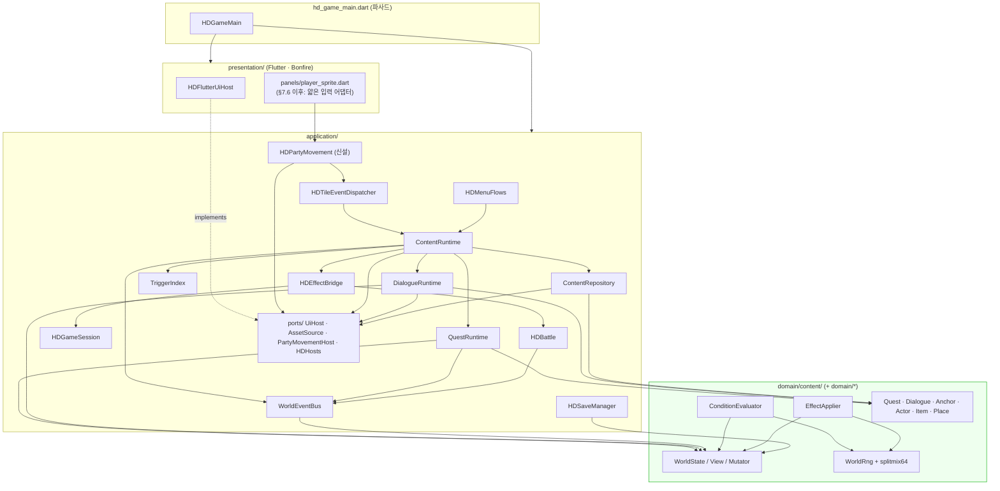
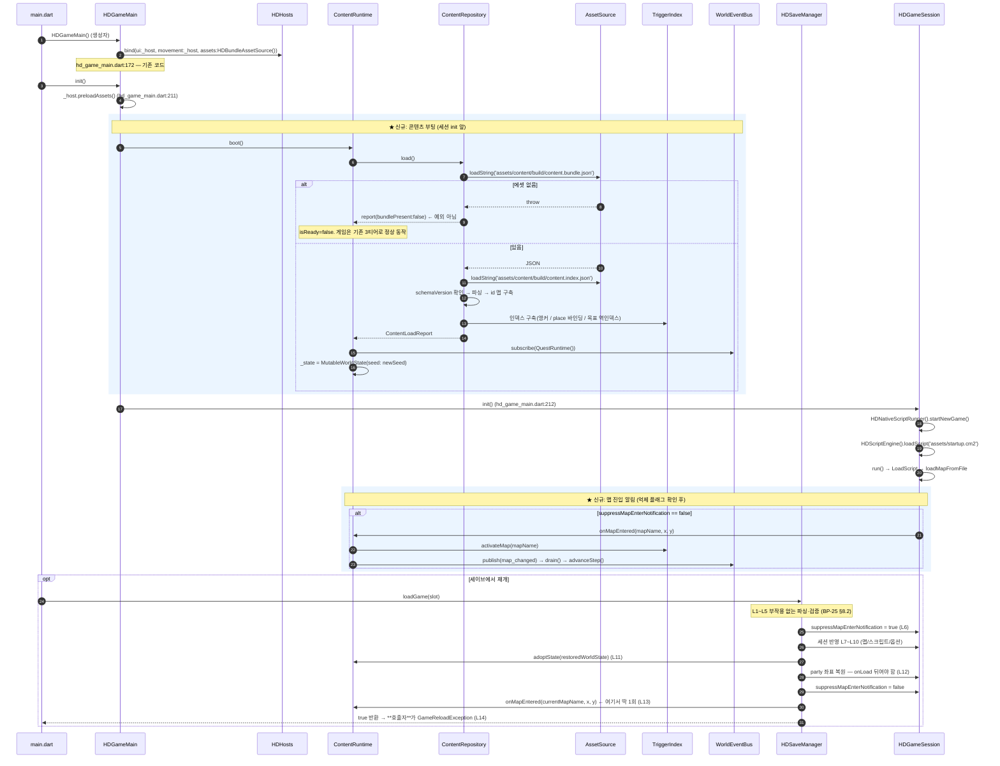
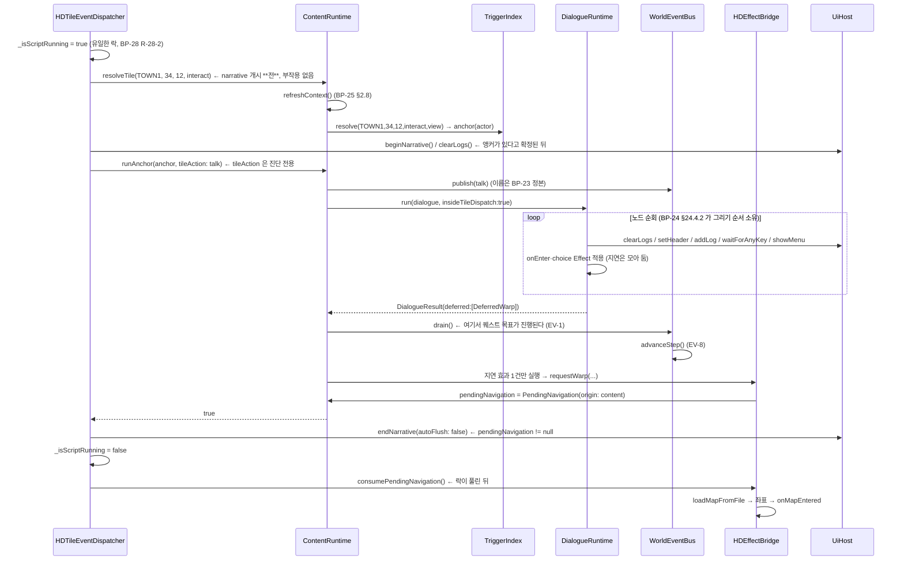
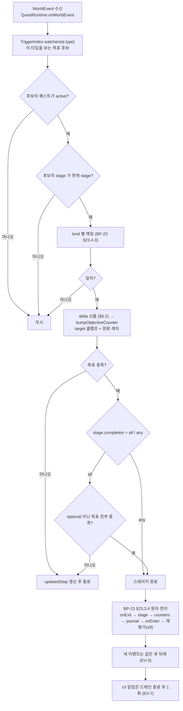

# 런타임 실행 엔진 설계

> `상태: 보류` — **설계는 유효하나 현재 노선에서는 구현하지 않는다.**
> 지금 노선은 원작 방식(플래그 + cm2)의 **sample-first** 다 → [`issues/MILESTONES.md`](../issues/MILESTONES.md).
> 이 장이 필요해지는 신호는 [`issues/MILESTONES.md` §5](../issues/MILESTONES.md) 에 있다. **읽고 바로 구현하지 말 것.**

> **문서 ID**: BP-27 · **상태**: 개정 3판(D-26·D-27 반영) · **선행 문서**: [BP-20](20_target_architecture.md), [BP-25](25_world_state_and_save.md), [BP-26](26_entity_registry_and_anchors.md)
> **독자**: 런타임 구현자 · **한 줄 요약**: D-11 의 클래스 배치를 착수 가능한 설계로 확정한다 —
> 공개 API 와 계약, 부팅 시퀀스, **타일 액션 게이트 앞에 놓이는** 디스패치 티어 0, 대화·퀘스트 실행 루프,
> 기존 시스템 훅 6곳 + **월드 이벤트 발행 지점 정본**, 결정론 요구사항.

**개정 이력**

| 판 | 변경 |
|---|---|
| 초판 | D-11 배치를 API 계약으로 확정 |
| 개정 2판 | 검수 반영 — 값 타입 8종 정의, 예외 계약, `HDEffectBridge` 신설, 전투 결과 정본(R-27-B2/B3) |
| **개정 3판** | **D-27 반영** — 티어 0 이 `_dispatchScripted` 안이 아니라 **`check()` 의 타일 액션 게이트 앞**으로 올라간다(§4). GROUND_TRUTH 부록 J 가 "region 레이어는 타일 액션을 만들 수 없다" 를 비트 연산으로 확정했으므로, 앵커는 **맵 데이터에 아무 표시도 남기지 않고** step-on 으로 발화해야 한다. 조회 키는 `HDTileAction` 이 아니라 [BP-26 §2.2](26_entity_registry_and_anchors.md) 의 `activation` 이다. 정합 위반 시의 런타임 동작을 §4.6 이 확정한다. **D-26 반영** — §7.7 이 월드 이벤트 12종의 **발행 지점 정본 표**를 기계 수확 가능한 형태로 확정하고, 미발행 3종을 명시한다. Q-27-1 은 D-27 로 종결 |

**파이프라인 구획(D-01)**: 이 장은 **전부 Runtime** 이다. LLM 호출·네트워크·비시드 난수는 이 장의 어떤 코드에도 없다.
`content.bundle.json` / `content.index.json` 은 Build 산출물이며 런타임은 **해석만** 한다.

## 0. 이 장의 소유 범위 (D-18)

| 주제 | 소유 | 이 장의 태도 |
|---|---|---|
| **런타임 실행 경로** — 디스패처 티어 0 삽입 코드, `pendingNavigation` 처리(D-19), `WorldRng`·`rngCursor` 소유자, 대화/퀘스트 **루프**, `splitmix64`·`chanceSeedId` 규칙(D-21·D-29a) | **BP-27 (이 장)** | §2·§4·§5·§6·§9 가 정본 |
| **기존 시스템 훅의 코드 변경 스케치** | **BP-27 (이 장)** | §7 |
| **월드 이벤트 발행 지점(publish site) 정본** — 어느 이벤트가 코드의 어디에서 발행되는가, 무엇이 아직 미발행인가 (D-26 이 요구하는 레지스트리의 **원천 데이터**) | **BP-27 (이 장)** | §7.7 이 정본. 이름·payload 는 BP-23, 레지스트리 **생성·산출물 스키마**는 BP-35 |
| 발행 지점 **레지스트리 생성**(`content.lock.json` 에 굽는 절차·스키마) | **BP-35** (D-26) | §7.7 은 표만 제공하고 링크 |
| 솔버 2축 판정(`PROVEN`/`REFUTED`/`UNKNOWN` × `SUPPORTED`/`UNSUPPORTED`) | **BP-34** (D-26) | 링크. 이 장은 `UNSUPPORTED` 의 **입력**을 만든다 |
| 정합 위반의 **린트 심각도** | **BP-33** (D-27) | 이 장은 **런타임이 어떻게 동작하는가**(§4.6)만 확정. WARN/ERROR 배정은 BP-33 |
| 월드 이벤트 **이름 12종·payload**, objective 매핑, 배치 판정, 스테이지 원자 전이 | **BP-23** (D-20) | 링크만. 재서술 금지 |
| Dialogue/Node/Choice **스키마**, **노드 1개를 그리는 호출 순서**, 텍스트 길이·페이지 예산, `showMenu` 채택 | **BP-24** | 링크만. §5 는 **바깥 루프**만 다룬다 |
| 앵커 스키마, 트리거 인덱스 구조, 다중 앵커 충돌 규칙 | **BP-26** | 링크. §2.2 는 런타임 조회 API 만 |
| Condition/Effect **op·do 전량**, ID 문법, 팩 매니페스트 | **BP-21** | 이름만 인용 |
| `WorldState` 필드, 세이브 v2 봉투, 마이그레이션, **로드 절차 L1~L14** | **BP-25** | 링크. §7.3 은 스케치만 |
| 디스패처 **JSON 1회 방출 보장**, 이관 상태 기계, 레거시 플래그 다리 | **BP-28** | 링크 |
| 시뮬레이터·솔버·**선결 리팩터링 범위** | **BP-34** | 링크 |
| CI·빌드 산출물 스키마 | **BP-35** | 링크 |

> **식별자 표기**: `R-27-n`(요구사항), `V-n`(결정론 위반 실측), `DT-n`(결정론 조치), `T-27-nn`(**테스트 케이스** ID).
> `T-27-nn` 은 실행 태스크가 아니다 — [BP-51 §1](51_task_breakdown.md) 이 이를 `T-070` 하나로 묶는다.
> **D-05 의 op/do 를 개수로 부르지 않는다.** "D-05 가 확정한 op 전량 / do 전량" 으로만 표현한다(§10 의 `dsl_coverage_test` 가 1:1 을 고정).

---

## 1. 컴포넌트 지도

### 1.1 `domain/content/` — 순수 데이터 + 평가기

`package:flutter/foundation.dart` 외의 Flutter import 금지. 파일 I/O 금지. `UiHost` 를 모른다.
D-12 대로 이 디렉토리는 `hadar_content` CLI(순수 Dart)가 **그대로 import** 한다.

| 파일 | 공개 타입 | 책임 | 소유 장 |
|---|---|---|---|
| `content_ids.dart` | `ContentId`, `IdKind`, `IdError` | `<type>.<pack>.<slug>` 파싱/검증(D-04) | 문법은 BP-21 |
| `condition.dart` | `Condition`, `ConditionOp`, `ConditionEvaluator` | D-05 op 전량 파싱 + `evaluate(WorldStateView)` | op 집합은 BP-21 |
| `effect.dart` | `Effect`, `EffectDo`, `EffectApplier`, `DeferredEffect` | D-05 do 전량 파싱 + `apply(WorldStateMutator)` | do 집합은 BP-21 |
| `quest.dart` / `stage.dart` / `objective.dart` | `Quest`, `Stage`, `Objective`, `QuestState`, `ObjectiveKind` | 역직렬화 + 구조 질의 | 스키마는 BP-23 |
| `dialogue.dart` / `node.dart` / `choice.dart` | `Dialogue`, `DialogueNode`, `Choice` | 역직렬화 + `entry` 해석 | 스키마는 BP-24 |
| `actor.dart` / `item.dart` / `place.dart` | `Actor`, `Item`, `Place` | 카탈로그 엔티티 | BP-22 / BP-42 |
| `anchor.dart` | `Anchor`, `AnchorKind` | 앵커 모델 | BP-26 |
| `world_state.dart` | `MutableWorldState`, `WorldStateView`, `WorldStateMutator`, `WorldContext`, `QuestProgress`, `JournalEntry` | 상태 | **BP-25** |
| `world_event.dart` | `WorldEvent`, `WorldEventType` | **이름 12종은 [BP-23 §23.11.1](23_quest_model.md) 이 정본** | BP-23 |
| `world_rng.dart` | `WorldRng`, `splitmix64` | 시드 난수 + 무커서 해시(D-21) | **BP-27 (이 장 §9.2)** |
| `strings.dart` | `StringTable` | `stringKey → 텍스트` | 키 체계는 BP-21 |

### 1.2 `application/content/` — 유스케이스

| 파일 | 공개 타입 | 책임 |
|---|---|---|
| `content_repository.dart` | `ContentRepository`, `ContentLoadReport`, `ContentLoadException` | 번들/인덱스 로드(`AssetSource` 경유), 파싱, id 조회. **읽기 전용** |
| `trigger_index.dart` | `TriggerIndex`, `PlaceBinding`, `ObjectiveRef` | `(map,x,y,action)` → 앵커 id 목록, place 바인딩, 이벤트별 목표 역인덱스 |
| `world_event_bus.dart` | `WorldEventBus`, `WorldEventSubscriber` | 배치 큐·드레인([BP-25 §4.3](25_world_state_and_save.md) EV-1~8 의 구현체) |
| `quest_runtime.dart` | `QuestRuntime`, `QuestJournalView` | 이벤트 → 목표 매칭 → 전이 → 효과 → 저널 |
| `dialogue_runtime.dart` | `DialogueRuntime`, `DialogueResult`, `DialogueTrace` | 대화 그래프 바깥 루프 + `UiHost` 출력 |
| `content_runtime.dart` | `ContentRuntime`, `PendingNavigation` | 진입점. 앵커 해석, 지연 효과 실행, 세 런타임 조립 |
| `content_effect_bridge.dart` | `HDEffectBridge` | 도메인 `EffectApplier` 가 표현만 하고 실행 못 하는 do 5종을 세션·전투·맵에 연결 |
| `party_movement.dart` | `HDPartyMovement` | **신설** — 이동·타일 상호작용 루프의 application 측 소유자(부록 B-3, §7.6) |
| `debug_commands.dart` | `HDDebugCommands` | [BP-25 §9](25_world_state_and_save.md) 의 20종. `--dart-define` 가드 뒤에서만 등록 |

### 1.3 의존 방향



**화살표가 한 방향뿐인 것이 요점**: `presentation → application → domain`. 반대 화살표가 없다.
`HDEffectBridge` 와 `HDPartyMovement` 가 application 안쪽에서 `HDGameSession`/`HDBattle`/`HDTileEventDispatcher` 로 내려가는데,
이는 **같은 계층 내부 참조**라 규칙 위반이 아니다.

### 1.4 계층 규칙(CI grep) 통과 논증 — D-23 형식

`.github/workflows/ci.yml:50-75` 의 `check()` 헬퍼는 **검색 경로가 하드코딩**되어 있다:

```bash
check() {
  local label="$1"; shift
  local hits
  hits="$(grep -rn "$@" lib/application/ lib/domain/ || true)"   # ← ci.yml:57
  ...
}
```

즉 **인자로 경로를 넘겨도 범위가 좁혀지지 않고 추가만 된다.**
또 `-E`(ERE)는 negative lookahead `(?!…)` 를 **지원하지 않는다** — 초판이 제안한
`package:flutter/(?!foundation)` 는 실행하면 문법 에러로 죽는다. **lookahead 를 쓰지 않는다**(D-23).

**현행 2개 검사 통과 논증**:

| grep | 신규 파일이 통과하는 이유 |
|---|---|
| `^import .*(presentation/\|hd_game_main\.dart)` | 이 엔진이 UI 에 하는 모든 일은 `UiHost` 의 11개 메서드(GROUND_TRUTH §3)뿐, 파일에 하는 모든 일은 `AssetSource.loadString(path)` 뿐이다. 둘 다 `application/ports/` 안에 있다 |
| `package:flutter/material\|package:bonfire\|package:flame` | 아래 대체표대로 |

| 하고 싶은 일 | 쓰면 안 되는 것 | 대신 쓰는 것 |
|---|---|---|
| 대사 출력 | `Text` 위젯 | `HDHosts().ui.addLog(line, isDialogue: true)` |
| 선택지 | `showDialog` | `HDHosts().ui.showMenu(items, clearLogs: false)` ([BP-24 §24.4.3](24_dialogue_model.md)) |
| 저널 화면 | `Navigator.push` | `HDHosts().ui.showWindowMenu(...)` + `presentation/panels/` 가 그림([BP-41](41_journal_ui_spec.md)) |
| 맵 이동 | Bonfire 카메라 | `HDGameSession.loadMapFromFile` + `HDHosts().movement.animatePartyMove` |
| 색상 | `Color` | 기존 `@B..@@` 색 태그 문자열(`ui_host.dart:58` 주석) |
| 번들 읽기 | `rootBundle` | `HDHosts().assets.loadString` |
| 시각 | `DateTime.now()` | `WorldState.step` ([BP-25 §2.4](25_world_state_and_save.md)) |

**추가 게이트 요청** (실제 `ci.yml` 변경은 [BP-35](35_ci_and_build.md) 소유):

```bash
# D-23: application/ 과 domain/ 은 dart:io / dart:html 을 import 하면 안 된다
check "application/domain must not import dart:io or dart:html" \
  -E "^import 'dart:(io|html)'"

# domain/ 은 flutter/foundation 외의 flutter 패키지를 import 하면 안 된다
# (lookahead 대신 금지 목록을 나열한다 — D-23)
check "domain/application must not import non-foundation flutter libs" \
  -E "^import 'package:flutter/(services|widgets|cupertino|rendering|gestures|painting|animation|scheduler)\.dart'"
```

- 첫 번째는 **지금 넣으면 CI 가 즉시 빨개진다** — `menu_flows.dart:2` 가 걸린다(부록 B-4).
  D-23 이 못 박은 대로 `exit(0)` 3곳 제거와 **같은 변경으로 함께** 가야 한다([BP-51 T-022·T-023](51_task_breakdown.md)).
- `check()` 가 `lib/application/`·`lib/domain/` 을 **둘 다** 보므로, 범위를 좁힌 검사는
  `check()` 헬퍼를 경로 인자를 받도록 고친 **뒤에만** 가능하다. 그 변경도 [BP-35](35_ci_and_build.md) 소관이다.
- **`DateTime.now()` 금지 grep 은 넣지 않는다**. 이유 둘: (1) `HDSaveManager` 의 `envelope.savedAtWallClock`
  ([BP-25 §5.1](25_world_state_and_save.md))이 정당한 사용인데 `check()` 의 하드코딩 경로 때문에 반드시 걸린다.
  (2) `player.dart:71`(V-1)이 남아 있는 동안 CI 가 계속 빨갛다.
  대신 **DT-1 완료 후** `--exclude=save_manager.dart` 를 붙여 넣는다(§9.3 DT-7).

---

## 2. 각 클래스의 공개 API

싱글턴 관례(`Foo()`)를 따르고 전부 `reset()` 을 갖는다(D-11).
**계약 표기**: 사전조건(P) / 사후조건(Q) / 예외(E).

### 2.0 먼저 — 이 장이 정의하는 값 타입 8종 (+ D-27 이 요구한 1종)

초판이 이름만 쓰고 정의하지 않았던 타입을 전부 확정한다.

```dart
// ── 1. ContentLoadException ─────────────────────────────────────────
/// 콘텐츠 번들을 **해석할 수 없을 때만** 던진다. "파일이 없다" 는 여기 포함되지 않는다(§3.4).
class ContentLoadException implements Exception {
  final ContentLoadFailure kind;
  final String path;         // 문제가 난 에셋 경로
  final String detail;
  const ContentLoadException(this.kind, this.path, this.detail);
  @override String toString() => '[content] ${kind.name} @$path: $detail';
}

enum ContentLoadFailure { parse, schemaTooNew, schemaMigrationMissing, indexCorrupt }

// ── 2. ContentLoadReport ────────────────────────────────────────────
/// load() 가 항상 채워 반환하는 진단 결과. 예외가 아닌 실패는 전부 여기 담긴다.
class ContentLoadReport {
  final bool bundlePresent;          // 번들 에셋을 읽었는가
  final bool indexPresent;           // 인덱스 에셋을 읽었는가 (없으면 런타임 재구축)
  final bool indexRebuilt;
  final int  schemaVersion;
  final Map<String, String> packVersions;      // packId → semver
  final int  questCount, dialogueCount, actorCount, itemCount, placeCount, anchorCount;
  final int  stringCount;
  final List<ContentWarning> warnings;         // 참조 깨짐, 도달 불가 등록, 좌표 충돌 …
  bool get usable => bundlePresent && warnings.every((w) => !w.fatal);
}

class ContentWarning {
  final String code;      // 'dangling_ref' | 'anchor_conflict' | 'missing_string' | 'unreachable_map_script' …
  final String subject;   // 문제의 id 또는 경로
  final String detail;
  final bool fatal;       // true 면 해당 요소만 비활성 (전체 로드는 계속)
}

// ── 3. PlaceBinding ─────────────────────────────────────────────────
/// placeId 가 어느 맵의 어느 영역을 덮는가. 빌드가 굽고 런타임은 읽기만 한다.
class PlaceBinding {
  final String placeId;
  final String map;
  final int x, y, radius;      // radius == 0 이면 맵 전체를 뜻한다
  const PlaceBinding(...);
  bool contains(int px, int py) =>
      radius == 0 || ((px - x).abs() + (py - y).abs()) <= radius;   // 맨해튼 거리
}

// ── 4. ObjectiveRef ─────────────────────────────────────────────────
/// 이벤트 역인덱스의 원소. "이 이벤트를 이 목표가 보고 있다".
class ObjectiveRef {
  final String questId;
  final String stageId;
  final String objectiveId;
  final ObjectiveKind kind;
  const ObjectiveRef(...);
}

// ── 5. QuestJournalView ─────────────────────────────────────────────
/// 저널 UI 가 받는 읽기 전용 뷰. WorldState 를 노출하지 않는다.
class QuestJournalView {
  final String questId;
  final String titleKey, summaryKey;
  final QuestState state;
  final String? stageId;
  final String? stageJournalKey;
  final int startedStep, updatedStep;          // D-08a
  final List<ObjectiveProgressView> objectives;
  final bool tracked;
}

class ObjectiveProgressView {
  final String objectiveId;
  final String? labelKey;      // hidden 이면 null
  final int current, target;
  final bool optional, hidden, done;
}

// ── 6. PendingNavigation (D-19 승격) ────────────────────────────────
/// 지연 맵 이동. cm2 의 `HDScriptEngine.pendingNavigation`(script_engine_adapter.dart:34)과
/// **같은 개념**이며, D-19 에 따라 세션/런타임 공용으로 승격된다.
class PendingNavigation {
  final String map;            // 논리 맵 이름 (MapInfos.json#name) 또는 cm2 경로
  final bool hasExplicitPos;
  final int x, y;
  final PendingNavigationOrigin origin;   // cm2 | content
  const PendingNavigation(...);
}

enum PendingNavigationOrigin { cm2, content }

// ── 7. DeferredEffect ───────────────────────────────────────────────
/// EffectApplier 가 즉시 실행하지 않고 모아 두는 파괴적 효과
/// ([BP-25 §4.4](25_world_state_and_save.md) 의 지연 효과 3종).
sealed class DeferredEffect {
  const DeferredEffect();
}
class DeferredWarp        extends DeferredEffect { final String map; final int x, y; }
class DeferredStartBattle extends DeferredEffect { final String encounterId; }
class DeferredPlayDialogue extends DeferredEffect { final String dialogueId; }

// ── 8. DialogueTrace ────────────────────────────────────────────────
/// 헤드리스 하네스(D-13)가 넘기는 기록용 후크. null 이면 아무 비용도 들지 않는다.
abstract class DialogueTrace {
  void onEnterNode(String dialogueId, String nodeId, int step);
  void onLine(String stringKey, String rendered);
  void onChoiceShown(String nodeId, List<String> choiceIds);
  void onChoicePicked(String nodeId, String choiceId);
  void onExit(String dialogueId, String? lastNodeId, bool reachedEnd);
}
```

부수적으로 이름만 있던 두 타입도 확정한다.

```dart
// lib/domain/content/strings.dart
abstract class StringTable {
  /// P: 없음. Q: 키가 없으면 **키 자체를 반환**(§8.1). E: 던지지 않는다.
  String resolve(String key, {Map<String, String>? tokens});
  bool has(String key);
  int get count;
}

// lib/domain/content/content_ids.dart
class ContentId {
  final IdKind kind;      // quest | dlg | npc | item | place | anchor | flag | var | encounter
  final String pack;
  final String slug;
  /// P: 없음. Q: 형식 위반이면 null. E: 던지지 않는다. 문법은 BP-21 소유.
  static ContentId? tryParse(String raw);
  /// Q: 형식 위반 사유를 담은 IdError. 빌드/CLI 전용(런타임은 tryParse 만 쓴다).
  static IdError? validate(String raw);
  @override String toString() => '${kind.name}.$pack.$slug';
}
```

**그리고 9번째 — `HDAnchorActivation` (D-27 이 요구한 신규 값 타입)**

D-27 이후 티어 0 의 조회 키는 `HDTileAction` 이 아니다. 앵커가 언제 발화하는지는
[BP-26 §2.2](26_entity_registry_and_anchors.md) 의 `activation` 필드가 **단독으로** 선언하며,
타일 액션은 그 판단에 들어가지 않는다. 그 필드의 **런타임 표현**만 이 장이 정의한다.

```dart
// lib/domain/content/anchor.dart
/// 앵커 발화 조건의 **질의 키**. BP-26 의 `activation` 선언값 3종
/// (`interact` / `step_on` / `both`)과 1:1 이 아니다 —
/// `both` 는 **선언**이지 질의가 아니므로 빌드가 두 키 모두에 색인한다(§2.2).
enum HDAnchorActivation {
  /// 마주보고 확인 키. 디스패처의 `isInteraction == true` 경로.
  interact,
  /// 그 칸에 올라섰다. 디스패처의 `isInteraction == false` 경로.
  stepOn;

  static HDAnchorActivation of({required bool isInteraction}) =>
      isInteraction ? interact : stepOn;
}
```

- **R-27-16** (D-27) 런타임은 `isInteraction` 하나만 보고 질의 키를 만든다.
  `HDAnchorActivation.of(isInteraction: …)` 이 그 **유일한 변환 지점**이며, 타일 액션은 인자로 받지 않는다.
  타일 액션이 인자에 들어가면 D-27 이 폐기한 "앵커가 타일 비트에 기생한다" 가 시그니처로 되살아난다.
- **R-27-17** `both` 를 두 키로 펼치는 것은 **빌드**의 일이다(BP-26 §4 소유). 런타임은 펼쳐진 인덱스를
  읽기만 하며, 조회 시점에 `both` 를 해석하지 않는다 — 해석이 두 곳에 있으면 갈라진다.
- **R-27-18** `HDTileAction` 은 티어 0 에서 **사라지지 않는다**. 다만 역할이 바뀐다:
  ① 레거시 3티어의 분기 키(그대로), ② 통행·이동 판정(그대로),
  ③ 티어 0 에서는 **진단용 부가 정보**로만 전달된다(§4.6 의 정합 위반 로그).

### 2.1 `ContentRepository`

```dart
// lib/application/content/content_repository.dart
class ContentRepository {
  factory ContentRepository() => _instance;

  /// 번들과 인덱스를 AssetSource 로 읽어 파싱한다.
  ///
  /// P: `HDHosts().bind()` 완료.
  /// Q: 항상 `ContentLoadReport` 를 반환한다. `report.bundlePresent == false` 여도
  ///    **정상 반환**이며 이때 `isLoaded == false` 다(§3.4 — 콘텐츠 티어만 비활성).
  /// E: - 에셋 **부재**는 예외가 아니다(report 에 기록).
  ///    - 파싱 실패 / `schemaVersion` 이 런타임보다 큼 / 인덱스 손상 → `ContentLoadException`.
  ///    - `StateError`(HDHosts 미바인드)는 **잡지 않고 전파**한다. 이것이 T-27-24 의 근거다.
  Future<ContentLoadReport> load({
    String bundlePath = 'assets/content/build/content.bundle.json',
    String indexPath  = 'assets/content/build/content.index.json',
  });

  bool get isLoaded;                       // load 성공 + bundlePresent
  ContentLoadReport get report;            // load 전 접근 시 빈 report
  int get schemaVersion;
  Map<String, String> get packVersions;    // packId → semver ([BP-25 §7](25_world_state_and_save.md) 판정용)

  // --- 조회: 전부 O(1). P: 없음(id 형식 검증하지 않는다). Q: 없으면 null. E: 던지지 않는다 ---
  Quest?    quest(String id);
  Dialogue? dialogue(String id);
  Actor?    actor(String id);
  Item?     item(String id);
  Place?    place(String id);
  Anchor?   anchor(String id);

  /// Q: **id 사전순** 고정 순서. 결정론(§9)을 위해 삽입 순서에 의존하지 않는다.
  Iterable<Quest> get allQuests;

  StringTable get strings;
  TriggerIndex get triggers;

  /// `content.lock.json` 의 레거시 다리. 방향은 **`flagId → intIndex`**(D-04).
  /// 역참조가 필요한 마이그레이션은 [BP-25 §6.2](25_world_state_and_save.md) 가 뒤집어 쓴다.
  Map<String, int> get legacyFlagMap;
  Map<String, int> get legacyVarMap;       // ⚠ BP-21 이 아직 정의하지 않음 (BP-25 §11.2)

  void reset();
}
```

### 2.2 `TriggerIndex` — BP-26 모델에 맞춘 조회 (D-27 로 키가 바뀐다)

> 인덱스의 **구조와 다중 앵커 규칙은 [BP-26 §4](26_entity_registry_and_anchors.md) 소유**다.
> 값은 **앵커 id 배열**이며 `priority` 내림차순으로 **빌드가 정렬해 굽는다**(R-26-14).
> 이 장은 그 구조를 읽는 **런타임 API** 만 정의한다.

**D-27 이 바꾼 것 — 3단 키**: 초판은 3단 키를 `HDTileAction` 으로 썼다. 그 전제는
"앵커는 자기 칸의 타일 액션과 일치한다" 였고, `trigger` 앵커의 경우 그 일치를 만들려고
region 레이어 예약(BP-26 초판 §3.5 T1)이 필요했다. **GROUND_TRUTH 부록 J-1 이 그 예약을 반증했다** —
`map_loader.dart:44` 가 region(0~255)을 `ixEvent` 하위 바이트에 넣는데
`tile_properties.dart:187` 은 `& 0x00FF0000`(비트 16~23)만 보므로 `255 & 0x00FF0000 == 0` 이다.
따라서 D-27 대로 **앵커는 맵 데이터에 아무 표시도 남기지 않으며**, 3단 키는
[BP-26 §2.2](26_entity_registry_and_anchors.md) 의 `activation` 을 런타임 표현한
`HDAnchorActivation`(§2.0)이 된다.

```dart
// lib/application/content/trigger_index.dart
class TriggerIndex {
  /// (map, x, y, activation) → 앵커 id. 없으면 const [].
  /// P: 없음. Q: 빌드가 정렬한 순서 그대로. 런타임은 **재정렬하지 않는다**(R-26-14). E: 없음.
  List<String> lookup(String mapName, int x, int y, HDAnchorActivation activation);

  /// **부작용 없는 존재 확인.** 조건 평가도 하지 않는다 — "이 칸에 이 발화 조건의 앵커가
  /// 하나라도 색인되어 있는가" 만 답한다. 디스패처가 narrative 를 열기 **전에** 쓴다(§4.2).
  /// P: 없음. Q: `lookup(...).isNotEmpty`. E: 없음.
  bool has(String mapName, int x, int y, HDAnchorActivation activation);

  /// 조건까지 평가해 **채택할 앵커 하나**를 고른다(R-26-15/16).
  /// P: `view` 는 현재 상태. Q: `when` 이 true 인 **첫** 앵커, 전부 false 면 null.
  /// **부작용 없음** — Condition 은 순수 함수이고 `chance` 는 무커서 해시다(D-21).
  ///   그래서 이 호출을 UI 를 열기 전에 안전하게 할 수 있다(§4.2 의 핵심 근거).
  /// E: 던지지 않는다.
  Anchor? resolve(String mapName, int x, int y, HDAnchorActivation activation, WorldStateView view);

  /// 맵 전환 시 교체할 서브맵(R-26-13).
  void activateMap(String mapName);
  String? get activeMap;

  /// placeId → 그 place 가 덮는 (map, 영역) 목록.
  List<PlaceBinding> bindingsOf(String placeId);
  /// (map, x, y) 를 덮는 place 들. `enter_place` 판정용.
  List<PlaceBinding> placesAt(String mapName, int x, int y);

  /// 이벤트 이름 → 그 이벤트를 감시하는 목표 목록. 빌드가 굽는다(§6.3).
  /// 이벤트 이름 집합은 [BP-23 §23.11.1](23_quest_model.md) 정본.
  List<ObjectiveRef> watchers(WorldEventType type);

  int get anchorCount;
  int get objectiveWatcherCount;
}
```

**`resolve` 의 알고리즘** (R-26-14~16 을 그대로 구현):

```
resolve(map, x, y, activation, view):
    ids = lookup(map, x, y, activation)      # 이미 priority desc 정렬
    for id in ids:                           # 순서 보존 = 결정론
        a = repo.anchor(id)
        if a == null: warn('dangling_ref'); continue
        if a.once and view.hasFlag(a.onceFlagId): continue      # BP-26 `once`
        if evaluate(a.when, view): return a                     # 첫 true 채택
    return null                              # 전부 false → 앵커 없음 (아래 티어로 폴백)
```

**"id 정렬 첫 번째만 채택 + 경고"(초판)는 폐기**한다 — BP-26 이 다중 앵커를 **기능**으로 정의했으므로
조용히 버리면 팩 합성(D-03)으로 얹은 콘텐츠가 죽는다. 하드 실패 조건은 R-26-17(모두 `when` 생략 + 2개 이상)뿐이고
그것은 **빌드**가 잡는다.

- **R-27-19** `resolve` 는 **UI 를 건드리기 전에 호출해도 안전하다**. 근거는 D-21 이다 —
  Condition 은 부작용이 없고 `chance` 는 `(seed, step, contextId#evalPath)` 무커서 해시이므로
  같은 스텝 안에서 몇 번 평가해도 값이 흔들리지 않는다. 이 성질이 없으면 §4.2 의
  "선조회 후 narrative 를 연다" 가 성립하지 않고, 앵커가 없는 칸에서 빈 대화창이 번쩍인다.
- **R-27-20** `has` 는 `resolve` 의 축약이 아니다. `has == true` 인데 `resolve == null` 인 경우
  (앵커는 색인되어 있으나 `when` 이 전부 거짓)가 정상 상태이며(R-26-34), 그때는 **아래 티어로 폴백**한다.
  디스패처는 `resolve` 의 결과만 보고 분기한다 — `has` 는 진단·에디터 오버레이용이다.

### 2.3 `WorldEventBus`

```dart
// lib/application/content/world_event_bus.dart
class WorldEventBus {
  factory WorldEventBus() => _instance;

  /// P: 없음. Q: 큐 길이 +1 (EV-6 중복 병합에 걸리면 +0). 드레인 중이면 큐에만 넣고 즉시 반환(EV-5).
  /// E: 던지지 않는다.
  void publish(WorldEvent event);

  /// 배치를 FIFO 로 비운다.
  /// P: 호출자가 `setContext` 로 문맥을 갱신했다([BP-25 §2.8](25_world_state_and_save.md)).
  /// Q: 큐가 비었거나 cascade 8 초과로 폐기됨. 종료 후 `advanceStep()` 1회(EV-8).
  ///    **구독자는 UiHost 를 건드리지 않는다** — UI 알림은 드레인 후 ContentRuntime 이 1회(EV-7).
  /// E: `GameReloadException` **만** 전파. 그 외 구독자 예외는 잡아서 로그하고 드레인을 계속한다(§8.1).
  Future<void> drain();

  bool get isDraining;
  int get pendingCount;

  /// P: 같은 구독자를 두 번 등록하지 않는다(중복이면 무시 + assert).
  /// Q: **등록 순서가 곧 통지 순서**다. 결정론을 위해 우선순위 인자를 두지 않는다.
  void subscribe(WorldEventSubscriber sub);
  void unsubscribe(WorldEventSubscriber sub);

  static const int maxCascadeDepth = 8;    // BP-25 EV-4 = BP-23 §23.3.4 와 같은 수치
  void reset();
}

abstract class WorldEventSubscriber {
  /// P: 드레인 루프 안에서만 호출됨.
  /// Q: 새 이벤트는 `publish()` 로만 발행(직접 `drain` 금지). **UiHost 호출 금지**.
  /// E: 던지면 버스가 잡아 로그한다. 단 `GameReloadException` 은 전파된다.
  Future<void> onWorldEvent(WorldEvent event, WorldStateMutator state);
}
```

기본 구독자는 `QuestRuntime` 하나다. 등록 순서가 통지 순서이므로 구독자가 늘어나도 결정론이 유지된다.

### 2.4 `ConditionEvaluator` / `EffectApplier` (domain)

```dart
// lib/domain/content/condition.dart
abstract final class ConditionEvaluator {
  /// D-05 가 확정한 op 전량을 평가한다. **순수 함수** — 어떤 상태도 바꾸지 않는다.
  ///
  /// P: [c] 는 빌드 검증을 통과한 Condition.
  /// Q: 같은 `(c, view)` 에 대해 항상 같은 결과. **`view` 는 변하지 않는다.**
  ///    `chance` 는 D-21 의 무커서 해시로 평가되므로 `rngCursor` 를 소비하지 않는다(§9.2).
  /// E: 던지지 않는다. 미지 op 는 `false` + `assert`(디버그).
  ///
  /// 난수 인자가 **없다**는 것이 R-25-5 의 타입 수준 강제다.
  static bool evaluate(Condition c, WorldStateView view);

  /// 이 조건이 참조하는 모든 id. 빌드 참조무결성 검사·솔버·실패조건 인덱싱(§6.2)이 쓴다.
  static Set<String> referencedIds(Condition c);
}

// lib/domain/content/effect.dart
abstract final class EffectApplier {
  /// D-05 가 확정한 do 전량 중 **즉시 효과**를 순서대로 적용한다.
  ///
  /// P: [effects] 는 빌드 검증을 통과한 배열.
  /// Q: 즉시 효과 전부 적용. **지연 효과는 적용하지 않고 반환값에 모은다.**
  ///    이벤트는 mutator 가 큐에 넣기만 한다(EV-1: 여기서 drain 하지 않는다).
  /// E: 던지지 않는다. 미지 do 는 무시 + `assert`(디버그).
  ///
  /// [rng] 는 쓰기 경로 전용 커서 난수(D-21). 지금은 `heal_party`/`grant_exp` 의
  /// 변동폭이 없어 미사용이지만, 시그니처를 열어 둔다.
  static List<DeferredEffect> apply(List<Effect> effects, WorldStateMutator state, {WorldRng? rng});

  static Set<String> referencedIds(List<Effect> effects);
}
```

### 2.5 `DialogueRuntime`

```dart
// lib/application/content/dialogue_runtime.dart
class DialogueRuntime {
  factory DialogueRuntime() => _instance;

  /// 대화 그래프 하나를 끝까지 실행한다. **노드 1개를 그리는 순서는
  /// [BP-24 §24.4.2](24_dialogue_model.md) 가 정본**이고, 이 메서드는 그 바깥 루프다.
  ///
  /// P: `ContentRuntime` 이 진입을 확정했고, 타일 경로면 `HDTileEventDispatcher` 가
  ///    `beginNarrative()`/`clearLogs()` 를 이미 호출했다(§5.2).
  /// Q: 종료 노드 도달 또는 중단. 상태 변경은 전부 `state` 를 통했다.
  ///    지연 효과는 실행하지 않고 `DialogueResult.deferred` 에 담아 돌려준다.
  /// E: `GameReloadException` 만 전파(로그하지 않음). 그 외는 잡아서 로그 + 종료 처리.
  Future<DialogueResult> run(Dialogue d, {
    required WorldStateMutator state,
    required UiHost host,
    required bool insideTileDispatch,   // BP-24 §24.4.3 의 메뉴 경로 분기
    DialogueTrace? trace,
  });

  bool get isRunning;
  void reset();
}

class DialogueResult {
  final bool reachedEnd;
  final String? lastNodeId;
  final List<DeferredEffect> deferred;
  final int nodesVisited;
  final DialogueStop stop;      // end | deferredBlocking | depthLimit | danglingNode | allEntryFalse
}

enum DialogueStop { end, deferredBlocking, depthLimit, danglingNode, allEntryFalse }
```

### 2.6 `QuestRuntime`

```dart
// lib/application/content/quest_runtime.dart
class QuestRuntime implements WorldEventSubscriber {
  factory QuestRuntime() => _instance;

  /// P: 없음.
  /// Q: `prerequisites` 가 참이면 `state=active`, `stage=stages[0].id`,
  ///    `startedStep = updatedStep = view.step`(D-08a), `counters` 초기화, 저널 append.
  ///    거짓이면 **아무것도 하지 않고** false.
  /// E: 던지지 않는다. 미등록 questId → false + `assert`.
  bool start(String questId, WorldStateMutator state, {bool ignorePrerequisites = false});

  /// 지정 스테이지로 원자 전이. 순서는 [BP-23 §23.3.4](23_quest_model.md) 가 정본.
  /// P: 해당 퀘스트가 `active`.
  /// Q: `onExit` → stage 교체 → counters 초기화 → 저널 append → `onEnter` 순.
  ///    `updatedStep = view.step`. 재평가 루프 최대 8회.
  /// E: 던지지 않는다. 사전조건 위반 시 — 디버그 `assert`, 릴리스는 `active` 로 승격 후 진행.
  List<DeferredEffect> advance(String questId, String stageId, WorldStateMutator state);

  /// P: 해당 퀘스트가 `active`.
  /// Q: `state=completed`, `stage=null`, `onComplete` → `rewards` 순 적용, 저널 append.
  ///    **`onExit` 는 실행하지 않는다**([BP-23 §23.3.4](23_quest_model.md) 주의).
  /// E: 던지지 않는다.
  List<DeferredEffect> complete(String questId, WorldStateMutator state);

  /// P: 해당 퀘스트가 `active`.
  /// Q: `state=failed`, `stage=null`, `onFail` 적용, 저널 append. `onExit` 미실행.
  /// E: 던지지 않는다.
  List<DeferredEffect> fail(String questId, WorldStateMutator state);

  /// 월드 이벤트 수신. 활성 퀘스트의 현재 스테이지 목표만 검사한다(§6.3).
  /// P: 드레인 루프 안. Q: 카운터/전이. 새 이벤트는 `publish` 로만.
  /// E: `GameReloadException` 외에는 던지지 않는다.
  @override
  Future<void> onWorldEvent(WorldEvent e, WorldStateMutator state);

  /// 저널 UI 용. P: 없음. Q: questId 사전순. **읽기 전용 뷰만 반환**(WorldState 미노출).
  /// E: 던지지 않는다.
  List<QuestJournalView> activeJournal(WorldStateView view, {bool includeFinished = false});

  void reset();
}
```

### 2.7 `ContentRuntime` — 진입점

```dart
// lib/application/content/content_runtime.dart
class ContentRuntime {
  factory ContentRuntime() => _instance;

  /// P: `HDHosts().bind()` 완료.
  /// Q: `ContentRepository.load` 결과에 따라 `isReady` 확정. 실패해도 **게임은 켜진다**(§3.4).
  ///    `WorldEventBus().subscribe(QuestRuntime())` 1회.
  /// E: `ContentLoadException` 은 **잡아서 로그하고 isReady=false 로 끝낸다**.
  ///    `StateError`(미바인드)는 전파한다.
  Future<ContentLoadReport> boot();

  bool get isReady;

  // --- 상태 노출: BP-25 §3.4 의 "두 얼굴 중 하나만" 규칙 준수 ---
  WorldStateView get view;                       // 조건 평가·UI 용
  MutableWorldState get stateForPersistence;     // HDSaveManager 전용. 이름으로 의도를 드러낸다
  /// P: 드레인 중이 아니고 상호작용 중이 아니다.
  /// Q: 기존 상태 폐기 + **이벤트 큐 폐기** + `TriggerIndex.activateMap` 재적용.
  void adoptState(MutableWorldState s);

  /// 티어 0 **1단계 — 선조회**. 부작용 없음. UI 를 건드리지 않는다.
  ///
  /// P: 없음(`isReady == false` 면 항상 null). Q: 채택된 앵커 또는 null.
  ///    `TriggerIndex.resolve` 를 그대로 위임한다(R-27-19).
  /// E: 던지지 않는다.
  ///
  /// **D-27**: 인자에 `HDTileAction` 이 없다. 타일 액션은 앵커 발화에 관여하지 않는다.
  Anchor? resolveTile({
    required String mapName,
    required int x,
    required int y,
    required HDAnchorActivation activation,
  });

  /// 티어 0 **2단계 — 실행**. `resolveTile` 이 돌려준 앵커를 실제로 발화시킨다.
  ///
  /// P: 호출자가 `beginNarrative()` 를 이미 했고 `_isScriptRunning` 가드 안이다(§4.2).
  ///    `anchor` 는 같은 배치 안에서 `resolveTile` 이 돌려준 것이다.
  /// Q: true 를 반환했다면 아래 티어로 내려가지 않는다(D-10).
  ///    배치 드레인 완료 + 지연 효과 최대 1건 실행. `pendingNavigation` 이 세워졌을 수 있다.
  /// E: `GameReloadException` 만 전파. 그 외는 잡아서 로그 후 true 반환(앵커 소유 좌표이므로).
  ///
  /// `tileAction` 은 **진단 전용**이다(R-27-18) — 정합 위반 로그(§4.6)에만 쓰이고
  /// 발화 여부·분기에는 절대 들어가지 않는다.
  Future<bool> runAnchor(
    Anchor anchor, {
    required int x,
    required int y,
    required HDAnchorActivation activation,
    required HDTileAction tileAction,
    required UiHost host,
  });

  /// 초판의 `handleTile(...)` 은 **폐기**한다. 한 호출 안에서 "조회 + narrative 전제 + 실행" 을
  /// 묶고 있었기 때문에, D-27 이 요구하는 "타일 액션 게이트보다 **앞에서** 조회" 를 표현할 수 없다 —
  /// 조회 결과를 알기 전에 이미 narrative 가 열려 있어야 했다(§4.2 의 before/after 비교).

  /// 맵 진입 알림. `map_changed` 발행 + `TriggerIndex.activateMap` + place 판정.
  /// P: `HDGameSession.suppressMapEnterNotification == false`(§3.2).
  /// Q: 배치 1회(발행 → 드레인 → advanceStep). 중복 호출은 같은 맵이면 무시(멱등).
  /// E: `GameReloadException` 만 전파.
  Future<void> onMapEntered(String mapName, int x, int y);

  /// 대화를 id 로 직접 실행(Effect 의 `play_dialogue`, 저널의 회상 재생 등).
  /// P: 없음 — 타일 밖 호출이면 `insideTileDispatch:false` 로 [BP-24 §24.4.3](24_dialogue_model.md) 의 창 경로를 쓴다.
  /// Q: 대화 종료 후 배치 드레인. E: `GameReloadException` 만 전파.
  Future<DialogueResult> playDialogue(String dialogueId, UiHost host, {required bool insideTileDispatch});

  /// **`HDTileEventDispatcher._isScriptRunning` 의 읽기 전용 미러**(§4.2, BP-28 R-28-2).
  /// 자체 락을 두지 않는다.
  bool get isInteracting;

  /// 티어 0 이 만든 지연 맵 이동(D-19). 소비자는 §4.4.
  PendingNavigation? pendingNavigation;

  /// 문맥 갱신(BP-25 §2.8). 배치 시작 직전에 호출한다.
  void refreshContext();

  void reset();
}
```

### 2.8 `HDEffectBridge` — 지연·환경 효과의 실행 경로 (초판 미정의 해소)

`EffectApplier`(domain)는 do 를 **표현**만 하고 세션·전투·맵을 모른다. 그것을 실제로 실행하는 유일한 클래스다.

```dart
// lib/application/content/content_effect_bridge.dart
class HDEffectBridge {
  factory HDEffectBridge() => _instance;

  // ── 지연 효과 3종 ────────────────────────────────────────────────
  /// `warp(map, x, y)` — **즉시 이동하지 않는다.**
  /// P: 배치 드레인이 끝났다. Q: `ContentRuntime().pendingNavigation` 을 세운다(D-19).
  ///    실제 이동은 `consumePendingNavigation()` 이 한다.
  /// E: 던지지 않는다.
  void requestWarp(String map, int x, int y);

  /// 세워진 이동을 실제로 수행한다. cm2 의 `HDScriptEngine.executePendingNavigation()`
  /// (`script_engine_adapter.dart:39`)에 대응하는 콘텐츠 측 함수.
  /// P: `endNarrative()` 완료 후, `_isScriptRunning == false`.
  /// Q: `HDWindowManager().clear()` → `HDGameSession.loadMapFromFile` →
  ///    좌표 적용 → `onMapEntered`. 성공/실패 무관하게 `pendingNavigation = null`.
  /// E: 던지지 않는다. 로드 실패는 로그 + 진행(현재 맵 유지).
  Future<void> consumePendingNavigation();

  /// `start_battle(encounterId)`.
  /// P: 배치 드레인 종료 후. Q: 아래 순서로 전투를 연다.
  ///   1. `HDBattle().init()`
  ///   2. `HDBattle().currentEncounterId = encounterId`   ← §7.1 이 신설
  ///   3. encounter 정의의 `enemies[]` 를 순회하며 `HDBattle().registerEnemy(id)`
  ///      — **`id <= 0` 은 등록되지 않는다**(`battle.dart:44`, 부록 B-1). 빌드가 막아야 한다
  ///   4. `HDBattle().showEnemy()` → `await HDBattle().start(1)`
  ///   5. 종료 후 `battle_won`/`battle_lost`/`battle_fled` 중 하나를 단독 배치로 발행(§7.1)
  /// E: `GameReloadException` 전파(전멸 → 로드 경로). 미등록 encounterId → 로그 + 무시.
  /// encounter → 적 목록 해석 규칙은 [BP-40](40_gameplay_changes.md) 소관이며,
  /// 브리지는 그 결과를 받아 위 순서로 호출하기만 한다.
  Future<void> startBattle(String encounterId);

  /// `play_dialogue(id)` — 지연. Q: 현재 상호작용 종료 후 `ContentRuntime.playDialogue` 를 1회 호출.
  void requestDialogue(String dialogueId);

  // ── 즉시이지만 도메인 밖을 건드리는 효과 ──────────────────────────
  /// `change_tile(map?, x, y, tile)`.
  /// P: 없음.
  /// Q: `map` 이 null 이거나 현재 맵이면 `HDGameSession().map.setTile` + `HDHosts().ui.refresh()`.
  ///    **`map` 이 다른 맵이면 `WorldState.vars` 의 예약 키
  ///    `var.<pack>.__tile.<map>.<x>.<y>` 에 기록**하고, 그 맵을 로드할 때 적용한다.
  ///    (그러지 않으면 `mapDelta`([BP-25 §5.4](25_world_state_and_save.md))가 담지 못해 **저장 손실**이 된다.)
  /// E: 좌표 범위 밖이면 무시 + 로그.
  void changeTile({String? map, required int x, required int y, required int tile});

  /// `heal_party(percent)`.
  /// P: `0 <= percent <= 100`.
  /// Q: 살아 있는 각 `HDPlayer` 에 대해 `hp = min(maxHp, hp + maxHp*percent/100)`.
  ///    의식불명(`unconscious`)은 회복 대상이 아니다. `party.notifyListeners()`.
  /// E: 던지지 않는다.
  void healParty(int percent);

  /// `grant_exp(amount)`.
  /// P: `amount >= 0`.
  /// Q: `isConscious()` 인 플레이어 전원에게 `experience += amount` 후 `checkLevelUp()`.
  ///    레벨업 메시지는 `HDHosts().ui.addLog(isDialogue:false)` 로 progress 에 남긴다.
  /// E: 던지지 않는다.
  void grantExp(int amount);

  /// `add_gold(delta)` / `add_food(delta)`.
  /// Q: `party.gold`/`party.food` 를 갱신하고 0 미만으로 내려가지 않게 클램프.
  ///    `gold_changed` 를 큐에 넣는다([BP-23 §23.11.1](23_quest_model.md)).
  void addGold(int delta);
  void addFood(int delta);

  /// `set_encounter(rate)`. Q: `party.encounter = rate.clamp(0, 6)`.
  void setEncounter(int rate);

  /// `unlock_place(id)`. Q: `state.markVisited` 가 아니라 `visited` 와 별개인
  ///    "해금" 플래그 `flag.<pack>.__place.<slug>` 를 세운다 — 방문과 해금은 다르다.
  void unlockPlace(String placeId, WorldStateMutator state);

  void reset();
}
```

**do → 실행 주체 대응표** (D-05 가 확정한 do 전량):

| do | 실행 주체 |
|---|---|
| `set_flag` `clear_flag` `set_var` `add_var` `give_item` `take_item` `start_quest` `advance_quest` `complete_quest` `fail_quest` `set_npc_state` `journal` | `WorldStateMutator` 직접 ([BP-25 §3.3](25_world_state_and_save.md)) |
| `add_gold` `add_food` `heal_party` `grant_exp` `set_encounter` `change_tile` `unlock_place` | **`HDEffectBridge`** (즉시) |
| `warp` `start_battle` `play_dialogue` | **`HDEffectBridge`** (지연, §4.4) |

`start_quest`/`advance_quest`/`complete_quest`/`fail_quest` 는 Mutator 가 아니라 `QuestRuntime` 의
해당 메서드로 라우팅된다(원자 전이 순서를 지키기 위해). 그 라우팅도 `EffectApplier` 안에서 이루어진다.

### 2.9 `HDDebugCommands`

```dart
// lib/application/content/debug_commands.dart  — kDebugCommands 가드 뒤에서만 import
class HDDebugCommands {
  /// P: `kDebugCommands == true`. Q: 커맨드 테이블 등록. E: 없음.
  static void register();

  /// P: 없음. Q: [BP-25 §9.1](25_world_state_and_save.md) 의 20종을 파싱해 실행하고
  ///    결과 문자열을 반환. 모든 조작은 저널에 `debug.<command>` 를 append 한다.
  /// E: 던지지 않는다. 문법 오류는 사용법 문자열을 반환.
  static Future<String> exec(String line, WorldStateMutator state);
}
```

### 2.10 `WorldState` 관련

[BP-25 §2·§3](25_world_state_and_save.md) 이 정본이다. 엔진 접점만 재확인한다.

| 소비자 | 받는 타입 |
|---|---|
| `ConditionEvaluator.evaluate` | `WorldStateView` (난수 인자 없음) |
| `EffectApplier.apply` | `WorldStateMutator` |
| `QuestRuntime.onWorldEvent` | `WorldStateMutator` |
| `DialogueRuntime.run` | `WorldStateMutator`(내부에서 `.view`) |
| 저널 UI | `WorldStateView` — `ContentRuntime().view` |
| `HDSaveManager` | `ContentRuntime().stateForPersistence` |

---

## 3. 부팅 시퀀스

### 3.1 시퀀스



### 3.2 순서 제약과 `onMapEntered` 이중 호출 방지

| 제약 | 이유 |
|---|---|
| `ContentRuntime.boot()` 가 `HDGameSession.init()` **앞** | `init()` 이 `startup.cm2` 로 첫 맵을 로드하며(`game_session.dart:69-76`) 그 순간 `onMapEntered` 가 불린다. `TriggerIndex` 가 준비돼 있어야 한다 |
| `HDHosts().bind()` 가 전부의 앞 | `ContentRepository.load()` 가 `HDHosts().assets` 를 읽는다. bind 전이면 `StateError`(`host_binding.dart:31`) — **잡지 않는다**(T-27-24) |
| 세이브 복원이 `boot()` 뒤 | 콘텐츠 버전 매트릭스([BP-25 §7](25_world_state_and_save.md))가 `packVersions` 를 필요로 한다 |
| **`suppressMapEnterNotification` 로 이중 호출 차단** | 아래 |

**억제 플래그 (초판의 열린 질문을 확정)**:

```dart
// lib/application/game_session.dart 에 신설
/// 세이브 로드 중에는 loadMapFromFile 이 onMapEntered 를 부르지 않는다.
/// 구 WorldState 로 map_changed 를 발행하면 그 진행이 곧바로 adoptState 로 폐기되어
/// 이벤트가 유실되고 부작용만 남는다.
bool suppressMapEnterNotification = false;
```

| 설정 | 해제 |
|---|---|
| `HDSaveManager.loadGame` 의 **L6**(커밋 지점 직후, 세션 반영 시작 전) | **L13**(상태 교체·좌표 복원 완료 후). 해제 직후 `onMapEntered` 를 **명시적으로 1회** 호출 |

`try/finally` 로 감싸 예외 경로에서도 반드시 해제한다. 훅 코드는 §7.4.

### 3.3 인덱스 구축 비용

| 항목 | 규모(대 시나리오) | 근거 | 비용 |
|---|---|---|---|
| 번들 JSON 파싱 | 퀘스트 150 + 대화 400 + 문자열 8000 ≈ 1.5MB | [BP-21 §8](21_content_pack_spec.md) 의 번들 상한 16MiB 안 | 웹 ~200ms(1회) |
| 앵커 인덱스 | 맵 15개 × 앵커 40 = 600 | `MapInfos.json` 등록 15개(GROUND_TRUTH §6) | `Map<String, Map<int, Map<HDTileAction, List<String>>>>` 재해싱 — 즉시 |
| place 바인딩 | ~60 | — | 즉시 |
| 목표 역인덱스 | 목표 600개를 이벤트 12종으로 분류 | [BP-23 §23.11.1](23_quest_model.md) | 즉시 |
| **총** | | | **1회 200~300ms**. 스플래시 뒤에 숨긴다 |

측정은 [BP-53](53_acceptance_criteria.md) 의 수용 기준으로 넘긴다(현재 값은 파일 크기 기반 추정).

### 3.4 실패 처리 — 예외 계약 확정

**원칙**: 콘텐츠 로드 실패가 **게임을 못 켜게 만들면 안 된다.** 기존 3티어가 살아 있으므로 콘텐츠 티어는 항상 "추가분" 이다.

| 실패 | `load()` 동작 | 로그 | 사용자에게 보이는 동작 |
|---|---|---|---|
| 번들 파일 없음 | **예외 아님.** `report.bundlePresent=false` 반환 | `[content] bundle missing: <path>` | 콘텐츠 티어 비활성. 게임은 기존 3티어로 정상 동작 (D-10 "무중단 점진 이관") |
| 인덱스 파일만 없음 | **예외 아님.** 번들에서 인덱스 **런타임 재구축**, `report.indexRebuilt=true` | 경고 | 느리지만 동작 |
| JSON 파싱 실패 | `ContentLoadException(parse)` | `[content] parse error @<path>` | `ContentRuntime.boot` 가 잡아 `isReady=false`. 콘솔에 `이야기 자료를 읽지 못했습니다 (기본 진행)` |
| `schemaVersion` > 런타임 | `ContentLoadException(schemaTooNew)` | 에러 | 동상 + `이야기 자료가 이 버전보다 최신입니다` |
| `schemaVersion` < 런타임, 체인 없음 | `ContentLoadException(schemaMigrationMissing)` | 에러 | 동상 |
| 인덱스 손상(키 형식 위반 등) | `ContentLoadException(indexCorrupt)` | 에러 | 동상 |
| 참조 깨짐(dialogue id 없음 등) | **예외 아님.** `warnings += dangling_ref(fatal:true)` | `[content] dangling ref: <from> → <to>` | **해당 앵커만** 비활성. 나머지 정상. 디버그는 `assert` |
| 앵커 다중 등록 | **예외 아님.** BP-26 R-26-14~16 대로 정상 동작 | — | 정상 (초판의 "충돌 경고" 는 폐기) |
| 문자열 키 누락 | 출력 시점에 `warnings += missing_string` | `[content] missing string: <key>` | **키 자체를 출력** — 빈 화면보다 눈에 띈다 |
| `HDHosts` 미바인드 | **`StateError` 전파** | — | 개발자 오류. 부팅이 멈춘다 |

**T-27-02/03/24 가 동시에 통과하는 이유**: "파일 없음" 은 예외가 아니고(02), 스키마 불일치는 예외이며(03),
`StateError` 는 잡지 않으므로 전파된다(24). 세 계약이 서로 배타적이다.

---

## 4. 타일 상호작용 실행 경로 — 티어 0 을 **타일 액션 게이트 앞으로**

> **JSON 대사 1회 방출 보장과 티어 1 반환값 소비는 [BP-28 §2.3](28_migration_and_coexistence.md) 소유**다.
> 이 절은 **티어 0 자체의 삽입과 그 부수 배선**만 다룬다. 아래 diff 는 BP-28 의 변경 위에 얹히는 것으로 읽어야 한다.

### 4.0 D-27 이 이 절을 다시 쓰게 만든 이유

개정 2판은 티어 0 을 `_dispatchScripted` **안쪽 맨 앞**에 넣었다. 그 자리는
`check()` 가 이미 `isScriptedAction` 게이트를 통과시킨 뒤다:

```dart
// hadar2026_app/lib/application/tile_event_dispatcher.dart:51-67 (실측)
final action = HDTileProperties.getUnitAction(map.getUnit(x, y));
final bool isScriptedAction =
    isInteraction ? action.isInteractive : action.isStepOn;   // :58-59
if (isScriptedAction) {
  host.beginNarrative();                                     // :62
  narrativeOpened = true;
  host.clearLogs();                                          // :64
  await Future.delayed(Duration.zero);
  await _dispatchScripted(action, x, y, map, host);           // :67  ← 초판의 티어 0 위치
}
```

`isStepOn` 은 `event | enter` 뿐이고(`tile_properties.dart:57`), `isInteractive` 는
`talk | sign | enter` 뿐이다(`:53-54`). 그리고 **그 값들을 만드는 경로는 3개뿐이다**(부록 J-3, §4.7).
즉 초판 배치는 다음을 **암묵적으로 요구**한다.

> 앵커가 발화하려면 그 칸에 `talk`/`sign`/`event`/`enter` 중 하나를 만드는 **맵 데이터 표시가 있어야 한다.**

BP-26 초판이 region 200~255 예약안(T1)을 낸 것은 정확히 이 요구를 만족시키기 위해서였다 —
`step_on` 앵커를 위해 `HDTileAction.event` 를 만들어 낼 경로가 필요했기 때문이다.
**GROUND_TRUTH 부록 J-1 이 그 안을 반증했다**(§4.7). 대체 경로도 없다:
`event` 를 만드는 유일한 출처는 맵 JSON `events[]` 의 `EVENT` 접두사이고,
그것을 쓰는 것은 "맵 JSON 은 지형만" (R-26-1)의 폐기다.

**따라서 D-27 이 확정한 것**: 앵커는 타일 비트를 쓰지 않는다. 그 귀결은 코드 위치의 변경이다.

| | 초판 | **개정 3판 (D-27)** |
|---|---|---|
| 티어 0 위치 | `_dispatchScripted` 상단 | **`check()` 안, `isScriptedAction` 게이트보다 앞** |
| 조회 키 | `HDTileAction` | `HDAnchorActivation`(= BP-26 `activation`) |
| step-on 발화 조건 | 그 칸이 `event`/`enter` 여야 함 | **아무 조건 없음** — 파티가 올라서면 발화 |
| interact 발화 조건 | 그 칸이 `talk`/`sign`/`enter` 여야 함 | **아무 조건 없음** — 마주보고 확인하면 발화 |
| 앵커가 맵에 남기는 표시 | region 값(예약 구간) | **없음** |
| 정합(권장 타일) | 빌드 하드 실패 | **린트 WARN**([BP-33 §4.5](33_validation_and_lint.md)) + 런타임 진단(§4.6) |

- **R-27-21** (D-27) 티어 0 은 **`HDTileAction` 을 발화 조건으로 읽지 않는다.** 이 규칙을 코드로
  강제하는 방법은 시그니처다 — `resolveTile` 의 인자에 `HDTileAction` 이 없다(§2.7).
- **R-27-22** 이 이동으로 **Q-27-1 은 종결**된다. 초판은 "지금은 `isScriptedAction` 인 타일만 탄다.
  `container` 같은 kind 가 늘면 `none` 칸에도 앵커가 필요할 수 있다" 를 잠정 유보했으나,
  D-27 은 그 유보를 결론으로 바꿨다 — **모든 kind 가 모든 타일에서 발화한다.**

### 4.1 현재 코드 (before)

**(a) `check()` 의 게이트** — `hadar2026_app/lib/application/tile_event_dispatcher.dart:37-104`:

```dart
  Future<void> check({
    required MapModel? map, required HDParty party, required UiHost host,
    required int x, required int y, bool isInteraction = false,
  }) async {
    if (map == null) return;
    if (_isScriptRunning) return;                                        // :46

    _isScriptRunning = true;                                             // :48
    bool narrativeOpened = false;
    try {
      final action = HDTileProperties.getUnitAction(map.getUnit(x, y));   // :51

      final bool isScriptedAction =                                      // :58-59
          isInteraction ? action.isInteractive : action.isStepOn;

      if (isScriptedAction) {                                            // :61
        host.beginNarrative();
        narrativeOpened = true;
        host.clearLogs();
        await Future.delayed(Duration.zero);
        await _dispatchScripted(action, x, y, map, host);                 // :67
      } else if (!isInteraction) {                                       // :68
        switch (action) {                                                // :73-94  ambient
          case HDTileAction.swamp:  await host.addLog("일행은 독이 있는 늪에 들어갔다 !!!", isDialogue: false);
          case HDTileAction.lava:   await host.addLog("일행은 용암지대로 들어섰다 !!!", isDialogue: false);
          case HDTileAction.water:  if (party.walkOnWater > 0) { party.walkOnWater--; party.notifyListeners(); }
          case HDTileAction.none: case HDTileAction.talk: case HDTileAction.sign:
          case HDTileAction.event: case HDTileAction.enter: case HDTileAction.cliff:
          case HDTileAction.move:  break;
        }
      }
    } finally {                                                          // :96
      if (narrativeOpened) {
        await host.endNarrative(
          autoFlush: HDScriptEngine().pendingNavigation == null,          // :99
        );
      }
      _isScriptRunning = false;                                          // :102
    }
  }
```

**(b) `_dispatchScripted` 의 3티어** — 같은 파일 `:106-157`:

```dart
  Future<void> _dispatchScripted(
    HDTileAction action, int x, int y, MapModel map, UiHost host,
  ) async {
    if (action == HDTileAction.sign) {
      host.setHeader('@B푯말에 써 있기를:');                              // :116-118
    }

    final native = HDNativeScriptRunner();
    final cm2Path = HDGameSession().currentMapCm2Path;
    // … xs/ys/tag …

    if (native.currentMapScript != null) {            // 티어 1  :126-135
      await _emitJsonDialog(map, x, y, host, action);
      await native.processMapEvent(action, x, y);
      return;
    }

    if (cm2Path != null) {                            // 티어 2  :137-146
      HDScriptEngine().setTargetPos(x, y);
      HDScriptEngine().setScriptMode(action.scriptMode);
      await HDScriptEngine().run();
      if (HDScriptEngine().handled) return;
      await _emitJsonDialog(map, x, y, host, action);
      return;
    }

    print('[JSN][$tag] ($xs, $ys)');                  // 티어 3(레거시)  :148-156
    await _emitJsonDialog(map, x, y, host, action);
    HDScriptEngine().setTargetPos(x, y);
    HDScriptEngine().setScriptMode(action.scriptMode);
    await HDScriptEngine().run();
  }
```

**(c) 호출부** — `hadar2026_app/lib/presentation/panels/player_sprite.dart` (실측 3곳):

| 줄 | 호출 | 타일 액션 선검사가 있는가 |
|---|---|---|
| `:193` | `checkTileEvent(party.x, party.y, isInteraction: false)` — 한 칸 이동 완료 직후 | **없다.** 밟은 칸이 무엇이든 호출된다 |
| `:362` | `checkTileEvent(nextX, nextY, isInteraction: true)` — **이동이 막혔을 때** | **있다.** `:358` 의 `if (action.isInteractive)` 가 선검사 |
| `:405` | `checkTileEvent(targetX, targetY, isInteraction: true)` — `_interactWithFacingTile()`(확인 키) | **없다.** 마주 본 칸이 무엇이든 호출된다 |

이 표가 §4.6(정합 위반 시 런타임 동작)의 근거다. **`:193` 과 `:405` 는 게이트가 없으므로
D-27 의 "타일 표시 없는 발화" 가 성립한다. `:362` 만 presentation 쪽 게이트가 남아 있고,
그 게이트는 디스패처 변경으로 없어지지 않는다.**

### 4.2 변경 후 (after) — diff 스케치

**변경의 뼈대는 세 줄로 요약된다.**
① 선조회(`resolveTile`)를 `isScriptedAction` 계산 **뒤·게이트 앞**에 놓는다.
② narrative 개시를 `isScriptedAction` 이 아니라 **`willRunContent || willRunLegacy`** 로 판단한다.
③ ambient 를 `else` 에서 떼어 **독립 문장**으로 만든다(§4.4).

```diff
@@ lib/application/tile_event_dispatcher.dart  (imports)
 import '../application/scripting/native_script_runner.dart';
 import '../application/scripting/script_engine_adapter.dart';
+import '../domain/content/anchor.dart';            // HDAnchorActivation, Anchor
+import 'content/content_runtime.dart';
+import 'content/content_effect_bridge.dart';
 import 'ports/ui_host.dart';

@@ Future<void> check({…}) async   (tile_event_dispatcher.dart:37-104)
     if (map == null) return;
     if (_isScriptRunning) return;
-    // (초판은 여기에 ContentRuntime().isInteracting 가드를 추가했으나 철회)
+    // BP-28 R-28-2: 가드를 이중화하지 않는다. `_isScriptRunning` 하나가
+    // 유일한 상호배제 지점이며 ContentRuntime.isInteracting 은 이 값의
+    // **읽기 전용 미러**다. 두 락을 두면 해제 순서 버그가 생긴다.

     _isScriptRunning = true;
     bool narrativeOpened = false;
     try {
       final action = HDTileProperties.getUnitAction(map.getUnit(x, y));

       final bool isScriptedAction =
           isInteraction ? action.isInteractive : action.isStepOn;

-      if (isScriptedAction) {
-        host.beginNarrative();
-        narrativeOpened = true;
-        host.clearLogs();
-        await Future.delayed(Duration.zero);
-        await _dispatchScripted(action, x, y, map, host);
-      } else if (!isInteraction) {
-        switch (action) { /* ambient: swamp / lava / water */ }
-      }
+      // ── ① ambient 는 콘텐츠 티어와 무관하다 (D-27 이후에도 불변, §4.4) ──
+      //    swamp/lava/water 는 isInteractive·isStepOn 이 전부 false 이므로
+      //    (`tile_properties.dart:53-57`) 아래 scripted 경로와 **배타적**이다.
+      //    narrative 를 열기 **전에** 돌려서 progress 기저 레이어에 남게 한다.
+      if (!isInteraction) {
+        await _ambientTerrain(action, party, host);      // 본문은 기존 switch 그대로
+      }
+
+      // ── ② 티어 0 선조회: 타일 액션 게이트보다 **앞** (D-27) ──────────
+      //    부작용 없음(R-27-19) → UI 를 열기 전에 안전하게 호출할 수 있다.
+      final mapName = HDGameSession().currentMapName;    // ★ BP-25 R-25-4 가 신설
+      final activation = HDAnchorActivation.of(isInteraction: isInteraction);
+      final Anchor? anchor = (mapName == null)
+          ? null
+          : ContentRuntime().resolveTile(
+              mapName: mapName, x: x, y: y, activation: activation);
+
+      final bool willRunContent = anchor != null;
+      final bool willRunLegacy  = isScriptedAction;      // 게이트는 **살아 있다**
+
+      // ── ③ narrative 개시 판단: 두 경로 중 하나라도 돌면 연다 ──────────
+      if (willRunContent || willRunLegacy) {
+        host.beginNarrative();
+        narrativeOpened = true;
+        host.clearLogs();
+        await Future.delayed(Duration.zero);
+      }
+
+      // ── ④ 티어 0 실행 ─────────────────────────────────────────────
+      if (willRunContent) {
+        final handled = await ContentRuntime().runAnchor(
+          anchor!, x: x, y: y,
+          activation: activation,
+          tileAction: action,          // 진단 전용(R-27-18) — 분기에 쓰지 않는다
+          host: host,
+        );
+        if (handled) return;           // 아래 3티어 전부 스킵 (D-10)
+      }
+
+      // ── ⑤ 레거시 3티어: 게이트는 그대로 (무중단 이관, R-26-33) ───────
+      if (willRunLegacy) {
+        await _dispatchScripted(action, x, y, map, host,
+                                isInteraction: isInteraction);
+      }
     } finally {
```

`_dispatchScripted` 의 시그니처만 한 줄 늘어난다(본문은 BP-28 이 별도 개정):

```diff
@@ Future<void> _dispatchScripted(   (tile_event_dispatcher.dart:106)
-    HDTileAction action, int x, int y, MapModel map, UiHost host,
+    HDTileAction action, int x, int y, MapModel map, UiHost host, {
+    required bool isInteraction,
+  }
   ) async {
```

`finally` 의 autoFlush 판정은 **두 종류의 지연 이동을 모두** 봐야 한다(D-19):

```diff
@@ finally 블록  (tile_event_dispatcher.dart:96-103)
       if (narrativeOpened) {
         await host.endNarrative(
-          autoFlush: HDScriptEngine().pendingNavigation == null,
+          autoFlush: HDScriptEngine().pendingNavigation == null &&
+                     ContentRuntime().pendingNavigation == null,
         );
       }
       _isScriptRunning = false;
     }
+
+    // ★ 지연 이동 소비: 락이 풀린 뒤에만 실행한다(§4.5).
+    //   cm2 쪽이 이미 있으면 그쪽이 우선(레거시 보존).
+    if (HDScriptEngine().pendingNavigation == null &&
+        ContentRuntime().pendingNavigation != null) {
+      await HDEffectBridge().consumePendingNavigation();
+    }
```

`ContentRuntime.isInteracting` 은 자체 필드가 아니라 미러다:

```dart
// content_runtime.dart
bool get isInteracting => HDTileEventDispatcher().isScriptRunning;
```

**왜 `_dispatchScripted` 안이 아니라 `check()` 안인가 — 세 가지 이유**

| # | 이유 |
|---|---|
| 1 | **step-on 이 그 자리에서는 도달 불가하다.** `_dispatchScripted` 는 `isStepOn`(= `event`\|`enter`) 칸에서만 불린다. 앵커가 맵 표시를 남기지 않으면 `trigger` 앵커는 **영원히 호출되지 않는다** — 초판 배치는 D-27 과 논리적으로 양립 불가다 |
| 2 | **`isInteraction` 인자를 넘길 곳이 없었다.** 초판은 `_dispatchScripted` 에 `isInteraction` 을 추가해 넘겼는데, 그 값은 이미 `check()` 가 게이트 판정에 쓰고 버린 것이다. 게이트 앞에서 조회하면 인자 추가가 **티어 0 때문이 아니라** BP-28 의 티어 1 반환값 소비 때문에만 필요해진다 |
| 3 | **narrative 개시 시점이 조회 결과에 의존한다.** `beginNarrative` 는 오버레이를 띄운다. 앵커가 없는 `move` 칸에서 오버레이를 열었다 닫으면 화면이 번쩍인다. 게이트 앞에서 조회해야 "열지 말지" 를 알 수 있다 |

#### 4.2.1 `handled` 신호의 의미

| 반환 | 뜻 | 아래 티어 |
|---|---|---|
| `true` | 그 좌표 + 그 `activation` 에 채택된 앵커가 있었고 처리했다 | 실행 안 함 |
| `true` | 앵커를 채택했으나 대화가 `entry` 전부 거짓이라 아무 말도 못 했다 | **실행 안 함** + 아래 fallback |
| — | `resolveTile` 이 null — 앵커가 없거나 `when` 이 전부 거짓 (R-26-16). `runAnchor` 는 **호출되지 않는다** | **기존 3티어 그대로**(단 `isScriptedAction` 게이트를 통과할 때만) |
| — | `ContentRuntime` 미부팅 / 번들 없음 / `currentMapName == null` → `resolveTile` 이 null | 기존 3티어 그대로 |
| `false` | `runAnchor` 가 앵커를 받았으나 실행 중 스스로 취소했다 (`once` 소비 경합 등) | **기존 3티어 그대로.** narrative 는 이미 열려 있으므로 그대로 이어 쓴다 |

**두 번째 줄의 fallback**: 앵커를 채택했는데 대화가 침묵하면 플레이어는 버그로 느낀다.
초판은 "앵커에 `fallback` 필드를 둔다" 고 했으나 **[BP-26 §2.2](26_entity_registry_and_anchors.md) 의 공통 필드에 그런 필드가 없다.**
필드를 새로 요구하는 대신 **[BP-24 의 기존 하드 게이트를 활용**한다:

> [BP-24 §24.3.2 `DV-01c`](24_dialogue_model.md) 가 *"마지막 `entry` 는 `when` 을 생략해야 한다"* 를
> **빌드 하드 게이트**로 강제한다. 따라서 **정상 빌드를 통과한 대화는 `entry` 가 전부 거짓일 수 없다.**

즉 이 경우는 "있을 수 없는 상태" 이며 §8.1 정책대로 디버그 `assert` + 릴리스 로그로 처리하고,
`handled = true` 를 유지해 레거시 대사가 되살아나지 않게 한다. **BP-26 에 새 필드를 요구하지 않는다.**

### 4.3 step-on 발화 — D-27 의 핵심

**요구**: 앵커는 맵에 아무 표시도 남기지 않는다. 그러므로 `trigger`/`battle(step_on)`/`portal(step_on)`
앵커는 `HDTileAction` 이 `move`·`swamp`·`lava`·`cliff`·`none` 인 칸에서도 발화해야 한다.

**성립 근거 (실측)**: `player_sprite.dart:193` 은 한 칸 이동이 완료될 때마다
`checkTileEvent(party.x, party.y, isInteraction: false)` 를 **타일 액션 선검사 없이** 호출한다(§4.1(c)).
따라서 `check()` 는 이미 **모든 밟은 칸에 대해 불린다**. 지금까지 그 대부분이 아무 일도 하지 않았던 것은
`isStepOn` 게이트가 걸렀기 때문이고, 게이트 앞에 선조회를 놓으면 그대로 해결된다.

```
파티가 (40,30) → (41,30) 이동 완료
  └ player_sprite.dart:193  checkTileEvent(41, 30, isInteraction: false)
      └ check()  _isScriptRunning = true
          action = getUnitAction((41,30)) = HDTileAction.move      ← 아무 표시 없음
          isScriptedAction = action.isStepOn = false               ← 레거시는 여기서 끝
          ambient(move) → 아무 것도 안 함
          activation = stepOn
          anchor = resolveTile(TOWN1, 41, 30, stepOn)              ← ★ 여기서 잡힌다
                 = anchor.gen_ep1.town1_gate_ambush  (when: true)
          willRunContent = true → beginNarrative() → runAnchor(...)
          handled = true → 레거시 3티어 스킵
      └ finally: endNarrative(autoFlush: pendingNavigation == null)
```

- **R-27-23** (D-27) **step-on 앵커의 발화는 타일 액션과 완전히 독립**이다. 통행 가능한 칸이면
  전부 후보다. `HDTileAction.none`(BLOCK) 칸에 놓인 step-on 앵커는 발화하지 않지만
  그것은 디스패처가 거부해서가 아니라 **파티가 그 칸에 올라설 수 없어서** `check()` 가 안 불리기 때문이다.
  런타임은 거부 판정을 하지 않는다 — 이 구분이 §4.6 의 "무시하지 않고 로그도 남기지 않는다" 근거다.
- **R-27-24** `HDTileAction.enter` 칸은 **두 경로가 겹칠 수 있다**: `isStepOn` 이 true 이므로 레거시
  티어도 돌 자격이 있고, 앵커도 있을 수 있다. 이때 **티어 0 이 `handled=true` 를 내면 레거시는 돌지 않는다**(D-10).
  겹침은 에러가 아니라 이관 중 정상 상태이며, 린트가 `V-MAP-011`(앵커 + 레거시 이벤트 공존)으로 경고한다.
- **R-27-25** **한 칸에 여러 번 발화하지 않는다.** `:193` 은 이동 완료 시 1회만 불리므로 같은 칸에
  머무는 동안 재발화가 없다. 그러나 `once` 앵커의 소비는 이 호출 빈도에 기대지 않고
  `resolve` 안의 `onceFlag` 검사가 담당한다(§2.2 알고리즘) — 입력 경로가 바뀌어도(§7.6 의 이동 루프 추출)
  의미가 보존되어야 하기 때문이다.
- **R-27-26** **interact 경로의 비대칭**: `:405`(확인 키)는 선검사가 없어 `move` 칸의 `actor` 앵커도
  발화시킬 수 있으나, `:362`(이동 차단)는 `if (action.isInteractive)` 선검사가 있어 발화하지 못한다.
  즉 통행 가능한 칸의 `actor` 앵커는 **"확인 키를 눌러야만" 말이 걸린다.** 이 비대칭이
  BP-33 의 앵커-타일 WARN 이 여전히 필요한 실질적 이유다(§4.6).

### 4.4 ambient 지형 이벤트 — 여전히 타일 기반이다

D-27 은 **앵커**를 타일에서 떼어낸 결정이며, **지형 효과**는 건드리지 않는다.
`swamp`/`lava`/`water` 는 콘텐츠가 아니라 게임 규칙이므로 계속 `HDTileAction` 으로 판정한다.

| 항목 | D-27 이후 |
|---|---|
| 판정 근거 | `HDTileProperties.getUnitAction` 그대로. 앵커·트리거 인덱스를 **보지 않는다** |
| 출력 계층 | `host.addLog(isDialogue: false)` — progress 기저 레이어. 오버레이가 아니다 |
| 실행 순서 | **narrative 개시 전**. 지형 메시지가 대화 오버레이에 가려지지 않게 한다 |
| 티어 0 과의 관계 | **무관.** 앵커가 발화해도 지형 메시지는 그대로 나온다 |
| 코드 위치 | `else if (!isInteraction)` → **독립 `if (!isInteraction)`** 로 분리 |

**`else` 를 떼도 동작이 바뀌지 않는다는 증명**: ambient switch 가 실제로 무언가를 하는 액션은
`swamp`·`lava`·`water` 뿐이고, 그 셋은 `isInteractive`(= `talk|sign|enter`, `tile_properties.dart:53-54`)와
`isStepOn`(= `event|enter`, `:57`) 양쪽 모두에서 **거짓**이다. 따라서 `isScriptedAction == true` 인
어떤 경우에도 ambient 분기는 원래부터 아무 일도 하지 않았다. 두 분기는 `else` 없이도 배타적이다.

- **R-27-27** ambient 는 `_ambientTerrain(action, party, host)` 로 추출하되 **본문은 기존 switch 그대로**
  둔다. `HDTileAction` 에 대한 exhaustive switch 를 유지해야 액션이 추가될 때 컴파일 에러로 드러난다
  (CLAUDE.md 의 "모든 switch 는 exhaustive" 규약).
- **R-27-28** `water` 케이스는 메시지를 내지 않고 `party.walkOnWater--` 를 하는 **상태 변경**이다.
  이것이 narrative 개시 전에 실행되어야 하는 두 번째 이유다 — 대화 안에서 버프가 줄어드는 것처럼 보이면 안 된다.
- **R-27-29** ambient 는 **월드 이벤트를 발행하지 않는다.** `step_tile` 은 §7.6 의 이동 루프가
  칸마다 1회 발행하며(§7.7 표), ambient 가 따로 발행하면 같은 이동에 이벤트가 2번 실린다.

### 4.5 재진입 가드 · narrative · `pendingNavigation` (D-19)



**충돌 규칙**:

| 상황 | 처리 |
|---|---|
| cm2 와 콘텐츠 티어가 **둘 다** `pendingNavigation` 을 세움 | 티어 0 이 `true` 를 반환하면 cm2 가 실행되지 않으므로 원칙적으로 불가능. 방어적으로 **cm2 쪽을 우선**하고(레거시 동작 보존) 콘텐츠 쪽은 폐기 + 경고 |
| 지연 효과가 2개 이상 | 첫 번째만 실행, 나머지 경고([BP-25 §4.4](25_world_state_and_save.md)) |
| `runAnchor` 도중 `GameReloadException` | `finally` 로 `_isScriptRunning=false`(`tile_event_dispatcher.dart:102`)가 보장된다. `pendingNavigation` 은 **폐기**한다(로드된 상태가 진실) |
| step-on 타일 warp → 새 맵의 같은 좌표 | `onMapEntered` 는 `map_changed` 만 발행하고 `check()`/`runAnchor` 를 부르지 않는다. 무한 warp 루프가 생기지 않는다 |
| `consumePendingNavigation` 중 로드 실패 | 로그 + 현재 맵 유지. `pendingNavigation = null` 은 `finally` 로 보장 |

**락 하나로 충분한 이유**: `_isScriptRunning`(`tile_event_dispatcher.dart:46-48`)은 `check()` 전 구간
(= `beginNarrative` ~ `endNarrative`)을 이미 덮는다. 티어 0 은 그 안에서만 돈다.
타일 밖 호출(`playDialogue` — 저널 회상, 디버그 뷰어)은 `check()` 를 타지 않으므로 락이 필요 없고,
[BP-24 §24.4.3](24_dialogue_model.md) 의 `insideTileDispatch:false` 경로로 창 메뉴를 쓴다.

### 4.6 정합 위반 시 런타임 동작 — 무시하되 **한 번만** 진단한다

D-27 이 정합을 린트 WARN 으로 강등했으므로, **정합이 깨진 콘텐츠도 게임에 실릴 수 있다.**
그때 런타임이 무엇을 하는지는 이 장이 확정한다(BP-33 은 심각도만 정한다).

**대원칙**: 런타임은 **판정하지 않는다.** 앵커가 있으면 발화시키고, 없으면 폴백한다.
"이 앵커는 타일과 안 맞는다" 는 이유로 발화를 거부하는 코드는 **어디에도 두지 않는다** —
그것을 두는 순간 D-27 이 폐기한 타일 의존이 런타임에 되살아난다.

| 정합 위반 | 관찰되는 증상 | 런타임 동작 | 진단 |
|---|---|---|---|
| `actor`/`sign`/`container` 앵커가 **통행 가능** 칸에 있다 | 파티가 그 칸을 밟고 지나간다. `:362`(이동 차단) 경로가 안 타므로 **부딪혀서는 말이 안 걸린다**. `:405`(확인 키)로는 걸린다 | **아무 것도 하지 않는다.** 앵커는 살아 있고 확인 키로 발화한다 | `WARN` 1회 (아래 규칙) |
| `trigger(step_on)` 앵커가 **BLOCK** 칸에 있다 | 파티가 올라설 수 없어 `check()` 가 그 좌표로 불리지 않는다 | **런타임에 도달하지 않는다.** 거부 코드 없음 | 진단 **불가**(호출 자체가 없다) → 빌드/린트가 유일한 방어선 |
| `portal(interact)` 앵커가 통행 가능 칸에 있다 | 파티가 문을 밟고 지나간다. 확인 키로는 통과된다 | 위 첫 줄과 동일 | `WARN` 1회 |
| 앵커가 있는 칸에 레거시 `map.events[]` 도 있다 | 앵커가 이기고 JSON 대사는 죽은 데이터 | 티어 0 이 `handled=true` → JSON 미방출 | `INFO` 1회 |
| 앵커 좌표가 맵 크기 밖 | `map.getUnit(x,y)` 가 null → `action == none` | `resolveTile` 은 그래도 앵커를 찾는다(인덱스는 맵 크기를 모른다). 그러나 파티가 그 좌표에 갈 수 없다 | 부팅 시 `ContentLoadReport.warnings` (§3.4). 빌드 하드 실패(`V-MAP-002`)를 통과한 번들에서는 발생 불가 |

- **R-27-30** (D-27) 정합 위반은 **`runAnchor` 안에서만** 진단한다. 판정 위치가 발화 경로 안이므로
  "도달할 수 있는 위반만" 보고된다 — 도달 불가 앵커는 애초에 이 코드를 타지 않으므로
  런타임 로그가 조용한 것이 정상이고, 그 몫은 빌드가 진다.
- **R-27-31** 진단은 **좌표당 1회**다. `runAnchor` 는 `Set<int>`(키는 `x<<16|y`, BP-26 §4.3 과 같은 형식)에
  보고 이력을 담고 맵 전환 시 비운다. 이유: `:193` 은 **밟을 때마다** 불리므로 늪 위의 트리거를
  왕복하면 로그가 프레임 단위로 쌓인다. 조용한 실패를 금지하는 것과 **로그로 콘솔을 죽이는 것**은 다르다.
- **R-27-32** **릴리스/디버그 차이** — §8.1 의 일반 정책("있을 수 없는 상태는 디버그 `assert`,
  릴리스는 안전 기본값 + 로그")을 **여기에는 적용하지 않는다.** 정합 위반은 *있을 수 있는 상태*이기 때문이다.

  | 빌드 | 동작 |
  |---|---|
  | `kDebugMode` | `HDLog.warn('anchor_tile_mismatch', …)` — 앵커 id · 좌표 · `activation` · 실제 `tileAction` · 권장 대역을 한 줄에. **`assert` 로 죽이지 않는다** |
  | 릴리스 | **아무 것도 하지 않는다.** 로그도 남기지 않는다 |

  `assert` 를 쓰지 않는 이유: 정합은 저작 품질 문제이고 빌드가 이미 WARN 을 냈다. 개발 빌드를
  중단시키면 "린트 경고를 지우기 전에는 플레이할 수 없다" 가 되어 반복 저작이 막힌다.
  릴리스에서 로그도 남기지 않는 이유: 플레이어에게 아무 영향이 없는 사실이고,
  최악의 경우(늪 위 트리거를 오래 왕복) 로그가 무한히 쌓인다.
- **R-27-33** 그럼에도 **커밋은 막힐 수 있다.** [BP-26 R-26-7b](26_entity_registry_and_anchors.md) 의 2단 구조다 —
  정합 규칙 자체는 WARN 이지만, 도달 불가 앵커를 경유하는 퀘스트는 솔버가 완주 증명에 실패해
  `V-L5-001`(하드 게이트)에 걸린다. **"런타임은 관대, 게이트는 엄격"** 이 이 설계의 요지다.
- **R-27-34** `tileAction` 인자는 **이 진단을 위해서만** `runAnchor` 에 들어간다(R-27-18).
  분기·발화 판정에 쓰이지 않는다는 것을 테스트로 고정한다(`T-27-38`, §10).

**진단 로그 형식** (§8.3 규약을 따른다):

```
[content][warn] anchor_tile_mismatch anchor.core.town1_gate_guard
    map=TOWN1 (34,12) activation=interact tileAction=move
    hint=objUpper 를 B 128~143(TALK) 로 두면 부딪혀서도 말을 걸 수 있습니다
```

### 4.7 현황 정정 — 타일 액션의 출처는 3개뿐이다 (부록 J)

이 장의 초판·2판은 "region 레이어를 쓰면 step-on 트리거를 만들 수 있다" 는 전제를 BP-26 에서
물려받았다. **그 전제는 틀렸다.** 실측을 여기 고정한다 — 이후 어떤 절도 region 을 발화 근거로 쓰지 않는다.

**J-1 — region 값은 타일 액션을 만들 수 없다**

```dart
// hadar2026_app/lib/application/map_loader.dart:44
map.data[index].ixEvent = _getLayerData(rawData, 5, index, size);   // z5 = region, 값 0~255 → 비트 0~7

// hadar2026_app/lib/domain/map/tile_properties.dart:187
int eventType = unit.ixEvent & 0x00FF0000;                          // 비트 16~23
if (eventType != 0) { … }
```

`200 & 0x00FF0000 == 0`, `255 & 0x00FF0000 == 0`. **어떤 region 값도 `eventType` 을 만들지 못한다.**
region 레이어는 로드되지만 **읽히기만 하고 아무 효과가 없다.**
`ixEvent` 의 상위 바이트가 채워지는 **유일한** 경로는 `map_loader.dart:57-67` 이다 —
맵 JSON `events[]` 를 이름 접두사(`EVENT`/`TALK`/`SIGN`/`ENTER`)로 읽어
`eventType` 을 만들고 `unit.ixEvent = eventType | parsedEvent.id`(`:67`)로 **덮어쓴다**.

**J-3 — 그래서 타일 액션의 출처는 정확히 3개다**

| MV 레이어 | z | 로더가 넣는 곳 | 타일 액션에 관여? | 이 장에서의 취급 |
|---|---|---|---|---|
| `ground` (Lore_A5) | 0 | `unit.ixTile` | ✅ 3티어 `_getTileAction` | 통행·ambient 판정의 근거 |
| `ground2` | 1 | (읽지 않음) | ❌ | 언급하지 않는다 |
| `objLower` (Lore_B) | 2 | `unit.ixObj0` | ❌ **순수 장식** — `getUnitAction` 이 `ixObj0` 를 보지 않는다 | 언급하지 않는다 |
| `objUpper` (Lore_B) | 3 | `unit.ixObj1` | ✅ 2티어 `_getObjectAction` | 통행 판정의 근거 |
| `shadow` | 4 | `unit.shadow` | ❌ 야간 렌더링 전용 | 언급하지 않는다 |
| `region` | 5 | `unit.ixEvent` **하위 바이트** | ❌ 마스크에 걸리지 않는다 | **발화 근거로 쓰지 않는다** |
| 맵 JSON `events[]` | — | `unit.ixEvent` **상위 바이트**(`:57-67`) | ✅ 1티어 이름 접두사 | 레거시 3티어 전용 |

- **R-27-35** (부록 J-3) 런타임의 어떤 콘텐츠 코드도 `region`·`objLower`·`shadow`·`ground2` 를
  읽지 않는다. 티어 0 은 `getUnitAction` 을 **진단용으로만** 호출하고, 그 함수가 보는 것은
  `ixEvent` 상위 바이트 · `ixObj1` · `ixTile` 셋뿐이다.
- **R-27-36** 기존 맵 데이터에 남아 있는 `region >= 200` 값(부록 I-1: `Map001.json` `(2,3)` = 255)은
  **무해하다.** 예약을 하지 않으므로 충돌도 없고, 로더가 그 값을 `ixEvent` 하위 바이트에 넣어도
  마스크에 걸리지 않는다. BP-26 초판의 마이그레이션 태스크 `T-26-1`(그 칸을 0으로 정리)은
  **근거가 사라졌다** — 굳이 건드리지 않는다. `Map001.json` 은 타일 액션 경계를 훑는 테스트 픽스처다(부록 I-1).
- **R-27-37** 로더 수정은 **없다.** 초판이 계획한 `map_loader.dart` 의 region 승격 1곳(`kContentTriggerRegionMin`)은
  폐기된다. D-27 의 실질 이득이 여기 있다 — **레거시 로더에 손을 대지 않고** 콘텐츠 티어가 성립한다.

---

## 5. 대화 실행 루프 (바깥 루프만 — 안쪽은 BP-24 소유)

> **노드 1개를 그리는 정확한 호출 순서, 페이지 예산, 헤더 결정, 선택지 UI(`showMenu` 채택),
> `once` 소비, 취소 시 동작은 전부 [BP-24 §24.4.2·§24.4.3](24_dialogue_model.md) 이 정본이다.**
> 이 절은 **그래프를 도는 바깥 루프**와 **중단·지연 처리**만 정의한다.
> 초판이 여기에 적었던 `node.promptKey`·`defaultPrompt`·`choiceOnceFlag` 는 D-07/BP-24 에 없는 필드였으므로 **폐기**한다.

### 5.1 바깥 루프 의사코드

```
function DialogueRuntime.run(d, state, host, insideTileDispatch, trace) -> DialogueResult:
    deferred = []
    ctx = DialogueContext(
        state: state, host: host, strings: repo.strings,
        insideTileDispatch: insideTileDispatch, trace: trace,
        deferred: deferred)

    # 1. 진입 노드 — BP-24 §24.3.1 (위에서부터 첫 true).
    #    DV-01c 가 "마지막 entry 는 when 없음" 을 하드 게이트로 강제하므로 실패할 수 없다.
    nodeId = resolveEntry(d, state.view)
    if nodeId == null:
        log("[dlg][ERR] entry 전부 거짓: ${d.id}")      # 있을 수 없는 상태 (§8.1)
        assert(false)
        return DialogueResult(reachedEnd:false, stop:allEntryFalse, deferred:[])

    steps = 0
    while nodeId != "end" and nodeId != null:
        steps += 1
        if steps > kMaxDialogueSteps:                   # = BP-24 §24.8.4 의 최대 깊이
            log warn "[dlg] 깊이 상한 초과: ${d.id}"
            return DialogueResult(..., stop: depthLimit)

        node = d.nodes[nodeId]
        if node == null:
            log("[dlg][ERR] dangling node ${nodeId} @${d.id}")   # 빌드가 막아야 할 것
            assert(false)
            return DialogueResult(..., stop: danglingNode)

        # 2. 노드 1개 렌더 — BP-24 §24.4.2 의 renderNode 를 그대로 호출한다.
        #    (헤더·페이지 넘김·선택지·once 소비·dialogue_choice 발행이 전부 그 안에 있다)
        t = await renderNode(node, ctx)

        # 3. 파괴적(지연) 효과가 쌓였으면 즉시 그래프를 빠져나온다 — BP-24 §24.7.3
        if ctx.deferred.hasBlocking:                    # warp | start_battle
            return DialogueResult(reachedEnd:false, lastNodeId:node.id,
                                  deferred: deferred, stop: deferredBlocking)

        nodeId = t.go

    return DialogueResult(reachedEnd: nodeId == "end", lastNodeId: …,
                          deferred: deferred, stop: end)
```

### 5.2 `UiHost` 호출 순서에서 이 장이 책임지는 부분

전체 순서는 [BP-24 §24.4.4](24_dialogue_model.md) 가 정본이다. 이 장이 확정하는 것은 **경계**뿐이다.

| 순서 | 호출 | 주체 |
|---|---|---|
| 1 | `beginNarrative()` | `HDTileEventDispatcher.check`(`tile_event_dispatcher.dart:62`) |
| 2 | `clearLogs()` | 동상 (`:64`) |
| 3 | SIGN 기본 헤더 `setHeader('@B푯말에 써 있기를:')` | 디스패처(`:117`). 노드가 덮어쓸 수 있다([BP-24 §24.6.3](24_dialogue_model.md)) |
| 4~6 | `clearLogs`/`setHeader`/`addLog`/`waitForAnyKey`/`showMenu` | **`renderNode`([BP-24 §24.4.2](24_dialogue_model.md))** |
| 7 | `endNarrative(autoFlush: …)` | `HDTileEventDispatcher` 의 `finally`(`:98`) |
| 8 | `consumePendingNavigation()` | 디스패처, **락 해제 뒤**(§4.2) |

**R-27-7**: `DialogueRuntime` 은 **1·2·7·8 을 절대 부르지 않는다.** narrative 사이클의 소유자는 디스패처다.
이 규칙을 어기면 `beginNarrative` 의 멱등 성질(`ui_host.dart:69`)에 기대는 현재 동작이 어긋난다.

### 5.3 효과 적용 시점

| 효과 위치 | 적용 시점 | 소유 |
|---|---|---|
| `Node.onEnter` | 대사 출력 **전** | [BP-24 §24.7.1](24_dialogue_model.md) |
| `Choice.effects` | 선택 확정 직후, 원자적으로 | [BP-24 §24.7.2](24_dialogue_model.md) |
| 배치 드레인 | **대화 전체 종료 후**, `ContentRuntime` 에서 | [BP-25 EV-1](25_world_state_and_save.md) · [BP-23 §23.4.5](23_quest_model.md) |
| 지연 효과 | 드레인 후, 1건만 | [BP-25 §4.4](25_world_state_and_save.md) |

### 5.4 중단 처리

| 중단 | 발생 경로 | 처리 |
|---|---|---|
| **`GameReloadException`** | 초판이 "대화 중 메뉴를 열 수 없으므로 발생하지 않는다" 고 한 것은 **근거가 약하다.** 실제 경로: 지연 `start_battle` → 전투 → 전멸 → `HDMenuFlows.processGameOver`(`menu_flows.dart:497`) → `selectLoadMenu` 성공 → `menu_flows.dart:519/:536` 이 던짐. `HDBattle` 은 이미 `on GameReloadException { … rethrow; }`(`battle.dart:229`) 를 갖고 있다. 독 데미지로 `timeGoes()` 가 사망을 유발하는 경로도 있다 | **잡지 않고 전파.** `finally` 로 (1) `DialogueRuntime.isRunning=false` (2) 디스패처의 `_isScriptRunning=false` (3) `WorldEventBus` 큐 폐기 + `isDraining=false` (4) `pendingNavigation=null` 을 보장한다. **로그하지 않는다**(`game_reload_exception.dart:4-5`) |
| **대화 도중 `warp`** | `Node.onEnter` 나 `Choice.effects` 에 `warp` 이 있음 | `renderNode` 가 `ctx.deferred` 에 쌓고 **현재 노드의 남은 `lines` 는 계속 출력한다**([BP-24 §24.7.3](24_dialogue_model.md) 의 "노드 단위 원자성"). 노드가 끝난 뒤 §5.1 의 3번에서 그래프를 빠져나온다. **다음 노드로는 진입하지 않는다** — 이미 떠날 곳이 정해진 대화를 이어가면 서사가 어긋난다 |
| 전투(`start_battle`) | 동상 | 같은 규칙. 전투 결과는 **새 배치**로 들어온다([BP-23 §23.4.5](23_quest_model.md) 예외 조항) |
| `play_dialogue` | 꼬리 호출([BP-24 §24.7.4](24_dialogue_model.md)) | 현재 대화를 정상 종료한 뒤 `ContentRuntime.playDialogue` 를 1회. **서브루틴이 아니므로 돌아오지 않는다** |
| 깊이 상한 초과 | `kMaxDialogueSteps` | 경고 후 `stop: depthLimit` 로 정상 종료 처리. 무한 대화로 게임이 잠기지 않게 |
| 노드 참조 깨짐 | 빌드가 막아야 할 것 | 디버그 `assert`, 릴리스 로그 + `stop: danglingNode` |

---

## 6. 퀘스트 진행 루프

> **objective kind × 이벤트 매핑, 배치 판정 시점, 스테이지 원자 전이 순서, 완료 래치, 저널 알림 줄 수는
> 전부 [BP-23 §23.3.4·§23.4.5·§23.4.6·§23.9·§23.11](23_quest_model.md) 이 정본이다.**
> 이 절은 **런타임 배선과 성능**만 다룬다.

### 6.1 흐름



### 6.2 `defeat` 카운터의 증가량 규칙 (초판 미정의 해소)

초판의 `battle_won{count: enemies.length}` 는 **틀렸다** — 오크 2 + 고블린 1 을 잡은 전투에서
`defeat(enemyId:12, count:3)` 목표에 3을 더하면 오크 3마리를 잡은 것으로 기록된다.

**확정**: 발행자가 **적 id 별 처치 수를 세어** payload 에 담는다.
[BP-23 §23.11.1](23_quest_model.md) 의 `battle_won` payload 는 `{encounterId?, enemyIds:[int], …}` 이므로,
런타임은 그 배열에서 **다중집합(multiset)** 을 만들어 쓴다.

```
defeated: Map<int,int> = countOccurrences(e.enemyIds)     # [12,12,7] → {12:2, 7:1}

matchDelta(objective, e):
    p = objective.params
    if p.has('encounterId'):
        return (e.encounterId == p.encounterId) ? 1 : 0     # 인카운터 목표는 "전투 1회" 단위
    if p.has('enemyId'):
        return defeated[p.enemyId] ?? 0                      # 적 목표는 "마리 수" 단위
    return 0
```

| 규칙 | 내용 |
|---|---|
| `encounterId` 목표 | 전투 1회당 **+1** (몇 마리든 무관) |
| `enemyId` 목표 | 그 전투에서 잡은 **해당 적의 마리 수** |
| 둘 다 매칭되는 경우 | **각각 독립적으로** 증가한다. 별개 목표이므로 상호배제하지 않는다 |
| `enemyIds` 에 id 0 | 발생하지 않는다 — `registerEnemy` 의 `<= 0` 가드(`battle.dart:44`, 부록 B-1)로 id 0 은 소환 불가. 실사용 74종(id 1~74) |

### 6.3 성능

| 최적화 | 방법 | 효과 |
|---|---|---|
| 활성 퀘스트만 | `WorldState.quests` 중 `state == active` 만 | 150 → 보통 3~8 |
| 이벤트 타입별 역인덱스 | `TriggerIndex.watchers(type)` — 빌드가 만들어 번들에 굽는다 | 목표 600 → 타입당 평균 50, 활성 필터 후 수 개 |
| 스테이지 필터 | 후보의 `stageId` ≠ 현재 스테이지면 즉시 탈락 | 추가 10배 감소 |
| 실패 조건 관심 id | §6.4 | 대부분의 이벤트에서 0건 평가 |
| **결과** | 이벤트 1건당 비교 연산 | **평균 5~20회.** 프레임 예산과 무관 |

### 6.4 `failConditions` 재평가

[BP-23](23_quest_model.md) 은 `failConditions` 를 퀘스트 수준에 둔다. 매 이벤트마다 전 퀘스트의 실패 조건을
평가하면 비싸다. **규칙**: 활성 퀘스트에 한해, 그리고 **그 조건이 참조하는 id 가 이번 이벤트와 관련될 때만** 평가한다.
`ConditionEvaluator.referencedIds(c)`(§2.4)로 빌드 시점에 각 퀘스트의 "관심 id 집합" 을 뽑아 인덱싱한다.

### 6.5 저널 갱신

| 시점 | append 내용 (D-08a: `atStep`) |
|---|---|
| 퀘스트 시작 | `{questId, stageId: stages[0].id, entryKey: quest.journal[stage0], atStep: step}` |
| 스테이지 전이 | `{questId, stageId: 새 stage, entryKey: stage.journal, atStep: step}` |
| 완료 | `{questId, stageId: null, entryKey: quest.journal['complete'], atStep: step}` |
| 실패 | `{questId, stageId: null, entryKey: quest.journal['fail'], atStep: step}` |
| `journal(entryKey)` 효과 | `{questId: 현재 문맥, stageId: 현재, entryKey, atStep: step}` |

저널은 **링 버퍼**(상한 500, `journalHead`) — [BP-25 §2.7](25_world_state_and_save.md). UI 는 [BP-41](41_journal_ui_spec.md).

---

## 7. 기존 시스템 훅 6곳 + 발행 지점 정본

> §7.1~§7.6 은 코드 변경 스케치, **§7.7 은 그 6곳이 만들어 내는 발행 지점의 정본 표**다(D-26).
> 훅을 고칠 때 §7.7 의 표를 같이 고치지 않으면 `T-27-41~43` 이 빨개진다.

### 7.1 (a) 전투 종료 → `battle_won` + **전투 결과 계약 재정의**

#### 먼저: GROUND_TRUTH B-2 의 정본 결정 (이 장에 위임된 사항)

| 값 | Dart (`battle.dart:27`) | cm2 상수 (`assets/const.cm2:53-55`) | 일치 |
|---|---|---|---|
| 0 | Lose | `BATTLERESULT_EVADE`(도주) | **불일치** |
| 1 | Win | `BATTLERESULT_WIN` | 일치 |
| 2 | Run away | `BATTLERESULT_LOSE`(패배) | **불일치** |

**결정 R-27-B2: Dart 를 정본으로 삼고 `const.cm2` 를 고친다.**

| 근거 | 설명 |
|---|---|
| 변경 범위 | `const.cm2` 는 상수 3줄. Dart 쪽은 `battle.dart` 의 `_battleResult` 를 읽고 쓰는 지점 다수 + 세이브에 값이 남을 수 있다 |
| 회귀 위험 | cm2 로 `Battle::Result()` 분기를 실제로 쓰는 스크립트는 소수이고 전부 레포 안에 있다. 상수를 고치면 그 전부가 한 번에 맞는다 |
| 새 콘텐츠 | 콘텐츠 팩은 cm2 상수를 쓰지 않는다(D-02). Dart 를 정본으로 두면 신규 코드가 자연스럽다 |

**따라서**: `BATTLERESULT_LOSE=0`, `BATTLERESULT_WIN=1`, `BATTLERESULT_EVADE=2` 로 `const.cm2` 를 고친다.
태스크는 [BP-51 T-025(정본 확정) → T-026(수정)](51_task_breakdown.md). 이 장이 T-025 의 결정을 제공한다.

#### 그리고: 부록 F-3 — 전투 없이 승리가 반환된다

```dart
// battle.dart:27
int _battleResult = 1; // 1: Win, 0: Lose, 2: Run away
// battle.dart:38 (init 안)
_battleResult = 1;
```

`HDBattle().init()` 이 결과를 **1(승리)** 로 되돌리므로, cm2 가 `Battle::Start` 없이 `Battle::Result()` 를 읽으면
**항상 승리**다. 그리고 `init()` 은 맵 전환마다 불린다(`game_session.dart:95`).

**결정 R-27-B3: "결과 없음" 상태를 도입한다.**

```diff
@@ lib/application/battle.dart
-  int _battleResult = 1; // 1: Win, 0: Lose, 2: Run away
+  /// -1 = 아직 전투를 한 적 없음. 0=Lose, 1=Win, 2=Fled (R-27-B2 정본)
+  int _battleResult = -1;

@@ void init()
-    _battleResult = 1;
+    _battleResult = -1;

@@ int result() => _battleResult;
+  /// cm2 `Battle::Result()` 용 와이어 값. "결과 없음" 은 패배(0)로 내려보내
+  /// 레거시 스크립트가 미실행 전투를 승리로 오인하지 않게 한다.
+  int resultForScript() => _battleResult < 0 ? 0 : _battleResult;
```

`Battle::Result` 함수 등록부가 `resultForScript()` 를 부르게 바꾼다. 태스크는 [BP-51 T-027](51_task_breakdown.md).

#### 훅 코드

**현재** `hadar2026_app/lib/application/battle.dart:236-248`:

```dart
  Future<void> gotoEndBattle() async {
    isBattleActive = false;
    notifyListeners();

    if (_battleResult == 1) {
      // Win
      _host.clearLogs();
      int totExp = enemies.fold(0, (xp, e) { … });
      await _host.addLog("전투에서 승리하여 경험치 $totExp을 얻었다.");
```

**변경**:

```diff
@@ lib/application/battle.dart
+import 'content/content_runtime.dart';
+import 'content/world_event_bus.dart';
+import '../domain/content/world_event.dart';

@@ class HDBattle
+  /// start_battle Effect 가 세우는 인카운터 id. cm2 `Battle::Start` 경로에서는 null.
+  String? currentEncounterId;

@@ void init()
     selectedEnemyIndex = -1;
+    currentEncounterId = null;

@@ gotoEndBattle()
     if (_battleResult == 1) {
       …
       _party.gold += enemies.fold(0, (g, e) => g + e.level * 5);
+      // gold 변경도 이벤트다 (BP-23 §23.11.1 gold_changed)
     }
     …
-    await _host.waitForAnyKey();
-    _host.clearLogs();
+    await _host.waitForAnyKey();
+    _host.clearLogs();
+
+    // ★ 전투 종료 = 단독 배치 (BP-23 §23.4.5 예외 조항)
+    if (ContentRuntime().isReady) {
+      ContentRuntime().refreshContext();
+      switch (_battleResult) {
+        case 1:
+          WorldEventBus().publish(WorldEvent.battleWon(
+            encounterId: currentEncounterId,
+            enemyIds: enemies.map((e) => e.data.id).toList(growable: false),
+          ));
+        case 0:
+        case 2:
+          // 패배/도주 전용 이벤트는 BP-23 의 12종에 **없다**. 신설하지 않는다 —
+          // 신설하면 schemaVersion 승격이 필요하고 커버리지 증명이 흔들린다.
+          // 대신 실패 조건은 flag_changed / var_changed 로 표현한다(아래 주석 참조).
+      }
+      await WorldEventBus().drain();
+    }
```

**`battle_lost` / `battle_fled` 를 신설하지 않는 이유**: [BP-23 §23.11.1](23_quest_model.md) 은 12종을 닫힌 집합으로
확정했고 추가는 `schemaVersion` 승격을 요구한다(D-20). 패배·도주로 퀘스트를 실패시키고 싶으면
콘텐츠가 `start_battle` 앞뒤에 `set_flag`/`add_var` 를 두어 표현한다. **v1 스코프에서는 이것으로 충분하다.**
필요해지면 [BP-23](23_quest_model.md) 에 신설을 요청한다(§11.3 Q-27-2).

### 7.2 (b) `HDMenuFlows` 에 저널 메뉴

**현재** `hadar2026_app/lib/application/menu_flows.dart:33-43`:

```dart
  Future<void> showMainMenu() async {
    final choices = [
      "당신의 명령을 고르시오 ===>",
      "일행의 상황을 본다",       // 1
      "개인의 상황을 본다",       // 2
      "일행의 건강 상태를 본다",  // 3
      "마법을 사용한다",         // 4
      "초능력을 사용한다",       // 5
      "여기서 쉰다",             // 6
      "게임 선택 상황",          // 7
    ];
```

**변경**:

```diff
@@ lib/application/menu_flows.dart
+import 'content/content_runtime.dart';
+import 'content/quest_runtime.dart';

@@ showMainMenu()
       "여기서 쉰다",
+      "임무를 확인한다",          // ★ 신규 7번 — D-16 1번
       "게임 선택 상황",
     ];
@@
       switch (selected) {
         case 6:  await restHere(); break;
-        case 7:  await selectGameOption(); break;
+        case 7:  await showQuestJournal(); break;
+        case 8:  await selectGameOption(); break;
       }

+  /// 활성 퀘스트 목록 → 선택 → 상세. 화면 배치는 BP-41 소관.
+  Future<void> showQuestJournal() async {
+    if (!ContentRuntime().isReady) {
+      await _game.addLog("아직 기록된 임무가 없습니다.");
+      await _game.waitForAnyKey();
+      _game.clearLogs();
+      return;
+    }
+    // ContentRuntime().view — MutableWorldState 를 넘기지 않는다 (BP-25 §3.4)
+    final views = QuestRuntime().activeJournal(ContentRuntime().view);
+    …  // 상세 스펙은 BP-41
+  }

@@ restHere()   (menu_flows.dart:146)
     await _game.addLog("일행이 잠시 쉬었다.", isDialogue: false);
+    // ★ party_rested (BP-23 §23.11.1)
+    if (ContentRuntime().isReady) {
+      ContentRuntime().refreshContext();
+      WorldEventBus().publish(WorldEvent.partyRested(hours: 6));
+      await WorldEventBus().drain();
+    }
```

항목을 7번(마지막 앞)에 넣은 것은 `selectGameOption` 이 저장/불러오기를 품고 있어 플레이어의 손가락 기억
(가장 아래)이 유지되게 하기 위해서다. 최종 문구·배치는 [BP-41](41_journal_ui_spec.md) 소관.

### 7.3 (c) `HDSaveManager` v2

> **로드 절차 L1~L14 와 순서 제약 3개는 [BP-25 §8.2](25_world_state_and_save.md) 가 정본이다.**
> 여기서는 저장 쪽 스케치와, 초판이 미정의로 남긴 두 헬퍼의 시그니처만 확정한다.

**현재** `save_manager.dart:18-24` 는 §1.3(BP-25) 참조.

```diff
+import 'content/content_runtime.dart';
+import 'map_navigation.dart';

@@ class HDSaveManager
+  /// 원본 맵을 **부작용 없이** 읽는다. 세션을 건드리지 않는다(BP-25 §8.2 L4).
+  /// P: 없음. Q: 원본이 없으면 null. E: 던지지 않는다.
+  static Future<MapModel?> _originOf(String? mapName) async {
+    if (mapName == null) return null;
+    final bundle = await HDMapNavigation().loadByName(mapName);
+    return bundle?.json;
+  }
+
+  /// 원본 대비 변경 칸을 뽑는다.
+  /// P: 두 모델의 width/height 가 같다. Q: `(y,x,field)` 사전순 정렬된 cells.
+  ///    origin 이 null 이거나 크기가 다르면 **base:generated 로 강등**한 결과를 반환.
+  /// E: 던지지 않는다.
+  static Map<String, dynamic> _buildMapDelta(MapModel? origin, String? originPath, MapModel cur);

@@ saveGame(int index)
-      final Map<String, dynamic> data = { 'version': 1, … };
+      final session = HDGameSession();
+      final mapName = session.currentMapName;              // null 가능 (D-22)
+      final origin  = await _originOf(mapName);            // ← 리터럴 밖에서 await
+      final ws      = ContentRuntime().stateForPersistence;
+      final mapDelta = _buildMapDelta(origin, origin == null ? null : 'assets/maps/$mapName.json',
+                                      session.map!);
+      final Map<String, dynamic> data = {
+        'version': 2,
+        'envelope': {
+          'savedAtWallClock': DateTime.now().toUtc().toIso8601String(),  // 메타데이터만 (D-08a)
+          'playStep': ws.step,
+          'stateHash': ws.contentHash(),
+        },
+        'currentMapName': mapName,                          // null 이면 base:generated
+        'party': session.party.toJson(),
+        'gameSystem': session.gameSystem.toJson(),
+        'gameOption': session.gameOption.toJson(),          // 레거시 병존 (BP-28)
+        'mapDelta': mapDelta,
+        'worldState': ws.toJson(),
+        'orphans': const <String, dynamic>{},               // v2 신규 저장에는 없음
+      };
+      // 2단계 커밋 (BP-25 §8.2)
+      await prefs.setString('${_savePrefix}${index}__staging', jsonEncode(data));
+      …검증(round-trip + stateHash)…
+      await prefs.setString('$_savePrefix$index', jsonEncode(data));
+      await prefs.remove('${_savePrefix}${index}__staging');
```

**초판 대비 정정 2가지**:
1. `await` 를 맵 리터럴 밖으로 뺐다.
2. `mapName == null` 이면 **저장을 거부하지 않는다** — `base: generated` 로 강등해 저장한다(D-22).
   초판의 `if (mapName == null) return false;` 는 cm2 생성 맵 8개에서 저장을 막아 **v1 대비 기능 후퇴**였다.

`loadGame` 은 [BP-25 §8.2](25_world_state_and_save.md) 의 L1~L14 표를 그대로 구현한다.
특히 `session.setNewMap(loadedMap)`(`save_manager.dart:86`) 단독 호출을 **L8 의 네이티브 스크립트 스왑 재현**으로
대체해야 부록 C-2 가 해소된다.

### 7.4 (d) 맵 로드 → `map_changed` + `currentMapName` 스테일 방지

**현재** `game_session.dart:85-131` 은 `bundle.mapName` 을 알면서 저장하지 않는다.
그리고 `:88` 의 조기 반환이 삽입 지점보다 **위**에 있다.

```diff
@@ lib/application/game_session.dart
+import 'content/content_runtime.dart';
+
   String? currentMapCm2Path;
+
+  /// 현재 맵의 논리 이름(MapInfos.json#name). 세이브 v2 와 앵커 조회의 전제.
+  /// **로드 성공이 확정된 뒤에만** 갱신한다 (BP-25 R-25-4, D-22, 부록 D-2).
+  String? currentMapName;
+
+  /// 세이브 로드 중에는 onMapEntered 를 억제한다 (§3.2).
+  bool suppressMapEnterNotification = false;

@@ Future<bool> loadMapFromFile(String fileName) async
     final bundle = await HDMapNavigation().loadByName(fileName);
     errorMessage = HDMapNavigation().errorMessage;
-    if (bundle == null) return false;
+    if (bundle == null) {
+      // ★ 스테일 방지: 직전 맵 이름을 남기지 않는다 (부록 D-2 / F-18)
+      currentMapName = null;
+      return false;
+    }

     HDBattle().init();

     if (bundle.json != null) {
       setNewMap(bundle.json!);
+      currentMapName = bundle.mapName;      // ★ 지오메트리가 실제로 바뀐 경우에만
+    } else {
+      // cm2-only: 맵 데이터가 바뀌지 않았다. 이름도 갱신하지 않는다 (부록 D-2)
+      currentMapName = null;
     }
     currentMapCm2Path = bundle.cm2Path;

@@ (네이티브 스크립트 스왑 블록)
     final factory = native.mapScriptFactory[bundle.mapName];
-    if (factory != null) {
+    // ★ 부록 F-2: json 이 없으면 지오메트리 없는 맵에 스크립트를 붙이지 않는다.
+    if (factory != null && bundle.json != null) {
       native.currentMapScript = factory();
       native.currentMapScript!.onPrepare();
-      native.currentMapScript!.onLoad(bundle.mapName, 0, 0);
+      // ★ 부록 D 관련 선행 버그: 첫 인자는 prevMap 이어야 하는데 새 맵 이름을 넘기고 있다.
+      //   Town1MapScript.onLoad 의 `if (prevMap == 'GROUND1')` 가 영원히 거짓인 원인.
+      native.currentMapScript!.onLoad(prevMapName ?? '', 0, 0);
     } else {
       native.currentMapScript = null;
     }
+
+    // ★ 콘텐츠 티어에 진입 알림 (억제 플래그 확인)
+    if (!suppressMapEnterNotification && currentMapName != null) {
+      await ContentRuntime().onMapEntered(currentMapName!, party.x, party.y);
+    }
     return true;
   }

@@ void clearCurrentMap()
     currentMapCm2Path = null;
+    currentMapName = null;
     map = null;
```

그리고 cm2 가 맵을 만드는 경로에서도 무효화한다:

```diff
@@ lib/application/scripting/script_engine_adapter.dart  (Map::Init 핸들러, :241)
     e.registerCommand('Map::Init', (stmt, eng) async {
       …
       HDGameSession().setNewMap(newMap);
+      // ★ 스크립트가 만든 맵은 디스크 원본이 없다 → 이름 무효화 + base:generated (D-22)
+      HDGameSession().currentMapName = null;
     });
```

**좌표 신뢰성 주의**: `loadMapFromFile` 시점에는 파티 좌표가 아직 확정되지 않은 경로가 있다
(`executePendingNavigation` 이 `run()` 뒤에 `setPosition` 을 한다 — `script_engine_adapter.dart:52-61`).
따라서 `onMapEntered` 는 **좌표를 신뢰하지 않고** `map_changed` 만 발행한다.
좌표 기반 `reach`/`enter_place` 판정은 §7.6 의 이동 루프가 `step_tile` 로 처리한다.

#### 도달 불가 등록 항목 검출 (부록 G-2)

`mapScriptFactory` 는 `'TOWN1'`, `'GROUND1'`, `'TOWN2'`, `'DEN1'` 4종을 등록하는데
**`TOWN2` 는 `MapInfos.json` 에도 없고 `TOWN2.json` 파일도 없다** — `Town2MapScript` 는 한 번도 실행된 적이 없다.

**누가 잡는가**: 런타임은 "없는 맵" 을 알 수 없다(조회가 실패할 뿐이다). **부팅 시 `ContentRuntime.boot()` 가 교차 검사**한다.

```dart
// content_repository.dart 의 load() 말미, 또는 ContentRuntime.boot()
for (final name in HDNativeScriptRunner().mapScriptFactory.keys) {
  if (!mapIndexNames.contains(name)) {
    report.warnings.add(ContentWarning(
      code: 'unreachable_map_script', subject: name,
      detail: 'mapScriptFactory 에 등록됐으나 MapInfos.json 에 없음', fatal: false));
  }
}
```

`MapInfos.json` 은 콘텐츠 번들이 아니라 맵 인덱스이지만, **도달 불가 코드 검출은 부팅 진단의 일부**로 둔다 —
빌드([BP-33](33_validation_and_lint.md))는 콘텐츠 팩만 보므로 네이티브 Dart 등록표를 검사할 수 없기 때문이다.
경고는 `fatal:false` 이며 [BP-51 T-012](51_task_breakdown.md) 가 데이터/등록을 정리한다.

### 7.5 (e) 아이템 획득 → `item_gained` — **현재는 미발행** (D-20 · D-26)

현재 인벤토리는 `PartyInventory { food, gold }` 2개뿐이다(`domain/party/party.dart:13-16`).
**아이템 목록 자체가 없으므로 훅을 걸 자리도 없다.**

D-20 말미의 요구에 따라 명시한다: **`item_gained` / `item_lost` 는 v1 런타임에서 발행되지 않는다.**
따라서 `acquire`/`deliver` objective 는 **진행하지 않는다.**

이 장이 확정하는 것은 **발행 지점이 딱 한 군데라는 것**이다 — [BP-42](42_item_and_inventory.md) 가 인벤토리를
신설할 때 이 한 곳만 배선하면 전 경로가 덮인다.

**D-26 과의 관계**: 아래 `giveItem` 의 `_enqueue` 호출은 **이미 코드에 존재하지만 아무도 그 메서드를 부르지 않는다.**
그래서 소스를 스캔하는 방식으로 레지스트리를 만들면 이 이벤트가 `published` 로 잘못 집계된다 —
D-26 이 막으려던 오판이 정확히 여기서 난다. §7.7.1 이 등록 테이블 방식을 채택한 이유가 이 한 사례다.
`item_gained`/`item_lost` 는 §7.7.2 표에서 `state: unpublished`, `blockedBy: "BP-42"` 로 선언된다.

```dart
// lib/domain/content/world_state.dart — MutableWorldState
@override
void giveItem(String id, {int count = 1}) {
  assert(count >= 1, 'giveItem count must be >= 1');
  if (count < 1) return;
  final total = (inventory[id] ?? 0) + count;
  inventory[id] = total;
  _enqueue(WorldEvent.itemGained(itemId: id, delta: count, total: total));  // payload 는 BP-23 정본
}
```

| 아이템이 들어오는 경로 | 이 지점으로 모으는 방법 |
|---|---|
| D-05 `give_item` 효과 | `EffectApplier` → `mutator.giveItem` |
| 전투 전리품 | [BP-42](42_item_and_inventory.md) 가 `HDBattle.gotoEndBattle` 에서 `mutator.giveItem` 호출 |
| `container` 앵커([BP-26](26_entity_registry_and_anchors.md)) | `ContentRuntime.runAnchor` → 효과 배열 |
| cm2 레거시 | cm2 에는 아이템 커맨드가 없다(GROUND_TRUTH §9 등록 커맨드 전량). **신규 커맨드를 만들지 않는다** — 아이템은 콘텐츠 팩 전용 |
| 디버그 `item give` | `HDDebugCommands` → `mutator.giveItem` |

**`gold`/`food` 는 아이템이 아니다.** D-05 가 `add_gold`/`add_food` 를 따로 뒀고 `party.gold`(`party.dart:58`)가
진실의 원천이므로 `WorldState.inventory` 에 넣지 않는다. `gold_cmp` op 은 `WorldContext.gold`
([BP-25 §2.8](25_world_state_and_save.md))로 답한다.

### 7.6 (f) 이동·상호작용 루프를 `application/` 으로 추출 — **신규 훅** (부록 B-3)

GROUND_TRUTH 부록 B-3 이 **이 장에 지정한 선결 과제**다.

**현재**: 타일 상호작용의 트리거가 `application/` 이 아니라 Bonfire 스프라이트의 폴링 안에 있다.

```
hadar2026_app/lib/presentation/panels/player_sprite.dart:103   void update(double dt)
                                              :193, :362, :405  HDGameMain().checkTileEvent(...)
```

**파급**:
- `UiHost`/`AssetSource` 포트를 페이크로 바꿔도 **이동과 상호작용을 헤드리스로 구동할 수 없다**(D-13 `SimDriver` 불가).
- [BP-25 §2.4](25_world_state_and_save.md) 의 `step` 증가 트리거 1번("한 칸 이동")에 소유자가 없다.
- `step_tile` 이벤트([BP-23 §23.11.1](23_quest_model.md))를 발행할 자리가 없다 → `reach`/`survive`/타임아웃 목표가 죽는다.
- presentation 에서 `QuestRuntime`/`WorldStateMutator` 를 부르는 것은 D-11·CI 계층 grep 과 정면 충돌하므로 **우회 불가**.

**변경 방향** (의존 방향을 뒤집는다):

```diff
+// lib/application/content/party_movement.dart  (신규)
+class HDPartyMovement {
+  factory HDPartyMovement() => _instance;
+
+  /// 한 칸 이동을 시도한다. presentation 은 "키가 눌렸다" 만 알려주고
+  /// 통행 판정·좌표 갱신·이벤트 발행은 전부 여기서 한다.
+  ///
+  /// P: 없음. Q: 이동 성공 시 party 좌표 갱신 + `HDHosts().movement.animatePartyMove`
+  ///    + `step_tile` 발행 + 배치 드레인 + `advanceStep`. 이동 불가면 false.
+  /// E: `GameReloadException` 만 전파.
+  Future<bool> tryStep(int dx, int dy);
+
+  /// 마주 본 타일과 상호작용(확인 키).
+  Future<void> interact();
+}
```

```diff
@@ lib/presentation/panels/player_sprite.dart:193 / :362 / :405
-      HDGameMain().checkTileEvent(nx, ny, isInteraction: true);
+      HDPartyMovement().interact();
```

`player_sprite.dart` 는 **애니메이션과 입력 어댑터**로만 남는다. 통행 규칙·이벤트 발행은 application 이 갖는다.

**이것은 이 장이 설계하고 [BP-34](34_headless_sim_and_solver.md) 가 소비하는 선결 리팩터링**이며,
실행 태스크는 [BP-51 T-085~T-090](51_task_breakdown.md)(T-085 = 추출 **전** 회귀 테스트 작성)이다.

### 7.7 발행 지점 정본 — 레지스트리가 기계적으로 수확하는 형태 (D-26)

D-26 이 확정한 것: 솔버 판정은 2축이며(`PROVEN`/`REFUTED`/`UNKNOWN` × `SUPPORTED`/`UNSUPPORTED`),
빌드가 **이벤트 → 발행 지점 레지스트리**를 만들고 발행 지점이 없는 이벤트는 `unpublished` 로 표시된다.
그 레지스트리의 **원천 데이터를 이 장이 소유**한다(§0) — 어느 이벤트가 코드의 어디에서 발행되는가는
런타임 실행 경로의 사실이고, 그 사실을 아는 것은 이 장뿐이다.

> **소유 경계**: 이름 12종·payload 는 [BP-23 §23.11.1](23_quest_model.md), **레지스트리 생성 절차와
> `content.lock.json` 스키마**는 [BP-35](35_ci_and_build.md), **2축 판정과 대조 알고리즘**은
> [BP-34](34_headless_sim_and_solver.md), **릴리스 게이트 반영**은 [BP-53](53_acceptance_criteria.md).
> 이 절은 **표 하나와 그 표를 코드로 고정하는 방법**만 확정한다.

#### 7.7.1 왜 grep 이 아니라 등록 테이블인가

레지스트리를 만드는 방법은 둘이다.

| 안 | 방법 | 문제 |
|---|---|---|
| **G. 소스 스캔** | 빌드가 `lib/` 를 훑어 `WorldEvent.<factory>(` 호출을 센다 | 호출이 **있다**는 것이 발행이 **도달 가능**하다는 뜻이 아니다. `item_gained` 는 `MutableWorldState.giveItem` 안에 호출이 **이미 있는데**(§7.5) 인벤토리가 없어 그 메서드가 아무도 부르지 않는다. G 안은 이것을 `published` 로 셀 것이다 — D-26 이 막으려던 바로 그 오판이다 |
| **R. 등록 테이블** | 발행 지점을 선언 테이블로 명시하고 빌드가 그것을 읽는다 | 테이블이 코드와 어긋날 수 있다 |

**확정: R 안 + 어긋남을 테스트로 막는다.** 즉 테이블이 정본이고, 테스트가 테이블 ↔ 소스의 일치를 고정한다.
G 안의 스캔은 **버리지 않고** 그 테스트의 구현으로 재사용한다 — 스캔은 "선언한 곳에 실제로 호출이 있는가" 를
확인하는 데는 정확하고, "그 호출이 도달 가능한가" 를 판단하는 데만 무능하다.

```dart
// lib/application/content/world_event_publishers.dart   (신규, D-11 배치 준수)

/// 발행 지점의 **도달 가능성** 상태. D-26 의 `published`/`unpublished` 와 1:1.
enum PublishState {
  /// 발행 호출이 있고, 그 호출에 도달하는 경로가 v1 런타임에 존재한다.
  published,
  /// 발행 호출이 없거나, 있어도 그것을 먹일 시스템/데이터가 v1 에 없다.
  unpublished,
}

/// 이벤트 1종의 발행 지점 선언. **payload 를 담지 않는다**(BP-23 소유).
class PublishSite {
  final WorldEventType type;
  /// 발행 호출이 있는 곳. `<경로>#<심볼>` 형식. 테스트가 이 문자열을 파싱해 소스를 확인한다.
  final String site;
  final PublishState state;
  /// `unpublished` 일 때만 non-null. 무엇이 생기면 published 가 되는가.
  final String? blockedBy;
  const PublishSite(this.type, this.site, this.state, {this.blockedBy});
}

/// **이 리스트가 발행 지점의 정본이다.** BP-35 가 빌드 시 이것을 읽어
/// `content.lock.json` 의 이벤트 레지스트리로 굽는다.
const List<PublishSite> kWorldEventPublishSites = [ /* §7.7.2 의 12행 */ ];
```

- **R-27-38** (D-26) `kWorldEventPublishSites` 는 **길이 12로 고정**이며 [BP-23 §23.11.1](23_quest_model.md) 의
  12종과 **정확히 1:1** 이다. 항목 추가·삭제는 `schemaVersion` 승격을 요구한다(D-20).
- **R-27-39** 발행은 **`WorldEventBus.publish` 한 곳으로만** 들어간다. 어떤 코드도 `QuestRuntime` 을
  직접 호출해 목표를 진행시키지 않는다. 이 단일 진입점이 없으면 테이블이 소스와 어긋나도 알 수 없다.
- **R-27-40** `blockedBy` 는 **사람이 읽는 문자열이 아니라 문서 참조**다(`"BP-42"` 처럼 장 ID).
  BP-34 의 `UNSUPPORTED` 리포트가 "이 팩은 BP-42 가 끝나야 배포 가능" 을 그대로 출력할 수 있어야 한다.

#### 7.7.2 12종의 발행 지점 (정본)

이름은 [BP-23 §23.11.1](23_quest_model.md) 정본을 인용만 한다. payload 는 여기 적지 않는다(D-25).

| # | 이벤트 | 발행 지점 (`<경로>#<심볼>`) | 이 장의 절 | 상태 | 막고 있는 것 |
|---|---|---|---|---|---|
| 1 | `talk` | `lib/application/content/content_runtime.dart#runAnchor` | §4.2 · §4.5 | `published` | — |
| 2 | `enter_place` | `lib/application/content/content_runtime.dart#onMapEntered` | §7.4 | **`unpublished`** | **BP-22** — `places.json` 이 없어 `TriggerIndex.placesAt` 이 항상 빈 목록이다 |
| 3 | `step_tile` | `lib/application/content/party_movement.dart#tryStep` | §7.6 | **`unpublished`** | **§7.6 의 이동 루프 추출**(BP-51 T-085~T-090). 현재 트리거는 `presentation/panels/player_sprite.dart:193` 의 폴링 안이라 발행할 자리가 없다(부록 B-3) |
| 4 | `battle_won` | `lib/application/battle.dart#gotoEndBattle` (`:236`) | §7.1 | `published` | — |
| 5 | `item_gained` | `lib/domain/content/world_state.dart#MutableWorldState.giveItem` | §7.5 | **`unpublished`** | **BP-42** — 인벤토리 부재. 호출은 **이미 코드에 있으나 도달 불가**(§7.7.1 의 G 안 반증 사례) |
| 6 | `item_lost` | `lib/domain/content/world_state.dart#MutableWorldState.takeItem` | §7.5 | **`unpublished`** | **BP-42** — 동상 |
| 7 | `flag_changed` | `lib/domain/content/world_state.dart#MutableWorldState.setFlag` / `clearFlag` | [BP-25 §3.3](25_world_state_and_save.md) | `published` | — |
| 8 | `var_changed` | `lib/domain/content/world_state.dart#MutableWorldState.setVar` / `addVar` | [BP-25 §3.3](25_world_state_and_save.md) | `published` | — |
| 9 | `dialogue_choice` | `lib/application/content/dialogue_runtime.dart#_applyChoice` | §5.1 | `published` | — |
| 10 | `map_changed` | `lib/application/content/content_runtime.dart#onMapEntered` | §7.4 | `published` | — |
| 11 | `gold_changed` | `lib/application/content/content_effect_bridge.dart#addGold` | §2.8 | `published` | — |
| 12 | `party_rested` | `lib/application/menu_flows.dart#restHere` (`:146`) | §7.2 | `published` | — |

**집계**: `published` **8종** / `unpublished` **4종**.

| 상태 | 이벤트 | 막고 있는 것 |
|---|---|---|
| `published` (8) | `talk` · `battle_won` · `flag_changed` · `var_changed` · `dialogue_choice` · `map_changed` · `gold_changed` · `party_rested` | — |
| `unpublished` (4) | `item_gained` · `item_lost` | **BP-42** (인벤토리 부재) |
| | `enter_place` | **BP-22** (장소 개념·`places.json` 부재) |
| | `step_tile` | **§7.6 이동 루프 추출** (부록 B-3) |

- **R-27-41** (D-20 말미의 요구를 이 장이 이행) **D-20 이 지목한 미발행 3종은
  `item_gained`·`item_lost`·`enter_place`** 이고, 이 장의 표도 그 3종을 `unpublished` 로 낸다 —
  `item_gained`/`item_lost` 는 **인벤토리 부재(BP-42)**, `enter_place` 는 **장소 개념 부재(BP-22)** 때문이다.
  BP-42/BP-22 가 그것을 만들기 전까지 이 3종이 `unpublished` 로 나오는 것이 **옳다.**
  따라서 이 3종에 의존하는 objective —
  `acquire` · `deliver` (아이템) · `reach(placeId)` 형태 (장소) — 는 **v1 런타임에서 진행하지 않는다.**
  이 사실이 솔버에서 `UNSUPPORTED` 로 나오는 것이 **옳은 동작**이며, 콘텐츠 결함이 아니다.
- **R-27-42** `step_tile` 은 D-20 이 미발행으로 지목하지 **않았지만** 이 장의 실측(부록 B-3)으로
  **현재 발행 자리가 없다** — 그래서 표의 `unpublished` 는 3종이 아니라 **4종**이다.
  §7.6 의 추출이 끝나면 `published` 가 된다.
  D-20 의 3종 목록은 "그때 알려진 것" 이며, 발행 지점의 정본은 이 표다(§0 의 소유 경계).
  솔버는 `reach(map+x+y)` 목표도 §7.6 이 끝날 때까지 `UNSUPPORTED` 로 본다.
- **R-27-43** `gold_changed` 의 발행 지점을 `HDEffectBridge.addGold` **한 곳**으로 모은다.
  전투 전리품(`battle.dart` 의 `_party.gold +=`, §7.1)도 이 메서드를 경유하도록 고친다 —
  두 곳에서 골드를 만지면 표가 즉시 거짓이 된다.
- **R-27-44** `flag_changed`/`var_changed` 의 발행 지점은 **`domain/` 안**이다. 이벤트를 **큐에 넣기만** 하고
  버스를 부르지 않으므로(`_enqueue`) 계층 규칙 위반이 아니다 — `MutableWorldState` 는 `WorldEventBus` 를 import 하지 않는다.
  드레인은 application(§2.3, [BP-25 §4.3](25_world_state_and_save.md) EV-1~8)이 한다.

#### 7.7.3 표를 코드와 어긋나지 않게 고정하는 3개 테스트

| ID | 테스트 | 검사 |
|---|---|---|
| `T-27-41` | `world_event_publish_sites_test.dart` · `테이블이 12종을 정확히 1:1 로 덮는다` | `kWorldEventPublishSites.map((e)=>e.type).toSet()` == `WorldEventType.values.toSet()`, 길이 12, 중복 0 |
| `T-27-42` | 같은 파일 · `선언한 발행 지점에 실제로 호출이 있다` | 각 행의 `site` 를 `<파일>#<심볼>` 로 갈라 그 파일을 읽고, 해당 심볼 본문에 `WorldEvent.<factory>` 또는 `_enqueue(` 가 있는지 확인. **테스트는 `dart:io` 를 써도 된다**(계층 grep 대상은 `lib/` 뿐) |
| `T-27-43` | 같은 파일 · `unpublished 3종에 blockedBy 가 있고 published 에는 없다` | `state == unpublished` ⇔ `blockedBy != null`. 오탈자로 상태만 바꾸는 것을 막는다 |

- **R-27-45** `T-27-42` 가 이 설계의 요점이다. **G 안(소스 스캔)의 정확한 부분만 쓴다** —
  "선언한 자리에 호출이 있는가" 는 스캔이 확실히 답하고, "도달 가능한가" 는 사람이 `state` 로 선언한다.
  둘을 섞지 않는 것이 D-26 이 요구한 구분(모델 증명 vs 실행 가능)의 코드 수준 대응물이다.
- **R-27-46** 세 테스트는 [BP-51 T-070](51_task_breakdown.md) 묶음에 들어가고, CI 는
  콘텐츠 변경 PR 에서 이것을 돌린다(D-15). 표가 썩으면 **테이블이 아니라 테스트가 빨개진다.**

---

## 8. 에러 처리 철학

### 8.1 원칙

> **콘텐츠 데이터의 오류는 빌드에서 잡는다(D-15 hard gate). 그러므로 런타임이 만나는 "있을 수 없는 상태" 는
> 데이터 버그가 아니라 엔진 버그이거나, 빌드를 건너뛴 개발 중 상태다.**

| 상황 | 디버그 빌드 | 릴리스 빌드 | 이유 |
|---|---|---|---|
| 참조 깨짐(dialogue/quest/item id 없음) | `assert(false, …)` | 로그 + 해당 요소 무시 | 개발자는 즉시 알아야 하고, 플레이어의 게임은 계속돼야 한다 |
| 미지 Condition op | `assert` | `false` | 조건이 참이 되면 없던 문이 열린다. 거짓이 안전 |
| 미지 Effect do | `assert` | 무시 + 로그 | 절반만 적용하는 것보다 아예 안 하는 게 낫다 |
| 문자열 키 누락 | `assert` + 키 출력 | **키 자체를 출력** | 빈 대사보다 `dlg.core.x.line1` 이 눈에 띈다 |
| INV 위반(퀘스트 역행 등) | `assert` | 무시 + 로그 | [BP-25 §3.3](25_world_state_and_save.md) 계약표 |
| 대화 `entry` 전부 거짓 | `assert` | 로그 + `handled=true` 유지 | [BP-24 DV-01c](24_dialogue_model.md) 가 빌드에서 막는 상태 |
| cascade 깊이 초과 | 로그 **error**(assert 아님) | 로그 + 큐 폐기 | 정상 콘텐츠에서도 드물게 가능. `QV-13` 위반 |
| 대화 깊이 상한 초과 | 로그 warn | 로그 + 정상 종료 | 동상 |
| 구독자 예외 | `rethrow` | 잡아서 로그, 드레인 계속 | 한 퀘스트의 버그가 다른 퀘스트를 죽이지 않게 |
| `GameReloadException` | **전파, 로그 금지** | 동상 | `game_reload_exception.dart:4-5` 정책 |
| 번들 로드 실패 | 로그 error + 콘텐츠 티어 비활성 | 동상 | §3.4 — 게임은 켜져야 한다 |
| `StateError`(HDHosts 미바인드) | **전파** | 전파 | 개발자 오류. 감추면 원인을 못 찾는다 |

### 8.2 "조용한 실패" 를 금지하는 곳

| # | 항목 | 이유 |
|---|---|---|
| 1 | **세이브/로드 실패** | 플레이어의 시간이 걸린 문제. [BP-25 §6.5](25_world_state_and_save.md) 의 문구를 반드시 보여준다 |
| 2 | **맵 이름 스테일** | 틀린 이름은 "없음" 보다 나쁘다. §7.4 가 null 로 무효화한다 |
| 3 | **콘텐츠 스키마 버전 불일치** | 잘못 해석한 데이터로 진행하면 세이브까지 오염된다 |
| 4 | **범위 밖 인자**(부록 F-1) | `Flag::Set(300)` 이 아무 로그도 안 남기는 현행 패턴을 신규 코드가 따라가지 않는다. 모든 클램프·무시에는 로그를 붙인다 |

현재 코드에는 반대 예가 있다. `HDMapNavigation.loadByName` 은 `MapInfos.json` 을 못 읽으면
`print` 만 하고 **폴백 이름으로 계속 진행**한다(`map_navigation.dart:50-52`). 신규 코드는 이 패턴을 따르지 않는다.

### 8.3 로그 규약

| 접두사 | 용도 |
|---|---|
| `[content]` | Repository / 인덱스 / 참조 |
| `[quest]` | 목표 매칭, 스테이지 전이 |
| `[dlg]` | 대화 노드 순회 |
| `[bus]` | 발행·드레인·cascade |
| `[save]` | 세이브 v2 / 마이그레이션 |

```dart
// lib/domain/content/hd_log.dart — print 를 직접 부르지 않는 이유: 하네스가 수집해야 한다
abstract final class HDLog {
  /// P: 없음. Q: sink 가 붙어 있으면 그쪽으로, 아니면 개발 빌드에서만 stdout.
  static void info(String tag, String msg);
  static void warn(String tag, String msg);
  static void error(String tag, String msg, [Object? err, StackTrace? st]);

  /// 헤드리스 하네스(D-13)가 트레이스를 모으기 위해 붙인다.
  static void attach(void Function(HDLogRecord) sink);
  static void detach();
}
```

`avoid_print` 는 아직 info 린트지만(CI 가 `--no-fatal-infos`), 신규 코드는 `HDLog` 를 쓴다.
[BP-34](34_headless_sim_and_solver.md) 의 트레이스 수집이 여기 의존한다.

---

## 9. 결정론 요구사항

D-01: *"난수는 시드 기반만 허용."* D-15: *"결정론 재빌드 해시 일치"* 가 hard gate.
D-21: **`chance` 는 커서를 밀지 않는다.**

### 9.1 실측 위반 목록

| # | 위치 | 코드 | 문제 |
|---|---|---|---|
| **V-1** | `lib/domain/party/player.dart:71` | `damaged(20 + (DateTime.now().millisecondsSinceEpoch % 20));` | **벽시계로 데미지를 정한다.** `HDParty.timeGoes()`(`party.dart:249`)가 독 상태에서 호출하므로 **이동마다 발동 가능**. 같은 세이브를 같은 순서로 재생해도 결과가 다르다 |
| **V-2** | `lib/application/battle.dart` **14곳** (`:155`, `:174`, `:389`, `:427`, `:432`, `:440`, `:441`, `:474`, `:478`, `:479`, `:488`, `:503`, `:513`, `:514`) | `Random().nextInt(...)` | 시드 없는 `Random()` 은 호출마다 새 인스턴스를 만들고 OS 엔트로피로 시드된다. 재현 불가 + 인스턴스 생성 낭비 |
| **V-3** | `lib/application/menu_flows.dart:104` | `if (avgLuck + Random().nextInt(10) > avgAgility)` | 도망 성공 여부가 재현 불가 |
| **V-4** | 컬렉션 이터레이션 | `WorldState.flags`(Set), `contentVersion`(Map) 등 | Dart 의 `Map`/`Set` 은 삽입 순서를 유지하므로 이터레이션 자체는 결정적이지만, **삽입 순서가 플레이 경로에 의존**해 직렬화 바이트열이 갈린다 |
| **V-5** | 번들 병합 순서 | 팩 디렉토리 나열 | 파일시스템 나열 순서는 플랫폼마다 다르다 |

레포 전체에서 `DateTime.now()` 는 **V-1 한 곳뿐**이다(부록 C-4 와 일치).

### 9.2 `splitmix64` 와 두 종류의 난수 (D-21 확정)

D-21 은 소유를 이 장에 맡겼다. **두 종류를 명확히 분리한다.**

| 종류 | 용도 | 커서 | 인터페이스 |
|---|---|---|---|
| **무커서 해시** | Condition 의 `chance` op | **소비하지 않음** | `WorldStateView` 만으로 계산 (§3.2 BP-25) |
| **커서 난수** | Effect·전투·도주 판정 등 **쓰기 경로** | `rngCursor` 소비 | `WorldStateMutator.nextRandom` |

```dart
// lib/domain/content/world_rng.dart

/// SplitMix64 — 상태 없는 혼합 함수. 같은 입력 → 항상 같은 출력.
/// 64비트 연산을 쓰므로 Dart VM 에서는 정확하지만 **웹(JS)에서는 BigInt 가 필요**하다.
/// 웹 호환을 위해 32비트 2워드로 구현한다(아래 주석 참조).
int splitmix64(int seed) {
  var z = (seed + 0x9E3779B97F4A7C15) & 0xFFFFFFFFFFFFFFFF;
  z = ((z ^ (z >> 30)) * 0xBF58476D1CE4E5B9) & 0xFFFFFFFFFFFFFFFF;
  z = ((z ^ (z >> 27)) * 0x94D049BB133111EB) & 0xFFFFFFFFFFFFFFFF;
  return z ^ (z >> 31);
}

/// 여러 입력을 하나로 섞는다. 순서가 의미를 갖는다.
int mix(List<int> parts) {
  var h = 0x243F6A8885A308D3;
  for (final p in parts) {
    h = splitmix64(h ^ splitmix64(p));
  }
  return h;
}

/// 쓰기 경로 전용 시드 난수. `WorldState.seed` + `rngCursor` 로 완전히 재현된다.
/// 세이브/로드를 거쳐도 같은 수열이 이어진다(rngCursor 가 저장되므로).
class WorldRng {
  WorldRng(this._state);
  final WorldStateMutator _state;

  /// P: maxExclusive > 0. Q: 0 <= 결과 < maxExclusive, rngCursor += 1. E: assert.
  int nextInt(int maxExclusive) => _state.nextRandom(maxExclusive);

  /// **커서를 쓰지 않는** 결정론적 굴림. 전투와 퀘스트가 서로의 커서를 밀지 않게 할 때.
  /// 같은 (seed, step, label, salt) → 항상 같은 값.
  int roll(String label, int maxExclusive, {int salt = 0}) {
    final h = mix([_state.view.seed, _state.view.step, _hashString(label), salt]);
    return (h.abs()) % maxExclusive;
  }
}

/// Condition 의 `chance` — Mutator 없이, View 만으로 평가된다 (D-21).
bool evalChance(int percent, WorldStateView view, int chanceSeedId) {
  final h = mix([view.seed, view.step, chanceSeedId]);
  return (h.abs() % 100) < percent;
}
```

> **웹 정수 주의**: Dart 웹은 `int` 가 IEEE-754 double 이라 64비트 연산이 정확하지 않다.
> 실제 구현은 `splitmix64` 를 **32비트 상·하위 2워드**로 나눠 계산해야 한다.
> 이는 [BP-51 T-017](51_task_breakdown.md)(WorldRng 최소판)의 완료 조건에 포함된다 — 웹/VM 에서 **같은 값**이 나와야 한다.

#### `stream(label)` 을 폐기하고 `roll(label)` 로 대체한 이유

초판의 `WorldRng.stream(label)` 은 "서로의 커서를 밀지 않는다" 고 했으나,
[BP-25 §2.1](25_world_state_and_save.md) 의 `rngCursor` 는 **하나뿐**이고 `stream` 이 반환한 객체도 결국
같은 커서를 민다 — **구현 불가능한 약속**이었다.
`roll(label, n)` 은 커서를 아예 쓰지 않으므로 약속이 성립한다. `rngCursors: Map<String,int>` 도입은
직렬화·마이그레이션 비용만 늘리므로 채택하지 않는다.

#### `chanceSeedId` 부여 규칙 (D-21 이 이 장에 위임 · 명명은 **D-29a**)

| 항목 | 규칙 |
|---|---|
| 정의 | 그 `chance` 가 등장한 **콘텐츠 상의 위치**를 가리키는 빌드 시 결정 상수 |
| 경로 문법 | `chanceKey` = `<contextId>#<evalPath>` (정본 형식은 [BP-21 §6.5](21_content_pack_spec.md) 소유) — 예: `quest.core.x#stages[2].objectives[1].when.args[0]`, `dlg.gen_ep1.a#nodes.n3.choices[0].when` |
| 값 | `chanceSeedId = mix([hashString(chanceKey)])` 를 **빌드가 계산해 번들에 굽는다.** 런타임은 `Condition.chanceSeedId` 를 읽기만 한다 — 해시는 빌드가 한 번만 하고 런타임은 정수만 섞는다 |
| 안정성 | `chanceKey` 가 바뀌면 `chanceSeedId` 도 바뀐다 → 같은 세이브에서 결과가 달라질 수 있다. **패치 릴리스에서 조건 배열 순서를 바꾸지 않는다**([BP-21 §8](21_content_pack_spec.md) 의 "순서가 의미인 배열" 규약과 정합) |
| 충돌 | 서로 다른 두 `chanceKey` 가 같은 `chanceSeedId` 를 갖는 것은 빌드가 검출해 **하드 실패**([BP-33](33_validation_and_lint.md) 에 요청) |
| 솔버 | `chanceSeedId` 가 분기 지점을 식별하므로 **양 분기를 모두 탐색**할 수 있다(D-13) |

`chanceSeedId` 생성은 **Build 구획**이므로 [BP-35](35_ci_and_build.md) 소관이다. 이 장은 **형식과 소비 방법**만 확정한다.

### 9.3 마이그레이션 계획

| ID | 조치 | 대상 | 순서 |
|---|---|---|---|
| DT-1 | `damagedByPoison()` 이 난수를 **인자로 받게** 바꾼다: `void damagedByPoison(int roll)`. 호출자(`party.dart:249`)가 `WorldRng.nextInt(20)` 을 넘긴다 | `player.dart:69-72` | **1순위** — domain 의 유일한 벽시계 |
| DT-2 | `HDBattle` 의 `Random()` 14곳을 필드 `WorldRng _rng` 로 교체 | `battle.dart` | 2순위 |
| DT-3 | `menu_flows.dart:104` 동일 | | 3순위 |
| DT-4 | 직렬화 시 `flags`/`vars`/`quests`/`inventory`/`dialogueMemory` **정렬 출력** | `world_state.dart` | [BP-25 §2.3](25_world_state_and_save.md) |
| DT-5 | `ContentRepository.allQuests` 등 이터레이션 노출 지점은 **id 사전순** | `content_repository.dart` | 2순위 |
| DT-6 | 번들 빌드 시 파일 나열 **정렬** | Build 구획 | [BP-35](35_ci_and_build.md) |
| DT-7 | `DateTime.now()` 금지 grep 추가 — **DT-1 완료 후에만**, `--exclude=save_manager.dart` 와 함께 | `ci.yml` | **DT-1 이후** |
| DT-8 | `splitmix64` 의 웹/VM 동치 검증 | `world_rng.dart` | DT-1 과 함께 |

DT-1~DT-4 의 실행 태스크는 [BP-51 T-017~T-021](51_task_breakdown.md) 이다.

**DT-7 을 뒤로 미루는 이유**: `ci.yml:57` 의 `check()` 는 경로가 하드코딩돼 있어 범위를 좁힐 수 없고(§1.4),
`player.dart:71` 이 남아 있는 동안 CI 가 계속 빨갛다. 순서를 지키지 않으면 게이트가 무력화된다.

### 9.4 결정론 검사 방법

| 검사 | 방법 | 어디서 |
|---|---|---|
| 같은 입력 → 같은 트레이스 | `SimDriver(policy: scripted)` 로 동일 시퀀스 2회 실행, 트레이스 JSON 해시 비교 | [BP-34](34_headless_sim_and_solver.md) |
| 세이브 왕복 무영향 | 스텝 N 에서 저장 → 로드 → 이어서 실행한 트레이스가 저장 없이 이어간 트레이스와 동일 | T-27-27 |
| `chance` 순수성 | 같은 조건을 100번 평가해도 `stateHash` 불변 | T-27-32 |
| 웹/VM 동치 | `splitmix64` 벡터 테이블 비교 | T-27-33 |
| 재빌드 해시 일치 | `content.lock.json` 해시 재계산 | [BP-35](35_ci_and_build.md), D-15 |

---

## 10. 테스트 계획

`hadar2026_app/test/application/content/` 와 `test/domain/content/` 에 둔다.
전부 `test/application/map_navigation_test.dart` 의 페이크 바인딩 패턴을 따른다(GROUND_TRUTH §3).

> **`T-27-nn` 은 테스트 케이스 ID 이지 실행 태스크가 아니다** — [BP-51](51_task_breakdown.md) 이 `T-070` 으로 묶는다.

| # | 파일 · 이름 | 종류 | 고정하는 것 |
|---|---|---|---|
| T-27-01 | `content_repository_test.dart` · `페이크 AssetSource 로 번들과 인덱스를 로드한다` | 단위 | §2.1 |
| T-27-02 | `content_repository_test.dart` · `번들이 없으면 예외 없이 bundlePresent:false 로 끝난다` | 단위 | §3.4 |
| T-27-03 | `content_repository_test.dart` · `schemaVersion 이 크면 ContentLoadException(schemaTooNew)` | 단위 | §3.4 |
| T-27-04 | `content_repository_test.dart` · `조회 메서드는 미지 id 에 null 을 주고 던지지 않는다` | 단위 | §2.1 계약 |
| T-27-05 | `trigger_index_test.dart` · `lookup 은 (map,x,y,action) 4단 키로 배열을 돌려준다` | 단위 | §2.2 + [BP-26 §4.3](26_entity_registry_and_anchors.md) |
| T-27-05b | `trigger_index_test.dart` · `resolve 는 priority 순서대로 when 을 보고 첫 true 를 채택한다` | 단위 | R-26-14/15 |
| T-27-05c | `trigger_index_test.dart` · `모든 when 이 거짓이면 null 이고 아래 티어로 폴백한다` | 단위 | R-26-16 |
| T-27-05d | `trigger_index_test.dart` · `같은 좌표의 다른 kind 앵커는 서로 간섭하지 않는다` | 단위 | R-26-18 |
| T-27-06 | `trigger_index_test.dart` · `이벤트 타입별 역인덱스가 목표를 정확히 모은다` | 단위 | §6.3 |
| T-27-07 | `tile_tier0_test.dart` · `앵커가 있으면 티어 0 이 처리하고 JSON 대사가 나오지 않는다` | 통합 | D-10 핵심 |
| T-27-08 | `tile_tier0_test.dart` · `앵커가 없으면 기존 티어 동작이 그대로다` | 통합 | D-10 무중단 이관 |
| T-27-09 | `tile_tier0_test.dart` · `currentMapName 이 null 이면 티어 0 을 건너뛴다` | 통합 | §4.2 |
| T-27-10 | `tile_tier0_test.dart` · `_isScriptRunning 하나로 상호배제가 성립하고 isInteracting 은 그 미러다` | 통합 | **BP-28 R-28-2** |
| T-27-11 | `tile_tier0_test.dart` · `warp 지연 효과가 있으면 endNarrative(autoFlush:false) 후 consume 이 불린다` | 통합 | §4.2 · D-19 |
| T-27-11b | `tile_tier0_test.dart` · `cm2 pendingNavigation 이 있으면 콘텐츠 쪽은 폐기된다` | 통합 | §4.4 충돌 규칙 |
| T-27-12 | `dialogue_runtime_test.dart` · `entry 는 위에서부터 첫 true 를 고른다` | 단위 | [BP-24 §24.3.1](24_dialogue_model.md) |
| T-27-13 | `dialogue_runtime_test.dart` · `UiHost 호출이 BP-24 §24.4.2 순서의 부분 시퀀스로 나타난다` | 단위 | §5.2. **정확한 첫 호출이 아니라 부분 시퀀스로 단언** |
| T-27-14 | `dialogue_runtime_test.dart` · `선택지는 showMenu(clearLogs:false) 로 그린다` | 단위 | [BP-24 §24.4.3](24_dialogue_model.md) |
| T-27-14b | `dialogue_runtime_test.dart` · `타일 밖 호출은 showWindowMenu 로 그린다` | 단위 | 동상 예외 조항 |
| T-27-15 | `dialogue_runtime_test.dart` · `once 선택지 기록이 dialogueMemory 에 들어가고 flags 는 그대로다` | 단위 | [BP-25 §2.6](25_world_state_and_save.md) |
| T-27-16 | `dialogue_runtime_test.dart` · `노드 도중 warp 이 나와도 그 노드의 남은 lines 는 출력된다` | 단위 | §5.4 |
| T-27-16b | `dialogue_runtime_test.dart` · `warp 이 쌓이면 다음 노드로 진입하지 않는다` | 단위 | §5.1 3번 |
| T-27-17 | `dialogue_runtime_test.dart` · `깊이 상한을 넘으면 stop:depthLimit 으로 종료한다` | 단위 | §5.4 |
| T-27-17b | `dialogue_runtime_test.dart` · `GameReloadException 이 나면 락·큐·pendingNavigation 이 전부 해제된다` | 통합 | §5.4 |
| T-27-18 | `quest_runtime_test.dart` · `battle_won 이 enemyIds 다중집합으로 defeat 카운터를 올린다` | 통합 | §6.2 |
| T-27-18b | `quest_runtime_test.dart` · `encounterId 목표는 전투 1회당 +1 이다` | 단위 | §6.2 |
| T-27-19 | `quest_runtime_test.dart` · `필수 목표 전부 충족 시 스테이지가 전이된다(all)` | 단위 | [BP-23](23_quest_model.md) |
| T-27-20 | `quest_runtime_test.dart` · `completion:any 는 하나만 충족돼도 전이된다` | 단위 | 동상 |
| T-27-21 | `quest_runtime_test.dart` · `next 가 조건 배열이면 첫 true 로 간다` | 단위 | 동상 |
| T-27-22 | `quest_runtime_test.dart` · `비활성 퀘스트의 목표는 검사되지 않는다` | 단위 | §6.3 |
| T-27-23 | `quest_runtime_test.dart` · `전이가 저널에 atStep 을 기록한다` | 단위 | §6.5 · D-08a |
| T-27-23b | `quest_runtime_test.dart` · `activeJournal 은 WorldState 를 노출하지 않는다` | 단위 | §2.6 `QuestJournalView` |
| T-27-24 | `boot_sequence_test.dart` · `bind 전에 boot 하면 StateError 가 전파된다` | 단위 | §3.4 |
| T-27-25 | `boot_sequence_test.dart` · `세이브 로드 중에는 onMapEntered 가 1회만 불린다` | 통합 | §3.2 억제 플래그 |
| T-27-25b | `boot_sequence_test.dart` · `mapScriptFactory 의 도달 불가 이름이 경고로 보고된다` | 단위 | §7.4 · 부록 G-2 |
| T-27-26 | `determinism_test.dart` · `같은 시드·같은 입력이 같은 stateHash 를 만든다` | 통합 | §9.4 |
| T-27-27 | `determinism_test.dart` · `세이브/로드를 끼워도 난수 수열이 이어진다` | 통합 | §9.2 `rngCursor` |
| T-27-28 | `determinism_test.dart` · `damagedByPoison 은 주어진 roll 로만 데미지를 정한다` | 단위 | V-1 / DT-1 |
| T-27-29 | `error_policy_test.dart` · `참조 깨진 앵커는 그 앵커만 죽고 나머지는 산다` | 단위 | §8.1 |
| T-27-30 | `error_policy_test.dart` · `누락된 문자열 키는 키 자체가 출력된다` | 단위 | §8.1 |
| T-27-31 | `error_policy_test.dart` · `구독자 예외가 드레인을 멈추지 않는다` | 단위 | §8.1 |
| T-27-32 | `determinism_test.dart` · `chance 를 100번 평가해도 stateHash 가 불변이다` | 단위 | **D-21** |
| T-27-33 | `determinism_test.dart` · `splitmix64 가 웹/VM 에서 같은 벡터를 낸다` | 단위 | §9.2 웹 주의 |
| T-27-34 | `dsl_coverage_test.dart` · `ConditionOp 열거형이 D-05 op 목록과 1:1 이다` | 단위 | **F-05 재발 방지** |
| T-27-35 | `dsl_coverage_test.dart` · `EffectDo 열거형이 D-05 do 목록과 1:1 이고 즉시/지연 분류가 전량을 덮는다` | 단위 | 동상 + [BP-25 §4.4](25_world_state_and_save.md) |
| T-27-36 | `effect_bridge_test.dart` · `다른 맵의 change_tile 이 저장 손실 없이 예약된다` | 단위 | §2.8 |
| T-27-37 | `battle_hook_test.dart` · `전투를 하지 않으면 Battle::Result 가 승리를 반환하지 않는다` | 단위 | 부록 F-3 / R-27-B3 |
| T-27-38 | `tile_tier0_test.dart` · `타일 액션이 move 인 칸의 step-on 앵커가 발화한다` | 통합 | **§4.3 / D-27** |
| T-27-39 | `tile_tier0_test.dart` · `타일 액션이 none 인 칸의 interact 앵커가 확인 키로 발화한다` | 통합 | §4.3 R-27-26 |
| T-27-40 | `tile_tier0_test.dart` · `앵커가 없는 move 칸에서는 beginNarrative 가 불리지 않는다` | 단위 | §4.2 ③ |
| T-27-40b | `tile_tier0_test.dart` · `늪 칸의 step-on 앵커가 발화해도 ambient 메시지가 progress 에 남는다` | 통합 | §4.4 |
| T-27-40c | `tile_tier0_test.dart` · `runAnchor 에 넘긴 tileAction 을 바꿔도 발화 결과가 같다` | 단위 | §4.6 R-27-34 |
| T-27-40d | `tile_tier0_test.dart` · `정합 위반 진단은 같은 좌표에서 1회만 나온다` | 단위 | §4.6 R-27-31 |
| T-27-41 | `world_event_publish_sites_test.dart` · `테이블이 12종을 정확히 1:1 로 덮는다` | 단위 | **§7.7 / D-26** |
| T-27-42 | `world_event_publish_sites_test.dart` · `선언한 발행 지점에 실제로 호출이 있다`(소스 스캔) | 단위 | §7.7.3 |
| T-27-43 | `world_event_publish_sites_test.dart` · `unpublished 3종에만 blockedBy 가 있다` | 단위 | §7.7.3 |

### 10.1 페이크 바인딩 예시 (실제로 쓸 수 있는 코드)

초판 예시는 세 가지가 틀렸다: (1) `TOWN1` 은 `mapScriptFactory` 에 등록돼 있어 `Town1MapScript.onLoad` 가
파티 좌표를 `(50,31)` 로 덮는다(3×1 맵에서 범위 밖), (2) `HDGameSession` 을 `tearDown` 에서 리셋하지 않아
싱글턴이 샌다, (3) `calls.first` 단언이 `onMapEntered` 드레인에 취약하다.
**전부 고쳤다.** 맵 이름은 `mapScriptFactory` 에 없는 `MAP003` 을 쓴다.

```dart
// hadar2026_app/test/application/content/tile_tier0_test.dart
import 'dart:convert';

import 'package:flutter_test/flutter_test.dart';
import 'package:hadar2026_app/application/content/content_runtime.dart';
import 'package:hadar2026_app/application/game_session.dart';
import 'package:hadar2026_app/application/ports/asset_source.dart';
import 'package:hadar2026_app/application/ports/host_binding.dart';
import 'package:hadar2026_app/application/ports/movement_host.dart';
import 'package:hadar2026_app/application/ports/ui_host.dart';
import 'package:hadar2026_app/application/tile_event_dispatcher.dart';

/// 파일시스템 없이 에셋을 서빙한다. map_navigation_test.dart:13-28 과 같은 모양.
class _FakeAssets implements AssetSource {
  _FakeAssets(this.files);
  final Map<String, String> files;
  final List<String> reads = [];

  @override
  Future<String> loadString(String path) async {
    reads.add(path);
    final content = files[path];
    if (content == null) throw Exception('asset not found: $path');
    return content;
  }
}

/// UiHost 11메서드를 전부 구현하고 호출을 순서대로 기록한다.
/// (ui_host.dart 실측 11개 — showMenu / showWindowMenu / showMessageWindow /
///  addLog / waitForAnyKey / clearLogs / setHeader / beginNarrative /
///  endNarrative / refresh / preloadAssets)
class _RecordingUiHost implements UiHost {
  final List<String> calls = [];
  final List<String> lines = [];
  int nextMenuChoice = 1;

  @override
  Future<void> addLog(String message, {bool isDialogue = true}) async {
    calls.add('addLog');
    lines.add(message);
  }

  @override
  Future<int> showMenu(List<String> items,
      {int initialChoice = 1, int enabledCount = -1, bool clearLogs = true}) async {
    calls.add('showMenu(clearLogs:$clearLogs)');
    return nextMenuChoice;
  }

  @override
  Future<int> showWindowMenu(List<String> items,
      {int initialChoice = 1, int enabledCount = -1, int? x, int? y}) async {
    calls.add('showWindowMenu');
    return nextMenuChoice;
  }

  @override
  Future<void> showMessageWindow(String text, {int? x, int? y}) async =>
      calls.add('showMessageWindow');
  @override
  Future<void> waitForAnyKey() async => calls.add('waitForAnyKey');
  @override
  void clearLogs() => calls.add('clearLogs');
  @override
  void setHeader(String text) => calls.add('setHeader');
  @override
  void beginNarrative() => calls.add('beginNarrative');
  @override
  Future<void> endNarrative({String? summary, bool autoFlush = true}) async =>
      calls.add('endNarrative(autoFlush:$autoFlush)');
  @override
  void refresh() => calls.add('refresh');
  @override
  Future<void> preloadAssets() async {}
}

class _NoMovement implements PartyMovementHost {
  @override
  Future<void> animatePartyMove(int dx, int dy) async {}
}

/// (1,0) 이 TALK 인 3×1 맵 + 그 칸의 레거시 JSON 대사.
/// 레이어 순서는 HDMapLoader._getLayerData 와 같다(0=tile, 2/3=obj, 4=shadow, 5=event).
String _mapJson() {
  final data = List<int>.filled(3 * 6, 0);
  for (var i = 0; i < 3; i++) {
    data[i] = 10; // ixTile 10 -> HDTileAction.move
  }
  return jsonEncode({
    'width': 3,
    'height': 1,
    'data': data,
    'events': [
      {
        'id': 7,
        'name': 'TALK_greeter',      // 접두사가 타입을 정한다 (MapEvent._parseTypeString)
        'x': 1,
        'y': 0,
        'pages': [
          {'list': [{'code': 401, 'parameters': ['레거시 JSON 대사.']}]}
        ],
      }
    ],
  });
}

/// 같은 칸을 덮는 actor 앵커 + 대화 그래프 1개짜리 최소 번들.
/// (실제 스키마는 BP-21/23/24/26 소유. 여기서는 런타임이 읽는 최소 필드만.)
String _bundleJson() => jsonEncode({
      'schemaVersion': 1,
      'packs': {'core': '1.0.0'},
      'strings': {'dlg.core.guard.hello': '누구냐, 너는.'},
      'actors': [
        {'id': 'npc.core.lore_gate_guard', 'nameKey': 'dlg.core.guard.hello', 'states': ['neutral']}
      ],
      'dialogues': [
        {
          'id': 'dlg.core.guard_intro',
          'speaker': 'npc.core.lore_gate_guard',
          'pack': 'core',
          // DV-01c: 마지막 entry 는 when 을 생략한다
          'entry': [{'go': 'n1'}],
          'nodes': {
            'n1': {
              'id': 'n1',
              'lines': ['dlg.core.guard.hello'],
              'onEnter': [{'do': 'set_flag', 'id': 'flag.core.town1.met_guard'}],
              'next': 'end',
            }
          },
        }
      ],
      'quests': [], 'items': [], 'places': [],
      'anchors': [
        {
          'id': 'anchor.core.map003_gate_guard',
          'map': 'MAP003',            // ★ mapScriptFactory 에 없는 이름을 쓴다
          'kind': 'actor',
          'actor': 'npc.core.lore_gate_guard',
          'dialogue': 'dlg.core.guard_intro',
          'x': 1, 'y': 0, 'facing': 'down',
        }
      ],
    });

/// BP-26 §4.2 형태의 인덱스 (3단 키, 값은 배열)
String _indexJson() => jsonEncode({
      'triggers': {
        'MAP003': {
          '1,0': {'talk': ['anchor.core.map003_gate_guard']}
        }
      },
      'objectiveWatchers': <String, dynamic>{},
      'placeBindings': <String, dynamic>{},
    });

void main() {
  late _RecordingUiHost ui;

  final baseFiles = <String, String>{
    'assets/maps/MapInfos.json': jsonEncode([
      {'id': 3, 'name': 'MAP003'}
    ]),
    'assets/maps/Map003.json': _mapJson(),
  };

  Future<void> bootWith(Map<String, String> files) async {
    ui = _RecordingUiHost();
    HDHosts().bind(ui: ui, movement: _NoMovement(), assets: _FakeAssets(files));
    await ContentRuntime().boot();
    await HDGameSession().loadMapFromFile('MAP003.json');
    ui.calls.clear();     // 부팅·맵진입 잡음을 버리고 상호작용만 관찰한다
    ui.lines.clear();
  }

  tearDown(() {
    ContentRuntime().reset();
    HDGameSession().resetForTest();   // ★ 싱글턴 누수 방지 — §11.2 로 신설 요청
    HDHosts().reset();
  });

  test('앵커가 있으면 티어 0 이 처리하고 JSON 대사가 나오지 않는다', () async {
    await bootWith({
      ...baseFiles,
      'assets/content/build/content.bundle.json': _bundleJson(),
      'assets/content/build/content.index.json': _indexJson(),
    });

    await HDTileEventDispatcher().check(
      map: HDGameSession().map,
      party: HDGameSession().party,
      host: ui,
      x: 1, y: 0,
      isInteraction: true,
    );

    expect(ui.lines, contains('누구냐, 너는.'), reason: '앵커의 대화가 나온다');
    expect(ui.lines, isNot(contains('레거시 JSON 대사.')),
        reason: 'D-10: Content tier 가 처리하면 아래 티어로 내려가지 않는다');
    expect(ContentRuntime().view.hasFlag('flag.core.town1.met_guard'), isTrue,
        reason: 'onEnter 효과가 적용됐다 (view 로만 읽는다 — BP-25 §3.4)');

    // 부분 시퀀스 단언: 정확한 첫 호출이 아니라 "이 순서로 나타난다" 만 본다 (§5.2)
    expect(_isSubsequence(['beginNarrative', 'clearLogs', 'addLog', 'endNarrative(autoFlush:true)'],
                          ui.calls),
        isTrue, reason: 'narrative 사이클의 소유자는 디스패처다');
  });

  test('앵커가 없으면 기존 티어 동작이 그대로다 (여기서는 티어 3 = 레거시 JSON)', () async {
    // 번들 없음 → ContentRuntime.isReady == false (§3.4). 게임은 정상 동작해야 한다.
    await bootWith(baseFiles);

    await HDTileEventDispatcher().check(
      map: HDGameSession().map,
      party: HDGameSession().party,
      host: ui,
      x: 1, y: 0,
      isInteraction: true,
    );

    // MAP003 은 mapScriptFactory 에 없으므로 티어 1 이 아니다.
    // Map003.cm2 는 페이크 에셋에 없으므로 currentMapCm2Path 로드가 실패한다(부록 A-1/A-2).
    // → 레거시 경로에서 JSON dialogLines 가 나온다.
    expect(ui.lines, contains('레거시 JSON 대사.'),
        reason: '무중단 점진 이관 — 앵커 없는 맵은 예전 그대로');
  });
}

/// [needle] 이 [haystack] 의 부분 시퀀스인가.
bool _isSubsequence(List<String> needle, List<String> haystack) {
  var i = 0;
  for (final h in haystack) {
    if (i < needle.length && h == needle[i]) i++;
  }
  return i == needle.length;
}
```

이 파일 하나가 D-10 의 핵심 주장 두 가지를 **모두** 고정한다.
나머지 테스트는 이 뼈대에 픽스처만 바꿔 붙인다.

---

## 11. 이 장이 확정한 것 / 넘긴 것 / 열린 질문

### 11.1 확정한 것

| ID | 확정 |
|---|---|
| R-27-1 | 코드 배치는 D-11 그대로 + `party_movement.dart` 신설. CI grep 2개를 구조적으로 통과(§1.4) |
| R-27-2 | 공개 클래스/인터페이스 **13개**의 시그니처와 계약: `ContentRepository`, `TriggerIndex`, `WorldEventBus`, `WorldEventSubscriber`, `ConditionEvaluator`, `EffectApplier`, `DialogueRuntime`, `QuestRuntime`, `ContentRuntime`, **`HDEffectBridge`(메서드 12개)**, `HDDebugCommands`, `HDPartyMovement`, `HDLog` |
| R-27-3 | 초판이 이름만 쓰던 **값 타입 8종 전부 정의**(§2.0): `ContentLoadException`, `ContentLoadReport`, `PlaceBinding`, `ObjectiveRef`, `QuestJournalView`, `PendingNavigation`, `DeferredEffect`, `DialogueTrace`. 추가로 `StringTable`·`ContentId` API 확정 |
| R-27-4 | 부팅 순서 + **`suppressMapEnterNotification`** 으로 `onMapEntered` 이중 호출 차단 |
| R-27-5 | `load()` 예외 계약: 에셋 부재는 예외 아님 / 파싱·스키마·인덱스만 `ContentLoadException` / `StateError` 는 전파 |
| R-27-6 | ~~티어 0 삽입 = `_dispatchScripted` 상단 1블록~~ → **개정 3판(D-27)에서 `check()` 의 타일 액션 게이트 앞으로 이동**(§4.2). `finally` 판정 + 소비 훅은 유지. **가드는 `_isScriptRunning` 하나**(BP-28 R-28-2 준수) |
| R-27-7 | `DialogueRuntime` 은 `beginNarrative`/`clearLogs`/`endNarrative`/`consumePendingNavigation` 을 부르지 않는다 |
| R-27-8 | 대화 중 `warp` — **현재 노드의 남은 `lines` 는 출력**, 다음 노드로는 진입하지 않는다 |
| R-27-9 | `GameReloadException` 발생 경로를 실측으로 확정(전멸 → `processGameOver` → 로드)하고 `finally` 해제 4종을 명시 |
| R-27-10 | 훅 **6곳**: 전투 · 저널메뉴 · 세이브 v2 · 맵로드 · 아이템(미발행) · **이동 루프 추출** |
| R-27-B2 | **전투 결과 코드 정본은 Dart** — `const.cm2` 를 `LOSE=0/WIN=1/EVADE=2` 로 고친다(부록 B-2) |
| R-27-B3 | `_battleResult` 초기값을 **-1(결과 없음)** 로. `Battle::Result()` 는 `resultForScript()` 를 통해 0 을 내려보낸다(부록 F-3) |
| R-27-11 | 에러 철학: 디버그 `assert` / 릴리스 안전 기본값 + 로그. 조용한 실패 금지 4항목 |
| R-27-12 | 결정론: `splitmix64` + **두 종류 난수 분리**(무커서 `chance`/`roll` vs 커서 `nextInt`), `chanceSeedId` 부여 규칙, DT-1~DT-8 |
| R-27-13 | `defeat` 카운터 delta 규칙: `encounterId` 는 전투 1회당 +1, `enemyId` 는 다중집합 개수 |
| R-27-14 | `battle_lost`/`battle_fled` 는 **신설하지 않는다** — BP-23 의 12종 닫힌 집합 유지 |
| R-27-15 | 도달 불가 `mapScriptFactory` 항목은 **부팅 진단**이 경고로 잡는다(부록 G-2) |
| **R-27-16~18** | (D-27) `HDAnchorActivation` 신설 — 티어 0 의 질의 키는 `HDTileAction` 이 아니라 BP-26 의 `activation` 이다. `both` 를 두 키로 펼치는 것은 빌드의 일. `HDTileAction` 은 티어 0 에서 **진단용 부가 정보**로만 전달된다 |
| **R-27-19~20** | `resolve`/`resolveTile` 은 **UI 개시 전에 호출해도 안전**하다(D-21 의 순수성이 근거). `has == true` & `resolve == null` 은 정상 상태이며 폴백한다 |
| **R-27-21~22** | 티어 0 은 `check()` 안, `isScriptedAction` 게이트 **앞**. 강제 수단은 시그니처(`resolveTile` 에 `HDTileAction` 없음). **Q-27-1 종결** |
| **R-27-23~26** | **step-on 은 타일 액션 없이 발화한다.** 근거는 `player_sprite.dart:193` 이 이동 완료마다 선검사 없이 `check()` 를 부른다는 실측. BLOCK 칸의 미발화는 "거부" 가 아니라 "호출 부재". `:362`(이동 차단)에만 presentation 게이트가 남아 interact 경로가 비대칭 |
| **R-27-27~29** | **ambient(swamp/lava/water)는 여전히 타일 기반**이고 티어 0 과 무관하다. `else` 를 떼어 독립 문장으로 만들어도 동작이 같다는 것을 `isInteractive`/`isStepOn` 정의로 증명. narrative 개시 **전**에 실행. `step_tile` 을 발행하지 않는다 |
| **R-27-30~34** | **정합 위반 시 런타임은 판정하지 않는다.** 진단은 `runAnchor` 안에서 **좌표당 1회**, `kDebugMode` 에서만. `assert` 로 죽이지 않고 릴리스에서는 로그도 없다. 그래도 솔버를 통해 커밋은 막힐 수 있다(BP-26 R-26-7b 의 2단 구조) |
| **R-27-35~37** | (부록 J) 타일 액션의 출처는 `events[]` 접두사 · `objUpper` · `ground` **3개뿐**. `region`·`objLower`·`shadow`·`ground2` 는 관여하지 않는다. 기존 `region >= 200` 값은 **무해**하며 `T-26-1` 은 근거 소멸. **`map_loader.dart` 수정 없음** |
| **R-27-38~46** | (D-26) **월드 이벤트 발행 지점 정본 표**(§7.7.2) — `published` 8종 / `unpublished` 4종(D-20 이 지목한 `item_gained`·`item_lost`·`enter_place` + 이 장이 실측한 `step_tile`). 등록 테이블 방식을 채택하고(소스 스캔은 `published` 를 오판한다) `T-27-41~43` 으로 표↔소스 일치를 고정. `step_tile` 도 §7.6 추출 전까지 발행 자리가 없다 |

### 11.2 다음 장으로 넘긴 것

| 넘긴 것 | 받는 장 |
|---|---|
| 대화 스키마 · 노드 렌더 순서 · 페이지 예산 · 헤더 · `showMenu` | [BP-24](24_dialogue_model.md) |
| 퀘스트 스키마 · 이벤트 12종 · objective 매핑 · 배치 · 원자 전이 · 저널 알림 | [BP-23](23_quest_model.md) |
| 앵커 스키마 · 인덱스 구조 · 다중 앵커 규칙 | [BP-26](26_entity_registry_and_anchors.md) |
| `WorldState` 필드 · 세이브 봉투 · 로드 절차 L1~L14 · 마이그레이션 | [BP-25](25_world_state_and_save.md) |
| `content.bundle.json` / `content.index.json` 구조, **`chanceSeedId` 생성**, 번들 파일 정렬 | [BP-21](21_content_pack_spec.md) · [BP-35](35_ci_and_build.md) |
| `ci.yml` 실제 변경 — D-23 게이트 추가 + `check()` 를 경로 인자 수용형으로 | [BP-35](35_ci_and_build.md) · [BP-51 T-139~T-145](51_task_breakdown.md) |
| `chanceSeedId` 충돌 하드 실패, `time_of_day` soft gate, "미발행 이벤트 의존 목표" 경고, **앵커-타일 정합의 WARN 배정**(D-27) | [BP-33](33_validation_and_lint.md) |
| **발행 지점 레지스트리 생성**(`kWorldEventPublishSites` → `content.lock.json`)과 그 산출물 스키마 (D-26) | [BP-35](35_ci_and_build.md) |
| **2축 판정**(`PROVEN`/`REFUTED`/`UNKNOWN` × `SUPPORTED`/`UNSUPPORTED`)과 경로가 소비하는 이벤트를 레지스트리와 대조하는 알고리즘 (D-26) | [BP-34](34_headless_sim_and_solver.md) |
| `PROVEN + UNSUPPORTED` 팩을 "미활성" 으로 표시하고 릴리스에서 차단하는 게이트 (D-26) | [BP-53](53_acceptance_criteria.md) |
| 에디터가 앵커를 **오버레이로만** 표시(맵 데이터 미변경), region 기반 편집·검증 기능 삭제 (D-27) | [BP-31](31_content_server_api.md) · [BP-36](36_map_editor_extension.md) |
| **이동 루프 추출의 실행 계획**(§7.6)과 `SimDriver` 배선 | [BP-34](34_headless_sim_and_solver.md) · [BP-51 T-085~T-090](51_task_breakdown.md) |
| `exit(0)` 3곳 제거 + `UiHost` 종료 요청 신설(부록 B-4) | [BP-34](34_headless_sim_and_solver.md) · [BP-51 T-022·T-023](51_task_breakdown.md) |
| encounter → 적 목록 해석, `HDBattle` 구조 변경(`currentEncounterId`) | [BP-40](40_gameplay_changes.md) |
| 아이템 카탈로그·인벤토리·전리품 (→ `item_gained` 발행 조건) | [BP-42](42_item_and_inventory.md) |
| 저널 UI 화면 배치 (§7.2 의 `showQuestJournal` 본문) | [BP-41](41_journal_ui_spec.md) |
| cm2 정수 플래그 미러링, JSON 1회 방출 보장, 티어 1 반환값 소비 | [BP-28](28_migration_and_coexistence.md) |
| **`HDGameSession.resetForTest()` 신설** — §10.1 의 `tearDown` 이 요구함 | [BP-51](51_task_breakdown.md) (T-070 의 선행) |
| `mapScriptFactory` / `MapInfos.json` / 맵 파일 정합 정리(부록 D-1, G-2) | [BP-51 T-004·T-005·T-012](51_task_breakdown.md) |

### 11.3 열린 질문

| ID | 질문 | 배경 | 잠정 |
|---|---|---|---|
| ~~Q-27-1~~ | ~~티어 0 을 `_dispatchScripted` 안에 둘 것인가 `check` 안으로 올릴 것인가~~ | — | **종결(D-27)**. `check` 안, 게이트 앞으로 확정(§4.0·§4.2). 잠정안("`_dispatchScripted` 유지")은 폐기 |
| Q-27-9 | [BP-26 §4.2](26_entity_registry_and_anchors.md) 의 인덱스 3단 키 예시가 아직 `HDTileAction` 이름(`talk`/`sign`/`event`/`enter`)으로 적혀 있다. 같은 장 §2.2 는 `activation` 이 키 성분이라고 쓴다 | D-27 반영의 잔여. 인덱스 구조는 BP-26 소유이므로 이 장이 고칠 수 없다 | 이 장은 §2.2 의 `activation` 을 따른다. **BP-26 에 §4.2 예시 정정을 요청**한다. 두 표기가 공존하면 빌드가 굽는 키와 런타임이 조회하는 키가 갈라져 티어 0 이 통째로 죽는다 — 우선순위 높음 |
| Q-27-10 | `player_sprite.dart:362` 의 `if (action.isInteractive)` presentation 게이트를 언제 없앨 것인가 | 이 게이트가 남아 있는 동안 통행 가능 칸의 `actor` 앵커는 "부딪혀서" 말이 걸리지 않는다(R-27-26). 디스패처 변경으로는 해소되지 않는다 | §7.6 의 이동 루프 추출과 **같은 변경**으로 없앤다. 그 전까지는 BP-33 의 WARN 이 유일한 방어선 |
| Q-27-11 | `step_tile` 을 D-20 의 "미발행 3종" 에 넣어 표를 4종으로 볼 것인가 | D-20 은 `item_gained`/`item_lost`/`enter_place` 3종만 지목했으나, 이 장의 실측(부록 B-3)으로 `step_tile` 도 현재 발행 자리가 없다 | 발행 지점의 정본은 §7.7.2 표다(§0). 표는 4종을 `unpublished` 로 낸다. D-20 의 3종 목록은 "그때 알려진 것" 으로 읽고, **결정 문서 정정은 요청하지 않는다**(D-25 — 결정 문서는 소유 장의 표를 전재하지 않는다) |
| Q-27-2 | 패배·도주로 퀘스트를 실패시키는 콘텐츠가 실제로 나오면 `battle_lost` 를 신설할 것인가 | R-27-14 는 v1 스코프에서 신설하지 않기로 했다. 신설은 `schemaVersion` 승격 + [BP-23 §23.11.4](23_quest_model.md) 커버리지 증명 갱신을 요구한다 | v1 은 flag/var 우회. 수요가 생기면 BP-23 에 요청 |
| Q-27-3 | `WorldContext` 를 **매 배치 갱신**하는 비용이 문제가 되는가 | 파티 6명 순회 + 골드/식량 읽기. 배치는 상호작용 단위이므로 드물다 | 문제없을 것으로 본다. 실측은 [BP-53](53_acceptance_criteria.md) |
| Q-27-4 | `chance` 가 같은 `step` 안에서 항상 같은 값이면 save-scumming 이 가능한가 | 저장 → 로드 → 같은 선택 = 같은 결과. 오히려 재현성 관점에서는 이득이고, 스캠으로 결과를 바꿀 수 없다 | 현행 유지(D-21). `step` 이 진행되면 값이 바뀐다 |
| Q-27-5 | `chanceSeedId` 가 `chanceKey`(콘텐츠 경로) 해시라서 **조건 배열 순서를 바꾸면 기존 세이브의 `chance` 결과가 달라진다** | [BP-21 §8](21_content_pack_spec.md) 의 "순서가 의미인 배열은 보존" 규약으로 완화되지만 강제는 아니다 | patch 릴리스에서 조건 순서 변경 금지를 [BP-21](21_content_pack_spec.md) 에 규약으로 요청 |
| Q-27-6 | 네이티브 맵 스크립트(TOWN1/GROUND1/DEN1)에 앵커를 넣으면 티어 0 이 네이티브를 완전히 가린다 | 의도된 동작(D-10). 다만 `Town1MapScript` 의 좌표 강제(`town1_map_script.dart:16-25`)와 겹치면 혼란 | 이관 순서는 [BP-28](28_migration_and_coexistence.md). 부록 A-3 해소 전까지 네이티브 맵은 이관 대상에서 뒤로 |
| Q-27-7 | `WorldEventBus.drain()` 이 `async` 인데 구독자가 UI 를 건드리면 대화 중 출력이 섞인다 | §2.3 이 "구독자는 UiHost 호출 금지" 로 계약했고 EV-7 이 알림을 드레인 후 1회로 모은다 | **해소됨.** 계약 위반은 §8.1 의 `assert` 로 잡는다 |
| Q-27-8 | `HDGameSession` 싱글턴에 `resetForTest()` 를 넣는 것이 프로덕션 코드 오염인가 | 테스트 없이는 §10 의 통합 테스트가 서로 오염된다. `@visibleForTesting` 로 표시 가능 | 넣는다. `@visibleForTesting` + `assert(kDebugMode)` |
