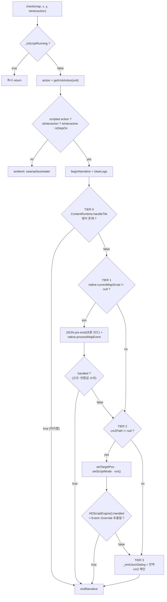
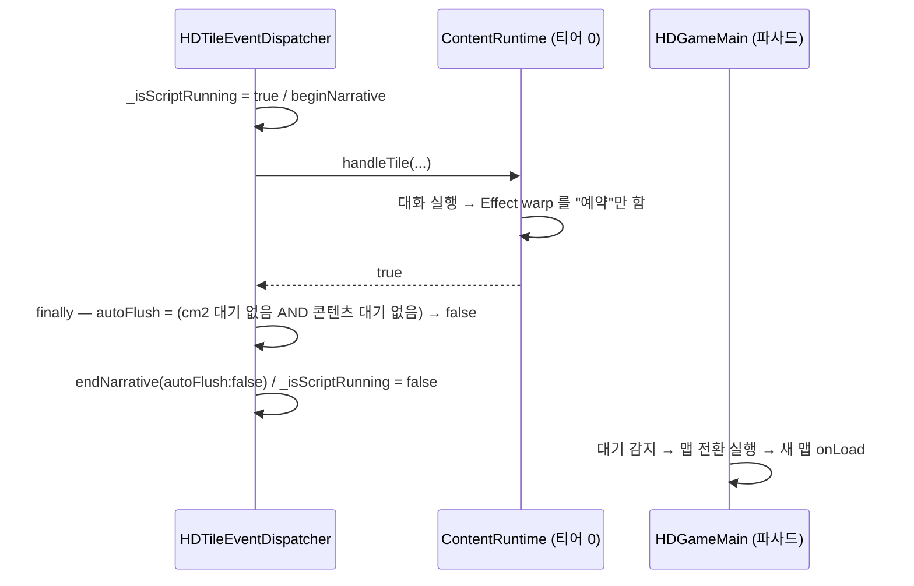
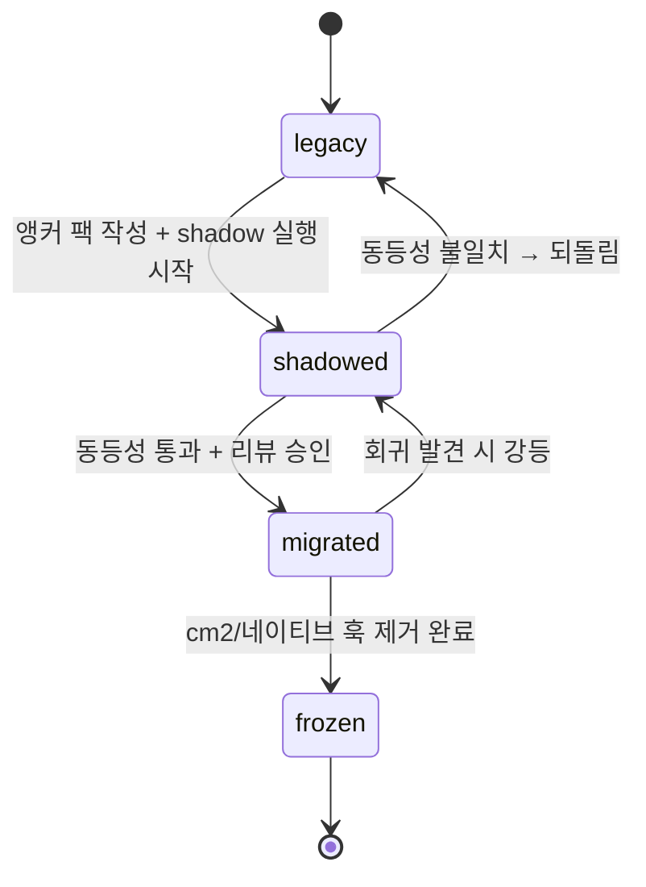
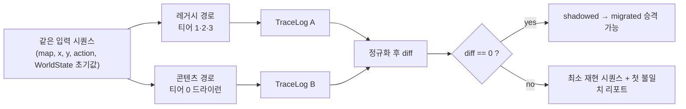
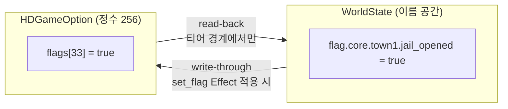
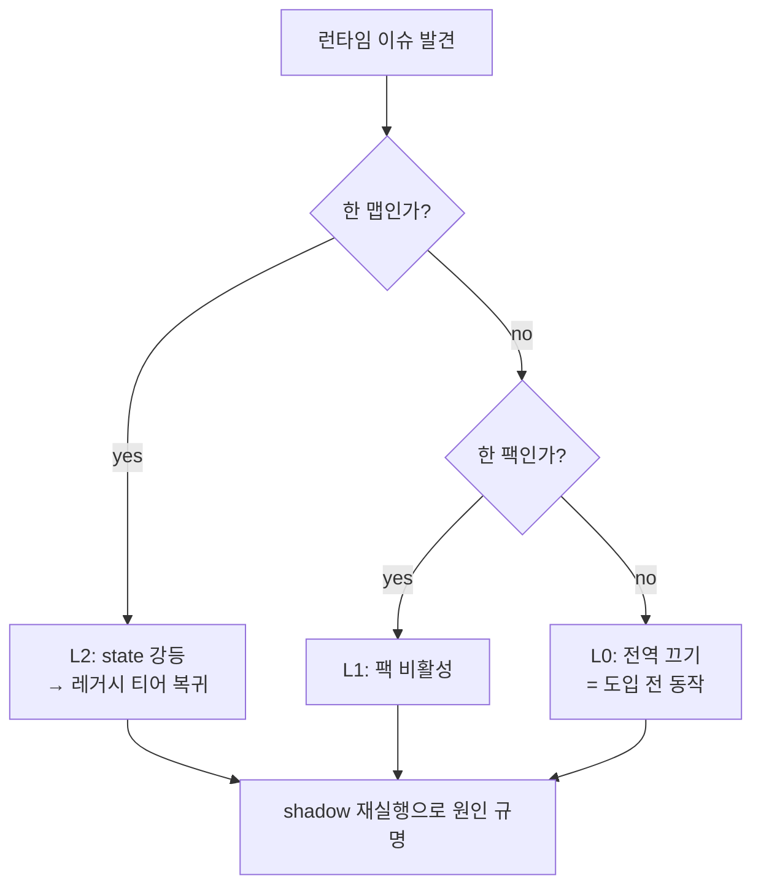

# BP-28 · cm2·네이티브 스크립트와의 공존 및 이관

> `상태: 보류` — **설계는 유효하나 현재 노선에서는 구현하지 않는다.**
> 지금 노선은 원작 방식(플래그 + cm2)의 **sample-first** 다 → [`issues/MILESTONES.md`](../issues/MILESTONES.md).
> 이 장이 필요해지는 신호는 [`issues/MILESTONES.md` §5](../issues/MILESTONES.md) 에 있다. **읽고 바로 구현하지 말 것.**

> **문서 ID**: BP-28 · **상태**: 개정 1판(검수 반영) · **선행 문서**: [BP-20 목표 아키텍처](20_target_architecture.md), [BP-26 엔티티·앵커](26_entity_registry_and_anchors.md), [BP-27 런타임 엔진](27_runtime_engine.md)
> **독자**: 런타임 구현자 · 이관 담당 · QA
> **한 줄 요약**: 기존 cm2 17파일·네이티브 4맵·JSON 이벤트 38건을 **하나도 지우지 않고** 콘텐츠 티어를 그 위에 얹는다 — 4티어 디스패치, 맵 단위 4상태 이관 기계, 트레이스 동등성 검증, 킬 스위치까지.

---

## 0. 이 장의 위치

| 항목 | 내용 |
|---|---|
| 구획 | ③ Runtime 이 주 무대. 검증 절차만 ② Build 에 걸침 |
| 근거 결정 | [D-10](_meta/DECISIONS.md) 디스패치 티어 재정의, D-02 신규는 데이터로만, D-17 전면 재작성 배제, **D-18(SSoT 소유권)**, **D-19(`pendingNavigation` 승격)** |

**개정 1판에서 바뀐 것** (검수 `_meta/reviews/REVIEW_BP-28.md` 반영)

| # | 지적 | 처리 |
|---|---|---|
| F-01 | `L1_ep1d6.cm2` "참조 끊김" 은 **`#` 주석 2줄을 실코드로 오독**한 것 | §1.1 표·사실 3·§9.1·Q-28-4 의 근거를 **`.map` 파일 전량 삭제**로 교체. 표에 `.map` 존재 열 추가 |
| F-02 | §2.3 "변경 후" 코드가 `_emitJsonDialog` 를 **두 번 호출** — §6.2 가 고치겠다던 이중 대사 버그 재도입 | `emitJsonOnce()` 로 재작성. §2.4 의 잘못된 `§2.6` 참조도 수정 |
| F-03 | 콘텐츠 티어의 `warp` 와 narrative flush·재진입 가드의 상호작용이 미정 | §2.6 에 3행 추가 + **T-28-8** 신설 (D-19) |
| F-04 | §2.4 "전수 대조" 가 T-28-1/T-28-2 유발 **13개 맵의 티어 이동**을 누락 | 표에 4행 추가 + **T-28-0 선행 골든 채취** 신설 |
| F-08·F-09 | "로드 실패" 가 아니라 **직전 맵 잔류**이며 `true` 를 반환 / `TOWN2` 는 실행된 적 없는 코드 | §1.4 에 진입 가능 열, §1.6 을 6단계 추적으로 교체, §9.1 에서 TOWN2 재분류 |
| F-11 | 팩 단위 롤백 시 세이브 규약 부재 | §8.3 에 "팩 부재" 행 + **R-28-12** |
| F-05·F-06·F-07·F-12 | 줄번호 1 어긋남 / `pack.json#enabled` 미존재 / 커맨드 41→40종 / 코드가 컴파일 안 됨 | 각각 정정 |
| — | GROUND_TRUTH **부록 B·C·D** 미반영 | 부록 B-2(전투 결과 반전) → §7.4 신설, 부록 C-1/C-2 → §4.5, 부록 D-1/D-2 → §1.6·§9.1 |
| 이 장이 다루지 않는 것 | 앵커 필드 정의(→ [BP-26](26_entity_registry_and_anchors.md)), `handleTile` 내부(→ [BP-27](27_runtime_engine.md)), 트레이스 CLI 명세(→ [BP-34](34_headless_sim_and_solver.md)) |
| 대전제 | **앵커가 없는 맵은 변경 전과 바이트 단위로 같게 동작한다**([BP-20](20_target_architecture.md) INV-20-05) |

---

## 1. 현 자산 재고

### 1.1 cm2 파일 17종 (실측: `hadar2026_app/assets/*.cm2`, 총 4,056줄)

| 파일 | 줄 | 역할 추정 | `Event::Override` | 타일 조작 계열 사용 | **`Map::LoadFromFile` 대상 `.map` 존재** | 부팅 경로에서 도달 |
|---|---:|---|:---:|:---:|:---:|:---:|
| `startup.cm2` | 6 | 부트 엔트리. `LoadScript("LORE_EP", 32, 25)` 한 줄이 실질 전부. 나머지 3줄은 주석 처리된 대체 엔트리 | 0 | | 해당 없음 | ● |
| `const.cm2` | 68 | 상수 정의 전용(`FLAG_*`, `MAPTYPE_*`, `BATTLERESULT_*`, `ALIGN_*`, `HANDICAP_*`, `CHECKIF_*`). 모든 스크립트가 `include` | 0 | | 해당 없음 | ● |
| `flag4ep1.cm2` | 110 | Episode1 게임 플래그 이름표(`GFD0_IS_FIRST`, `GFD0_GET_WALL_REMOVER`, …). 정수 인덱스에 이름을 붙이는 유일한 곳 | 0 | | 해당 없음 | |
| `Map002.cm2` | 60 | **현 부팅 맵(LORE_EP)의 페어링 스크립트.** 철학 문답 NPC + `MAP003` 이동 | **3** | | 해당 없음 | ● |
| `Map003.cm2` | 18 | MAP003 의 페어링 스크립트. `LORE_EP` 로 되돌아가는 ENTER 하나 | **1** | | 해당 없음 | ● |
| `lore_ep1.cm2` | 558 | 구 LORE_EP 대형 스크립트. `town1.cm2`/`ground1.cm2` 로 연결, `town1.map` 로드 | 0 | ● | **없음**(`town1.map`) | |
| `town1.cm2` | 120 | 로어성 TALK/SIGN/EVENT 데모 + Necromancer 전투 이벤트 | 0 | ● | 해당 없음 | |
| `town2.cm2` | 547 | 라스트디치성. TALK 다수 + 맵 이동 | 0 | ● | **없음**(`town1.map`) | |
| `ground1.cm2` | 35 | 로어 대륙. ENTER 2곳(`town2.cm2`, `menace.cm2`) + `FLAG_MAP` 에서 `ground1.map` 로드 | 0 | ● | **없음**(`ground1.map`) | |
| `menace.cm2` | 93 | 메너스 광산. `den1.map` 로드 + 출구 EVENT | 0 | ● | **없음**(`den1.map`) | |
| `L1_ep1d0.cm2` | 585 | Episode1 던전 지하 0층. `special_event` 변수로 특수 이벤트 분기 | 0 | ● | 해당 없음 | |
| `L1_ep1d1.cm2` | 352 | 지하 1층. d0 ↔ d2 연결 | 0 | ● | 해당 없음 | |
| `L1_ep1d2.cm2` | 369 | 지하 2층. `TILE_GROUND/PASS/BLOCK` 상수로 타일 교체 연출 | 0 | ● | 해당 없음 | |
| `L1_ep1d3.cm2` | 244 | 지하 3층 | 0 | ● | 해당 없음 | |
| `L1_ep1d4.cm2` | 534 | 지하 4층 | 0 | ● | 해당 없음 | |
| `L1_ep1d5.cm2` | 193 | 지하 5층 | 0 | ● | 해당 없음 | |
| `L1_ep1d5_1.cm2` | 164 | 지하 5층 분기. `L1_ep1d6.cm2` 호출 2줄(`:34`, `:45`)은 **둘 다 `#` 로 주석 처리**돼 있어 5층에서 더 내려가는 길이 막다른 길이다 | 0 | ● | 해당 없음 | |

**읽어낼 수 있는 사실 3가지**

| # | 사실 | 함의 |
|---|---|---|
| 1 | `Event::Override` 를 쓰는 파일은 `Map002.cm2`(3회)·`Map003.cm2`(1회) **둘뿐** | D-10 의 "cm2 페어링 티어" 를 실제로 쓰는 콘텐츠는 이 둘. 나머지 15개는 레거시 전역 체인 세계관에서 쓰였다 |
| 2 | 17개 중 12개가 `Tile::Copy*` / `Map::SetRow` / `Map::SetTile` / `Map::ChangeTile` 을 쓴다 | 타일 조작 연출은 cm2 의 실제 주력이며, 콘텐츠 DSL(D-05)이 대체하지 않는다(§5) |
| 3 | **레거시 cm2 체인은 부팅 경로에서 도달 불가하며, 그중 4개는 삭제된 `.map` 파일에 의존한다** | 아래 §1.1.1 로 분리. 이관 제외 판단의 근거는 이것이다 |

#### 1.1.1 레거시 체인이 죽어 있는 진짜 이유 (초판 정정)

> **초판 오독** — 초판은 "`L1_ep1d5_1.cm2` 가 `L1_ep1d6.cm2` 를 부르는데 그 파일이 없다(참조 끊김)" 를 근거로
> "레거시 체인 완주 불가 → 이관 제외" 를 도출했다. **이는 틀렸다.** 해당 두 줄은 `#` 로 주석 처리돼 있고,
> `packages/cm2_script/lib/src/parser.dart:20` 의 `line.trim().startsWith('#')` 가 파싱 단계에서 제외한다.
> **런타임에 `L1_ep1d6.cm2` 를 부르는 코드는 존재하지 않으며, 끊긴 참조도 없다.**
> 아래가 실측으로 검증된 대체 근거이며, 초판 근거보다 **범위가 넓고 강하다.**

| 근거 | 실측 | 영향 범위 |
|---|---|---|
| **G-28-2 `.map` 파일 전량 삭제** | `grep -n "Map::LoadFromFile" assets/*.cm2` → `ground1.cm2:29 "ground1.map"`, `lore_ep1.cm2:501 "town1.map"`, `menace.cm2:70 "den1.map"`, `town2.cm2:501 "town1.map"`. `ls assets/*.map` → **파일 없음**. CLAUDE.md 도 "The legacy `*.map` files are no longer used (deleted)" 로 못 박는다 | `ground1` · `lore_ep1` · `menace` · `town2` — **`FLAG_MAP` 블록이 맵을 만들지 못한다** |
| **G-28-3 부팅 경로에서 도달 불가** | `startup.cm2` 의 실행되는 줄은 `LoadScript("LORE_EP", 32, 25)` **하나**뿐이고, `L1_ep1d0.cm2`·`menace.cm2`·`town2.cm2` 로 들어가는 3줄은 전부 `#` 주석 | 레거시 cm2 **12종 전체** |
| **G-28-4 `.assign` 재실행으로 상태가 깨진다** | `L1_ep1d0.cm2` 최상단의 `special_event.assign(0)` — GROUND_TRUTH §9 에 따르면 `run()` 은 `variable`/`include` 만 건너뛰고 **모든 `.assign` 을 매 실행 재실행**한다. 즉 타일을 밟을 때마다 특수 이벤트 상태가 0 으로 초기화된다 | `L1_ep1d*` 7종 |
| **G-28-5 5층에서 막다른 길** | `L1_ep1d5_1.cm2:34,45` 의 `L1_ep1d6.cm2` 호출이 주석 처리 → 더 내려갈 수 없음(**참조 끊김이 아니라 미구현**) | `L1_ep1d5_1` |

- `L1_ep1d*` 는 `Map::Init`/`Map::SetRow` 로 지형을 **절차적으로 생성**하므로 `.map` 부재의 영향을 받지 않는다
  (`grep -c "Map::SetRow\|Map::Init" L1_ep1d0.cm2` → 51). 그래서 이 7종의 제외 근거는 G-28-3·G-28-4·G-28-5 다.
- 반대로 `ground1/lore_ep1/menace/town2` 는 G-28-2 + G-28-3 **둘 다** 걸린다.

### 1.2 cm2 페어링 해소의 실제 동작 — 문서화되지 않은 함정

`HDMapNavigation.loadByName`(`map_navigation.dart:40-48`)은 `MapInfos.json` 에서 이름을 찾으면 **무조건**

```dart
cm2Path = 'Map$idStr.cm2';          // :44   (초판의 ':43' 은 오기 — :43 은 resolvedJsonName 대입)
if (info['cm2'] is String) cm2Path = info['cm2'];   // :46  ← 데이터에 이 필드가 없음
```

를 설정한다. `MapInfos.json` 의 15개 엔트리 어디에도 `cm2`/`json` 필드가 없으므로(GROUND_TRUTH §6):

| 결과 | 설명 |
|---|---|
| `currentMapCm2Path` 는 **등록된 15개 맵 전부에서 non-null** | 즉 `_dispatchScripted` 의 `if (cm2Path != null)` 분기는 네이티브가 없는 모든 맵에서 **항상 참** |
| 실재하는 `Map%03d.cm2` 는 `Map002.cm2`·`Map003.cm2` **2개뿐** | 나머지 13개 맵은 존재하지 않는 cm2 를 로드하려 한다 |
| 로드 실패 시 상태 | `HDScriptEngine.loadScript`(`script_engine_adapter.dart:96-99`)가 에러 로그만 남기고 **`return` — `clearRuntimeState()` 를 호출하지 않는다** |
| 그래서 생기는 일 | **직전 맵의 스크립트가 그대로 살아남아** 새 맵의 타일 좌표로 `run()` 된다 (RK-28-1: 스크립트 누수) |

> **RK-28-1 스크립트 누수** — 예: `Map002`(LORE_EP)에서 `MAP003` 으로 이동하면 `Map003.cm2` 가 정상 로드되지만, 거기서 다시 `DEN2`(id 7) 같은 맵으로 가면 `Map007.cm2` 로드가 실패해 `Map003.cm2` 가 계속 살아 있다. `On(10,5)` 같은 좌표 조건이 새 맵에서 우연히 맞으면 엉뚱한 이벤트가 발화한다.
>
> **T-28-1** 이 함정은 이관과 무관하게 **선행 수정** 대상이다(§2.5).

### 1.3 `LoadScript` 의 두 가지 호출 규약

`executePendingNavigation`(`script_engine_adapter.dart:45-46`):

```dart
bool isMap = await HDGameSession().loadMapFromFile(nav.path);
if (!isMap) await loadScript('assets/${nav.path}');
```

| 인자 형태 | 예 | 동작 |
|---|---|---|
| **맵 이름** | `LoadScript("LORE_EP", 32, 25)` | `MapInfos.json` 조회 → `Map002.json` + `Map002.cm2` |
| **cm2 파일명** | `LoadScript("menace.cm2")` | 맵 조회 실패 → `assets/menace.cm2` 를 스크립트로 직접 로드(맵은 스크립트의 `Map::LoadFromFile` 이 만든다) |

- 레거시 체인(`lore_ep1` → `town1` → `ground1` → `menace` → `L1_ep1d*`)은 전부 **두 번째 규약**을 쓴다.
- 콘텐츠 티어는 첫 번째 규약(맵 이름)만 다룬다. 두 번째 규약으로 들어온 맵은 `currentMapName` 이 정의되지 않으므로 **티어 0 진입 자체가 불가**하고, 자동으로 `legacy` 상태가 된다(§3).

### 1.4 네이티브 맵 스크립트 4종

| 클래스 | 파일 | 줄 | **진입 가능?** | `onLoad` | `onTalk` | `onSign` | `onEvent` | `onEnter` |
|---|---|---:|---|---|---|---|---|---|
| `Town1MapScript` | `maps/town1_map_script.dart` | **98** | 부분 — 스크립트는 붙지만 **맵 데이터는 안 바뀜**(§1.6) | 이전 맵이 `GROUND1` 이면 (50,91), 아니면 (50,31) 배치 | (45,8) 감옥 개방 3단 분기 / (50,27) 로드안 2페이지 | (50,83) 성 안내판 / (23,30) 주점 | (49~51,29) 로드안 접근 알림 | (48~52,92) "구현 예정" |
| `Ground1MapScript` | `maps/ground1_map_script.dart` | 116 | 부분 — 동일 | 이전 맵별 4분기 배치 + 첫 진입 나레이션 | — | — | — | (19,10)→TOWN1 / (75,56)→TOWN2 / (16,88)→DEN1, 각각 예/아니오 메뉴 |
| `Town2MapScript` | `maps/town2_map_script.dart` | 83 | **불가** — `MapInfos.json` 미등록 + `TOWN2.json` 부재 | 이전 맵이 ORIGIN/TOWN1 이면 (37,6), 아니면 (37,68) | — | — | (29,7~10)/(31,7~10) 바라보는 방향에 따라 3칸 순간이동 | (36~39,5)→TOWN1 / (36~39,69)→GROUND1 |
| `Den1MapScript` | `maps/den1_map_script.dart` | 73 | 부분 — 동일 | 이전 맵별 3분기 배치 | — | — | — | (43,40)→DEN2 / (24~25,44~45)→GROUND1 |

**공통 성격**

| 성질 | 내용 |
|---|---|
| 실제 기능의 대부분 | **맵 간 이동과 진입 배치**. 서사 콘텐츠는 `Town1MapScript` 의 대사 5건이 거의 전부 |
| 상태 사용 | `Town1MapScript` 만 `isFlagSet(33/34/41)` / `setFlag(33/41)` 사용 |
| **치명적 결함** | `HDMapScript.isFlagSet`(`map_script.dart:41-44`)은 항상 `false` 를 반환하고 `setFlag`(`:46-48`)는 **아무것도 하지 않는다** — 주석에 `Requires implementation in GameModel / State` 라고 적힌 미구현 스텁 |
| 그 결과 | 로드안 감옥 대사가 **매번 처음처럼** 나오고 `setTile(44,14,0)` 이 반복 실행된다. Joe 관련 34번 분기는 **영원히 도달 불가** |
| `onPostEvent` | 4개 클래스 모두 빈 구현이며, **디스패처가 호출하지도 않는다**(`native_script_runner.processMapEvent` 는 `onTalk/onSign/onEvent/onEnter` 만 라우팅) |

> **G-28-1** 네이티브 스크립트의 플래그 API 가 스텁이라, "상태에 따라 다른 말을 하는 NPC"(D-16-3)가 네이티브 티어에서 **한 번도 동작한 적이 없다**. 이관의 우선 근거가 된다.

**G-28-6 `Town2MapScript`(83줄)는 실행된 적이 없는 코드다** (초판 누락)

| 확인 항목 | 실측 |
|---|---|
| `MapInfos.json` 에 `TOWN2` 엔트리 | **없음**(§1.6 표 15행이 이를 반영한다) |
| `assets/maps/TOWN2.json` | **없음** |
| 유일한 진입 경로 | `maps/ground1_map_script.dart:82` 의 `HDNativeScriptRunner().loadMapScript('TOWN2')` |
| 그 경로의 실제 동작 | `loadMapFromFile('TOWN2.json')` → `loadByName` 에서 MapInfos 미스 → `cm2Path == null` → JSON 로드 실패 → **`return null`** → `loadMapFromFile` 이 `false` 반환 → **아무 일도 일어나지 않는다** |
| 플레이어가 보는 것 | GROUND1 의 (75,56) "여기는 라스트디치성이다" 메뉴에서 "들어 가 본다" 를 골라도 **무반응** |

→ 초판 §9.1 순번 4 는 이 83줄을 "기계적 변환 가능" 으로 분류해 M5 추정에 넣었다. **재분류한다**(§9.1).
`TOWN2` 는 *이관* 대상이 아니라 **맵 신규 제작 + MapInfos 등록** 대상이다.

### 1.5 JSON `dialogLines` 를 가진 맵

| 맵 파일 | 크기 | events | 등록 이름 | 이관 난이도 | 비고 |
|---|---|---:|---|---|---|
| `Map002.json` | 50×50 | **18** | LORE_EP(id 2) | 중 | 부팅 맵. `Map002.cm2` 와 공존 중 |
| `Map003.json` | 21×21 | **3** | MAP003(id 3) | **하** | 가장 작음. 첫 이관 후보 |
| `Map010.json` | 65×82 | **8** | Prolog_B1(id 10) | 중 | `emj_789654.txt` 유래 |
| `Map011.json` | 53×52 | **9** | Prolog_B2(id 11) | 중 | `emj_85371_cave.txt` 유래 |
| 합계 | | **38** | | | |

- 이벤트 0개인 맵: `TOWN1/GROUND1/DEN1/DEN2/ORIGIN/Map001/Map013/Map014/Map015`.
- `_emitJsonDialog`(`tile_event_dispatcher.dart:166-178`)는 좌표 일치 **첫 이벤트만** 처리하고 `return` 한다 → 한 좌표에 이벤트가 둘이면 뒤쪽은 죽은 데이터다. 이관 시 **좌표 중복 검출**이 첫 검사 항목이다(§4.4).

### 1.6 `MapInfos.json` 등록 이름 15개와 자산 대응

| id | name | JSON 존재 | `Map%03d.cm2` 존재 | 네이티브 | 현재 실효 티어 |
|---:|---|:---:|:---:|:---:|---|
| 1 | Test | ● (`Map001.json`) | | | cm2 분기(파일 없음 → 누수) |
| 2 | LORE_EP | ● | ● | | **cm2 페어링** |
| 3 | MAP003 | ● | ● | | **cm2 페어링** |
| 4 | TOWN1 | ● (`Map004.json` 없음, `TOWN1.json` 존재) | | ● | 네이티브 |
| 5 | GROUND1 | (동일) | | ● | 네이티브 |
| 6 | DEN1 | (동일) | | ● | 네이티브 |
| 7 | DEN2 | (동일) | | | cm2 분기(누수) |
| 8 | Template_TOWN | | | | — |
| 9 | Prolog | | | | — |
| 10 | Prolog_B1 | ● | | | cm2 분기(누수) |
| 11 | Prolog_B2 | ● | | | cm2 분기(누수) |
| 12 | Template_DUNGEON | | | | — |
| 13 | LoreContinent | ● | | | cm2 분기(누수) |
| 14 | CastleLore | ● | | | cm2 분기(누수) |
| 15 | LastDitch | ● | | | cm2 분기(누수) |

#### 1.6.1 "등록하는 행위가 맵을 로드 불가로 만든다" (GROUND_TRUTH 부록 D)

`map_navigation.dart:29-43` 의 해석 순서가 역설을 만든다.

```dart
String resolvedJsonName = '$searchName.json';   // :29  폴백을 먼저 설정
...
if (info['name'] == searchName) {
  resolvedJsonName = 'Map$idStr.json';          // :43  폴백을 덮어쓴다
```

`MapInfos.json` 에 `json` 필드가 하나도 없으므로, **이름이 인덱스에 있으면 무조건 `Map{id:03d}.json`** 이 된다.
등록되지 않았다면 `TOWN1.json` 폴백이 살아남아 정상 로드되었을 것이다.

| 이름 | id | 해석 결과 | 존재 | `<이름>.json` 존재 | 판정 |
|---|---:|---|:---:|:---:|---|
| Test / LORE_EP / MAP003 | 1·2·3 | Map001/002/003.json | Y | — | OK |
| **TOWN1 / GROUND1 / DEN1 / DEN2** | 4~7 | Map004~007.json | **N** | **Y** | **깨짐 — 등록이 원인** |
| Template_TOWN / Prolog / Template_DUNGEON | 8·9·12 | Map008/009/012.json | N | N | 깨짐 |
| Prolog_B1 / Prolog_B2 / LoreContinent / CastleLore / LastDitch | 10·11·13·14·15 | Map010~015.json | Y | — | OK |

**합계: 등록 이름 15개 중 7개가 존재하지 않는 파일로 해석된다.**

#### 1.6.2 그 실패가 "실패" 로 보고되지 않는다 — 6단계 추적 (초판 정정)

> **초판 오류** — 초판은 "이 경로도 실패한다" 라고 썼다. 실제 증상은 **실패가 아니라 직전 맵 잔류이며, 함수는 `true`(성공)를 반환**한다. 훨씬 위험하다.

| # | 코드 | 일어나는 일 |
|---|---|---|
| 1 | `loadByName('TOWN1')` | `resolvedJsonName = 'Map004.json'`, `cm2Path = 'Map004.cm2'` |
| 2 | `map_navigation.dart:59` `_loader.loadMap` | 예외 발생 |
| 3 | `map_navigation.dart:63` `if (cm2Path == null) return null;` | `cm2Path` 가 **non-null** 이라(A-1) `return null` 하지 **않는다** |
| 4 | `map_navigation.dart:70` | `MapBundle(mapName:'TOWN1', json: null, cm2Path:'Map004.cm2')` 반환 |
| 5 | `game_session.dart:97` `if (bundle.json != null)` | **건너뜀 — `session.map` 은 직전 맵 그대로** |
| 6 | `game_session.dart:117-128` → `:130` | 네이티브 스왑은 **정상 실행**되어 `Town1MapScript` 가 등록되고, 함수는 **`return true`** |

**결과: 직전 맵의 타일 위에 TOWN1 의 네이티브 핸들러가 붙는다.** 타일 액션 판정은 옛 맵의 `getUnit(x,y)` 로 하고
좌표 분기는 TOWN1 기준이므로 좌표가 전부 어긋난다. §1.6 표의 "현재 실효 티어" 열에서 id 4/5/6 의 "네이티브" 는
**"(단, 맵 데이터는 직전 맵 잔류)"** 로 읽어야 한다.

**이관에 주는 함의** — §9.1 이 TOWN1 을 이관 대상으로 잡는데, **TOWN1.json 이 실제로 로드된 적이 없다면
그 맵의 shadow 트레이스는 애초에 채취할 수 없다.** T-28-2 는 이관의 0번째 작업이자, §9.1 전체의 전제다.

> **T-28-2 의 완료 정의** — `MapInfos.json` 에 `json: "TOWN1.json"` 등을 채운 뒤
> **`session.map.displayName` 이 실제로 바뀌는지** 확인한다. `loadMapFromFile` 이 `true` 를 반환하는 것은 증거가 아니다.
>
> **추가 검토 대상** — `loadByName` 의 catch 로직("JSON 실패인데 cm2 가 있으면 통과")은 *cm2-only 맵*을 위한 규약인데,
> A-1 때문에 **모든 맵이 cm2-only 처럼 보인다.** T-28-2 는 이 규약 자체의 재검토를 포함한다(§2.5).

---

## 2. 4티어 디스패치 상세 (D-10)

### 2.1 결정 흐름도



### 2.2 각 티어의 `handled` 신호 규약

| 티어 | 신호 원천 | 타입 | `true` 의 의미 | 현재 상태 |
|---|---|---|---|---|
| 0 Content | `ContentRuntime.handleTile` 반환값 | `Future<bool>` | 이 (map,x,y,action) 에 앵커가 있고 그 핸들러를 끝까지 돌렸다 | 신규 |
| 1 Native | `HDMapScript.on*` 반환값 → `processMapEvent` 반환값 | `Future<bool>` | 스크립트가 좌표를 인식하고 처리했다 | **정의는 있으나 디스패처가 버린다**(`tile_event_dispatcher.dart:133`) |
| 2 cm2 | `HDScriptEngine().handled` (= `Event::Override()` 호출 여부) | `bool` | cm2 블록이 자기가 JSON 을 대체한다고 선언했다 | 동작 중. 사용처는 `Map002.cm2`·`Map003.cm2` 뿐 |
| 3 JSON | 없음(최종 폴백) | — | — | 동작 중 |

> **R-28-1** 티어 0~2 는 **모두 같은 모양의 불리언 신호**를 쓴다. "처리했으면 `true`, 아래로 넘기려면 `false`". 티어마다 다른 규약(예외, sentinel, out 파라미터)을 도입하지 않는다.

### 2.3 `_dispatchScripted` 변경 전/후

**변경 전** (`hadar2026_app/lib/application/tile_event_dispatcher.dart:106-157`, 현행)

```dart
Future<void> _dispatchScripted(
  HDTileAction action, int x, int y, MapModel map, UiHost host,
) async {
  if (action == HDTileAction.sign) {
    host.setHeader('@B푯말에 써 있기를:');
  }

  final native = HDNativeScriptRunner();
  final cm2Path = HDGameSession().currentMapCm2Path;
  final xs = x.toString().padLeft(2);                        // :122
  final ys = y.toString().padLeft(2);                        // :123
  final tag = action.debugTag.isEmpty ? '???' : action.debugTag;  // :124

  if (native.currentMapScript != null) {
    await _emitJsonDialog(map, x, y, host, action);
    await native.processMapEvent(action, x, y);   // ← 반환값 버려짐
    return;
  }

  if (cm2Path != null) {
    HDScriptEngine().setTargetPos(x, y);
    HDScriptEngine().setScriptMode(action.scriptMode);
    await HDScriptEngine().run();
    if (HDScriptEngine().handled) return;
    await _emitJsonDialog(map, x, y, host, action);
    return;
  }

  print('[JSN][$tag] ($xs, $ys)');
  await _emitJsonDialog(map, x, y, host, action);
  HDScriptEngine().setTargetPos(x, y);
  HDScriptEngine().setScriptMode(action.scriptMode);
  await HDScriptEngine().run();
}
```

**변경 후** — 티어 0 삽입 + 티어 1 반환값 소비 + **JSON 방출 1회성 보장**. 티어 2·3 의 나머지 본문은 보존.

```dart
Future<void> _dispatchScripted(
  HDTileAction action, int x, int y, MapModel map, UiHost host, {
  required bool isInteraction,                    // ← 티어 0 이 필요로 함
}) async {
  if (action == HDTileAction.sign) {
    host.setHeader('@B푯말에 써 있기를:');
  }

  final mapName = HDGameSession().currentMapName;   // T-28-3: 세션에 신설
  final native  = HDNativeScriptRunner();
  final cm2Path = HDGameSession().currentMapCm2Path;
  final xs = x.toString().padLeft(2);
  final ys = y.toString().padLeft(2);
  final tag = action.debugTag.isEmpty ? '???' : action.debugTag;

  // ★ JSON dialogLines 는 한 상호작용에 최대 1회만 방출한다.
  //   초판 스케치는 티어 1 의 선-방출과 티어 2/3 의 폴백 방출이 겹쳐
  //   §6.2 증상 2(이중 대사)를 그대로 재도입했다.
  bool jsonEmitted = false;
  Future<void> emitJsonOnce() async {
    if (jsonEmitted) return;
    jsonEmitted = true;
    await _emitJsonDialog(map, x, y, host, action);
  }

  // ── TIER 0 · content pack ──────────────────────────────────────────
  // 킬 스위치(§8)가 꺼져 있거나 맵 이름을 모르면 곧바로 false.
  if (await ContentRuntime().handleTile(
        mapName: mapName, x: x, y: y, action: action,
        isInteraction: isInteraction, host: host)) {
    return;                       // 맵 전환 예약이 있어도 여기서 끝난다 — §2.6
  }

  // ── TIER 1 · native map script ─────────────────────────────────────
  if (native.currentMapScript != null) {
    // 호환 모드: 이관 상태가 legacy 인 맵만 JSON 을 선-방출한다.
    if (ContentRuntime().legacyJsonPreEmit(mapName)) {
      await emitJsonOnce();
    }
    final handled = await native.processMapEvent(action, x, y);
    // ↑ 티어 경계 — 정수→이름 플래그 read-back 지점 1 (§7.3)
    if (handled) return;          // ← 신규: 반환값을 소비한다
    // fall through to TIER 2/3
  }

  // ── TIER 2 · cm2 paired script ─────────────────────────────────────
  if (cm2Path != null) {
    HDScriptEngine().setTargetPos(x, y);
    HDScriptEngine().setScriptMode(action.scriptMode);
    await HDScriptEngine().run();
    // ↑ 티어 경계 — read-back 지점 2 (§7.3)
    if (HDScriptEngine().handled) return;
    await emitJsonOnce();         // ← 이미 냈으면 no-op
    return;
  }

  // ── TIER 3 · JSON + 전역 cm2 체인 (레거시) ─────────────────────────
  print('[JSN][$tag] ($xs, $ys)');
  await emitJsonOnce();           // ← 이미 냈으면 no-op
  HDScriptEngine().setTargetPos(x, y);
  HDScriptEngine().setScriptMode(action.scriptMode);
  await HDScriptEngine().run();
}
```

호출부도 인자 하나가 늘어난다(`tile_event_dispatcher.dart:67`):

```diff
-        await _dispatchScripted(action, x, y, map, host);
+        await _dispatchScripted(action, x, y, map, host,
+                                isInteraction: isInteraction);
```

**초판 코드의 결함 재현 경로** (기록용 — 같은 실수를 반복하지 않기 위해)

```
legacy 상태 네이티브 맵 + 네이티브가 false 반환:
  TIER 1: legacyJsonPreEmit == true → _emitJsonDialog()   ← 1회차
          handled == false → fall through
  TIER 2: run() → handled == false → _emitJsonDialog()    ← 2회차 (중복!)
  또는 (T-28-2 로 cm2Path == null 이면)
  TIER 3: print + _emitJsonDialog()                        ← 2회차 (중복!)
```

`_emitJsonDialog`(`tile_event_dispatcher.dart:159-179`)는 중복 억제가 없는 순수 방출이다.
지금 화면이 깨지지 않는 유일한 이유는 **네이티브 4맵의 JSON 이벤트 수가 0** 이기 때문이며(§1.5),
그 상태에 의존하는 것은 설계가 아니라 우연이다.

### 2.4 변경으로 인한 동작 차이 — 전수 대조

**A. 티어 0 삽입만 했을 때** (T-28-1/2/4/5 미적용)

| 상황 | 변경 전 | 변경 후 | 회귀 위험 |
|---|---|---|---|
| 앵커 없음 + 네이티브 없음 + cm2 있음 | 티어 2 | 티어 2 (동일) | 없음 |
| 앵커 없음 + 네이티브 있음 | JSON + 네이티브, 종료 | JSON + 네이티브, 종료 (동일) | 없음 |
| 앵커 있음 | — | 티어 0 종료 | 설계된 변화 |
| 앵커 있음 + `warp` 예약 | — | 티어 0 종료 + `autoFlush: false` | 설계된 변화(§2.6) |

→ 이 구간이 [BP-20](20_target_architecture.md) **INV-20-05** 가 고정하는 범위다.

**B. 선행 수정(T-28-1·T-28-2)이 유발하는 티어 이동** — 초판 누락분

§1.6 이 밝히듯 실재하는 `Map%03d.cm2` 는 `Map002.cm2`·`Map003.cm2` **2개뿐**이고, 나머지 **13개 등록 맵**은
존재하지 않는 cm2 경로를 갖는다. T-28-2 를 적용하면 그 13개의 `cm2Path` 가 `null` 이 되어 **티어 2 → 티어 3 으로 이동**한다.
두 티어의 동작은 같지 않다:

| | 티어 2 (`cm2Path != null`) | 티어 3 (`cm2Path == null`) |
|---|---|---|
| 순서 | cm2 `run()` → `handled` 면 종료 → 아니면 JSON | `print('[JSN]…')` → JSON → cm2 `run()` |
| JSON 방출 조건 | `handled == false` 일 때만 | **무조건** |
| 전역 cm2 체인 | 안 돎 | **돎** |
| 디버그 출력 | 없음 | `[JSN][tag] (x, y)` |

| # | 상황 | 변경 전 | 변경 후 | 회귀 위험 | 영향 맵 |
|---|---|---|---|---|---|
| B-1 | **T-28-1 적용** — cm2 로드 실패 맵 | A-2 버그로 **직전 맵 스크립트가 살아남아 `run()`** 됨 | `clearRuntimeState()` 로 **빈 스크립트 no-op** | **있음** — 우연히 발화하던 이벤트가 사라진다 | 13개 |
| B-2 | **T-28-2 적용** — cm2 미실재 맵 | 티어 2 | **티어 3**(JSON 무조건 + 전역 체인 + `print`) | **있음** — 출력 순서와 횟수가 바뀐다 | Test·DEN2·Prolog_B1(8이벤트)·Prolog_B2(9이벤트)·LoreContinent·CastleLore·LastDitch 등 13개 |
| B-3 | **T-28-2 적용** — 네이티브 3맵 | 티어 1 이 `return` 하므로 하강 없음 | 티어 1 하강 목적지가 **티어 2 → 티어 3** 으로 바뀜 | 중 | TOWN1·GROUND1·DEN1 |
| B-4 | **T-28-2 적용** — 맵 데이터 잔류 해소 | 직전 맵 위에 새 핸들러(§1.6.2) | **올바른 맵이 로드됨** | **매우 큼(의도된 수정)** — 좌표 판정이 전부 달라진다 | TOWN1·GROUND1·DEN1·DEN2 |

**C. 티어 1 정비(T-28-4·T-28-5)가 유발하는 변화**

| # | 상황 | 변경 전 | 변경 후 | 회귀 위험 |
|---|---|---|---|---|
| C-1 | 네이티브가 `false` 반환 | JSON + 네이티브, **종료** | JSON + 네이티브, **티어 2/3 로 하강**(JSON 은 재방출 안 함) | **있음** → 상세는 **§6.2** |
| C-2 | `migrated` 이상 맵의 네이티브 잔여 훅 | JSON 무조건 선-방출 | `legacyJsonPreEmit == false` → 중복 대사 제거 | 설계된 변화 |
| C-3 | 네이티브 맵에 JSON 이벤트가 새로 생김 | **이중 출력** | 1회 출력 | 버그 수정 |

> **초판 오류 정정** — 초판 표의 C-1 행은 "회귀 위험 있음 → **§2.6**" 을 가리켰으나 §2.6 은 재진입 가드 절이며 이 회귀를 다루지 않는다.
> 올바른 참조는 **§6.2(T-28-4)** 다.
>
> **[BP-20](20_target_architecture.md) INV-20-05 와의 관계** — B·C 구간의 변화는 **앵커가 하나도 없는 맵에서도** 발생한다.
> 즉 INV-20-05 의 "앵커 없는 맵은 동일" 은 A 구간에서만 성립한다. BP-20 개정판이 명제를 정밀화하고
> **INV-20-05b**("B·C 의 diff 는 이 표에 열거된 것으로만 구성된다")를 신설해 이를 받는다.

### 2.5 선행 수정 3건 (이관과 독립적으로 먼저 고쳐야 하는 것)

| ID | 문제 | 수정 | 완료 정의 |
|---|---|---|---|
| **T-28-0** | **선행 골든 채취.** T-28-1/2 를 적용하는 순간 §2.4 의 B 구간 변화가 일어나는데, 기준선이 없으면 "이미 바뀐 동작"을 기준으로 삼는 순환 논증이 된다 | T-28-1 **적용 전에** 13개 맵 + 네이티브 3맵의 `UiHost` 호출 시퀀스 골든을 §4.2 포맷으로 채취해 `test/` 에 커밋 | 골든 파일이 커밋되어 있고, 적용 후 diff 가 §2.4 B·C 표와 **1:1 대조**된다 |
| **T-28-1** | `loadScript` 실패 시 이전 스크립트가 살아남음(§1.2, GROUND_TRUTH 부록 A-2) | 실패 시 `clearRuntimeState()` 를 호출해 **빈 스크립트**로 만든다. 없는 스크립트는 "아무것도 안 함"이어야지 "직전 것"이면 안 된다 | 맵 전환 후 `_engine.currentScript.length == 0` |
| **T-28-2** | `MapInfos.json` 에 `json`/`cm2` 필드 부재 → 등록 이름 15개 중 **7개가 존재하지 않는 파일로 해석**되고(부록 D-1), 그 실패가 `true` 로 보고된다(부록 D-2) | 15개 엔트리에 `json`/`cm2` 명시. `cm2` 가 없으면 필드를 생략하고, 코드는 `Map%03d.cm2` 기본값을 **적용하지 않도록** 바꾼다. `loadByName` 의 "JSON 실패인데 cm2 가 있으면 통과" 규약도 재검토 | 맵 전환 후 **`session.map.displayName` 이 실제로 바뀐다**. `loadMapFromFile` 의 `true` 반환은 증거가 아니다 |
| **T-28-3** | `HDGameSession` 에 `currentMapName` 없음 → 티어 0 진입 키가 없고 세이브에도 안 들어감 | `loadMapFromFile` 에서 `bundle.mapName` 을 세션에 저장 | 세이브 v2 에 값이 실린다([BP-25 §5.3](25_world_state_and_save.md)) |
| **T-28-8** | **지연 이동(`pendingNavigation`)이 cm2 엔진 소유다** — `tile_event_dispatcher.dart:99` 가 narrative flush 를 `HDScriptEngine.pendingNavigation` 에 직접 결합해 두어, 콘텐츠 티어의 Effect `warp` 는 실행 경로가 없다(**D-19**) | 예약 개념을 세션/런타임 공용으로 승격하고 `autoFlush` 판정을 "전환 대기가 하나라도 있으면 flush 안 함" 술어로 바꾼다. **저장소의 이름·소유자·타입은 [BP-27 §2.7·§4.4](27_runtime_engine.md) 소유** | [BP-20](20_target_architecture.md) INV-20-19 통과 |

> **순서** — `T-28-0 → T-28-1 → T-28-2 → T-28-3 · T-28-8 → 티어 0 삽입`.
> T-28-1 · T-28-2 를 티어 0 보다 먼저 끝내지 않으면 §4 의 동등성 비교가 "직전 맵 스크립트 누수"와 "직전 맵 데이터 잔류"라는
> 두 겹의 잡음에 파묻힌다. 그리고 T-28-0 이 없으면 §9.3 M2 의 종료 조건("shadow diff 0")이 **자기 자신을 기준으로 삼는** 순환이 된다.

### 2.6 재진입 가드 재정의

**현재** `_isScriptRunning`(`tile_event_dispatcher.dart:34`)은 전역 `bool` 하나이고, `check()` 진입 시 이미 참이면 **조용히 return** 한다.

**재정의된 규약**

| 항목 | 규약 |
|---|---|
| 이름 | "한 번에 하나의 상호작용"(one interaction at a time) |
| 보호 범위 | `check()` 진입 ~ `endNarrative()` 완료. **티어 0 의 비동기 대화 그래프 전체를 포함한다** |
| 티어 0 의 `await` 지점 | `UiHost.showWindowMenu` / `waitForAnyKey` — 이 사이에 플레이어가 다른 타일을 밟는 입력이 들어와도 가드가 막는다 |
| 허용되는 재진입 | **없음.** 대화 안에서 대화를 시작하는 것(`play_dialogue` Effect)은 재진입이 아니라 `DialogueRuntime` 내부의 스택 처리다([BP-27](27_runtime_engine.md)) |
| 가드 해제 시점 | `finally` 블록. 티어 0 이 예외를 던져도(`GameReloadException` 포함) 반드시 해제된다 |
| 고정 테스트 | **INV-20-16** — 티어 0 실행 중 `check()` 재호출이 즉시 반환하고 `UiHost` 호출이 추가로 발생하지 않음을 단언. **시나리오에 "티어 0 이 `warp` 를 예약한 직후 `check()` 재호출" 을 포함**한다 |
| **맵 전환 예약 경로** | Effect `warp` 는 **즉시 실행하지 않고 예약**한다. cm2 `LoadScript` 와 같은 모델이며, 소비는 디스패치가 끝난 뒤 파사드(`hd_game_main.dart:74,80`)가 한다. 예약 저장소의 이름·타입은 [BP-27 §2.7](27_runtime_engine.md) 소유 |
| **narrative flush 판정** | `tile_event_dispatcher.dart:99` 의 `autoFlush` 는 **"전환 대기가 하나라도 있으면 `false`"** 라는 술어로 확장된다. cm2 대기와 콘텐츠 대기를 **둘 다** 본다 |
| **전환 중 재진입** | 예약 → 가드 해제 → `endNarrative` → 파사드가 전환 실행 → 새 맵 `onLoad`. 이 순서라서 새 맵의 `onLoad` 대사가 **직전 맵의 narrative 사이클에 섞이지 않는다.** `warp` 를 즉시 실행하면 이 성질이 깨진다 |
| **예외 경로** | `finally` 는 `endNarrative` 를 **`await` 한 뒤** `_isScriptRunning = false` 를 한다. `GameReloadException`(세이브 로드) 전파 중에도 이 순서가 유지되며, 티어 0 은 자기 락을 자기 `finally` 로 먼저 푼다([BP-27 §4.4](27_runtime_engine.md)) |

**D-19 가 지적한 결함과 그 해소**

| # | 손대지 않으면 | 해소 |
|---|---|---|
| 1 | 콘텐츠 `warp` 예약 시 `HDScriptEngine().pendingNavigation == null` → `autoFlush: true` → **맵이 바뀌기 직전에 오버레이가 한 번 닫힌다.** cm2 와 화면 동작이 달라진다 | 판정식 확장(T-28-8) |
| 2 | `warp` 를 즉시 실행하면 `_isScriptRunning == true` 이고 narrative 가 열린 채로 맵 교체·네이티브 스왑(`game_session.dart:117-128`)·`HDBattle().init()` 이 돈다 | 예약 모델 고수(§2.6 표) |
| 3 | 아무것도 안 하면 Effect `warp` 에 **실행 경로가 없다** | T-28-8 |



> **R-28-2** 티어 0 은 **자체 재진입 가드를 두지 않는다.** `_isScriptRunning` 하나가 유일한 상호배제 지점이다.
> (티어 0 내부의 `isInteracting` 락은 `ContentRuntime` 이 **직접 호출**될 때를 위한 것이지 디스패처 경로의 이중 가드가 아니다 — [BP-27 §4.4](27_runtime_engine.md).)
> 가드를 이중화하면 해제 순서 버그가 생긴다.

---

## 3. 맵 단위 이관 상태 기계

### 3.1 4상태



| 상태 | 정의 | 티어 0 | 티어 1·2 | JSON 선-방출 | 진입 조건 | 검증 방법 |
|---|---|:---:|:---:|:---:|---|---|
| `legacy` | 콘텐츠 앵커 없음. 지금까지와 완전히 동일 | 미진입 | 활성 | ● | 기본값 | INV-20-05 골든 비교 |
| `shadowed` | 앵커는 있으나 **실제 출력은 여전히 레거시**. 콘텐츠 티어는 드라이런으로 트레이스만 남김 | 드라이런 | 활성 | ● | 앵커 파일 작성 + `state: shadowed` 기록 | §4 트레이스 diff 가 0 |
| `migrated` | 콘텐츠 티어가 실제 출력을 담당. 레거시 훅은 남아 있으나 도달하지 않음 | **활성** | 폴백만 | ✕ | shadow diff 0 + 사람 리뷰 | 회귀 골든 = 콘텐츠 트레이스 |
| `frozen` | 레거시 훅이 물리적으로 삭제됨. cm2 파일 이동, 네이티브 클래스 등록 해제 | 활성 | 없음 | ✕ | `migrated` 유지 2주기 이상 | cm2/네이티브 참조 grep 0건 |

### 3.2 상태를 어디에 기록하는가 — 결정

| 후보 | 판정 | 이유 |
|---|---|---|
| `MapInfos.json` 에 필드 추가 | **기각** | `MapInfos.json` 은 RPG Maker MV 포맷을 보존해야 하고 맵 에디터가 소유한다. [BP-20 §6](20_target_architecture.md) 의 "지형 vs 의미 분리" 위반 |
| `pack.json` 에 맵 목록 | 부분 채택 | 팩 전체 롤업만 |
| **`anchors/<MAPNAME>.json` 에 `migration` 블록** | **채택** | 앵커 파일은 정확히 "이 맵의 콘텐츠 소유권"을 표현하는 파일이다. 상태와 앵커가 같은 파일에 있으면 어긋날 수 없다 |

```json
{
  "map": "MAP003",
  "migration": {
    "state": "migrated",
    "since": "2026-09-14",
    "replaces": { "cm2": ["Map003.cm2"], "nativeScript": null, "jsonEvents": 3 },
    "evidence": { "shadowRuns": 12, "traceDiff": 0, "reviewedBy": "yk.ahn" }
  },
  "anchors": [ /* … BP-26 */ ]
}
```

**롤업** — `hadar_content build` 가 `content.lock.json` 에 집계한다.

```json
{
  "migration": {
    "legacy":   ["LORE_EP", "Prolog_B1", "Prolog_B2", "…"],
    "shadowed": ["TOWN1"],
    "migrated": ["MAP003"],
    "frozen":   []
  }
}
```

| 규칙 | 내용 |
|---|---|
| **R-28-3** | 앵커 파일이 없는 맵은 자동으로 `legacy`. 상태를 명시하지 않은 앵커 파일은 빌드 실패(암묵 승격 금지) |
| **R-28-4** | `migrated` 이상으로 올라간 맵의 JSON `events[].dialogLines` 는 빌드가 **경고**한다(죽은 데이터). `frozen` 에서는 **에러** |
| **R-28-5** | 런타임은 `content.lock.json#migration` 을 읽어 `legacyJsonPreEmit(mapName)` 을 결정한다. 코드에 맵 이름을 하드코딩하지 않는다 |

---

## 4. 동등성 검증 (shadow mode)

### 4.1 무엇을 비교하는가

콘솔 픽셀이 아니라 **`UiHost` 포트 호출 시퀀스**를 비교한다. 포트는 이미 존재하고([BP-20](20_target_architecture.md) §3 포트 절, `application/ports/ui_host.dart`), 헤드리스 선례도 있다(`test/application/map_navigation_test.dart`).



### 4.2 트레이스 레코드 포맷

`RecordingUiHost implements UiHost` 가 모든 호출을 순서대로 적재한다.

```json
{"seq": 0, "op": "beginNarrative"}
{"seq": 1, "op": "clearLogs"}
{"seq": 2, "op": "setHeader", "text": "@B푯말에 써 있기를:"}
{"seq": 3, "op": "addLog", "text": "여기는 'CASTLE LORE'성…", "isDialogue": true}
{"seq": 4, "op": "showWindowMenu", "items": ["…","예","아니오"], "result": 1}
{"seq": 5, "op": "waitForAnyKey"}
{"seq": 6, "op": "endNarrative", "autoFlush": true}
```

포트 외 부작용도 같은 스트림에 기록한다.

```json
{"seq": 7, "op": "state.setFlag", "id": "flag.core.town1.jail_opened"}
{"seq": 8, "op": "map.setTile", "x": 44, "y": 14, "tile": 0}
{"seq": 9, "op": "nav.loadMap", "name": "GROUND1"}
{"seq": 10, "op": "battle.registerEnemy", "id": 71}
```

### 4.3 정규화 규칙 (비교 전 양쪽에 동일 적용)

| # | 규칙 | 이유 |
|---|---|---|
| 1 | 연속 공백·개행 정규화, 앞뒤 공백 제거 | cm2 는 들여쓰기 기반이라 문자열에 우발적 공백이 섞임 |
| 2 | `@X…@@` 색상 태그는 **유지**(비교 대상) | 헤더 색은 UX 회귀 대상 |
| 3 | `seq` 번호는 비교 대상 아님. **순서만** 비교 | 드라이런 쪽에 진단 레코드가 끼어도 무해하게 |
| 4 | `op: print` / 디버그 로그(`[JSN][…]`)는 제외 | 레거시 경로에만 있는 콘솔 출력 |
| 5 | `state.*` 는 **레거시 정수 ↔ 이름 플래그**를 `legacyFlagMap` 으로 환산 후 비교(§7) | 같은 의미의 상태 변화를 같다고 인정하기 위해 |
| 6 | `addLog` 를 인접 연속으로 합치지 **않는다** | 페이지 넘김 타이밍이 UX 차이를 만든다 |
| 7 | 부동소수 없음(설계상) → 수치 비교는 정확 일치 | [BP-20](20_target_architecture.md) R-20-8 |
| 8 | **선택지 집합은 표시 텍스트의 정렬된 다중집합으로 비교**하고, 선택 결과(`result`)는 인덱스가 아니라 **텍스트로 매칭**한다 | 이관은 1:1 번역이 아니다. cm2 `Select::Add` 목록과 콘텐츠 `Choice` 목록은 개수·순서가 달라질 수 있는데, 규칙 1~7 중 어느 것도 이를 다루지 않아 diff 가 통째로 불일치로 뜬다 |
| 9 | **`approvedDeltas` 에 등재된 레코드는 diff 판정에서 제외**한다(§4.6) | 의도된 동작 변경(버그 수정)을 기계적으로 통과시키기 위해 |

### 4.4 shadow 실행 계획

| 단계 | 내용 | 산출물 |
|---|---|---|
| S1 | 맵의 **상호작용 가능 타일 전수 열거** — `HDTileProperties.getUnitAction` 이 `isInteractive` 또는 `isStepOn` 을 참으로 만드는 모든 (x,y) | `tiles.json` |
| S2 | 좌표 중복 이벤트 검출(`map.events` 에 같은 (x,y) 둘 이상) | 경고 리스트 |
| S3 | 각 타일에 대해 **초기 상태 조합**을 돌린다. 조합은 그 맵이 읽는 플래그의 부분집합(2^n, n≤8 강제) | `matrix.json` |
| S4 | 레거시/콘텐츠 양쪽 트레이스 수집 | `trace/legacy/*.json`, `trace/content/*.json` |
| S5 | 정규화 후 diff | `shadow_report.json` |
| S6 | 첫 불일치 지점을 최소 재현 시퀀스로 축약 | `repro.json` |

| 제약 | 값 | 이유 |
|---|---|---|
| 상태 조합 상한 | 2^8 = 256 | 조합 폭발 방지. n>8 인 맵은 조합을 사람이 지정 |
| 메뉴 선택 정책 | `scripted` 정책으로 **모든 분기를 순회**(D-13) | "예"만 눌러본 검증은 검증이 아님 |
| 실행 위치 | **`flutter test` 하네스** | 레거시 경로(`HDTileEventDispatcher`·`HDScriptEngine`·`HDGameSession`·`HDNativeScriptRunner`·`HDBattle`)가 `package:flutter/foundation.dart`(`game_session.dart:3`)와 `shared_preferences`(`save_manager.dart:3`)에 의존한다. 순수 Dart CLI 가 이를 path 로 끌어오면 `sdk: flutter` 가 딸려와 `dart pub get` 이 실패한다([BP-20](20_target_architecture.md) RK-20-1 / Q-20-1) |
| CLI 의 몫 | `hadar_content sim` — **콘텐츠 경로 단독 시뮬**만. 레거시 대조(`--shadow`)는 CLI 서브커맨드가 아니다 | 위와 같은 이유 |
| CI 잡 | `app` 잡([BP-20 §9.1](20_target_architecture.md)의 3잡 구성 중). **`content`(순수 Dart) 잡에는 들어갈 수 없다** | §9.3 M2 의 종료 조건이 실행될 자리 |
| 헤드리스 구동 형태 | `HDTileEventDispatcher.check(...)` 를 **직접 호출**한다. 이동 루프를 태우지 않는다 | GROUND_TRUTH 부록 B-3 — 타일 상호작용의 트리거가 `presentation/panels/player_sprite.dart:103` 의 Bonfire `update(dt)` 폴링 안에 있어 포트를 페이크로 바꿔도 이동 자체는 헤드리스로 돌지 않는다 |

> **R-28-6** shadow 비교기는 **런타임 바이너리에 포함되지 않는다.** `RecordingUiHost` 와 비교기는 `test/` 에만 존재한다.
> (초판은 "`test/` 또는 `tools/content_cli/`" 로 헷지했으나, 위 표가 `flutter test` 로 확정했으므로 CLI 는 대상이 아니다.)

### 4.5 동등성 검증이 성립하지 않는 상태 — 반드시 피해야 할 기준선

GROUND_TRUTH 부록 C 가 밝힌 두 결함 때문에, **세이브를 로드한 직후의 상태를 shadow 기준선으로 삼으면 안 된다.**

| # | 결함 | 코드 | 레거시 경로에 주는 영향 |
|---|---|---|---|
| C-1 | `MapModel.toJson()` 이 **`events` 를 저장하지 않는다** | `domain/map/map_model.dart:50-58` | 로드 직후 `map.events` 가 빈 리스트 → `_emitJsonDialog` 가 아무것도 내지 않는다 → **티어 3 이 통째로 죽는다**(Map002 18건·Map003 3건·Map010 8건·Map011 9건이 전부 사라짐) |
| C-2 | 세이브 로드가 **네이티브 스크립트를 붙이지 않는다** | `save_manager.dart:86` 이 `setNewMap` 을 직접 호출 — 스왑은 `game_session.dart:117-128`(=`loadMapFromFile`) 안에만 있다 | `currentMapScript` 가 직전 맵의 것이거나 `null` → **티어 1 이 죽거나 엉뚱한 맵의 핸들러가 돈다.** `currentMapCm2Path` 도 갱신되지 않아 티어 2 도 어긋난다 |

| 규칙 | 내용 |
|---|---|
| **R-28-13** | shadow 트레이스는 **새 게임 부팅 경로**(`HDGameSession.init()` → `LoadScript`)로 만든 상태에서만 채취한다. 세이브 로드로 만든 상태는 기준선이 될 수 없다 |
| **R-28-14** | 세이브 로드 직후 상태는 **별도의 회귀 테스트**([BP-20](20_target_architecture.md) INV-20-21)로 다룬다. 그 테스트의 기대값은 "레거시와 같다"가 아니라 "티어 0 만 살아 있다"이다 |
| 함의 | 콘텐츠 티어는 `currentMapName` + 번들만 있으면 동작하므로, 로드 직후에 **유일하게 살아 있는 티어**가 된다. 이는 이관의 부수 이득이자 C-1/C-2 를 시급히 고쳐야 할 이유이기도 하다([BP-25 §5](25_world_state_and_save.md)) |

### 4.6 승인된 diff (`approvedDeltas`)

이관 과정에는 "동작이 바뀌는 것이 맞는" diff 가 여럿 있다. 그것을 매번 사람이 눈으로 통과시키면 §9.3 의 종료 조건이 기계적으로 판정되지 않는다.

```json
// shadow_report.json 의 일부
{
  "approvedDeltas": [
    { "traceOp": "addLog", "reason": "isFlagSet 스텁 해소로 감옥 대사가 1회만 나온다",
      "taskId": "T-28-7", "approvedBy": "yk.ahn", "scope": "TOWN1:(45,8)" },
    { "traceOp": "*", "reason": "cm2 미실재 맵의 티어 2→3 이동(§2.4 B-2)",
      "taskId": "T-28-2", "approvedBy": "yk.ahn", "scope": "map:DEN2" }
  ]
}
```

| 규칙 | 내용 |
|---|---|
| **R-28-15** | 의도된 동작 변경은 전부 `approvedDeltas` 에 등재한다. 대상은 최소 T-28-1(스크립트 누수 차단), T-28-2(티어 이동·맵 잔류 해소), T-28-4(bool 소비), T-28-7(플래그 스텁 해소) |
| 판정 | "diff 0" 은 **`approvedDeltas` 를 제외한 diff 가 0** 을 뜻한다 |
| 승인 주체 | Q-28-6 |
| 스키마 소유 | 필드 정의는 [BP-34](34_headless_sim_and_solver.md) 가 받는다(§10.2) |

---

## 5. cm2 를 남기는 경우의 규칙

### 5.1 cm2 커맨드 40종의 처분

| 그룹 | 커맨드 | 처분 | 근거 |
|---|---|---|---|
| **맵 생성/지형 연출** | `Map::Init`, `Map::SetRow`, `Map::SetTile`, `Map::ChangeTile`, `Map::LoadFromFile`, `Tile::CopyTile`, `Tile::CopyToDefaultTile`, `Tile::CopyToDefaultSprite` | **cm2 유지** | 절차적 지형 생성·타일셋 스와핑은 선언적 Effect 로 표현하면 오히려 장황해진다. 12개 파일이 실제로 쓰고 있다(§1.1) |
| **대사/연출 출력** | `Talk`, `Log`, `SetHeader`, `PressAnyKey`, `TextAlign`, `Wait`, `DisplayMap`, `DisplayStatus` | **콘텐츠로 이관** | Dialogue 모델(D-07)이 정확히 이 영역 |
| **선택지** | `Select::Init/Add/Run`, `Answer` | **콘텐츠로 이관** | `Choice`(D-07) |
| **상태** | `Flag::Set/Reset`, `Variable::Set/Add` | **콘텐츠로 이관** | Effect `set_flag`/`set_var`(D-05). 이름 없는 정수는 §7 다리로만 |
| **이동** | `LoadScript`, `Map::SetStartPos`, `WarpPrevPos`, `Party::Move` | **콘텐츠로 이관** | Effect `warp`. 단 `LoadScript("*.cm2")` 규약(§1.3)은 cm2 전용으로 남음 |
| **전투** | `Battle::Init/RegisterEnemy/ShowEnemy/Start` | **콘텐츠로 이관** | Effect `start_battle(encounterId)` |
| **파티/캐릭터** | `Player::ChangeAttribute`, `Enemy::ChangeAttribute`, `Player::AssignFromEnemyData`, `Party::PlusGold`, `Map::SetType`, `Map::SetEncounter` | **혼합** | `add_gold`/`set_encounter` 는 Effect 로. 캐릭터 속성 직접 조작은 **v1 스코프 밖 → cm2 유지** |
| **빈 껍데기** | `Party::PosX`, `Party::PosY` (**커맨드로 등록된 쪽**, `script_engine_adapter.dart:418-419`) | **삭제(T-28-9)** | `(_, __) async {}` 로 등록된 빈 구현이다. **동명의 *함수*는 `:545-546` 에 실구현이 따로 있어** 스크립트 작성자가 커맨드/함수를 혼동한다. 등록만 제거하면 되고 동작 변화는 없다 |

> **초판 정정** — 초판은 "cm2 커맨드 **41종**" 이라 적고 표에 **38종**만 나열했다.
> 실측 `grep -oE "registerCommand\('[^']+'" script_engine_adapter.dart` 는 **40종**이며,
> 누락분은 위의 `Party::PosX`/`Party::PosY` 2종이다. 표가 "전수" 를 표방하는 한 누락된 커맨드는
> 이관 계획에서 영영 보이지 않으므로 개수와 나열을 함께 정정한다.

### 5.2 신규 cm2 작성 — 금지 범위와 허용 범위

| 구분 | 내용 |
|---|---|
| **금지** | 대사·선택지·플래그·퀘스트·NPC 상호작용을 새 cm2 로 작성하는 것. AI 생성물은 예외 없이 데이터(D-02) |
| **허용** | ① 새 맵의 `FLAG_MAP` 블록(지형 생성·타일셋·인카운터 설정) ② `Tile::Copy*` 연출 ③ 기존 cm2 의 **버그 수정**(동작 변경 없는) |
| **회색지대 → 리뷰 필요** | 지형 연출과 대사가 한 블록에 섞인 경우. 원칙은 "지형은 cm2, 대사는 콘텐츠"로 **분해**하고, 분해가 불가능하면 Q-28-2 로 올린다 |
| **강제 수단** | CI: `assets/*.cm2` 의 diff 에 `Talk(`/`Select::`/`Flag::Set` 신규 추가가 있으면 경고 라벨. 하드 실패는 아님(버그 수정 여지) |

> **R-28-7** cm2 는 **동결 대상이 아니라 축소 대상**이다. 지형 DSL 로서의 cm2 는 계속 살아 있고, 서사 DSL 로서의 cm2 만 사라진다.

### 5.3 cm2 의 침묵 실패 모드는 이관 순서를 정한다

| 실패 모드 | 이관 우선순위에 주는 신호 |
|---|---|
| 미등록 함수 → 0 반환 → 조용한 오분기 | 조건 분기가 많은 cm2 일수록 **먼저** 이관 |
| `run()` 이 매번 `.assign` 재실행 | 최상단에 `.assign` 이 있는 파일(`L1_ep1d0.cm2` 의 `special_event.assign(0)`)은 **이미 상태가 깨져 있음** → 이관 대상이 아니라 `frozen` 후보 |
| 맵 전환 시 엔진 전역 소멸 | 맵을 넘나드는 상태는 cm2 로 표현 불가 → 퀘스트는 **반드시** 콘텐츠 티어 |

---

## 6. 네이티브 Dart 스크립트의 미래

### 6.1 축소된 역할 정의

| 남는 것 | 사라지는 것 |
|---|---|
| `onPrepare` / `onLoad` / `onUnload` — 맵 진입 배치, 타일셋/BGM 준비 | `onTalk` / `onSign` 의 대사 출력 |
| (`Town2MapScript` 는 이 표의 대상이 아니다 — 진입 경로가 없어 **실행된 적이 없다**, G-28-6) | |
| 콘텐츠 DSL 로 표현 불가능한 특수 이동(예: `Town2MapScript` 의 방향 의존 3칸 순간이동) | 예/아니오 후 맵 이동(→ Effect `warp` + Dialogue `Choice`) |
| 디버그/치트 훅 | 플래그 기반 대사 분기(애초에 동작한 적 없음, §1.4) |

> **R-28-8** 네이티브 훅은 "**콘텐츠가 표현 못 하는 것만**" 담는다. 새 네이티브 코드를 쓰기 전에, 그것을 표현하는 Condition/Effect 를 추가하는 편이 낫지 않은지 먼저 검토하고 결론을 앵커 파일 주석에 남긴다.

### 6.2 `bool` 반환값이 소비되지 않는 문제 (GROUND_TRUTH §4) — 수정 계획

**현재**

```dart
// tile_event_dispatcher.dart:132-134
await _emitJsonDialog(map, x, y, host, action);
await native.processMapEvent(action, x, y);   // 반환 bool 폐기
return;                                       // 무조건 종료
```

**증상**

| # | 증상 | 예 |
|---|---|---|
| 1 | 네이티브가 `false` 를 반환해도 cm2/JSON 으로 내려가지 않는다 | `Ground1MapScript.onTalk` 은 항상 `false` 인데 GROUND1 의 TALK 타일은 아무 티어도 처리하지 않는다 |
| 2 | JSON 이 **무조건** 선-방출되어 네이티브 대사와 중복된다 | 네이티브 맵에 JSON 이벤트가 생기면 즉시 이중 출력 |
| 3 | `handled` 계약이 문서(`map_script.dart:12-16`)에만 있고 코드엔 없다 | 스크립트 작성자가 반환값을 성실히 쓸 동기가 없다 |

**3단계 수정 (T-28-4 ~ T-28-6)**

| 단계 | 내용 | 회귀 방어 |
|---|---|---|
| **T-28-4** | `processMapEvent` 반환값을 `handled` 로 받아 `true` 일 때만 `return`. `false` 면 티어 2 로 하강 | 현재 네이티브 4맵의 JSON 이벤트 수는 **0** 이고 `Map004~006.cm2` 도 없으므로, 하강해도 실제 출력 변화가 없음을 §4 shadow 로 증명한 뒤 적용 |
| **T-28-5** | JSON 선-방출을 `legacyJsonPreEmit(mapName)` 로 게이트(§3). **동시에 `emitJsonOnce()` 로 한 상호작용당 1회 방출을 보장한다**(§2.3) — 게이트만 걸면 티어 2/3 의 폴백 방출이 남아 증상 2 가 그대로다 | `legacy` 상태 맵은 종전대로. 이중 방출은 §2.4 C-3 |
| **T-28-6** | `onPostEvent` 를 실제로 호출하거나(모든 티어 종료 후 1회) 인터페이스에서 제거 | 현재 4개 구현 전부 빈 본문이므로 어느 쪽도 무해. **Q-20-4** 로 결정 대기 |

### 6.3 `isFlagSet` / `setFlag` 스텁 해소 (T-28-7)

```dart
// 현재: map_script.dart:41-48 — 항상 false / no-op
bool isFlagSet(int index) { return false; }
void setFlag(int index) { }
```

| 선택지 | 내용 | 판정 |
|---|---|---|
| A | `HDNativeScriptRunner.flags` 에 연결(이미 `isFlagSet`/`setFlag` 가 있음, `native_script_runner.dart:91-97`) | **채택.** 한 줄 위임. 세이브 v2 가 이 맵을 저장하므로(BP-20 §5.3) 비로소 지속된다 |
| B | 콘텐츠 이름 플래그로 바로 연결 | 기각. 네이티브 훅은 축소 대상이라 새 배관을 늘리지 않는다 |
| C | 그대로 둔다 | 기각. `Town1MapScript` 의 34번 분기가 영구 도달 불가로 남는다 |

> A 를 적용하는 순간 `Town1MapScript` 의 로드안 대사가 **처음으로 의도대로 1회만** 나온다 → 이는 **의도된 동작 변경**이므로 shadow diff 에서 불일치로 잡힌다. 해당 diff 는 "버그 수정으로 승인" 라벨을 달아 예외 처리하고, 승인 근거를 앵커 파일 `migration.evidence` 에 남긴다.

---

## 7. 레거시 정수 플래그 다리

### 7.1 `legacyFlagMap` 생성 규칙 (D-04)

`content.lock.json#legacyFlagMap: { "<flagId>": <intIndex> }`

| # | 규칙 | 내용 |
|---|---|---|
| 1 | 명시 우선 | 콘텐츠 소스가 `"legacyIndex": 33` 을 선언하면 그 값을 쓴다 |
| 2 | 이름표 유래 | `flag4ep1.cm2` 의 `variable(NAME)` + `NAME.assign(n)` 쌍을 파싱해 `flag.core.legacy.<name_lowercase>` → `n` 자동 생성 |
| 3 | 자동 할당 | 위 둘에 해당 없고 레거시 노출이 필요한 플래그는 **미사용 인덱스 중 최소값**을 정렬 순서로 할당 → 결정론 유지 |
| 4 | 범위 | 0~255 (`HDConfig.maxFlags`). 초과 시 빌드 실패 |
| 5 | 안정성 | 한 번 할당된 매핑은 `content.lock.json` 에 고정되고, 다음 빌드가 **재사용**한다. 재배치 금지 |
| 6 | 노출 최소화 | 레거시 cm2/네이티브가 실제로 읽는 플래그만 매핑한다. 신규 콘텐츠 전용 플래그는 매핑 없음 |

### 7.2 충돌 검출

| 충돌 유형 | 검출 방법 | 처분 |
|---|---|---|
| 서로 다른 flagId 가 같은 정수 | 역맵 구축 시 중복 키 | **빌드 실패**. `{error, hint}` 로 두 flagId 를 모두 제시 |
| 같은 flagId 가 두 정수 | 소스 중복 선언 | 빌드 실패 |
| cm2 가 쓰는 정수가 매핑에 없음 | `assets/*.cm2` 를 스캔해 `Flag::Set/Reset/IsSet` 인자 상수 수집 후 대조 | **경고**. cm2 전용 플래그로 등록하고 콘텐츠는 건드리지 않음 |
| `flag4ep1.cm2` 이름표와 실제 사용이 불일치 | 이름표 인덱스와 사용 인덱스 집합 비교 | 경고 |
| 예약 구간 침범 | 0~31 을 cm2 예약으로 둘 경우 | 정책 미정 → **Q-28-3** |

### 7.3 양방향 동기화 설계와 그 위험



| 방향 | 시점 | 규칙 |
|---|---|---|
| 이름 → 정수 (write-through) | Effect `set_flag`/`clear_flag` 적용 **직후** | 매핑이 있는 플래그만. 즉시 반영해야 같은 상호작용 안의 cm2 가 본다 |
| 정수 → 이름 (read-back) | **티어 경계에서만** — cm2 `run()` 반환 직후, 네이티브 `processMapEvent` 반환 직후 | 스크립트 실행 중간에는 동기화하지 않는다(중간 상태 노출 금지) |
| 세이브 | 양쪽 모두 저장 | `worldState.flags`(정본) + `gameOption.flags`(하위호환) |
| 로드 | **이름 공간이 정본** | v2 세이브는 이름을 신뢰. v1 세이브는 정수 → 이름 역참조([BP-25](25_world_state_and_save.md)) |

**위험과 완화**

| ID | 위험 | 완화 |
|---|---|---|
| **RK-28-2** | 이중 진실 원천. 두 저장소가 갈라지면 어느 쪽이 옳은지 판정 불가 | 정본을 `WorldState` 로 못 박고, 정수 쪽은 **파생 캐시**로 문서화. 로드 시 이름 공간에서 정수를 재생성 |
| **RK-28-3** | 매핑이 없는 정수를 cm2 가 쓰는데 콘텐츠도 같은 인덱스를 자동 할당받음 | §7.2 의 cm2 스캔으로 사용 중 인덱스를 **예약**한 뒤 자동 할당 |
| **RK-28-4** | read-back 이 콘텐츠가 방금 쓴 값을 구식 정수로 덮어씀 | write-through 가 항상 read-back 보다 최신이므로, read-back 은 **정수만 바뀐 경우**(cm2 가 쓴 경우)에만 반영하는 dirty 비교 |
| **RK-28-5** | 256개 한도 소진 | 매핑 대상을 "레거시가 실제로 읽는 것"으로 제한(규칙 6). 현재 `flag4ep1.cm2` 이름표는 수십 개 수준이라 여유 있음 |
| **RK-28-6** | 다리가 영구화되어 정수 플래그가 사라지지 않음 | `frozen` 맵의 플래그는 매핑에서 제거한다. `content.lock.json#legacyFlagMap` 의 크기를 마일스톤 지표로 추적([BP-50](50_roadmap.md)) |

---

### 7.4 전투 결과 코드의 다리 (GROUND_TRUTH 부록 B-2)

플래그 말고도 **정수 의미가 갈라진 곳이 하나 더 있다.**

| 값 | Dart (`battle.dart:27`) | cm2 상수 (`const.cm2:53-55`) | 일치 |
|---:|---|---|:---:|
| 0 | Lose | `BATTLERESULT_EVADE`(도주) | **불일치** |
| 1 | Win | `BATTLERESULT_WIN` | 일치 |
| 2 | Run away | `BATTLERESULT_LOSE`(패배) | **불일치** |

`Battle::Result()` 로 분기하는 cm2 스크립트는 **패배와 도주를 뒤바꿔 처리하고 있다.**
`town1.cm2` 의 `if (Equal(temp, 1))` 처럼 승리(1)만 검사하는 코드는 무해하지만, 0/2 를 검사하는 코드는 반대로 동작한다.

| 규칙 | 내용 |
|---|---|
| **R-28-16** | **정본은 Dart 쪽(`1=Win, 0=Lose, 2=Run away`)이다.** 콘텐츠 조건은 정수를 보지 않고 `win`/`lose`/`evade` **이름**으로 표현한다(op 정의는 [BP-21](21_content_pack_spec.md), 평가는 [BP-27](27_runtime_engine.md)) |
| **R-28-17** | cm2 상수는 **고치지 않는다.** `const.cm2` 를 바꾸면 17개 파일에 흩어진 `BATTLERESULT_*` 사용처의 의미가 한꺼번에 바뀌어, 지금 "우연히 맞게" 동작하던 코드까지 깨진다 |
| **R-28-18** | 대신 **`content.lock.json` 에 `legacyBattleResultMap` 을 두지 않는다** — 다리를 만들면 이 혼선이 영구화된다. cm2 가 전투 결과로 분기하는 지점은 이관 시 **개별 검토**하고, `approvedDeltas`(§4.6)에 기록한다 |
| 검출 | 린트: `assets/*.cm2` 에서 `Battle::Result()` 결과를 `0` 또는 `2` 와 비교하는 지점을 전수 보고([BP-33](33_validation_and_lint.md)) |

> **Q-28-8** 로 등록 — "지금 0/2 로 분기하는 cm2 지점이 실제로 몇 곳인가, 그중 의미가 뒤집힌 채 동작 중인 것은 몇 곳인가"는
> 이관 착수 시 전수 조사가 필요하다. 조사 전에는 R-28-17 을 유지한다.

### 7.5 적 ID 다리

[BP-20 R-20-13](20_target_architecture.md) 이 확정한 대로, `WorldEvent.defeat.enemyIds` 는 **정수**를 유지하고
오서링 측 문자열 ID 는 빌드가 `legacyEnemyMap` 으로 낮춘다.

| 항목 | 값 |
|---|---|
| 사용 가능한 적 | **id 1~74 (74종)**. `enemyTable` 은 75 엔트리(id 0~74)지만 `battle.dart:43-46` 의 `if (enemyTableId <= 0 …) return;` 때문에 **id 0(`Orc`)은 소환 불가**(부록 B-1) |
| 매핑 검증 | 빌드가 모든 값이 `1 <= v <= 74` 인지 hard gate([BP-20](20_target_architecture.md) INV-20-20) |
| 충돌 | 두 문자열 ID 가 같은 정수를 가리키는 것은 **허용**한다(같은 적의 다른 이름). 반대는 금지 |
| 필드 위치 | `content.lock.json` — 필드명 소유는 [BP-21 §2.3](21_content_pack_spec.md) |

---

## 8. 롤백 계획

### 8.1 3단계 킬 스위치

| 레벨 | 수단 | 범위 | 적용 시점 | 되돌림 비용 |
|---|---|---|---|---|
| **L0 전역** | `const bool kContentTierEnabled = bool.fromEnvironment('HADAR_CONTENT', defaultValue: true)` → `ContentRuntime.handleTile` 최상단에서 `false` 반환 | 콘텐츠 티어 전체 | 빌드 시(`--dart-define`) | 재빌드 |
| **L1 팩** | `pack.json#enabled: false` 또는 빌드에서 팩 제외 | 팩 1개 | 콘텐츠 재빌드 | `hadar_content build` |
| **L2 맵** | 앵커 파일의 `migration.state` 를 `migrated` → `shadowed` 로 강등 | 맵 1개 | 콘텐츠 재빌드 | 한 줄 편집 |



### 8.2 롤백이 안전하다는 근거

| 근거 | 내용 |
|---|---|
| 티어 0 이 `false` 를 반환하면 나머지 코드는 **변경 전과 동일** | §2.4 대조표. `legacyJsonPreEmit` 도 `legacy` 상태에서 `true` 로 복귀 |
| 레거시 자산이 삭제되지 않았다 | `frozen` 이전 상태에서는 cm2 파일·네이티브 클래스가 그대로 있다 |
| 세이브 호환 | v2 세이브는 `gameOption.flags` 를 **계속 저장**하므로 L0 롤백 후에도 레거시 플래그로 진행 가능(§7.3) |

> **RK-28-7** `frozen` 맵은 롤백 대상이 아니다. `frozen` 승격은 되돌릴 수 없는 결정이므로 **`migrated` 상태로 최소 2 마일스톤 유지**를 승격 전제로 둔다(R-28-9).

### 8.3 세이브 호환 매트릭스

| 세이브 버전 \ 런타임 | 콘텐츠 ON | 콘텐츠 OFF(L0) |
|---|---|---|
| v1 | 마이그레이션 후 로드 | 그대로 로드 |
| v2, 팩 버전 == 현재 | 로드 | `worldState` 무시하고 `gameOption` 으로 진행 |
| v2, 팩 버전 < 현재 | 팩 `migrations` 적용 | 위와 동일 |
| v2, 팩 버전 > 현재 | **로드 거부**(D-08) | 위와 동일 |

---

## 9. 이관 순서 제안

### 9.1 평가표

| 순번 | 맵 | 이벤트 수 | 레거시 자산 | 복잡도 | 리스크 | 선정 이유 |
|---:|---|---:|---|---|---|---|
| 1 | **MAP003** | JSON 3 + cm2 18줄 | `Map003.cm2` | 최저 | 최저 | 전체 파이프라인의 **연습 대상**. `Event::Override` 를 이미 쓰므로 티어 2 규약이 정상 동작함이 검증된 유일한 사례 |
| 2 | **LORE_EP (Map002)** | JSON 18 + cm2 60줄 | `Map002.cm2` | 낮음 | **높음** | 부팅 맵(`startup.cm2` 진입점). 여기가 깨지면 게임이 안 뜬다 → 1번으로 파이프라인을 검증한 **뒤**에만 착수 |
| 3 | **TOWN1** | JSON 0 + 네이티브 97줄 | `Town1MapScript` | 중 | 중 | 유일하게 서사 대사를 가진 네이티브 맵. `isFlagSet` 스텁 해소(§6.3)의 실증 대상 |
| 4 | **GROUND1 / DEN1 / TOWN2** | JSON 0 + 네이티브 116/73/83줄 | 네이티브 3종 | 낮음 | 중 | 내용의 대부분이 맵 이동 → Effect `warp` + Dialogue `Choice` 로 기계적 변환 가능. 셋을 한 묶음으로 |
| 5 | **Prolog_B1 / Prolog_B2 (Map010/011)** | JSON 8 / 9 | 없음 | 낮음 | 낮음 | 순수 JSON 대사만 → 앵커 + Dialogue 로 1:1 변환. cm2 없음 = 티어 2 관여 없음 |
| — | LoreContinent / CastleLore / LastDitch (Map013~015) | 0 | 없음 | — | — | 이벤트가 없어 이관할 것이 없음. 신규 콘텐츠의 **무대**로 사용 |
| — | `L1_ep1d*` 체인 | cm2 2,441줄 | 7파일 | 최고 | — | **이관하지 않는다.** `L1_ep1d6.cm2` 부재로 이미 완주 불가(§1.1), `.assign` 재실행 문제로 상태가 깨져 있음 → 장기적으로 `frozen` 또는 폐기 |
| — | `lore_ep1 / town1 / town2 / ground1 / menace` cm2 | 1,353줄 | 5파일 | 높음 | — | 현 부팅 경로에서 **도달 불가**(§1.1). 네이티브 맵으로 대체된 구세대 자산 → 이관 대상 아님, 참조 자료로 보존 |

### 9.2 순서의 근거 원칙

| 원칙 | 적용 |
|---|---|
| **작은 것 먼저** | MAP003(3 이벤트)으로 8단계 파이프라인(D-14) 전체를 한 바퀴 돌린다 |
| **위험한 것은 검증 후** | 부팅 맵 LORE_EP 는 파이프라인이 증명된 다음 |
| **동종 묶음** | 네이티브 이동 전용 3맵은 변환 패턴이 같으므로 한 번에 |
| **깨진 것은 손대지 않는다** | `L1_ep1d*` 는 이관이 아니라 폐기 판단 대상 |
| **빈 맵은 신규 콘텐츠로** | Map013~015 는 이관 비용 0 이므로 AI 생성 1호 무대로 적합 |

### 9.3 마일스톤 매핑(요약 — 상세는 [BP-50](50_roadmap.md))

| 마일스톤 | 이관 목표 | 종료 조건 |
|---|---|---|
| M2 | T-28-1~3 선행 수정 + MAP003 `migrated` | shadow diff 0, INV-20-05 통과 |
| M3 | LORE_EP `migrated` | 부팅 → 대화 → 이동 전 경로 회귀 골든 통과 |
| M4 | TOWN1 `migrated`, T-28-4~7 적용 | 네이티브 `bool` 소비 + 플래그 스텁 해소 |
| M5 | GROUND1/DEN1/TOWN2/Prolog_B1/B2 `migrated` | `legacyFlagMap` 크기 감소 확인 |
| M6 | MAP003·LORE_EP `frozen`, 신규 팩을 Map013~015 에 배치 | cm2 참조 grep 0건(해당 맵 한정) |

---

## 10. 이 장이 확정한 것 / 다음 장으로 넘긴 것 / 열린 질문

### 10.1 이 장이 확정한 것

| ID | 확정 사항 |
|---|---|
| R-28-1 | 티어 0~2 는 동일한 `bool handled` 규약을 쓴다. 티어별 특수 신호를 만들지 않는다 |
| R-28-2 | `_isScriptRunning` 이 유일한 상호배제 지점이다. 티어 0 은 자체 가드를 두지 않는다 |
| R-28-3 | 앵커 파일이 없으면 자동 `legacy`. 상태 미명시 앵커 파일은 빌드 실패 |
| R-28-4 | `migrated` 이상 맵의 JSON `dialogLines` 는 경고, `frozen` 에서는 에러 |
| R-28-5 | 런타임은 `content.lock.json#migration` 으로 JSON 선-방출을 결정한다. 맵 이름 하드코딩 금지 |
| R-28-6 | shadow 비교기와 `RecordingUiHost` 는 런타임 바이너리에 포함하지 않는다 |
| R-28-7 | cm2 는 동결이 아니라 축소 대상. 지형 DSL 로는 존속, 서사 DSL 로는 소멸 |
| R-28-8 | 네이티브 훅은 "콘텐츠가 표현 못 하는 것만" 담고, 신규 작성 전 DSL 확장 가능성을 먼저 검토한다 |
| R-28-9 | `frozen` 승격은 `migrated` 상태 2 마일스톤 유지가 전제. 되돌릴 수 없는 결정으로 취급 |
| R-28-10 | 킬 스위치는 전역/팩/맵 3단계이며, 맵 단위 강등이 1차 대응 수단이다 |
| R-28-11 | 이관 순서는 MAP003 → LORE_EP → TOWN1 → (GROUND1·DEN1·TOWN2) → (Prolog_B1·B2). `L1_ep1d*` 와 도달 불가 cm2 5종은 이관 대상이 아니다 |
| T-28-1 | `loadScript` 실패 시 `clearRuntimeState()` 호출 — 스크립트 누수 차단 |
| T-28-2 | `MapInfos.json` 에 `json`/`cm2` 필드 명시, `Map%03d.cm2` 무조건 기본값 제거 |
| T-28-3 | `HDGameSession.currentMapName` 신설 |
| T-28-4~6 | 네이티브 `bool` 반환값 소비 / JSON 선-방출 게이트 / `onPostEvent` 처분 |
| T-28-7 | `HDMapScript.isFlagSet`/`setFlag` 를 `HDNativeScriptRunner` 에 위임 |

### 10.2 다음 장으로 넘긴 것

| 넘긴 내용 | 받는 장 |
|---|---|
| `ContentRuntime.handleTile` 내부 흐름, `DialogueRuntime` 스택 처리 | [BP-27](27_runtime_engine.md) |
| 앵커 파일 필드 정의(`migration` 블록 포함 스키마) | [BP-26](26_entity_registry_and_anchors.md) |
| `legacyFlagMap` 역참조를 이용한 v1 세이브 마이그레이션 상세 | [BP-25](25_world_state_and_save.md) |
| `hadar_content sim --shadow` CLI 인터페이스, 트레이스 파일 레이아웃 | [BP-34](34_headless_sim_and_solver.md) |
| cm2 스캔 린트(신규 `Talk(`/`Select::` 추가 경고) 구현 | [BP-33](33_validation_and_lint.md) |
| 이관 마일스톤의 날짜·담당·추정 | [BP-50](50_roadmap.md), [BP-51](51_task_breakdown.md) |
| RK-28-1~7 의 등록부 편입 | [BP-52](52_risks.md) |
| MAP003 이관을 엔드투엔드로 보여주는 예제 | [BP-91](91_appendix_worked_example.md) |

### 10.3 열린 질문

| ID | 질문 | 영향 | 결정 기한 |
|---|---|---|---|
| **Q-28-1** | `LoadScript("*.cm2")` 규약(§1.3)으로 진입한 맵에 `currentMapName` 을 어떻게 부여할 것인가? 부여하지 않으면 그 경로는 영구 `legacy` | 레거시 체인 이관 가능성 | M4 |
| **Q-28-2** | 지형 연출과 대사가 한 cm2 블록에 섞였을 때 분해 불가 사례를 어떻게 처리하는가(Effect 확장 vs cm2 유지)? | §5.2 회색지대 | 첫 사례 발생 시 |
| **Q-28-3** | 정수 플래그 0~255 중 cm2 예약 구간을 고정할 것인가(예: 0~63 cm2 전용)? 고정하면 충돌이 사라지지만 콘텐츠 여유가 줄어든다 | §7.2 | BP-25 |
| **Q-28-4** | `L1_ep1d*` 7파일(2,441줄)을 `frozen` 으로 보존할 것인가 삭제할 것인가? 이미 완주 불가이고 아무도 도달하지 않는다 | 레포 위생 | M6 |
| **Q-28-5** | shadow 의 상태 조합 상한 2^8 을 넘는 맵이 나오면 조합을 사람이 지정하게 할 것인가, 솔버가 도달 가능 상태만 열거하게 할 것인가? | §4.4 | 첫 초과 사례 시 |
| **Q-28-6** | `Town1MapScript` 플래그 스텁 해소가 만드는 "의도된 동작 변경"을 shadow 예외로 승인하는 절차를 누가 승인하는가? | §6.3 | M4 |
| **Q-28-7** | 네이티브 맵이 `false` 를 반환해 티어 2 로 하강할 때, 존재하지 않는 `Map00N.cm2` 때문에 T-28-1 수정 후에도 빈 스크립트가 `run()` 된다. 이 무의미한 호출을 아예 건너뛸 것인가? | 미세 성능·로그 잡음 | T-28-1 구현 시 |

---

## 부록 A. 이 장이 인용한 코드·데이터 위치

| 참조 | 경로:줄 | 인용 목적 |
|---|---|---|
| 티어 분기 본문 | `hadar2026_app/lib/application/tile_event_dispatcher.dart:106-157` | §2.3 변경 전/후 |
| 네이티브 반환값 폐기 | `hadar2026_app/lib/application/tile_event_dispatcher.dart:133` | §6.2 |
| JSON 첫 이벤트만 처리 | `hadar2026_app/lib/application/tile_event_dispatcher.dart:166-178` | §1.5 |
| 재진입 가드 | `hadar2026_app/lib/application/tile_event_dispatcher.dart:34,48,102` | §2.6 |
| cm2 경로 무조건 부여 | `hadar2026_app/lib/application/map_navigation.dart:40-48` | §1.2 |
| `loadScript` 실패 시 조기 return | `hadar2026_app/lib/application/scripting/script_engine_adapter.dart:92-99` | §1.2, T-28-1 |
| `LoadScript` 두 규약 | `hadar2026_app/lib/application/scripting/script_engine_adapter.dart:45-46` | §1.3 |
| 네이티브 훅 라우팅(4종만) | `hadar2026_app/lib/application/scripting/native_script_runner.dart:68-89` | §1.4, §6.2 |
| 네이티브 러너 플래그 저장소 | `hadar2026_app/lib/application/scripting/native_script_runner.dart:22-23,91-97` | §6.3 |
| 플래그 스텁 | `hadar2026_app/lib/application/scripting/map_script.dart:41-48` | §1.4, §6.3 |
| `handled` 계약 주석 | `hadar2026_app/lib/application/scripting/map_script.dart:12-16` | §2.2 |
| 네이티브 맵 스크립트 4종 | `hadar2026_app/lib/application/scripting/maps/*.dart` | §1.4 |
| 네이티브 스왑 지점 | `hadar2026_app/lib/application/game_session.dart:117-128` | T-28-3 |
| cm2 자산 | `hadar2026_app/assets/*.cm2` (17파일 4,056줄) | §1.1 |
| 부트 엔트리 | `hadar2026_app/assets/startup.cm2` | §1.1 |
| 플래그 이름표 | `hadar2026_app/assets/flag4ep1.cm2` | §7.1 |
| 맵 인덱스 | `hadar2026_app/assets/maps/MapInfos.json` | §1.6, T-28-2 |
