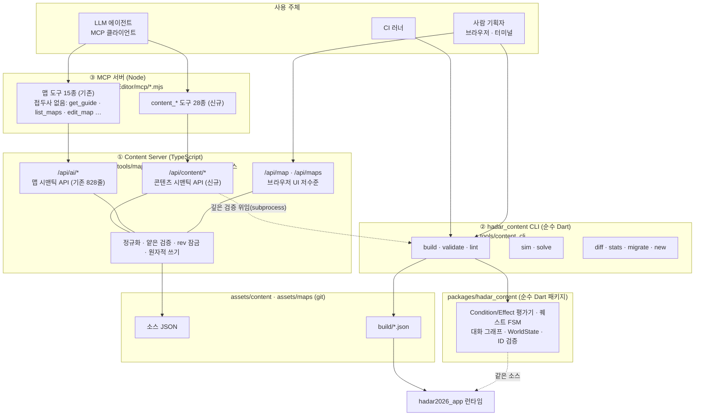

# BP-30 · 툴체인 전체 그림

> `상태: 보류` — **설계는 유효하나 현재 노선에서는 구현하지 않는다.**
> 지금 노선은 원작 방식(플래그 + cm2)의 **sample-first** 다 → [`issues/MILESTONES.md`](../issues/MILESTONES.md).
> 이 장이 필요해지는 신호는 [`issues/MILESTONES.md` §5](../issues/MILESTONES.md) 에 있다. **읽고 바로 구현하지 말 것.**

> **문서 ID**: BP-30 · **상태**: 개정 2판(REVIEW_BP-30 조치 · D-26/D-27 반영) · **선행 문서**: [BP-20](20_target_architecture.md), [BP-21](21_content_pack_spec.md), [BP-26](26_entity_registry_and_anchors.md), [BP-27](27_runtime_engine.md)
> **독자**: 툴체인 구현자 · 생성 하네스 작성자 · CI 담당 · 기획자
> **한 줄 요약**: Content Server(TS) · `hadar_content` CLI(순수 Dart) · MCP 서버 3종의 역할을 가르고, "AI 는 파일을 직접 쓰지 않는다"(D-12)를 4겹으로 강제하며, 순수 Dart CLI 가 콘텐츠 평가기를 공유하는 수단으로 **`packages/hadar_content/` 물리 분리**를 확정한다.

**파이프라인 구획**(D-01): 이 장이 다루는 것은 전부 **Authoring 과 Build** 다.
런타임(③)은 여기 나오는 어떤 툴도 알지 못한다 — 런타임이 아는 것은 `assets/content/build/` 의 세 파일뿐이다.

**개정 이력**

| 판 | 변경 |
|---|---|
| 초판 | 툴 3종 경계 · 사용 주체 매트릭스 · D-12 원칙 4 의 4겹 강제 · Q-20-1 해소(`packages/hadar_content/`) · 디렉토리 배치 · 워크플로 3종 · 부트스트랩 |
| **개정 2판** | **REVIEW_BP-30 조치** — §3.1 이 §3.5·R-30-2 와 모순하던 서술을 해소하고 존재하지 않는 `415` 를 제거(F-30-01) · R-30-15/17 의 CI grep 논리 역전을 기존 `check()` 헬퍼 형태로 교정(F-30-02) · 존재하지 않는 `HADAR_EDITOR_PORT` 를 R-30-26 의 **선행 변경**으로 승격(F-30-03) · "MCP `map_*` 15종" → 실제 이름에 접두사가 없음을 정정(F-30-04) · `cm2_script` pubspec **10줄**(F-30-05) · §4.3 프로브 실험의 재현 절차 고정(F-30-06) · R-30-19 의 근거를 **미검증**으로 강등하고 확인 절차를 붙임(F-30-07) · 코드 인용 줄 번호 5곳 교정. **부록 B-5 반영** — 웹 페이로드 45MB 실측을 §5.3 예산의 기준선으로 넣고 "소스 JSON 제외" 최적화의 실익이 작다는 판단 근거를 명시. **D-26/D-27 반영** — §3.5 의 앵커-타일 정합 행을 하드 게이트에서 **WARN** 으로, §6.2 의 `content_sim` 단계를 **2축 판정** 수신으로 갱신 |

---

## 0. 이 장의 역할과 범위

| 항목 | 내용 |
|---|---|
| 확정하는 것 | 툴 3종의 경계 · 사용 주체 매트릭스 · D-12 원칙 4 강제 수단 · 언어 선택과 코드 공유 수단 · 디렉토리 배치 · pubspec 선언 · 워크플로 3종 · 부트스트랩 |
| 확정하지 않는 것 | 엔드포인트 시그니처(→ [BP-31](31_content_server_api.md)) · 생성 파이프라인 8단계 내부(→ [BP-32](32_generation_harness.md)) · 검증 규칙 본문(→ [BP-33](33_validation_and_lint.md)) · 시뮬레이터 알고리즘(→ [BP-34](34_headless_sim_and_solver.md)) · CI YAML 전문(→ [BP-35](35_ci_and_build.md)) · 맵 에디터 UI(→ [BP-36](36_map_editor_extension.md)) |
| 근거 결정 | D-01, D-02, D-03, D-11, **D-12**, D-13, D-14, D-15 |
| 해소하는 열린 질문 | **Q-20-1**(순수 Dart CLI 의 `domain/content` 공유 수단) — [BP-20 §4.3](20_target_architecture.md) 이 "BP-30 작성 전" 기한으로 넘긴 것 |

**중복 금지 규약** — 아래는 이 장에서 이름만 부르고 정의는 해당 장에 있다.

| 주제 | 정의가 있는 곳 |
|---|---|
| Condition/Effect DSL op·do 집합 | [BP-21 §6](21_content_pack_spec.md) (SSoT) |
| 팩 디렉토리·`pack.json`·ID 문법·문자열 키 | [BP-21 §2~§5](21_content_pack_spec.md) |
| 앵커 kind 별 필드, 정합 규칙, 자동 수복 | [BP-26 §2·§3·§6](26_entity_registry_and_anchors.md) |
| REST/MCP 엔드포인트 명세 | [BP-31](31_content_server_api.md) |
| 린트 규칙 번호·심각도 | [BP-33](33_validation_and_lint.md) |
| `SimDriver`/`QuestSolver` 내부 | [BP-34](34_headless_sim_and_solver.md) |

---

## 1. 툴 3종의 역할 분담

### 1.1 한 장의 그림



### 1.2 3종 비교표

| 축 | ① Content Server | ② `hadar_content` CLI | ③ MCP 서버 |
|---|---|---|---|
| 구현 언어 | TypeScript (Node, Vite 미들웨어) | **순수 Dart** (Flutter 없음) | JavaScript (Node, `@modelcontextprotocol/sdk`) |
| 물리 위치 | `tools/mapEditor/server/content_api.ts` | `tools/content_cli/` | `tools/mapEditor/mcp/content_server.mjs` |
| 실행 형태 | 장기 실행 데몬(`pnpm dev`) | 1회성 프로세스 | stdio 서버(에이전트가 띄움) |
| 상태 | 파일시스템만. 메모리 캐시 없음 | 무상태 | 무상태(HTTP 프록시) |
| 주 책임 | **쓰기**: 정규화·얕은 검증·원자적 저장·rev 잠금 | **판정**: 빌드·의미 검증·시뮬레이션·증명 | **노출**: 위 둘을 도구 스키마로 감쌈 |
| 콘텐츠 DSL 을 평가하는가 | **아니오** (§4.3) | **예** (`packages/hadar_content` import) | 아니오 |
| 게임 규칙(타일 액션·통행)을 아는가 | 예 (`src/rules.ts` 포팅본) | 예 (`hadar_content` 의 앵커 정합 검사) | 아니오 |
| 결정론 요구 | 불필요(쓰기 도구) | **필수**(D-15 재빌드 해시 일치) | 불필요 |
| CI 에서 쓰는가 | 아니오 | **예** | 아니오 |
| 없으면 무엇이 불가능한가 | 사람·AI 의 안전한 편집 | 배포 가능한 번들 생성 | 에이전트의 도구 호출 |

### 1.3 왜 이렇게 나누는가 — 네 가지 축

| # | 축 | 분할이 주는 것 | 합쳤을 때의 손실 |
|---|---|---|---|
| **1** | **평가기 단일 소스** | 콘텐츠 의미 판정은 CLI 한 곳에만 있고, 그 CLI 는 런타임과 **같은 Dart 코드**를 쓴다(D-12 근거) | TS 서버가 Condition 을 스스로 평가하면 평가기가 2벌이 되고, 런타임과 authoring 의 판정이 갈라진다. cm2 의 "미등록 함수는 0 반환"(GROUND_TRUTH §9)과 같은 종류의 조용한 오분기가 재발 |
| **2** | **원자성 경계** | 앵커 이동은 맵 타일 편집과 **한 트랜잭션**이어야 한다(R-26-22/23). 맵 API 와 콘텐츠 API 가 같은 프로세스라 락을 공유할 수 있다 | 서버를 둘로 나누면 두 파일이 각자 저장되고, 중간 상태가 커밋된다 |
| **3** | **실행 수명** | 서버는 사람이 브라우저를 열어 둔 동안 살아 있어야 하고, 빌드는 CI 에서 한 번 돌고 죽어야 한다 | 데몬이 빌드를 겸하면 CI 가 데몬을 띄워야 하고, 데몬 상태가 빌드 결정론에 새어 든다(INV-20-02 위반 위험) |
| **4** | **도구 표면 분리** | 에이전트는 필요한 도구만 등록한다. 맵 작업만 하는 에이전트에 콘텐츠 도구 28종을 얹지 않는다 | 단일 MCP 서버에 41종을 몰면 모든 에이전트의 컨텍스트를 도구 스키마가 잡아먹는다 |

### 1.4 반례 반박 — "하나로 합치면 안 되나?"

| 합치기 안 | 왜 기각인가 |
|---|---|
| **CLI 를 없애고 서버가 다 한다** | 축 1 위반. TS 로 Condition/Effect 평가기를 재구현하면 40개 op/do([BP-21 §6](21_content_pack_spec.md))가 2벌이 되고, 두 구현의 동등성을 증명할 방법이 없다. `chance` 의 시드 유도식([BP-21 §6.5](21_content_pack_spec.md))까지 비트 단위로 일치시켜야 한다 |
| **서버를 없애고 CLI 가 다 한다** | 브라우저 맵 에디터가 이미 서버를 필요로 한다(`vite.config.ts:31` 이 `/api/map`·`/api/ai` 를 서빙). 콘텐츠만 CLI 로 쓰면 앵커-타일 원자성(축 2)이 깨진다 |
| **CLI 를 Dart 대신 TS 로** | D-12 의 존재 이유를 부정. 런타임 평가기 공유가 불가능해진다 |
| **서버를 Dart 로 다시 쓴다** | `tools/mapEditor` 의 실측 자산 폐기(ai_api.ts 828줄 + preview.ts 181 + store.ts 166 + src/ 브라우저 UI 2,000여 줄 + openapi.yaml 1,040줄). 회수 이익 없음 |
| **MCP 서버를 없애고 에이전트가 curl** | 가능은 하다(REST 가 1급). 그러나 MCP 도구 스키마가 없으면 에이전트가 파라미터 형태를 매번 추측한다. 기각의 실질 근거는 **축 4(도구 표면 분리)** — 맵 작업만 하는 에이전트에 콘텐츠 스키마 28종을 얹지 않는다 |

**명명 규약의 비대칭 — 실측 정정(F-30-04)**

기존 MCP 도구의 실제 이름 15종(`mcp/server.mjs` 실측)은 `get_guide`, `list_maps`, `current_map`,
`create_map`, `map_summary`, `read_region`, `edit_map`, `passability`, `validate_map`, `list_events`,
`create_event`, `update_event`, `delete_event`, `preview`, `tile_image` 다.
**`map_` 접두를 가진 것은 `map_summary` 하나뿐**이므로, 신규 `content_*` 만 접두 규약을 갖는 **비대칭**이 생긴다.

- **R-30-30** 이 비대칭을 **그대로 받아들인다.** 기존 15종의 개명은 `.mcp.json` 을 이미 쓰는 사람의
  프롬프트·기록을 전부 깨뜨리는 반면, 얻는 것은 표기 일관성뿐이다. 대신 두 서버가 **별도 프로세스**이므로
  (R-30-29) 도구 목록 자체가 이미 갈려 있어 혼동이 생기지 않는다.
- **R-30-31** 신규 도구는 **예외 없이 `content_` 접두**를 쓴다. 두 서버를 동시에 등록한 에이전트가
  이름만 보고 어느 표면인지 알 수 있어야 한다. 개명 여부의 최종 판단은
  [BP-36 T-36-2](36_map_editor_extension.md)(맵 도구 추가 태스크)와 함께 본다.

- **R-30-1** 콘텐츠 DSL(Condition/Effect/퀘스트 FSM/대화 그래프)의 **평가 구현은 Dart 한 벌뿐**이다. TS·JS 어디에도 두지 않는다.
- **R-30-2** Content Server 는 콘텐츠의 **형태(shape)** 만 본다: JSON 파싱 가능성, 필수 필드 존재, ID 정규식, 파일명-슬러그 일치, 좌표 범위. 의미 검증(참조 해소·도달성·완주 가능성)은 전부 CLI 에 위임한다.
- **R-30-3** MCP 서버는 **HTTP 프록시 이상을 하지 않는다.** 도구 안에서 파일을 직접 읽거나 쓰지 않는다(기존 `mcp/server.mjs` 가 이미 이 규율을 지킨다 — `fs` import 0건).

---

## 2. 누가 무엇을 쓰는가 — 사용 주체 매트릭스

### 2.1 주체 정의

| 주체 | 정의 | 대표 행위 |
|---|---|---|
| **H** 사람 기획자 | 브라우저 에디터 + 터미널을 쓰는 개발자/기획자 | 맵을 그린다, 퀘스트 초안을 손본다, 리뷰한다 |
| **A** AI 에이전트 | MCP 클라이언트를 가진 LLM (D-14 의 2·3·7 단계) | 퀘스트 개요·대화 그래프 생성, 비평 후 수정 |
| **C** CI 러너 | GitHub Actions | 검증·시뮬레이션·재빌드 해시 비교 |
| **G** 게임 런타임 | `hadar2026_app` 실행 프로세스 | `build/` 3파일을 읽어 해석 |

### 2.2 매트릭스

| 인터페이스 | H 사람 | A 에이전트 | C CI | G 런타임 | 용도 |
|---|:---:|:---:|:---:|:---:|---|
| 브라우저 에디터 UI (`http://localhost:5310`) | ✅ 주 | ❌ | ❌ | ❌ | 맵 그리기, 앵커 배치(→[BP-36](36_map_editor_extension.md)) |
| `/api/map`, `/api/maps` (저수준 MV JSON) | 🔸 UI 가 대신 | **❌ 금지** | ❌ | ❌ | 브라우저 UI 전용. 전체 PUT 이라 동시 편집을 지운다(`API_MANUAL.md` 경고) |
| `/api/ai/*` (맵 시맨틱) | 🔸 curl 디버깅 | ✅ 주 | ❌ | ❌ | 타일·이벤트 배치 |
| `/api/content/*` (콘텐츠 시맨틱) | 🔸 curl 디버깅 | ✅ 주 | ❌ | ❌ | 팩·퀘스트·대화·앵커·문자열 CRUD |
| MCP **맵 도구 15종** (현행 이름에는 접두사가 없다) | ❌ | ✅ 주 | ❌ | ❌ | 위 `/api/ai/*` 의 래퍼 |
| MCP `content_*` 도구 28종 | ❌ | ✅ 주 | ❌ | ❌ | 위 `/api/content/*` 의 래퍼 |
| `hadar_content build` | ✅ 커밋 전 | 🔸 서버 경유만 | ✅ 주 | ❌ | 번들 굽기 |
| `hadar_content validate / lint` | ✅ | 🔸 서버 경유만 | ✅ 주 | ❌ | hard/soft 게이트(D-15) |
| `hadar_content sim / solve` | ✅ | 🔸 서버 경유만 | ✅ 주 | ❌ | 완주 증명, 회귀 골든 |
| `hadar_content new / diff / stats / migrate` | ✅ 주 | 🔸 `new` 만 서버 경유 | ❌ | ❌ | 스캐폴딩·영향 분석 |
| 소스 파일 직접 쓰기 (Write/편집기) | ✅ 허용 | **❌ 금지 (§3)** | ❌ | ❌ | — |
| `assets/content/build/*.json` | 🔸 읽기만 | ❌ | ✅ 생성·검사 | ✅ 읽기 | 생성물. 손편집 금지 |

범례: ✅ 주 사용 · 🔸 제한적/예외 · ❌ 사용하지 않음(또는 금지)

- **R-30-4** 사람은 소스 파일을 **직접 편집해도 된다**. 사람의 편집은 git diff·리뷰·CI 게이트를 거치며, 그 게이트가 곧 안전장치다.
- **R-30-5** 에이전트는 소스 파일을 **직접 편집하지 않는다**(D-12 원칙 4). 강제 수단은 §3.
- **R-30-6** `build/` 산출물을 사람이든 에이전트든 손으로 고치면 INV-20-06(재빌드 후 `git diff --exit-code`)이 CI 에서 잡는다.

### 2.3 "이 툴로는 절대 하지 않는 일" 표

| 툴 | 하지 않는 일 | 이유 |
|---|---|---|
| Content Server | Condition 평가, 퀘스트 완주 판정, 번들 굽기 | R-30-1/2 |
| Content Server | 인증·권한 | localhost 전용 dev 도구 전제(`README.md` "주의") |
| CLI | 파일 감시·데몬화 | 축 3. 결정론 오염 |
| CLI | LLM 호출 | D-01 ② 구획 금지 |
| MCP | 파일 I/O, 서버 없이 동작 | R-30-3. 서버 미기동 시 명시적 실패(기존 `mcp/server.mjs:20-23` 의 안내 메시지 패턴 계승) |
| 런타임 | 소스 JSON 읽기, HTTP | D-01 ③ 구획. INV-20-07 |

---

## 3. "AI 는 파일을 직접 쓰지 않는다"(D-12 원칙 4)의 강제

### 3.1 왜 막는가

| # | 파일 직접 쓰기가 깨뜨리는 것 | 구체 사례 |
|---|---|---|
| **1** | **정규화** | [BP-21 §8](21_content_pack_spec.md)의 포맷 규약(UTF-8/LF/2-space/키 정렬/`id`·`type`·`pack` 선두/부동소수 금지)을 매 쓰기마다 지켜야 한다. LLM 이 손으로 지킬 수 있는 규약이 아니다 → 재빌드 해시 불일치(INV-20-02) |
| **2** | **쓰기 시점 검증** | 파일에 직접 쓰면 **아무 검사도 받지 않은 것**이 디스크에 남는다. API 를 쓰면 **형태(shape) 위반은 서버가 즉시 400 으로 막고**(ID 정규식·필수 필드·파일명-슬러그 일치·좌표 범위, R-30-2), **DSL op 오류는 CLI `validate` 가 잡는다**(§3.5). 어느 쪽이든 파일 직접 쓰기보다 **발견이 빠르고**, 서버 400 의 `hint` 는 그대로 재전송할 수 있는 요청을 준다 |
| **3** | **원자성** | 앵커 이동은 `anchors/TOWN1.json` + `maps/TOWN1.json` 두 파일을 함께 고쳐야 한다(R-26-22). 두 번의 Write 는 중간 상태를 남긴다 |
| **4** | **되돌리기** | 서버는 쓰기 전 원본을 in-memory 로 들고 있다가 검증 실패 시 디스크를 건드리지 않는다(기존 맵 API 와 동일 구조 — `ai_api.ts:666-680` 의 `applyOps` 가 던지면 `writeMapFile` 에 도달하지 않는다) |
| **5** | **파생 상태 갱신** | 앵커를 추가하면 트리거 인덱스가 낡는다. API 는 쓰기와 함께 "재빌드 필요" 를 응답에 실어 보낸다 |
| **6** | **감사 가능성** | `pack.json#generatedBy`([BP-21 §3.2](21_content_pack_spec.md))와 `_note` 기록이 API 경유 쓰기에서만 자동으로 붙는다 |

### 3.2 4겹 방어

원칙은 "권한으로 막고, 못 막으면 게이트로 잡는다" 이다. 단일 수단에 의존하지 않는다.


| 겹 | 수단 | 잡는 것 | 못 잡는 것 |
|---|---|---|---|
| **1** | 에이전트 하네스 권한 설정(`.claude/settings.json` 의 `permissions.deny`) | 도구 레벨에서 경로 차단 | 다른 하네스·툴을 쓰는 에이전트, `Bash` 로 우회하는 쓰기 |
| **2** | `.githooks/pre-commit` | 커밋 직전 비정규 파일 | 훅 미설치 환경, `--no-verify` |
| **3** | CI: `hadar_content build --check-format` | 포맷 규약 위반 전량(R-21-44/45) | 포맷은 맞지만 의미가 틀린 것 |
| **4** | CI: 재빌드 후 `git diff --exit-code assets/content/build/` | 손편집된 산출물, 빌드 누락 | — |

- **R-30-7** 1겹은 **편의**이고 2~4겹은 **계약**이다. 1겹이 없는 환경(다른 IDE·다른 에이전트)에서도 2~4겹만으로 안전해야 한다.

**1겹 — 권한 규칙 예시**

```jsonc
// .claude/settings.json (프로젝트)
{
  "permissions": {
    "deny": [
      "Write(hadar2026_app/assets/content/**)",
      "Edit(hadar2026_app/assets/content/**)",
      "Write(hadar2026_app/assets/maps/**)",
      "Edit(hadar2026_app/assets/maps/**)"
    ]
  }
}
```

- **R-30-8** 위 deny 는 `assets/content/**` 와 `assets/maps/**` 두 트리만 막는다. `blueprint/`·`lib/`·`tools/` 는 막지 않는다 — 코드와 기획서는 에이전트가 직접 써도 되는 대상이다.

### 3.3 2겹 — pre-commit 훅

```bash
#!/usr/bin/env bash
# .githooks/pre-commit  ·  설치: git config core.hooksPath .githooks
set -euo pipefail

staged="$(git diff --cached --name-only --diff-filter=ACM)"

content_files="$(echo "$staged" | grep -E '^hadar2026_app/assets/content/.*\.json$' || true)"
build_files="$(echo "$staged"   | grep -E '^hadar2026_app/assets/content/build/.*\.json$' || true)"

if [ -n "$content_files" ]; then
  # (a) 포맷·형태 규약 (BP-21 §8). 위반 파일과 고치는 명령을 함께 출력한다.
  dart run tools/content_cli/bin/hadar_content.dart build --check-format \
    || { echo "✖ 콘텐츠 포맷 규약 위반. 고치기: hadar_content build --fix-format"; exit 1; }

  # (b) 산출물이 소스와 함께 갱신됐는지 (INV-20-06 을 커밋 시점으로 앞당김)
  if [ -z "$build_files" ] && echo "$content_files" | grep -qv '/build/'; then
    echo "✖ 소스는 바뀌었는데 assets/content/build/ 가 스테이지에 없음."
    echo "  실행: hadar_content build && git add hadar2026_app/assets/content/build"
    exit 1
  fi
fi
exit 0
```

- **R-30-8a** (S-30-01) `--check-format` / `--fix-format` **플래그의 정본 정의는 CLI**(이 장 §5.1 의
  `tools/content_cli/lib/format.dart`)다. [BP-31 §2.7](31_content_server_api.md) 의 `checkFormat`/`fixFormat`
  본문 필드는 그 플래그로 번역되는 **서버 측 래퍼**이며, 두 이름이 갈리면 CLI 가 이긴다.
  정규화 규약 자체의 소유는 [BP-21 §8](21_content_pack_spec.md) 이다(D-18).
- **R-30-9** 훅은 `hadar_content` 를 **`dart run` 으로 직접** 호출한다. `pub global activate` 여부에 의존하지 않는다(설치 편차 제거).
- **R-30-10** 훅은 `validate`/`sim` 을 **돌리지 않는다**. 커밋을 수 초 이상 붙잡으면 사람들이 `--no-verify` 를 습관화한다. 무거운 검사는 CI(4겹)의 몫이다.

### 3.4 3·4겹 — CI 게이트

| 게이트 | 명령 | 대응 불변식 |
|---|---|---|
| 포맷 | `hadar_content build --check-format` | R-21-44/45 |
| 재빌드 결정론 | `hadar_content build && sha256sum …` ×2 비교 | INV-20-02 |
| 산출물 동기 | `hadar_content build && git diff --exit-code assets/content/build/` | INV-20-06 |
| 의미 검증 | `hadar_content validate` | INV-20-10 ~ 12, 17 |
| 완주 증명 | `hadar_content sim --all && hadar_content solve --all` | INV-20-13 |

YAML 전문은 [BP-35](35_ci_and_build.md) 소관이다. 이 장은 **명령의 존재와 순서**만 확정한다.

### 3.5 막지 못하는 경우 — 에이전트가 Write 툴을 가졌을 때

권한 설정은 **하네스마다 다르고, 하네스가 바뀌면 사라진다.** 그러므로 다음을 전제로 설계한다.

| 상황 | 관측되는 증상 | 어느 겹이 잡는가 | 복구 절차 |
|---|---|---|---|
| 에이전트가 `quests/x.json` 을 손으로 씀 (포맷 어긋남) | 키 정렬·들여쓰기 위반 | 2겹(로컬) 또는 3겹(CI) | `hadar_content build --fix-format` 후 재커밋 |
| 포맷은 맞지만 없는 op 사용 | `"op":"has_flag"` | 4겹 `validate` | 에러의 `hint` 가 허용 op 목록을 준다 → 수정 |
| 소스만 고치고 `build/` 미갱신 | 산출물 불일치 | 2겹(b) 또는 4겹 | `hadar_content build && git add` |
| `build/` 산출물을 손으로 고침 | 재빌드 diff 발생 | 4겹 | `git checkout` 후 재빌드 |
| 앵커만 쓰고 타일을 안 놓음 | **도달 불가 앵커 경고**(WARN, D-27) | 4겹 `lint` — 하드 게이트가 아니다 | `POST /api/content/anchors/{id}/move` 로 옮기거나 권장 타일을 놓는다([BP-26 §3.3](26_entity_registry_and_anchors.md)) |
| 앵커가 경유하는 퀘스트가 완주 불가해짐 | 솔버 `REFUTED` | 4겹 `solve` — **하드 게이트** | 도달 가능한 좌표로 앵커를 옮긴다([BP-26 R-26-7b](26_entity_registry_and_anchors.md) 의 2단 구조) |
| `--no-verify` + CI 미실행 브랜치 | 없음 | **못 잡음** | PR 필수화(브랜치 보호)로만 방어 |

- **R-30-2a** (F-30-01) §3.1 의 2번을 오해하지 말 것 — **Content Server 는 Condition/Effect DSL 의 op 이름을 검사하지 않는다.** `"op":"has_flag"` 같은 **DSL** op 오류는 R-30-1(평가기 Dart 한 벌)에 따라 서버가 알 수 없고, `hadar_content validate`(4겹)가 잡는다(§3.5 표 2행). 서버가 즉시 거부하는 `unknown_op` 은 **배치 편집 op**(`create_entity` 등, [BP-31 §3.2](31_content_server_api.md))에 한하며 상태 코드는 **400** 이다([BP-31 §5.1](31_content_server_api.md)). 이 API 어디에도 `415 Unsupported Media Type` 은 없다.
- **R-30-11** 모든 게이트 실패 메시지는 **그대로 실행 가능한 복구 명령**을 포함한다. 기존 맵 API 의 `{error, hint}` 규약(`server/util.ts:10-13`)과 같은 철학을 CLI·훅·CI 로 확장한다.
- **R-30-12** 게이트가 잡은 위반은 "에이전트를 나무라는" 것이 아니라 **정규화로 흡수**한다. `--fix-format`·`validate --fix`(R-26-28)가 존재하는 이유다. 사람 손이 필요한 것은 의미 오류뿐이어야 한다.
- **RK-30-1** 브랜치 보호가 없으면 4겹 전체가 무력화된다. `main` 직접 push 금지는 이 툴체인의 **전제 조건**이며 [BP-52](52_risks.md) 의 리스크로 등록한다.

### 3.6 예외 절차 — 서버가 못 쓰는 편집

API 가 표현하지 못하는 편집(대규모 구조 개편, 스키마 승격 등)은 사람이 직접 한다.

1. 사람이 손으로 편집한다(에이전트가 아니라 **사람**).
2. `hadar_content build --fix-format` 로 정규화한다.
3. `hadar_content validate` 를 통과시킨다.
4. 같은 편집이 반복되면 **API 에 op 를 추가**한다([BP-31 §3](31_content_server_api.md)). 예외가 상시화되면 원칙이 죽는다.

---

## 4. 언어 선택 근거와 코드 공유 문제

### 4.1 서버가 TypeScript 인 이유

| 근거 | 실측 |
|---|---|
| 재사용 자산이 크다 | `server/ai_api.ts` 828줄, `server/preview.ts` 181줄, `server/store.ts` 166줄, `server/util.ts` 27줄, 브라우저 `src/` 10파일, `openapi.yaml` 1,040줄 |
| 게임 규칙 포팅본이 이미 있다 | `src/rules.ts` 의 `tileAction`/`objectAction`/`unitAction` 이 `HDTileProperties` 를 그대로 옮겨 놓았고 브라우저와 Node 가 **공유**한다 |
| 앵커-타일 원자성이 같은 프로세스를 요구한다 | R-26-23 |
| 브라우저 UI 가 이 서버 위에 있다 | `vite.config.ts:130-138` 의 플러그인 반환 객체 — `configureServer`(`:132`)/`configurePreviewServer`(`:135`) 가 같은 `handler` 를 공유 |
| 미리보기 PNG 파이프라인이 있다 | `pngjs` 기반 `renderPreview` — 퀘스트/대화 그래프 PNG([BP-31 §2](31_content_server_api.md))가 같은 경로를 탄다 |

### 4.2 CLI 가 Dart 인 이유 (D-12)

authoring 시 "이 조건이 참인가" 와 런타임의 "이 조건이 참인가" 가 **비트 단위로 같아야** 한다. 같게 만드는 유일하게 신뢰할 수 있는 방법은 **같은 코드를 돌리는 것**이다. 그러려면 CLI 가 Dart 여야 한다.

이 요구가 만드는 제약이 §4.3 의 문제다.

### 4.3 문제 — `domain/content/` 를 순수 Dart CLI 가 import 할 수 없다

**주장이 아니라 실측이다.** 임시 순수 Dart 패키지가 `hadar2026_app` 을 path 의존으로 가리키게 하고 `dart pub get` 을 돌린 결과:

```yaml
# tools/probe_transitive_flutter/pubspec.yaml   (재현용. 레포에 커밋하지 않는다)
name: probe_cli
publish_to: none
environment: { sdk: ^3.10.0 }
dependencies:
  hadar2026_app: { path: ../../hadar2026_app }
```

- **R-30-12a** (F-30-06) 이 실측은 R-30-13(패키지 물리 분리)이라는 큰 결정을 혼자 지탱하므로
  **재현 절차를 문서에 남긴다.** 프로브 디렉토리는 레포에 커밋하지 않는다(빌드 대상이 아니고,
  `pubspec.lock` 이 두 벌 생기면 CI 캐시가 오염된다).

```bash
# 재현: 3단계, 30초
mkdir -p tools/probe_transitive_flutter && cd tools/probe_transitive_flutter
cat > pubspec.yaml <<'EOF'
name: probe_cli
publish_to: none
environment: { sdk: ^3.10.0 }
dependencies:
  hadar2026_app: { path: ../../hadar2026_app }
EOF
dart pub get
grep -A1 -E "^  flutter:|^sdks:" pubspec.lock     # flutter 0.0.0 from sdk / sdks.flutter 제약
grep -A2 "^  flame:"            pubspec.lock      # 앱의 1.35.1 이 아니라 상위 버전이 잡힌다
cd - && rm -rf tools/probe_transitive_flutter
```

| 관측 | 결과 | 파급 |
|---|---|---|
| `flutter` SDK 의존이 **전이(transitive)** 로 딸려온다 | `pubspec.lock` 에 `flutter 0.0.0 from sdk`, `flutter_web_plugins 0.0.0 from sdk` | Dart SDK 만 설치된 환경(= 기존 `cm2_script` CI 잡의 `dart-lang/setup-dart@v1`)에서는 해소 불가 |
| lock 의 SDK 제약이 Flutter 를 요구한다 | `sdks: { dart: ">=3.11.0 <4.0.0", flutter: ">=3.41.0" }` | "순수 Dart CLI" 라는 정의 자체가 성립하지 않음 |
| **`dependency_overrides` 가 무시된다** | 앱은 flame **1.35.1**(`hadar2026_app/pubspec.lock`, `dependency: "direct overridden"`), 프로브는 flame **1.38.2** | `dependency_overrides` 는 **루트 패키지에만** 적용된다. CLAUDE.md 가 금지한 flame 승격이 CLI 쪽에서 조용히 일어난다 |
| bonfire·flame·archive·shared_preferences 등이 전부 딸려온다 | 프로브 lock 에 40여 패키지 | CLI 실행 시간·설치 시간 증가, CI 캐시 오염 |

추가로 [BP-27 §1.4](27_runtime_engine.md) 는 `domain/content/*.dart` 의 허용 import 에 `package:flutter/foundation.dart`(`@immutable`, `kDebugMode`)를 포함하고 있는데, 이는 [BP-20 R-20-2 / INV-20-04](20_target_architecture.md)("`domain/content/` 는 Flutter 를 **전혀** import 하지 않는다")와 충돌한다. 이 장이 §4.6 에서 해소한다.

### 4.4 해결안 3가지 비교

| 안 | 방법 | 장점 | 단점 | 판정 |
|---|---|---|---|---|
| **A. 별도 순수 Dart 패키지로 분리** | `packages/hadar_content/` 를 만들고 모델·평가기를 여기에 둔다. `hadar2026_app` 은 path 의존으로 소비. `tools/content_cli` 도 path 의존으로 소비 | 두 소비자가 **같은 소스 파일**을 본다(D-12 충족). `dependency_overrides` 오염 없음. Flutter 없이 `dart pub get`/`dart test` 가능. **선례가 있다** — `packages/cm2_script`(pubspec **10줄**, `dev_dependencies: test` 하나, Flutter 무의존)가 정확히 이 형태로 이미 앱과 CLI 데모(`cm2_script_sample`) 양쪽에 쓰인다 | `lib/domain/content/` 라는 D-11 의 배치 문구와 물리 위치가 달라진다(§4.5 가 해소). 패키지가 하나 늘어난다 | **채택** |
| **B. `foundation` 의존만 제거하고 `lib/domain/content/` 유지** | `@immutable`→`package:meta`, `kDebugMode`→자체 const 로 바꾼다 | 파일 이동 0. D-11 문구 그대로 | **문제를 해결하지 못한다.** import 를 지워도 CLI 가 `hadar2026_app` 을 의존하는 순간 `flutter: sdk` 가 전이로 딸려온다(§4.3 실측). 소스 복사로 우회하면 두 벌이 되어 D-12 가 무너진다 | 기각(단독으로는) |
| **C. CLI 를 `flutter test` 러너로 구동** | CLI 진입점을 `flutter test` 가 실행하는 테스트로 위장하거나 `flutter pub run` 사용 | 코드 이동 0 | CLI 가 Flutter SDK 를 요구 → CI 콘텐츠 잡이 Flutter 설치를 강제(현 `cm2_script` 잡의 2배 이상 셋업 시간). 종료 코드·stdout·인자 전달이 러너에 종속되어 파이프 조합이 불가능. `sim` 이 테스트 프레임 안에서 돌면 트레이스 출력이 오염된다 | 기각 |

### 4.5 권고 확정 — 안 A + 안 B 의 위생 규칙

- **R-30-13 (권고안 확정)** 콘텐츠 코어는 **`packages/hadar_content/`** 라는 **순수 Dart 패키지**로 둔다. `packages/cm2_script` 와 같은 형태·같은 CI 잡 형태를 따른다.
- **R-30-14** `hadar2026_app/lib/domain/content/` 는 **얇은 re-export 배럴만** 남긴다. D-11 이 정한 파일 이름과 경로가 그대로 유지되므로, BP-21~28 이 인용한 `lib/domain/content/condition.dart` 같은 경로 참조가 전부 유효하다.

```dart
// hadar2026_app/lib/domain/content/condition.dart  (배럴, 1줄)
export 'package:hadar_content/condition.dart';
```

- **R-30-15** 배럴 파일은 **`export` 문 외의 코드를 담지 않는다.** 로직이 배럴에 생기면 두 벌이 시작된다. CI 로 고정하되, **기존 `ci.yml:52-64` 의 `check()` 헬퍼를 그대로 재사용한다**(D-23 이 정본으로 지정한 형태):

```bash
# lib/domain/content/ 의 모든 줄은 export 문이거나 주석이거나 빈 줄이어야 한다
check "domain/content must contain only re-exports" \
  -v -E "^[[:space:]]*(//|export |$)"
```

> **왜 `grep … && exit 1` 이 아닌가**(F-30-02). GitHub Actions 의 `run:` 블록은 **마지막 명령의 종료 코드**가
> 스텝 결과다. 위반이 **없으면** `grep` 이 1을 반환하고 `&&` 가 단락되어 `exit 1` 이 실행되지 않으므로
> **스크립트 종료 코드가 grep 의 1** 이 되어 정상 상태에서 CI 가 빨개진다. 위반이 **있으면** grep 이 0 →
> `exit 1` → 실패. 즉 **항상 실패**한다. 기존 `check()` 는 `hits="$(grep … || true)"` 후 `[ -n "$hits" ]` 로
> 판정해 정확히 이 함정을 피한다. `\s` 는 GNU grep 확장이므로 POSIX 문자 클래스를 쓴다.

- **R-30-16** 안 B 의 위생 규칙을 **`packages/hadar_content/` 에 적용**한다(§4.6). 그래야 패키지가 Flutter 를 전혀 모르는 상태로 유지되고, INV-20-04 가 배럴이 아니라 실체를 검사하게 된다.
- **R-30-17** INV-20-04 의 검사 대상에 `packages/hadar_content/lib/` 를 추가한다. `check()` 는 현재
  `lib/application/ lib/domain/` 을 하드코딩하고 있으므로, **검사 대상 경로를 인자로 받도록 1줄 일반화**한
  뒤 같은 형태로 호출한다(YAML 전문은 [BP-35](35_ci_and_build.md) 소관):

```bash
check_in "packages/hadar_content/lib/" \
  "content core must not import Flutter" -E "package:flutter"
```

  두 검사(R-30-15/17)는 **정상 상태에서 `ok: …` 를 출력하고 종료 코드 0** 이어야 한다. 그것이 이 형태를
  쓰는 유일한 이유다.

### 4.6 `flutter/foundation` 대체표

| 쓰던 것 | 무엇에 | 대체 | 비고 |
|---|---|---|---|
| `@immutable` | 모델 클래스 불변 표시 | `package:meta` 의 `@immutable` | `meta` 는 순수 Dart 패키지. `foundation` 이 재수출하던 원본이 바로 이것이다 |
| `@protected`, `@visibleForTesting` | 동일 | `package:meta` | 동일 |
| `kDebugMode` | 디버그 전용 로그 | `const bool kDebugMode = !bool.fromEnvironment('dart.vm.product');` | `packages/hadar_content/lib/src/build_mode.dart` 에 정의 |
| `kIsWeb` | 웹 분기 | **쓰지 않는다** | 콘텐츠 코어는 플랫폼을 몰라야 한다. 웹 분기가 필요하면 `application/` 으로 올린다 |
| `ChangeNotifier` | 변경 통지 | **쓰지 않는다** | D-11 이 이미 "`ChangeNotifier` 가 필요하면 `application/content/` 로 올린다"(R-20-2)를 정했다 |
| `debugPrint` | 로깅 | 호출부가 주입하는 `void Function(String)? log` | 코어는 stdout 을 소유하지 않는다. CLI 는 콘솔로, 런타임은 `UiHost` 로 보낸다 |

```yaml
# packages/hadar_content/pubspec.yaml  (cm2_script 와 같은 최소 형태)
name: hadar_content
description: Pure-Dart content core — Condition/Effect DSL, quest FSM, dialogue graph, WorldState.
version: 0.1.0
publish_to: none

environment:
  sdk: ^3.10.0

dependencies:
  meta: ^1.15.0

dev_dependencies:
  test: ^1.24.0
```

### 4.7 이관 절차와 되돌림

| 단계 | 작업 | 검증 |
|---|---|---|
| 1 | `packages/hadar_content/` 생성, `pubspec.yaml` + `analysis_options.yaml` | `dart pub get` (Flutter 없이) 성공 |
| 2 | D-11 의 13개 파일을 `packages/hadar_content/lib/` 에 작성 | `dart analyze`(warning fatal) + `dart test` |
| 3 | `hadar2026_app/lib/domain/content/` 에 배럴 13개 생성 | R-30-15 grep |
| 4 | `hadar2026_app/pubspec.yaml` 에 path 의존 추가(§5.2) | `flutter pub get`, `flutter analyze` |
| 5 | `tools/content_cli/pubspec.yaml` 에 path 의존 추가 | `dart pub get` 후 `dart run bin/hadar_content.dart --version` |
| 6 | CI 에 `hadar_content` 잡 추가(`cm2_script` 잡 복제) | 녹색 |

- **RK-30-2 / 되돌림**: 안 A 가 실패하는 유일한 시나리오는 "코어가 결국 Flutter 를 필요로 함" 이다. 그 경우 배럴을 실체로 되돌리고(파일 이동 역방향) CLI 를 안 C 로 전환한다. 배럴이 `export` 뿐이므로 이동은 기계적이며, 다른 장의 경로 인용은 영향받지 않는다.

---

## 5. 디렉토리 배치 확정

### 5.1 트리

```
SMG_hadar2026/
├── packages/
│   ├── cm2_script/                     # 기존. 순수 Dart 선례
│   └── hadar_content/                  # ★ 신규 · 순수 Dart 콘텐츠 코어 (R-30-13)
│       ├── pubspec.yaml
│       ├── analysis_options.yaml
│       ├── lib/
│       │   ├── hadar_content.dart      # 공개 배럴 (전 타입 re-export)
│       │   ├── content_ids.dart  condition.dart  effect.dart
│       │   ├── quest.dart  stage.dart  objective.dart
│       │   ├── dialogue.dart  node.dart  choice.dart
│       │   ├── actor.dart  item.dart  place.dart  anchor.dart
│       │   ├── world_state.dart  world_event.dart  world_rng.dart  strings.dart
│       │   └── src/build_mode.dart     # kDebugMode 대체 (§4.6)
│       └── test/                       # 평가기 단위 테스트
│
├── tools/
│   ├── content_cli/                    # ★ 신규 · hadar_content CLI
│   │   ├── pubspec.yaml
│   │   ├── bin/hadar_content.dart      # 진입점 (서브커맨드 디스패치)
│   │   ├── lib/
│   │   │   ├── commands/               # build validate lint sim solve diff stats migrate new
│   │   │   ├── loader.dart             # 소스 트리 → 메모리 모델 (dart:io 사용 O)
│   │   │   ├── emitter.dart            # bundle / index / lock 직렬화 (결정론)
│   │   │   ├── format.dart             # BP-21 §8 정규화 (--check-format / --fix-format)
│   │   │   └── headless/               # SimDriver · QuestSolver (→ BP-34)
│   │   └── test/
│   │
│   ├── content_gen/                    # ★ 신규 · 생성 하네스 (소유: BP-32 §32.2.3)
│   │   ├── prompts/                    #   프롬프트 파일 (버전 태그, → BP-37)
│   │   └── runs/                       #   실행 기록. 이 장의 툴 3종은 여기를 읽지 않는다
│   │
│   └── mapEditor/                      # 기존 · 확장 대상 (→ BP-36)
│       ├── vite.config.ts              # ★ handleContentApi 라우팅 1줄 추가
│       ├── server/
│       │   ├── ai_api.ts               # 기존 828줄 · 무변경
│       │   ├── store.ts preview.ts util.ts   # 기존 · util/StoreError 재사용
│       │   ├── content_api.ts          # ★ 신규 · /api/content/* 라우터
│       │   ├── content_store.ts        # ★ 신규 · 팩 파일 IO + rev + 정규화 쓰기
│       │   ├── content_ops.ts          # ★ 신규 · 배치 op 적용기 (BP-31 §3)
│       │   ├── content_cli.ts          # ★ 신규 · CLI subprocess 위임 래퍼
│       │   └── graph_png.ts            # ★ 신규 · 퀘스트/대화 그래프 PNG
│       ├── CONTENT_AI_GUIDE.md         # ★ 신규 · GET /api/content 가 반환 (BP-31 §7)
│       ├── mcp/
│       │   ├── server.mjs              # 기존 259줄 · 맵 도구 15종(접두사 없음) · 무변경
│       │   ├── lib/http.mjs            # ★ api()/apiPng() 공용 추출
│       │   └── content_server.mjs      # ★ 신규 · content_* 28종
│       └── src/                        # 브라우저 UI (→ BP-36 이 앵커 편집 추가)
│
└── hadar2026_app/
    ├── pubspec.yaml                    # ★ path 의존 + assets 선언 추가 (§5.2, §5.3)
    ├── lib/domain/content/             # 배럴 13개 (R-30-14)
    ├── lib/application/content/         # D-11 그대로 (실체 코드)
    └── assets/content/                  # BP-21 §2.1 레이아웃
        ├── core/ …  gen_ep1/ …
        └── build/  content.bundle.json  content.index.json  content.lock.json
```

### 5.2 `hadar2026_app/pubspec.yaml` — path dependency 추가안

`cm2_script` 가 이미 같은 형태로 들어가 있다(`pubspec.yaml:40-41`). 그 바로 아래에 붙인다.

```yaml
dependencies:
  flutter:
    sdk: flutter

  cupertino_icons: ^1.0.8
  bonfire: 3.16.1 # pinned: 3.17.x is incompatible with flame 1.35.1 (RenderGameWidget signature)
  window_manager: ^0.5.1
  shared_preferences: ^2.5.4
  cm2_script:
    path: ../packages/cm2_script
  hadar_content:              # ← 추가. 순수 Dart 콘텐츠 코어 (BP-30 R-30-13)
    path: ../packages/hadar_content
```

`tools/content_cli/pubspec.yaml` 쪽:

```yaml
name: hadar_content_cli
description: Authoring/build CLI for Hadar content packs.
publish_to: none
environment:
  sdk: ^3.10.0
dependencies:
  hadar_content:
    path: ../../packages/hadar_content
  args: ^2.5.0
  crypto: ^3.0.0            # content.lock.json 의 SHA-256
dev_dependencies:
  test: ^1.24.0
executables:
  hadar_content: hadar_content     # dart pub global activate 시 명령 이름
```

- **R-30-18** CLI 는 `hadar2026_app` 을 **의존하지 않는다.** 의존하는 순간 §4.3 의 전이 문제가 재발한다. CI grep 으로 고정:
  `grep -n "hadar2026_app" tools/content_cli/pubspec.yaml` 이 빈 결과여야 한다.

### 5.3 `flutter.assets` 최종안 — 부록 A-4(비재귀) 반영

Flutter 의 디렉토리 에셋 선언은 **하위 디렉토리를 포함하지 않는다**(부록 A-4). 현재 선언은 `assets/`, `assets/images/`, `assets/maps/`, `assets/fonts/` 4개(`pubspec.yaml:65-69`)다.

[BP-20 R-20-7](20_target_architecture.md)이 "**`assets/content/build/` 만 등록한다**" 를 확정했으므로, 비재귀 성질은 **부담이 아니라 이득**이다 — 소스 트리를 선언하지 않는 것만으로 웹 페이로드에서 자동으로 빠진다.

**비재귀가 비용이 되는 경우도 같은 성질에서 나온다.** D-03 의 `assets/content/**` 를 **전부** 실어야 하는
상황(예: 소스도 런타임이 읽어야 하는 디버그 빌드)이 오면 `core/quests/`·`core/dialogue/`·`core/strings/`·
`gen_ep1/…` 처럼 **하위 디렉토리를 하나하나 열거**해야 한다. 팩이 3개면 선언이 20줄을 넘는다.
이것이 R-20-7("`build/` 만 등록")을 **비용 회피가 아니라 설계 선택**으로 만드는 근거다(→ Q-30-1).

```yaml
flutter:
  uses-material-design: true

  assets:
    - assets/                      # 기존: startup.cm2, const.cm2, books.json 등
    - assets/images/               # 기존
    - assets/maps/                 # 기존
    - assets/fonts/                # 기존
    - assets/content/build/        # ★ 추가: 이 한 줄이 전부.
                                   #   content.bundle.json / content.index.json / content.lock.json
                                   #   assets/content/core/** 등 소스는 의도적으로 미등록 (R-20-7)
```

| 검증 항목 | 방법 | 기대 |
|---|---|---|
| 소스가 번들에 실리지 않음 | `flutter build web` 후 `grep -c "content/core" build/web/assets/AssetManifest.json` | `0` |
| 산출물 3개가 실림 | 같은 파일에서 `content/build/content.bundle.json` 검색 | 존재 |
| 페이로드 증가분 | `du -sh build/web/assets` 를 도입 전후 비교 | ≤ +600 KB([BP-20 §8.2](20_target_architecture.md)) = 현행 게임 자산 **9.7MB 대비 +6%** |
| `build/` 3파일이 비어 있지 않음 | `ls -l hadar2026_app/assets/content/build/` | R-30-19 의 선행 조건 |

**기준선 — 부록 B-5 실측**(2026-08-30, `flutter build web --release`)

| 구성 | 크기 | 이 장에 주는 함의 |
|---|---|---|
| `canvaskit/` | **31MB** | 전체의 2/3. 콘텐츠 팩이 무엇을 하든 이 수치를 못 이긴다 |
| `assets/assets/` | **9.7MB** | 게임 자산(맵 1.2MB + 이미지 1.3MB + cm2 등). `+600KB` 예산의 분모 |
| `assets/NOTICES` | 1.3MB | 라이선스 |
| 나머지 | ~3MB | JS/폰트/셰이더 |
| **총** | **45MB** | — |

- **R-30-19a** (부록 B-5) **"소스 JSON 을 웹 페이로드에서 뺀다" 는 것을 최적화의 근거로 삼지 않는다.**
  총 45MB 중 canvaskit 이 31MB 인 구조에서, 소스 트리가 수 MB 가 아니라면 제외의 실익은 측정 한계에 가깝다.
  R-20-7 의 진짜 근거는 **용량이 아니라 D-01 ③ 구획**이다 — 런타임은 소스 JSON 을 **읽을 자격이 없다**
  (INV-20-07). 용량은 부수 효과일 뿐이며, 그렇게 적어야 나중에 "몇 KB 아끼려고 이 제약을 두었나" 라는
  잘못된 재검토를 부르지 않는다.

- **R-30-19** `assets/content/build/` 선언은 **그 디렉토리에 파일이 최소 1개 존재한 뒤에** 추가한다. 순서: `hadar_content build` 로 3파일 생성 → 커밋 → pubspec 수정.
  - **근거는 아직 실측되지 않았다**(F-30-07). "Flutter 는 비어 있거나 없는 에셋 디렉토리 선언을 빌드 에러로
    처리한다" 는 이 장의 유일한 **미검증 주장**이며, 다른 실측 주장과 달리 파일:줄이나 명령 결과가 없다.
  - **확인 절차(T-30-1)**: 빈 `hadar2026_app/assets/content/build/` 를 만들고 pubspec 에 선언을 추가한 뒤
    `flutter pub get && flutter build web --release` 를 1회 돌려 결과를 이 항목의 각주로 남긴다.
    에러가 아니라 **경고**이거나 조용히 통과하면 순서 규약을 "권고" 로 강등한다.
  - 어느 쪽이든 **위 순서를 지키면 안전하다.** 순서 규약은 이 명제가 참일 때만 필요하고,
    거짓이어도 해가 없으므로 검증 전까지 유지한다(부록 B-4 의 교훈: 추정을 실측으로 검증할 것).
- **R-30-20** 소스를 읽어야 하는 쪽(CLI·서버·데스크톱 개발 편의)은 **에셋 번들이 아니라 파일시스템**으로 읽는다. 데스크톱에서 `HDBundleAssetSource` 가 "디스크 파일 우선, 없으면 `rootBundle`" 로 동작하므로(CLAUDE.md), 개발 중에는 `assets/content/build/` 를 재빌드하면 앱 재빌드 없이 반영된다 — 맵 에디터가 맵 JSON 에서 이미 누리는 것과 같은 성질이다.
- **Q-30-1** 팩이 늘어 `build/` 를 팩별로 쪼개면([BP-20 Q-20-5](20_target_architecture.md)) 선언도 하위 디렉토리마다 늘려야 한다. 비재귀 선언이 그때는 비용이 된다 — 그 시점에 `assets/content/build/<pack>/` 를 열거하는 생성 스크립트를 둘지 결정한다.

---

## 6. 개발자 워크플로 3종

### 6.1 (a) 사람이 손으로 퀘스트 하나 만들기

```bash
# ── 0) 서버 기동 (터미널 1, 계속 띄워 둠)
cd tools/mapEditor
pnpm install                      # 최초 1회
pnpm dev                          # http://localhost:5310

# ── 1) 스캐폴딩 (터미널 2)
cd /path/to/SMG_hadar2026
dart run tools/content_cli/bin/hadar_content.dart new quest \
  --pack gen_ep1 --slug missing_scholar --giver npc.core.lore_gate_guard
# → assets/content/gen_ep1/quests/missing_scholar.json   (stage 1개, objective 1개 뼈대)
# → assets/content/gen_ep1/strings/ko.json 에 title/summary 키 추가

# ── 2) 대화 그래프 뼈대
dart run tools/content_cli/bin/hadar_content.dart new dialogue \
  --pack gen_ep1 --slug guard_about_scholar --speaker npc.core.lore_gate_guard

# ── 3) 내용 채우기 — 편집기로 직접 (사람은 허용, R-30-4)
$EDITOR hadar2026_app/assets/content/gen_ep1/quests/missing_scholar.json
$EDITOR hadar2026_app/assets/content/gen_ep1/strings/ko.json

# ── 4) 앵커 배치 — 브라우저 에디터에서 (→ BP-36 §2)
#     또는 API 로: 타일까지 함께 놓아 준다 (R-26-31 autoPlaceTile)
curl -s -X POST http://localhost:5310/api/content/anchors \
  -H 'Content-Type: application/json' \
  -d '{"pack":"gen_ep1","map":"TOWN1","kind":"actor","slug":"town1_scholar_wife",
       "actor":"npc.gen_ep1.scholar_wife","x":22,"y":40,"facing":"down","autoPlaceTile":true}'

# ── 5) 검증 → 시뮬레이션 → 빌드
dart run tools/content_cli/bin/hadar_content.dart validate --scope quest.gen_ep1.missing_scholar
dart run tools/content_cli/bin/hadar_content.dart lint    --scope pack:gen_ep1
dart run tools/content_cli/bin/hadar_content.dart solve   --quest quest.gen_ep1.missing_scholar
dart run tools/content_cli/bin/hadar_content.dart sim     --quest quest.gen_ep1.missing_scholar --policy greedy --trace out/trace.json
dart run tools/content_cli/bin/hadar_content.dart build

# ── 6) 게임에서 확인 (데스크톱은 재빌드 없이 build/ 만 다시 구우면 됨, R-30-20)
cd hadar2026_app && flutter run -d macos

# ── 7) 커밋 (pre-commit 훅이 포맷·산출물 동기 검사)
git add hadar2026_app/assets/content hadar2026_app/assets/maps
git commit -m "feat(content): 사라진 학자 퀘스트 추가"
```

편의를 위해 전역 설치하면 `dart run tools/content_cli/bin/hadar_content.dart` 대신 `hadar_content` 로 줄어든다(§7.3).

### 6.2 (b) AI 에이전트가 배치 생성하기

에이전트는 파일을 만지지 않고 MCP 도구만 호출한다(D-12 원칙 4). D-14 의 8단계 중 **2·3·4 단계**가 여기에 해당한다.

| 순서 | 도구 | 목적 | 실패 시 |
|---|---|---|---|
| 1 | `content_guide` | 가이드 전문 수신. **다른 도구 전 필수**(기존 `get_guide` 규약과 동일) | — |
| 2 | `content_context` (`for=quest`, `pack=gen_ep1`, `place=place.core.lore_castle`) | 세계 바이블 요약 + 기존 엔티티 목록 + 스키마 발췌를 한 덩어리로 받음 | 팩 없음 → `content_pack_create` |
| 3 | `content_pack_create` | `gen_ep1` 매니페스트 생성(`generatedBy.kind="agent"` 자동 기입) | 409 이미 존재 → 건너뜀 |
| 4 | `content_edit` (배치) | 액터·아이템·대화·퀘스트·문자열을 **한 호출**에 생성. `dryRun:true` 로 먼저 확인 | 첫 실패 op 에서 전체 중단, 디스크 무변경 |
| 5 | `content_anchors_edit` | 앵커 배치 + 타일 자동 배치(원자적) | 정합 위반 → `hint` 의 `set` op 를 따라 재시도 |
| 6 | `content_validate` (`scope=pack:gen_ep1`) | 참조 무결성·도달성·앵커 정합 | 위반 목록 + 각 항목의 `hint` |
| 7 | `content_graph` / `content_quest_graph_png` | 스테이지 DAG·대화 그래프를 그림으로 자기 점검(멀티모달) | — |
| 8 | `content_sim` (`policy=greedy`) | 완주 증명. 실패 시 최소 재현 시퀀스 수신. 응답은 **2축**(D-26) — `modelVerdict` 와 `supportVerdict` ([BP-31 §2.7](31_content_server_api.md)) | `modelVerdict != PROVEN` → 4번으로 되돌아가 수정. `PROVEN + UNSUPPORTED` → **콘텐츠는 옳다.** 커밋은 하되 릴리스가 막힘을 사람에게 보고 |
| 9 | `content_refs` | 고아 엔티티(RG-01~08) 확인 | — |

```jsonc
// 4단계 content_edit 의 요청 모양 (상세 op 명세는 BP-31 §3)
{
  "pack": "gen_ep1",
  "dryRun": false,
  "ops": [
    { "op": "create_entity", "collection": "actors",    "id": "npc.gen_ep1.scholar_wife", "body": { /* … */ } },
    { "op": "mint_string",   "owner": "npc.gen_ep1.scholar_wife", "slot": "name", "text": "학자의 아내" },
    { "op": "create_entity", "collection": "dialogues", "id": "dlg.gen_ep1.wife_plea",   "body": { /* … */ } },
    { "op": "create_entity", "collection": "quests",    "id": "quest.gen_ep1.missing_scholar", "body": { /* … */ } }
  ]
}
```

- **R-30-21** 에이전트는 **한 퀘스트를 한 배치**로 쓴다. 엔티티마다 호출을 쪼개면 중간 상태가 검증을 통과하지 못해(대화가 없는 퀘스트 등) 실패 신호가 잡음이 된다.
- **R-30-21a** (D-26) 8단계의 통과 기준은 **`modelVerdict == PROVEN`** 이다. `supportVerdict` 는
  에이전트가 고칠 수 있는 것이 아니다 — 발행 지점이 없는 월드 이벤트는 코드(BP-42 등)가 만들어야 한다.
  따라서 `PROVEN + UNSUPPORTED` 를 받은 에이전트는 **재시도하지 않고 그대로 보고**한다.
  재시도 루프에 넣으면 고칠 수 없는 것을 무한히 고치려 든다.
- **R-30-22** 8단계(`sim`)의 **모델 증명 축**을 통과하지 못한 결과물은 **커밋 대상이 아니다**. 커밋은 사람 또는 D-14 의 8단계 commit 프로그램이 한다. MCP 도구에 git 조작을 노출하지 않는다.

### 6.3 (c) CI 가 검증하기

```bash
# .github/workflows/ci.yml 의 신규 job: content (전문은 BP-35)
# 러너에 설치되는 것: Dart SDK 만 (Flutter 불필요 — 이것이 §4.5 안 A 의 실질 이득)

dart pub get --directory packages/hadar_content
dart pub get --directory tools/content_cli

# 1) 코어 자체 건전성 (cm2_script 잡과 동일 형태)
dart analyze packages/hadar_content            # warning fatal
dart test  --directory packages/hadar_content

# 2) 포맷 게이트 (3겹)
dart run tools/content_cli/bin/hadar_content.dart build --check-format

# 3) 의미 검증 hard gate (D-15)
dart run tools/content_cli/bin/hadar_content.dart validate --all
dart run tools/content_cli/bin/hadar_content.dart lint --all --max-warnings 0   # soft 는 보고만, 임계는 BP-33

# 4) 완주 증명
dart run tools/content_cli/bin/hadar_content.dart solve --all
dart run tools/content_cli/bin/hadar_content.dart sim   --all --seed 1234 --golden test/golden/

# 5) 결정론 (INV-20-02)
dart run tools/content_cli/bin/hadar_content.dart build --out /tmp/b1
dart run tools/content_cli/bin/hadar_content.dart build --out /tmp/b2
diff -r /tmp/b1 /tmp/b2

# 6) 산출물 동기 (INV-20-06)
dart run tools/content_cli/bin/hadar_content.dart build
git diff --exit-code hadar2026_app/assets/content/build/

# 7) 크기 예산 (INV-20-18)
dart run tools/content_cli/bin/hadar_content.dart stats --budget
```

| 잡 | 러너 툴체인 | 소요(예상) | 기존 잡 영향 |
|---|---|---|---|
| `app` (기존) | Flutter stable | 변화 없음 + grep 3종 추가 | 무시 가능 |
| `cm2_script` (기존) | Dart stable | 변화 없음 | 없음 |
| `hadar_content` (신규) | **Dart stable** | ~40초 | 병렬 |
| `content` (신규) | **Dart stable** | ~2분(sim 포함) | 병렬 |

- **R-30-23** 콘텐츠 잡은 **Flutter 를 설치하지 않는다.** 이것이 §4.4 안 A 를 안 C 보다 선호한 실질적 이유다(`subosito/flutter-action` 대비 `dart-lang/setup-dart` 가 훨씬 가볍다 — 기존 `cm2_script` 잡이 그 선례).

---

## 7. 툴 설치 / 부트스트랩

### 7.1 런타임 요구 사항

| 런타임 | 버전 | 확인 명령 | 쓰는 곳 | 없으면 |
|---|---|---|---|---|
| Node.js | ≥ 20 LTS (개발 머신 실측 v25.5.0) | `node -v` | Content Server, MCP 서버 | 서버·MCP 불가. CLI 는 동작 |
| pnpm | 10 이상 | `pnpm -v` | `tools/mapEditor` 의존성 | `corepack enable pnpm` 로 설치 |
| Dart SDK | ≥ 3.10 (실측 3.11.1 stable) | `dart --version` | `packages/hadar_content`, `tools/content_cli` | CLI·CI 콘텐츠 잡 불가 |
| Flutter | stable (실측 3.41.4) | `flutter --version` | `hadar2026_app` 빌드·테스트만 | 게임 실행 불가. **콘텐츠 작업은 가능** |
| Python 3 | 선택 | — | `tools/` 의 레거시 변환 스크립트 | 이번 툴체인과 무관 |

`pnpm-workspace.yaml` 은 실측 2줄(`allowBuilds: { esbuild: true }`)이며, 이는 esbuild 의 설치 후
빌드 스크립트를 허용하는 선언이다. 특정 pnpm 버전 정책과의 관계는 확인되지 않았으므로 근거로 쓰지 않는다.

- **R-30-24** 콘텐츠 작업(생성·검증·시뮬레이션·빌드)은 **Flutter 없이 완결**된다. 기획자 머신에 Flutter 설치를 강제하지 않는다.

### 7.2 최초 부트스트랩

```bash
git clone <repo> && cd SMG_hadar2026

# (1) 맵 에디터 + 콘텐츠 서버
corepack enable pnpm                      # pnpm 미설치 시
cd tools/mapEditor && pnpm install && cd -

# (2) 콘텐츠 코어 + CLI
dart pub get --directory packages/hadar_content
dart pub get --directory tools/content_cli

# (3) git 훅 (2겹 방어)
git config core.hooksPath .githooks

# (4) (선택) 게임 앱
cd hadar2026_app && flutter pub get && cd -

# (5) 동작 확인
cd tools/mapEditor && pnpm dev &          # 5310
curl -s http://localhost:5310/api/ai      | head -3      # 맵 가이드
curl -s http://localhost:5310/api/content | head -3      # 콘텐츠 가이드
dart run tools/content_cli/bin/hadar_content.dart --version
```

### 7.3 `hadar_content` 를 명령으로 쓰기 (선택)

```bash
dart pub global activate --source path tools/content_cli
export PATH="$PATH:$HOME/.pub-cache/bin"
hadar_content validate --all
```

- **R-30-25** 문서·훅·CI 는 항상 `dart run tools/content_cli/bin/hadar_content.dart` 형태를 **정본**으로 쓴다. 전역 설치는 사람 편의일 뿐이며, 전역본이 낡아 다른 판정을 내는 사고를 막는다.

### 7.4 `pnpm dev` 와의 관계 · 포트

| 항목 | 값 | 근거 |
|---|---|---|
| 서버 포트 | `5310` | `tools/mapEditor/vite.config.ts:143` `server: { port: 5310 }` |
| 콘텐츠 API 포트 | **같은 5310** | 맵 API 와 같은 프로세스·같은 미들웨어 체인(R-26-23) |
| 라우팅 진입 | `vite.config.ts:31` 의 `handleAiApi(...)` 바로 다음 줄에 `handleContentApi(...)` 추가 | 기존 분기 순서 보존 |
| 편집 대상 디렉토리 | `HADAR_ASSETS` (기본 `../../hadar2026_app/assets`) | `vite.config.ts:10-11` |
| MCP 대상 URL | `HADAR_EDITOR_URL` (기본 `http://localhost:5310`) | `mcp/server.mjs:9` |
| 서버 없이 MCP 호출 | 연결 실패 메시지 + `pnpm dev` 안내 | `mcp/server.mjs:20-23`(`catch` 안의 `throw new Error`) |

**포트 충돌 — 알려진 함정**

Vite 는 기본적으로 `strictPort: false` 라 5310 이 점유돼 있으면 **조용히 5311 로 올라간다.** 그런데 MCP 서버의 기본 대상은 5310 이므로, 이 경우 에이전트는 **다른 사람의 서버** 또는 죽은 포트에 쓰게 된다. 맵 에디터 시절에도 존재하던 위험이지만, 콘텐츠까지 같은 서버에 붙는 순간 파급이 커진다.

- **R-30-26** `vite.config.ts:143` 의 서버 설정을 아래로 바꾼다. **포트를 환경변수화하는 것과
  `strictPort: true` 는 한 변경으로 함께 간다** — 조용한 포트 이동을 막으면서 대안을 주지 않으면
  워크트리 2개를 여는 사람이 막히기 때문이다.

```ts
// tools/mapEditor/vite.config.ts — 현행은 `server: { port: 5310 }` 하드코딩
export default defineConfig({
  plugins: [apiPlugin()],
  server: {
    port: Number(process.env.HADAR_EDITOR_PORT ?? 5310),
    strictPort: true,          // 5310 점유 시 조용히 5311 로 올라가지 않고 실패
  },
});
```

- **R-30-27** 여러 워크트리를 동시에 열어야 하면 포트를 명시적으로 나눈다:
  `HADAR_EDITOR_PORT=5311 pnpm dev` + `HADAR_EDITOR_URL=http://localhost:5311` (MCP 등록 `env` 에 기입).
  - **선행 조건(F-30-03)**: `HADAR_EDITOR_PORT` 는 **아직 레포에 존재하지 않는다.** `vite.config.ts` 가
    읽는 환경변수는 `HADAR_ASSETS`(`:11`) 하나뿐이고 포트는 `:143` 에 하드코딩되어 있다.
    따라서 R-30-27 은 **R-30-26 의 변경에 의존**하며, 그 전에는 위 명령이 아무 효과가 없다
    (`HADAR_EDITOR_URL` 은 `mcp/server.mjs:9` 에 실재하므로 MCP 쪽은 그대로 동작한다).
- **R-30-28** 콘텐츠 API 는 응답에 `assetsDir` 절대경로를 실어 보낸다(기존 `GET /api/maps` 가 이미 그렇게 한다 — `vite.config.ts:40`). 에이전트가 "엉뚱한 체크아웃을 편집하고 있다" 를 자력으로 알아채는 유일한 단서다.

**MCP 등록 예 (`.mcp.json`)**

```json
{
  "mcpServers": {
    "hadar-map-editor": {
      "command": "node",
      "args": ["tools/mapEditor/mcp/server.mjs"],
      "env": { "HADAR_EDITOR_URL": "http://localhost:5310" }
    },
    "hadar-content": {
      "command": "node",
      "args": ["tools/mapEditor/mcp/content_server.mjs"],
      "env": { "HADAR_EDITOR_URL": "http://localhost:5310" }
    }
  }
}
```

- **R-30-29** 두 MCP 서버는 **별도 프로세스·같은 HTTP 대상**이다. 원자성은 서버(HTTP) 쪽에서 보장되므로 프로세스가 둘이어도 문제가 없고, 에이전트는 필요한 쪽만 등록할 수 있다(§1.3 축 4).

---

## 8. 이 장이 확정한 것 / 다음 장으로 넘긴 것 / 열린 질문

### 8.1 확정한 것

| ID | 확정 사항 |
|---|---|
| R-30-1 | 콘텐츠 DSL 평가 구현은 Dart 한 벌뿐. TS/JS 에 두지 않는다 |
| R-30-2 | Content Server 는 형태(shape)만 검증하고 의미 검증은 CLI 에 위임한다 |
| R-30-3 | MCP 서버는 HTTP 프록시 이상을 하지 않는다(파일 I/O 0) |
| R-30-4/5 | 사람은 소스 직접 편집 허용, 에이전트는 금지 |
| R-30-7~12 | D-12 원칙 4 를 4겹(권한·pre-commit·포맷 게이트·재빌드 해시)으로 강제. 실패 메시지는 실행 가능한 복구 명령을 포함 |
| **R-30-13** | **콘텐츠 코어를 `packages/hadar_content/` 순수 Dart 패키지로 물리 분리**(Q-20-1 해소, 안 A 채택) |
| R-30-14/15 | `lib/domain/content/` 는 `export` 문뿐인 배럴. grep 으로 고정 |
| R-30-16/17 | 코어는 `package:meta` 만 쓰고 Flutter 를 전혀 import 하지 않는다. INV-20-04 의 grep 대상을 코어로 확장 |
| R-30-18 | CLI 는 `hadar2026_app` 을 의존하지 않는다(전이 Flutter 의존·override 오염 차단) |
| R-30-19/20 | `flutter.assets` 에 `assets/content/build/` **한 줄만** 추가. 소스 트리 미등록(비재귀 성질을 이용) |
| R-30-21/22 | 에이전트는 퀘스트 1건을 1배치로 쓰고, sim 통과 전 결과물은 커밋 대상이 아니다 |
| R-30-23/24 | 콘텐츠 CI 잡과 기획자 머신 모두 **Flutter 불필요** |
| R-30-25 | 문서·훅·CI 의 정본 호출은 `dart run …/hadar_content.dart` |
| R-30-26~29 | `HADAR_EDITOR_PORT` 신설 + `strictPort: true`(한 변경), 포트 분리 규약, `assetsDir` 반향, MCP 서버 2개 분리 |
| **R-30-30/31** | 기존 맵 도구 15종은 **개명하지 않는다**(접두사 비대칭 수용). 신규 도구는 예외 없이 `content_` 접두 |
| R-30-2a | 서버가 즉시 거부하는 `unknown_op` 은 **배치 편집 op** 한정·**400**. DSL op 오류는 `validate` 의 몫 |
| R-30-8a | `--check-format`/`--fix-format` 의 정본은 **CLI**. 서버 본문 필드는 래퍼 |
| R-30-12a | §4.3 프로브 실험의 **재현 절차**를 문서에 고정(프로브는 미커밋) |
| R-30-19a | 웹 페이로드 45MB 기준선. "소스 JSON 제외" 는 용량 최적화가 아니라 **D-01 ③ 구획** 근거 |
| R-30-21a | `PROVEN + UNSUPPORTED` 는 에이전트가 고칠 수 없다 — 재시도하지 않고 보고 |

### 8.2 다음 장으로 넘긴 것

| 넘긴 내용 | 받는 장 |
|---|---|
| **T-30-1** 빈 에셋 디렉토리 선언의 실제 동작 확인(R-30-19 의 근거) | [BP-35](35_ci_and_build.md), [BP-51](51_task_breakdown.md) |
| `check()` 헬퍼를 **검사 대상 경로 인자화**하는 YAML 변경(R-30-17) | [BP-35](35_ci_and_build.md) |
| `HADAR_EDITOR_PORT` + `strictPort` 를 `vite.config.ts` 에 반영(R-30-26) | [BP-36](36_map_editor_extension.md) |
| `/api/content/*` 엔드포인트 전수 명세, 배치 op 집합, 에러 카탈로그, MCP 도구 입력 스키마, 가이드 문서 초안 | [BP-31](31_content_server_api.md) |
| D-14 8단계의 에이전트 역할·프롬프트 계약·재개 규칙 | [BP-32](32_generation_harness.md), [BP-37](37_prompt_contracts.md) |
| `validate`/`lint` 가 실제로 검사하는 규칙 번호·심각도·메시지 | [BP-33](33_validation_and_lint.md) |
| `sim`/`solve` 의 정책·탐색 알고리즘·트레이스 포맷·골든 비교 | [BP-34](34_headless_sim_and_solver.md) |
| CI YAML 전문, 캐시 전략, `content.lock.json` 생성 절차, 크기 예산 측정 | [BP-35](35_ci_and_build.md) |
| 앵커 편집 UI, 정합 실시간 경고, 그래프 뷰어, `preview.png` 오버레이 | [BP-36](36_map_editor_extension.md) |
| `packages/hadar_content/` 각 파일의 공개 API 시그니처 | [BP-27 §2](27_runtime_engine.md) (이미 명세됨 — 이 장은 물리 위치만 옮긴다) |
| 태스크 번호·의존·추정 | [BP-51](51_task_breakdown.md) |

### 8.3 열린 질문

| ID | 질문 | 영향 | 잠정 |
|---|---|---|---|
| **Q-30-1** | 팩별 번들 분할([BP-20 Q-20-5](20_target_architecture.md))로 가면 비재귀 에셋 선언을 어떻게 유지하는가? | 웹 빌드 | 팩 3개 도달 시 `assets/content/build/<pack>/` 열거 생성 스크립트 도입 |
| **Q-30-2** | [BP-27 §1.4](27_runtime_engine.md) 는 `domain/content` 의 `foundation` import 를 허용한다고 적었다. 이 장의 R-30-16 이 그것을 금지로 좁힌다 — BP-27 의 해당 표를 갱신해야 한다 | 문서 정합 | BP-27 개정 시 §4.6 대체표를 인용해 수정. 코드 영향은 없음(`@immutable` → `package:meta`) |
| **Q-30-3** | Content Server 가 CLI 를 subprocess 로 부를 때 Dart SDK 경로를 어떻게 찾는가? `dart` 가 PATH 에 없는 기획자 머신에서는? | 서버 `/validate`·`/sim` 동작 | `HADAR_DART_BIN` 환경변수 + 미발견 시 `{error, hint:"dart 를 설치하거나 HADAR_DART_BIN 지정"}` 로 명시적 실패. [BP-31 §5](31_content_server_api.md) 에 에러 코드 부여 |
| **Q-30-4** | `packages/hadar_content` 가 `packages/cm2_script` 를 의존해야 할 일이 생기는가(레거시 플래그 다리, [BP-28 §7](28_migration_and_coexistence.md))? | 패키지 그래프 | 현재는 불필요. `legacyFlagMap` 은 순수 데이터라 cm2 파서가 필요 없다. 필요해지면 CLI 쪽에만 의존을 추가한다 |
| **Q-30-5** | MCP 도구 28종이 여전히 많다. 에이전트 역할별(기획/집필/바인딩)로 서버를 더 쪼개야 하는가? | 컨텍스트 예산 | 실사용 후 판단. 우선 `content_*` 단일 서버로 시작 |
| **Q-30-6** | 브라우저 에디터에서 사람이 편집 중인 파일을 에이전트가 동시에 고칠 때, 사람 쪽 화면 갱신을 폴링(현행 2초)으로 계속 갈 것인가 SSE 로 바꿀 것인가? | 동시 편집 UX | [BP-31 §4](31_content_server_api.md) 가 rev 규약을 확정. SSE 도입은 [BP-36](36_map_editor_extension.md) 판단 |

---

## 부록 A. 이 장이 인용한 코드·데이터 위치

| 참조 | 경로:줄 | 인용 목적 |
|---|---|---|
| 맵 시맨틱 API 라우터 | `tools/mapEditor/server/ai_api.ts:471-828` | `/api/content/*` 가 계승할 라우터 형태 |
| 배치 op 적용기 | `tools/mapEditor/server/ai_api.ts:217-336` | 원자성(던지면 미저장) 구조 |
| edit 핸들러 | `tools/mapEditor/server/ai_api.ts:666-685` (`applyOps` `:673` → `writeMapFile` `:674`) | 검증 실패 시 디스크 무변경 |
| `{error, hint}` 규약 | `tools/mapEditor/server/util.ts:10-12` | 에러 규약 계승 |
| 원자적 파일 쓰기 | `tools/mapEditor/server/store.ts:72-79` (`renameSync` `:77`) | tmp + rename |
| rev(mtime) 낙관적 잠금 | `tools/mapEditor/server/store.ts:34-36`, `tools/mapEditor/vite.config.ts:83-92` | 동시성 규약 |
| 서버 포트 | `tools/mapEditor/vite.config.ts:143` | 5310 **하드코딩** — R-30-26 이 환경변수화 |
| AI API 라우팅 진입 | `tools/mapEditor/vite.config.ts:31` | `handleContentApi` 삽입 지점 |
| MCP 도구 정의 방식 | `tools/mapEditor/mcp/server.mjs:47-56`(`tool()` 헬퍼), `:72-77`(`get_guide`) | `content_*` 도구가 따를 형태 |
| MCP 서버 미기동 안내 | `tools/mapEditor/mcp/server.mjs:20-23` | 실패 메시지 규약 |
| 순수 Dart 패키지 선례 | `packages/cm2_script/pubspec.yaml:1-10` | **10줄** pubspec, Flutter 무의존 |
| 앱 path 의존 선례 | `hadar2026_app/pubspec.yaml:40-41` | `hadar_content` 추가 위치 |
| 비재귀 에셋 선언 | `hadar2026_app/pubspec.yaml:65-69` | 부록 A-4 대응 |
| flame 고정 | `hadar2026_app/pubspec.yaml:102-103` | `dependency_overrides` 가 루트 전용임을 보이는 대조군 |
| 기존 CI 잡 형태 | `.github/workflows/ci.yml:77-101` | `hadar_content` 잡의 복제 원본 |
| 계층 검사 함수 | `.github/workflows/ci.yml:50-75` (`check()` 정의 `:52-64`, 호출 `:68`·`:72`) | R-30-15/17 이 재사용할 헬퍼 |
