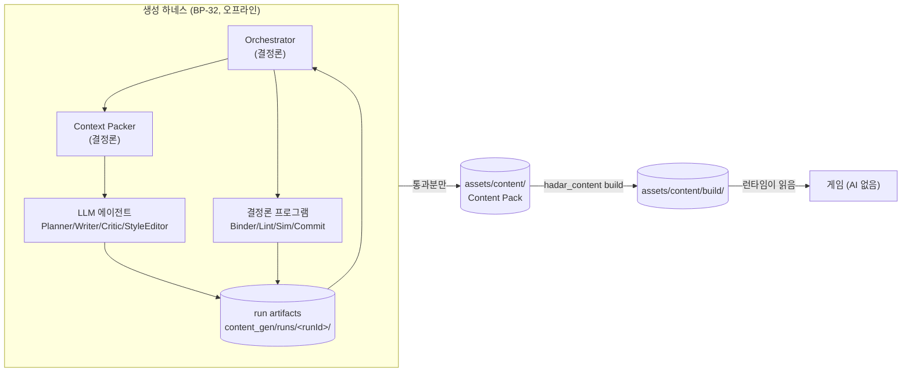
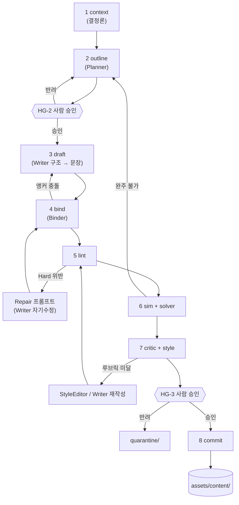

# 생성 하네스 — 8단계 파이프라인과 에이전트 역할

> `상태: 보류` — **설계는 유효하나 현재 노선에서는 구현하지 않는다.**
> 지금 노선은 원작 방식(플래그 + cm2)의 **sample-first** 다 → [`issues/MILESTONES.md`](../issues/MILESTONES.md).
> 이 장이 필요해지는 신호는 [`issues/MILESTONES.md` §5](../issues/MILESTONES.md) 에 있다. **읽고 바로 구현하지 말 것.**

> **문서 ID**: BP-32 · **상태**: 초안 · **선행 문서**: [BP-30](30_toolchain_overview.md) · [BP-21](21_content_pack_spec.md) · [BP-23](23_quest_model.md) · [BP-24](24_dialogue_model.md)
> **독자**: 생성 파이프라인 구현자 · 에이전트 프롬프트 작성자 · 콘텐츠 운영자
> **한 줄 요약**: "AI 로 퀘스트를 만들려면 무엇이 필요한가" 에 대한 정면 답변 — 8단계 파이프라인의 입출력 파일 규약, 에이전트 6종의 권한 경계, 컨텍스트 예산, 재현성 매니페스트, 실패 카탈로그.

**파이프라인 구획**([D-01](_meta/DECISIONS.md)): 이 장 전체가 **Authoring(오프라인)** 이다.
여기 서술된 어떤 것도 게임 런타임에 존재하지 않는다. 하네스는 `hadar2026_app/` 에 코드를 한 줄도 추가하지 않는다.

**이 장이 SSoT 인 것**: 파이프라인 단계 규약, `content_gen/runs/<runId>/` 디렉토리 규약,
`manifest.json` 스키마, 에이전트 역할·권한 분리, 컨텍스트 예산 정책.

**이 장이 SSoT 가 아닌 것** — [D-18 소유권 표](_meta/DECISIONS.md)에 따라 참조만 하고 재정의하지 않는다:

| 대상 | 소유 문서 |
|---|---|
| Content Pack 포맷 · ID 문법 · Condition/Effect DSL · 문자열 키 | [BP-21](21_content_pack_spec.md) |
| 세계관 바이블 · 액터 `knowledge` · 톤 규정 | [BP-22](22_world_bible_model.md) |
| Quest / Stage / Objective 스키마 · 티어 보상표 | [BP-23](23_quest_model.md) |
| Dialogue / Node / Choice 스키마 · 길이 상한 | [BP-24](24_dialogue_model.md) |
| 앵커 스키마 · 트리거 인덱스 | [BP-26](26_entity_registry_and_anchors.md) |
| 콘텐츠 서버 REST/MCP 엔드포인트 | [BP-31](31_content_server_api.md) |
| 린트 규칙 `QV-*` / `DV-*` 전량 | [BP-33](33_validation_and_lint.md) |
| 헤드리스 시뮬레이터 · 솔버 | [BP-34](34_headless_sim_and_solver.md) |
| 콘텐츠 빌드 · CI · 결정론 해시 | [BP-35](35_ci_and_build.md) |
| 프롬프트 원문 · 출력 스키마 · 검수 루브릭 | [BP-37](37_prompt_contracts.md) |
| 문체 규칙 | [BP-43](43_content_style_guide.md) |

---

## 32.1 하네스의 정의와 경계

### 32.1.1 하네스란 무엇인가

**생성 하네스(generation harness)** = LLM 에이전트를 **감싸서** 결정론적 산출물을 뽑아내는 껍데기다.
LLM 자체가 아니라, LLM 을 **호출 가능하고 · 검증 가능하고 · 재개 가능하고 · 재현 가능하게** 만드는
주변 장치 전부를 말한다.



### 32.1.2 하네스에 속하는 것 / 속하지 않는 것

| 속한다 | 속하지 않는다 | 소유 |
|---|---|---|
| 컨텍스트 팩 조립 규칙과 예산 | 컨텍스트에 실릴 **바이블 내용 자체** | BP-22 |
| 에이전트 역할·권한·재시도 정책 | 에이전트에게 주는 **프롬프트 원문** | BP-37 |
| 단계 간 파일 규약, 재개 지점 | **린트 규칙의 내용** | BP-33 |
| run manifest, 프롬프트/모델 버전 기록 | **시뮬레이터·솔버의 알고리즘** | BP-34 |
| 배치 전략, ID 예약 | **빌드 결정론 해시 계산식** | BP-35 |
| 사람 승인 게이트의 위치 | 게임 런타임 코드 | BP-27 |

### 32.1.3 오프라인 전용의 재확인 (R-32-1 ~ R-32-4)

- **R-32-1** 하네스는 `hadar2026_app/` 안에서 실행되지 않는다. 실행 위치는 레포 루트의
  `content_gen/` 과 `tools/content_cli/` 뿐이다. Flutter 앱은 하네스의 존재를 모른다.
- **R-32-2** 하네스가 만든 것 중 게임에 실리는 것은 **`assets/content/` 아래의 콘텐츠 소스뿐**이다.
  run artifact(`content_gen/`)는 `pubspec.yaml` 의 `flutter.assets` 에 절대 등재하지 않는다
  (에셋 선언이 비재귀라는 [GROUND_TRUTH 부록 A-4] 문제와도 무관해진다).
- **R-32-3** 하네스의 어떤 산출물도 런타임에 LLM 호출을 유발하지 않는다. 생성된 콘텐츠에
  "실행 시 모델에 물어본다" 는 표현이 존재할 수 없다 — DSL 이 닫힌 집합이므로 표현 자체가 불가능하다([BP-21 §6.1](21_content_pack_spec.md)).
- **R-32-4** 하네스 실행에는 네트워크(모델 API)가 필요하지만, **게임 빌드·테스트·CI 에는 필요 없다**.
  CI 는 이미 커밋된 콘텐츠 소스에 대해 `validate`/`sim` 만 돌린다([BP-35](35_ci_and_build.md)).

### 32.1.4 하네스가 반드시 해결해야 하는 4가지 (설계 동기)

| # | 문제 | 하네스의 답 | 절 |
|---|---|---|---|
| 1 | LLM 은 비결정적인데 콘텐츠는 재현 가능해야 한다 | 산출물을 파일로 고정 + manifest 기록 | §32.7 |
| 2 | LLM 은 그럴듯한 거짓말을 한다(유령 참조, 지식 범위 위반) | 단계 5·6 의 결정론 게이트 + 화이트리스트 컨텍스트 | §32.3, §32.5 |
| 3 | 한 번에 다 시키면 품질이 무너진다 | 역할 분리 6종 + 8단계 | §32.3, §32.4 |
| 4 | 실패했을 때 전부 다시 만들면 비용이 폭발한다 | 단계별 재개 + 부분 격리 | §32.3.10, §32.6.4 |

---

## 32.2 파이프라인 전경

### 32.2.1 8단계 요약표 (D-14 확정)

| # | 단계 | 실행 주체 | 입력 | 출력 | 게이트 |
|---|---|---|---|---|---|
| 1 | `context` | 결정론 (Context Packer) | 콘텐츠 팩 + 바이블 + 스키마 | `context_pack.json` | 예산 초과 시 실패 |
| 2 | `outline` | **LLM (Planner)** | `context_pack.json` + 주문서 | `outline.<questId>.json` | 스키마 + 사람 승인 **HG-2** |
| 3 | `draft` | **LLM (Writer ×2 패스)** | outline + context | `quest/*.json`, `dialogue/*.json`, `strings/*.json` | 스키마 강제 |
| 4 | `bind` | 결정론 (Binder) | draft + 맵 데이터 | `anchors/*.json`, `map_ops.json`, `bind_report.json` | 앵커-통행 충돌 0 |
| 5 | `lint` | 결정론 (`hadar_content lint`) | 3·4 산출물 | `lint_report.json` | **Hard gate** (D-15) |
| 6 | `sim` | 결정론 (SimDriver + QuestSolver) | 5 통과분 | `trace.json`, `solver.json` | **Hard gate** — 완주 증명 |
| 7 | `critic` | **LLM (Critic + StyleEditor)** | 6 통과분 + 루브릭 | `critic.json`, `style.json` | **Soft gate** — 루브릭 합격선 |
| 8 | `commit` | 결정론 (Committer) | 7 통과분 | `commit_plan.json`, 팩 반영, `content.lock.json` | 사람 승인 **HG-3** |

- **LLM 은 2·3·7 단계에서만 쓴다**(D-14). 4·5·6·8 에 LLM 을 넣자는 제안은 이 문서가 거부한다 —
  근거는 [BP-12 §12.13.5](12_reference_designs.md) "LLM 검수만으로 게이트 통과" 기각.
- 1단계는 결정론이지만 **LLM 을 위한 준비**이므로 하네스의 일부다.

### 32.2.2 흐름 다이어그램 (재시도 경로 포함)



**되돌림 규칙 (R-32-5)**: 실패는 **가장 가까운 원인 단계**로만 되돌린다.

| 실패 단계 | 되돌아가는 곳 | 근거 |
|---|---|---|
| 4 bind (좌표/통행) | 3 draft — 앵커 요구가 잘못됨 | 맵을 고치는 것보다 콘텐츠를 고치는 게 싸다 |
| 5 lint (구조) | 3 draft 의 **Repair 패스** — 전체 재생성 아님 | 오류 목록 + hint 를 주고 diff 만 요구 |
| 6 sim (완주 불가) | 2 outline — 설계 자체가 틀림 | 문장을 고쳐도 도달 불가는 안 풀린다 |
| 7 critic (문체·톤) | 3 draft 의 **문장 패스만** | 구조는 이미 통과했으므로 다시 굴리지 않는다 |
| 7 critic (서사·정합) | 2 outline | 근본 재설계 |

### 32.2.3 디렉토리 규약 (확정)

```
content_gen/                                # 레포 루트. Flutter 에셋 아님(R-32-2)
  prompts/                                  # 프롬프트 원문. 버전 태그로 관리 (BP-37 §37.8)
    planner.v1.md  writer_struct.v1.md  writer_prose.v1.md
    critic.v1.md   style_editor.v1.md   repair.v1.md
  orders/                                   # 사람이 쓰는 "주문서"
    <orderId>.json
  runs/
    <runId>/
      manifest.json                         # §32.7.2 — 이 실행의 모든 것
      01_context/
        context_pack.json                   # 조립된 컨텍스트(기계 판독)
        context_pack.md                     # 프롬프트에 실제로 붙는 렌더 결과
        budget_report.json                  # 블록별 토큰 사용량·절단 기록
      02_outline/
        outline.<questSlug>.json            # QuestOutline (BP-37 §37.3)
        raw/<callId>.json                   # 모델 원문 응답
      03_draft/
        quests/<questSlug>.json
        dialogue/<dlgSlug>.json
        strings/<questSlug>.ko.json
        raw/<callId>.json
      04_bind/
        anchors/<MAPNAME>.json
        map_ops.<MAPNAME>.json              # 맵 에디터 배치 편집 op (미적용 상태)
        bind_report.json
      05_lint/
        lint_report.json  lint_report.md
      06_sim/
        trace.<questSlug>.json
        solver.<questSlug>.json
        sim_report.json
      07_critic/
        critic.<questSlug>.json
        style.<questSlug>.json
        raw/<callId>.json
      08_commit/
        commit_plan.json  diff.patch  summary.md
      quarantine/
        <questSlug>/…                       # 포기한 항목 전체 사본 + 사유
      logs/
        calls.jsonl                         # 호출 1건 = 1줄 (토큰·지연·재시도)
  metrics/
    runs.jsonl                              # 실행 1건 = 1줄 (§32.10)
```

- **R-32-6** 단계 디렉토리 이름은 `NN_<stage>` 고정이다. `NN` 은 D-14 의 단계 번호.
  프로그램이 단계 완료를 판정하는 방법은 **그 디렉토리의 존재 + `manifest.stages[NN].status`** 두 가지가 일치하는지다.
- **R-32-7** 각 단계는 **자기 디렉토리에만 쓴다**. 앞 단계 산출물을 수정하지 않는다.
  수정이 필요하면 되돌림(R-32-5)이고, 되돌림은 **새 시도 번호**로 기록된다(§32.7.3).
- **R-32-8** `logs/` 와 `*/raw/` 는 gitignore 한다(모델 원문·토큰 소모가 크고 재현에 불필요 —
  재현에 필요한 것은 `manifest.json` 의 프롬프트 해시다). 나머지 run artifact 는
  **commit 단계까지 간 실행에 한해 커밋**한다.
- **R-32-9** `runId` 형식: `<YYYYMMDD>-<packId>-<seq3>` (예: `20260830-gen_ep1-003`).
  `seq` 는 그날 그 팩의 실행 순번. 같은 `runId` 로 두 번 실행하면 하네스가 거부한다.

### 32.2.4 주문서(`orders/<orderId>.json`)

사람이 하네스에 넣는 **유일한 자유 입력**이다. 이것 말고 사람이 프롬프트를 즉흥으로 고치는 경로는 없다(재현성).

```jsonc
{
  "orderId": "ord-2026-08-30-missing-scholar",
  "pack": "gen_ep1",
  "intent": "로어성 학자가 메너스로 간 뒤 실종된 사건을 다루는 1막 사이드 퀘스트 1건",
  "count": 1,
  "constraints": {
    "act": 1,
    "tier": 1,
    "maps": ["TOWN1", "GROUND1"],
    "mustUseActors": ["npc.core.lore_gate_guard"],
    "mayCreateActors": 2,
    "mayCreateItems": 1,
    "forbidPlaces": ["place.core.temple_of_knowledge"],
    "tags": ["side", "act1"]
  },
  "seed": 20260830,
  "promptSet": "v1"
}
```

| 필드 | 의미 | 파이프라인에서 쓰이는 곳 |
|---|---|---|
| `intent` | 사람이 원하는 것 1~3문장 | 2단계 Planner 프롬프트의 `{{order_intent}}` |
| `count` | 이 실행에서 만들 퀘스트 수 | §32.6 배치 전략 |
| `constraints.mayCreateActors` | 신규 액터 생성 허용 개수 | 2단계 출력 검사, 3단계 참조 무결성 |
| `seed` | 하네스 난수 시드(샘플링·순서·`chance` 검증) | manifest 에 기록, §32.7 |
| `promptSet` | 프롬프트 묶음 버전 | `content_gen/prompts/*.<ver>.md` 선택 |

---

## 32.3 8단계 상세

각 단계를 **입력 / 출력 / 주체 / 성공 판정 / 실패 행동 / 재개 / 비용** 7항목으로 확정한다.

### 32.3.1 단계 1 — `context` (컨텍스트 팩 조립)

| 항목 | 내용 |
|---|---|
| **주체** | 결정론 프로그램. `hadar_content context --order <orderId> --run <runId>` |
| **입력** | `assets/content/**`(전 팩), `orders/<orderId>.json`, `content_gen/prompts/<set>/`, 스키마 발췌 |
| **출력** | `01_context/context_pack.json`, `context_pack.md`, `budget_report.json` |
| **성공 판정** | ① 모든 P0~P2 블록이 잘리지 않고 실렸다 ② 총 토큰 ≤ 예산(§32.5.2) ③ 참조한 모든 엔티티가 실제로 존재한다 |
| **실패 행동** | P0~P2 가 예산을 넘으면 **즉시 실패**(재시도 없음). 사람이 `order.constraints` 를 좁혀야 한다. P3 이하 초과는 절단 규칙(§32.5.3)으로 자동 처리하고 `budget_report` 에 기록 |
| **재개** | 멱등. 같은 입력 → 같은 `context_pack.json`(해시로 검증). 다시 돌려도 안전 |
| **비용** | LLM 호출 0. 수 초. 팩 전체 파싱 비용만 |

- 이 단계는 [BP-31](31_content_server_api.md) 의 `GET /api/content/context?for=<targetId>&order=<orderId>`
  와 **같은 코드**를 쓴다. 서버는 대화형 조회용, CLI 는 파이프라인용이며 산출물은 동일해야 한다.
- **R-32-10** `context_pack.json` 은 조립 **근거**(어떤 엔티티가 왜 포함됐는지)를 담는다.
  `context_pack.md` 는 그것을 프롬프트용 텍스트로 렌더한 것이다. 프롬프트에 실제로 들어가는 것은 후자이고,
  **manifest 는 후자의 SHA-256 을 기록**한다.

### 32.3.2 단계 2 — `outline` (기획)

| 항목 | 내용 |
|---|---|
| **주체** | **LLM — Planner 에이전트**(§32.4.1). 프롬프트 [BP-37 §37.3.1](37_prompt_contracts.md) |
| **입력** | `01_context/context_pack.md`, `orders/<orderId>.json#intent,constraints` |
| **출력** | `02_outline/outline.<questSlug>.json` — 스키마 `QuestOutline`([BP-37 §37.4.1](37_prompt_contracts.md)) |
| **성공 판정** | ① `QuestOutline` JSON Schema 통과 ② `newEntities` 개수 ≤ `constraints.mayCreate*` ③ 참조한 기존 ID 가 전부 실재 ④ 비트(beat) 3~9개 ⑤ 사람 승인(**HG-2**) |
| **실패 행동** | 스키마/참조 실패 시 **최대 2회 재시도**(총 3회 호출). 재시도 프롬프트에는 실패 목록 + `hint` 를 붙인다. 3회 실패 시 그 퀘스트를 `quarantine/` 으로 격리하고 **다음 퀘스트로 진행**(배치 전체를 멈추지 않는다) |
| **재개** | `02_outline/outline.*.json` 이 있고 manifest 가 `approved` 면 3단계부터. `drafted` 상태면 HG-2 부터 |
| **비용** | 호출 1~3회. 입력 ~35k 토큰(컨텍스트 팩), 출력 ~2k 토큰. 퀘스트 1건당 **약 40k 입력 / 6k 출력** (재시도 포함 상한) |

- **R-32-11** Planner 는 **콘텐츠 파일을 쓰지 않는다.** 산출물은 `QuestOutline` 하나뿐이며,
  이 파일은 콘텐츠 팩 포맷이 아니다. 따라서 [BP-21 §5.1](21_content_pack_spec.md) 의
  "인라인 한국어 금지" 는 outline 에 **적용되지 않는다** — outline 의 `title_ko` 등은 한국어 평문이다.
  키로 바꾸는 것은 3단계 Writer 의 일이다.
- **R-32-12** outline 은 "이 퀘스트가 무엇을 새로 만들어야 하는가"(`newEntities`)를 **명시**해야 한다.
  3단계에서 없는 NPC 를 즉흥으로 지어내는 것을 막는 유일한 장치다.

### 32.3.3 단계 3 — `draft` (집필, 2패스)

[BP-24 §24.11.4](24_dialogue_model.md) 가 권고한 **구조 → 문장** 2패스를 여기서 확정한다.

| 항목 | 내용 |
|---|---|
| **주체** | **LLM — Writer 에이전트**(§32.4.2). 패스 A = 구조, 패스 B = 문장 |
| **입력 A** | `context_pack.md` + `outline.<questSlug>.json` + 스키마 발췌(Quest/Dialogue/DSL) |
| **출력 A** | `03_draft/quests/<slug>.json`, `03_draft/dialogue/<slug>.json` — **모든 표시 문자열이 키** |
| **입력 B** | 패스 A 산출물의 **키 목록** + 액터 `_voice`/`knowledge` + 길이 상한표([BP-24 §24.5.5](24_dialogue_model.md)) |
| **출력 B** | `03_draft/strings/<questSlug>.ko.json` — 키 → 한국어 |
| **성공 판정** | ① 두 산출물 모두 스키마 통과 ② 패스 A 가 참조한 키 집합 == 패스 B 가 채운 키 집합(양방향 완전 일치) ③ 인라인 한국어 0건([BP-21 R-21-21](21_content_pack_spec.md)) ④ `newEntities` 밖의 신규 ID 0건 |
| **실패 행동** | 패스별 독립 재시도 **최대 2회**. 키 집합 불일치는 **패스 B 만** 재시도(구조는 이미 통과). 3회 실패 시 격리 |
| **재개** | 패스 단위. `strings/*.ko.json` 만 없으면 패스 B 부터 |
| **비용** | 호출 2~6회. 패스 A 입력 ~45k / 출력 ~6k, 패스 B 입력 ~20k / 출력 ~4k. 퀘스트 1건당 **약 130k 입력 / 20k 출력** (재시도 포함 상한) |

- **R-32-13** 패스 A 는 `strings` 를 만들지 않고, 패스 B 는 구조 파일을 수정하지 않는다.
  두 패스가 서로의 산출물을 고치기 시작하면 재개 지점이 사라진다.
- **R-32-14** 신규 액터·아이템 파일(`actors/<slug>.json`, `items` 추가분)도 패스 A 산출물이며
  `03_draft/entities/` 아래에 쓴다. `knowledge.knows`/`unknown` 은 **필수**이므로 비워 낼 수 없다([BP-22 §5.4](22_world_bible_model.md)).

### 32.3.4 단계 4 — `bind` (바인딩)

| 항목 | 내용 |
|---|---|
| **주체** | **결정론 프로그램** Binder(§32.4.3). `hadar_content bind --run <runId>` |
| **입력** | `03_draft/**`, `hadar2026_app/assets/maps/*.json`, 기존 `assets/content/anchors/**` |
| **출력** | `04_bind/anchors/<MAPNAME>.json`, `04_bind/map_ops.<MAPNAME>.json`, `bind_report.json` |
| **성공 판정** | ① 모든 `talk_to`/`reach`/`deliver` 목표가 좌표를 갖는 앵커로 해소됨 ② 앵커-타일 정합 규칙([BP-26 §3](26_entity_registry_and_anchors.md)) 위반 0 ③ `warp`/`portal` 도착 타일이 전부 통행 가능([BP-21 E14](21_content_pack_spec.md)) ④ 좌표 중복 충돌 0 |
| **실패 행동** | **재시도 없음**(결정론이므로 다시 돌려도 같은 결과). 해소 실패 목록을 `{error, hint}` 형태로 모아 3단계 Repair 로 되돌린다. 되돌림 2회 실패 시 격리 |
| **재개** | 멱등. 언제든 다시 돌릴 수 있다 |
| **비용** | LLM 0. 맵 파일 파싱 + 통행 판정. 100×100 맵 기준 수백 ms |

**Binder 가 하는 일 5가지**

1. **앵커 좌표 배정** — outline 의 `placementHints`(장소·근처 지형)와 맵의 통행 데이터로
   후보 좌표를 계산한다. NPC 앵커는 `objTile` 이 TALK 범위(128~143)인 칸이거나,
   그 칸을 만드는 맵 편집 op 를 생성한다([BP-22 R-22-17](22_world_bible_model.md)).
2. **맵 편집 op 생성** — 실제 맵 파일을 **여기서 고치지 않는다**. `map_ops.<MAP>.json` 에
   맵 에디터 배치 편집 형식([BP-36](36_map_editor_extension.md))으로 적어 두고, 8단계에서 적용한다.
3. **참조 해소** — `defeat` 목표의 적을 인카운터 id 로, 아이템 이름을 `item.*` id 로 확정.
   적은 반드시 **id 1~74** 범위여야 한다([GROUND_TRUTH 부록 B-1] — id 0 `Orc` 은 소환 불가).
4. **문자열 키 정규화** — 패스 B 가 만든 키를 [BP-21 §5.2](21_content_pack_spec.md) 규칙으로 검사·정렬.
5. **역참조 인덱스 생성** — 고아 목표 검사([BP-23 QV-15~18](23_quest_model.md))의 입력.

- **R-32-15** Binder 는 **LLM 이 아니다**. 좌표를 "감각적으로 예쁘게" 놓지 못한다. 그것이 목적이다 —
  좌표 배치가 비결정적이면 재현이 깨진다. 미적 배치가 필요하면 사람이 맵 에디터로 옮기고
  앵커 자동 수복([BP-26 §6.4](26_entity_registry_and_anchors.md))이 따라온다.

### 32.3.5 단계 5 — `lint` (정적 검사)

| 항목 | 내용 |
|---|---|
| **주체** | **결정론** `hadar_content lint --run <runId> --format json` |
| **입력** | `03_draft/**` + `04_bind/**` + 기존 팩(참조 해소용) |
| **출력** | `05_lint/lint_report.json`, `lint_report.md` |
| **성공 판정** | **Hard 위반 0건**. Soft 경고는 통과를 막지 않고 7단계 Critic 의 입력이 된다 |
| **실패 행동** | Hard 위반 → Repair 프롬프트(§32.4.2)로 **3단계 되돌림, 최대 2회**. 2회 후에도 남으면 격리 |
| **재개** | 멱등 |
| **비용** | LLM 0. 퀘스트 1건 + 대화 3~5개 기준 1초 미만 |

규칙 전량은 [BP-33](33_validation_and_lint.md) 소유다. 이 단계가 보장하는 **하네스 측 계약**만 여기 적는다:

- **R-32-16** `lint_report.json` 의 모든 항목은 `{ruleId, severity, path, message, hint}` 를 갖는다.
  `hint` 는 **모델이 그대로 따라 고칠 수 있는 문장**이어야 한다(맵 에디터 API 의 `{error, hint}` 선례, [GROUND_TRUTH §11]).
- **R-32-17** `severity` 는 `hard` | `soft` 둘뿐이다. `info` 를 만들지 않는다 —
  등급이 셋이 되는 순간 "어느 것을 고쳐야 하는가" 가 모호해지고 자기수정 루프가 흔들린다.
- **R-32-18** Repair 재시도 시에는 **전체를 다시 생성시키지 않는다**. 위반 항목의 `path`(JSON Pointer)와
  현재 값만 보여 주고 **그 경로에 대한 교체값만** 요구한다(BP-37 §37.3.6 Repair 프롬프트).

### 32.3.6 단계 6 — `sim` (시뮬레이션·완주 증명)

| 항목 | 내용 |
|---|---|
| **주체** | **결정론** `hadar_content sim --run <runId>` + `solve` |
| **입력** | 5단계 통과분 |
| **출력** | `06_sim/trace.<slug>.json`, `solver.<slug>.json`, `sim_report.json` |
| **성공 판정** | ① 솔버가 **완주 경로를 1개 이상 제시** ② `chance` 양 분기 모두에서 완주 가능([BP-21 R-21-35/36](21_content_pack_spec.md)) ③ 기존 골든 트레이스 회귀 0건 ④ 대화 그래프 전 노드 도달 가능 |
| **실패 행동** | 완주 불가 → **2단계 outline 으로 되돌림**(설계 결함). 최대 1회. 두 번째도 실패하면 격리 + 사람 알림 |
| **재개** | 멱등. 시드가 manifest 에 고정돼 있으므로 트레이스가 재현된다 |
| **비용** | LLM 0. 상태 공간 탐색이므로 가장 오래 걸린다. 퀘스트 1건 **수 초 ~ 1분**, 배치 전체 재시뮬은 수 분 |

- **R-32-19** sim 실패 리포트는 **최소 재현 시퀀스**를 담는다(D-13). 사람이 "왜 못 깨는가" 를
  읽어서 이해할 수 있어야 한다. 그렇지 않으면 outline 을 어떻게 고칠지 알 수 없다.
- **R-32-20** 6단계는 [GROUND_TRUTH 부록 B-3] 의 선결 과제(이동·상호작용 루프를 `application/` 으로 추출)
  에 의존한다. 그 전까지는 **콘텐츠 계층만의 축약 시뮬**(앵커→대화→퀘스트 상태 전이)로 시작하고,
  맵 이동은 `reach` 목표의 **경로 존재 검사**로 대체한다. 상세는 [BP-34](34_headless_sim_and_solver.md).

### 32.3.7 단계 7 — `critic` (검수)

| 항목 | 내용 |
|---|---|
| **주체** | **LLM — Critic 에이전트 + StyleEditor 에이전트**(§32.4.4, §32.4.5) |
| **입력** | 6단계 통과분 + `lint_report`(soft 경고) + 루브릭([BP-37 §37.5](37_prompt_contracts.md)) + 컨텍스트 팩의 톤·지식 블록 |
| **출력** | `07_critic/critic.<slug>.json`(`CriticReport`), `07_critic/style.<slug>.json`(`StyleReport`) |
| **성공 판정** | `CriticReport.verdict == "pass"` 또는 `"conditional"` **그리고** 모든 축 ≥ 3점 그리고 총점 ≥ 합격선([BP-37 §37.5.3](37_prompt_contracts.md)) |
| **실패 행동** | `verdict == "revise"` → 지시 유형에 따라 분기: **문체 지시**는 StyleEditor 가 문자열만 고쳐 5단계로, **구조·서사 지시**는 2단계 outline 으로. 각 1회. 두 번째 `revise` 는 사람 판단(**HG-3**)으로 올린다 |
| **재개** | Critic 은 비결정적이므로 **재실행 시 새 시도 번호**가 붙고 이전 보고서는 보존된다 |
| **비용** | 호출 2~4회. Critic 입력 ~25k / 출력 ~3k, StyleEditor 입력 ~12k / 출력 ~5k. 퀘스트 1건당 **약 60k 입력 / 12k 출력** |

- **R-32-21 (제작·검수 분리)** Critic 은 **문서를 고치지 않는다.** 점수와 수정 지시만 낸다.
  수정은 Writer/StyleEditor 가 한다. 이 규약은 이 기획서 자체의 검수 규약(`_meta/REVIEW_RUBRIC.md`)과 동일하며,
  같은 이유로 채택했다 — 고치는 자가 채점하면 채점이 무너진다.
- **R-32-22** Critic 은 **Hard gate 를 판정할 권한이 없다.** Critic 이 "이 참조는 깨졌다" 고 말해도
  5단계가 통과시켰으면 통과다(반대로 Critic 이 통과라 해도 5단계가 막으면 실패다).
  Critic 의 관할은 Soft 축뿐이다.

### 32.3.8 단계 8 — `commit` (반영)

| 항목 | 내용 |
|---|---|
| **주체** | **결정론** Committer. `hadar_content commit --run <runId>` |
| **입력** | 7단계 통과분 전량 |
| **출력** | `08_commit/commit_plan.json`, `diff.patch`, `summary.md` + **실제 팩 반영** |
| **성공 판정** | ① 팩 반영 후 `hadar_content build` 성공 ② `content.lock.json` 재생성 해시가 **두 번 연속 동일**(결정론 증빙, D-15) ③ 기존 팩과 ID 충돌 0 ④ 사람 승인(**HG-3**)이 선행됨 |
| **실패 행동** | 반영 전 검사에서 실패하면 **아무것도 쓰지 않고** 중단(원자성). 부분 반영 금지 |
| **재개** | 반영은 트랜잭션이다. 중단된 commit 은 `commit_plan.json` 을 보고 처음부터 다시 |
| **비용** | LLM 0. 파일 쓰기 + 빌드 1회 |

**commit 이 하는 일 순서 (R-32-23)**

```
1. commit_plan.json 생성          # 어떤 파일이 새로 생기고/바뀌는가 (드라이런)
2. ID 예약 테이블과 대조          # §32.6.3 — 예약한 ID 만 쓰였는가
3. map_ops.<MAP>.json 적용        # 맵 에디터 배치 편집 API (BP-36)
4. 콘텐츠 소스 파일 쓰기          # assets/content/** — API/CLI 경유 (D-12: AI 는 직접 안 씀)
5. pack.json 갱신                 # version bump, generatedBy, entryPoints, retiredIds
6. hadar_content build            # build/content.bundle.json + index + lock
7. 결정론 검증                    # 6 을 한 번 더 돌려 lock 해시 비교
8. summary.md 생성                # 사람이 읽을 변경 요약 (PR 본문 재료)
9. metrics/runs.jsonl 에 1줄 추가  # §32.10
```

- **R-32-24** 3번(맵 편집)이 4번(콘텐츠 쓰기)보다 **먼저**다. 맵 편집이 실패하면 콘텐츠가
  존재하지 않는 좌표를 가리키게 되기 때문이다. 반대 순서는 앵커 고아를 만든다.
- **R-32-25** 8단계는 **git 커밋을 하지 않는다.** 워킹 트리를 바꾸고 `summary.md` 를 낼 뿐이다.
  커밋·PR 은 사람 또는 [BP-35](35_ci_and_build.md) 의 워크플로가 한다.

### 32.3.9 단계별 재시도·비용 종합표 (확정)

| 단계 | LLM | 재시도 상한 | 실패 시 되돌림 | 되돌림 상한 | 입력 토큰(1퀘스트) | 출력 토큰 | 호출 수 |
|---|---|---|---|---|---|---|---|
| 1 context | ✗ | 0 | — | — | — | — | 0 |
| 2 outline | ✓ | 2 | — | — | ~40k | ~6k | 1~3 |
| 3 draft A | ✓ | 2 | — | — | ~45k×3 | ~6k×3 | 1~3 |
| 3 draft B | ✓ | 2 | — | — | ~20k×3 | ~4k×3 | 1~3 |
| 4 bind | ✗ | 0 | 3 | 2 | — | — | 0 |
| 5 lint | ✗ | 0 | 3(Repair) | 2 | ~15k×2 | ~3k×2 | 0~2 |
| 6 sim | ✗ | 0 | 2 | 1 | — | — | 0 |
| 7 critic | ✓ | 1 | 3 또는 2 | 1 | ~25k | ~3k | 1~2 |
| 7 style | ✓ | 1 | 5 | 1 | ~12k | ~5k | 1~2 |
| 8 commit | ✗ | 0 | — | — | — | — | 0 |

**퀘스트 1건 총 예산 상한** (모든 재시도가 최악으로 발생했을 때):

| 축 | 값 |
|---|---|
| LLM 호출 수 | **최대 15회**, 정상 경로 **4회** |
| 입력 토큰 | 최대 **약 320k**, 정상 **약 105k** |
| 출력 토큰 | 최대 **약 45k**, 정상 **약 18k** |
| 벽시계 시간 | 정상 **5~10분**(6단계 sim 이 지배), 최악 **30분** |

- **R-32-26** 호출 15회를 넘기면 하네스가 **강제 중단**하고 격리한다. 예산 초과는 대개
  "outline 이 애초에 만들 수 없는 것을 설계했다" 는 신호다.
- **R-32-27** 위 수치는 **추정치**이며 파일럿(§32.11) 이후 `metrics/runs.jsonl` 실측으로 갱신한다.
  갱신 시 이 표를 고치고 `promptSet` 버전을 올린다.

### 32.3.10 재개(resume) 규약

```bash
hadar_content run --resume <runId>              # manifest 를 읽어 다음 단계부터
hadar_content run --resume <runId> --from 05    # 특정 단계부터 강제 재실행
hadar_content run --resume <runId> --only quest.gen_ep1.missing_scholar   # 한 항목만
```

| 재개 규칙 | 내용 |
|---|---|
| **R-32-28** | 재개의 진실 원천은 `manifest.json#stages[]` 다. 디렉토리 존재만으로는 완료로 보지 않는다 |
| **R-32-29** | 결정론 단계(1,4,5,6,8)는 재개 시 **무조건 다시 돌린다**. 싸고, 입력이 바뀌었을 수 있다 |
| **R-32-30** | LLM 단계(2,3,7)는 재개 시 **기존 산출물을 재사용한다**. 다시 돌리려면 `--from` 을 명시해야 한다 — 비용과 비결정성 때문 |
| **R-32-31** | `--from N` 은 N 이상 단계 디렉토리를 **삭제하지 않고** 시도 번호를 올려 새로 만든다(`05_lint/attempt_2/`). 증거를 지우지 않는다 |
| **R-32-32** | 사람 승인 상태(HG-2/HG-3)는 재개 시 **유지된다**. 단 승인 이후 그 단계 산출물이 다시 생성되면 승인은 **자동 무효화**된다 |

---

## 32.4 에이전트 역할 정의

**총 6종.** LLM 4종(Planner, Writer, Critic, StyleEditor) + 결정론 2종(Binder, Orchestrator).

### 32.4.0 역할 요약표

| 에이전트 | 종류 | 단계 | 산출 스키마 | 판정 권한 | 절대 금지 |
|---|---|---|---|---|---|
| **Planner** | LLM | 2 | `QuestOutline` | 없음(제안만) | 콘텐츠 파일 작성, 신규 ID 확정 |
| **Writer** | LLM | 3 (+Repair) | `QuestDraft` / `DialogueDraft` / `StringsDraft` | 없음 | 자기 산출물 채점, outline 무시, 신규 엔티티 즉흥 창작 |
| **Binder** | 결정론 | 4 | 앵커 · `map_ops` | **Hard**(앵커-통행) | 문장 생성, 좌표를 미적 판단으로 고르기 |
| **Critic** | LLM | 7 | `CriticReport` | **Soft 만** | 파일 수정, Hard gate 뒤집기, 스스로 재작성 |
| **StyleEditor** | LLM | 7 | `StyleReport` + 교정 문자열 | 없음(제안) | 구조 파일 수정, 의미 변경 |
| **Orchestrator** | 결정론 | 전체 | `manifest.json` | **진행/중단** | 프롬프트 즉흥 수정, 게이트 우회 |

### 32.4.1 Planner (기획)

| 항목 | 내용 |
|---|---|
| **책임** | 주문서의 `intent` 를 **구현 가능한 퀘스트 설계**로 번역. 비트 구성, 등장인물·장소 선정, 스테이지 골격, 신규 엔티티 요청 |
| **입력 컨텍스트** | 컨텍스트 팩 P0~P6 전량(§32.5.2). 특히 기존 퀘스트 1줄 요약 목록(중복 방지)과 `chronicle`(시간축) |
| **출력 스키마** | `QuestOutline`([BP-37 §37.4.1](37_prompt_contracts.md)) |
| **금지 사항** | ① 콘텐츠 팩 파일 작성 ② `constraints.mayCreate*` 초과 신규 엔티티 ③ 존재하지 않는 기존 ID 참조 ④ 대사 원문 작성(비트 요약은 허용) ⑤ tier 권장 보상 범위표([BP-23 §23.9.3](23_quest_model.md)) 밖 수치 제안 |
| **판정 권한** | 없음. 모든 산출은 **제안**이며 HG-2 에서 사람이 승인해야 3단계로 간다 |
| **성공의 정의** | outline 을 그대로 구현했을 때 6단계 솔버가 완주를 증명할 수 있는 설계 |

- **R-32-33** Planner 는 **신규 엔티티를 "요청"만** 한다(`newEntities[]`에 종류·역할·필요 이유를 적는다).
  실제 ID 확정은 Orchestrator 의 ID 예약(§32.6.3)이 한다. 모델이 ID 를 직접 지으면 배치 병렬 실행에서 충돌한다.

### 32.4.2 Writer (집필)

| 항목 | 내용 |
|---|---|
| **책임** | 패스 A: outline → Quest/Dialogue/Actor JSON(모든 텍스트는 키). 패스 B: 키 → 한국어 문장. Repair: lint 위반 경로만 교체 |
| **입력 컨텍스트 (A)** | outline + 스키마 발췌 + DSL op/do 목록 + "하지 말 것" 목록([BP-23 §23.12.3](23_quest_model.md), [BP-24 §24.11.3](24_dialogue_model.md)) |
| **입력 컨텍스트 (B)** | 키 목록 + 각 키가 속한 노드의 맥락 + 화자의 `_voice`·`traits`·`knowledge.knows` **화이트리스트** + 길이 상한표 |
| **출력 스키마** | `QuestDraft`, `DialogueDraft`, `StringsDraft`([BP-37 §37.4.2~4](37_prompt_contracts.md)) |
| **금지 사항** | ① outline 에 없는 스테이지·목표 추가 ② `newEntities` 밖 신규 ID ③ 구조 파일에 한국어 직접 기입 ④ 패스 B 에서 구조 수정 ⑤ 자기 산출물에 대한 품질 평가 서술 ⑥ 화자 `knowledge.unknown` 에 있는 대상 언급 |
| **판정 권한** | 없음 |
| **성공의 정의** | 5단계 Hard 위반 0, 키 집합 완전 일치 |

- **R-32-34 (지식 화이트리스트)** 패스 B 프롬프트에는 화자가 **아는 것만** 넣는다([BP-22 R-22-13](22_world_bible_model.md)).
  모르는 것을 말하지 못하게 하는 1차 방어선은 프롬프트이고, 린트는 2차 방어선이다.
- **R-32-35 (Repair 의 최소성)** Repair 패스는 **JSON Pointer 로 지목된 경로의 교체값만** 출력한다.
  전체 파일을 다시 내면 이미 통과한 부분이 오염되고, diff 가 커져 검수 비용이 오른다.

### 32.4.3 Binder (바인딩, 결정론)

| 항목 | 내용 |
|---|---|
| **책임** | §32.3.4 의 5가지 — 앵커 좌표 배정, 맵 편집 op 생성, 참조 해소, 문자열 키 정규화, 역참조 인덱스 |
| **입력** | draft 산출물 + 맵 JSON + 기존 앵커 |
| **출력 스키마** | 앵커([BP-26 §2](26_entity_registry_and_anchors.md)) · `map_ops`([BP-36](36_map_editor_extension.md)) · `bind_report.json` |
| **금지 사항** | ① 문장 생성 ② 무작위·시각적 판단 ③ 맵 파일 직접 수정(op 만 생성) ④ 해소 실패를 임의 기본값으로 메우기 |
| **판정 권한** | **Hard** — 앵커-통행 충돌, 도착 타일 통행성, 좌표 중복 |
| **성공의 정의** | 같은 입력에 대해 **바이트 동일한** 앵커 파일을 낸다 |

- **R-32-36** Binder 의 좌표 선택은 **결정론적 규칙**이다: 대상 장소의 맵 영역에서
  ① 요구 타일 액션을 만족하고 ② 기존 앵커와 겹치지 않고 ③ 통행 가능 칸에 인접한 좌표 중
  **(y, x) 사전순 최솟값**을 고른다. 미적 판단이 아니라 **반복 가능성**이 기준이다.
- **R-32-37** Binder 는 [GROUND_TRUTH 부록 D-1] 의 맵 이름 해석 파손(T-22-1)이 고쳐지기 전에는
  `MapInfos.json` 을 신뢰하지 않고 **파일명 직접 조회**로 폴백한다. `bind_report.json` 에 그 사실을 기록한다.

### 32.4.4 Critic (검수)

| 항목 | 내용 |
|---|---|
| **책임** | 루브릭 축별 채점 + 근거 인용 + **실행 가능한 수정 지시** 생성. 지시마다 "어느 단계로 되돌려야 하는가" 를 명시 |
| **입력 컨텍스트** | 완성 draft(구조+문장) + 6단계 트레이스 요약 + soft 경고 목록 + 톤 규정 + 인접 콘텐츠 요약. **컨텍스트 팩과 동일한 세계관 블록을 재주입**한다 |
| **출력 스키마** | `CriticReport`([BP-37 §37.4.5](37_prompt_contracts.md)) |
| **금지 사항** | ① 파일 수정 ② Hard gate 판정 뒤집기(R-32-22) ③ 점수 없이 산문만 쓰기 ④ "전반적으로 좋다" 류의 근거 없는 총평 ⑤ 자기가 만든 콘텐츠 채점(제작·검수 분리) |
| **판정 권한** | **Soft gate 전권.** `verdict ∈ {pass, conditional, revise}` |
| **성공의 정의** | 같은 콘텐츠에 대해 사람 검수자와 축별 ±1점 이내로 일치 |

- **R-32-38 (분리 강제)** Critic 호출은 **Writer 와 다른 세션·다른 컨텍스트**에서 이뤄진다.
  Writer 의 사고 과정·초안 이력을 Critic 에게 주지 않는다. 초안 이력을 보면 채점이 초안에 끌려간다.
- **R-32-39** Critic 의 수정 지시는 `{axis, severity, path, finding, requiredFix, returnToStage}` 를 갖는다.
  `returnToStage` 가 없는 지시는 하네스가 **무시**한다 — 어디로 되돌릴지 모르는 지시는 실행할 수 없다.

### 32.4.5 StyleEditor (문체)

| 항목 | 내용 |
|---|---|
| **책임** | `strings/*.ko.json` 의 문장만 [BP-43](43_content_style_guide.md) 기준으로 교정. 어투(`archaic_polite`), 길이 상한, 금칙어, 색상 태그 균형 |
| **입력 컨텍스트** | 문자열 목록 + 각 문자열의 화자·상황 1줄 + 톤 규정(`lore.tone`) + 금기(`taboos`) + 길이 상한표 |
| **출력 스키마** | `StyleReport` + 교정본 `strings` 맵([BP-37 §37.4.6](37_prompt_contracts.md)) |
| **금지 사항** | ① 구조 파일(quest/dialogue) 수정 ② 키 추가·삭제 ③ **의미 변경**(사실·수치·고유명사 교체) ④ 새 고유명사 도입 ⑤ 길이 상한 초과 |
| **판정 권한** | 없음. 교정본은 5단계 재검사를 반드시 통과해야 채택된다 |
| **성공의 정의** | 교정 후 문체 점수 상승, 키 집합 불변, 고유명사 집합 불변 |

- **R-32-40 (고유명사 불변식)** StyleEditor 교정 전후로 문자열에서 추출한 **고유명사 집합이 달라지면 거부**한다.
  검출은 바이블의 표시 이름 + `_aliases` 사전 매칭([BP-22 R-22-12](22_world_bible_model.md)).
  이것이 "문체 교정 중에 세계관이 조용히 바뀌는" 사고를 막는 유일한 자동 장치다.

### 32.4.6 Orchestrator (조정, 결정론)

| 항목 | 내용 |
|---|---|
| **책임** | 단계 순서 실행, 재시도·되돌림 예산 집행, ID 예약, manifest 기록, 사람 승인 대기, 격리 처리, 메트릭 적재 |
| **입력** | `orders/<orderId>.json` + `manifest.json` |
| **출력** | `manifest.json`(계속 갱신), `logs/calls.jsonl`, `metrics/runs.jsonl` |
| **금지 사항** | ① 프롬프트 본문 즉흥 수정(`content_gen/prompts/` 의 버전 태그 파일만 사용) ② Hard gate 우회 ③ 사람 승인 없이 8단계 진입 ④ 예산(호출 15회) 초과 실행 |
| **판정 권한** | **진행 / 되돌림 / 격리 / 중단** |
| **성공의 정의** | manifest 만으로 실행 전체를 재구성할 수 있다 |

- **R-32-41** Orchestrator 는 **모델을 고르지 않는다.** 모델은 `orders#promptSet` 이 가리키는
  프롬프트 묶음의 메타에 적혀 있다. 실행 중 모델을 바꾸면 재현이 깨진다.

---

## 32.5 컨텍스트 팩 조립 규칙

### 32.5.1 원칙

- **R-32-42 (화이트리스트 우선)** "쓰지 마라" 를 프롬프트로 지시하는 것보다 **애초에 안 주는 것**이 강하다.
  액터 대사를 쓸 때는 그 액터의 `knowledge.knows` 에 있는 엔티티만 컨텍스트에 넣는다([BP-22 R-22-13](22_world_bible_model.md)).
- **R-32-43 (전량 금지)** 팩 전체를 프롬프트에 넣지 않는다. 관련 없는 콘텐츠는 균질화(F5)와
  설정 드리프트(F6)를 오히려 키운다([BP-12 §12.13.2](12_reference_designs.md)).
- **R-32-44 (재현 가능한 조립)** 같은 입력에 대해 컨텍스트 팩은 **바이트 동일**해야 한다.
  선택·정렬에 난수를 쓰지 않고, 관련도 점수는 결정론적 공식으로만 계산한다.
- **R-32-45 (렌더 고정)** `context_pack.md` 는 블록 순서·제목·구분자가 고정된 템플릿으로 렌더된다.
  모델이 "어디에 무엇이 있는지" 를 학습적으로 기대할 수 있어야 한다.

### 32.5.2 블록 우선순위와 예산 (확정)

**총 예산: 입력 60,000 토큰.** 프롬프트 본문(지시문·스키마·few-shot 제외분)에 3,000 을 남기고
컨텍스트 팩에 **57,000** 을 배정한다.

| 우선순위 | 블록 | 내용 | 예산 | 절단 |
|---|---|---|---|---|
| **P0** | 출력 스키마 + 금칙 목록 | 대상 에이전트의 출력 JSON Schema, "하지 말 것" 목록, DSL op/do 표 | 6,000 | **절대 안 자름** |
| **P1** | 톤·금기 | `lore.tone`, `lore.taboos`, [BP-43](43_content_style_guide.md) 요약, 길이 상한표 | 3,000 | **절대 안 자름** |
| **P2** | 대상 액터 지식 | 관련 액터의 `_summary`,`_voice`,`traits`,`knowledge.knows`(화이트리스트), `states` | 4,000 | **절대 안 자름** |
| **P3** | 세계 축 | `axes.premise/era/magicRules/conflicts` + 관련 `chronicle` 항목 | 8,000 | `order` 거리 먼 사건부터 |
| **P4** | 인접 콘텐츠 | 같은 place/act 의 기존 퀘스트·대화 **요약**(원문 아님) | 12,000 | 관련도 낮은 것부터 |
| **P5** | few-shot 예시 | 좋은 예 1 + 나쁜 예 1([BP-37 §37.6](37_prompt_contracts.md)) | 8,000 | 나쁜 예 → 좋은 예 순 |
| **P6** | 팩 전역 목록 | 전 퀘스트 1줄 요약(중복 방지), 전 액터 이름·역할 1줄 | 6,000 | 오래된 `act` 부터 |
| **P7** | 카탈로그 발췌 | 사용 가능 아이템·인카운터·앵커 후보 좌표 | 10,000 | 사용 가능성 낮은 것부터 |
| — | **합계** | | **57,000** | |

- **R-32-46** P0~P2 를 담지 못하면 1단계가 **즉시 실패**한다. 자동 절단으로 넘어가지 않는다.
  이 세 블록은 "모델이 규칙을 모르는 상태" 를 만들지 않기 위한 최소 보장이다.
- **R-32-47** 에이전트마다 블록 구성이 다르다:

| 에이전트 | 실리는 블록 |
|---|---|
| Planner | P0 P1 P2(요약) P3 P4 P5 P6 P7 |
| Writer 패스 A | P0 P1 P2 P3(축약) P5 P7 + outline |
| Writer 패스 B | P0 P1 **P2(전량)** P5 + 키 목록·맥락 |
| Critic | P0 P1 P2 P3 P4 + 완성 draft + 트레이스 요약 |
| StyleEditor | P0 P1 P2(`_voice` 만) + 문자열 목록 |

### 32.5.3 절단 순서 (확정)

예산 초과 시 **P7 → P6 → P5 → P4 → P3** 순으로 줄인다. 같은 블록 안에서는 표의 "절단" 열 기준.

```
while (total > budget):
    for tier in [P7, P6, P5, P4, P3]:
        if tier.tokens == 0: continue
        drop_lowest_ranked_item(tier)        # 결정론적 정렬 기준으로 마지막 항목
        recompute(total)
        if total <= budget: break
    if no_item_dropped_this_round:
        fail("P0~P2 만으로 예산 초과 — order 를 좁히세요")
```

- **R-32-48** 절단은 **항목 단위**다. 문장 중간을 자르지 않는다. 잘린 항목은
  `budget_report.json#dropped[]` 에 `{tier, id, reason, tokens}` 로 기록된다.
- **R-32-49** P4(인접 콘텐츠)의 관련도 점수는 결정론 공식으로 계산한다:
  `score = 4×(같은 place) + 3×(같은 act) + 2×(공유 액터 수) + 1×(공유 태그 수)`. 동점은 ID 사전순.
- **R-32-50** P6 목록이 잘린 실행은 **중복 서사 위험이 오른다**(§32.9 F-13). `budget_report` 가
  P6 절단을 기록하면 7단계 Critic 프롬프트에 "중복 검사 컨텍스트가 불완전함" 경고가 자동 삽입된다.

### 32.5.4 렌더 템플릿 (고정 구조)

```markdown
# HADAR2026 콘텐츠 생성 컨텍스트  (runId: {{run_id}} / pack: {{pack}})

## [S] 출력 스키마와 금칙            ← P0
## [T] 톤과 금기                     ← P1
## [A] 등장 인물의 지식과 목소리     ← P2
## [W] 세계 축과 연대기              ← P3
## [N] 인접 콘텐츠 요약              ← P4
## [E] 예시                          ← P5
## [I] 팩 전역 색인                  ← P6
## [C] 사용 가능 카탈로그            ← P7
```

- **R-32-51** 블록 머리표(`[S]`,`[T]`…)는 프롬프트 본문에서 참조된다("`[A]` 블록에 없는 인물을
  등장시키지 마라"). 따라서 머리표 문자는 프롬프트 계약의 일부이며 임의로 바꾸면 `promptSet` 버전이 올라간다.

---

## 32.6 배치 생성 전략

### 32.6.1 생성 단위 — 퀘스트 1개 vs 아크 묶음

| 단위 | 장점 | 단점 | 채택 |
|---|---|---|---|
| **퀘스트 1개** | 컨텍스트 작음, 실패 격리 쉬움, 재개 단순 | 퀘스트 간 연결이 약함, 보상 밸런스가 서로 안 맞음 | 기본 |
| **아크(3~5개) 묶음** | 체인·복선·밸런스 일관 | 컨텍스트 폭증, 한 건 실패가 전체를 흔듦 | **outline 단계만** |

- **R-32-52 (혼합 전략 확정)** **2단계는 아크 단위, 3단계 이후는 퀘스트 단위**로 돈다.
  Planner 는 아크 전체(최대 5건)의 outline 을 한 번에 만들어 체인·보상 곡선을 정합하게 하고,
  Writer 이후는 퀘스트마다 독립 실행해 실패를 격리한다.
- **R-32-53** 아크 outline 은 `02_outline/arc.<arcSlug>.json` 에 저장되고, 거기서 파생된
  개별 `outline.<questSlug>.json` 이 함께 생성된다. 개별 outline 은 `arcRef` 로 부모를 가리킨다.

### 32.6.2 의존 콘텐츠의 생성 순서

퀘스트 체인은 **위상 정렬 순서**로 생성한다.

```
의존 간선:
  A →(chainNext) B         : A 를 먼저
  A →(prerequisites 참조) B: 참조되는 쪽(A)을 먼저
  Q →(giver) NPC           : 액터를 먼저
  Q →(deliver item) ITEM   : 아이템을 먼저
  DLG →(play_dialogue) DLG': 호출되는 쪽을 먼저
```

- **R-32-54** 사이클이 있으면 **outline 단계에서 하드 실패**다(퀘스트 사이클 금지, [BP-23 §23.6](23_quest_model.md)).
  Planner 가 순환 체인을 설계했다는 뜻이므로 재시도한다.
- **R-32-55** 앞 퀘스트가 격리되면 그것에 의존하는 **뒤 퀘스트도 함께 격리**한다.
  깨진 참조를 남기고 진행하면 5단계가 어차피 막는데, 그때까지의 비용이 낭비다.

### 32.6.3 ID 예약 (병렬 실행의 충돌 방지)

- **R-32-56** ID 는 **Orchestrator 가 예약**한다. 모델이 짓지 않는다(R-32-33).
- 예약 파일: `content_gen/id_reservations.json` (팩 전역, 실행 간 공유).

```jsonc
{
  "schemaVersion": 1,
  "pack": "gen_ep1",
  "reservations": [
    { "id": "quest.gen_ep1.missing_scholar", "runId": "20260830-gen_ep1-003",
      "state": "committed", "reservedAtStep": 2 },
    { "id": "npc.gen_ep1.scholar_wife",      "runId": "20260830-gen_ep1-003",
      "state": "reserved",  "reservedAtStep": 2 },
    { "id": "dlg.gen_ep1.wife_plea",         "runId": "20260830-gen_ep1-004",
      "state": "released",  "reservedAtStep": 2, "releaseReason": "quarantined" }
  ]
}
```

| `state` | 의미 | 다른 실행이 쓸 수 있나 |
|---|---|---|
| `reserved` | 이 실행이 쓰는 중 | ✗ |
| `committed` | 팩에 반영됨 | ✗ (영구, [BP-21 §4.6](21_content_pack_spec.md) 불변 규칙) |
| `released` | 격리·취소로 반납 | ✓ — 단 **슬러그는 재사용 금지**, 새 슬러그를 쓴다 |

- **R-32-57** 예약은 **2단계 outline 승인 직후**(HG-2 통과 시점)에 일괄로 이뤄진다.
  outline 의 `newEntities[]` 항목마다 슬러그를 확정하고 예약한다.
- **R-32-58** 슬러그 생성 규칙: outline 이 준 영문 힌트(`slugHint`)를
  [BP-21 §4.3](21_content_pack_spec.md) 규칙으로 정규화하고, 충돌하면 `_2`, `_3` 을 붙인다.
  `slugHint` 가 없거나 부적합하면 **outline 재시도**(임의 생성하지 않는다).
- **R-32-59 (병렬 상한)** 같은 팩에 대해 동시 실행 가능한 run 은 **3개**까지.
  예약 파일 갱신은 파일 락으로 직렬화한다. 4번째 실행은 대기한다.

### 32.6.4 격리(quarantine)

- **R-32-60** 격리는 **삭제가 아니다.** `quarantine/<questSlug>/` 에 그 항목의
  모든 단계 산출물 + `reason.json`(실패 단계·규칙 ID·마지막 리포트)을 복사한다.
- **R-32-61** 격리된 항목의 예약 ID 는 `released` 로 바꾸되 슬러그는 영구 회피 목록에 넣는다.
- **R-32-62** 격리는 **배치를 멈추지 않는다.** 나머지 퀘스트는 계속 진행한다([BP-12 §12.13.4](12_reference_designs.md) "실패 격리").
- **R-32-63** 격리 항목의 재투입은 **사람 판단**이다(HG-4, 선택 게이트). 자동 재시도하지 않는다.

---

## 32.7 결정론과 재현성

### 32.7.1 문제와 해법

| 문제 | 해법 |
|---|---|
| LLM 은 같은 프롬프트에 다른 답을 낸다 | **생성물을 파일로 고정**한다. 재현의 대상은 "같은 출력을 다시 뽑는 것" 이 아니라 **"그 출력이 어떻게 나왔는지 재구성하는 것"** |
| 프롬프트가 바뀌면 결과가 바뀐다 | 프롬프트 파일을 버전 태그로 고정하고 **SHA-256 을 manifest 에 기록** |
| 모델이 바뀌면 결과가 바뀐다 | 모델 식별자·파라미터를 manifest 에 기록. 다르면 **재사용 금지, 재생성 필요**로 판정 |
| 컨텍스트 조립이 흔들리면 결과가 바뀐다 | 조립을 결정론으로 만들고(R-32-44) `context_pack.md` 해시 기록 |
| 게임 안의 난수 | `chance` 는 시드 유도([BP-21 §6.5](21_content_pack_spec.md)), 시뮬레이터는 시드 고정 |

- **R-32-64 (재현의 정의)** 하네스에서 "재현 가능" 이란:
  **① 4~6·8 단계는 같은 입력에 대해 바이트 동일한 출력을 낸다.
  ② 2·3·7 단계는 출력이 파일로 남아 있고, 그 출력을 만든 조건(모델·프롬프트·컨텍스트 해시)이 전부 기록돼 있다.**
  ②를 ①로 만들려는 시도(temperature 0 강제 등)는 하지 않는다 — 보장할 수 없는 것을 계약에 넣지 않는다.

### 32.7.2 `manifest.json` 스키마 (확정)

```jsonc
{
  "schemaVersion": 1,
  "runId": "20260830-gen_ep1-003",
  "orderId": "ord-2026-08-30-missing-scholar",
  "pack": "gen_ep1",
  "packVersionBefore": "0.2.0",
  "packVersionAfter": "0.3.0",          // 8단계 성공 후에만 채워짐
  "seed": 20260830,
  "promptSet": "v1",
  "harnessVersion": "hadar_content 0.1.0",
  "createdAtUtc": "2026-08-30T04:12:00Z",   // 사람이 읽는 용도. 결정론 해시에서 제외
  "status": "committed",                     // running|blocked|committed|aborted

  "models": [
    { "role": "planner",      "id": "<model-id>", "params": {"temperature": 0.7, "maxTokens": 8000} },
    { "role": "writer",       "id": "<model-id>", "params": {"temperature": 0.4, "maxTokens": 16000} },
    { "role": "critic",       "id": "<model-id>", "params": {"temperature": 0.2, "maxTokens": 8000} },
    { "role": "style_editor", "id": "<model-id>", "params": {"temperature": 0.3, "maxTokens": 8000} }
  ],

  "prompts": [
    { "role": "planner",       "file": "prompts/planner.v1.md",       "sha256": "…" },
    { "role": "writer_struct", "file": "prompts/writer_struct.v1.md", "sha256": "…" },
    { "role": "writer_prose",  "file": "prompts/writer_prose.v1.md",  "sha256": "…" },
    { "role": "repair",        "file": "prompts/repair.v1.md",        "sha256": "…" },
    { "role": "critic",        "file": "prompts/critic.v1.md",        "sha256": "…" },
    { "role": "style_editor",  "file": "prompts/style_editor.v1.md",  "sha256": "…" }
  ],

  "inputs": {
    "contextPackSha256": "…",             // 01_context/context_pack.md
    "sourcePackSha256":  "…",             // 조립에 쓰인 assets/content 스냅샷 해시
    "mapDataSha256":     "…"              // 바인딩에 쓰인 assets/maps 스냅샷 해시
  },

  "targets": [
    { "questId": "quest.gen_ep1.missing_scholar", "slug": "missing_scholar",
      "status": "committed", "arcRef": "arc.gen_ep1.scholar_arc" }
  ],

  "reservedIds": [
    "quest.gen_ep1.missing_scholar", "npc.gen_ep1.scholar_wife",
    "item.gen_ep1.scholar_notebook", "dlg.gen_ep1.wife_plea"
  ],

  "stages": [
    { "n": 1, "stage": "context", "status": "ok",   "attempt": 1, "durationMs": 1840,
      "outputs": ["01_context/context_pack.json", "01_context/context_pack.md"],
      "budget": { "used": 54210, "limit": 57000, "droppedCount": 3 } },

    { "n": 2, "stage": "outline", "status": "ok",   "attempt": 2,
      "calls": [ { "callId": "c001", "role": "planner", "inputTokens": 39210,
                   "outputTokens": 5840, "latencyMs": 41200, "result": "schema_error" },
                 { "callId": "c002", "role": "planner", "inputTokens": 41050,
                   "outputTokens": 6110, "latencyMs": 38900, "result": "ok" } ],
      "outputs": ["02_outline/outline.missing_scholar.json"],
      "approval": { "gate": "HG-2", "by": "yk.ahn", "decision": "approved" } },

    { "n": 3, "stage": "draft",  "status": "ok",   "attempt": 1, "passes": ["A", "B"] },
    { "n": 4, "stage": "bind",   "status": "ok",   "attempt": 1 },
    { "n": 5, "stage": "lint",   "status": "ok",   "attempt": 2,
      "hardViolations": 0, "softWarnings": 4, "repairRounds": 1 },
    { "n": 6, "stage": "sim",    "status": "ok",   "attempt": 1,
      "solverPaths": 2, "traceSha256": "…" },
    { "n": 7, "stage": "critic", "status": "ok",   "attempt": 1,
      "rubricTotal": 33, "rubricMin": 4, "verdict": "conditional" },
    { "n": 8, "stage": "commit", "status": "ok",   "attempt": 1,
      "lockSha256": "…", "determinismRecheck": "match",
      "approval": { "gate": "HG-3", "by": "yk.ahn", "decision": "approved" } }
  ],

  "quarantined": [],
  "metrics": { "llmCalls": 6, "inputTokens": 168400, "outputTokens": 24900,
               "wallClockMs": 402000, "repairRounds": 1, "rollbacks": 0 }
}
```

**필드 규약**

| 필드 | 규약 |
|---|---|
| `createdAtUtc` | 사람용. **결정론 해시 계산에서 제외**(D-08a 의 벽시계 배제 정신과 동일) |
| `inputs.*Sha256` | 재사용/재생성 판정의 근거(§32.7.4) |
| `stages[].attempt` | 되돌림·재시도로 그 단계를 몇 번째로 실행했는가 |
| `stages[].calls[]` | LLM 단계에만. `result ∈ {ok, schema_error, refusal, timeout, budget_exceeded}` |
| `stages[].approval` | 사람 게이트가 있는 단계에만. 없으면 그 단계는 승인 불필요 |
| `metrics` | §32.10 의 원자료. 8단계에서 `metrics/runs.jsonl` 로 복사 |

### 32.7.3 시도 번호와 증거 보존

- **R-32-65** 되돌림으로 재실행된 단계는 `NN_<stage>/attempt_<k>/` 하위 디렉토리를 새로 만든다.
  최신 시도는 `NN_<stage>/` 직하에 심볼릭이 아니라 **사본**으로 둔다(윈도 호환·git 친화).
- **R-32-66** 어떤 산출물도 덮어쓰지 않는다. 덮어쓰면 "왜 이렇게 나왔는가" 를 사후에 물을 수 없다.

### 32.7.4 재생성 vs 재사용 판정 (확정)

같은 콘텐츠를 다시 만들어야 하는지 판정하는 규칙:

| 바뀐 것 | 판정 | 근거 |
|---|---|---|
| `harnessVersion` 만 | **재사용** | 결정론 단계만 다시 돌리면 됨 |
| 결정론 프로그램 로직(bind/lint/sim) | **부분 재실행** — 4단계부터 | LLM 산출물은 유효 |
| `prompts[].sha256` 변경 | **재생성** — 그 역할 단계부터 | 프롬프트가 다르면 다른 콘텐츠 |
| `models[].id` 또는 `params` 변경 | **재생성** | 출력 분포가 달라짐 |
| `inputs.contextPackSha256` 변경 | **재생성** — 2단계부터 | 모델이 본 세계가 달라짐 |
| `inputs.mapDataSha256` 만 변경 | **부분 재실행** — 4단계부터 | 좌표만 다시 바인딩 |
| `seed` 변경 | **부분 재실행** — 6단계부터 | `chance` 분기·시뮬 경로가 달라짐 |
| `schemaVersion` 승격 | **전체 재생성** | 포맷 자체가 다름([BP-21 §7.2](21_content_pack_spec.md)) |

- **R-32-67** 판정은 `hadar_content run --resume` 이 자동으로 내리고 **사람에게 이유를 출력**한다.
  "재생성이 필요합니다: prompts.writer_prose.sha256 불일치" 처럼.

---

## 32.8 사람 개입 지점 (Human-in-the-loop)

### 32.8.1 승인 게이트 (최소 3곳 — 확정)

| 게이트 | 위치 | 사람이 보는 것 | 승인 없이는 | 위임 가능 |
|---|---|---|---|---|
| **HG-1** | 실행 시작 전 (주문서 확정) | `orders/<orderId>.json` + 컨텍스트 예산 리포트 미리보기 | 실행 시작 불가 | ✗ (주문 자체가 사람 의도) |
| **HG-2** | 2단계 → 3단계 | `outline.*.json` 요약 렌더(비트·등장인물·신규 엔티티·보상안) | 집필 진입 불가, ID 예약 불가 | 조건부 — §32.8.2 |
| **HG-3** | 7단계 → 8단계 | `critic.json` 점수표 + `summary.md` 초안 + `diff.patch` 미리보기 | 팩 반영 불가 | ✗ |
| (HG-4) | 격리 항목 재투입 | `quarantine/<slug>/reason.json` | 재투입 불가 | ✓ |

- **R-32-68** HG-2 가 가장 중요한 게이트다. 여기서 잘못된 설계를 통과시키면 **3~7단계의 비용이 전부 낭비**된다.
  outline 은 짧고(2~3k 토큰) 사람이 5분이면 읽는다 — **가장 싼 개입 지점**이다.
- **R-32-69** HG-3 은 절대 위임하지 않는다. 팩에 실리는 순간 되돌리기 비용이 급증한다
  (ID 불변 규칙 때문에 잘못된 ID 는 `retiredIds` 로 영구히 남는다, [BP-21 §4.6](21_content_pack_spec.md)).
- **R-32-70** 승인은 `manifest.stages[].approval` 에 `{gate, by, decision, note?}` 로 기록된다.
  `by` 는 사람 식별자여야 하며 `agent:*` 는 거부된다.

### 32.8.2 HG-2 자동 승인의 조건 (좁은 예외)

파일럿 이후 처리량이 문제가 되면 아래를 **모두** 만족하는 outline 에 한해 자동 승인할 수 있다:

```
① tags 에 "main" 이 없다 (사이드 퀘스트만)
② newEntities 가 0개다 (기존 엔티티만 사용)
③ tier ≤ 2
④ 같은 팩에서 직전 20건의 HG-2 반려율이 10% 미만
⑤ 보상 수치가 tier 권장 범위 안 (BP-23 §23.9.3)
```

- **R-32-71** 자동 승인된 실행도 **HG-3 은 반드시 사람**이다. 자동 승인은 진입 게이트만 완화한다.
- **Q-32-1** ④의 "직전 20건 반려율" 임계는 근거 없는 초기값이다. 파일럿 이후 실측으로 재설정해야 한다.

### 32.8.3 사람이 하지 말아야 할 것

| 금지 | 이유 |
|---|---|
| 프롬프트를 즉흥으로 고쳐 다시 돌리기 | manifest 의 프롬프트 해시가 거짓이 된다. 고치려면 `prompts/*.v2.md` 를 만든다 |
| 생성물을 손으로 고치고 게이트를 통과시키기 | 그 콘텐츠는 다음 재생성에서 사라진다. 고치려면 소스를 고치고 재실행하거나 팩에 사람 편집으로 확정 반영한다 |
| Hard gate 위반을 "이번만" 통과시키기 | Hard gate 는 우회 경로가 없다(D-15). 예외가 필요하면 규칙을 고친다([BP-33](33_validation_and_lint.md)) |
| Critic 점수를 사람이 덮어쓰기 | 점수 이력이 오염되어 §32.10 지표가 무의미해진다. 사람 판단은 `approval.note` 에 남긴다 |

---

## 32.9 실패 사례 카탈로그

LLM 이 실제로 낼 법한 실패 15가지와 **어느 단계가 잡는가**. 규칙 ID 는 [BP-33](33_validation_and_lint.md) 소유이며
여기서는 참조만 한다.

| # | 실패 | 구체적 증상 | 잡는 단계 | 규칙/장치 | 등급 | 되돌림 |
|---|---|---|---|---|---|---|
| **F-01** | 스키마 위반 | `"kind":"collect"`, `"do":"give_gold"` 같은 발명된 열거값 | **3(즉시)** / 5 | JSON Schema `additionalProperties:false`, [BP-23 QV-02](23_quest_model.md) | Hard | 3 Repair |
| **F-02** | 유령 참조 | `npc.core.old_sage` 를 만들지 않고 `talk_to` 에 사용 | **5** | `QV-03` 참조 무결성 + `content.index.json` 역참조 | Hard | 3 Repair |
| **F-03** | 도달 불가 대화 노드 | `nodes` 에 있는데 어떤 `next`/`go` 도 가리키지 않음 | **5** | [BP-24 DV-03](24_dialogue_model.md) 전방 BFS | Hard | 3 Repair |
| **F-04** | 도달 불가 스테이지 / 분기 기본값 누락 | `next` 배열의 모든 원소에 조건이 붙음 | **5** | `QV-04b`, `QV-06` | Hard | 3 Repair |
| **F-05** | 퀘스트 사이클 | `s3.next = "s2"` 로 되돌아가는 "재시도" 표현 | **5** | `QV-04` Kahn 위상 정렬 | Hard | 2 outline |
| **F-06** | 논리적 완주 불가 | 열쇠가 잠긴 문 뒤에 있음 / 선행 플래그를 아무도 세우지 않음 | **6** | QuestSolver 완주 증명 (D-13) | Hard | 2 outline |
| **F-07** | 세계관 모순 (지식 범위 위반) | 성문 위병이 아직 아무도 모르는 실종을 먼저 말함 | 1(예방) → **5**(부분) → **7** | 화이트리스트 컨텍스트(R-32-34) + `knowledge.unknown` 하드 검사 + Critic 축 Q1 | Hard/Soft | 3 문장 패스 |
| **F-08** | 미래 사건 언급 | `chronicle.order` 가 현재보다 뒤인 사건을 단정 서술 | **5**(order 비교) + **7** | [BP-22 §5.4](22_world_bible_model.md) 시간축 검사 | Soft | 3 문장 패스 |
| **F-09** | 길이 초과 | 대사 한 줄 60자, 선택지 30자, 노드 5페이지 | **5** | `DV-08`/`DV-09`/`DV-10`, [BP-24 §24.5.5](24_dialogue_model.md) | Hard | 3 문장 패스 |
| **F-10** | 톤 이탈 | 현대 구어체, 이모지, "…했어요" 체, 메타 농담 | **5**(금칙어) + **7** | `taboos.detect.keywords` + Critic 축 Q6 + StyleEditor | Hard/Soft | 7 StyleEditor |
| **F-11** | 난이도 폭주 | tier 1 퀘스트가 id 70대 적을 요구 | **5** | 인카운터 적 레벨 vs `tier` 대응표([BP-23 §23.9.3](23_quest_model.md)) | Soft→Hard | 3 Repair |
| **F-12** | 보상 인플레 | tier 1 에 `grant_exp: 50000`, `add_gold: 99999` | **5** | `QV-31`/`QV-32` (권장 범위 2~3배 초과 시 Hard) | Soft→Hard | 3 Repair |
| **F-13** | 중복 서사 | 이미 있는 "실종된 학자" 를 이름만 바꿔 다시 만듦 | **7** | Critic 축 Q7 + P6 팩 전역 색인 대조 | Soft | 2 outline |
| **F-14** | 무한 루프 / 벗어날 수 없는 사이클 | 모든 노드가 서로만 가리켜 `end` 도달 불가 | **5** | `DV-24` + `maxDepth`([BP-24 §24.8](24_dialogue_model.md)) | Hard | 3 Repair |
| **F-15** | 꼬리 호출 규칙 위반 | `play_dialogue` 뒤에 효과가 더 있음 / `warp`+`start_battle` 동시 | **5** | [BP-21 R-21-38/40](21_content_pack_spec.md) | Hard | 3 Repair |

**추가 관찰 5종** (등급 Soft, 7단계 Critic 관할):

| # | 실패 | 잡는 축 |
|---|---|---|
| F-16 | 균질화 — 모든 NPC 가 같은 말투, 모든 퀘스트가 "가서 가져와" | Q7 참신성 + `stats` 분포 리포트 |
| F-17 | 동기 부재 — 왜 이 일을 해야 하는지 대사에 없음 | Q3 서사 구조 |
| F-18 | 목표 불명 — 저널만 읽고는 어디로 가야 할지 모름 | Q4 명료성 |
| F-19 | 고아 콘텐츠 — 만들었는데 아무도 진입하지 않음 | Q8 통합성 + `entryPoints` 린트 경고([BP-21 R-21-12](21_content_pack_spec.md)) |
| F-20 | 설정 드리프트 — 회차마다 조금씩 원작에서 멀어짐 | Q1 + `core` 팩 잠금 + 컨텍스트 재주입 |

**분포 원칙 (R-32-72)**: 위 20종 중 **13종을 기계(4~6단계)가 잡는다.** LLM 검수(7단계)가 유일한
방어선인 것은 F-13, F-16~F-20 의 6종뿐이다. 이 비율이 뒤집히면(기계가 못 잡는 실패가 늘면)
그것은 **스키마가 느슨해졌다는 신호**이며, 프롬프트를 손보기 전에 스키마·린트를 손봐야 한다.

---

## 32.10 품질 지표

### 32.10.1 지표 정의 (확정)

`content_gen/metrics/runs.jsonl` 에 실행 1건당 1줄. 8단계가 적재한다.

| 지표 | 정의 | 목표(파일럿 이후 재설정) |
|---|---|---|
| **합격률** (`passRate`) | 커밋된 퀘스트 수 / 주문한 퀘스트 수 | ≥ 0.7 |
| **첫 시도 통과율** (`firstPassYield`) | 되돌림 0회로 8단계 도달한 비율 | ≥ 0.4 |
| **단계별 재시도율** (`retryRate[stage]`) | 그 단계의 총 시도 수 / 실행 수 − 1 | 2·3단계 ≤ 0.5 |
| **Repair 라운드** (`repairRounds`) | 5단계 되돌림 횟수 평균 | ≤ 1.0 |
| **Hard 위반 밀도** (`hardPerQuest`) | 최초 lint 의 Hard 위반 수 / 퀘스트 | ≤ 3.0 |
| **검수 통과율** (`criticPassRate`) | `verdict != "revise"` 비율 | ≥ 0.8 |
| **루브릭 평균** (`rubricAvg`) | `CriticReport` 총점 평균 | ≥ 30/40 |
| **최저축 평균** (`rubricMinAvg`) | 축별 최저점의 평균 | ≥ 3.5 |
| **사람 반려율** (`humanRejectRate`) | HG-2/HG-3 반려 / 승인 요청 | ≤ 0.2 |
| **결정론 일치율** (`determinismMatch`) | 8단계 lock 재계산 해시 일치 비율 | **1.0 (예외 없음)** |
| **호출 효율** (`callsPerQuest`) | LLM 호출 수 / 커밋 퀘스트 | ≤ 8 |
| **토큰 효율** (`tokensPerQuest`) | (입력+출력) / 커밋 퀘스트 | 추이 관찰 |

### 32.10.2 `runs.jsonl` 1줄 스키마

```jsonc
{ "runId": "20260830-gen_ep1-003", "pack": "gen_ep1", "promptSet": "v1",
  "models": { "planner": "<id>", "writer": "<id>", "critic": "<id>" },
  "ordered": 1, "committed": 1, "quarantined": 0,
  "llmCalls": 6, "inputTokens": 168400, "outputTokens": 24900, "wallClockMs": 402000,
  "retryByStage": { "2": 1, "3": 0, "7": 0 },
  "rollbackByStage": { "5": 1 },
  "firstLintHard": 2, "firstLintSoft": 6, "repairRounds": 1,
  "rubricTotal": 33, "rubricMin": 4, "verdict": "conditional",
  "humanDecisions": [ { "gate": "HG-2", "decision": "approved" },
                      { "gate": "HG-3", "decision": "approved" } ],
  "determinismMatch": true }
```

### 32.10.3 추적 방법

- **R-32-73** 지표는 **`promptSet` 과 모델 조합별로 나눠서** 본다. 합쳐 보면 프롬프트 개선 효과가 묻힌다.
- **R-32-74** 프롬프트를 바꿀 때는 **회귀 비교**를 한다: 직전 `promptSet` 으로 만든 대표 주문서 3건을
  새 `promptSet` 으로 다시 돌리고 지표를 비교한다(상세 절차는 [BP-37 §37.8](37_prompt_contracts.md)).
- **R-32-75** `determinismMatch` 가 한 번이라도 `false` 면 **파이프라인 결함**이다. 콘텐츠 문제가 아니라
  빌드 문제이므로 [BP-35](35_ci_and_build.md) 로 에스컬레이션한다. 콘텐츠 재생성으로 덮지 않는다.
- **R-32-76** `hardPerQuest` 가 오르는데 `criticPassRate` 는 유지되면, 그것은 모델이 나빠진 게 아니라
  **린트가 강해진 것**일 수 있다. 규칙 추가 시점을 `metrics` 에 마커로 남긴다.

---

## 32.11 작게 시작하기 — 파일럿

### 32.11.1 범위 (확정)

| 항목 | 값 |
|---|---|
| 주문서 | `orders/ord-pilot-001.json` — 퀘스트 **1건** |
| 퀘스트 | `quest.gen_ep1.missing_scholar` (사라진 학자, act 1, tier 1) |
| 맵 | **1개** — `TOWN1`(로어성). `GROUND1` 은 `reach` 목표에만 쓰고 편집하지 않는다 |
| NPC | **3명** — `npc.core.lore_gate_guard`(기존 재사용), `npc.gen_ep1.scholar_wife`(신규), `npc.gen_ep1.missing_scholar`(신규) |
| 아이템 | 1개 — `item.gen_ep1.scholar_notebook` |
| 대화 | 3~5개 그래프 |
| 팩 | `gen_ep1` 신규 생성, `dependsOn: ["core"]` |

- 이 소재를 고른 이유: [BP-21 §5.4](21_content_pack_spec.md)·[BP-22 §5.4](22_world_bible_model.md)의
  예시가 이미 이 퀘스트를 쓰고 있어 **바이블·문자열 예시가 부분적으로 존재**하고,
  `TOWN1` 은 실제 맵 파일이 있으며 대화 NPC 좌표의 `objTile` 이 TALK 범위임이 실측돼 있다([BP-22 R-22-17](22_world_bible_model.md)).

### 32.11.2 선결 조건 (파일럿 전에 반드시)

| # | 선결 과제 | 근거 | 없으면 |
|---|---|---|---|
| P-1 | `MapInfos.json` 맵 이름 해석 수정(T-22-1) | [GROUND_TRUTH 부록 D-1] — `TOWN1` 이 존재하지 않는 `Map004.json` 으로 해석됨 | 4단계 bind 가 맵을 못 찾음 |
| P-2 | `hadar_content` CLI 의 `build`/`validate`/`lint` 최소 구현 | D-12 | 5단계 불가 |
| P-3 | `domain/content/` 의 Condition/Effect 평가기 | D-11, D-12 | 린트와 런타임 시맨틱이 갈라짐 |
| P-4 | 축약 시뮬(콘텐츠 계층만) | R-32-20, [GROUND_TRUTH 부록 B-3] | 6단계 불가 |
| P-5 | `core` 팩의 최소 바이블(`lore.json`,`places.json`, 액터 3인) | BP-22 | 1단계 컨텍스트 팩이 빈다 |

- **R-32-77** P-1 ~ P-5 없이 파일럿을 시작하지 않는다. 하네스만 먼저 만들면
  "게이트가 아무것도 검사하지 않는 파이프라인" 이 되어 파일럿의 의미가 사라진다.

### 32.11.3 성공 판정 기준 (확정 수치)

파일럿은 아래를 **전부** 만족해야 성공이다.

| # | 기준 | 측정 |
|---|---|---|
| 1 | 8단계까지 도달해 `assets/content/gen_ep1/` 에 반영 | `manifest.status == "committed"` |
| 2 | Hard gate 위반 0으로 커밋 | `lint_report.json` 최종 Hard = 0 |
| 3 | 솔버가 완주 경로 **2개 이상** 증명 | `solver.*.json#paths.length >= 2` |
| 4 | 결정론 재빌드 해시 일치 | `determinismMatch == true` |
| 5 | Critic 루브릭 총점 ≥ 30/40, 모든 축 ≥ 3 | `critic.json` |
| 6 | LLM 호출 **≤ 12회**, 되돌림 **≤ 2회** | `manifest.metrics` |
| 7 | 실제 게임에서 플레이 가능 — 로어성에서 퀘스트를 받고 저널에 뜨고 완료됨 | 사람이 `flutter run` 으로 1회 플레이 |
| 8 | 기존 콘텐츠 회귀 0 — 기존 맵·cm2 동작 불변 | 기존 골든 트레이스 비교([BP-35](35_ci_and_build.md)) |

- **R-32-78** 7번(실제 플레이)은 자동화하지 않는다. 파일럿의 목적은 "파이프라인이 도는가" 가 아니라
  **"파이프라인이 실제로 놀 수 있는 것을 만드는가"** 이며, 그 판정은 사람이 한다.
- **R-32-79** 파일럿 실패 시 하네스를 확장하지 않는다. 실패 단계를 고치고 **같은 범위로 재시도**한다.
  범위를 넓혀서 성공률을 올리려는 시도는 금지.

### 32.11.4 파일럿 이후 확장 순서

```
파일럿(퀘스트 1)  →  아크 1개(퀘스트 3, 맵 2)  →  배치 10건  →  병렬 3 run
     │                    │                        │              │
     └ 지표 초기값 확보    └ R-32-52 혼합 전략 검증  └ 격리·예산 검증 └ ID 예약 락 검증
```

---

## 32.12 이 장이 확정한 것 / 넘긴 것 / 열린 질문

### 32.12.1 확정한 것

1. **하네스의 경계** — Authoring 전용, `content_gen/` + `tools/content_cli/` 밖으로 나가지 않음(R-32-1~4).
2. **8단계의 7항목 계약** — 입력·출력·주체·성공 판정·실패 행동·재개·비용을 단계마다 확정(§32.3).
3. **디렉토리 규약** — `content_gen/runs/<runId>/NN_<stage>/`, `runId` 형식, 시도 번호 보존(R-32-6~9, 65~66).
4. **되돌림 규칙** — 실패 단계별로 되돌아갈 지점을 표로 고정(R-32-5). 전체 재생성을 금지.
5. **재시도·비용 예산** — 단계별 재시도 상한, 퀘스트 1건당 호출 15회·입력 320k 토큰 상한(§32.3.9).
6. **에이전트 6종** — Planner / Writer / Binder / Critic / StyleEditor / Orchestrator.
   책임·입력·출력 스키마·금지 사항·판정 권한을 각각 확정(§32.4).
7. **제작·검수 분리** — Critic 은 고치지 않고, Writer 는 채점하지 않으며, Critic 은 Hard gate 권한이 없다(R-32-21/22/38).
8. **컨텍스트 예산** — 총 60,000 토큰, P0~P7 블록 배정, P0~P2 절단 불가, 절단 순서 P7→P3(§32.5).
9. **혼합 배치 전략** — outline 은 아크 단위, draft 이후는 퀘스트 단위(R-32-52).
10. **ID 예약** — Orchestrator 가 HG-2 직후 예약, 모델은 `slugHint` 만 제안, 병렬 3 run 상한(R-32-56~59).
11. **`manifest.json` 스키마** — 모델·프롬프트 해시·입력 해시·단계별 시도·승인·메트릭(§32.7.2).
12. **재생성 vs 재사용 판정표** — 무엇이 바뀌면 어디부터 다시 도는가(§32.7.4).
13. **승인 게이트 3곳** — HG-1(주문) / HG-2(outline) / HG-3(commit), + 선택 HG-4(격리 재투입).
14. **실패 카탈로그 20종** — 각각을 어느 단계가 잡는지, 13종이 기계 관할임(§32.9).
15. **품질 지표 12종과 `runs.jsonl` 스키마**(§32.10).
16. **파일럿 범위와 8개 성공 기준**, 선결 과제 5건(§32.11).

### 32.12.2 다음 장으로 넘긴 것

| 넘긴 것 | 받는 장 |
|---|---|
| 프롬프트 원문 6종, 출력 스키마 전문, 검수 루브릭 수치, few-shot | [BP-37](37_prompt_contracts.md) |
| `GET /api/content/context?for=` 응답 형식, `POST /api/content/strings/mint` | [BP-31](31_content_server_api.md) |
| `QV-*` / `DV-*` 규칙 전량, `lint_report.json` 상세 스키마 | [BP-33](33_validation_and_lint.md) |
| SimDriver 정책 3종, QuestSolver 알고리즘, 트레이스 포맷, 최소 재현 시퀀스 | [BP-34](34_headless_sim_and_solver.md) |
| `content.lock.json` 해시 계산, CI 워크플로, 골든 회귀 | [BP-35](35_ci_and_build.md) |
| `map_ops.<MAP>.json` 형식과 맵 에디터 배치 편집 확장 | [BP-36](36_map_editor_extension.md) |
| 문체 규칙 원문(어투·금칙어·치환 토큰) | [BP-43](43_content_style_guide.md) |
| 파일럿을 마일스톤에 배치, 선결 과제 P-1~P-5 의 태스크화 | [BP-50](50_roadmap.md) · [BP-51](51_task_breakdown.md) |
| 파일럿 성공 기준을 수용 기준으로 승격 | [BP-53](53_acceptance_criteria.md) |

### 32.12.3 열린 질문

| ID | 질문 | 왜 지금 못 정하는가 |
|---|---|---|
| **Q-32-1** | HG-2 자동 승인 조건 ④의 "반려율 10% 미만" 임계 | 실측 데이터가 없다. 파일럿 20건 이후 재설정 |
| **Q-32-2** | §32.3.9 의 토큰·시간 추정치가 맞는가 | 모델·프롬프트 확정 전 추정. `metrics/runs.jsonl` 로 갱신(R-32-27) |
| **Q-32-3** | Critic 을 2개 모델로 이중화할 가치가 있는가 | 비용 2배 대비 이득 불명. 파일럿에서 사람 채점과의 일치도를 먼저 측정 |
| **Q-32-4** | `chance` 양 분기 탐색이 상태 공간을 폭발시키는 임계는 | `chance` 노드 k개면 2^k 분기. 솔버 성능 실측이 필요([BP-34](34_headless_sim_and_solver.md)) |
| **Q-32-5** | 격리 항목을 사람이 손으로 고쳐 팩에 넣는 경로를 허용할 것인가 | 허용하면 D-12("AI 는 API/CLI 로 쓴다")의 정신은 지켜지지만 재생성 시 소실 위험. BP-35 의 "사람 편집 확정" 표시와 함께 결정 |
| **Q-32-6** | 아크 outline 의 최대 크기(현재 5건)가 컨텍스트 예산 안에 드는가 | P4·P6 이 아크 크기에 비례해 커진다. 파일럿 다음 단계(아크 3건)에서 측정 |
| **Q-32-7** | 6단계 축약 시뮬(R-32-20)로 통과한 콘텐츠가 실제 게임에서도 완주 가능한가 | 이동·상호작용 루프 추출([GROUND_TRUTH 부록 B-3]) 전까지는 보장 못 함. 파일럿 성공 기준 7번(사람 플레이)이 임시 방어선 |
