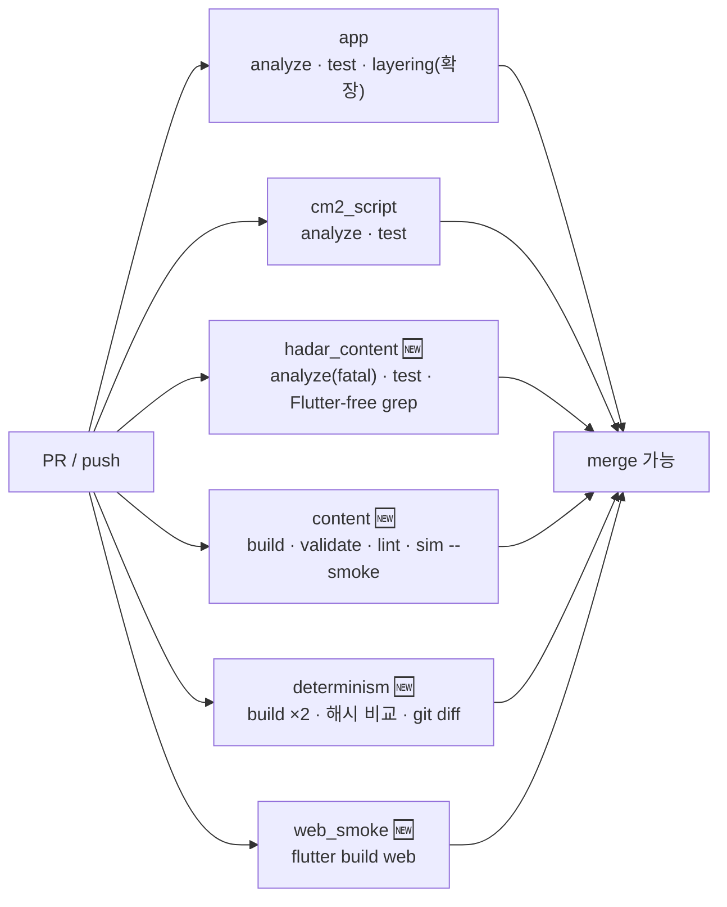

# 콘텐츠 빌드·CI·결정론

> `상태: 보류` — **설계는 유효하나 현재 노선에서는 구현하지 않는다.**
> 지금 노선은 원작 방식(플래그 + cm2)의 **sample-first** 다 → [`issues/MILESTONES.md`](../issues/MILESTONES.md).
> 이 장이 필요해지는 신호는 [`issues/MILESTONES.md` §5](../issues/MILESTONES.md) 에 있다. **읽고 바로 구현하지 말 것.**

> **문서 ID**: BP-35 · **상태**: 개정 2판(D-28·D-30 반영) · **선행 문서**: [BP-20](20_target_architecture.md) · [BP-21](21_content_pack_spec.md) · [BP-33](33_validation_and_lint.md)
> **독자**: CI 담당 · 빌드 툴 구현자 · 릴리스 담당
> **한 줄 요약**: 콘텐츠 소스를 결정론적으로 굽는 6단계 파이프라인, 세 산출물의 실제 스키마, 그리고 현행 `ci.yml` 2개 잡에 무엇을 어떤 YAML 로 더할지 확정한다.

**파이프라인 구획**(D-01): 이 장은 **Build 구획 전체**와 그 검증을 다룬다. LLM 은 여기 없다.
**이 장이 SSoT 인 것**(D-18): CI 워크플로 구성, `content.bundle.json` / `content.index.json` /
`content.lock.json` 의 산출물 스키마, 결정론 규약(정규 JSON·정렬·해시), 릴리스 절차,
그리고 **`chanceSeedId` 생성 절차**(§1.4.1 — D-30 이 이 장에 지정).

**개정 이력**

| 판 | 반영 내용 |
|---|---|
| 초판 | 6단계 파이프라인 · 산출물 3종 스키마 · 결정론 규약 · CI 잡 4개 · 릴리스·부채 정리 |
| **개정 2판** | **D-30** — `chanceSeedId` **생성 절차 §1.4.1 신설**(BP-90 `I-06` 이 지적한 공백), §2.3 해시 표의 `chance` 행을 `mix` 로 교체하고 초판 행을 폐기 표시, `lock.chanceSeedIds`/`chanceSeedIdsHash` 신설, `determinism` 잡에 충돌·프로파일 검사 스텝 추가, R-35-6 보강(`_srcPath`). **D-28** — 트리거 인덱스가 맵 `region` 을 읽지 않음을 규약으로 고정(R-35-8a); 이 장에는 폐기할 region 규칙이 **없었음**을 명시 |
**이 장이 SSoT 가 아닌 것**: 검증 규칙 자체는 [BP-33](33_validation_and_lint.md), 소스 포맷과 DSL 은
[BP-21](21_content_pack_spec.md), 세이브 봉투는 [BP-25](25_world_state_and_save.md),
시뮬레이터 내부는 [BP-34](34_headless_sim_and_solver.md) 가 소유한다.

---

## 1. 빌드 파이프라인

### 1.1 6단계 요약

```
 [소스 팩 N개]
      │
  ①  discover      팩 발견 · 의존 위상 정렬          → PackGraph
      │
  ②  normalize     파싱 · L1 검증 · 정규형 변환      → NormalizedPack[]      (BP-33 L1)
      │
  ③  link          병합 · 심볼 테이블 · L2 검증      → LinkedWorld           (BP-33 L2)
      │
  ④  analyze       그래프 L3 검증 · 역참조 인덱스     → LinkedWorld + Xref    (BP-33 L3)
      │
  ⑤  emit          번들 · 트리거 인덱스 · 줄바꿈 선계산 → bundle.json, index.json
      │
  ⑥  lock          해시 · legacyFlagMap · 예산 검사   → lock.json
      │
 [assets/content/build/ 3파일]
```

| # | 단계 | 입력 | 출력 | 실패 시 | 결정론 요건 |
|---|---|---|---|---|---|
| ① | `discover` | `assets/content/*/pack.json` | `PackGraph`(위상 정렬된 팩 목록) | 의존 사이클·미존재 팩 → 즉시 중단, 종료 코드 2 | 팩 순서는 **위상 정렬 + 동률 시 팩 id 사전순** |
| ② | `normalize` | 팩별 소스 파일 | `NormalizedPack`(기본값 채움, Condition 정규형, 문자열 인라인 검출) | L1 ERROR 를 **전부 모아** 보고 후 중단 | 파일 방문 순서 = 경로 사전순. 병렬 처리 후 재정렬(R-33-31) |
| ③ | `link` | `NormalizedPack[]` | `LinkedWorld`(전역 심볼 테이블 + 병합 결과) | L2 ERROR 전부 모아 보고 후 중단 | 심볼 테이블은 `SplayTreeMap`(정렬 유지) |
| ④ | `analyze` | `LinkedWorld` | + 역참조 인덱스(`Xref`), 도달성 결과 | L3 ERROR 전부 모아 보고 후 중단 | 그래프 순회는 인접 리스트를 **id 사전순 정렬 후** 방문 |
| ⑤ | `emit` | `LinkedWorld` + `Xref` + 맵 JSON | `content.bundle.json`, `content.index.json` | 예산 초과는 경고, 직렬화 실패는 크래시(버그) | §2.1 정규 JSON 규약 |
| ⑥ | `lock` | 위 두 산출물 + 소스 해시 | `content.lock.json` | 예산 하드 상한 초과 시 ERROR | 해시 대상·순서 고정 |

- **R-35-1** ②③④ 는 **오류를 모아서 보고한다**(fail-collect). 첫 오류에서 멈추면 생성 에이전트가
  한 번에 하나씩만 고치게 되어 재시도 횟수가 폭증한다([BP-33 §7.3](33_validation_and_lint.md) 의 AI 포맷은
  한 번에 12건을 준다).
- **R-35-2** 단계 **사이**에서는 fail-fast 다. ② 가 ERROR 를 내면 ③ 을 시작하지 않는다(R-33-2).
- **R-35-3** ⑤ 이후는 **오류가 없다**. `emit` 이 실패하면 그것은 콘텐츠 문제가 아니라 빌드 버그이며
  스택 트레이스와 함께 종료 코드 70(내부 오류)으로 죽는다.

### 1.2 단계별 상세

#### ① discover

```
입력: assets/content/ 하위에서 pack.json 을 가진 디렉토리 전량
처리: 1. pack.json 파싱(L1 최소 검사: id/version/schemaVersion/dependsOn)
      2. 디렉토리명 == pack.json#id 확인
      3. dependsOn 그래프 위상 정렬 (Kahn). 사이클 → V-L2-025
      4. schemaVersion 이 CLI 지원 범위 밖이면 중단
출력: PackGraph { order: [packId], manifests: {packId: PackManifest} }
```

- **R-35-4** `build/` 디렉토리는 팩이 아니다. 예약 팩 id(`build` 포함, R-21-15)를 가진 디렉토리를
  발견하면 `V-L1-017` ERROR.

#### ② normalize — "정규형" 이 무엇인가

정규화는 **의미를 바꾸지 않고 표현을 하나로 모으는** 변환이다. 결정론과 해시 안정성의 전제다.

| 변환 | 예 | 이유 |
|---|---|---|
| 생략된 기본값 채움 | `optional` 없음 → `"optional": false`, `count` 없음 → `"count": 1` | 런타임이 `??` 분기를 하지 않게. 해시가 표기 차이에 흔들리지 않게 |
| `_` 접두 필드 제거 | `_note`, `_toneHint`, `debugLabel` 삭제 | 산출물에 주석이 남으면 페이로드 낭비(R-21-20 예외 필드) |
| Condition 정규형 | `{"op":"and","args":[X]}` → `X` (단항 and/or 축약), 중첩 `and` 평탄화, `not(not(X))` → `X` | 같은 의미의 두 표기가 다른 해시를 만들지 않게 |
| Effect 정규형 | 배열 유지(순서가 의미). 인접한 동일 `add_var` 를 **합치지 않는다** | 합치면 `var_changed` 이벤트 수가 바뀐다(BP-23 §23.11) |
| 문자열 키 정렬 | `strings/ko.json` 키 사전순 | diff 안정 |
| 좌표 정규화 | `x`/`y` 를 int 로 강제(문자열 숫자 거부) | `V-L1-005` |
| **액터 `states` 보존** | 소스의 객체 배열 `[{id,_desc,terminal,from}]` 에서 `_desc` 만 제거하고 **`id`/`terminal`/`from` 을 그대로 유지**. `initialState` 도 그대로 싣는다 | `E13 set_npc_state` 의 `from` 전이 제약을 **런타임이 검사해야** 하므로 축약할 수 없다(BP-90 I-19) |

- **R-35-4b (형태와 의미의 분업)** 이 장은 **직렬화 형태만** 정한다. 필드의 존재·의미·기본값은
  소유 장(BP-22/23/24/26)이 정하며, 정규화는 **필드를 삭제하거나 타입을 축약할 수 없다** —
  `_` 접두 주석 필드 제거만이 유일한 손실 변환이다. 이것이 `R-35-10` 의 구체적 형태다.

- **R-35-5** Condition 정규형 변환은 **평가 결과를 바꾸지 않음이 T-33-A 공유 벡터 테스트로 증명**되어야
  한다. 정규화 전후 조건을 같은 `WorldState` 로 평가해 결과가 다르면 빌드 크래시.
- **R-35-6** 정규화는 `chance` 를 **건드리지 않는다**. `chance` 의 `evalPath`(BP-21 §6.5)가
  구조적 경로이므로, 조건식을 평탄화하면 시드 유도값이 바뀌어 **기존 세이브의 분기가 뒤집힌다**.
  따라서 `and`/`or` 평탄화는 **서브트리에 `chance` 가 없을 때만** 적용한다.
  - **보강(D-30)**: 이 규칙만으로는 부족하다 — `chance` 를 **포함하지 않는** 형제 서브트리가
    평탄화되어도 `args` 인덱스가 밀려 옆에 있던 `chance` 의 경로가 바뀐다. 따라서 ② 는
    정규화 **전에** 소스 구조 경로를 `_srcPath` 로 붙여 둔다(`R-35-8b`, §1.4.1 (a)).
    경로 정규화 규칙 7항의 정본은 [BP-21 `R-21-34a`](21_content_pack_spec.md) 다.

#### ③ link

```
입력: NormalizedPack[] (위상 순)
처리: 1. 팩 순서대로 심볼 테이블에 정의를 등록. 중복 정의 → V-L2-015
      2. 모든 참조를 심볼 테이블로 해소 (L2 규칙 26개)
      3. retiredIds 치환(replacedBy 있으면 자동 치환 + WARN)
      4. 팩 가시성 검사(dependsOn)
출력: LinkedWorld { actors, items, places, quests, dialogues, anchors, encounters, strings, factions, lore }
```

- **R-35-7** 병합은 **덮어쓰기가 아니라 합집합**이다. 같은 ID 를 두 팩이 정의하면 나중 팩이 이기는 것이
  아니라 **하드 실패**한다(R-21-19). "덮어쓰기로 확장" 은 어느 팩이 이기는지가 로드 순서에 달리므로
  결정론과 롤백 가능성을 동시에 깬다.

#### ④ analyze

L3 그래프 검증(BP-33 §4.3)과 **역참조 인덱스 생성**을 겸한다. 인덱스는 ⑤ 의 입력이면서
증분 검사(BP-33 §8.3)와 생성 컨텍스트(D-14 1단계)의 자료이기도 하다.

#### ⑤ emit

네 가지를 계산해 굽는다.

| 산출 | 계산 |
|---|---|
| 병합 콘텐츠 | `LinkedWorld` 를 §1.4 스키마로 직렬화 |
| 트리거 인덱스 | 앵커를 `(map,x,y,action)` 으로 접고 `priority` 내림차순 정렬(R-26-14). **입력은 `anchors/*.json` 뿐이다 — 맵 데이터의 어떤 레이어도 읽지 않는다**(R-35-8a) |
| **`chanceSeedId`** | 모든 `chance` 노드에 빌드 상수를 부여해 번들에 굽는다 (§1.4.1) |
| **줄바꿈 선계산** | 각 대화 노드의 wrapped 줄 수를 `HDTextUtils.splitToLines` 와 같은 어절 규칙 + 한글 16px/반각 8px 근사로 계산해 `_wrap` 에 굽는다([BP-24 §24.5.6](24_dialogue_model.md)) |
| **이벤트 발행 지점 레지스트리** | 선언 파일 + 코드 대조로 이벤트 12종의 `published`/`unpublished` 를 확정해 `content.index.json#eventPublishers` 에 굽는다 (D-26, §1.5.1) |

- **R-35-8a** (D-27 · **D-28 로 확정**) 트리거 인덱스는 **앵커 소스만** 입력으로 받는다.
  맵 JSON 의 `region`(z5) 레이어를 읽는 빌드 단계는 **없고, 앞으로도 만들지 않는다.**
  - BP-26 초판은 region 200~255 를 트리거 예약 대역으로 쓰는 안을 갖고 있었고, 그 안의 T1 변형
    (`map_loader.dart` 를 고쳐 값을 상위 바이트로 승격)은 **기술적으로 작동**했다.
    **D-28 이 최종 기각**했다 — 누가 region 레이어를 지우면 트리거가 소실되므로 D-09(의미와 좌표의 분리)가
    무너진다. 기각 비교표는 D-28 에 있으므로 옮겨 적지 않는다(D-25).
  - **이 장에는 폐기할 region 규칙·태스크가 없다** — 초판이 region 을 빌드 입력으로 쓴 적이 없기 때문이다.
    이 항목은 그 사실을 **명시적 규약으로 고정**해 나중에 다시 제안되는 것을 막는다.
  - `mapSources` 해시(§2.3)는 맵 파일 **전체 바이트**를 잠그므로 region 값 변경도 재빌드를 유발한다.
    그러나 그것은 앵커-통행 검증(`V-MAP-*`)을 다시 돌리기 위한 것이고, **트리거 발화와는 무관**하다.
- **R-35-8** 줄바꿈 선계산은 런타임의 `TextPainter` 측정을 대체한다. 런타임은 절대 재측정하지 않는다 —
  측정 결과가 플랫폼 폰트에 따라 달라지면 페이지 분할이 비결정이 되기 때문이다.

#### ⑥ lock

소스 해시·산출물 해시·`legacyFlagMap`·예산 측정치를 기록한다. §2.3 참조.

### 1.3 실패 처리와 종료 코드

> **범위 한정 (필수)**: 아래 표는 **`build` / `validate` / `lint` 세 서브커맨드 전용**이다.
> `sim` / `solve` / `fuzz` 의 종료 코드는 [BP-34 §8.5](34_headless_sim_and_solver.md) 가 소유하며
> **같은 값에 다른 의미**를 준다(예: `2` — 여기서는 "콘텐츠 오류·차단", 거기서는 "미확정·차단 안 함").
> 전역 종료 코드표의 통합·확정은 **[BP-30](30_toolchain_overview.md) 소관**이며 아직 확정되지 않았다(Q-35-8).
> 그때까지 **CI 는 서브커맨드별로 다르게 해석해야 한다** — §4.4 의 `content` 잡은
> `build`/`validate`/`lint` 만 부르므로 아래 표만 적용되고, `sim` 스텝은 BP-34 표를 따른다.

| 코드 | 의미 | 발생 단계 |
|---|---|---|
| `0` | 성공 (WARN 은 있을 수 있음) | — |
| `1` | 사용법 오류(잘못된 인자, 팩 미지정) | 진입 |
| `2` | **콘텐츠 오류** — ERROR 진단 1건 이상 | ②③④, `validate`, `lint --strict` |
| `3` | 예산 하드 상한 초과 | ⑥ |
| `4` | 결정론 위반(재빌드 해시 불일치) | `build --verify` |
| `70` | 내부 오류(빌드 버그) | ⑤ 이후 어디든 |

### 1.4 `content.bundle.json` 스키마

런타임 `ContentRepository` 가 읽는 **유일한** 콘텐츠 파일이다.

```json
{
  "$schema": "https://hadar2026/schema/content.bundle.json",
  "formatVersion": 1,
  "schemaVersion": 1,
  "packs": [
    { "id": "core",    "version": "1.0.0", "dependsOn": [] },
    { "id": "gen_ep1", "version": "0.4.0", "dependsOn": ["core"] }
  ],
  "strings": {
    "str.core.npc.lore_gate_guard.name": "성문 위병",
    "str.gen_ep1.dlg.wife_plea.node.intro.line.0": "제 남편이 돌아오지 않습니다."
  },
  "actors": {
    "npc.core.lore_gate_guard": {
      "pack": "core",
      "name": "str.core.npc.lore_gate_guard.name",
      "role": "guard",
      "faction": "faction.core.lore_order",
      "place": "place.core.lore_castle",
      "initialState": "idle",
      "states": [
        { "id": "idle",    "terminal": false, "from": [] },
        { "id": "alerted", "terminal": false, "from": ["idle"] }
      ],
      "dialogueRouting": [
        { "when": {"op":"quest_stage","id":"quest.gen_ep1.missing_scholar","stage":"ask_guard"},
          "go": "dlg.gen_ep1.guard_about_scholar" },
        { "go": "dlg.core.guard_smalltalk" }
      ],
      "sprite": { "objTile": 132 }
    }
  },
  "items":   { "item.core.rusty_key": { "pack": "core", "name": "str.core.item.rusty_key.name", "grade": 1, "stackable": false, "unique": true } },
  "places":  { "place.core.lore_castle": { "pack": "core", "map": "TOWN1", "danger": 1, "regions": [{"x":0,"y":0,"w":100,"h":100}] } },
  "factions":{ "faction.core.lore_order": { "pack": "core", "relations": { "faction.core.necro_cult": -3 } } },
  "lore":    { "lore.core.founding_of_lore": { "pack": "core", "order": 1, "visibility": "public", "knownBy": [] } },
  "encounters": { "enc.core.menace_patrol": { "pack": "core", "kind": "random", "members": [ {"enemy": 12, "count": 2} ] } },
  "quests": {
    "quest.gen_ep1.missing_scholar": {
      "pack": "gen_ep1", "act": 1, "tier": 2,
      "title": "str.gen_ep1.quest.missing_scholar.title",
      "summary": "str.gen_ep1.quest.missing_scholar.summary",
      "giver": "npc.gen_ep1.scholar_wife",
      "entryStage": "s1_hear_plea",
      "prerequisites": {"op":"true"},
      "stages": [ { "id": "s1_hear_plea", "index": 0, "completion": "all",
                    "objectives": [ {"id":"o_talk_wife","kind":"talk_to","params":{"actor":"npc.gen_ep1.scholar_wife"},
                                     "optional": false, "hidden": false, "counter": {"target": 1}} ],
                    "onEnter": [], "onExit": [], "next": "s2_ask_guard" } ],
      "onComplete": [], "onFail": [], "rewards": [ {"do":"grant_exp","amount":4000} ],
      "tags": ["main"]
    }
  },
  "dialogues": {
    "dlg.gen_ep1.wife_plea": {
      "pack": "gen_ep1", "speaker": "npc.gen_ep1.scholar_wife", "maxDepth": 32,
      "entry": [ {"go":"n_intro"} ],
      "nodes": {
        "n_intro": {
          "id": "n_intro",
          "header": "str.gen_ep1.dlg.wife_plea.node.intro.header",
          "lines":  ["str.gen_ep1.dlg.wife_plea.node.intro.line.0"],
          "onEnter": [],
          "choices": [
            {"id":"c_accept","text":"str.gen_ep1.dlg.wife_plea.choice.intro.accept",
             "effects":[{"do":"start_quest","id":"quest.gen_ep1.missing_scholar"}],"go":"end"},
            {"id":"c_decline","text":"str.gen_ep1.dlg.wife_plea.choice.intro.decline","go":"end"}
          ],
          "_wrap": { "lines": [1], "headerLines": 1, "pageBudget": 7, "pages": 1 }
        }
      }
    }
  },
  "anchors": {
    "anchor.core.town1_gate_guard": {
      "pack": "core", "map": "TOWN1", "kind": "actor",
      "actor": "npc.core.lore_gate_guard", "x": 34, "y": 12, "facing": "down",
      "priority": 0, "when": {"op":"true"}, "once": false
    }
  }
}
```

| 최상위 키 | 타입 | 비고 |
|---|---|---|
| `formatVersion` | int | **번들 파일 포맷** 버전. 스키마 버전과 별개이며 이 장이 소유 |
| `schemaVersion` | int | 콘텐츠 스키마 버전([BP-21 §7](21_content_pack_spec.md)) |
| `packs` | array | 위상 순. 런타임이 `contentVersion` 대조에 씀([BP-25 §7](25_world_state_and_save.md)) |
| `strings` | object | **플랫**. 팩 전량 병합. 키 사전순 |
| `actors`/`items`/`places`/`factions`/`lore`/`encounters`/`quests`/`dialogues`/`anchors` | object | ID → 엔티티. 각 엔티티에 `pack` 필드가 붙어 출처를 남긴다 |
| `_wrap` | object | ⑤ 가 계산한 줄바꿈 선계산 결과. `_` 접두이지만 **예외적으로 산출물에 남는다**(런타임이 읽음) |

> **예시가 정규화 규칙을 지킨다**: `anchors` 항목의 `when`/`once`, 액터의 `initialState`,
> objective 의 `optional`/`hidden`/`counter` 는 소스에서 생략 가능하지만 번들에는 **전부 채워져** 있다
> (§1.2 ② "생략된 기본값 채움"). 런타임이 `??` 분기를 하지 않는 것이 목적이다.

- **R-35-9** 번들에는 **소스에만 있던 필드가 남지 않는다**. `_note`·`_toneHint`·`_gen/` 은 전부 제거된다.
  단 `_wrap` 은 빌드가 생성한 런타임 입력이므로 남는다 — `_` 접두 제거 규칙의 유일한 예외다.
- **R-35-10** 엔티티 스키마의 필드 정의는 이 장이 **재정의하지 않는다**. 위 예시는 직렬화 형태를
  보이기 위한 것이며, 필드의 의미는 BP-22/23/24/26 이 정본이다(D-18).

### 1.4.1 `chanceSeedId` 를 굽는 절차 (**이 절이 SSoT** — D-29a · D-30)

[BP-90](90_appendix_schemas.md) `I-06` 이 적발한 공백이다: **§1.4/§1.6 어디에도 `chanceSeedId` 를 굽는다는
서술이 없었다.** D-21 은 "빌드가 부여하고 번들에 굽는다" 고만 했고, D-29a 가 그 정수에 이름을 주었고,
D-30 이 생성 소관을 이 장으로 지정했다.

**소유 경계 (D-18 준수)**

| 대상 | 소유 |
|---|---|
| `chanceKey` 의 이름·형식(`<contextId>#<evalPath>`)·경로 정규화 7항(`R-21-34a`) | [BP-21 §6.5](21_content_pack_spec.md) |
| `chanceSeedId` 의 형식·런타임 소비 방법·`mix`/`hashString` 구현 | [BP-27 §9.2](27_runtime_engine.md) |
| **생성 절차**(어느 단계에서, 무엇을 순회해, 어떻게 계산해, 어디에 굽는가) + **결정론 보장** | **이 절** |

이 절은 위 두 장의 정의를 **재서술하지 않는다**(D-25). 유도식도 여기 옮겨 적지 않는다 —
정본은 [BP-21 §6.5](21_content_pack_spec.md) 다.

#### (a) 어느 단계에서

**⑤ `emit` 의 첫 작업**이다. ②③④ 중 어디도 아니다.

| 단계 | `chanceSeedId` 를 굽지 않는 이유 |
|---|---|
| ② `normalize` | 정규화가 조건식 **모양을 바꾸므로**(단항 축약·평탄화) 여기서 경로를 뜨면 `evalPath` 가 정규화 산물이 된다. `R-21-34a` 규칙 5 는 **정규화 *전* 소스 구조의 경로**를 요구한다 |
| ③ `link` | 팩 병합 중에는 `contextId` 가 확정되지만 엔티티 내부 구조 순회를 두 번 하게 된다(③ 과 ⑤). 한 번으로 줄인다 |
| ④ `analyze` | 그래프 검증 단계다. 산출물 필드를 만드는 단계가 아니다(R-35-3: ⑤ 이후는 오류가 없다) |
| **⑤ `emit`** | **직렬화하는 그 자리에서** 굽는다. 순회 대상이 곧 산출물이므로 "굽지 못한 노드" 가 원리적으로 생길 수 없다 |

- **R-35-8b** ② `normalize` 는 **소스 구조 경로를 `_srcPath` 로 각 `chance` 노드에 붙여 둔다.**
  정규화가 모양을 바꾸기 *전에* 뜬 경로다. ⑤ 는 이 값을 읽어 `chanceKey` 를 만들고 `_srcPath` 는 버린다.
  - 이것이 `R-35-6`(§1.2 ② — `chance` 서브트리 평탄화 금지)의 **보강**이다. R-35-6 만으로는
    `chance` 를 **포함하지 않는** 형제 서브트리가 평탄화되어 `args` 인덱스가 밀리는 경우를 막지 못한다.
    `_srcPath` 는 그 경우에도 원래 인덱스를 보존한다.
  - `_` 접두 필드이므로 R-35-9 에 따라 산출물에 남지 않는다(`_wrap` 과 달리 런타임이 읽지 않는다).

#### (b) 무엇을 순회해

**`Condition` 이 나타날 수 있는 모든 슬롯**을 소유 장 스키마 순서대로 훑는다.
슬롯 목록은 이 장이 정의하지 않고 소유 장에서 읽는다 — 아래는 **순회 대상의 출처**만 지정한 표다.

| `contextId` 가 되는 엔티티 | Condition 슬롯의 정의 위치 |
|---|---|
| `quest.*` | [BP-23](23_quest_model.md) — `prerequisites` · `failConditions` · `stages[].objectives[].when` · `stages[].next[].when` |
| `dlg.*` | [BP-24](24_dialogue_model.md) — `entry[].when` · `nodes.*.choices[].when` |
| `anchor.*` | [BP-26](26_entity_registry_and_anchors.md) — `when` |
| `npc.*` | [BP-22](22_world_bible_model.md) — `dialogueRouting[].when` |
| `item.*` | [BP-42](42_item_and_inventory.md) — 사용 조건(장이 생기면) |

- **R-35-8c** 순회는 **깊이 우선, 필드는 소유 장 스키마 선언 순서, 배열은 인덱스 오름차순**이다.
  같은 소스에서 항상 같은 순서로 방문해야 `chanceKey` 집합이 재현된다.
- **R-35-8d** 순회 대상 슬롯이 **소유 장에 새로 생기면 이 표를 갱신해야 한다.** 갱신을 잊으면
  그 슬롯의 `chance` 는 `chanceSeedId` 없이 번들에 실리고, **런타임이 시드를 만들 수 없다.**
  그 조용한 실패는 [BP-33](33_validation_and_lint.md) `V-DET-015`(번들의 모든 `chance` 에
  `chanceSeedId` 가 있는가)가 잡는다 — **이 표의 누락을 기계가 검출하는 구조**다.

#### (c) 어떻게 계산해

```
for each entity E in LinkedWorld (엔티티 타입별로 ID 사전순):
  for each chance node N in E (R-35-8c 순회 순서):
    chanceKey    = E.id + "#" + N._srcPath          // R-21-34a 정규화를 만족해야 한다
    chanceSeedId = mix([hashString(chanceKey)])     // 구현: BP-27 §9.2
    N.chanceSeedId = chanceSeedId                   // 번들의 Condition 노드에 굽는다
    N._srcPath 삭제
    record(chanceKey -> chanceSeedId)               // (e) 의 증빙용
```

- **R-35-8e** `chanceKey` 는 계산 직후 `R-21-34a` 의 7항을 **검사한 뒤** 해시한다.
  위반은 빌드 버그이므로 종료 코드 70(R-35-3)이다 — 콘텐츠 오류가 아니다.
  (콘텐츠가 만들 수 있는 위반은 없다. 경로는 빌드가 생성하기 때문이다.)
- **R-35-8f** 해시는 **빌드에서 한 번만** 한다. 런타임은 정수만 섞는다(D-29a).
  런타임이 문자열 해시를 다시 하면 (i) 번들에 문자열을 실어야 하고(페이로드 낭비),
  (ii) 웹/VM 문자열 정규화 차이가 값을 갈라 놓을 수 있다.
- **R-35-8g** 선택 필드 `seedKey`([BP-21 Q-21-3](21_content_pack_spec.md))가 소스에 있으면
  `chanceKey = E.id + "#seedKey:" + seedKey` 로 대체한다. **구조 경로를 쓰지 않는다** —
  그것이 `seedKey` 의 존재 이유(대화를 고쳐도 기존 세이브의 분기가 유지된다)다.
  `seedKey:` 접두는 구조 경로와 **충돌할 수 없는** 형태여야 한다(`R-21-34a` 규칙 1~3 은 `:` 를 쓰지 않는다).

#### (d) 어디에 굽는가

| 위치 | 내용 | 읽는 쪽 |
|---|---|---|
| `content.bundle.json` 의 각 `chance` Condition 노드 | `chanceSeedId: int` | 런타임 `ConditionEvaluator`([BP-27 §9.2](27_runtime_engine.md)) |
| `content.lock.json#chanceSeedIds` | `chanceKey → chanceSeedId` 전량(키 사전순) | 사람·리뷰·`V-DET-012` 충돌 검출 |
| `content.lock.json#chanceSeedIdsHash` | 위 맵의 SHA-256 | 세이브 안정성 리뷰(아래 R-35-8i) |

- **R-35-8h** 번들의 `chance` 노드는 `chanceSeedId` 를 **필수로** 갖는다. 소스에는 **쓸 수 없다**
  (`additionalProperties: false`, [BP-21 §6.8](21_content_pack_spec.md)). 이 소스↔번들 프로파일 차이는
  한 JSON Schema 로 표현할 수 없으므로 [BP-33](33_validation_and_lint.md) 의 `V-DET-014`/`V-DET-015` 쌍이 강제한다.
- **R-35-8i** `chanceSeedIds` 를 lock 에 **전량** 싣는 이유: [BP-27 `Q-27-5`](27_runtime_engine.md) 가
  등록한 위험 — "조건 배열 순서를 바꾸면 기존 세이브의 `chance` 결과가 달라진다" — 를
  **PR diff 에서 눈에 보이게** 만들기 위해서다. 값이 아니라 **키 집합의 변동**이 신호다.
  patch 릴리스 PR 에서 이 맵이 변하면 리뷰어가 막아야 한다.
  예산은 §3.3 의 `lockBytes` 에 포함되며, `chance` 노드는 콘텐츠 전체에서 수십 개 규모라 지배항이 아니다.

#### (e) 결정론 보장 — 같은 소스 → 같은 `chanceSeedId`

| # | 보장 | 근거 |
|---|---|---|
| 1 | `chanceKey` 문자열이 재현된다 | `R-21-34a` 정규화 7항 + `R-35-8b`(정규화 전 경로) + `R-35-8c`(순회 순서 고정) |
| 2 | 해시가 재현된다 | `mix`/`hashString` 이 상태 없는 순수 함수이고 **웹/VM 동치가 테스트로 고정**된다([BP-27](27_runtime_engine.md) T-27-33) |
| 3 | 굽는 위치가 재현된다 | ⑤ `emit` 의 순회가 곧 직렬화 순회이므로 순서가 하나뿐이다 |
| 4 | 재빌드가 검증된다 | §4.5 `determinism` 잡이 두 번 구워 `content.lock.json` 을 비교한다 → `chanceSeedIds` 가 다르면 `V-DET-001` |
| 5 | 충돌이 검출된다 | 서로 다른 두 `chanceKey` 가 같은 정수로 접히면 `V-DET-012` **하드 실패**(BP-27 §9.2 가 이 장·BP-33 에 요청) |

- **R-35-8j** 5번은 **`record()` 가 삽입 시 이미 존재하는 값인지 확인**하는 것으로 구현한다.
  빌드 후 별도 패스를 돌지 않는다 — 첫 충돌 지점의 두 `chanceKey` 를 **둘 다** 진단에 실어야
  작성자가 어느 쪽을 고칠지 판단할 수 있기 때문이다.
- **R-35-8k** `chanceSeedId` 는 `buildInputHash` 의 **입력이 아니라 산출물**이다.
  소스 해시가 같으면 `chanceSeedIds` 도 같아야 한다 — 그 역은 성립하지 않는다(해시 충돌).
  따라서 증분 빌드 캐시 키에 `chanceSeedIds` 를 넣지 않는다.

### 1.5 `content.index.json` 스키마

```json
{
  "$schema": "https://hadar2026/schema/content.index.json",
  "formatVersion": 1,
  "triggers": {
    "TOWN1": {
      "34,12": { "talk":  ["anchor.core.town1_gate_guard"] },
      "30,18": { "sign":  ["anchor.core.town1_notice"] },
      "50,99": { "enter": ["anchor.core.town1_to_ground"] },
      "61,82": { "event": ["anchor.gen_ep1.crypt_scholar_clue", "anchor.core.town1_crypt_secret"] }
    }
  },
  "byActor":   { "npc.core.lore_gate_guard": ["anchor.core.town1_gate_guard"] },
  "byQuestObjective": { "defeat:enc.core.menace_patrol": ["quest.gen_ep1.missing_scholar#s3_clear/o_clear"] },
  "registry": {
    "npc.core.lore_gate_guard": {
      "kind": "actor", "pack": "core",
      "definedIn": "core/actors/lore_gate_guard.json",
      "anchoredAt": [ { "map": "TOWN1", "x": 34, "y": 12, "anchor": "anchor.core.town1_gate_guard" } ],
      "referencedBy": {
        "dialogue":   ["dlg.core.gate_guard_idle", "dlg.gen_ep1.guard_about_scholar"],
        "quests":     ["quest.gen_ep1.missing_scholar"],
        "objectives": ["quest.gen_ep1.missing_scholar#s2_ask_guard/o_talk_guard"],
        "anchors":    ["anchor.core.town1_gate_guard"],
        "lore":       []
      }
    },
    "item.core.rusty_key": {
      "kind": "item", "pack": "core",
      "definedIn": "core/items/items.json",
      "givenBy":    ["quest.gen_ep1.missing_scholar#rewards[3]"],
      "takenBy":    [],
      "requiredBy": ["dlg.core.crypt_door#node.locked/c_open"],
      "referencedBy": { "conditions": 1, "effects": 1 }
    },
    "flag.gen_ep1.quest.missing_scholar.met_client": {
      "kind": "flag", "pack": "gen_ep1",
      "writtenBy": ["dlg.gen_ep1.wife_plea#node.intro/c_accept.effects[0]"],
      "readBy":    ["quest.gen_ep1.missing_scholar#prerequisites"]
    }
  },
  "eventPublishers": {
    "battle_won":  { "status": "published",   "sites": ["HDBattle.gotoEndBattle:win"] },
    "enter_place": { "status": "unpublished", "blockedBy": ["place \uac1c\ub150 \ubbf8\uad6c\ud604 (BP-22)"] },
    "item_gained": { "status": "unpublished", "blockedBy": ["\uc778\ubca4\ud1a0\ub9ac \ubbf8\uad6c\ud604 (BP-42)"] },
    "item_lost":   { "status": "unpublished", "blockedBy": ["\uc778\ubca4\ud1a0\ub9ac \ubbf8\uad6c\ud604 (BP-42)"] },
    "talk":        { "status": "published",   "sites": ["ContentRuntime.tryHandle:actorAnchor"] }
  },
  "aliases": {
    "place.core.menace": ["MENACE", "메너스", "금광"],
    "npc.core.necromancer": ["Necromancer", "네크로맨서"]
  },
  "mapResolution": {
    "TOWN1":  { "id": 4, "json": "TOWN1.json",  "cm2": null, "width": 100, "height": 100 },
    "DEN1":   { "id": 6, "json": "DEN1.json",   "cm2": null, "width": 50,  "height": 50 }
  },
  "stats": { "actors": 12, "quests": 7, "dialogues": 23, "nodes": 150, "anchors": 34, "strings": 418 }
}
```

| 섹션 | 소비자 | 근거 |
|---|---|---|
| `triggers` | 런타임 `TriggerIndex`([BP-26 §4](26_entity_registry_and_anchors.md)) | 타일 상호작용 O(1) 조회 |
| `byActor`/`byQuestObjective` | 런타임 + 린트 | 목표 진행 매핑 |
| `registry` | 린트(RG-01~08), 증분 검사, 생성 컨텍스트 | 필드 의미는 [BP-26 §5.3](26_entity_registry_and_anchors.md) 소유 |
| `eventPublishers` | **솔버의 `SUPPORTED`/`UNSUPPORTED` 판정**(D-26), 릴리스 게이트 | §1.5.1 |
| `aliases` | L4 지식 범위 매칭(Aho–Corasick 사전) | [BP-33 §8.2](33_validation_and_lint.md) |
| `mapResolution` | 앵커 검증, `V-MAP-016`, 런타임 맵 로드 | 부록 D-1 파손 검출을 **빌드가 확정**해 둔다 |
| `stats` | 리포트·예산 | — |

- **R-35-11b (역참조 레지스트리 소유권 중재)** 이 섹션의 키 이름은 **`registry`** 이며,
  **필드 집합·타입은 [BP-26 §5.2/§5.3](26_entity_registry_and_anchors.md) 의 것을 그대로 채택**한다.
  초판 BP-35 가 `xref` 라는 다른 이름과 축약형(`anchoredAt` 을 문자열 배열로)을 쓴 것은 오류였다 —
  축약하면 `RG-04`(배치되지 않은 액터)·`V-MAP-008`(같은 맵 2회 배치) 판정에 필요한 좌표가 사라진다.
  **파일 스키마(키 이름·`formatVersion`·직렬화 형태)는 이 장이 소유하고, 그 안에 들어가는 필드의
  의미는 BP-26 이 소유한다**(D-18 의 소유권 표에 이 행이 없어 충돌했던 부분의 해소안).
- **R-35-11** `mapResolution` 은 빌드가 `MapInfos.json` 을 `map_navigation.dart:30-51` 과
  **똑같은 순서로** 해석해 굽는다. 해석 결과 파일이 없으면 그 자리에서 `V-MAP-016` ERROR 다.
  즉 부록 D-1 의 7건은 **빌드를 통과할 수 없다** — 그것이 이 인덱스를 만드는 첫 번째 이유다.

#### 1.5.1 `eventPublishers` — 이벤트 발행 지점 레지스트리 (D-26, **이 장 소유**)

**왜 필요한가**: [BP-91](91_appendix_worked_example.md) 이 드러낸 결함 — `deliver`/`acquire` 목표는
`item_gained`/`item_lost` 이벤트에 의존하는데 D-20 은 그 두 이벤트가 **인벤토리 부재로 현재 미발행**임을
명시한다. 그런데 솔버는 그 퀘스트에 `PROVEN` 을 냈다. **정적 증명이 실행 가능성을 보지 않았기 때문**이다.
D-26 은 이를 2축 판정으로 갈랐고, **레지스트리 생성을 이 장에 지정**했다.

**대상 이벤트 이름 집합은 [BP-23 §23.11.1](23_quest_model.md) 의 12행 표가 정본**이다(D-20).
이 장은 그 표를 옮겨 적지 않고 **이름을 키로 삼아 값만 굽는다**(D-25).

**스키마**

| 필드 | 타입 | 필수 | 의미 |
|---|---|---|---|
| `status` | `"published"` \| `"unpublished"` | ✔ | 현행 빌드에 발행 지점이 있는가 |
| `sites` | string[] | `published` 일 때 ✔ | 발행 지점 식별자 `<클래스>.<메서드>[:<분기>]`. 파일:줄이 아니다 — 줄 번호는 리팩터링마다 바뀌어 결정론을 깬다 |
| `blockedBy` | string[] | `unpublished` 일 때 ✔ | 무엇 때문에 못 만드는가(마일스톤·선행 장). 사람이 읽는 문자열 |
| `since` | string | ⬜ | `published` 가 된 팩/앱 버전 |

**`status` 는 무엇을 입력으로 정하는가 — 이 장이 답해야 할 설계 질문**

코드 grep 을 `status` 의 **입력**으로 삼으면 안 된다. grep 결과는 리팩터링·주석·문자열 리터럴에 흔들리고,
빌드 결정론(§2)이 "같은 소스 → 같은 산출물" 을 요구하는데 grep 대상인 `hadar2026_app/lib/` 는
**콘텐츠 소스가 아니다**. 따라서:

| # | 규칙 |
|---|---|
| **R-35-11c** | `status` 의 **정본 입력은 선언 파일** `tools/content_cli/event_publishers.json` 이다. 사람이 갱신하고 리뷰로 검증한다. 빌드는 이 파일을 읽어 그대로 굽는다 — 따라서 빌드는 결정론적이다 |
| **R-35-11d** | 선언 파일은 **12종 전량을 빠짐없이** 담아야 한다. 키가 빠지면 빌드 ERROR(`V-DET-011`). "선언을 안 했으니 통과" 라는 조용한 실패([BP-33 R-33-1](33_validation_and_lint.md))를 막는다 |
| **R-35-11e** | 선언과 실제 코드의 괴리는 **CI 가 별도로 대조**한다(§4.4 `Event publisher drift` 스텝). `sites` 에 적힌 심볼이 `lib/` 에 존재하지 않으면 ERROR, `published` 선언이 없는데 발행 호출로 보이는 심볼이 있으면 WARN. **이 대조는 빌드가 아니라 CI 잡이므로 산출물 해시에 영향을 주지 않는다** |
| **R-35-11f** | `content.lock.json#buildInputHash` 의 입력에 선언 파일 해시를 포함한다. 발행 상태가 바뀌면 재빌드가 필요하다 |
| **R-35-11g** | `eventPublishers` 는 객체이므로 키 사전순 정렬이 `V-DET-002` 로 자동 적용된다. `sites`/`blockedBy` 배열은 **사전순 정렬**(§2.2 "의미 없는 배열") |

**소비자**: [BP-34](34_headless_sim_and_solver.md) 의 솔버가 완주 경로가 소비하는 이벤트를 모아 이 표와
대조해 `SUPPORTED`/`UNSUPPORTED` 를 낸다. 하나라도 `unpublished` 면 `UNSUPPORTED` 다.
`PROVEN + UNSUPPORTED` 는 **커밋 가능·릴리스 차단**이며 그 팩은 "미활성" 으로 표시된다(§5.2 · [BP-53](53_acceptance_criteria.md)).

### 1.6 `content.lock.json` 스키마

```json
{
  "$schema": "https://hadar2026/schema/content.lock.json",
  "formatVersion": 1,
  "cliVersion": "0.4.0",
  "schemaVersion": 1,
  "packs": [
    { "id": "core",    "version": "1.0.0", "fileCount": 48, "packHash": "sha256:1f0c…" },
    { "id": "gen_ep1", "version": "0.4.0", "fileCount": 61, "packHash": "sha256:9ab3…" }
  ],
  "sources": {
    "core/pack.json":                        "sha256:3d21…",
    "core/actors/lore_gate_guard.json":      "sha256:77ee…",
    "gen_ep1/quests/missing_scholar.json":   "sha256:0c4a…",
    "gen_ep1/strings/ko.json":               "sha256:b512…"
  },
  "mapSources": {
    "assets/maps/MapInfos.json": "sha256:aa10…",
    "assets/maps/TOWN1.json":    "sha256:cc93…"
  },
  "outputs": {
    "content.bundle.json": { "sha256": "e4f1…", "bytes": 318742 },
    "content.index.json":  { "sha256": "7b20…", "bytes":  94118 }
  },
  "schemaHash": "sha256:5510…",
  "eventPublishersHash": "sha256:41d0…",
  "chanceSeedIds": {
    "dlg.gen_ep1.guard_intro#entry[2].args[1]": 1734829105,
    "quest.gen_ep1.missing_scholar#stages[1].objectives[0].when.args[0]": 902441673
  },
  "chanceSeedIdsHash": "sha256:2ef7…",
  "buildInputHash": "sha256:c0de…",
  "legacyFlagMap": {
    "flag.core.world.necromancer_awakened": 12,
    "flag.core.map.town1.crypt_opened": 13
  },
  "legacyFlagMapHash": "sha256:88af…",
  "budget": {
    "bundleBytes": { "value": 318742, "target": 409600, "hardLimit": 1048576, "ok": true },
    "indexBytes":  { "value":  94118, "target": 122880, "hardLimit":  262144, "ok": true },
    "lockBytes":   { "value":  21044, "target":  61440, "hardLimit":  131072, "ok": true }
  },
  "diagnostics": { "error": 0, "warn": 11, "info": 4 }
}
```

| 필드 | 용도 |
|---|---|
| `sources` | 증분 빌드 캐시 키, `V-DET-008`(커밋된 산출물 ↔ 소스 일치) |
| `mapSources` | 맵이 바뀌면 앵커 검증을 다시 돌려야 하므로 맵 해시도 잠근다 |
| `schemaHash` | 스키마가 바뀌면 재빌드 필요 |
| `eventPublishersHash` | `tools/content_cli/event_publishers.json` 의 SHA-256(R-35-11c). 발행 상태가 바뀌면 재빌드 필요 |
| `chanceSeedIds` | `chanceKey → chanceSeedId` **전량**(키 사전순). 빌드 **산출물**이며 입력이 아니다(R-35-8k). PR diff 에서 **세이브 분기가 흔들리는 변경을 눈에 보이게** 하는 장치다(R-35-8i) |
| `chanceSeedIdsHash` | 위 맵의 SHA-256. 릴리스 승격 리뷰(§7.1)에서 patch 인지 minor 인지 판단하는 신호 |
| `buildInputHash` | `sources + mapSources + schemaHash + eventPublishersHash + cliVersion` 을 정렬 후 이어붙여 해시. **이 값이 같으면 산출물이 같아야 한다**(INV-20-02) |
| `legacyFlagMap` | 이름 있는 플래그 ↔ 레거시 정수 인덱스 0~255 다리(D-04). v1 세이브 마이그레이션([BP-25 §6](25_world_state_and_save.md))이 읽는다 |
| `budget` | §3.3 예산. `ok:false` 가 하나라도 있고 `hardLimit` 초과면 종료 코드 3 |

- **R-35-12** `legacyFlagMap` 의 정수 배정은 **결정론적**이어야 한다. 배정 규칙: 팩 위상 순 →
  팩 안에서 플래그 키 사전순 → 0부터 순차 배정. 새 플래그가 중간에 추가되어 기존 배정이 밀리면
  **기존 세이브가 깨진다**. 따라서 한 번 배정된 키는 `content.lock.json` 의 이전 값을 읽어 **고정**하고,
  새 키만 남은 번호에 배정한다. 256개를 초과하면 ERROR(레거시 다리 포화).
- **R-35-13** `content.lock.json` 은 **머지 충돌이 잦은 파일**이다. 충돌 시 해결 방법은 하나뿐이다 —
  양쪽을 버리고 `hadar_content build` 를 다시 돌린다. 손으로 병합하면 안 된다.

---

## 2. 결정론

### 2.1 정규 JSON(canonical JSON) 규약

세 산출물은 아래 규약으로 직렬화한다. **한 글자라도 다르면 결정론 위반**이다.

| # | 규약 | 값 |
|---|---|---|
| 1 | 인코딩 | UTF-8, BOM 없음 |
| 2 | 객체 키 순서 | **UTF-16 코드유닛 사전순**(Dart `String.compareTo` 기본). 언어별 로케일 정렬 금지 |
| 3 | 들여쓰기 | 2칸 스페이스. 탭 금지 |
| 4 | 줄 끝 | `\n`. CRLF 금지 |
| 5 | 파일 끝 | 개행 1개 |
| 6 | 수 표현 | 정수만. 지수 표기·`-0`·소수점 금지 |
| 7 | 문자열 이스케이프 | `"`, `\`, 제어문자(U+0000~U+001F)만 이스케이프. **한글·이모지는 그대로**(`\uXXXX` 로 escape 하지 않음) |
| 8 | `null` | 값이 없으면 **키를 생략**한다. `null` 을 명시적으로 쓰는 곳은 `mapResolution.cm2` 처럼 "없음이 정보인" 자리뿐 |
| 9 | 빈 컨테이너 | `[]`/`{}` 를 생략하지 않고 그대로 쓴다(스키마가 필수로 정한 경우) |
| 10 | 중복 키 | 불가능(Dart Map) |
| **11** | **경로 키** | **레포 루트 상대 경로**, 구분자는 항상 `/`. 절대 경로·`\\`·`./` 접두 금지. `lock.sources`/`lock.mapSources` 의 키가 이 규약을 따르므로 `V-DET-004`(절대 경로 금지)와 `R-35-20`(머신 간 결정론)이 동시에 성립한다 |

- **R-35-14** 규약 2 를 위반하기 가장 쉬운 곳은 `Set` 이다. `WorldState.flags` 나 심볼 집합을
  직렬화할 때 반드시 `.toList()..sort()` 를 거친다. `Set` 의 이터레이션 순서는 **삽입 순서**이므로
  파일 방문 순서가 바뀌면 결과가 바뀐다.

### 2.2 배열 순서 규약

객체 키는 사전순으로 끝나지만, **배열은 순서 자체가 의미인 경우와 아닌 경우가 갈린다**.

| 배열 | 순서 규칙 | 의미가 있는가 |
|---|---|---|
| `Effect[]` (`onEnter`/`rewards`/`effects`…) | **소스 순서 보존** | ✅ 실행 순서 |
| `Condition.args` | **소스 순서 보존** | ✅ 단축 평가 + `chance` 의 `evalPath` |
| `Node.lines` | 소스 순서 보존 | ✅ 출력 순서 |
| `Choice[]` | 소스 순서 보존 | ✅ 메뉴 표시 순서 + 마지막이 이탈 선택지(DV-12) |
| `Stage[]` | `index` 오름차순, 동률 시 `id` 사전순 | ✅ |
| `Quest.stages[].objectives[]` | 소스 순서 보존 | ⚠ 저널 표시 순서 |
| `bundle.packs[]` | 위상 순, 동률 시 id 사전순 | ✅ 병합 순서 |
| `triggers[map][x,y][action]` | `priority` 내림차순 → 팩 위상 역순 → 앵커 id 사전순 (R-26-14) | ✅ 앵커 선택 순서 |
| `registry.*` 의 모든 배열 | **id 사전순 정렬**. 단 `anchoredAt` 은 `(map, x, y)` 오름차순 | ❌ 집합 |
| `eventPublishers[*].sites` / `.blockedBy` | **사전순 정렬** | ❌ 집합 (R-35-11g) |
| `aliases[*]` | **문자열 길이 내림차순 → 사전순** | ✅ 최장 일치 매칭 |
| `lock.sources` | 객체이므로 키 사전순 | ❌ |

- **R-35-15** "의미 없음" 배열은 **반드시 정렬**한다. 정렬하지 않으면 파일 방문 순서·해시 순회 순서에
  따라 흔들린다. `V-DET-003` 이 이것을 검사한다.

### 2.3 해시

| 대상 | 알고리즘 | 입력 | 기록 위치 |
|---|---|---|---|
| 소스 파일 1개 | SHA-256 | 그 파일의 **정규화 JSON 바이트**(원본 바이트가 아님) | `lock.sources[path]` |
| 맵 파일 1개 | SHA-256 | **원본 바이트** (맵은 정규화하지 않는다 — 소유자가 맵 에디터다) | `lock.mapSources[path]` |
| 팩 1개 | SHA-256 | 그 팩의 `sources` 항목을 `"<path>\n<hash>\n"` 로 경로 사전순 이어붙인 것 | `lock.packs[].packHash` |
| 산출물 | SHA-256 | 파일 바이트 그대로 | `lock.outputs[].sha256` |
| 스키마 | SHA-256 | 스키마 파일 집합을 경로 사전순으로 이어붙인 바이트 | `lock.schemaHash` |
| 빌드 입력 | SHA-256 | `cliVersion + schemaHash + eventPublishersHash + 정렬된 sources + 정렬된 mapSources` | `lock.buildInputHash` |
| `chanceSeedId` | **`mix(hashString(chanceKey))`** — 해시 함수 정본 이름은 `mix`([BP-27 §9.2](27_runtime_engine.md)) | `chanceKey` = `"<contextId>#<evalPath>"`([BP-21 §6.5](21_content_pack_spec.md)), 정규화는 `R-21-34a` | `bundle` 의 `chance` 노드 + `lock.chanceSeedIds` (§1.4.1 (d)) |
| ~~`chance` 유도~~ | ~~FNV-1a 64 + SplitMix64~~ · ~~기록 위치 "런타임"~~ | — | **폐기(D-30)** — 함수 이름이 세 장에서 갈렸고(`splitmix64`/`fnv1a64`/`mix`), 기록 위치를 "런타임" 으로 적어 **빌드가 굽는다는 사실 자체를 지워** BP-90 `I-06` 의 절반을 만들었다 |

- **R-35-16** 소스 해시는 **정규화 후** 계산한다. 그래야 공백·키 순서만 바꾼 커밋이 산출물을
  건드리지 않고, 증분 빌드가 불필요하게 돌지 않는다.
- **R-35-17** 산출물 파일명에는 해시를 넣지 않는다(경로 고정, R-20-9 계열). Flutter 웹의 `assets`
  매니페스트가 캐시 무효화를 담당한다.

### 2.4 빌드 결정론과 **런타임 결정론**은 다른 문제다 — 부록 C-4

여기가 이 장에서 가장 자주 혼동되는 지점이다. 둘을 분리해 둔다.

| | **빌드 결정론** | **런타임 결정론** |
|---|---|---|
| 명제 | 같은 소스 → 같은 산출물 바이트 | 같은 세이브 + 같은 입력 → 같은 게임 상태 |
| 깨지는 원인 | 정렬 누락, 타임스탬프, 절대 경로, 병렬 순서 | 벽시계 참조, 시드 없는 난수, 플랫폼 폰트 측정 |
| 검증 | `hadar_content build` ×2 후 해시 비교 (`V-DET-001`) | 헤드리스 트레이스 골든 비교 ([BP-34](34_headless_sim_and_solver.md)) |
| 현재 상태 | 아직 구현 전(빌드가 없음) | **이미 깨져 있다** — 아래 |

**부록 C-4 실측 — 런타임 결정론은 이미 깨져 있다**

| # | 위치 | 내용 |
|---|---|---|
| C-4-a | `hadar2026_app/lib/domain/party/player.dart:71` | `damaged(20 + (DateTime.now().millisecondsSinceEpoch % 20));` — **독 데미지를 벽시계로 결정**. `HDParty.timeGoes()` 가 독 상태에서 호출하므로 **이동할 때마다** 발동 가능 |
| C-4-b | `hadar2026_app/lib/application/battle.dart` | 시드 없는 `Random()` **14곳** |

**이것이 왜 빌드 문제가 아닌가**: 위 두 코드는 `assets/content/` 를 읽지도 쓰지도 않는다.
콘텐츠를 백 번 다시 구워도 산출물 해시는 같다. 그러나 **골든 회귀(§6)와 솔버 완주 증명(D-15)은
런타임 결정론에 의존**한다 — 같은 입력이 같은 트레이스를 내야 비교가 성립한다. 즉

> **빌드 결정론은 §4.5 의 CI 잡으로 지금 당장 달성할 수 있지만,
> 런타임 결정론은 코드 수정 없이는 달성할 수 없다.** L5 게이트는 그 수정을 기다린다.

**대응 태스크**

| ID | 태스크 | 내용 | 선행 관계 |
|---|---|---|---|
| **T-35-1** | 벽시계 데미지 제거 | `player.dart:71` 의 `DateTime.now()` 를 `WorldRng(seed, step)` 로 교체. 독 데미지는 `20 + rng.nextInt(20)` | D-08a(`step`) 확정 필요 |
| **T-35-2** | 전투 난수 시드화 | `battle.dart` 의 `Random()` 14곳을 `HDBattle` 이 보유한 단일 `WorldRng` 로 교체. 소비 순서를 트레이스에 기록 | `WorldRng` 소유자는 [BP-27](27_runtime_engine.md) 이 확정(D-18) |
| **T-35-3** | 결정론 grep 게이트 | `V-DET-009`/`V-DET-010` 을 CI `app` 잡의 `check()` 로 추가 (§4.3) | T-35-1·2 완료 후 켠다. 먼저 켜면 CI 가 즉시 빨개진다 |
| **T-35-4** | 트레이스 재현 테스트 | 같은 시드·같은 입력 시퀀스로 두 번 돌려 이벤트 로그가 동일함을 단언하는 테스트 | T-35-1·2 |

- **R-35-18** `T-35-3` 의 grep 은 **T-35-1·2 가 끝날 때까지 켜지 않는다.** 대신 `continue-on-error: true`
  로 먼저 넣어 **경고만** 내고, 두 태스크가 끝나는 커밋에서 그 플래그를 제거한다. 이 방식이
  "언젠가 고치자" 를 방지한다 — CI 로그에 매번 카운트가 찍히기 때문이다.

### 2.5 재빌드 검증 절차

```bash
# 1. 깨끗한 트리에서 두 번 빌드해 해시를 비교
hadar_content build --out /tmp/build_a
hadar_content build --out /tmp/build_b
for f in content.bundle.json content.index.json content.lock.json; do
  a=$(sha256sum "/tmp/build_a/$f" | cut -d' ' -f1)
  b=$(sha256sum "/tmp/build_b/$f" | cut -d' ' -f1)
  [ "$a" = "$b" ] || { echo "::error::결정론 위반 $f: $a != $b"; exit 4; }
done

# 2. 커밋된 산출물이 소스와 일치하는지 (V-DET-008)
hadar_content build
git diff --exit-code hadar2026_app/assets/content/build/
```

- **R-35-19** 두 번 빌드는 **별도 프로세스로, 다른 출력 디렉토리**에 해야 한다.
  - *다른 출력 디렉토리*: 같은 경로에 덮어쓰면 파일 시스템 캐시나 부분 쓰기 때문에 위양성이 생긴다.
  - *별도 프로세스*: 한 프로세스 안에서 두 번 빌드하면 **`Object.hashCode` 기인 순회 순서 흔들림을 못 잡는다**
    — 같은 프로세스에서는 같은 해시 시드가 쓰이기 때문이다([BP-20 INV-20-02](20_target_architecture.md)).
    성능을 이유로 한 프로세스 2회로 바꾸지 말 것.
- **R-35-20** 결정론 검증은 **머신 간에도** 성립해야 한다(로컬 macOS ↔ CI ubuntu). 경로 구분자,
  로케일 정렬, 파일 시스템 열거 순서 — 셋 다 §2.1·§2.2 규약으로 이미 차단되어 있다.
  CI 는 ubuntu 에서만 돌지만, 릴리스 태그 빌드는 §7 에서 두 OS 를 교차 검증한다.

---

## 3. 번들 최적화

### 3.0 실측 기준선 — 무엇에 대비해 최적화하는가 (부록 B-5)

목표 수치를 세우기 전에 **현재 무엇을 싣고 있는지**부터 확정한다.
`flutter build web --release` 산출물 실측(2026-08-30, 부록 B-5):

| 구성 | 크기 | 비율 | 콘텐츠 팩이 건드릴 수 있는가 |
|---|---|---|---|
| `canvaskit/` | **31 MB** | 69% | ❌ Flutter 웹 렌더러. 여러 변종 포함, 실전송은 그중 일부 |
| `assets/assets/` (게임 자산) | **9.7 MB** | 22% | ⚠ 맵 1.2 MB + 이미지 1.3 MB + cm2 등. 콘텐츠 팩이 **여기에 추가된다** |
| `assets/NOTICES` | 1.3 MB | 3% | ❌ 라이선스 |
| 나머지(JS/폰트/셰이더) | ~3 MB | 7% | ❌ |
| **합계** | **45 MB** | 100% | — |

이 기준선이 세 가지를 바꾼다.

| # | 함의 |
|---|---|
| **B1** | **절대 크기 목표는 무의미하다.** 45 MB 중 400 KB 는 0.9% 다. "번들을 400 KB 아래로" 는 사용자 체감과 무관하며, 목표의 진짜 근거는 크기가 아니라 **부팅 파싱 시간**([BP-20 §8.2](20_target_architecture.md): 데스크톱 ≤40 ms / 웹 ≤150 ms)이다 |
| **B2** | **소스 미번들의 실익이 작다.** 이미 9.7 MB 자산을 싣고 있으므로, 콘텐츠 소스가 수백 KB 수준이면 빼도 페이로드가 0.5% 줄 뿐이다. 그렇다고 **소스를 실을 이유가 생기는 것은 아니다** — 근거가 "용량" 에서 "**노출 위생**" 으로 바뀐다(§3.1) |
| **B3** | **감시해야 할 것은 총량이 아니라 증가분이다.** `web_smoke` 의 `Report payload size` 스텝이 매 PR 에서 총량을 찍고, 이전 태그 대비 증가분을 릴리스 빌드가 비교한다(§7.2) |

### 3.1 문자열 인터닝

`strings` 는 번들에서 가장 큰 섹션이 될 가능성이 높다(대 규모 14,000 항목). 두 축으로 줄인다.

| 기법 | 방법 | 절감 추정 | 채택 |
|---|---|---|---|
| **키 접두 인터닝** | `str.gen_ep1.dlg.wife_plea.node.intro.line.0` 같은 긴 키의 공통 접두를 사전으로 빼고 `[prefixId, suffix]` 로 | 키 바이트의 40~55% | **v1 채택 안 함** — JSON 가독성과 diff 가능성을 잃는다. gzip 이 접두 반복을 이미 잘 먹는다 |
| **값 중복 제거** | 완전히 같은 문자열 값을 하나로 모으고 참조 | 원작 이식분에서 반복 대사가 많으면 유효 | **v1 채택 안 함** — 값이 같아도 나중에 따로 고칠 수 있어야 한다 |
| **gzip 의존** | GitHub Pages 가 자동 gzip. JSON 은 압축률 70~80% | 실 전송량이 목표치의 20~30% | **채택** |
| **소스 미번들** | `assets/content/<pack>/` 를 `pubspec.yaml` 에 **등록하지 않는다** | 45 MB 기준선에서 수백 KB — **용량 이득은 미미**(B2) | **채택하되 근거를 바꾼다**(아래 R-35-21b) |

- **R-35-21 (정정)** v1 의 최적화 전략은 "영리한 인코딩" 이 아니다. 다만 **"싣지 않는 것" 의 근거가
  용량이라는 초판 서술은 부록 B-5 실측으로 무너졌다** — 45 MB 중 수백 KB 를 빼는 것은 체감이 없다.
  인코딩 최적화도 마찬가지 이유로 **하지 않는다**: 400 KB 를 300 KB 로 줄여도 총 페이로드는 0.2% 변한다.
  최적화 예산은 **크기가 아니라 부팅 파싱 시간**(웹 ≤150 ms)에 쓴다.
- **R-35-21b (소스 미번들의 진짜 근거)** 소스를 싣지 않는 이유는 셋이며, 용량은 그중 가장 약한 것이다.
  1. **노출 위생** — 아직 검수를 통과하지 않은 `_gen/` 중간 산출물, `_note`, 미출시 퀘스트 텍스트가
     배포물에 그대로 실려 브라우저에서 열람 가능해진다. **스포일러이자 미완성물의 유출**이다.
  2. **두 진실의 위험** — 소스가 앱 안에 있으면 언젠가 런타임이 그것을 읽는 코드가 생긴다.
     번들만 싣는 것이 "런타임은 구운 것만 읽는다"(D-01)를 물리적으로 강제한다.
  3. 용량(부수적) — 부록 B-5 기준 총량의 1% 미만.
- 인터닝은 부팅 파싱 시간 예산을 실측으로 초과할 때만 도입한다(Q-35-2).

### 3.2 인덱스 압축

`content.index.json` 은 좌표 키가 많아 반복이 심하다.

| 항목 | v1 표현 | 근거 |
|---|---|---|
| 좌표 키 | `"34,12"` 문자열 | JSON 은 정수 키를 못 쓴다. 런타임이 `x<<16\|y` 로 재해싱(R-26-12) |
| 앵커 목록 | 항상 배열 | 단일 원소도 배열로 통일 — 런타임 분기 제거 |
| `xref` 의 빈 배열 | **생략하지 않고 유지** | 린트가 `readBy == []` 를 구분해야 한다(RG-02/03). 생략하면 "없음" 과 "미계산" 이 구별되지 않는다 |
| `aliases` | 길이 내림차순 정렬 | 최장 일치 매칭 전제(§2.2) |

- **R-35-22** `xref` 는 **런타임이 읽지 않는다**. 린트·증분·생성 컨텍스트 전용이다. 예산이 문제가 되면
  `content.index.json` 을 `content.index.json`(런타임용) + `content.xref.json`(툴 전용, 번들 미포함)
  으로 **분리**한다 — 이것이 인덱스 압축의 1순위 카드다(Q-35-2).

### 3.3 웹 페이로드 목표와 에셋 선언 — 부록 A-4

**부록 A-4 실측**: `hadar2026_app/pubspec.yaml` 의 `flutter.assets` 는 `assets/`, `assets/images/`,
`assets/maps/`, `assets/fonts/` 를 열거한다. **Flutter 의 디렉토리 선언은 하위 디렉토리를 포함하지 않는다.**
따라서 `assets/content/build/` 를 명시 등록하지 않으면 번들에 **실리지 않고**, 웹에서 콘텐츠가
통째로 사라진다(데스크톱은 `HDBundleAssetSource` 의 파일 폴백 덕에 조용히 동작해 **더 위험하다**).

```yaml
# hadar2026_app/pubspec.yaml — flutter.assets 확정안
flutter:
  assets:
    - assets/
    - assets/images/
    - assets/maps/
    - assets/fonts/
    - assets/content/build/          # ← 산출물만 등록. 하위 디렉토리 없음(평평한 3파일)
    # assets/content/<pack>/ 은 의도적으로 등록하지 않는다 (R-20-7)
```

| 규칙 | 내용 |
|---|---|
| **R-35-23** | `assets/content/build/` 만 등록한다. 소스 팩 디렉토리는 등록하지 않는다 |
| **R-35-24** | 따라서 `build/` 는 **평평해야 한다**. 하위 디렉토리를 만들면 각각을 다시 열거해야 하고, 그 사실을 잊으면 웹에서만 깨진다 |
| **R-35-25** | CI 가 이것을 검사한다 — `pubspec.yaml` 에 `assets/content/build/` 가 없거나, `build/` 에 하위 디렉토리가 생기면 ERROR (§4.4 의 `assets-declaration` 스텝) |

**페이로드 예산**([BP-20 §8.2](20_target_architecture.md) 확정치 재사용, 재정의 아님) —
아래 수치는 그대로 두되, **근거를 부록 B-5 기준선에서 다시 유도한다**.

| 항목 | 목표 | 하드 상한 | **재유도된 근거** |
|---|---|---|---|
| `content.bundle.json` | ≤ 400 KB | 1 MB | **파싱 시간에서 유도**. 웹 `jsonDecode` 처리량 보수적으로 3 MB/s → 400 KB ≈ 133 ms 로 웹 예산 150 ms 에 들어간다. 1 MB 는 ≈ 333 ms 로 상한 300 ms 를 넘으므로 **하드 상한이 곧 파싱 예산 초과 지점**이다 |
| `content.index.json` | ≤ 120 KB | 256 KB | 최대 맵 JSON 161 KB(`Map013`/`GROUND1`)와 같은 자릿수. 맵 하나를 더 여는 비용을 넘지 않는다 |
| `content.lock.json` | ≤ 60 KB | 128 KB | **런타임이 읽지 않는다.** 커밋 diff 가독성에서 유도 |
| 웹 배포 페이로드 증가분 | ≤ +600 KB | +1.5 MB | 게임 자산 9.7 MB 대비 **+6%**, 총 45 MB 대비 **+1.3%**. 하드 상한 +1.5 MB 는 자산 +15% — 그 이상은 자산 구성(맵·이미지)을 먼저 손대야 한다는 신호 |

- **R-35-22b** 예산 초과는 **크기 자체가 아니라 그것이 가리키는 문제**를 보고한다. 번들이 1 MB 를 넘으면
  메시지는 "파일이 큽니다" 가 아니라 **"웹 부팅 파싱이 300 ms 예산을 넘습니다(추정 {n} ms)"** 다.
- **Q-35-9** 위 3 MB/s 파싱 처리량은 문헌 근사이며 실측이 아니다. M3 에서 실제 웹 빌드로
  `jsonDecode` 시간을 재고 목표치를 확정한다. 그때까지 400 KB 는 **잠정치**다.

### 3.4 부록 C-3 과의 관계 — 맵 스냅샷은 빌드 문제가 아니다

**부록 C-3 실측**: `hadar2026_app/lib/domain/map/map_unit.dart` 의 `toJson()` 이 칸마다
`{"ixTile":N,"ixObj0":N,"ixObj1":N,"shadow":N,"ixEvent":N}` 를 만들어 **최소 ~57 B/칸**,
100×100 맵이면 **약 570 KB**. 슬롯 4개면 2 MB 를 넘고, 브라우저 `localStorage` 는 통상 5 MB 에
UTF-16 저장이라 실질 여유가 절반이다.

**이것은 번들 최적화가 아니라 세이브 포맷 문제다.**

| | 콘텐츠 번들 (이 장) | 맵 스냅샷 (BP-25) |
|---|---|---|
| 언제 만들어지나 | 빌드 시 1회 | 플레이어가 저장할 때마다 |
| 어디에 저장되나 | 앱 에셋(읽기 전용) | `SharedPreferences` / `localStorage` |
| 크기 | 400 KB 목표 | 슬롯당 570 KB × 4 |
| 해결책 | 소스 미번들 + gzip | **원본 대비 델타(`mapDelta`)만 저장** — [BP-25 §5.4](25_world_state_and_save.md) 소유 |

**두 문제가 만나는 지점이 하나 있다**: `mapDelta` 는 "원본 맵" 을 기준으로 하는데, 그 원본이
**빌드 산출물이 아니라 `assets/maps/*.json`** 이다. 따라서

- **R-35-26** `content.lock.json#mapSources` 가 맵 파일 해시를 잠근다. 세이브의 `mapDelta` 는
  자기가 기준으로 삼은 맵의 해시를 함께 기록하고, 로드 시 해시가 다르면 델타 적용을 거부한다.
  구체적 필드명과 거부 시 동작은 [BP-25](25_world_state_and_save.md) 가 확정한다(D-18).
- **R-35-27** 맵 파일이 바뀌면 `mapSources` 해시가 바뀌고, 그것이 `buildInputHash` 에 들어가므로
  **맵 편집이 콘텐츠 재빌드를 유발**한다. 이는 의도된 결합이다 — 앵커 검증이 맵에 의존하기 때문이다.

---

## 4. CI 워크플로 확장안

### 4.1 현행 (`.github/workflows/ci.yml`)

| 잡 | 스텝 | 소요(추정) |
|---|---|---|
| `app` | checkout(submodules:false) → Setup Flutter(stable, cache) → `flutter pub get` → `flutter analyze --no-fatal-infos` → `flutter test` → **Check layering invariants**(`check()` 셸 함수 + grep 2종) | 3~5분 |
| `cm2_script` | checkout → Setup Dart(stable) → `dart pub get` → `dart analyze` → `dart test` | 1~2분 |

트리거: `push`(main), `pull_request`, `workflow_dispatch`. `concurrency` 로 같은 ref 의 진행 중 실행 취소.
별도로 `deploy_web.yml` 이 **수동 `workflow_dispatch` 로만** `flutter build web` 을 돌린다.

### 4.2 확장 후 잡 지도



**추가되는 잡 4개** (`hadar_content`, `content`, `determinism`, `web_smoke`), **확장되는 잡 1개** (`app` 의 grep).

- **R-35-29b** `hadar_content` 잡이 별도로 필요한 이유는 [BP-30 §4.4](30_toolchain_overview.md) 의 실측이다.
  콘텐츠 코어는 `packages/hadar_content/` **순수 Dart 패키지**로 물리 분리되며(`R-30-13`),
  `hadar2026_app/lib/domain/content/` 에는 `export` 한 줄짜리 배럴만 남는다(`R-30-14/15`).
  따라서 **`app` 잡의 Flutter-free grep 이 `lib/domain/content/` 만 보면 실체가 아니라 배럴을 검사**하게 된다.
  이 잡이 `packages/cm2_script` 와 같은 형태(`dart-lang/setup-dart` → `dart analyze` → `dart test`)로
  실체를 검사한다.

### 4.3 `app` 잡 — 계층 grep 확장 (부록 B-4)

**부록 B-4 실측**: `hadar2026_app/lib/application/menu_flows.dart:2` 가 `import 'dart:io';` 를 하고
같은 파일 `:504`, `:522`, `:540` 에서 `exit(0)` 를 호출한다. CLAUDE.md 는 `application/` 의 `dart:io`
금지를 명시하지만 **현행 CI grep 2종은 이것을 잡지 못한다** — `flutter/material`·`bonfire`·`flame`·
`presentation/`·`hd_game_main.dart` 만 검사하기 때문이다.

**두 가지** 문제가 겹친다: (1) **계층 위반** — CLAUDE.md 가 금지한 import 가 검사되지 않는다(D-23),
(2) **헤드리스 하네스 파괴** — `exit(0)` 이 시뮬레이터 프로세스를 통째로 죽인다
([BP-34](34_headless_sim_and_solver.md) 선결 과제).

> **⚠ 폐기된 근거 — 다른 장이 반복하지 않도록 남겨 둔다.** 부록 B-4 초판은 세 번째 문제로
> "`dart:io` 는 웹에서 컴파일되지 않으므로 **웹 빌드 파손**" 을 들었다. **이 추정은 실빌드로 반증되었다** —
> `flutter build web --release` 가 **성공**한다(Flutter 3.41.4, 컴파일 16.5초, exit 0, 산출물 45MB,
> GROUND_TRUTH 부록 B-4 정정 · B-5). dart2js 는 `dart:io` 를 조건부 스텁으로 해소한다.
> 따라서 이 문서 어디에서도 "웹 빌드가 깨진다" 를 근거로 쓰지 않는다. **D-23 의 `dart:io` 검사는
> 계층 규율 근거만으로 충분히 정당하다.**
>
> 대신 부록 B-4 는 **항목 4(신규·미확인)** 를 남겼다 — 빌드는 되지만 **웹 런타임에서 `exit(0)` 이
> 호출될 때의 동작은 확인되지 않았다.** `dart:io` 의 프로세스 제어는 웹에서 지원되지 않으므로
> 그 메뉴 항목이 런타임 오류를 낼 가능성이 있다. **컴파일 성공은 이 항목을 보증하지 않는다**(§4.6 · Q-35-7).

**기존 `check()` 함수에 인자만 늘려 넣는다** (기존 스텝을 통째로 교체):

```yaml
      - name: Check layering invariants 🧱
        run: |
          fail=0

          check() {
            local label="$1"; shift
            local hits
            hits="$(grep -rn "$@" lib/application/ lib/domain/ || true)"
            if [ -n "$hits" ]; then
              echo "::error::layering violation — $label"
              echo "$hits"
              fail=1
            else
              echo "ok: $label"
            fi
          }

          # ── 기존 2종 (그대로) ──────────────────────────────────────
          check "application/domain must not import presentation/ or hd_game_main.dart" \
            -E "^import .*(presentation/|hd_game_main\.dart)"

          check "application/domain must not import material/bonfire/flame" \
            -E "package:flutter/material|package:bonfire|package:flame"

          # ── 신규 (D-23 · 부록 B-4 항목 1) ──────────────────────────
          # 근거는 계층 규율이다. CLAUDE.md 는 application/·domain/ 에서 dart:io 를 금지하지만
          # 기존 grep 2종은 이를 검사하지 않는다. (웹 빌드는 dart:io 가 있어도 성공한다 —
          # 부록 B-4 정정. "웹 빌드 파손" 은 이 검사의 근거가 아니다.)
          check "application/domain must not import dart:io or dart:html" \
            -E "^import +['\"]dart:(io|html)['\"]"

          # 프로세스 종료는 UiHost 를 통한 종료 요청으로 대체한다 (헤드리스 하네스 보호)
          check "application/domain must not call exit()" \
            -E "(^|[^A-Za-z0-9_])exit\("

          # ── lib/domain/content/ 는 export 문뿐인 배럴이어야 한다 (BP-30 R-30-15) ──
          # 실체는 packages/hadar_content/ 에 있고 그쪽 검사는 hadar_content 잡이 한다(R-30-17).
          # 배럴에 로직이 생기면 소스가 두 벌이 되어 D-12(평가기 단일 구현)가 무너진다.
          if [ -d lib/domain/content ]; then
            hits="$(grep -rn -v -E "^\s*(//|export |$)" lib/domain/content/ || true)"
            if [ -n "$hits" ]; then
              echo "::error::layering violation — lib/domain/content/ must contain only export statements (BP-30 R-30-15)"
              echo "$hits"
              fail=1
            else
              echo "ok: domain/content is a pure re-export barrel"
            fi
          fi

          # ── 런타임에 LLM/네트워크 없음 (INV-20-07) ──────────────────
          hits="$(grep -rniE "package:http|package:dio|WebSocket|anthropic|openai" lib/ || true)"
          if [ -n "$hits" ]; then
            echo "::error::runtime must not call network/LLM (D-01)"
            echo "$hits"
            fail=1
          else
            echo "ok: no network/LLM in lib/"
          fi

          exit $fail
```

> **도입 순서 주의** — 위 grep 2종(`dart:io`, `exit(`)은 **현재 상태에서 즉시 실패한다**
> (`menu_flows.dart:2, :504, :522, :540`). 따라서 순서는 이렇다:
> **(1)** `T-35-5`(아래)로 `menu_flows.dart` 를 먼저 고친다 → **(2)** 같은 PR 에서 grep 을 켠다.
> 코드를 고치기 전에 grep 만 먼저 넣으면 main 이 빨개진 채로 방치된다.

| ID | 태스크 | 내용 |
|---|---|---|
| **T-35-5** | `menu_flows.dart` 탈-`dart:io` | `import 'dart:io'` 제거, `exit(0)` 3곳을 `UiHost` 의 종료 요청(예: `host.requestQuit()`)으로 대체. 포트 시그니처 추가는 [BP-27](27_runtime_engine.md) 이 확정 |
| **T-35-6** | 결정론 grep 추가 | `V-DET-009`/`V-DET-010` 을 위 `check()` 에 추가. **T-35-1·2 완료 후** (§2.4 R-35-18) |

### 4.3b 신규 잡 — `hadar_content` (콘텐츠 코어 패키지)

`packages/cm2_script` 잡과 **같은 형태**다(BP-30 `R-30-13`). 다른 점은 `dart analyze` 뒤에
Flutter-free grep 이 붙는다는 것뿐이다.

```yaml
  hadar_content:
    name: packages/hadar_content (analyze + test)
    runs-on: ubuntu-latest
    defaults:
      run:
        working-directory: packages/hadar_content
    steps:
      - name: Checkout 🛎️
        uses: actions/checkout@v4
        with:
          submodules: false

      - name: Detect package 🔎
        id: detect
        run: |
          if [ -f pubspec.yaml ]; then echo "present=true" >> "$GITHUB_OUTPUT";
          else echo "present=false" >> "$GITHUB_OUTPUT";
               echo "::notice::packages/hadar_content 가 아직 없습니다 (M2 이전). 건너뜁니다."; fi
        working-directory: .

      - name: Setup Dart 🎯
        if: steps.detect.outputs.present == 'true'
        uses: dart-lang/setup-dart@v1
        with: { sdk: stable }

      - name: Install Dependencies 📦
        if: steps.detect.outputs.present == 'true'
        run: dart pub get

      # cm2_script 잡과 동일 — warning 이 fatal 이다(--no-fatal-infos 를 쓰지 않는다).
      # 신규 패키지이므로 처음부터 info 0 을 유지한다(§8.1 단계 3).
      - name: Analyze 🔍
        if: steps.detect.outputs.present == 'true'
        run: dart analyze

      - name: Test 🧪
        if: steps.detect.outputs.present == 'true'
        run: dart test

      # INV-20-04 의 실체 검사 (BP-30 R-30-17).
      # app 잡의 grep 은 배럴만 보므로 여기가 유일한 실질 방어선이다.
      - name: Flutter-free 🚫
        if: steps.detect.outputs.present == 'true'
        run: |
          hits="$(grep -rn "package:flutter" lib/ || true)"
          if [ -n "$hits" ]; then
            echo "::error::INV-20-04 — packages/hadar_content must not import any Flutter package"
            echo "$hits"
            exit 1
          fi
          echo "ok: hadar_content is Flutter-free"

      - name: Format 🎯
        if: steps.detect.outputs.present == 'true'
        run: dart format --output=none --set-exit-if-changed lib test
```

### 4.4 신규 잡 — `content`

```yaml
  content:
    name: content (build · validate · lint · sim)
    runs-on: ubuntu-latest
    # tools/content_cli 가 아직 없는 마일스톤에서는 스킵된다.
    steps:
      - name: Checkout 🛎️
        uses: actions/checkout@v4
        with:
          submodules: false

      - name: Detect content toolchain 🔎
        id: detect
        run: |
          if [ -f tools/content_cli/pubspec.yaml ]; then
            echo "present=true" >> "$GITHUB_OUTPUT"
          else
            echo "present=false" >> "$GITHUB_OUTPUT"
            echo "::notice::tools/content_cli 가 아직 없습니다 (M2 이전). 콘텐츠 잡을 건너뜁니다."
          fi

      - name: Setup Dart 🎯
        if: steps.detect.outputs.present == 'true'
        uses: dart-lang/setup-dart@v1
        with:
          sdk: stable

      - name: Install Dependencies 📦
        if: steps.detect.outputs.present == 'true'
        working-directory: tools/content_cli
        run: dart pub get

      - name: Analyze CLI 🔍
        if: steps.detect.outputs.present == 'true'
        working-directory: tools/content_cli
        run: dart analyze

      - name: Test CLI 🧪
        if: steps.detect.outputs.present == 'true'
        working-directory: tools/content_cli
        run: dart test

      # ── 1) 빌드 — L1/L2/L3 이 여기서 전부 돈다 ─────────────────────
      - name: Content build 🏗️
        if: steps.detect.outputs.present == 'true'
        run: dart run tools/content_cli/bin/hadar_content.dart build --all --format=ci --out ci-report/build.json

      # ── 2) 검증 — hard gate (D-15) ────────────────────────────────
      - name: Content validate ✅
        if: steps.detect.outputs.present == 'true'
        run: dart run tools/content_cli/bin/hadar_content.dart validate --all --format=ci --out ci-report/validate.json

      # ── 3) 린트 — L4. WARN 은 차단하지 않고 요약만 남긴다 ──────────
      - name: Content lint 🎨
        if: steps.detect.outputs.present == 'true'
        run: |
          dart run tools/content_cli/bin/hadar_content.dart lint --all --format=ci --out ci-report/lint.json
          python3 - <<'PY' >> "$GITHUB_STEP_SUMMARY"
          import json
          r = json.load(open('ci-report/lint.json'))
          c = r['counts']
          print(f"### 콘텐츠 린트\n\n- ERROR **{c['error']}** · WARN **{c['warn']}** · INFO {c['info']}")
          print(f"- 계층별: {r['byLayer']}")
          PY

      # ── 4) 시뮬레이션 — PR 에서는 smoke, main 에서는 전량 ──────────
      - name: Sim (smoke) 🎮
        if: steps.detect.outputs.present == 'true' && github.event_name == 'pull_request'
        run: dart run tools/content_cli/bin/hadar_content.dart sim --smoke --seed 20260830 --format=ci --out ci-report/sim.json

      - name: Sim (all) 🎮
        if: steps.detect.outputs.present == 'true' && github.event_name != 'pull_request'
        run: dart run tools/content_cli/bin/hadar_content.dart sim --all --seed 20260830 --format=ci --out ci-report/sim.json

      # ── 5) 에셋 선언 검사 (부록 A-4 / R-35-25) ─────────────────────
      - name: Assets declaration 📦
        if: steps.detect.outputs.present == 'true'
        run: |
          fail=0
          grep -q "assets/content/build/" hadar2026_app/pubspec.yaml || {
            echo "::error file=hadar2026_app/pubspec.yaml::flutter.assets 에 assets/content/build/ 가 없습니다. Flutter 의 디렉토리 선언은 비재귀이므로 이 줄이 없으면 웹 빌드에 콘텐츠가 실리지 않습니다 (부록 A-4)."
            fail=1
          }
          if find hadar2026_app/assets/content/build -mindepth 1 -type d | grep -q .; then
            echo "::error::assets/content/build/ 아래에 하위 디렉토리가 있습니다. 비재귀 선언이라 번들에 실리지 않습니다 (R-35-24)."
            fail=1
          fi
          exit $fail

      # ── 6) 이벤트 발행 지점 선언 ↔ 코드 대조 (D-26 / R-35-11e) ────
      #    이 대조는 빌드가 아니라 CI 다 — 산출물 해시에 영향을 주지 않는다.
      - name: Event publisher drift 📡
        if: steps.detect.outputs.present == 'true'
        run: |
          fail=0
          decl=tools/content_cli/event_publishers.json
          [ -f "$decl" ] || { echo "::error::$decl 이 없습니다 (R-35-11c)"; exit 1; }
          # (a) published 로 선언된 sites 의 심볼이 lib/ 에 실재하는가
          for sym in $(python3 -c "
          import json,sys
          d=json.load(open('$decl'))
          for e in d.values():
            for s in e.get('sites',[]): print(s.split(':')[0].split('.')[-1])
          "); do
            grep -rq "$sym" hadar2026_app/lib/ || {
              echo "::error::발행 지점 \"$sym\" 이 lib/ 에 없습니다. 선언이 낡았습니다 (R-35-11e)"; fail=1; }
          done
          # (b) 12종 전량이 선언되어 있는가 (V-DET-011)
          n=$(python3 -c "import json;print(len(json.load(open('$decl'))))")
          [ "$n" -eq 12 ] || { echo "::error::V-DET-011 — 이벤트 12종 중 $n 종만 선언되었습니다"; fail=1; }
          exit $fail

      - name: Upload reports 📤
        if: always() && steps.detect.outputs.present == 'true'
        uses: actions/upload-artifact@v4
        with:
          name: content-reports
          path: ci-report/
```

### 4.5 신규 잡 — `determinism`

```yaml
  determinism:
    name: determinism (build ×2 · hash · committed outputs)
    runs-on: ubuntu-latest
    steps:
      - name: Checkout 🛎️
        uses: actions/checkout@v4
        with:
          submodules: false

      - name: Detect content toolchain 🔎
        id: detect
        run: |
          if [ -f tools/content_cli/pubspec.yaml ]; then echo "present=true" >> "$GITHUB_OUTPUT";
          else echo "present=false" >> "$GITHUB_OUTPUT"; fi

      - name: Setup Dart 🎯
        if: steps.detect.outputs.present == 'true'
        uses: dart-lang/setup-dart@v1
        with: { sdk: stable }

      - name: Install Dependencies 📦
        if: steps.detect.outputs.present == 'true'
        working-directory: tools/content_cli
        run: dart pub get

      # INV-20-02: 같은 소스를 두 번 구우면 바이트가 같아야 한다
      - name: Build twice and compare 🎲
        if: steps.detect.outputs.present == 'true'
        run: |
          CLI="dart run tools/content_cli/bin/hadar_content.dart"
          $CLI build --all --out /tmp/build_a
          $CLI build --all --out /tmp/build_b
          fail=0
          for f in content.bundle.json content.index.json content.lock.json; do
            a=$(sha256sum "/tmp/build_a/$f" | cut -d' ' -f1)
            b=$(sha256sum "/tmp/build_b/$f" | cut -d' ' -f1)
            if [ "$a" != "$b" ]; then
              echo "::error::V-DET-001 재빌드 결정론 위반 — $f ($a != $b)"
              diff <(python3 -m json.tool "/tmp/build_a/$f") \
                   <(python3 -m json.tool "/tmp/build_b/$f") | head -40 || true
              fail=1
            else
              echo "ok: $f $a"
            fi
          done
          exit $fail

      # D-30 / V-DET-012: chanceSeedId 충돌 · 소스↔번들 프로파일
      - name: chanceSeedId integrity 🎯
        if: steps.detect.outputs.present == 'true'
        run: |
          python3 - <<'PY'
          import json, sys
          lock = json.load(open('/tmp/build_a/content.lock.json'))
          ids  = lock.get('chanceSeedIds', {})
          fail = False
          # (a) V-DET-012 — 서로 다른 chanceKey 가 같은 정수로 접히면 안 된다
          rev = {}
          for k, v in ids.items():
              if v in rev:
                  print(f'::error::V-DET-012 chanceSeedId {v} 충돌 — "{rev[v]}" ↔ "{k}"')
                  fail = True
              rev[v] = k
          # (b) V-DET-015 — 번들의 모든 chance 노드에 chanceSeedId 가 있어야 한다
          bundle = open('/tmp/build_a/content.bundle.json', encoding='utf-8').read()
          def walk(o, path):
              global fail
              if isinstance(o, dict):
                  if o.get('op') == 'chance' and 'chanceSeedId' not in o:
                      print(f'::error::V-DET-015 {path} 의 chance 노드에 chanceSeedId 가 없습니다')
                      fail = True
                  for k, v in o.items():
                      walk(v, f'{path}.{k}')
              elif isinstance(o, list):
                  for i, v in enumerate(o):
                      walk(v, f'{path}[{i}]')
          walk(json.loads(bundle), '')
          sys.exit(1 if fail else 0)
          PY

      # INV-20-06 / V-DET-008: 커밋된 산출물이 커밋된 소스와 일치하는가
      - name: Committed outputs are up to date 🔒
        if: steps.detect.outputs.present == 'true'
        run: |
          dart run tools/content_cli/bin/hadar_content.dart build --all
          if ! git diff --exit-code -- hadar2026_app/assets/content/build/; then
            echo "::error::V-DET-008 커밋된 빌드 산출물이 소스와 다릅니다. \`hadar_content build\` 후 결과를 커밋하세요."
            exit 1
          fi
```

### 4.6 신규 잡 — `web_smoke`

**이 잡의 근거를 정정한다.** 초판은 "`dart:io` 가 웹 빌드를 깨뜨린다" 를 존재 이유로 들었으나
그 추정은 반증되었다(§4.3 의 폐기 근거 상자). 아래 **세 근거는 전부 유효**하며, 잡의 가치는 그대로다.

| # | 근거 | 실측/결정 |
|---|---|---|
| **W1** | **웹 빌드가 CI 에서 전혀 돌지 않는다.** `deploy_web.yml` 은 수동 `workflow_dispatch` 뿐이고 CI 는 `flutter test`(Dart VM)만 한다. **지금 빌드가 성공한다는 사실은 내일도 성공한다는 보장이 아니다** — 회귀를 감지할 구조가 없다 | `.github/workflows/{ci,deploy_web}.yml` |
| **W2** | **에셋 비재귀 선언이 웹에서만 조용히 깨진다.** `assets/content/build/` 를 등록하지 않으면 웹 번들에서 콘텐츠가 통째로 빠지는데, 데스크톱은 `HDBundleAssetSource` 의 파일 폴백 때문에 정상 동작한다. 즉 **실제로 웹을 빌드해 보지 않으면 알 수 없다** | 부록 A-4 · §3.3 |
| **W3** | **페이로드 회귀 감시.** 현행 산출물 총 45MB(canvaskit 31MB + 게임 자산 9.7MB + NOTICES 1.3MB + 나머지 ~3MB). 콘텐츠 팩 추가분이 이 기준선에서 얼마나 늘어나는지 매 PR 에서 측정해야 한다 | 부록 B-5 · §3.3 |

W2·W3 은 **이 잡의 `Assets declaration`(§4.4)·`Report payload size` 스텝이 이미 수행하는 일**이다.
근거만 정정되었을 뿐 잡의 설계는 그대로다.

**이 잡이 보증하지 못하는 것**: 부록 B-4 항목 4(웹 런타임에서 `exit(0)` 의 동작)는 **컴파일이 아니라
브라우저 실행 확인**이 필요하다. `web_smoke` 는 빌드만 하므로 이 항목을 닫지 못한다 — Q-35-7 참조.

```yaml
  web_smoke:
    name: web build smoke
    runs-on: ubuntu-latest
    defaults:
      run:
        working-directory: hadar2026_app
    steps:
      - name: Checkout 🛎️
        uses: actions/checkout@v4
        with:
          submodules: false

      - name: Setup Flutter 🚀
        uses: subosito/flutter-action@v2
        with:
          channel: 'stable'
          cache: true

      - name: Install Dependencies 📦
        run: flutter pub get

      # deploy_web.yml 과 동일한 명령. 배포는 하지 않고 컴파일 가능성만 확인한다(W1).
      # 이 스텝은 "지금 웹 빌드가 되는가" 가 아니라 "계속 되는가" 를 지키는 회귀 방어선이다.
      - name: Build Web 🕸️
        run: flutter build web --base-href "/Hadar2026/" --release

      - name: Report payload size 📏
        run: |
          total=$(du -sk build/web | cut -f1)
          echo "### 웹 페이로드" >> "$GITHUB_STEP_SUMMARY"
          echo "" >> "$GITHUB_STEP_SUMMARY"
          echo "- build/web 전체: ${total} KB" >> "$GITHUB_STEP_SUMMARY"
          if [ -d build/web/assets/assets/content/build ]; then
            c=$(du -sk build/web/assets/assets/content/build | cut -f1)
            echo "- 콘텐츠 번들: ${c} KB" >> "$GITHUB_STEP_SUMMARY"
          else
            echo "::warning::웹 번들에 assets/content/build 가 없습니다 (부록 A-4 비재귀 선언 확인)"
          fi
```

- **R-35-28** `web_smoke` 는 `deploy_web.yml` 과 **똑같은 명령**을 쓴다. 다른 명령을 쓰면 배포에서만
  깨지는 경우가 생긴다. 배포 워크플로는 그대로 두고(수동 트리거 유지), 이 잡은 컴파일 가능성만 본다.
- **R-35-29** 이 잡은 3~6분이 걸린다. `paths-filter`(§5)로 **`lib/`·`pubspec.yaml`·`web/` 이 바뀐 PR
  에서만** 돌린다. 콘텐츠만 바뀐 PR 에서는 스킵된다.

---

## 5. PR 게이트 정책

### 5.1 변경 유형 판별

```yaml
  changes:
    name: detect changed paths
    runs-on: ubuntu-latest
    outputs:
      code:    ${{ steps.filter.outputs.code }}
      content: ${{ steps.filter.outputs.content }}
      maps:    ${{ steps.filter.outputs.maps }}
      cm2:     ${{ steps.filter.outputs.cm2 }}
    steps:
      - uses: actions/checkout@v4
        with: { submodules: false }
      - uses: dorny/paths-filter@v3
        id: filter
        with:
          filters: |
            code:
              - 'hadar2026_app/lib/**'
              - 'hadar2026_app/pubspec.yaml'
              - 'hadar2026_app/test/**'
              - 'hadar2026_app/web/**'
            content:
              - 'hadar2026_app/assets/content/**'
              - 'tools/content_cli/**'
              - 'packages/hadar_content/**'
            core:
              - 'packages/hadar_content/**'
            maps:
              - 'hadar2026_app/assets/maps/**'
              - 'tools/mapEditor/**'
            cm2:
              - 'packages/cm2_script/**'
              - 'hadar2026_app/assets/**.cm2'
```

### 5.2 게이트 표

| 변경 유형 | `app` | `cm2_script` | `hadar_content` | `content` | `determinism` | `web_smoke` | 총 시간 예산 |
|---|---|---|---|---|---|---|---|
| **콘텐츠만** (`assets/content/**`) | 스킵 | 스킵 | 스킵 | ✅ build·validate·lint·`sim --smoke` | ✅ | 스킵 | **≤ 6분** |
| **콘텐츠 코어만** (`packages/hadar_content/**`) | 스킵 | 스킵 | ✅ | ✅ 전량 (평가기가 바뀌면 모든 판정이 바뀐다) | ✅ | 스킵 | **≤ 9분** |
| **코드만** (`lib/**`) | ✅ 전량 | 스킵 | 스킵 | ✅ build·validate (콘텐츠 회귀 감지) | 스킵 | ✅ | **≤ 12분** |
| **맵만** (`assets/maps/**`) | 스킵 | 스킵 | 스킵 | ✅ 전량 (앵커 정합이 맵에 의존) | ✅ (`mapSources` 해시가 바뀜) | 스킵 | **≤ 8분** |
| **cm2 만** | 스킵 | ✅ | 스킵 | 스킵 | 스킵 | 스킵 | **≤ 3분** |
| **둘 이상** | ✅ | ✅ | ✅ | ✅ | ✅ | ✅ | **≤ 16분** |
| **main push** | ✅ | ✅ | ✅ | ✅ `sim --all` | ✅ | ✅ | **≤ 40분** |
| **릴리스 태그** | ✅ | ✅ | ✅ | ✅ `sim --all` + **`UNSUPPORTED` 차단** | ✅ 교차 OS | ✅ | **≤ 60분** |

**릴리스 태그 행의 `UNSUPPORTED` 차단** (D-26) — 이것이 다른 행과 다른 유일한 지점이다.

| 솔버 2축 판정 | PR | main push | **릴리스 태그** |
|---|---|---|---|
| `PROVEN` + `SUPPORTED` | 통과 | 통과 | **통과** |
| `PROVEN` + `UNSUPPORTED` | 통과 (경고) | 통과 (경고 + 팩 `미활성` 표시) | **차단** |
| `REFUTED`(= BP-34 `UNREACHABLE`) | **차단** | **차단** | **차단** |
| `UNKNOWN`(= BP-34 `INCONCLUSIVE`) | 경고 + `needs-review` | 경고 | **차단** |

- **R-35-33b** `PROVEN + UNSUPPORTED` 는 **커밋 가능·릴리스 차단**이다(D-26). 마일스톤 진행 중
  인벤토리(BP-42)나 장소(BP-22)가 없는 상태에서 콘텐츠를 미리 만들어 두는 것을 허용하되,
  **돌아가지 않는 콘텐츠가 배포되는 것은 막는다.** 판정 데이터는 §1.5.1 의 `eventPublishers` 가 공급한다.
- **R-35-33c** 릴리스 잡은 `UNSUPPORTED` 퀘스트 목록과 각각의 `blockedBy` 를
  `GITHUB_STEP_SUMMARY` 에 표로 찍는다. "무엇을 만들면 이 팩이 활성화되는가" 가 릴리스 로그에 남아야 한다.

- **R-35-30** 콘텐츠만 바뀐 PR 에 `flutter analyze`·`flutter test` 를 돌리지 않는다. 콘텐츠는 Dart 코드를
  건드리지 않으므로(INV-20-01: "콘텐츠 팩만 바뀌면 코드 변경 없이 동작한다") 결과가 뻔하다.
  **단 `content` 잡은 항상 돈다** — 코드만 바뀐 PR 에서도 콘텐츠 회귀를 잡아야 하기 때문이다.
- **R-35-31** PR 에서 `sim` 은 **`--smoke`**(퀘스트당 최단 경로 1개, 시드 고정)만 돌린다.
  `sim --all`(모든 정책·퍼징 포함)은 `main` push 와 야간 배치에서 돈다. PR 15분 예산을 지키기 위해서다.
- **R-35-32** 위 예산은 **상한이지 목표가 아니다**. 어느 잡이든 예산의 80% 를 넘기 시작하면
  잡을 쪼개거나 캐시를 손본다. `GITHUB_STEP_SUMMARY` 에 잡별 소요를 매번 찍어 추세를 본다.
- **R-35-33** 필수 상태 검사(required checks)는 `app`, `cm2_script`, `hadar_content`, `content`,
  `determinism` **다섯**이다.
  `web_smoke` 는 **필수가 아니다**(빌드 환경 이슈로 흔들릴 수 있음). 대신 `main` 에서 실패하면
  이슈를 자동 생성한다.

---

## 6. 골든 회귀

### 6.1 골든 3종

| 골든 | 파일 | 무엇을 고정하는가 | 생성자 |
|---|---|---|---|
| **G-1 산출물 골든** | `assets/content/build/*.json` 자체(커밋됨) | 빌드 결과 전체 | `hadar_content build` |
| **G-2 진단 골든** | `tools/content_cli/test/golden/diagnostics/*.json` | 고의 위반 픽스처 팩에 대한 `--format=ci` 리포트 (BP-33 T-33-E) | `hadar_content lint --format=ci` |
| **G-3 트레이스 골든** | `tools/content_cli/test/golden/traces/<questId>.jsonl` | 헤드리스 시뮬레이션의 이벤트·상태 전이 시퀀스 | `hadar_content sim --record` |

- **R-35-34** G-1 은 별도 골든 파일을 만들지 않는다. **커밋된 산출물이 곧 골든**이며
  `git diff --exit-code` 가 비교자다(§4.5). 골든을 두 벌 두면 동기화가 깨진다.
- **R-35-35** G-3 은 **JSON Lines**(한 줄 1 이벤트)다. 이유: 트레이스는 길고, 한 줄짜리 diff 가
  "몇 번째 이벤트부터 갈라졌는가" 를 즉시 보여 준다. 통 JSON 이면 전체가 한 덩어리로 diff 된다.

### 6.2 트레이스 골든의 내용

```jsonl
{"step":1,"kind":"map_changed","payload":{"toMap":"TOWN1","x":34,"y":13}}
{"step":2,"kind":"talk","payload":{"actorId":"npc.gen_ep1.scholar_wife","dialogueId":"dlg.gen_ep1.wife_plea","map":"TOWN1","x":34,"y":13}}
{"step":2,"kind":"choice","payload":{"dialogueId":"dlg.gen_ep1.wife_plea","nodeId":"n_intro","choiceId":"c_accept"}}
{"step":3,"kind":"quest_state","payload":{"questId":"quest.gen_ep1.missing_scholar","from":"inactive","to":"active","stage":"s1_hear_plea"}}
{"step":3,"kind":"ui","payload":{"call":"addLog","isDialogue":true,"key":"str.gen_ep1.dlg.wife_plea.node.intro.line.0"}}
```

| 규칙 | 내용 |
|---|---|
| **R-35-36** | 트레이스에는 **문자열 키만** 싣고 렌더된 한국어 텍스트는 싣지 않는다. 오탈자 수정이 트레이스 골든을 깨뜨리면 안 된다 |
| **R-35-37** | `step` 은 논리 시각(D-08a)이다. 벽시계·실행 시간·프레임 수는 절대 싣지 않는다 |
| **R-35-38** | `UiHost` 호출은 **메서드 이름과 인자 형태만** 기록한다. 이것이 INV-20-05(앵커 없는 맵의 동작 불변)를 고정하는 수단이기도 하다 |

### 6.3 갱신 절차 — 의도적 변경과 회귀의 구분

골든이 깨졌을 때 "회귀인가 의도인가" 를 사람이 매번 판단하면 결국 무조건 갱신하게 된다.
그래서 **갱신에 근거를 요구**한다.

```bash
# 1. 무엇이 어떻게 달라졌는지 먼저 본다
hadar_content sim --diff-golden --quest quest.gen_ep1.missing_scholar

# 2. 의도적 변경이면 사유와 함께 갱신
hadar_content sim --update-golden \
  --quest quest.gen_ep1.missing_scholar \
  --reason "대화 노드 n_offer 에 선택지 추가 (#142)"
```

`--update-golden` 이 하는 일:

1. 새 트레이스를 기록한다.
2. 골든 파일 옆의 `<questId>.golden.md` 에 **갱신 이력 1줄**을 추가한다 —
   `| 2026-08-30 | 0.4.0 | c0ffee1 | 대화 노드 n_offer 에 선택지 추가 (#142) | +3 −0 |`
3. `--reason` 이 없으면 **거부한다**.

| 판정 | 신호 | 조치 |
|---|---|---|
| **의도적 변경** | 그 PR 이 해당 콘텐츠/코드를 명시적으로 고쳤고, diff 가 그 변경으로 설명된다 | `--update-golden --reason` 으로 갱신. PR 본문에 이력 줄을 붙인다 |
| **회귀** | 손대지 않은 퀘스트의 트레이스가 바뀜 | 갱신 금지. 원인을 찾는다 |
| **비결정 누출** | **같은 커밋을 두 번 돌렸는데 다름** | 갱신 금지. §2.4 의 런타임 결정론 문제다. `T-35-1`/`T-35-2` 를 의심 |

- **R-35-39** "손대지 않은 퀘스트의 골든이 깨졌다" 는 **자동 판정 가능**하다. CI 는 PR 의 변경 경로와
  깨진 골든의 퀘스트를 대조해, 무관한 골든이 깨지면 `::error` 로 **회귀** 라고 단정한다.
  변경 경로 안의 골든만 `::warning` + 갱신 안내를 낸다.
- **R-35-40** 골든 갱신은 **별도 커밋**으로 한다. 로직 변경과 골든 갱신이 한 커밋에 섞이면
  리뷰어가 어느 쪽이 원인인지 볼 수 없다.

---

## 7. 버전·릴리스

### 7.1 팩 버전 승격 규칙

`pack.json#version`(semver)의 승격은 **변경 종류가 결정**한다. 사람이 고르는 것이 아니다.

| 변경 종류 | 승격 | 세이브 호환 판정([BP-25 §7](25_world_state_and_save.md)) |
|---|---|---|
| 문자열 값 수정(오탈자·문구 다듬기)만 | **patch** | `COMPATIBLE` — 그대로 로드 |
| 콘텐츠 추가(새 퀘스트·대화·앵커), 기존 ID 불변 | **minor** | `MIGRATE` — `migrations` 적용 |
| ID 은퇴·재편, 스테이지 구조 변경, 퀘스트 삭제 | **major** | `MIGRATE_STRICT` — migration 없으면 거부 |
| `schemaVersion` 상승 | major 강제 | `C-9` 스키마 마이그레이션 체인 |

- **R-35-41** 승격 판정은 **기계가 한다**. `hadar_content diff --base <ref>` 가 두 리비전의 번들을
  비교해 최소 승격 등급을 계산하고, `pack.json#version` 이 그보다 낮으면 ERROR.
  이것이 patch 승격에 "문자열만 바뀜" 을 강제하는 장치다(BP-25 C-2 의 전제).
- **R-35-42** 버전을 **내릴 수 없다**. 내리면 기존 세이브가 `REFUSE`(`CONTENT_TOO_OLD`)로 거부된다.
  롤백은 버전을 되돌리는 것이 아니라 **새 버전으로 콘텐츠를 되돌리는 것**이다(§7.4).

### 7.2 태그와 배포 산출물

| 태그 | 형식 | 트리거 |
|---|---|---|
| 앱 릴리스 | `v<앱버전>` (예: `v0.5.0`) | 수동 |
| 콘텐츠 릴리스 | `content/<packId>@<version>` (예: `content/gen_ep1@0.4.0`) | `pack.json#version` 이 오른 main 커밋에서 자동 |

릴리스 태그 빌드가 추가로 하는 일:

| # | 추가 검사 | 이유 |
|---|---|---|
| 1 | `hadar_content lint --strict` (모든 WARN 이 ERROR, §BP-33 P2) | 릴리스에는 미결 경고를 남기지 않는다 |
| 2 | `hadar_content sim --all --fuzz 500` | PR 예산 밖의 전량 시뮬레이션 |
| 3 | **macOS + ubuntu 교차 빌드 해시 비교** | 머신 간 결정론(R-35-20) |
| 4 | `flutter build web` 페이로드 크기를 이전 태그와 비교 | 회귀 감시 |
| 5 | `content.lock.json` 을 릴리스 자산으로 첨부 | 사후 재현 |
| 6 | **`PROVEN + UNSUPPORTED` 팩 차단**(D-26) — `eventPublishers` 에 `unpublished` 이벤트를 소비하는 퀘스트가 있으면 릴리스 실패 | "돌아가지 않는 콘텐츠" 배포 차단(§5.2) |

### 7.3 배포

`deploy_web.yml` 은 **수동 `workflow_dispatch` 를 유지**한다. 릴리스 태그가 자동 배포를 트리거하지
않는다 — 배포 시점을 사람이 고르는 편이 게임 프로젝트에 맞다.

- **R-35-43** 배포 전 `content.lock.json#buildInputHash` 를 배포 로그에 남긴다. "지금 서비스 중인
  콘텐츠가 어느 커밋의 것인가" 를 세이브 호환 문제 조사 때 즉시 답할 수 있어야 한다.

### 7.4 롤백

| 상황 | 절차 |
|---|---|
| 생성 팩 전체가 마음에 안 듦 | 팩 디렉토리를 **삭제**하고 재빌드. 세이브는 `C-6 REFUSE_UNLESS_RETIRED` 로 판정되므로, 삭제 대신 **팩을 비우고 모든 ID 를 `retiredIds` 로 옮기는 것**이 안전하다 |
| 특정 퀘스트만 되돌림 | 그 퀘스트 파일을 삭제 + `retiredIds` 등록 + **minor 승격**(major 아님 — 추가 아닌 제거지만 migration `drop_quest` 로 처리 가능) |
| 배포된 웹이 깨짐 | 이전 태그에서 `deploy_web.yml` 재실행. `build/web` 은 산출물이므로 소스 롤백 없이 재배포로 끝난다 |
| 빌드 산출물만 손상 | `hadar_content build` 후 재커밋. 소스가 정본이므로 산출물 손상은 항상 복구 가능 |

- **R-35-44** **롤백 시 버전을 내리지 않는다.** 팩을 되돌릴 때도 `version` 은 올린다
  (`0.4.0` 의 내용을 `0.3.0` 으로 되돌리면 `0.5.0` 을 붙인다). 세이브 호환 판정이 semver 단조성을
  전제하기 때문이다(R-35-42).

---

## 8. 현행 CI 부채 정리

### 8.1 `--no-fatal-infos` (style info 77건)

**현황**: `ci.yml` 의 `flutter analyze --no-fatal-infos`. 주석이 근거를 밝히고 있다 —
`constant_identifier_names`, `avoid_print`, `withOpacity` deprecation 77건이 기존부터 있어
플래그를 떼면 CI 가 처음부터 빨개진다.

**권고: 신규 코드에만 먼저 게이트를 건다.**

| 단계 | 조치 | 시점 |
|---|---|---|
| 1 | `analysis_options.yaml` 에 **기준선(baseline)** 을 만든다 — 현재 77건의 `파일:규칙` 목록을 `// ignore_for_file:` 로 명시 주입하거나, 규칙별 `exclude` 로 기존 파일만 제외 | 지금 |
| 2 | `--no-fatal-infos` 제거 | 1 직후 |
| 3 | **신규 디렉토리는 예외 없음** — `lib/domain/content/`, `lib/application/content/`, `tools/content_cli/` 는 처음부터 info 0 을 유지한다 | 신규 코드 작성 시 |
| 4 | 기존 77건을 마일스톤마다 조금씩 정리하고 baseline 을 줄인다 | M1~M4 |

- **R-35-45** `avoid_print` 는 **콘텐츠 런타임에서 특히 중요하다.** `print` 는 웹 콘솔에 그대로 나가고
  릴리스 빌드에서도 남는다. `lib/*/content/` 는 로깅 어댑터를 쓰고 `print` 를 금지한다.
- **R-35-46** 신규 디렉토리에 대한 무예외 정책은 **grep 이 아니라 `analysis_options.yaml` 의
  디렉토리별 설정**으로 강제한다(`tools/content_cli/analysis_options.yaml` 은 독립 파일이므로 자연히 분리됨).

### 8.2 `dart format` 게이트 부재

**현황**: 레포가 format-clean 이 아니라(~20 파일이 바뀜) 게이트가 없다.

**권고: 콘텐츠 파이프라인 도입과 같은 PR 에서 처리한다.**

| 단계 | 조치 |
|---|---|
| 1 | **포맷 전용 커밋 1개** — `dart format lib test` 를 `hadar2026_app/` 과 `packages/cm2_script/` 에서 각각 돌리고 **다른 변경 없이** 커밋. 커밋 메시지에 `[format-only]` 를 넣고 `.git-blame-ignore-revs` 에 SHA 등록 |
| 2 | 각 잡에 게이트 추가 (아래) |
| 3 | 신규 `tools/content_cli` 는 처음부터 포맷 게이트를 갖는다 |

```yaml
      # app 잡, cm2_script 잡, content 잡 각각의 Analyze 앞에 삽입
      - name: Format 🎯
        run: dart format --output=none --set-exit-if-changed lib test
```

- **R-35-47** 포맷 전용 커밋은 **반드시 단독**이어야 한다. 다른 변경과 섞이면 리뷰가 불가능하고
  `git blame` 이 오염된다. `.git-blame-ignore-revs` 등록이 그 오염을 되돌린다.
- **R-35-48** 포맷 게이트가 들어가면 골든 파일(`test/golden/**`)은 **제외**한다 —
  포맷터가 골든 JSON 을 건드리면 §6 의 비교가 무의미해진다. `dart format` 은 `.dart` 만 보므로
  실제로는 문제가 없지만, 골든 디렉토리에 헬퍼 `.dart` 를 두지 않는 것으로 규약화한다.

### 8.3 부채 정리 순서 요약

```
① T-35-5 (menu_flows 탈-dart:io)  →  ② grep 확장 (§4.3)
③ 포맷 전용 커밋                  →  ④ dart format 게이트
⑤ analyze baseline                →  ⑥ --no-fatal-infos 제거
⑦ web_smoke 잡 추가 (①과 **독립** — 지금 바로 가능)
⑧ T-35-1·2 (런타임 결정론)        →  ⑨ V-DET-009/010 grep (T-35-6)
⑩ packages/hadar_content 등장     →  ⑩' hadar_content 잡 활성화 (app 잡 배럴 grep 도 함께)
⑪ tools/content_cli 등장          →  ⑫ content · determinism 잡 활성화
⑬ event_publishers.json 선언      →  ⑭ Event publisher drift 스텝 (D-26)
```

- **R-35-49** ①~⑦ 은 **콘텐츠 툴체인 없이도 지금 할 수 있다.** 특히 ⑦(`web_smoke`)은 ① 에 의존하지
  않는다 — 웹 빌드는 `dart:io` 가 있는 현재 상태에서도 성공하기 때문이다(부록 B-4 정정).
  ⑦ 이 닫는 것은 "웹 빌드 파손" 이라는 (존재하지 않는) 위험이 아니라 **W1 회귀 미감지 · W2 에셋 선언
  누락 · W3 페이로드 증가**다(§4.6). 셋 다 오늘 열려 있고 오늘 닫을 수 있다.

---

## 9. 이 장이 확정한 것 / 넘긴 것 / 열린 질문

### 9.1 확정한 것

| ID | 내용 |
|---|---|
| §1.1 | 빌드 6단계(discover/normalize/link/analyze/emit/lock), 단계 내 fail-collect · 단계 간 fail-fast |
| R-35-3, §1.3 | 종료 코드 6종(0/1/2/3/4/70). `emit` 이후 오류는 콘텐츠 문제가 아니라 빌드 버그 |
| R-35-5, R-35-6 | 정규화는 의미를 보존하며 **`chance` 를 포함한 서브트리는 평탄화하지 않는다**(세이브의 분기가 뒤집히므로) |
| §1.4~1.6 | `content.bundle.json` / `content.index.json` / `content.lock.json` **실제 스키마** 확정. `_wrap` 은 `_` 접두 제거 규칙의 유일한 예외 |
| R-35-4b | 정규화는 **직렬화 형태만** 정하고 필드를 삭제·축약하지 않는다. 액터 `states` 는 객체 배열 그대로 + `initialState` 보존(BP-90 I-19 해소) |
| **R-35-11b** | 역참조 레지스트리 키 이름은 **`registry`**, 필드 집합은 **BP-26 §5.2/§5.3 을 채택**. 파일 스키마는 이 장, 필드 의미는 BP-26 |
| **§1.5.1** | **D-26 이벤트 발행 지점 레지스트리 `eventPublishers` 생성 규칙 확정** — 정본 입력은 선언 파일 `tools/content_cli/event_publishers.json`(R-35-11c), 12종 전량 필수(R-35-11d, `V-DET-011`), 코드 대조는 빌드가 아니라 CI(R-35-11e), 해시는 `buildInputHash` 에 포함(R-35-11f) |
| **§1.4.1** | **D-30 `chanceSeedId` 생성 절차 확정 (BP-90 `I-06` 의 절반 해소)** — ⑤ `emit` 의 첫 작업(a), 순회 대상 슬롯의 출처 표(b), 계산 의사코드와 `seedKey` 대체 규칙(c, R-35-8e~g), 굽는 위치 3곳(d), 결정론 보장 5항(e). 형식·소비는 [BP-27 §9.2](27_runtime_engine.md), `chanceKey` 형식·정규화는 [BP-21 §6.5](21_content_pack_spec.md) 링크 |
| **R-35-8a** | (D-27 · **D-28 확정**) 트리거 인덱스 입력은 **앵커 소스뿐**. 맵의 `region` 레이어를 읽는 빌드 단계는 없고 만들지 않는다. BP-26 T1(로더 승격)은 D-28 이 최종 기각 |
| **R-35-8b** | ② 가 정규화 **전** 소스 경로를 `_srcPath` 로 붙여 둔다 — R-35-6 만으로는 형제 서브트리 평탄화로 `args` 인덱스가 밀리는 경우를 막지 못한다 |
| **R-35-8i~k** | `chanceSeedIds` 를 lock 에 전량 기록해 **세이브 분기가 흔들리는 변경을 PR diff 로 노출**(Q-27-5 대응). 충돌은 삽입 시점 검출(`V-DET-012`). `chanceSeedId` 는 산출물이므로 `buildInputHash` 입력이 아니다 |
| §1.3 | 종료 코드표는 **`build`/`validate`/`lint` 전용**. `sim`/`solve`/`fuzz` 는 BP-34 §8.5, 통합은 BP-30 소관(Q-35-8) |
| R-35-11 | `mapResolution` 을 빌드가 굽고, 부록 D-1 의 이름 해석 파손은 **빌드를 통과할 수 없다** |
| R-35-12 | `legacyFlagMap` 정수 배정은 이전 lock 값을 고정 재사용. 재배정 금지(기존 세이브 보호), 256 포화 시 ERROR |
| §2.1, §2.2 | 정규 JSON 10규약 + 배열 순서 규약 12항목. "의미 없는 배열은 반드시 정렬" |
| §2.3 | 해시 7종의 알고리즘·입력 범위. 소스 해시는 **정규화 후** 계산 |
| §2.4 | **빌드 결정론 ≠ 런타임 결정론**. 부록 C-4 는 후자이며 T-35-1~4 로 대응. grep 게이트는 코드 수정 후에 켠다 |
| **§3.0** | **부록 B-5 실측 기준선(45MB) 확정** — canvaskit 31MB / 게임 자산 9.7MB / NOTICES 1.3MB / 나머지 ~3MB. 함의 B1~B3 |
| **R-35-21/21b** | 번들 목표의 근거를 **크기에서 부팅 파싱 시간으로 재유도**. 소스 미번들의 근거는 용량이 아니라 **노출 위생 + 두 진실 방지** |
| R-35-22b | 예산 초과 메시지는 크기가 아니라 "웹 부팅 파싱 300ms 예산 초과(추정 {n}ms)" 로 보고 |
| R-35-23~25 | `pubspec.yaml` 은 `assets/content/build/` 만 등록, `build/` 는 평평하게 유지, CI 가 검사 |
| R-35-26 | 부록 C-3 의 맵 스냅샷은 세이브 문제(BP-25 소유). 접점은 `mapSources` 해시로 `mapDelta` 기준 맵을 잠그는 것뿐 |
| §4.3 | `app` 잡 grep 확장 실제 YAML — `dart:io`/`dart:html`(**근거는 계층 규율뿐**), `exit(`, `lib/domain/content/` 배럴 검사, 네트워크/LLM 금지 |
| **§4.3의 폐기 근거 상자** | 부록 B-4 초판의 "웹 빌드 파손" 은 **실빌드로 반증**. 이 문서 어디서도 근거로 쓰지 않으며, 다른 장이 반복하지 않도록 정정 사실을 명시 |
| §4.3b~4.6 | 신규 잡 **4개**(`hadar_content`, `content`, `determinism`, `web_smoke`) 실제 YAML |
| R-35-29b | `hadar_content` 잡이 필요한 이유 — 코어가 `packages/hadar_content/` 로 물리 분리되므로(BP-30 R-30-13) `app` 잡 grep 은 **배럴만** 검사하게 된다. 실체 검사는 이 잡이 한다 |
| **§4.6 W1~W3** | `web_smoke` 재정당화 — (W1) 웹 빌드가 CI 에서 전혀 안 돈다 = 회귀 미감지, (W2) 에셋 비재귀 선언이 웹에서만 조용히 깨진다, (W3) 45MB 기준선 대비 증가분 감시 |
| §5.2 | PR 게이트 표 — 콘텐츠만 ≤6분 / 코어만 ≤9분 / 코드만 ≤12분 / 맵만 ≤8분 / 둘 다 ≤16분 / main ≤40분 / 릴리스 ≤60분. 필수 검사 **5개** |
| **R-35-33b/c** | 릴리스 게이트에서 `PROVEN+UNSUPPORTED` 차단(D-26). `REFUTED` 는 PR 부터 차단, `UNKNOWN` 은 릴리스에서만 차단. `blockedBy` 를 릴리스 로그에 표로 남긴다 |
| §6 | 골든 3종(산출물·진단·트레이스). 트레이스는 JSONL, 문자열 키만, `step` 만. `--update-golden` 은 `--reason` 필수 |
| R-35-39 | "손대지 않은 퀘스트의 골든이 깨짐" 은 CI 가 **회귀로 자동 단정** |
| §7.1 | 팩 버전 승격은 `hadar_content diff` 가 기계 판정. 버전 하락 금지, 롤백도 버전을 올린다 |
| §8 | 현행 부채 처리안 — analyze baseline 후 `--no-fatal-infos` 제거, 포맷 전용 단독 커밋 + `.git-blame-ignore-revs`, 정리 순서 ①~⑪ |

### 9.2 다음 장으로 넘긴 것

| 항목 | 담당 |
|---|---|
| `hadar_content` 서브커맨드·플래그 전량(`build/validate/lint/sim/solve/diff/stats/migrate/new`) | [BP-30](30_toolchain_overview.md) |
| 콘텐츠 서버가 빌드를 트리거하는 방식, 증분 빌드 API | [BP-31](31_content_server_api.md) |
| 생성 파이프라인 8단계에서 빌드 실패를 어떻게 되먹임하는가 | [BP-32](32_generation_harness.md) |
| 규칙별 심각도·메시지·자동수정 (이 장은 게이트 배치만) | [BP-33](33_validation_and_lint.md) |
| `sim --smoke` / `--all` / `--fuzz` 의 정확한 의미, 트레이스 이벤트 스키마 전량, `SimDriver` 정책 | [BP-34](34_headless_sim_and_solver.md) |
| `WorldRng` 의 소유자·시드 소비 규약·`rngCursor`(T-35-1·2 의 대상 API) | [BP-27](27_runtime_engine.md) (D-18) |
| **`mix`/`hashString` 구현과 웹/VM 동치 벡터** — 이 장은 "`mix` 를 호출한다" 까지만 정한다. 32비트 2워드 구현이 VM 과 다른 값을 내면 `chanceSeedIds` 가 플랫폼별로 갈린다 | [BP-27 §9.2](27_runtime_engine.md) |
| **`chance` 미래치 WARN(`V-DET-013`)의 판정 범위와 메시지** — 이 장은 `V-DET-012`/`014`/`015` 를 CI 스텝으로 배치만 한다 | [BP-33 §4.6](33_validation_and_lint.md) |
| `pendingNavigation` 승격 — `warp` 를 실행하는 티어 0 의 지연 이동 (D-19) | [BP-27](27_runtime_engine.md) |
| `mapDelta` 필드명·기준 맵 해시 필드·거부 동작 | [BP-25](25_world_state_and_save.md) (D-18) |
| `UiHost` 종료 요청 메서드 시그니처(T-35-5) | [BP-27](27_runtime_engine.md) |
| M0~M6 중 각 CI 잡이 언제 켜지는가 | [BP-50](50_roadmap.md), [BP-51](51_task_breakdown.md) |
| 예산 수치의 수용 기준화 | [BP-53](53_acceptance_criteria.md) |

### 9.3 열린 질문

| ID | 질문 | 영향 | 잠정 대응 |
|---|---|---|---|
| **Q-35-1** | `T-35-1`(벽시계 독 데미지)은 게임 밸런스를 바꾼다 — 현재는 이동 속도에 따라 실질 데미지가 달라진다. 시드 난수로 바꾸면 체감이 달라질 수 있다 | 기존 플레이 감각 | 데미지 분포는 동일(20~39 균등)하게 유지. 차이는 "재현 가능해진다" 뿐. 그래도 M1 플레이테스트 항목에 넣는다 |
| **Q-35-2** | 문자열 인터닝·`xref` 분리를 v1 에서 하지 않기로 했는데, 대 규모(문자열 14,000)에서 400 KB 목표를 지킬 수 있는가 | 웹 페이로드 | 중 규모 팩이 나오는 M3 에서 실측. 초과 시 **`xref` 분리부터** 한다(R-35-22) — 런타임이 안 읽는 데이터가 가장 먼저 빠져야 한다 |
| **Q-35-3** | `web_smoke` 를 필수 검사에서 뺐는데(R-35-33), 그러면 부록 B-4 의 "감지되지 않는 구조" 가 완전히는 닫히지 않는다 | 웹 회귀 | grep 게이트(§4.3)가 `dart:io` 를 1차로 막고, `web_smoke` 는 2차 방어선. 빌드 안정성이 확인되면 필수로 승격 |
| **Q-35-4** | 릴리스 태그의 macOS×ubuntu 교차 검증은 러너 비용이 든다. 매 릴리스마다 필요한가 | CI 비용 | major/minor 승격 릴리스에서만 돌리고 patch 는 생략. 실제 불일치가 한 번이라도 나오면 전량으로 승격 |
| **Q-35-7** | 부록 B-4 항목 4 — 빌드는 되지만 **웹 런타임에서 `exit(0)` 이 호출될 때의 동작이 미확인**이다. `dart:io` 의 프로세스 제어는 웹에서 지원되지 않으므로 해당 메뉴가 런타임 오류를 낼 수 있다 | 웹 사용자에게 보이는 크래시 가능성 | `web_smoke` 는 컴파일만 하므로 **이 항목을 닫지 못한다.** 브라우저에서 그 메뉴를 실제로 눌러 확인하는 수동 검증 태스크가 필요하다. 근본 해결은 `T-35-5`(`exit(0)` → `UiHost` 종료 요청)이며, 그 뒤에는 질문 자체가 사라진다 |
| **Q-35-8** | 종료 코드 `1`~`4` 의 의미가 이 장(`build`/`validate`/`lint`)과 [BP-34 §8.5](34_headless_sim_and_solver.md)(`sim`/`solve`/`fuzz`)에서 **다르다**. 같은 바이너리인데 서브커맨드별로 해석이 갈린다 | CI 셸이 서브커맨드마다 다르게 분기해야 함 | §1.3 에 범위 한정을 달아 오해는 막았다. **전역 통합은 BP-30 소관** — 통합안이 나오면 두 장이 같은 커밋에서 따른다 |
| **Q-35-9** | §3.3 의 파싱 처리량 3 MB/s 는 문헌 근사이며 실측이 아니다. 400 KB 목표가 실제로 150 ms 안에 드는지 확인되지 않았다 | 번들 목표치의 근거 | M3 에서 실제 웹 빌드로 `jsonDecode` 시간을 측정해 확정. 그때까지 400 KB 는 **잠정치** |
| **Q-35-10** | `event_publishers.json` 을 사람이 갱신한다는 것은 **낡을 수 있다**는 뜻이다. `Event publisher drift` 스텝(§4.4)은 선언된 심볼의 존재만 확인할 뿐, "발행 코드가 생겼는데 선언이 `unpublished` 로 남아 있는" 경우를 WARN 으로만 잡는다 | D-26 판정의 신뢰도 | 이벤트 발행을 `WorldEventBus.publish(kEvent…)` 라는 **단일 진입점**으로 강제하면(BP-27 소관) 심볼 열거가 정확해진다. M2 에서 BP-27 과 함께 확정 |
| **Q-35-11** | (D-30) `lock.chanceSeedIds` 를 **전량** 싣기로 했다(R-35-8i). 대규모 팩에서 `chance` 노드가 수백 개가 되면 lock 이 커지고, 무엇보다 **`chanceKey` 가 길다**(구조 경로가 그대로 문자열이므로 100자 넘는 키가 나온다) | `lockBytes` 예산(§3.3) | 지배항은 `sources`(파일당 1행)이고 `chance` 노드는 그보다 훨씬 적을 전망이라 v1 은 전량 유지. `lockBytes` 하드 상한(128 KiB)에 닿으면 **키를 해시로 줄이지 말고**(그러면 diff 가 읽히지 않아 R-35-8i 의 목적이 사라진다) `chanceSeedIds` 를 **별도 파일 `content.chance.json`** 으로 분리한다 |
| **Q-35-12** | (D-30) `seedKey`(R-35-8g)를 쓰면 구조 경로 의존이 사라져 세이브가 안정되는데, **작성자가 그것을 쓸 동기가 약하다** — 안 써도 빌드는 통과한다. 결국 patch 릴리스 때마다 리뷰어가 `chanceSeedIds` diff 를 눈으로 막아야 한다 | 세이브 안정성이 사람 규율에 의존 | v1 은 리뷰 의존을 인정한다. M3 에서 실제로 분기가 흔들린 사례가 나오면 "**퀘스트 분기에 쓰이는 `chance` 는 `seedKey` 필수**" 를 [BP-21](21_content_pack_spec.md) 에 요청한다(연출용은 계속 선택) |
| **Q-35-5** | `legacyFlagMap` 이 256개로 포화되면 어떻게 되는가. 신규 콘텐츠가 정수를 안 쓴다면(D-04) 레거시 다리는 언제 끊는가 | 이관 종료 조건 | cm2·네이티브 스크립트가 전부 이관되면 다리를 제거한다. 그 시점 판정은 [BP-28](28_migration_and_coexistence.md) 소관 |
| **Q-35-6** | `hadar_content diff` 의 승격 판정(R-35-41)이 "문자열 값만 바뀜" 을 정확히 판정하려면 번들 diff 를 의미 단위로 읽어야 한다. 구현 난이도가 낮지 않다 | patch 승격 신뢰도 | v1 은 보수적으로 — 애매하면 **minor 를 요구**한다. patch 는 `strings` 섹션 외 diff 가 0 바이트일 때만 허용 |
