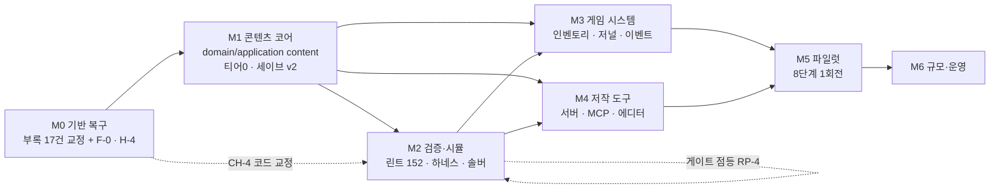
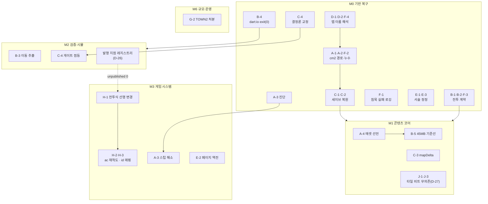

# 마일스톤 로드맵 M0~M6

> `상태: 대체됨` — **현재 노선과 모순된다. 이 장의 순서·판정을 따르면 잘못된 일을 하게 된다.**
> 정본은 [`issues/MILESTONES.md`](../issues/MILESTONES.md) 와 [`issues/DECISION-LOG.md`](../issues/DECISION-LOG.md) 의 2차 판정.
> 내용은 "왜 그 길이 아닌가" 의 기록으로 보존한다.

> **문서 ID**: BP-50 · **상태**: 초안 · **선행 문서**: [BP-20](20_target_architecture.md) · [BP-27](27_runtime_engine.md) · [BP-28](28_migration_and_coexistence.md) · [BP-32](32_generation_harness.md) · [BP-33](33_validation_and_lint.md) · [BP-34](34_headless_sim_and_solver.md) · [BP-35](35_ci_and_build.md) · [BP-40](40_gameplay_changes.md)
> **독자**: 프로젝트 운영자 · 구현 착수자 · **한 줄 요약**: 이 기획서 22개 장을 **무엇부터 언제 만드는가**로 바꾼 실행 순서.
> 결론은 하나다 — **AI 생성 파이프라인이 아니라 "기반 복구" 로 시작한다.** 지금 게임은 맵 로드 실패를 성공으로
> 보고하고, 세이브를 로드하면 대사 티어가 죽고, 같은 입력이 같은 결과를 내지 않으며, 화면 없이는 한 칸도 움직일 수 없다.
> 이 넷을 고치기 전에는 검증·시뮬레이션·회귀가 **원리적으로 성립하지 않는다.**

**파이프라인 구획(D-01)**: 이 장은 세 구획(Authoring / Build / Runtime) 전부를 가로지르는 **실행 순서 문서**다.
설계 내용을 다시 쓰지 않는다(D-18). 각 마일스톤은 소유 장을 **링크로 참조**하고, 여기서는 **순서·판정·범위**만 정한다.

**이 장이 다루지 않는 것**

| 주제 | 소관 |
|---|---|
| 태스크 단위 분해·선행 관계·변경 대상 파일 | [BP-51](51_task_breakdown.md) |
| 리스크 등록부(RK-nn)와 완화책 | [BP-52](52_risks.md) |
| 수용 기준·DoD·품질 수치의 정본 | [BP-53](53_acceptance_criteria.md) |
| 각 설계의 스키마·시그니처·알고리즘 | BP-21~BP-43 (D-18 소유표) |
| 사람-시간 추정 | **하지 않는다**(§2.9 근거) |


> ## ⚠ 이 로드맵은 1차 노선 기준이다 (2026-09-01)
>
> 실행 계획의 정본은 [`issues/MILESTONES.md`](../issues/MILESTONES.md) 다(S1→S2→S3).
> 이 장의 M0~M6 구성과 "전투식 변경이 인벤토리보다 선행" 류의 순서 판단은
> [`issues/DECISION-LOG.md`](../issues/DECISION-LOG.md) 의 **2차 판정**으로 대체되었다.
> 마일스톤별 **내용**(무엇을 만드는가)은 보류 노선이 필요해질 때 여전히 유효하다.

---

## 1. 로드맵 원칙

### 1.1 원칙 5개

| ID | 원칙 | 이 원칙이 부정하는 것 |
|---|---|---|
| **RP-1** | **검증 불가능한 것은 만들지 않는다.** 산출물보다 그 산출물의 판정 수단이 먼저 존재해야 한다 | "일단 퀘스트 엔진을 만들고 나중에 테스트를 붙인다" |
| **RP-2** | **거짓말하는 시스템을 먼저 고친다.** 실패를 성공으로 보고하는 코드 위에 쌓은 검증은 전부 무효다 | "버그는 알고 있으니 피해 가며 만들면 된다" |
| **RP-3** | **기준선(골든)은 변경 *전에* 뜬다.** 고친 뒤에 뜬 기준선은 자기 자신을 기준으로 삼는 순환이다([BP-28 T-28-0](28_migration_and_coexistence.md)) | "고치고 나서 회귀 테스트를 만든다" |
| **RP-4** | **게이트는 대상이 존재한 뒤에 켠다.** 위반이 이미 있는 상태로 CI 검사를 켜면 빌드가 즉시 빨개져 게이트가 무력화된다(D-23, [BP-35 R-35-18](35_ci_and_build.md)) | "규칙부터 켜고 맞춰 나간다" |
| **RP-5** | **한 마일스톤은 한 가지 능력을 완성한다.** 절반씩 걸친 6개보다 완성된 2개가 낫다 | "여러 축을 동시에 조금씩" |

### 1.2 무엇이 무엇을 막는가 — 의존의 방향

부록 A~F 의 결함은 서로 독립이 아니다. **아래 5개 사슬**이 로드맵 전체의 순서를 결정한다.

| 사슬 | 시작 결함 | 막고 있는 것 | 왜 원리적으로 막히는가 |
|---|---|---|---|
| **CH-1 이름** | 부록 D-1 · D-2 · A-1 | 앵커, `currentMapName`, 세이브 v2, shadow 트레이스, 파일럿 bind, `map_is` op, `warp` 도착 검증 | 앵커는 `(map, x, y)` 로 색인된다([BP-26](26_entity_registry_and_anchors.md)). **맵 이름이 엉뚱한 파일로 해석되면 색인 키 자체가 틀린다.** 등록 이름 15개 중 7개가 존재하지 않는 파일로 가고, 그 실패가 `true` 로 보고된다 |
| **CH-2 상태 누수** | 부록 A-2 · F-2 | 3티어 판정, shadow 동등성 비교, 네이티브 맵 이관 | cm2 로드 실패가 `clearRuntimeState()` 를 건너뛰어 **직전 맵 스크립트가 살아남는다.** 티어 판정(`cm2Path != null`)이 항상 참이 되어 "티어 2 가 항상 이긴다". 여기에 F-2 가 겹쳐 **지오메트리 없는 맵에 네이티브 스크립트가 부착**된다 |
| **CH-3 세이브** | 부록 C-1 · C-2 · C-3 | 세이브 v2, `WorldState`, 로드 후 티어 0([BP-20](20_target_architecture.md) INV-20-21), 웹 배포 | `MapModel.toJson()` 이 `events` 를 저장하지 않아 **로드 순간 JSON 대사 티어가 통째로 죽고**, 로드 경로가 네이티브 스크립트를 붙이지 않는다. 맵 전체 스냅샷은 100×100 에서 약 570KB 로 브라우저 저장 한계에 근접한다 |
| **CH-4 결정론** | 부록 C-4 | 골든 회귀, 퍼징, 트레이스 비교, 솔버 ↔ 시뮬레이터 교차 검증, D-15 hard gate | 벽시계 독 데미지 1곳 + 무시드 `Random()` 14곳 때문에 **같은 입력이 같은 결과를 내지 않는다.** 골든 비교는 매번 빨개지고, 반례 재생이 불가능하다 |
| **CH-5 헤드리스** | 부록 B-3 · B-4(정정본) | 이동·상호작용 시뮬레이션, `step_tile` 발행, `greedy`/`random` 정책, 게임오버 흐름, **웹 런타임 종료 동작의 확인**(부록 B-4-4) | 상호작용 트리거가 `application/` 이 아니라 Bonfire 스프라이트 `update(dt)` 폴링 안에 있다. 포트를 페이크로 갈아도 **이동 자체를 구동할 수 없다.** 게다가 `exit(0)` 가 시뮬레이터 프로세스를 죽인다. `dart:io` 는 **계층 규율 위반**이며(CI grep 미검사), 웹에서 그 종료 메뉴를 눌렀을 때의 동작은 **아직 확인되지 않았다** |

> **⚠ 폐기된 전제 (2026-08-30 정정)** — 초판 CH-5 는 "막고 있는 것" 에 **웹 빌드**를 넣었다. 이 전제는 **반증되었다.**
> 부록 B-4 는 `flutter build web --release` 를 **실제로 실행해 성공**을 확인했다(Flutter 3.41.4, 컴파일 16.5초,
> exit code 0, 산출물 45MB — 부록 B-5 가 그 구성을 실측). **`dart:io` import 자체는 웹 빌드를 막지 않는다.**
> 부록 B-4 는 "'웹 빌드가 깨진다' 를 근거로 쓰지 말 것" 을 명시적으로 지시한다. 본 장은 그 지시를 따르며,
> 유효한 근거는 아래 셋으로 한정한다 —
> ① **회귀 감지 구조 부재**: 웹 빌드는 CI 에서 **전혀 돌지 않는다**(수동 `workflow_dispatch` 뿐). 즉 지금 성공하는
>    경로를 우리가 깨뜨려도 아무도 모른다. ② **부록 B-4-4(신규·미확인)**: 빌드는 되지만 **웹 런타임에서 `exit(0)`
>    호출 시의 동작이 미확인**이며 브라우저에서 직접 눌러 확인해야 한다. ③ **계층 규율**(D-23): `application/` 의
>    `dart:io` 는 CLAUDE.md 위반이고 CI grep 2종이 잡지 못한다 — 이것만으로 D-23 은 정당하다.

> **CH-1 ~ CH-3 은 M0 안에서 반드시 끝난다.** CH-4 는 M0 에서 코드 교정, M2 에서 게이트 점등으로 나뉜다(RP-4).
> **CH-5 만 예외적으로 뒤로 밀 수 있다** — [BP-34 §2.5](34_headless_sim_and_solver.md) 가 "솔버는 추상 액션만 쓰므로
> 이동 시뮬레이션 없이 F-2(상태 순환)·F-3(자원 소진)을 잡는다" 를 증명했다. 즉 **솔버가 이동 추출보다 먼저다.**

### 1.3 순서를 바꾼 곳과 그 근거

의뢰받은 권장 구성은 `M2 저작 도구 → M3 검증·시뮬레이터 → M4 게임 시스템` 이었다. **본 장은 이를 뒤집는다.**

| 변경 | 권장안 | 본 장 | 근거 |
|---|---|---|---|
| ① 검증을 저작보다 **앞으로** | M2 저작, M3 검증 | **M2 검증, M4 저작** | [BP-32 R-32-77](32_generation_harness.md): "하네스만 먼저 만들면 **게이트가 아무것도 검사하지 않는 파이프라인**이 되어 의미가 사라진다." 파일럿 선결 P-2·P-3·P-4 는 전부 CLI·평가기·시뮬이고, **콘텐츠 서버는 P 목록에 없다.** 서버는 파일럿의 선결이 아니다 |
| ② 게임 시스템을 저작보다 **앞으로** | M4 | **M3** | D-20 이 `item_gained`/`item_lost`/`enter_place` 를 "**발행 지점이 생기기 전까지 미발행**" 으로 못 박았다. 인벤토리가 없으면 `acquire`/`deliver` 목표는 **검증기를 통과해도 게임에서 진행되지 않는다.** 파일럿 퀘스트는 `item.gen_ep1.scholar_notebook` 을 쓰고([BP-32 §32.11.1](32_generation_harness.md)) 성공 기준 7번이 "저널에 뜨고" 를 요구한다 |
| ③ 이동 루프 추출(CH-5)을 M2 **뒷부분**으로 | (미배치) | M2 후반 | [BP-34 §2.5](34_headless_sim_and_solver.md) Phase 0 표. 솔버·정적 린트는 P-1 없이 동작하고, P-1 이 추가로 사주는 것은 F-1(지형 도달성)과 퍼징뿐. **이득의 정확한 크기**: 같은 표의 "반례 재생(solve → sim)" 행이 Phase 2 에서만 ✅ 이므로 이 뒤집기가 사주는 것은 **"솔버 착수를 이동 추출이 기다리지 않는다"(병렬화)** 이지 **"임계 경로가 줄어든다" 가 아니다.** [BP-51 §4.2](51_task_breakdown.md) 가 실제 그래프로 −4 를 산출했다 |
| ④ `exit(0)` 제거(B-4)를 M0 **앞부분**으로 | (미배치) | M0 | D-23 이 CI 검사 추가와 `exit(0)` 제거를 **같은 변경으로 묶으라**고 지시했다. 근거는 **계층 규율**(부록 B-4-1)과 **헤드리스 하네스 파괴**(부록 B-4-3)이며, "웹 빌드 파손"(초판 B-4-2)은 **실빌드로 반증되어 근거에서 제외**한다. 추가로 웹 빌드가 CI 에서 돌지 않아 **회귀 감지 구조가 없다**는 것이 `web_smoke` 잡([BP-51](51_task_breakdown.md) T-145)의 근거다 |

> **파일럿 선결 목록의 결함(본 장의 발견)** — [BP-32 §32.11.2](32_generation_harness.md) 의 P-1~P-5 에는
> **인벤토리와 저널이 빠져 있다.** 그러나 같은 장 §32.11.1 이 파일럿 아이템 1개를 명시하고,
> §32.11.3 성공 기준 7번이 "로어성에서 퀘스트를 받고 **저널에 뜨고** 완료됨" 을 요구한다.
> 따라서 본 장은 **P-6(인벤토리, D-16-2)** 와 **P-7(저널 UI, D-16-1)** 을 선결 조건으로 추가하고
> 두 항목을 M3 에 배치한다. 이것이 M3(게임 시스템)이 M5(파일럿)보다 앞에 와야 하는 결정적 이유다.
> BP-32 로의 정정 요청은 §9.3 Q-50-1 에 기록한다.

---

## 2. 마일스톤 M0 ~ M6

각 마일스톤은 7항목 계약을 갖는다: **목표 / 포함 / 제외 / 산출물 / 완료 판정 / 선행 / 규모**.
완료 판정은 전부 **기계로 측정 가능한 명제**로 쓴다. "잘 동작한다" 는 판정이 아니다.

### 2.1 M0 — 기반 복구 (Foundation Repair)

| 항목 | 내용 |
|---|---|
| **목표** | 게임이 **자기 실패를 정직하게 보고**하고, **같은 입력에 같은 결과**를 내게 만든다 |
| **포함** | 부록 A-1·A-2·**A-3(진단만)** / B-1·B-2·B-4 / C-1·C-2·C-4 / D-1·D-2 / E-1·E-3 / F-1·F-2·F-3·F-4 (**17건**) · [BP-28 T-28-0~T-28-3](28_migration_and_coexistence.md) 선행 골든 채취 · [BP-27 DT-1~DT-5](27_runtime_engine.md) 결정론 교정 · [BP-34 T-34-7](34_headless_sim_and_solver.md) `UiHost.requestQuit` · **부록 F-0**(빈 `Party::PosX/PosY` 중복 등록 제거) · **부록 H-4**(맵 에디터 `registerAs` 는 이미 `json` 을 쓰므로 T-004 의 수리 범위를 **기존 15엔트리로 한정**한다 — 신규 맵 경로는 고칠 것이 없다) |
| **제외 (명시)** | 콘텐츠 데이터 모델 · 티어 0 · 앵커 · `WorldState` · 세이브 v2 봉투 · 아이템 · 저널 · CLI · 서버 · LLM · **부록 B-3(이동 루프 추출 → M2)** · **부록 A-4(에셋 선언 → M1)** · **부록 C-3(맵 스냅샷 크기 → M1)** · **부록 E-2(레거시 변환 규칙 → M3)** · **부록 A-3 의 실제 해소(→ M3)** |
| **산출물** | ① 수정된 `hadar2026_app/lib/**` ② `MapInfos.json` 의 `json`/`cm2` 필드 15엔트리 ③ 16개 맵의 **선행 골든 트레이스** ④ `approvedDeltas` 목록 ⑤ 갱신된 `.github/workflows/ci.yml` |
| **완료 판정** | **G0-1** `MapInfos.json` 등록 이름 15개 전부에 대해 `loadByName` → `session.map.displayName` 이 **실제로 바뀐다**(반환값 `true` 는 증거로 인정하지 않음, [BP-28 T-28-2](28_migration_and_coexistence.md) 완료 정의)<br>**G0-2** 맵 전환 후 cm2 파일이 없으면 `_engine.currentScript.length == 0`<br>**G0-3** 같은 시드·같은 입력열을 2회 실행해 파티 HP·전투 로그가 **바이트 동일**<br>**G0-4** v1 세이브 픽스처를 저장→로드 후 `map.events.length` 가 저장 전과 같고, `currentMapScript` 가 현재 맵의 것<br>**G0-5** `grep -rn "^import 'dart:\(io\|html\)'" lib/application/ lib/domain/` 빈 결과 + 해당 CI 검사 점등<br>**G0-6** `flutter build web --release` 성공 — **이것은 회귀 방지 게이트다.** 부록 B-4 정정본이 현재 성공을 실측했으므로 이 게이트는 "고쳐서 통과시키는" 대상이 아니라 "깨뜨리지 않았음을 확인하는" 대상이다<br>**G0-7** 16개 맵 골든 diff 가 `approvedDeltas` 와 **1:1 대조**됨([BP-20](20_target_architecture.md) INV-20-05b)<br>**G0-8** 웹 빌드를 브라우저에서 띄워 **종료 메뉴를 실제로 눌러** 동작을 확인하고 결과를 기록(부록 **B-4-4** 는 미확인 항목이며 빌드 성공이 이를 보증하지 않는다) |
| **선행** | 없음. **지금 시작 가능** |
| **규모** | **대** — 부록 G-1 집계 21건 중 **17건**이 여기에 들어가고(§4.2 배치표), 여기에 `F-0`(중복 등록 제거)·`H-4`(T-004 범위 확정) 2건이 더해진다. 다만 개별 변경은 대부분 소·중이고, 큰 것은 골든 채취(T-28-0)와 전투 난수 14곳뿐 |

> **왜 M0 가 1번인가** — 부록 D-1 의 역설이 그 자체로 답이다. `MapInfos.json` 에 **등록하는 행위가 맵을 로드 불가로 만든다**
> (등록되지 않은 `ORIGIN.json` 만 정상 로드된다 — 부록 F-4). 이 상태에서 앵커 파일 `anchors/TOWN1.json` 을 만들면
> 그 앵커는 **TOWN1 이 아닌 직전 맵의 좌표**에 붙는다. 검증기가 통과시키고 시뮬레이터가 완주를 증명해도 게임에서는 안 된다.

### 2.2 M1 — 콘텐츠 코어 (Content Core)

| 항목 | 내용 |
|---|---|
| **목표** | **Dart 코드를 고치지 않고 JSON 파일만 추가해** 게임 안에서 대화 하나가 돌게 한다([BP-20](20_target_architecture.md) INV-20-01) |
| **포함** | `lib/domain/content/`(D-11) 전량 · `lib/application/content/`(D-11) 전량 · 앵커/트리거 인덱스([BP-26](26_entity_registry_and_anchors.md)) · 디스패처 **티어 0** 삽입(D-10) — **D-27 에 따라 타일 액션 게이트보다 앞에서 `(map,x,y)` 로 트리거 인덱스를 직접 조회한다. 앵커는 맵 데이터에 아무 표시도 남기지 않으며 region 비트에 의존하지 않는다**(부록 J-1) · **부록 K-2 의 bump 게이트 제거**(`player_sprite.dart:359-366` 의 `if (action.isInteractive)` — presentation 이 콘텐츠 발화를 결정하는 유일한 지점) · `pendingNavigation` 승격(**D-19**) · `WorldState` + **세이브 v2**([BP-25](25_world_state_and_save.md)) + v1 마이그레이션 · **부록 C-3** 대응 `mapDelta`/`generated`(**D-22**) · `hadar_content build` 최소 구현 · `assets/content/build/` 3파일 · `pubspec.yaml` 에셋 선언(부록 A-4) + **그 이득을 부록 B-5 의 45MB 기준선에 비추어 측정**(G1-9) |
| **제외 (명시)** | 퀘스트 **UI** · 아이템 실데이터 · 린트 규칙 152개 · 시뮬레이터 · 솔버 · 콘텐츠 서버 · MCP · LLM · 이동 루프 추출 · 기존 맵의 실제 이관(MAP003 이관은 M2) |
| **산출물** | ① `lib/domain/content/**` ② `lib/application/content/**` ③ `tools/content_cli/`(또는 Q-20-1 의 결론 위치)의 `build` 서브커맨드 ④ 픽스처 팩 2벌 `fixture_a`/`fixture_b` ⑤ 세이브 v2 + v1 픽스처 마이그레이션 테스트 |
| **완료 판정** | **G1-1** INV-20-01 통과 — 픽스처 팩 A/B 를 `MemoryAssetSource` 로 바꿔 끼우면 **같은 바이너리가 다른 대화를 낸다**<br>**G1-2** INV-20-05 통과 — 앵커 0개 팩에서 `UiHost` 호출 시퀀스가 M0 골든과 동일<br>**G1-3** INV-20-19 통과 — 티어 0 이 `warp` 를 예약한 상호작용에서 `endNarrative(autoFlush: false)`<br>**G1-4** INV-20-15 · INV-20-21 통과 — v1 세이브가 v2 로 로드되고, **로드 직후 같은 좌표에서 `handleTile` 이 `true`**<br>**G1-5** INV-20-02 · INV-20-06 통과 — 별도 프로세스 2회 빌드 해시 일치, `git diff --exit-code assets/content/build/` 빈 결과<br>**G1-6** INV-20-04 통과 — `grep -rn "package:flutter" lib/domain/content/` 빈 결과<br>**G1-7** 100×100 맵을 3칸 고친 세이브가 **50KB 미만**(부록 C-3 완화 확인)<br>**G1-8 (D-27 · 부록 K)** `region` 값이 무엇이든(0·64·128·**255** 전부) 앵커 발화 결과가 **동일**하고, **`step_on` 앵커가 타일 액션 없이도 발화**함을 테스트가 고정한다(부록 J-1·J-3). **추가로 진입점 3개의 동작이 일치한다** — 같은 앵커가 step-on(`player_sprite.dart:193`) · bump(`:359-366`) · 확인키(`:405`) 중 어느 경로로 접근해도 같게 발화한다(부록 **K-2** 가 지적한 비대칭 해소). 앵커-타일 정합 위반은 빌드 실패가 아니라 **린트 WARN**([BP-26 R-26-7a](26_entity_registry_and_anchors.md))<br>**G1-9 (부록 B-5)** A-4 적용 전후의 **웹 산출물 크기를 실측해 기록**한다. 기준선은 **45MB**(canvaskit 31MB · 게임 자산 9.7MB · NOTICES 1.3MB · 나머지 ~3MB)이며, "소스 팩을 싣지 않는" 선택의 이득을 **9.7MB 대비 상대값**으로 판정한다 |
| **선행** | **M0**(전부). 단 `domain/content/` 의 순수 데이터 모델·평가기는 M0 와 **병렬 가능**(§7) |
| **규모** | **대** |

### 2.3 M2 — 검증과 시뮬레이션 (Verification)

| 항목 | 내용 |
|---|---|
| **목표** | **사람이 플레이하지 않고** 콘텐츠의 가부를 판정한다 — 정적 린트 4계층 + 실행 가능성 1계층([BP-34 §1.1](34_headless_sim_and_solver.md) L1~L5) |
| **포함** | [BP-33](33_validation_and_lint.md) 규칙 152개 구현 · `hadar_content validate/lint/sim/solve` · `HeadlessUiHost`/`MemoryAssetSource`/`SimDriver`/`SimPolicy` 3종 · `QuestSolver` · 골든 트레이스 3종([BP-35 §6](35_ci_and_build.md)) · **부록 B-3 이동 루프 추출**([BP-34 T-34-1~T-34-6](34_headless_sim_and_solver.md)) · 결정론 grep 게이트 **점등**(D-23, `V-DET-009/010`) · CI 잡 3개 신설(`content`/`determinism`/`web_smoke`) · **MAP003 이관**([BP-28 §9.1](28_migration_and_coexistence.md) 1번) · **이벤트 → 발행 지점 레지스트리 생성**(D-26, 소유 [BP-35 §1.5.1](35_ci_and_build.md) `eventPublishers`) · **솔버의 실행 가능 축 대조**(D-26, 소유 [BP-34 §5.10](34_headless_sim_and_solver.md)) · **`PROVEN + UNSUPPORTED` 팩의 미활성 표시와 릴리스 차단 배선**(D-26, 게이트 정의는 [BP-53](53_acceptance_criteria.md) 소유) · **`core` 팩에 새 대화 1개**(RK-28 오발동 방지 — 아래 R-50-15) |
| **제외 (명시)** | 콘텐츠 서버 REST · MCP · 맵 에디터 확장 · 프롬프트 · LLM 호출 · 인벤토리 · 저널 · LORE_EP 이후의 이관 |
| **산출물** | ① `tools/content_cli/**` ② `hadar2026_app/test/harness/**` ③ `hadar2026_app/tool/sim_main.dart` ④ 골든 디렉토리 ⑤ 확장된 `ci.yml` ⑥ `assets/content/core/` 의 MAP003 이관분 ⑦ **`tools/content_cli/event_publishers.json` 선언 파일과 그것이 굽는 `content.index.json#eventPublishers`**(D-26) ⑧ **웹 산출물 크기 기준선 기록**(부록 B-5 대비 증분) |
| **완료 판정** | **G2-1** `hadar_content validate` 가 [BP-33 §5.4](33_validation_and_lint.md) 의 Hard gate 8종을 전부 판정한다(규칙 ID 대응표가 빈칸 없음)<br>**G2-2 (D-26 반영, 2축)** ① **모델 증명 축** — `hadar_content solve` 가 픽스처 퀘스트의 완주 경로를 **2개 이상** `PROVEN` 으로 증명하고, 그 witness 를 `SimDriver` 가 **재생 성공**([BP-34 R-34-7](34_headless_sim_and_solver.md) 교차 검증). ② **실행 가능 축** — 그 경로가 소비하는 이벤트가 전부 레지스트리에 `published` 이면 `SUPPORTED`, 하나라도 `unpublished` 면 `UNSUPPORTED` 로 판정되고, **`PROVEN + UNSUPPORTED` 인 팩이 "미활성" 으로 표시되어 릴리스 게이트에서 차단됨을 테스트가 고정**한다. **M2 시점에는 `item_gained`·`item_lost`·`enter_place` 3종이 `unpublished` 이므로(D-20 말미) `acquire`/`deliver` 목표를 쓰는 픽스처는 반드시 `UNSUPPORTED` 로 나와야 한다** — 그것이 나오지 않으면 레지스트리가 거짓말을 하고 있다는 뜻이다<br>**G2-3** 하네스 자기 테스트 S-01~S-12 전부 통과([BP-34 §9](34_headless_sim_and_solver.md))<br>**G2-4** MAP003 shadow diff **0**([BP-28 §9.3](28_migration_and_coexistence.md) M2 종료 조건)<br>**G2-5** `player_sprite.dart` 가 `HDGameMain().checkTileEvent` 를 **직접 호출하지 않는다**(grep 0건)<br>**G2-6** PR 게이트 시간이 [BP-35 §5.2](35_ci_and_build.md) 예산 안(콘텐츠만 ≤6분 / 둘 다 ≤15분)<br>**G2-7** 결정론 grep 게이트가 `continue-on-error` 없이 켜져 있고 green<br>**G2-8** 이벤트 12종 전량이 `event_publishers.json` 에 선언되어 있고(누락 시 빌드 ERROR — [BP-35 R-35-11d](35_ci_and_build.md)), `unpublished` 3종의 `blockedBy` 가 M3 의 선행 장(BP-42·BP-22)을 가리킨다<br>**G2-9** 이 구간에 **새로 플레이 가능해진 콘텐츠가 1건 이상** 있다(R-50-15) |
| **선행** | **M1**. `QuestSolver` **착수**는 **M1 의 `domain/content/` 만** 있으면 되고 이동 추출을 기다리지 않는다([BP-34 §2.5](34_headless_sim_and_solver.md) Phase 0). **단 G2-2 의 witness 재생은 이동 추출(부록 B-3) 완료를 요구한다** — 같은 표의 "반례 재생(solve → sim)" 행이 Phase 0 ❌ / Phase 1 ⚠️ / **Phase 2 ✅** 이기 때문이다. 즉 M2 **종료**는 이동 추출을 경유한다(§1.3 ③의 정밀화) |
| **규모** | **대** — 이 로드맵에서 가장 큰 마일스톤. 규칙 152개와 하네스가 함께 들어온다 |

### 2.4 M3 — 게임 시스템 (Gameplay Systems)

| 항목 | 내용 |
|---|---|
| **목표** | D-16 의 6개 최소 집합을 완성해 **퀘스트가 실제로 진행되고 보이게** 한다 |
| **포함** | 인벤토리·아이템(D-16-2, [BP-42](42_item_and_inventory.md)) · 저널 UI(D-16-1, [BP-41](41_journal_ui_spec.md)) · 조건부 대화(D-16-3) · NPC 정체성(D-16-5) · 월드 이벤트 버스 **발행 지점**(D-16-6, D-20 12종) · 메인 메뉴 7→9항목([BP-40 R-40-12](40_gameplay_changes.md)) · `time_of_day` · 실패 가능 퀘스트 · **LORE_EP·TOWN1 이관**([BP-28 §9.3](28_migration_and_coexistence.md) M3·M4) · [BP-28 T-28-4~T-28-7](28_migration_and_coexistence.md) · **전투식 선행 변경**(부록 **H-1**) — 아래 R-50-16 |
| **선행 조건 (부록 H, 이 마일스톤 안에서의 순서)** | **부록 H-1(정정판)** 이 확정했다 — 죽은 필드는 `powOfShield`/`powOfArmor` **2개뿐**이고 `powOfWeapon` 은 `battle.dart:439` 의 플레이어 공격식이 **실제로 읽는다**. 방어는 `ac` 하나로만 계산된다(`battle.dart:441`·`:514`). 따라서 **1차 스코프(무기 `power`→`powOfWeapon`, 갑옷+방패 `ac` 합산)는 전투식을 바꾸지 않아도 동작한다** — 전투식 변경은 방패 별개 축·부위별 감쇠·속성 상성을 원할 때만 필요하며 **1차 스코프 밖**이다. 정본 해법은 [BP-42 R-42-29~R-42-33](42_item_and_inventory.md)(`ac ← armor.ac + shield.ac` **합산**, `powOf*` 는 표시용 사본 + 폐기 예정)이며, **부록 H-2** 에 따라 `books.json` 의 `ac 10/20` 은 **2/5 로 재척도**해야 한다([BP-42 R-42-34](42_item_and_inventory.md)) — 원값을 그대로 옮기면 방어가 과해진다 — 부록 H-2(정정판)의 전수 계산에 따르면 `ac 10` 에서 피해 발생 턴이 **36%**, `ac 20` 에서 **16%** 로 떨어진다(무효화는 아니지만 원작 파티 초기 `ac 3~5` 대역과 어긋난다). **부록 H-3** 에 따라 `books.json` 의 `id` 공간과 `HDPlayer.weapon` 정수는 **무관**하므로 마이그레이션이 둘을 **명시적으로 매핑**해야 한다 |
| **제외 (명시)** | 평판 · 상점([BP-40 R-40-16](40_gameplay_changes.md) 에서 **제외 확정**) · 다국어(D-17) · 새 `HDInputMode`([BP-41 R-41-9](41_journal_ui_spec.md)) · 새 전역 키([BP-40 R-40-10](40_gameplay_changes.md) 변경 예산 0) · 생성 파이프라인 |
| **산출물** | ① `lib/domain/content/item*.dart`·인벤토리 ② `lib/domain/party/` 인벤토리 확장 ③ 저널 창 5개 신규 파일([BP-41 §41.10](41_journal_ui_spec.md)) ④ `items.json` 실데이터(**`ac` 재척도 반영분**) ⑤ 이관된 LORE_EP·TOWN1 앵커 팩 ⑥ **`books.json` id ↔ `HDPlayer.weapon` 정수 매핑표**(부록 H-3) ⑦ **`legacyFlagMap` 크기 스냅샷** — G6-4 의 비교 기준선이므로 M3 종료 시 반드시 기록한다 |
| **완료 판정** | **G3-1** D-20 12종 이벤트 중 **미발행이 0종**(`enter_place`·`item_gained`·`item_lost` 포함). 각 이벤트에 발행 지점 테스트 1개. **기계 판정 형태**: 이것이 통과하는 순간 M2 가 만든 발행 지점 레지스트리(D-26)의 `unpublished` 가 **0** 이 된다 — 그것이 G3-1 의 실질적 종료 명제이며, 동시에 M2 에서 `PROVEN + UNSUPPORTED` 로 미활성 처리된 팩이 **재판정으로 활성화**되는 시점이다<br>**G3-2** `acquire`·`deliver`·`talk_to`·`reach`·`defeat` 5종 objective 가 헤드리스 시뮬로 **전부 진행 확인**<br>**G3-3** 같은 NPC 가 플래그 상태에 따라 **다른 대사**를 낸다(조건부 대화 통합 테스트)<br>**G3-4 (측정 가능한 형태로 분해)** [BP-40 R-40-17](40_gameplay_changes.md) 의 "픽셀 동일" 은 **골든 위젯/스크린샷 테스트를 요구하는데 이 프로젝트에는 위젯 테스트가 없고**(GROUND_TRUTH §12), [BP-53](53_acceptance_criteria.md) N-72 가 "위젯 테스트 도입은 1차 스코프 밖" 을 확정했다. 따라서 **기계 판정 가능한 4개 대리 명제로 분해**한다 — ① 신규 `HDInputMode` **0개** ② 신규 `UiHost` 메서드 **0개** ③ 신규 전역 키 **0개**([BP-53](53_acceptance_criteria.md) NJ-3 의 3대리 명제) ④ **추적 미지정 시 `HDTrackerBar` 높이가 0px** 이고 메인 메뉴의 **기존 항목 인덱스가 불변**([BP-51](51_task_breakdown.md) T-108·T-107 완료 조건). **"픽셀 동일" 이라는 총평은 판정하지 않는다**([BP-53](53_acceptance_criteria.md) NJ-3 의 "판정하지 않는 것" 열) — R-50-7 이 금지한 사람 눈 판정을 그 자리에 두지 않기 위한 조치다<br>**G3-5** 부록 A-3 해소 확인 — 네이티브 맵의 `isFlagSet` 이 `HDNativeScriptRunner` 값을 반환<br>**G3-6** LORE_EP 부팅→대화→이동 전 경로 회귀 골든 통과([BP-28 §9.3](28_migration_and_coexistence.md) M3 종료 조건) |
| **선행** | **M1**(상태·티어 0) + **M2**(판정 수단). G3-2 는 M2 의 시뮬레이터가 없으면 측정 불가 |
| **규모** | **중~대** |

### 2.5 M4 — 저작 도구 (Authoring Tools)

| 항목 | 내용 |
|---|---|
| **목표** | **AI 에이전트가 파일을 직접 쓰지 않고** API/CLI 로만 콘텐츠를 만들 수 있게 한다(D-12 원칙 4) |
| **포함** | `/api/content/*` 엔드포인트([BP-31](31_content_server_api.md)) · `content_*` MCP 도구 · `hadar_content new/diff/stats/migrate` · 맵 에디터 확장([BP-36](36_map_editor_extension.md)) · 컨텍스트 조립 `GET /api/content/context` · 문자열 키 발급 `POST /api/content/strings/mint` · 그래프 미리보기 PNG |
| **제외 (명시)** | 프롬프트 원문 · 에이전트 오케스트레이션 · 8단계 실행기 · 웹 GUI 신설(기존 맵 에디터 확장만) |
| **산출물** | ① `tools/mapEditor/server/content_api.ts`(신규, 기존 `ai_api.ts` 와 같은 프로세스) ② `tools/mapEditor/mcp/server.mjs` 확장 ③ CLI 서브커맨드 4종 |
| **완료 판정** | **G4-1** 사람이 `assets/content/**` 를 **손으로 열지 않고** MCP 도구만으로 대화 1개 + 앵커 1개를 만들어 게임에서 확인<br>**G4-2** 모든 쓰기 엔드포인트가 **응답에 L1/L2 진단을 실어** 반환한다([BP-33 §7](33_validation_and_lint.md) AI 포맷 7규약)<br>**G4-3** 에러 응답이 기존 맵 API 와 **같은 `{error, hint}` 규약**<br>**G4-4** `GET /api/content/context?for=` 응답이 [BP-32 §32.5](32_generation_harness.md) 예산 60,000 토큰 안<br>**G4-5** 맵 에디터에서 앵커 좌표를 옮기면 `validate` 가 앵커-통행 충돌을 **즉시** 보고 |
| **선행** | **M2**(검증기가 있어야 API 가 진단을 실을 수 있다) · **M1**(빌드 산출물) |
| **규모** | **중** — 기존 `tools/mapEditor/server/ai_api.ts`(828줄)의 구조를 그대로 복제·확장하는 작업이 대부분 |

### 2.6 M5 — 생성 파이프라인 파일럿 (Pilot)

| 항목 | 내용 |
|---|---|
| **목표** | 8단계 파이프라인을 **퀘스트 1건·맵 1개·NPC 3명** 범위로 한 바퀴 돌려 실제로 놀 수 있는 것을 만든다 |
| **포함** | D-14 의 8단계 실행기 · 에이전트 6종([BP-32 §32.4](32_generation_harness.md)) · 프롬프트 6종([BP-37](37_prompt_contracts.md)) · 컨텍스트 팩 조립 · `manifest.json` · 승인 게이트 HG-1/2/3 · `metrics/runs.jsonl` · `core` 팩 최소 바이블 |
| **제외 (명시)** | 배치 10건 · 병렬 run · 아크 단위 outline · 자동 승인(HG-2 자동화) · 격리 재투입(HG-4) — 전부 M6 |
| **산출물** | ① `content_gen/` 디렉토리 일습 ② `assets/content/gen_ep1/` 커밋분 ③ `content_gen/runs/<runId>/` 전 단계 산출물 ④ 지표 초기값 |
| **완료 판정** | [BP-32 §32.11.3](32_generation_harness.md) 의 **8개 기준 전부**(§5 에 재게) |
| **선행** | **M3**(P-6 인벤토리·P-7 저널) + **M4**(API 경유 쓰기) + M2·M1·M0 |
| **규모** | **중** — 코드 양은 M2 보다 작지만 **되돌림·재시도 루프**가 있어 소요 시간의 분산이 크다 |

### 2.7 M6 — 규모 확대와 운영 (Scale & Operate)

| 항목 | 내용 |
|---|---|
| **목표** | 파일럿을 **반복 가능한 생산 활동**으로 바꾸고, 레거시 이관을 끝낸다 |
| **포함** | 아크 1개(퀘스트 3·맵 2) → 배치 10건 → 병렬 3 run([BP-32 §32.11.4](32_generation_harness.md)) · 잔여 이관(GROUND1·DEN1·Prolog_B1·B2) · **`TOWN2` 처분 판정**(부록 **G-2** — `mapScriptFactory` 에 `Town2MapScript` 가 등록돼 있으나 `MapInfos.json` 미등재 · `TOWN2.json` 부재로 **한 번도 실행된 적이 없는 코드**다. 이관 대상이 아니라 **제외 또는 맵 신설** 중 하나를 근거와 함께 기록한다) · MAP003·LORE_EP `frozen` 승격 · `legacyFlagMap` 축소·다리 제거 판정 · Map013~015 를 신규 콘텐츠 무대로 · 지표 임계 재설정(Q-32-1·Q-32-2) · `L1_ep1d*` 처분(Q-28-4) |
| **제외 (명시)** | 다국어 · 음성/이미지 생성 · 런타임 LLM · 절차적 실시간 생성(D-17 전량) |
| **산출물** | ① 확장된 `gen_ep1` 팩 ② `frozen` 상태 앵커 파일 ③ 운영 지표 대시보드용 `runs.jsonl` 누적분 ④ 이관 완료 보고 |
| **완료 판정** | **G6-1** 배치 10건에서 Hard gate 위반 **0**으로 커밋된 비율이 지표에 기록되고 **[BP-53](53_acceptance_criteria.md) N-04(`passRate ≥ 0.7`)·N-05(`firstPassYield ≥ 0.4`) 임계를 만족**한다 — "기록됨" 만으로는 어떤 값이어도 참이 되므로 임계를 인용해 판정 명제로 만든다(임계 자체는 [BP-32 §32.10](32_generation_harness.md) 의 **잠정치**이며 T-156 이 실측으로 재설정한다)<br>**G6-2** 병렬 3 run 에서 **ID 예약 충돌 0건**([BP-32 R-32-56~59](32_generation_harness.md))<br>**G6-3** `migrated` 이상 맵에서 cm2 참조 grep **0건**([BP-28 §9.3](28_migration_and_coexistence.md) M6 종료 조건)<br>**G6-4** `legacyFlagMap` 크기가 **M3 종료 시 기록된 스냅샷**(§2.4 산출물 ⑦) 대비 감소. 기준선이 산출물로 존재하지 않으면 이 게이트는 판정할 수 없다<br>**G6-5** 콘텐츠 번들 크기가 INV-20-18 상한 이내([BP-53](53_acceptance_criteria.md) N-59~N-63. **기준선은 부록 B-5 의 웹 산출물 45MB** — canvaskit 31MB 는 콘텐츠와 무관하므로 콘텐츠 팩이 통제하는 표면은 게임 자산 9.7MB 쪽이다)<br>**G6-6 (D-26)** 릴리스 태그 빌드에 **`UNSUPPORTED` 팩이 0건**([BP-53](53_acceptance_criteria.md) H-13·N-74, [BP-35 R-35-33b](35_ci_and_build.md)) |
| **선행** | **M5** |
| **규모** | **중** — 코드보다 운영·이관 작업 비중이 높다 |

### 2.8 마일스톤 요약표

| ID | 이름 | 한 줄 목표 | 선행 | 규모 | 대표 게이트 |
|---|---|---|---|---|---|
| **M0** | 기반 복구 | 실패를 실패라고 말하게 한다 | — | 대 | G0-1 맵 이름 해석, G0-3 결정론 |
| **M1** | 콘텐츠 코어 | JSON 만으로 대화가 돈다 | M0 | 대 | G1-1 INV-20-01 |
| **M2** | 검증·시뮬레이션 | 안 놀아도 가부를 판정한다 | M1 | 대 | G2-2 솔버↔시뮬 교차 검증(**2축**, D-26) |
| **M3** | 게임 시스템 | 퀘스트가 진행되고 보인다 | M1·M2 | 중~대 | G3-1 이벤트 12종 전량 발행 |
| **M4** | 저작 도구 | AI 가 API 로만 쓴다 | M1·M2 | 중 | G4-1 손편집 0회 저작 |
| **M5** | 파일럿 | 퀘스트 1건을 끝까지 만든다 | M3·M4 | 중 | BP-32 8기준 |
| **M6** | 규모·운영 | 반복 가능한 생산으로 | M5 | 중 | G6-3 이관 완료 |

### 2.9 왜 사람-시간을 추정하지 않는가

| 근거 | 설명 |
|---|---|
| 실측 없음 | [BP-32 R-32-27](32_generation_harness.md)·Q-32-2 가 "토큰·시간 추정치는 파일럿 이후 `runs.jsonl` 실측으로 갱신" 이라고 명시. 파이프라인 소요는 지금 근거가 없다 |
| 인원 미확정 | §7 이 1인·다인 두 시나리오를 모두 다루는 이유 |
| 규모만으로 충분 | 상대 규모(소/중/대)와 **임계 경로 길이**([BP-51 §3](51_task_breakdown.md))가 일정 판단에 필요한 정보의 대부분이다 |

숫자를 넣으면 그 숫자가 검증 없이 인용된다 — 이 기획서가 부록 A~F 에서 반복해서 겪은 실패다.

---

## 3. 이걸로 무엇이 가능해지는가 — 능력 획득표

"완료 판정" 이 개발자용이라면, 이 표는 **사용자·기획자 관점**의 획득 능력이다.

| 마일스톤 | 완료 직후 **가능해지는 것** | 여전히 **불가능한 것** |
|---|---|---|
| **M0** | · `TOWN1`/`GROUND1`/`DEN1`/`DEN2` 로 **실제로 이동**할 수 있다(현재는 불가)<br>· 세이브를 로드해도 마을 사람이 말을 건다<br>· 버그를 **재현**해서 신고할 수 있다(같은 세이브 → 같은 결과)<br>· **웹 빌드를 우리가 깨뜨렸는지 CI 가 알려준다**(`web_smoke` 잡. 웹 빌드는 지금도 성공하므로 이것은 **회귀 감지**다 — 부록 B-4 정정본) | 새 대화·퀘스트를 **데이터로** 추가하는 것 |
| **M1** | · `assets/content/dialogue/*.json` 파일 하나를 넣으면 **게임에 새 대화가 뜬다**<br>· NPC 를 옮겨도 대사가 따라온다(앵커)<br>· 세이브가 이름 있는 플래그를 기억한다 | 그 대화가 **말이 되는지** 자동으로 확인하는 것 |
| **M2** | · 콘텐츠를 커밋하기 전에 **깨진 참조·도달 불가 노드·완주 불가**를 자동 검출<br>· "이 퀘스트 깰 수 있나?" 를 **CLI 한 줄**로 증명<br>· **"증명은 됐지만 지금 엔진에서는 안 돈다" 를 기계가 구별한다**(D-26 2축)<br>· 손댄 적 없는 콘텐츠가 깨졌으면 CI 가 회귀로 단정<br>· **`core` 팩의 새 대화 1개가 게임에 뜬다**(G2-9 — R-50-15 가 강제) | 퀘스트 아이템을 **주고받는** 것, 임무 목록을 **보는** 것 |
| **M3** | · 심부름 퀘스트가 **실제로 성립**한다(아이템 획득·전달)<br>· 메인 메뉴에서 **"임무를 확인한다"**<br>· 같은 NPC 가 진행도에 따라 다른 말을 한다<br>· TOWN1·LORE_EP 가 콘텐츠 팩으로 동작 | AI 에게 콘텐츠 제작을 **맡기는** 것 |
| **M4** | · AI 에이전트가 MCP 도구로 **퀘스트·대화·앵커를 직접 만든다**<br>· 잘못 쓰면 응답이 **왜 틀렸는지·어떻게 고치는지** 알려준다<br>· 맵 에디터에서 앵커를 눈으로 보고 옮긴다 | 그 과정을 **자동으로 끝까지** 돌리는 것 |
| **M5** | · 주문서 1장 → **퀘스트 1건이 게임에 들어간다**<br>· 실패하면 **어느 단계에서 왜** 실패했는지 파일로 남는다<br>· LLM 비용·되돌림 횟수의 **실측값**을 갖는다 | 열 건을 한꺼번에, 여러 사람이 동시에 |
| **M6** | · 아크 단위로 콘텐츠를 **찍어낸다**<br>· 레거시 cm2 를 **더 이상 읽지 않아도 된다**(migrated 맵 한정)<br>· 품질 지표로 파이프라인을 **튜닝**한다 | (스코프 밖 — D-17) |

---

## 4. 의존 그래프

### 4.1 마일스톤 간



### 4.2 부록 항목의 마일스톤 배치 — **부록 A~K 전수 34행**

**집계를 두 층으로 나눈다.** 부록 **G-1** 이 확정한 "검증된 결함" 집계는 **21건**이다 —
`A-1~A-4`(4) + `B-1~B-4`(4) + `C-1~C-4`(4) + `D-1~D-2`(2) + `E-1~E-3`(3) + `F-1~F-4`(4).
(`F-0` 은 기존 수치의 **재확인**이라 별건으로 세지 않는다. 이 중 19건이 코드·데이터 결함,
2건(E-1·E-3)이 기획서 서술 정정이다. 통칭 "잠복 버그 20건" 은 E-2 를 코드 결함으로 셀지에 따라 갈리는 수치다.)

그러나 **부록이 실제로 열거하는 배치 대상 항목은 그보다 많다.** G-1 이 세지 않은 것이 **10건** 더 있다 —
`B-5`(웹 페이로드 실측) · `G-2`(TOWN2 도달 불가) · `H-1~H-4`(장비·전투 실측) · `I-1`(region 충돌 실측) ·
`J-1~J-3`(region 레이어 사망) · `K-1~K-3`(타일 이벤트 진입점 3개의 게이트 비대칭). 초판 R-50-9 는 "21건 전부를 배치했다" 로 확정했는데, 그 집계는
**G-1 의 범위 안에서만 참**이었다. 아래 표는 **A-1~K-3 전수 34행**이다
(21 + `F-0` + `B-5` + `G-1` + `G-2` + `H-1~H-4` + `I-1` + `J-1~J-3` + `K-1~K-3`).
태스크 대응은 [BP-51 §2](51_task_breakdown.md) 가, 리스크 대응은 [BP-52 §52.2](52_risks.md) 가 같은 31행으로 받는다.

| 결함 | 한 줄 요약 | 사슬 | 마일스톤 | 왜 그 마일스톤인가 |
|---|---|---|---|---|
| **A-1** | 모든 맵에 없는 cm2 경로가 무조건 부여됨 | CH-2 | **M0** | 티어 판정이 항상 cm2 로 쏠린다. 이관·shadow 의 전제 |
| **A-2** | cm2 로드 실패가 엔진 상태를 누수 | CH-2 | **M0** | 직전 맵 스크립트가 살아남아 골든이 잡음에 파묻힌다 |
| **A-3** | `HDMapScript` 플래그 API 가 미구현 스텁 | — | **M0** 진단 · **M3** 해소 | 스텁 해소는 **의도된 동작 변경**이라 골든·`approvedDeltas` 가 먼저 필요([BP-28 T-28-7](28_migration_and_coexistence.md)) |
| **A-4** | `flutter.assets` 선언이 비재귀 | CH-3 | **M1** | `assets/content/build/` 를 만드는 시점에 같이 처리(R-20-7·R-30-19) |
| **B-1** | 적 `id 0` 이 영구 소환 불가(실 사용 74종) | — | **M0** | `registerEnemy` 가드에 로그 추가 + 범위 상수화. INV-20-20 의 근거 |
| **B-2** | 전투 결과 코드가 cm2 상수와 반대 | — | **M0** 정본 확정 · **M1** 배선 | Q-20-11 의 결정이 콘텐츠 `battle_won` 설계를 좌우 |
| **B-3** | 이동·상호작용이 스프라이트 폴링 안에 있음 | CH-5 | **M2** | [BP-34 §2.5](34_headless_sim_and_solver.md) — 솔버가 먼저, 추출이 나중 |
| **B-4** | `application/` 이 `dart:io`·`exit(0)` 사용 | CH-5 | **M0** | D-23 이 CI 검사 추가와 **같은 변경으로 묶으라**고 지시 |
| **C-1** | 세이브가 `map.events` 를 저장 안 함 | CH-3 | **M0** | 로드 후 JSON 대사 티어가 죽는다. 세이브 v2 이전에 v1 수준에서 먼저 고침 |
| **C-2** | 세이브 로드가 네이티브 스크립트를 안 붙임 | CH-3 | **M0** | 같은 이유. `currentMapCm2Path` 갱신도 함께 |
| **C-3** | 맵 스냅샷이 웹 저장 한계에 근접(~570KB) | CH-3 | **M1** | D-22 의 `base` 구분·RLE 은 세이브 v2 봉투와 한 몸 |
| **C-4** | 벽시계 데미지 1곳 + 무시드 `Random()` 14곳 | CH-4 | **M0** 교정 · **M2** 게이트 점등 | RP-4 — 위반이 남은 채 grep 을 켜면 CI 가 빨개진다 |
| **D-1** | 등록 이름 15개 중 7개가 없는 파일로 해석 | CH-1 | **M0** | 모든 좌표 기반 설계의 뿌리 |
| **D-2** | 로드 실패가 성공으로 보고됨 | CH-1 | **M0** | D-1 과 한 커밋. 반환값이 증거가 아님을 테스트로 고정 |
| **E-1** | `code 101` 을 텍스트 헤더로 오인한 서술 | — | **M0**(문서) | BP-12·BP-92 의 정정. 코드는 이미 옳다 |
| **E-2** | MV `pages` 선택 규칙이 `entry` 와 정반대 | — | **M3** | 레거시 변환기(LORE_EP 이관 이후)에서 **페이지 순서를 뒤집어야** 한다 |
| **E-3** | "cm2 는 튜링 완전" 논거가 성립 안 함 | — | **M0**(문서) | D-02 의 근거 문장 정정. 결정 자체는 유지 |
| **F-1** | 범위 밖 인자가 조용히 무시됨(`Flag::Set(300)` 등) | — | **M0** | 침묵 실패 계열. 경고 로그 추가 + 이름 있는 키(D-04)의 직접 근거 |
| **F-2** | 네이티브 스크립트가 지오메트리 없는 맵에 부착 | CH-2 | **M0** | A-3 과 원인이 독립. D-1 을 고쳐도 가드가 따로 필요 |
| **F-3** | `Battle::Result()` 가 전투 없이 승리를 반환 | — | **M0** | B-2 와 함께 전투 결과 계약 재정의 |
| **F-4** | `ORIGIN.json` 만 정상 로드 — D-1 의 역설 확증 | CH-1 | **M0** | D-1 수정의 **회귀 테스트**로 편입(등록해도 로드되어야 함) |
| **F-0** | cm2 등록 심볼은 커맨드 40 / 함수 12(43/11 은 오류) | — | **M0**(문서) | **버그가 아니라 재확인**이다. 결함 집계에는 넣지 않되, 빈 `Party::PosX/PosY` 중복 등록 제거([BP-51](51_task_breakdown.md) T-030)의 근거로 쓴다 |
| **G-1** | 부록의 검증 사실은 20건이 아니라 **21건** | — | — | **집계 규칙 자체**다. 본 절과 [BP-51 §2](51_task_breakdown.md)·[BP-52 §52.2](52_risks.md) 가 이 집계를 정본으로 삼는다 |
| **B-5** | 웹 페이로드 **45MB 실측**(canvaskit 31MB + 게임 자산 9.7MB + NOTICES 1.3MB) | CH-3 | **M1**(A-4 와 한 묶음) · **M2**(기준선 기록) | A-4(에셋 선언)를 M1 에 넣는 **판단의 유일한 실측 근거**다. B-5 는 "소스 JSON 을 웹 페이로드에서 빼는 선택이 실질적 이득인지 이 수치로 판단할 것(소스가 수 MB 가 아니라면 이득이 작다)" 고 지시했으므로, M1 은 A-4 를 **적용하면서 이득을 측정해 기록**한다([BP-53](53_acceptance_criteria.md) Q-53-7 이 HC-7 의 하드 유지 여부를 M1 에서 닫는다) |
| **G-2** | `TOWN2` 는 맵도 등록도 없는 **도달 불가 코드** | — | **M6** | 이관 대상이 아니라 **처분 대상**이다(§2.7 포함 항목). `Town2MapScript` 는 `mapScriptFactory[bundle.mapName]` 조회에 걸릴 수 없다 |
| **H-1** | `powOfShield`/`powOfArmor` 만 죽은 필드(`powOfWeapon` 은 `battle.dart:439` 가 읽는다). 방어는 `ac` 하나뿐 | — | **M3** | 1차 스코프는 전투식 변경 **불필요** — `powOfWeapon` 덮어쓰기 + `ac` 합산으로 충분하다. 해법 정본은 [BP-42 R-42-29~33](42_item_and_inventory.md). 전투식 변경은 선택 갈래(방패 별개 축 등)에서만 |
| **H-2** | `ac` 척도가 `books.json` 과 불일치 — 10/20 → **2/5 재척도 필요** | — | **M3** | 원값을 그대로 옮기면 **초반 전투가 통째로 무효화**된다([BP-42 R-42-34](42_item_and_inventory.md)) |
| **H-3** | `books.json` id 공간과 `HDPlayer.weapon` 정수가 **무관** | — | **M3** | 같다고 가정한 코드 주석이 있으나 근거가 없다. 마이그레이션이 **명시적 매핑표**를 산출해야 한다(§2.4 산출물 ⑥) |
| **H-4** | 맵 에디터 `registerAs` 는 **이미 `json` 필드를 쓴다** | CH-1 | **M0**(T-004 범위 확정) | **수리 대상은 기존 15엔트리뿐**이다. 신규 맵은 이미 올바르게 등록되므로 `tools/mapEditor` 쪽은 고칠 것이 없다 — T-004 의 범위를 좁혀 준다 |
| **I-1** | `Map001.json` (2,3) 이 이미 `region=255` | — | **배치 불필요 (D-27 로 무의미해짐)** | 예약안을 전제한 "충돌 1칸" 지적이었다. **D-27 이 region 예약안을 폐기**했으므로 예약도 충돌도 없다. 또한 I-1 자신이 "`Map001.json` 은 타일 액션 경계를 훑는 **테스트 픽스처**로 보이므로 함부로 정리하지 말 것" 이라고 경고했다 — 따라서 **정리 태스크를 만들지 않는다** |
| **J-1** | region 값은 **타일 액션을 만들 수 없다** — `map_loader.dart:44` 가 하위 바이트에 넣는데 `tile_properties.dart:187` 은 상위 바이트만 본다(`200 & 0x00FF0000 == 0`) | — | **M1**(티어 0 설계에 반영) | **D-27 의 근거**다. 콘텐츠 티어는 타일 비트를 거치지 않고 `(map,x,y)` 로 **트리거 인덱스를 직접 조회**한다 |
| **J-2** | 이 사실이 BP-26 의 region 예약안·BP-31/36 의 관련 기능을 **무효화**한다 | — | **M1**(설계) · **M4**(에디터) | 에디터는 앵커를 **오버레이로만** 표시하고 맵 데이터를 바꾸지 않는다(D-27 파급) |
| **J-3** | 타일 액션의 실제 출처는 **3개뿐**(맵 JSON `events[]` 접두사 · `ixObj1` B 타일 대역 · `ixTile` A5 대역) | — | **M1**(티어 0 테스트) | **step-on 도 타일 액션 없이 발화해야 한다.** 앵커-타일 정합은 ERROR 가 아니라 **WARN**([BP-26 R-26-7a](26_entity_registry_and_anchors.md)) |
| **K-1** | D-27 은 `checkTileEvent` 진입점 **3개 중 2개**(step-on `:193` · 확인키 `:405`)에서 **코드 변경 없이 성립**한다 — 그 둘은 타일 액션 선검사가 **없다** | CH-5 | **M1**(확인만) | **좋은 소식이다.** 콘텐츠 티어가 `(map,x,y)` 로 조회하면 `move`/`swamp` 같은 평범한 칸의 앵커도 잡힌다. BLOCK 칸에서 step-on 이 발화하지 않는 것은 "거부" 가 아니라 **"호출 부재"** 다(그 칸으로 이동이 완료되지 않으므로) |
| **K-2** | **bump 경로만 presentation 게이트가 남아 비대칭**이다 — `player_sprite.dart:359-366` 의 `if (action.isInteractive)` | CH-5 | **M1** | **presentation 계층이 콘텐츠 발화 여부를 결정하는 유일한 지점**이다. 이대로면 **같은 앵커가 조작 방식에 따라 다르게 동작한다** — 벽을 향해 걸어 부딪히면 통행 불가 타일 위의 앵커만 잡히고, 확인키로는 잡힌다. **1줄 수준의 변경**으로 콘텐츠 조회를 앞세운다(BP-27 Q-27-10) |
| **K-3** | `:193` 의 호출은 **fire-and-forget** 이고, `_lastInteractedX/Y` 중복 방지 상태도 presentation 소유다 | CH-5 | **M1**(가드 테스트) · **M2**(이동 추출) | await 하지 않으므로 이동 프레임과 콘텐츠 실행이 겹칠 수 있고 **재진입 가드(`_isScriptRunning`)가 유일한 보호막**이다. 티어 0 이 **비동기 대화 그래프**를 돌리므로(D-10) 그 가드의 의미를 테스트로 고정해야 한다 |



---

## 5. 파일럿(M5) 상세

### 5.1 범위 — [BP-32 §32.11.1](32_generation_harness.md) 을 그대로 따른다

| 항목 | 값 |
|---|---|
| 퀘스트 | `quest.gen_ep1.missing_scholar` (1건, act 1, tier 1) |
| 맵 | `TOWN1` **1개** (편집 대상). `GROUND1` 은 `reach` 목표에만 쓰고 편집하지 않음 |
| NPC | **3명** — `npc.core.lore_gate_guard`(재사용), `npc.gen_ep1.scholar_wife`(신규), `npc.gen_ep1.missing_scholar`(신규) |
| 아이템 | `item.gen_ep1.scholar_notebook` 1개 |
| 대화 | 3~5 그래프 |
| 팩 | `gen_ep1`, `dependsOn: ["core"]` |

### 5.2 선결 과제 — P-1~P-5 의 마일스톤 배치 + 본 장이 추가한 P-6·P-7

| # | 선결 과제 | 출처 | 배치 | 완료 확인 |
|---|---|---|---|---|
| **P-1** | `MapInfos.json` 맵 이름 해석 수정 | [BP-32](32_generation_harness.md) P-1 = 부록 D-1 = [BP-28 T-28-2](28_migration_and_coexistence.md) | **M0** | G0-1 |
| **P-2** | `hadar_content` 의 `build`/`validate`/`lint` 최소 구현 | BP-32 P-2 (D-12) | **M1**(build) · **M2**(validate/lint) | G1-5 · G2-1 |
| **P-3** | `domain/content/` 의 Condition/Effect 평가기 | BP-32 P-3 (D-11·D-12) | **M1** | G1-1 |
| **P-4** | 축약 시뮬(콘텐츠 계층만) | BP-32 P-4 (R-32-20, 부록 B-3) | **M2** | G2-2 |
| **P-5** | `core` 팩 최소 바이블(`lore.json`·`places.json`·액터 3인) | BP-32 P-5 ([BP-22](22_world_bible_model.md)) | **M2 후반**(MAP003 이관과 함께) | `core` 팩이 `validate` 통과 |
| **P-6** | **인벤토리/아이템 시스템** — 본 장이 추가 | D-16-2 · D-20(`item_gained`/`item_lost` 미발행) · BP-32 §32.11.1 이 아이템 1개를 명시 | **M3** | G3-1 · G3-2 |
| **P-7** | **저널 UI** — 본 장이 추가 | D-16-1 · BP-32 §32.11.3 기준 7번이 "저널에 뜨고" 를 요구 | **M3** | G3-2 · 사람 플레이 |

> **R-50-1** P-1 ~ P-7 이 전부 끝나기 전에 파일럿을 시작하지 않는다([BP-32 R-32-77](32_generation_harness.md) 의 확장).
> P-6·P-7 없이 파일럿을 돌리면 8단계는 통과하지만 **성공 기준 7번(사람 플레이)에서 반드시 실패**한다 —
> 아이템을 받을 수 없고 임무 목록이 없기 때문이다. 이는 "검증이 통과시킨 것이 실제로는 안 되는" 최악의 실패 양식이다.

### 5.3 성공 판정 기준 — [BP-32 §32.11.3](32_generation_harness.md) 8개를 마일스톤 게이트로 승격

> **D-25 준수 (초판 정정)** — 초판은 8기준의 **측정 방법과 판정 주체까지 전문 재게**했다.
> D-25 는 "소유 장의 정의를 다른 문서로 옮겨 적는 행위 자체가 오류원" 이라고 못박았고(D-20a 가 그 방식으로
> 9행을 틀린 것이 실제 사례다), D-18 은 비소유 장에 **링크만**을 요구한다.
> 따라서 아래는 **번호와 한 줄 이름만** 남기고 측정·판정 열은 소유 장으로 되돌린다.
> **정본은 [BP-32 §32.11.3](32_generation_harness.md)** 이며, 어긋나면 BP-32 가 이긴다.
> (수치 목표의 정본화는 [BP-53](53_acceptance_criteria.md) 소관이다.)

| # | 기준 (이름만) | 이 장이 붙이는 것 |
|---|---|---|
| 1 | 8단계 도달 · `gen_ep1` 반영 | — |
| 2 | Hard gate 위반 0으로 커밋 | [BP-53](53_acceptance_criteria.md) N-01 |
| 3 | 솔버가 완주 경로 2개 이상 증명 | **D-26 반영: 모델 증명 축만으로는 부족하다.** 실행 가능 축이 `SUPPORTED` 여야 한다([BP-53](53_acceptance_criteria.md) H-5·N-74) |
| 4 | 결정론 재빌드 해시 일치 | [BP-53](53_acceptance_criteria.md) N-21 · H-8 |
| 5 | Critic 루브릭 문턱 | [BP-53](53_acceptance_criteria.md) N-15·N-16 (**잠정치** — 파일럿 이후 재설정) |
| 6 | LLM 호출·되돌림 상한 | [BP-53](53_acceptance_criteria.md) N-08~N-11 |
| 7 | **실제 게임에서 플레이 가능** | **R-50-2** — 자동화하지 않는다. P-6·P-7 이 선결(§5.2) |
| 8 | 기존 콘텐츠 회귀 0 | [BP-35 §6](35_ci_and_build.md) 골든 3종 |

- **R-50-2** 7번은 자동화하지 않는다([BP-32 R-32-78](32_generation_harness.md)). 파일럿의 목적은 "파이프라인이 도는가" 가 아니라
  **"파이프라인이 실제로 놀 수 있는 것을 만드는가"** 이며, 그 판정은 사람이 한다.
- **R-50-3** 실패 시 하네스를 확장하지 않고 **같은 범위로 재시도**한다([BP-32 R-32-79](32_generation_harness.md)).
  범위를 넓혀 성공률을 올리려는 시도는 금지.
- **R-50-15 (RK-28 의 집행 규칙 오발동 방지)** [BP-52](52_risks.md) RK-28 의 대응은 "마일스톤 종료 시 **새로 플레이
  가능해진 콘텐츠가 0건이면 다음 구간의 도구 작업을 전면 중단**" 이고 [BP-53 R-53-8](53_acceptance_criteria.md) 이
  이를 규칙화했다. 그런데 **본 로드맵의 정상 경로에서 M2 는 정의상 그 규칙을 발동시킨다** — §3 능력 획득표가
  M2 완료 직후 "여전히 불가능한 것" 에 "퀘스트 아이템을 주고받는 것, 임무 목록을 보는 것" 을 스스로 적었고,
  M2 의 유일한 콘텐츠 작업인 MAP003 이관은 **G2-4 가 shadow diff 0 을 요구하므로 플레이 경험이 바뀌지 않는 것이
  성공 조건**이다. **오발동하는 규칙은 곧 무시되는 규칙이고, 무시되면 TOP-1 리스크의 완화는 0이 된다.**
  따라서 본 장은 규칙을 완화하지 않고 **전제를 바꾼다** — **M2 산출물에 "플레이 가능한 산출물 1건" 을 강제**한다
  (`core` 팩([BP-51](51_task_breakdown.md) T-138)에 **새 대화 1개**를 포함시킨다). 이것이 G2-9 다.
  같은 조치로 M4 도 처리한다 — M4 의 `core` 팩 확장 또는 MCP 경유로 만든 대화 1개(G4-1 의 산출물)가
  그 구간의 "새로 플레이 가능해진 콘텐츠" 로 계상된다. **규칙을 무디게 하는 대신 매 구간이 게임을 한 뼘 자라게 한다.**
- **R-50-16 (부록 H-1 의 순서 강제)** M3 안에서 **전투식 변경이 인벤토리 UI 보다 먼저**다.
  근거는 부록 H-1 의 실측(`hadar2026_app/lib/application/battle.dart:513-514` 이 `t.ac` 만 읽고
  `powOfShield`/`powOfArmor` 를 읽는 곳이 **0곳**. `powOfWeapon` 은 `battle.dart:439` 가 읽는다)이며, 순서 위반의 관측 신호는 **WS-3-4** 다.
- **R-50-4** 파일럿 1회전에서 **3번(솔버 완주 경로 ≥ 2)** 과 **7번(사람 플레이)** 이 어긋나면
  그것은 콘텐츠 결함이 아니라 **추상화 결함(FP-2)** 으로 분류하고 [BP-34 §11](34_headless_sim_and_solver.md) 의 절차를 탄다.
  이 경우 M6 로 진행하지 않고 M2 로 되돌아간다(§8).

### 5.4 파일럿 이후 확장 순서 (M6 진입 경로)

```
파일럿(퀘스트 1) → 아크 1개(퀘스트 3, 맵 2) → 배치 10건 → 병렬 3 run
      │                   │                       │              │
      └ 지표 초기값        └ 혼합 전략 검증          └ 격리·예산 검증  └ ID 예약 락 검증
```

각 단계 사이에 **지표 재설정 지점**을 둔다(Q-32-1·Q-32-2·Q-32-6 이 실측을 기다리는 항목).

---

## 6. 가드레일 — 이 조건이면 다음으로 넘어가지 마라

각 마일스톤의 **위험 신호(Warning Sign, WS)** 다. 하나라도 켜져 있으면 다음 마일스톤 착수를 금지한다.

| ID | 마일스톤 | 위험 신호 | 왜 치명적인가 | 대응 |
|---|---|---|---|---|
| **WS-0-1** | M0 | 골든 채취(T-28-0) **전에** 맵 이름 수정을 커밋했다 | 기준선이 이미 바뀐 동작 위에서 떠 순환 논증이 된다(RP-3) | 커밋을 되돌리고 골든부터 채취 |
| **WS-0-2** | M0 | 골든 diff 에 `approvedDeltas` 에 없는 변화가 1건이라도 있다 | "이관이니까" 로 계획되지 않은 회귀가 통과된다(INV-20-05b) | diff 를 설명하거나 변경을 되돌린다 |
| **WS-0-3** | M0 | 같은 입력 2회 실행에서 트레이스가 다르다 | CH-4 미해소. M2 의 모든 게이트가 무의미해진다 | `Random()`·`DateTime.now()` 잔존 지점 재수색 |
| **WS-0-4** | M0 | `flutter build web --release` 가 **회귀로** 실패하게 되었다(현재는 성공한다 — 부록 B-4 정정본) | **지금 성공하는 경로를 우리가 깨뜨렸다는 뜻**이다. 웹 빌드는 CI 에서 돌지 않으므로(수동 `workflow_dispatch`) 이 회귀는 배포 시점까지 발견되지 않는다 | 직전 커밋 범위를 이분 탐색. `web_smoke` 잡(T-145)이 켜져 있는지 먼저 확인 |
| **WS-0-5** | M0 | 웹 빌드에서 **종료 메뉴를 눌렀을 때의 동작을 확인하지 않은 채** M1 로 넘어간다 | 부록 **B-4-4(신규·미확인)** — 빌드 성공은 런타임 동작을 보증하지 않는다. `dart:io` 의 프로세스 제어는 웹에서 지원되지 않으므로 런타임 오류 가능성이 남는다 | 브라우저에서 그 메뉴를 **실제로 눌러** 확인하고 결과를 T-024 완료 조건에 기록 |
| **WS-1-1** | M1 | INV-20-01 테스트가 **하드코딩된 팩 이름**을 참조한다 | 런타임에 콘텐츠 지식이 새어 있다는 뜻. 팩 교체가 실제로는 안 된다 | 픽스처 A/B 를 완전히 대칭으로 다시 작성 |
| **WS-1-2** | M1 | 티어 0 삽입 후 앵커 0개 맵의 골든이 바뀌었다 | D-10 의 "무중단 점진 이관" 전제가 깨졌다 | 티어 0 을 되돌리고 삽입 지점 재검토 |
| **WS-1-3** | M1 | 세이브 v2 저장 실패 시 세션 상태가 바뀐다 | 2단계 커밋 미구현. 세이브 손실 위험 | [BP-25 §8.2](25_world_state_and_save.md) 재구현 |
| **WS-2-1** | M2 | 솔버가 `SOLVED` 인데 witness 재생이 실패한다 | 추상화가 현실과 어긋났다. **솔버의 버그**([BP-34 R-34-7](34_headless_sim_and_solver.md)) | A-1~A-8 추상화 규칙을 이분 탐색 |
| **WS-2-2** | M2 | 하네스 자기 테스트 S-01~S-12 중 실패가 있다 | 실패의 원인이 콘텐츠가 아니라 하네스다(FP-1). 이 상태의 판정은 전부 무효 | 하네스부터 고친다. 콘텐츠를 건드리지 않는다 |
| **WS-2-3** | M2 | 결정론 grep 게이트를 `continue-on-error: true` 로 켜 두고 넘어간다 | 게이트가 존재하는데 아무것도 막지 않는다. 가장 위험한 형태 | 켤 수 없으면 **켜지 말고** 미해결로 기록 |
| **WS-2-4** | M2 | PR 게이트가 [BP-35 §5.2](35_ci_and_build.md) 예산의 2배를 넘는다 | 사람이 게이트를 우회하기 시작한다 | 증분 범위·병렬화 먼저 |
| **WS-2-5** | M2 | 솔버가 `PROVEN` 을 냈는데 **그 경로가 소비하는 이벤트에 발행 지점이 없다**(레지스트리 `unpublished`)인데도 팩이 **활성**으로 남아 있다 | D-26 이 막으려 한 정확한 상태다 — **"돌아가지 않는 콘텐츠" 가 하드 게이트를 통과한다.** M2 < M3 순서 때문에 이 프로젝트는 이 상태를 **반드시 한 번 지나간다** | `PROVEN + UNSUPPORTED` 를 **미활성 표시 + 릴리스 차단**으로 배선한다([BP-53](53_acceptance_criteria.md) H-13, [BP-35 R-35-33b](35_ci_and_build.md)). 팩을 지우지는 않는다 — 미리 만들어 두는 것은 허용된다 |
| **WS-2-6** | M2 | `event_publishers.json` 에 12종 중 일부만 선언되어 있다 | "선언을 안 했으니 통과" 라는 **조용한 실패**다. 레지스트리 자체가 거짓말을 하면 2축 판정 전체가 무의미해진다 | 12종 전량 선언을 빌드 ERROR 로([BP-35 R-35-11d](35_ci_and_build.md) `V-DET-011`) |
| **WS-3-1** | M3 | D-20 12종 중 미발행 이벤트가 남아 있다 | 그 이벤트에 의존하는 objective 가 **검증은 통과하고 게임에서는 안 된다** | 미발행 종류를 명시하고, 그 objective 를 **린트에서 하드 실패**시킨다 |
| **WS-3-2** | M3 | 콘텐츠 팩 없이 실행했을 때 화면이 달라졌다 | [BP-40 R-40-17](40_gameplay_changes.md) 위반. 기존 플레이어에게 회귀 | 신규 UI 요소의 기본값 재점검 |
| **WS-3-3** | M3 | 새 `HDInputMode` 나 새 전역 키가 추가됐다 | [BP-40 R-40-10](40_gameplay_changes.md) 변경 예산 초과. 입력 정책 문서와 어긋난다 | `window` 모드 분기로 되돌린다 |
| **WS-3-4** | M3 | 인벤토리 UI 가 먼저 들어왔는데 **전투식은 아직 `ac` 만 읽는다** | 부록 **H-1** — 장비를 바꿔도 전투가 바뀌지 않는다. 그런데 G3-2(objective 진행)는 **소지 여부만 보므로 통과한다.** "검증이 통과시킨 것이 실제로는 안 되는" 최악의 실패 양식(R-50-1 이 경고한 바로 그것) | `ac ← armor.ac + shield.ac` 합산 배선([BP-42 R-42-30](42_item_and_inventory.md))을 먼저 넣고, **장비 교체가 피해 감소량을 실제로 바꾸는 것**을 단위 테스트로 고정 |
| **WS-3-5** | M3 | `books.json` 의 `ac 10/20` 이 재척도 없이 `items.json` 으로 옮겨졌다 | 부록 **H-2** — 레벨 1 적의 공격력이 0.8~8 인데 방어량이 `ac × (0.1~1.0)` 이므로 **초반 전투가 통째로 무효화**된다 | 2/5 로 재척도([BP-42 R-42-34](42_item_and_inventory.md)). 원값 잔존 0을 테스트가 단언 |
| **WS-4-3** | M4 | **M5 착수 시점에 G4-1 이 통과하지 않았다** | §7.3 이 1인 개발에서 D-12 원칙 4 의 일시 완화를 허용했는데, **"돌아왔는지" 를 판정하는 수단이 G4-1 뿐**이다. 미통과 상태로 파일럿을 돌리면 파일럿이 검증하는 대상이 파이프라인이 아니게 된다 | G4-1(손편집 0회 저작)을 통과시킨 뒤 M5 착수. 통과가 어렵다면 최소 셋(`content_edit`·`validate`·`context`)만이라도 완성 |
| **WS-4-1** | M4 | 사람이 `assets/content/**` 를 손으로 열어야 작업이 된다 | D-12 원칙 4 위반. 스키마 정규화·검증·되돌리기가 강제되지 않는다 | 빠진 엔드포인트를 찾는다 |
| **WS-4-2** | M4 | 에러 응답에 `hint` 가 없다 | 에이전트가 같은 실수를 반복한다([BP-33 §7](33_validation_and_lint.md) AI 포맷) | 응답 규약 재점검 |
| **WS-5-1** | M5 | 기준 3(솔버 ≥ 2경로)은 통과했는데 기준 7(사람 플레이)이 실패 | FP-2 추상화 결함. **M6 로 가면 그 결함이 10배로 복제된다** | M2 로 롤백(§8) |
| **WS-5-2** | M5 | 되돌림이 2회를 넘는데 범위를 넓혀 성공시켰다 | R-50-3 위반. 파일럿의 판정 능력이 사라진다 | 원래 범위로 재시도 |
| **WS-5-3** | M5 | Critic 이 Hard gate 를 대신 판정하고 있다 | [BP-32 R-32-38](32_generation_harness.md) 위반. LLM 이 게이트가 되면 게이트가 아니다 | 권한 분리 재점검 |
| **WS-6-1** | M6 | `frozen` 승격한 맵을 되돌려야 하는 상황이 생겼다 | [BP-28 R-28-9](28_migration_and_coexistence.md) — `frozen` 은 되돌릴 수 없는 결정으로 취급 | 승격 전 `migrated` 2 마일스톤 유지 규칙 재확인 |
| **WS-6-2** | M6 | 병렬 run 에서 ID 충돌이 1건이라도 났다 | ID 는 불변·재사용 금지(D-04). 충돌은 콘텐츠 오염이다 | 병렬도를 1로 낮추고 예약 락을 고친다 |

### 6.1 가드레일 ↔ 리스크 대응 (양방향)

§9.2 는 초판에서 "가드레일 WS-* 를 리스크 등록부 RK-nn 으로 편입" 을 [BP-52](52_risks.md) 로 넘겼으나
**그 인수인계는 수신되지 않았다**(BP-52 에 `WS-` 참조 0건). 두 문서가 각자 자기 목록만 보면
WS(=착수 금지의 집행력)가 리스크 리뷰에서 점검되지 않는다. 아래 표가 **양방향 정본**이며,
[BP-52 §52.5.3](52_risks.md) 이 같은 표를 리스크 쪽에서 받는다.

| 가드레일 | 대응 리스크 | 관계 |
|---|---|---|
| WS-0-1 · WS-0-2 | **RK-14** · RK-02 | 골든의 순서·근거 규율. 갱신 습관화가 검출력을 0으로 만든다 |
| WS-0-3 | **RK-05** | 결정론 붕괴의 관측 신호 그 자체 |
| WS-0-4 · WS-0-5 | **RK-09** | RK-09 는 **에셋 선언(A-4) 단독 리스크로 좁혀졌고**, 웹 런타임 미확인(B-4-4)은 RK-08 잔여로 옮겼다 |
| WS-1-1 | **RK-32** (신규 후보: 팩 이름 하드코딩) | 런타임에 콘텐츠 지식이 새는 것은 SSoT 붕괴의 코드판 |
| WS-1-2 | **RK-26** | 4티어 예측 불가능성의 1차 신호 |
| WS-1-3 | **RK-04** · RK-10 | 세이브 2단계 커밋 미구현 |
| WS-2-1 | **RK-22** | 솔버 추상화 결함(FP-2) |
| WS-2-2 | **RK-33**(FP-1 하네스 결함) | 하네스가 원인일 때 콘텐츠를 고치면 안 된다 |
| WS-2-3 | **RK-37** | 게이트가 존재하는데 아무것도 막지 않는 형태 |
| WS-2-4 | **RK-31** | CI 예산 초과 → 게이트 우회 |
| **WS-2-5 · WS-2-6** | **RK-39(신설)** | D-26 의 `PROVEN + UNSUPPORTED`. BP-52 가 RK-39 로 등록했다 |
| WS-3-1 | **RK-39** · RK-07 | 미발행 이벤트에 의존하는 objective |
| WS-3-2 | **RK-24** | 원작 감성 회귀 |
| WS-3-3 | **RK-24** · RK-25 | 변경 예산 초과 = 스코프 누출 |
| **WS-3-4 · WS-3-5** | **RK-40(신설)** | 부록 H-1/H-2 — 장비가 전투에 반영되지 않는다 |
| WS-4-1 | **RK-35** | `main` 직접 편집이 4겹 강제를 우회 |
| WS-4-2 | **RK-27** | 응답 규약 갈라짐 |
| **WS-4-3** | **RK-28** · RK-35 | D-12 원칙 4 로의 복귀 판정(G4-1) |
| WS-5-1 | **RK-22** | 기준 3 ↔ 기준 7 불일치 |
| WS-5-2 | **RK-28** | 범위 확대로 성공시키는 것은 판정 능력의 상실 |
| WS-5-3 | **RK-21** | Critic 이 게이트가 되면 게이트가 아니다 |
| WS-6-1 | **RK-29** | `frozen` 은 되돌릴 수 없는 결정 |
| WS-6-2 | **RK-32** · RK-38 | ID 예약 충돌 = 콘텐츠 오염 |

---

## 7. 병렬 가능성

### 7.1 병렬 가능한 축 (마일스톤 안)

| 축 | 내용 | 왜 독립인가 |
|---|---|---|
| **PA-1** | `lib/domain/content/`(순수 데이터 모델 + Condition/Effect 평가기) | **기존 코드를 전혀 건드리지 않는 신규 파일**이다. M0 의 버그와 물리적으로 겹치지 않는다. **가장 큰 병렬 이득** |
| **PA-2** | [BP-33](33_validation_and_lint.md) 규칙 152개 구현 | 평가기(PA-1)만 있으면 되고 런타임을 모른다 |
| **PA-3** | 골든 채취(T-28-0) 16개 맵 | 맵끼리 독립. 인원 수만큼 나눌 수 있다 |
| **PA-4** | 결정론 교정 DT-1(독)·DT-2(전투)·DT-3(도주) | 서로 다른 파일. 단 `WorldRng` 정의가 먼저 |
| **PA-5** | 저널 UI(M3)와 인벤토리(M3) | [BP-41 R-41-8](41_journal_ui_spec.md) 이 두 창의 **프레임을 공유**하도록 정해 두어 인터페이스가 이미 고정 |
| **PA-6** | 콘텐츠 서버 엔드포인트(M4) 개별 라우트 | 기존 `ai_api.ts` 패턴 복제. 라우트끼리 독립 |
| **PA-7** | 프롬프트 6종 작성(M5) | 에이전트별 독립. 스키마만 [BP-37](37_prompt_contracts.md) 에 고정 |

### 7.2 절대 병렬 불가

| 쌍 | 이유 |
|---|---|
| 골든 채취 ↔ M0 의 동작 변경 커밋 | RP-3. 순서가 뒤바뀌면 기준선이 무효 |
| 맵 이름 수정(D-1) ↔ 앵커 파일 작성 | 앵커의 색인 키가 맵 이름이다. 키가 틀린 채 만든 앵커는 전량 재작업 |
| 결정론 교정 ↔ 결정론 게이트 점등 | RP-4. 게이트가 먼저면 CI 가 빨개져 무력화 |
| `exit(0)` 제거 ↔ D-23 CI 검사 추가 | D-23 이 **명시적으로 같은 변경**을 지시 |
| 티어 0 삽입 ↔ T-28-1·T-28-2 | [BP-28 §2.5](28_migration_and_coexistence.md) — 두 겹의 잡음에 동등성 비교가 파묻힌다 |
| **티어 0 삽입 ↔ `pendingNavigation` 승격** | **순서가 정해져 있다 — 승격이 먼저다.** D-19 는 "이 승격 없이는 D-10 의 '티어 0 이 처리했으면 아래로 내려가지 않는다' 규약이 **맵 이동 시 성립하지 않는다**" 고 명시했다. 티어 0 이 먼저 들어가면 `warp` 를 실행하는 상호작용에서 `endNarrative(autoFlush:)` 가 여전히 cm2 엔진 내부 상태(`HDScriptEngine().pendingNavigation`, `hadar2026_app/lib/application/tile_event_dispatcher.dart:99`)에 묶여 있어 **콘텐츠 티어의 맵 이동이 narrative 를 잘못 flush 한다.** 그 상태에서 뜬 골든과 INV-20-05 판정은 전부 재작업 대상이다. [BP-51](51_task_breakdown.md) 이 T-059 의 선행에 T-061 을 넣어 그래프로 강제한다 |
| **인벤토리 UI ↔ 전투식 변경** | **전투식이 먼저다**(부록 H-1). 순서가 뒤바뀌면 WS-3-4 가 켜진다 |

### 7.3 시나리오 A — 1인 개발

**전략: 임계 경로만 따라간다. 병렬 축은 "막혔을 때의 대피처" 로 쓴다.**

| 순서 | 작업 | 비고 |
|---|---|---|
| 1 | M0 골든 채취 → 맵 이름 → cm2 누수 → 세이브 복원 | 여기서 멈추면 아무것도 못 쌓는다 |
| 2 | M0 결정론 + `exit(0)`/CI | 1과 독립이라 순서 바꿔도 됨 |
| 3 | M1 `domain/content/` → `application/content/` → 티어 0 → 세이브 v2 | |
| 4 | M2 **솔버 먼저**, 이동 추출은 나중 | [BP-34 §2.5](34_headless_sim_and_solver.md) Phase 0 이 1인 개발에 특히 유리 |
| 5 | M3 인벤토리 → 저널 → 이벤트 발행 | |
| 6 | M4 는 **최소 셋**만(`content_edit`·`validate`·`context`) | 나머지 엔드포인트는 M5 에서 필요할 때 |
| 7 | M5 파일럿 | |

- **1인 개발의 최대 위험은 M2 의 규모다.** 152개 린트 규칙을 다 만들고 넘어가려 하면 멈춘다.
  **Hard gate 8종에 대응하는 규칙만 먼저**([BP-33 §5.4](33_validation_and_lint.md) 대응표) 구현하고 나머지는 WARN 으로 미룬다.
- M4 를 최소화하면 사람이 손으로 콘텐츠를 쓰게 되는데, **1인 개발에서는 D-12 원칙 4 를 일시 완화**해도 된다.
  단 M5 착수 전에 반드시 API 경유로 돌아온다(그러지 않으면 파일럿이 검증하는 대상이 파이프라인이 아니게 된다).
  **"돌아왔는지" 의 판정 수단은 G4-1**(사람이 `assets/content/**` 를 손으로 열지 않고 MCP 도구만으로 대화 1개 +
  앵커 1개를 만들어 게임에서 확인)이며, 미통과 상태의 M5 착수는 **WS-4-3** 이 금지한다.
  완화는 "게이트를 없애는 것" 이 아니라 "게이트 통과 시점을 M4 종료에서 M5 착수 직전으로 미루는 것" 이다.

### 7.4 시나리오 B — 다인 개발 (3~4인)

| 트랙 | 담당 영역 | M0 | M1 | M2 | M3 | M4 | M5 |
|---|---|---|---|---|---|---|---|
| **T-A 런타임** | `lib/` 전반, 티어 0, 세이브 | 맵 이름·cm2·세이브 복원 | `application/content/`, 티어 0, 세이브 v2 | 이동 루프 추출 | 이벤트 발행, 이관 | — | 8단계 4·8 |
| **T-B 도메인·검증** | `domain/content/`, CLI | (PA-1 선행 착수) | `domain/content/`, `build` | 린트 152, 솔버 | — | CLI 4종 | 8단계 5·6 |
| **T-C 하네스·CI** | 골든, 테스트, CI | 골든 채취, 결정론, CI | 픽스처 팩 | 하네스, 골든 3종, CI 잡 3개 | 회귀 | — | 8단계 6 |
| **T-D 게임·툴** | UI, 서버, 에디터 | 문서 정정(E-1·E-3) | 에셋 선언 | — | 인벤토리·저널 | 서버·MCP·에디터 | 8단계 2·3·7 |

- **T-B 는 M0 를 기다리지 않고 즉시 시작할 수 있다**(PA-1). 이것이 다인 개발의 가장 큰 이득이며,
  임계 경로를 **가장 크게 줄이는 단일 조치**다([BP-51 §3](51_task_breakdown.md)).
- **T-A 와 T-C 는 M0 에서 강하게 결합**한다(골든 ↔ 동작 변경). 한 사람이 골든을 채취하고
  다른 사람이 같은 파일을 고치는 상황을 만들지 말 것 — §7.2 의 첫 행.
- **동기화 지점 4곳**: ① M0 골든 확정 ② M1 티어 0 삽입 ③ M2 게이트 점등 ④ M5 착수 전 P-1~P-7 점검.
  이 넷은 전원이 같은 커밋을 본 상태에서 통과해야 한다.

---

## 8. 되돌리기 지점 (Rollback)

각 마일스톤이 실패했을 때 **어디로 돌아가는가**. "처음부터 다시" 는 답이 아니다.

| 마일스톤 | 실패 양상 | 되돌리기 지점 | 보존되는 것 | 버려지는 것 |
|---|---|---|---|---|
| **M0** | 맵 이름 수정 후 기존 플레이가 깨짐 | `MapInfos.json` 의 `json` 필드만 되돌린다(코드는 유지) | 골든·결정론 교정·CI | 이름 해석 수정 1건 |
| **M0** | 골든 diff 를 설명할 수 없음 | **커밋 전 상태.** diff 를 설명 못 하면 그 변경은 아직 이해되지 않은 것 | 골든 자체 | 해당 변경 |
| **M0 (전체)** | **M0 자체가 성립하지 않는다** — ⓐ 결정론 교정(C-4) 후에도 G0-3 이 재현되지 않는다, 또는 ⓑ 골든 채취(T-28-0)가 현재 코드의 비결정성 때문에 **안정되지 않는다** | **3단 대피로를 순서대로 탄다.** ① **골든의 입도를 낮춘다** — 전체 트레이스 비교를 포기하고 **`UiHost` 메서드 이름 시퀀스만** 비교한다(인자·텍스트를 버리면 잔존 비결정성의 영향면이 줄어든다). ② 그래도 안 되면 **결정론 의존 게이트(G0-3·[BP-53](53_acceptance_criteria.md) N-21·H-8)를 M2 로 미루고 CH-1~CH-3 만으로 M1 에 진입**한다 — 단 이때 골든은 정본이 아니며([BP-53 R-53-15](53_acceptance_criteria.md) 의 3전제 중 1번이 거짓이므로) **"골든을 뜨지 않는다"** 를 지킨다. ③ 그래도 막히면 **§7.1 PA-1(`lib/domain/content/`)만 진행**한다 — §7.4 가 "T-B 트랙은 M0 를 기다리지 않고 시작 가능" 이라고 이미 확정했으므로 이 대피로는 **이미 존재한다.** 본 절이 그것을 롤백 경로로 명시할 뿐이다 | 골든 채취 도구(T-001)·부록 21건 중 결정론과 무관한 수정 전량·`domain/content/` 진척 | 결정론 게이트의 M0 점등 · 트레이스 입도 |
| **M0 (전체)** | 위 3단 대피로도 실패 | **이것은 되돌리기가 아니라 재계획이다.** 결정론이 원리적으로 잡히지 않는다면 이 기획의 판정 장치 절반(골든 회귀·shadow diff·솔버 재생·트레이스 비교)이 성립하지 않으므로, **M2 의 L5 를 스코프에서 빼고 정적 린트(L1~L4)만으로 진행하는 축소안**을 명시적으로 선택해야 한다(§8 의 "M2 하네스 자기 테스트 실패" 행과 같은 처분) | 린트 152·CLI·콘텐츠 코어 | 시뮬레이터·솔버·골든 회귀 |
| **M1** | 티어 0 이 기존 동작을 바꿈 | `ContentRuntime.handleTile` 이 **항상 `false` 를 반환**하도록 한 줄 강등 | 콘텐츠 코어 전량·세이브 v2 | 티어 0 배선만 |
| **M1** | 세이브 v2 가 v1 을 못 읽음 | 세이브 `version` 분기에서 v2 저장을 끄고 **읽기만 유지** | `WorldState` 모델 | v2 쓰기 경로 |
| **M2** | 하네스 자기 테스트가 계속 실패 | **하네스를 M2 범위 밖으로 내보내고 정적 린트(L1~L4)만으로 M3 진입** | 린트 152·CLI | L5 게이트(가부 판정을 사람이 함) |
| **M2** | 이동 추출이 회귀를 만듦 | [BP-34 Q-34-3](34_headless_sim_and_solver.md) 의 2단계 안 — `PartyMovementController` 를 만들되 스프라이트가 **호출만** 하게 두고 폴링 제거를 미룬다 | 컨트롤러·테스트 | 폴링 제거 |
| **M3** | 인벤토리가 기존 `food`/`gold` 와 충돌 | 아이템 카탈로그를 **읽기 전용**으로 두고 `add_gold`/`add_food` 는 기존 저장소 유지 | 아이템 모델·저널 | 장비 마이그레이션 |
| **M3** | 저널 UI 가 800×480 예산을 넘김 | [BP-41](41_journal_ui_spec.md) 의 **추적 바를 먼저 뺀다**(0px 기본값) → 그래도 안 되면 목록 12행 → 8행 | 저널 창 본체 | 추적 표시 |
| **M4** | 서버 확장이 기존 맵 에디터를 깨뜨림 | 콘텐츠 라우트를 **별도 프로세스**로 분리(같은 프로세스 원칙 일시 포기) | 엔드포인트 구현 | 프로세스 일체화 |
| **M5** | 8단계 중 특정 단계에서 반복 실패 | [BP-32 R-32-5](32_generation_harness.md) 의 **단계별 되돌아갈 지점 표**를 따른다. 전체 재생성 금지 | 통과한 단계 산출물 | 실패 단계 이후 |
| **M5** | 기준 7(사람 플레이) 실패 + 기준 3 통과 | **M2 로 롤백**(WS-5-1). 추상화 결함이므로 파이프라인이 아니라 검증기를 고친다 | 생성된 콘텐츠 초안 | 파일럿 회차 |
| **M6** | 배치 10건에서 품질이 급락 | 파일럿 범위(퀘스트 1)로 되돌아가 **지표를 재측정**한다. 확장 순서(§5.4)의 이전 칸으로 | 지표·프롬프트 | 배치 회차 |

> **되돌리기의 공통 규칙** — 되돌릴 때 **골든과 테스트는 절대 버리지 않는다.** 그것들이 다음 시도에서
> "무엇이 달라졌는가" 를 알려주는 유일한 수단이다. 코드는 되돌려도 판정 수단은 남긴다(RP-1의 따름정리).

---

## 9. 이 장이 확정한 것 / 넘긴 것 / 열린 질문

### 9.1 확정한 것

| ID | 확정 사항 |
|---|---|
| **R-50-5** | 로드맵은 **M0 기반 복구로 시작한다.** AI 파이프라인은 다섯 번째다. 근거는 §1.2 의 사슬 CH-1~CH-5 |
| **R-50-6** | 마일스톤 7개(M0~M6)와 각각의 7항목 계약(목표/포함/**제외**/산출물/완료 판정/선행/규모)을 §2 에서 확정 |
| **R-50-7** | 완료 판정은 전부 **기계 측정 가능한 명제**로만 쓴다. `loadMapFromFile` 의 `true` 반환 같은 **자기 보고는 증거로 인정하지 않는다** |
| **R-50-8** | 권장안의 순서를 **3곳 뒤집는다**(§1.3): 검증(M2) < 저작(M4), 게임 시스템(M3) < 저작(M4), 솔버 < 이동 추출 |
| **R-50-9** (개정) | 부록이 열거하는 **검증된 결함**은 **21건**이다(부록 G-1 집계, F-0 제외 — 19건 코드·데이터, 2건 문서 정정). 그 밖에 **배치가 필요한 부록 항목이 10건** 더 있다(`B-5`·`G-2`·`H-1~H-4`·`I-1`·`J-1~J-3`). §4.2 는 이 둘을 합쳐 **A-1~J-3 전수 31행**으로 배치한다. 초판의 "21건 전부" 는 **G-1 의 범위 안에서만 참**이었다 |
| **R-50-15** | RK-28 의 "콘텐츠 0건 → 도구 작업 중단" 규칙이 **M2·M4 에서 오발동하지 않도록**, 규칙을 완화하는 대신 **M2·M4 산출물에 플레이 가능한 산출물 1건을 강제**한다(§5.3 앞 · G2-9) |
| **R-50-16** | M3 안에서 **전투식 변경이 인벤토리 UI 보다 선행**한다(부록 H-1). 위반 신호는 WS-3-4·WS-3-5 |
| **R-50-17** | **폐기된 전제를 근거로 쓰지 않는다.** 부록 B-4 정정본에 따라 "`dart:io` 때문에 웹 빌드가 깨진다" 를 근거에서 제거했다(§1.2 CH-5 · §1.3 ④ · WS-0-4). 유효한 근거는 ① CI 회귀 감지 구조 부재 ② 부록 B-4-4(웹 런타임 미확인) ③ 계층 규율(D-23) 셋뿐이다 |
| **R-50-18** | **D-26 을 로드맵에 착지시켰다** — M2 포함·산출물에 발행 지점 레지스트리와 실행 가능 축을, G2-2 에 2축 판정을, G2-8·G6-6 에 레지스트리·릴리스 차단을, WS-2-5·WS-2-6 에 관측 신호를 배치했다. **판정 축의 정의는 [BP-34 §5.1·§5.10](34_headless_sim_and_solver.md), 레지스트리 생성은 [BP-35 §1.5.1](35_ci_and_build.md), 게이트 정의는 [BP-53](53_acceptance_criteria.md) 소유**이며 본 장은 순서와 판정 시점만 정한다 |
| **R-50-19** | **D-27 을 반영했다** — 앵커는 타일 비트(region)에 의존하지 않고 콘텐츠 티어가 트리거 인덱스를 직접 조회한다(§2.2 포함 · G1-8). 부록 **I-1 은 예약을 하지 않으므로 무의미해졌고**, 그 정리 태스크를 만들지 않는다. 앵커-타일 정합은 **ERROR → WARN**([BP-26 R-26-7a](26_entity_registry_and_anchors.md)) |
| **R-50-20** | **부록 K 를 반영했다** — D-27 은 `checkTileEvent` 진입점 3개 중 **2개에서 코드 변경 없이 성립**하고(K-1), **bump 경로 1곳만** presentation 게이트가 남아 비대칭이다(K-2). 그 1줄 변경을 M1 포함 항목에 넣고, 진입점 3개의 **동작 일치**를 G1-8 의 판정에 추가했다. 즉 **D-27 의 구현 비용은 새 게이트 설계가 아니라 기존 게이트 1개의 제거**다 |
| **R-50-10** | 파일럿 선결 조건에 **P-6(인벤토리)·P-7(저널)** 을 추가한다. 근거는 [BP-32](32_generation_harness.md) 자신의 §32.11.1·§32.11.3 |
| **R-50-1~4** | 파일럿 규율 4개(§5.2·§5.3): 선결 없이 시작 금지 / 사람 플레이 자동화 금지 / 실패 시 범위 확대 금지 / 솔버-플레이 불일치는 추상화 결함 |
| **R-50-11** (개정) | 가드레일 **26개**(WS-0-1 ~ WS-6-2, 신설 6종 WS-0-5·WS-2-5·WS-2-6·WS-3-4·WS-3-5·WS-4-3 포함)를 확정. 하나라도 켜져 있으면 다음 마일스톤 착수 금지. **§6.1 이 26종 전부를 RK-nn 에 귀속**시킨다 |
| **R-50-12** | 병렬 축 7개(PA-1~7)와 **병렬 불가 쌍 5개**를 확정. `domain/content/` 선행 착수가 임계 경로를 가장 크게 줄인다 |
| **R-50-13** | 되돌리기 지점 12종을 확정. **골든과 테스트는 롤백 대상이 아니다** |
| **R-50-14** | **사람-시간 추정을 하지 않는다.** 상대 규모와 임계 경로 길이만 제시한다(§2.9) |

### 9.2 다음 장으로 넘긴 것

| 넘긴 것 | 받는 장 |
|---|---|
| 태스크 단위 분해(`T-nnn`), 선행 관계, 변경 대상 파일, 완료 조건, 임계 경로 | [BP-51](51_task_breakdown.md) |
| 부록 **A~J 31행** ↔ 태스크 **전수 대응표** | [BP-51 §2](51_task_breakdown.md) |
| 가드레일 WS-* 26종의 리스크 편입 — **§6.1 이 양방향 대응표를 이미 확정했으므로 넘기는 것은 "리스크 쪽 수신" 뿐**이다 | [BP-52 §52.5.3](52_risks.md) |
| 발행 지점 레지스트리·2축 판정·미활성 팩 차단의 **태스크화** | [BP-51](51_task_breakdown.md) (T-157~T-159) |
| `PROVEN + UNSUPPORTED` 의 **게이트 정의**(하드 게이트 표 · 릴리스 차단 · 수치) | [BP-53](53_acceptance_criteria.md) (D-26 이 소유 지정) |
| 완료 판정 G0-1 ~ G6-5 의 **수치·DoD 정본화** | [BP-53](53_acceptance_criteria.md) |
| 이관 순서 MAP003 → LORE_EP → TOWN1 → … 의 맵별 상세 | [BP-28 §9](28_migration_and_coexistence.md)(소유) |
| 파일럿 8기준의 수용 기준 승격 | [BP-53](53_acceptance_criteria.md) |
| `frozen` 승격 시점 판정과 `legacyFlagMap` 다리 제거 시점 | [BP-28](28_migration_and_coexistence.md) |

### 9.3 열린 질문

| ID | 질문 | 왜 지금 못 정하는가 | 잠정 대응 |
|---|---|---|---|
| **Q-50-1** | [BP-32 §32.11.2](32_generation_harness.md) 의 선결 목록에 인벤토리·저널을 넣는 정정을 BP-32 가 수용할 것인가 | 본 장은 BP-32 를 고칠 권한이 없다(제작 분리). 그러나 §32.11.1·§32.11.3 이 스스로 근거를 제공한다 | 본 장이 P-6·P-7 로 추가하고 M3 에 배치. BP-32 로 정정 요청 전파. **결정 승격은 아직 이루어지지 않았다** — `D-27` 번호는 region 예약안 폐기가 가져갔으므로 이 항목은 여전히 열린 질문이다. 그 대신 **[BP-51](51_task_breakdown.md) 이 T-164(M5 착수 전 P-1~P-7 점검)를 신설해 태스크 그래프로 강제**했다 |
| **Q-50-2** | Q-20-1(순수 Dart CLI 가 `lib/domain/content/` 를 공유하는 수단)의 답이 M1 의 디렉토리 배치를 바꾸는가 | 물리 분리(`packages/hadar_content`) / pub workspace / 복사 세 안의 비교가 아직 없다. [BP-34 R-34-6](34_headless_sim_and_solver.md) 이 "`foundation` 조차 import 금지" 로 좁혀 물리 분리 쪽이 유력해졌다 | **M1 착수 첫 태스크로 결정**([BP-51](51_task_breakdown.md) T-041). 결정 전에는 `lib/domain/content/` 를 D-11 그대로 만들되 Flutter import 0을 유지 |
| **Q-50-3** | M2 의 린트 152개를 **전부** 만들고 넘어가야 하는가 | Hard gate 8종 대응 규칙만으로도 게이트는 성립한다. 나머지는 품질 신호 | 1인 개발은 Hard 대응분만, 다인은 전량(§7.3·§7.4) |
| **Q-50-4** | 파일럿 무대를 `TOWN1` 대신 **이벤트가 0개인 Map013~015** 로 바꾸면 임계 경로가 줄어드는가 | 이관 의존(T-28-2 이후 TOWN1 정합)이 빠지므로 줄어든다. 그러나 [BP-32 §32.11.1](32_generation_harness.md) 이 TOWN1 을 고른 이유(바이블 예시 존재, 좌표 실측)를 잃는다 | TOWN1 유지. M0 의 G0-1 이 통과하면 이 질문은 소멸한다 |
| **Q-50-5** | M0 의 "전투 결과 코드 정본"(Q-20-11)을 Dart 쪽으로 맞추면 기존 cm2 17파일의 의미가 바뀐다. 그 변화를 골든으로 잡을 수 있는가 | 도달 불가 cm2 가 다수라([BP-28 §1.1](28_migration_and_coexistence.md)) 골든이 그 경로를 덮지 못할 수 있다 | 도달 가능한 cm2 만 골든 대상으로 삼고, 도달 불가분은 `approvedDeltas` 에 "미검증" 으로 명시 |
| **Q-50-6** | M4 를 M3 보다 먼저 끝내야 하는 상황(저작자가 먼저 붙는 경우)이 오면 순서를 바꿔도 되는가 | 인원 구성에 달렸다. §1.3 ②의 근거는 **파일럿** 기준이지 M4 자체의 선행 조건은 아니다 | M4 를 앞당기는 것은 허용. 단 **M5 착수 조건(P-1~P-7)은 불변** |
| **Q-50-7** | M6 의 "cm2 다리 제거" 시점을 로드맵이 못 박아야 하는가 | Q-35-5 가 [BP-28](28_migration_and_coexistence.md) 소관으로 넘겼고, 이관 실적에 달렸다 | M6 안에서 판정. 로드맵은 시점을 고정하지 않는다 |
| **Q-50-8** | M2 에서 `PROVEN + UNSUPPORTED` 로 미활성 처리된 팩을 **M3 종료 후 자동 재판정**할 것인가, 사람이 다시 `solve` 를 돌려야 하는가 | 자동 재판정은 "레지스트리가 바뀌면 전 팩을 다시 푼다" 는 뜻이고, `solve --all` 3분 예산([BP-53](53_acceptance_criteria.md) N-32)을 M3 종료 시 한 번 더 쓰게 된다 | **M3 종료 게이트(G3-1)의 일부로 1회 전량 재판정**을 잠정 채택. 판정 축의 정의는 [BP-34 §5.10](34_headless_sim_and_solver.md) 소관이므로 그쪽 결론을 따른다 |
| **Q-50-9** | 부록 B-4-4(웹 런타임 `exit(0)` 동작)를 확인한 결과가 "런타임 오류" 로 나오면 M0 범위가 늘어나는가 | 아직 **아무도 눌러 보지 않았다.** 오류라면 `HDFlutterUiHost` 의 웹 분기가 단순 안내 로그로 끝나지 않을 수 있다 | G0-8 로 M0 안에서 확인만 하고, 수정이 필요하면 **T-024 범위 안에서** 처리한다. 범위를 넘으면 M1 로 이월하고 WS-0-5 를 유지 |
| **Q-50-10** | 부록 **I-1** 이 "`Map001.json` 은 타일 액션 경계를 훑는 테스트 픽스처로 보인다" 고 했는데, D-27 이후 이 4×4 맵을 **정식 픽스처로 승격**해 테스트가 참조하게 할 것인가 | 승격하면 `region`·`objUpper`·`ground` 경계값이 회귀 테스트 자산이 된다. 그러나 소유가 불분명하다(맵 데이터 vs 테스트 픽스처) | **정리하지 않는다**(D-27 · I-1 경고)를 확정하고, 승격 여부는 G1-8 테스트 작성 시 [BP-51](51_task_breakdown.md) T-165 에서 판단 |

---

## 부록 A. 이 장이 인용한 코드·데이터 위치

| 참조 | 경로:줄 | 인용 목적 |
|---|---|---|
| 맵 이름 해석 | `hadar2026_app/lib/application/map_navigation.dart:43-46` | CH-1 · 부록 D-1 |
| cm2 경로 무조건 부여 | `hadar2026_app/lib/application/map_navigation.dart:44` | 부록 A-1 |
| cm2 로드 실패 조기 반환 | `hadar2026_app/lib/application/scripting/script_engine_adapter.dart:92-99` | CH-2 · 부록 A-2 |
| 네이티브 스왑이 `json` 유무와 무관 | `hadar2026_app/lib/application/game_session.dart:97-128` | 부록 F-2 |
| 세이브가 `events` 를 빼먹음 | `hadar2026_app/lib/domain/map/map_model.dart:50-58` | CH-3 · 부록 C-1 |
| 세이브 로드가 `setNewMap` 직접 호출 | `hadar2026_app/lib/application/save_manager.dart:86` | 부록 C-2 |
| 벽시계 독 데미지 | `hadar2026_app/lib/domain/party/player.dart:71` | CH-4 · 부록 C-4 |
| `dart:io` import | `hadar2026_app/lib/application/menu_flows.dart:2` | CH-5 · 부록 B-4 · D-23 |
| `exit(0)` | `hadar2026_app/lib/application/menu_flows.dart:504,522,540` | 부록 B-4 |
| 적 등록 하한 가드 | `hadar2026_app/lib/application/battle.dart:43-46` | 부록 B-1 |
| 전투 결과 초기값 | `hadar2026_app/lib/application/battle.dart:27` | 부록 B-2 · F-3 |
| 플래그 스텁 | `hadar2026_app/lib/application/scripting/map_script.dart:41-48` | 부록 A-3 |
| 상호작용 폴링 | `hadar2026_app/lib/presentation/panels/player_sprite.dart:103,193,362,405` | CH-5 · 부록 B-3 |
| 비재귀 에셋 선언 | `hadar2026_app/pubspec.yaml:65-69` | 부록 A-4 · B-5 |
| **방어 계산이 `ac` 하나만 읽는다** | `hadar2026_app/lib/application/battle.dart:513-514` | **부록 H-1** · R-50-16 · WS-3-4 |
| **죽은 장비 필드** | `hadar2026_app/lib/domain/party/player.dart:50,134,136,293,294,358,361,426,427` · `lib/domain/party/party.dart:107,129` | 부록 H-1 (전부 대입·직렬화·`getAttribute` 스위치뿐) |
| **레거시 장비 데이터** | `hadar2026_app/assets/maps/books.json` | 부록 H-2 · H-3 |
| **region 이 하위 바이트로 들어간다** | `hadar2026_app/lib/application/map_loader.dart:44` | **부록 J-1** · D-27 |
| **마스크는 상위 바이트만 본다** | `hadar2026_app/lib/domain/map/tile_properties.dart:186-187` | **부록 J-1** (`200 & 0x00FF0000 == 0`) |
| **타일 액션의 실제 출처(events 접두사)** | `hadar2026_app/lib/application/map_loader.dart:60-70` | 부록 J-3 |
| **도달 불가 네이티브 스크립트** | `hadar2026_app/lib/application/scripting/native_script_runner.dart:25-30` | 부록 G-2 (`TOWN2`) |
| 맵 에디터가 이미 `json` 을 쓴다 | `tools/mapEditor/server/ai_api.ts:592` | 부록 H-4 (T-004 범위 한정) |
| 계층 CI | `.github/workflows/ci.yml` | D-23 · RP-4 |
| 헤드리스 선례 | `hadar2026_app/test/application/map_navigation_test.dart` | PA-1 근거 |
| 맵 에디터 AI API | `tools/mapEditor/server/ai_api.ts` | M4 의 복제 대상 |
