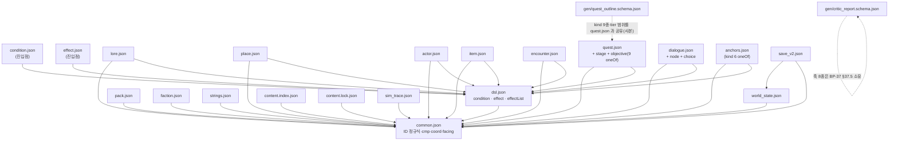

# 부록 A — JSON Schema 전문

> `상태: 보류` — **설계는 유효하나 현재 노선에서는 구현하지 않는다.**
> 지금 노선은 원작 방식(플래그 + cm2)의 **sample-first** 다 → [`issues/MILESTONES.md`](../issues/MILESTONES.md).
> 이 장이 필요해지는 신호는 [`issues/MILESTONES.md` §5](../issues/MILESTONES.md) 에 있다. **읽고 바로 구현하지 말 것.**

> **문서 ID**: BP-90 · **상태**: 개정 3판(D-31 반영 · **미해소 불일치 0** 달성) · **선행 문서**: [BP-21](21_content_pack_spec.md)
> **독자**: 콘텐츠 툴 구현자 · 런타임 구현자 · 생성 에이전트 작성자 · 검수자
> **한 줄 요약**: 각 장에 흩어진 스키마 정의를 **실행 가능한 JSON Schema 파일 22개**로 굳히고, 열거값이 소유 장과 문자 단위로 일치하는지 대조한 결과를 남긴다.

**파이프라인 구획**(D-01): 이 장은 **Build 구획의 입력 계약**이다. 여기 실린 스키마는
`hadar_content build` 의 L1 검사(BP-33 §4.1)와 콘텐츠 서버의 쓰기 검증(BP-31 §5.1)이 그대로 로드한다.
런타임은 스키마를 로드하지 않는다 — 이미 검증된 번들만 읽는다.

**이 장이 SSoT 인 것: 없다.** 이 장은 **소유 장의 정의를 기계 판독 형식으로 옮긴 사본**이다(D-18).
정의가 어긋나면 **언제나 소유 장이 이긴다.** 옮기다 발견한 불일치는 §5 에 기록만 하고 고치지 않았다.

**개정 이력**

| 판 | 반영 내용 |
|---|---|
| 초판 | 스키마 22종 원문 · 참조 관계도 · 정합성 대조 80항목 · **불일치 20건(`I-01`~`I-20`) 적발** · 스키마 미적용 3범주 |
| **개정 2판** | **불일치 재대조** — §5.2.1 상태표 신설(해소 14 · 부분 2 · 미해소 4). §5.2 초판 기록은 **이력으로 보존**하고 상태의 정본을 §5.2.1 로 이관. **D-30** — `I-06` **해소**(§5.2.1 (A) 6항 대조표), §2.3 에 `chanceSeedId` 번들 필드 선언 + 소스↔번들 프로파일을 [BP-33](33_validation_and_lint.md) `V-DET-014`/`015` 로 위임. **D-28** — `W-04` **문제 소멸**·부록 I-1 무의미화를 §5.2.1 (B) 로 기록(행 자체는 BP-91 소유). **소유 장 반영분 동기화** — §2.15 시각 필드명(`I-04`)·§2.16 `mapDelta.base`+`rle5`(`I-05`)·§4.5 payload 축(`I-01`)·§4.7 대조 요약(불일치 14 → **1**) |
| **개정 3판** | **D-31 반영 — 미해소 4건이 0 이 됐다.** 소유 장이 실제로 고친 것을 확인하고 §5.2.1 을 갱신: `I-09`(BP-23 이 `defeat.enemy` 를 **1~74** 로) · `I-16`(BP-23 이 `survive.turns` 를 **1~999** 로) · `I-18`(BP-23 이 payload 정본을 §23.11.1 하나로 단일화) · `I-20`(D-31 이 `do` 를 **25종**으로 확장, BP-21 §7.2.1 승격 실행 · BP-22 `Q-22-4` 종결) → **전부 해소.** §2.3 `dsl.schema.json` 에 `restore`/`cure`/`grant_buff` + `resource`/`status`/`buff`/`turns`/`target` 반영, §2.5 `quest.schema.json` 의 `enemy.minimum`·`turns.maximum` 정정, §4.2·§4.3·§4.7 대조표 갱신. `W-04` 는 [BP-91](91_appendix_worked_example.md) 이 §5.2.1 (B) 근거로 행을 갱신한 것을 확인 |

| 주제 | 소유 장 | 이 장의 산출물 |
|---|---|---|
| Condition/Effect DSL, ID 문법, 팩 매니페스트 | [BP-21](21_content_pack_spec.md) | `pack` · `dsl` · `condition` · `effect` · `strings` |
| 세계관·액터·아이템 카탈로그 | [BP-22](22_world_bible_model.md) | `lore` · `faction` · `place` · `actor` · `item` · `encounter` |
| Quest/Stage/Objective | [BP-23](23_quest_model.md) | `quest` |
| Dialogue/Node/Choice | [BP-24](24_dialogue_model.md) | `dialogue` |
| WorldState · 세이브 v2 | [BP-25](25_world_state_and_save.md) | `world_state` · `save_v2` |
| 앵커 | [BP-26](26_entity_registry_and_anchors.md) | `anchors` |
| 빌드 산출물 | [BP-35](35_ci_and_build.md) | `content.index` · `content.lock` |
| 트레이스 | [BP-34](34_headless_sim_and_solver.md) | `sim_trace` |
| 생성 산출물 | [BP-37](37_prompt_contracts.md) | `gen/quest_outline` · `gen/critic_report` |

---

## 1. 스키마 규약

### 1.1 드래프트와 방언

| 항목 | 값 | 근거 |
|---|---|---|
| 드래프트 | **JSON Schema 2020-12** | `$defs`·`prefixItems`·`dependentRequired` 를 쓴다. Dart `json_schema` 3.x, TS `ajv` 8.x 가 모두 지원 |
| `$schema` | `"https://json-schema.org/draft/2020-12/schema"` — **모든 파일 최상단 필수** | 검증기 방언 자동 선택 |
| 어휘 확장 | **금지**. 커스텀 키워드를 만들지 않는다 | 두 언어(Dart/TS) 구현이 갈라지지 않게. 스키마로 표현 못 하는 제약은 L2~L4 규칙([BP-33](33_validation_and_lint.md))으로 내린다 |
| `format` | `"date-time"` 만 사용(그것도 `pack.json#generatedBy.at` 한 곳). 나머지는 전부 `pattern` | `format` 은 드래프트상 주석 취급이라 구현마다 검사 여부가 다르다 |
| 부동소수 | `"type": "number"` **금지**. 전부 `"integer"` | [BP-21 §8](21_content_pack_spec.md) 부동소수 금지 |
| 미지 필드 | `"additionalProperties": false` **전 객체 필수** | 오타 필드를 하드 실패로. cm2 의 침묵 실패와 정반대(GROUND_TRUTH §9) |

- **R-90-1** 스키마 파일은 `additionalProperties: false` 가 빠진 객체를 하나도 갖지 않는다.
  `tools/content_cli/test/schema_selfcheck_test.dart` 가 스키마 자체를 순회하며 이를 검사한다.
- **R-90-2** 스키마 파일에 한국어 설명(`description`)을 넣는다. 이 문자열은 **생성 에이전트 프롬프트의
  P0 블록**([BP-32 §32.5.2](32_generation_harness.md))에 그대로 실리므로, 설명이 곧 지시문이다.

### 1.2 `$id` 명명 규칙

```
콘텐츠 스키마      https://hadar2026/schema/<name>.json
생성 산출물 스키마  https://hadar2026/schema/gen/<name>.schema.json
디스크 경로        tools/content_cli/schemas/<name>.schema.json
                  tools/content_cli/schemas/gen/<name>.schema.json
```

- `$id` 의 마지막 세그먼트와 디스크 파일명이 **다르다**(콘텐츠 쪽은 `.schema` 가 빠져 있다).
  이는 소유 장의 표기를 그대로 옮긴 결과다 — [BP-21 §3.7](21_content_pack_spec.md) 이
  `https://hadar2026/schema/pack.json`, [BP-35 §1.4](35_ci_and_build.md) 가
  `https://hadar2026/schema/content.bundle.json` 을 쓰는 반면
  [BP-37 §37.4.1](37_prompt_contracts.md) 은 `https://hadar2026/schema/gen/quest_outline.schema.json` 을 쓴다.
  **두 규칙이 병존한다** → §5.2 `I-12`.
- **R-90-3** `$ref` 는 항상 **절대 `$id` + JSON 포인터**로 쓴다(`https://hadar2026/schema/dsl.json#/$defs/condition`).
  상대 경로 `$ref` 는 로더의 base URI 해석에 의존하므로 금지한다.

### 1.3 공통 `$defs` 의 위치

| 파일 | 담는 것 |
|---|---|
| `common.schema.json` | ID 정규식 3종(엔티티/상태/문자열), 타입별 ID 패턴, `cmp`, `localId`, `mapName`, `coord` |
| `dsl.schema.json` | `condition` / `effect` / `effectList` — **BP-21 §6.8 의 `$id: dsl.json` 을 그대로 계승** |
| `condition.schema.json` | `dsl.json#/$defs/condition` 을 가리키는 얇은 진입점(단독 검증용) |
| `effect.schema.json` | `dsl.json#/$defs/effect` 를 가리키는 얇은 진입점 |

- **R-90-4** Condition/Effect 의 **실체 정의는 `dsl.schema.json` 한 곳뿐**이다.
  `condition.schema.json` / `effect.schema.json` 은 `$ref` 만 담는다. 사본을 만들면
  BP-21 이 op 를 추가했을 때 두 곳을 고쳐야 하고, 그 순간 D-18 이 깨진다.

### 1.4 버전 표기

| 축 | 어디에 | 누가 올리나 | 이 장의 반영 |
|---|---|---|---|
| `schemaVersion` (정수) | `pack.json`, 각 엔티티 파일, `WorldState` | 엔진 개발자 ([BP-21 §7.2](21_content_pack_spec.md)) | 모든 엔티티 스키마가 `schemaVersion` 을 required 로 갖는다 |
| `formatVersion` (정수) | `content.bundle.json` · `content.index.json` · `content.lock.json` | BP-35 소유 | 산출물 스키마만 갖는다 |
| `traceVersion` (정수) | `*.trace.json` | BP-34 소유 | 트레이스 스키마만 갖는다 |
| `version` (semver 문자열) | `pack.json` | 콘텐츠 작성자/빌드 | `pattern` 으로 프리릴리스·빌드메타를 배제 |

- 현행 값: 콘텐츠 `schemaVersion = 1`, `WorldState.schemaVersion = 2`(BP-25 §2.1 `kWorldStateSchemaVersion`),
  번들·인덱스·락 `formatVersion = 1`, 트레이스 `traceVersion = 1`.
- **R-90-5** 콘텐츠 `schemaVersion`(1) 과 `WorldState.schemaVersion`(2) 은 **서로 다른 축**이다.
  두 숫자가 다른 것은 오타가 아니다 — 세이브는 v1 이 이미 존재했으므로 2 에서 시작한다.

---

## 2. 전체 스키마 원문

### 2.1 `common.schema.json`

```json
{
  "$schema": "https://json-schema.org/draft/2020-12/schema",
  "$id": "https://hadar2026/schema/common.json",
  "title": "Hadar2026 콘텐츠 공통 정의",
  "$defs": {
    "packId":    { "type": "string", "pattern": "^[a-z][a-z0-9_]{2,31}$",
                   "description": "팩 id. 디렉토리 이름과 동일. 예약어 금지(BP-21 §4.5)" },
    "semver":    { "type": "string", "pattern": "^(0|[1-9]\\d*)\\.(0|[1-9]\\d*)\\.(0|[1-9]\\d*)$",
                   "description": "MAJOR.MINOR.PATCH. 프리릴리스·빌드메타 금지" },

    "entityId":  { "type": "string",
                   "pattern": "^(npc|quest|item|dlg|place|anchor|faction|enc|lore)\\.[a-z][a-z0-9_]{2,31}\\.[a-z][a-z0-9_]{2,47}$",
                   "description": "<type>.<pack>.<slug> 3 세그먼트 (BP-21 §4.1)" },
    "stateKey":  { "type": "string",
                   "pattern": "^(flag|var)\\.[a-z][a-z0-9_]{2,31}\\.[a-z][a-z0-9_]{2,31}(\\.[a-z][a-z0-9_]{2,47})+$",
                   "description": "<flag|var>.<pack>.<domain>.<name...> 4 세그먼트 이상" },
    "stringKey": { "type": "string",
                   "pattern": "^str\\.[a-z][a-z0-9_]{2,31}\\.(npc|quest|item|dlg|place|faction|enc|lore|ui)\\.[a-z][a-z0-9_]{2,47}\\.[a-z][a-z0-9_]{2,47}$",
                   "description": "str.<pack>.<owner_type>.<owner_slug>.<slot> (BP-21 §5.2)" },

    "flagKey":   { "type": "string", "pattern": "^flag\\.[a-z][a-z0-9_]{2,31}\\.[a-z][a-z0-9_]{2,31}(\\.[a-z][a-z0-9_]{2,47})+$" },
    "varKey":    { "type": "string", "pattern": "^var\\.[a-z][a-z0-9_]{2,31}\\.[a-z][a-z0-9_]{2,31}(\\.[a-z][a-z0-9_]{2,47})+$" },
    "npcId":     { "type": "string", "pattern": "^npc\\.[a-z][a-z0-9_]{2,31}\\.[a-z][a-z0-9_]{2,47}$" },
    "questId":   { "type": "string", "pattern": "^quest\\.[a-z][a-z0-9_]{2,31}\\.[a-z][a-z0-9_]{2,47}$" },
    "itemId":    { "type": "string", "pattern": "^item\\.[a-z][a-z0-9_]{2,31}\\.[a-z][a-z0-9_]{2,47}$" },
    "dlgId":     { "type": "string", "pattern": "^dlg\\.[a-z][a-z0-9_]{2,31}\\.[a-z][a-z0-9_]{2,47}$" },
    "placeId":   { "type": "string", "pattern": "^place\\.[a-z][a-z0-9_]{2,31}\\.[a-z][a-z0-9_]{2,47}$" },
    "anchorId":  { "type": "string", "pattern": "^anchor\\.[a-z][a-z0-9_]{2,31}\\.[a-z][a-z0-9_]{2,47}$" },
    "factionId": { "type": "string", "pattern": "^faction\\.[a-z][a-z0-9_]{2,31}\\.[a-z][a-z0-9_]{2,47}$" },
    "encId":     { "type": "string", "pattern": "^enc\\.[a-z][a-z0-9_]{2,31}\\.[a-z][a-z0-9_]{2,47}$" },
    "loreId":    { "type": "string", "pattern": "^lore\\.[a-z][a-z0-9_]{2,31}\\.[a-z][a-z0-9_]{2,47}$" },

    "localId":     { "type": "string", "pattern": "^[a-z][a-z0-9_]{1,31}$",
                     "description": "Stage/Node 등 부모 안에서만 유일한 지역 ID (BP-21 §4.2)" },
    "objectiveId": { "type": "string", "pattern": "^o_[a-z0-9_]{1,29}$" },
    "choiceId":    { "type": "string", "pattern": "^c_[a-z0-9_]{1,29}$" },

    "cmp":     { "enum": ["==", "!=", "<", "<=", ">", ">="] },
    "mapName": { "type": "string", "minLength": 1,
                 "description": "MapInfos.json#name 의 값. 대소문자 그대로" },
    "coord":   { "type": "integer", "minimum": 0, "maximum": 4095 },
    "facing":  { "enum": ["down", "up", "right", "left"],
                 "description": "HDParty.faced 0/1/2/3 에 대응 (BP-26 §2.5)" },

    "note":  { "type": "string", "maxLength": 2000,
               "description": "주석 대용. 빌드가 번들에서 제거한다" },
    "notes": { "type": "array", "items": { "type": "string", "maxLength": 2000 } }
  }
}
```

### 2.2 `pack.schema.json`

[BP-21 §3](21_content_pack_spec.md) 의 필드 표 전량. §3.7 의 발췌를 전체로 확장한 것이다.

```json
{
  "$schema": "https://json-schema.org/draft/2020-12/schema",
  "$id": "https://hadar2026/schema/pack.json",
  "title": "Content Pack 매니페스트",
  "type": "object",
  "required": ["id", "schemaVersion", "version", "title", "dependsOn", "generatedBy"],
  "additionalProperties": false,
  "properties": {
    "id":            { "$ref": "https://hadar2026/schema/common.json#/$defs/packId" },
    "schemaVersion": { "type": "integer", "minimum": 1,
                       "description": "빌드가 아는 최대치보다 크면 하드 실패" },
    "version":       { "$ref": "https://hadar2026/schema/common.json#/$defs/semver" },
    "title":         { "type": "string", "minLength": 1, "maxLength": 60,
                       "description": "툴 UI 전용. 문자열 키가 아니다(인라인 한국어 허용 예외)" },
    "dependsOn": {
      "type": "array", "uniqueItems": true,
      "items": { "$ref": "https://hadar2026/schema/common.json#/$defs/packId" },
      "description": "위상 정렬 대상. 순환 금지(R-21-3)"
    },
    "generatedBy": {
      "type": "object",
      "required": ["kind"],
      "additionalProperties": false,
      "properties": {
        "kind":          { "enum": ["human", "agent", "mixed"] },
        "pipeline":      { "type": "string", "maxLength": 80 },
        "model":         { "type": "string", "maxLength": 80 },
        "promptVersion": { "type": "string", "maxLength": 40 },
        "at":            { "type": "string", "format": "date-time",
                           "description": "ISO-8601 UTC. content.lock.json 이 아니라 여기 둔다 — lock 은 시각을 담지 않는다" }
      }
    },
    "description": { "type": "string", "maxLength": 500 },
    "authors":     { "type": "array", "items": { "type": "string", "maxLength": 60 } },
    "license":     { "type": "string", "maxLength": 40 },
    "idPrefix":    { "$ref": "https://hadar2026/schema/common.json#/$defs/packId" },
    "retiredIds": {
      "type": "array",
      "items": {
        "type": "object",
        "required": ["id", "retiredAt", "reason"],
        "additionalProperties": false,
        "properties": {
          "id":         { "$ref": "https://hadar2026/schema/common.json#/$defs/entityId" },
          "retiredAt":  { "$ref": "https://hadar2026/schema/common.json#/$defs/semver" },
          "reason":     { "type": "string", "maxLength": 300 },
          "replacedBy": { "oneOf": [
                            { "$ref": "https://hadar2026/schema/common.json#/$defs/entityId" },
                            { "type": "null" } ] }
        }
      },
      "description": "ID 는 불변·재사용 금지. 지운 엔티티는 여기 남는다(R-21-16~18)"
    },
    "migrations": {
      "type": "array",
      "items": {
        "type": "object",
        "required": ["from", "to", "steps"],
        "additionalProperties": false,
        "properties": {
          "from": { "type": "integer", "minimum": 1 },
          "to":   { "type": "integer", "minimum": 2 },
          "steps": {
            "type": "array", "minItems": 1,
            "items": {
              "type": "object",
              "required": ["kind"],
              "additionalProperties": false,
              "properties": {
                "kind":       { "enum": ["rename_id", "rename_field", "set_default",
                                         "drop_field", "retire_id", "remap_enum", "split_file"] },
                "from":       { "type": "string" },
                "to":         { "type": "string" },
                "path":       { "type": "string" },
                "field":      { "type": "string" },
                "value":      true,
                "id":         { "$ref": "https://hadar2026/schema/common.json#/$defs/entityId" },
                "replacedBy": { "$ref": "https://hadar2026/schema/common.json#/$defs/entityId" },
                "map":        { "type": "object", "additionalProperties": { "type": "string" } }
              }
            }
          }
        }
      },
      "description": "선언적 마이그레이션. 임의 스크립트 금지(R-21-43)"
    },
    "entryPoints": {
      "type": "object",
      "additionalProperties": false,
      "properties": {
        "quests":  { "type": "array", "items": { "$ref": "https://hadar2026/schema/common.json#/$defs/questId" } },
        "anchors": { "type": "array", "items": { "$ref": "https://hadar2026/schema/common.json#/$defs/anchorId" } },
        "places":  { "type": "array", "items": { "$ref": "https://hadar2026/schema/common.json#/$defs/placeId" } }
      },
      "description": "이 팩이 월드에 붙는 지점. 고아 콘텐츠 린트의 근거(R-21-12)"
    },
    "contentBudget": {
      "type": "object",
      "additionalProperties": false,
      "properties": {
        "maxQuests":        { "type": "integer", "minimum": 1, "default": 50 },
        "maxDialogueNodes": { "type": "integer", "minimum": 1, "default": 2000 },
        "maxStringChars":   { "type": "integer", "minimum": 1, "default": 400000 },
        "warnLineChars":    { "type": "integer", "minimum": 1, "default": 31 },
        "warnNodePages":    { "type": "integer", "minimum": 1, "default": 2 }
      }
    },
    "_note":  { "$ref": "https://hadar2026/schema/common.json#/$defs/note" },
    "_notes": { "$ref": "https://hadar2026/schema/common.json#/$defs/notes" }
  }
}
```

> **주의(§5.2 `I-10`)**: `contentBudget.warnLineChars` 기본값 `31` 은 [BP-21 §3.4·§5.5](21_content_pack_spec.md) 값이다.
> [BP-24 §24.5.5](24_dialogue_model.md) 는 같은 대상을 **권장 28자 / 경고 29~45 / 에러 >45** 로 규정한다.
> 스키마는 소유 장(BP-21)의 기본값을 그대로 옮겼다. 조정은 두 장 사이의 조정 사항이다.

### 2.3 `dsl.schema.json` — Condition / Effect 실체 정의

**이 파일이 [BP-21 §6](21_content_pack_spec.md) 의 기계 판독 사본이다.** op 18종·**do 25종**을
§6.3·§6.6 의 표에서 **문자 단위로 옮겼다**(대조 결과 §4.1·§4.2).

> **do 25종은 D-31 확장 반영분이다** (`I-20` 해소 · `schemaVersion` 2). 소유 장의 승격 실행 기록은
> [BP-21 §7.2.1](21_content_pack_spec.md) 이며, 이 파일은 그 결과를 옮겼을 뿐이다 — `restore`/`cure`/`grant_buff`
> 3종과 그것이 쓰는 인자 5개(`resource`·`status`·`buff`·`turns`·`target`)가 추가분이다.

```json
{
  "$schema": "https://json-schema.org/draft/2020-12/schema",
  "$id": "https://hadar2026/schema/dsl.json",
  "title": "Condition / Effect DSL (SSoT: BP-21 §6)",
  "$defs": {
    "condition": {
      "type": "object",
      "required": ["op"],
      "additionalProperties": false,
      "description": "단일 JSON 객체. 부작용 없음. chance 를 제외하면 같은 WorldState 에서 항상 같은 값",
      "properties": {
        "op": {
          "enum": ["true", "false", "and", "or", "not",
                   "flag", "var_cmp", "has_item",
                   "quest_state", "quest_stage", "party_has_class", "party_level_cmp",
                   "gold_cmp", "map_is", "visited", "npc_state", "time_of_day", "chance"]
        },
        "args":    { "type": "array", "minItems": 1, "maxItems": 16,
                     "items": { "$ref": "https://hadar2026/schema/dsl.json#/$defs/condition" } },
        "arg":     { "$ref": "https://hadar2026/schema/dsl.json#/$defs/condition" },
        "id":      { "type": "string" },
        "cmp":     { "$ref": "https://hadar2026/schema/common.json#/$defs/cmp" },
        "value":   { "type": ["integer", "string"] },
        "count":   { "type": "integer", "minimum": 1 },
        "state":   { "type": "string" },
        "stage":   { "$ref": "https://hadar2026/schema/common.json#/$defs/localId" },
        "classId": { "type": "integer", "minimum": 0, "maximum": 2 },
        "mapName": { "$ref": "https://hadar2026/schema/common.json#/$defs/mapName" },
        "placeId": { "$ref": "https://hadar2026/schema/common.json#/$defs/placeId" },
        "percent": { "type": "integer", "minimum": 1, "maximum": 99 },
        "chanceSeedId": { "type": "integer",
                     "description": "**빌드 산출물 전용 필드**(D-29a·D-30). 빌드가 mix(hashString(chanceKey)) 로 계산해 번들의 chance 노드에 굽는다. 소스에 쓰면 안 되고, 번들에는 반드시 있어야 한다 — 두 방향 강제는 BP-33 V-DET-014/V-DET-015. 형식·소비는 BP-27 §9.2, 생성 절차는 BP-35 §1.4.1" }
      },
      "allOf": [
        { "if": { "properties": { "op": { "const": "true"  } }, "required": ["op"] },
          "then": { "properties": { "op": true } } },
        { "if": { "properties": { "op": { "const": "false" } }, "required": ["op"] },
          "then": { "properties": { "op": true } } },
        { "if": { "properties": { "op": { "const": "and" } }, "required": ["op"] },
          "then": { "required": ["args"] } },
        { "if": { "properties": { "op": { "const": "or" } }, "required": ["op"] },
          "then": { "required": ["args"] } },
        { "if": { "properties": { "op": { "const": "not" } }, "required": ["op"] },
          "then": { "required": ["arg"] } },
        { "if": { "properties": { "op": { "const": "flag" } }, "required": ["op"] },
          "then": { "required": ["id"],
                    "properties": { "id": { "$ref": "https://hadar2026/schema/common.json#/$defs/flagKey" } } } },
        { "if": { "properties": { "op": { "const": "var_cmp" } }, "required": ["op"] },
          "then": { "required": ["id", "cmp", "value"],
                    "properties": { "id": { "$ref": "https://hadar2026/schema/common.json#/$defs/varKey" },
                                    "value": { "type": "integer",
                                               "minimum": -2147483648, "maximum": 2147483647 } } } },
        { "if": { "properties": { "op": { "const": "has_item" } }, "required": ["op"] },
          "then": { "required": ["id"],
                    "properties": { "id": { "$ref": "https://hadar2026/schema/common.json#/$defs/itemId" },
                                    "count": { "type": "integer", "minimum": 1, "default": 1 } } } },
        { "if": { "properties": { "op": { "const": "quest_state" } }, "required": ["op"] },
          "then": { "required": ["id", "state"],
                    "properties": { "id": { "$ref": "https://hadar2026/schema/common.json#/$defs/questId" },
                                    "state": { "enum": ["inactive", "active", "completed", "failed"] } } } },
        { "if": { "properties": { "op": { "const": "quest_stage" } }, "required": ["op"] },
          "then": { "required": ["id", "stage"],
                    "properties": { "id": { "$ref": "https://hadar2026/schema/common.json#/$defs/questId" } } } },
        { "if": { "properties": { "op": { "const": "party_has_class" } }, "required": ["op"] },
          "then": { "required": ["classId"] } },
        { "if": { "properties": { "op": { "const": "party_level_cmp" } }, "required": ["op"] },
          "then": { "required": ["cmp", "value"],
                    "properties": { "value": { "type": "integer", "minimum": 1, "maximum": 21 } } } },
        { "if": { "properties": { "op": { "const": "gold_cmp" } }, "required": ["op"] },
          "then": { "required": ["cmp", "value"],
                    "properties": { "value": { "type": "integer", "minimum": 0 } } } },
        { "if": { "properties": { "op": { "const": "map_is" } }, "required": ["op"] },
          "then": { "required": ["mapName"] } },
        { "if": { "properties": { "op": { "const": "visited" } }, "required": ["op"] },
          "then": { "required": ["placeId"] } },
        { "if": { "properties": { "op": { "const": "npc_state" } }, "required": ["op"] },
          "then": { "required": ["id", "state"],
                    "properties": { "id": { "$ref": "https://hadar2026/schema/common.json#/$defs/npcId" },
                                    "state": { "$ref": "https://hadar2026/schema/common.json#/$defs/localId" } } } },
        { "if": { "properties": { "op": { "const": "time_of_day" } }, "required": ["op"] },
          "then": { "required": ["value"],
                    "properties": { "value": { "enum": ["day", "night"] } } } },
        { "if": { "properties": { "op": { "const": "chance" } }, "required": ["op"] },
          "then": { "required": ["percent"] } },
        { "if":   { "required": ["chanceSeedId"] },
          "then": { "properties": { "op": { "const": "chance" } },
                    "description": "chanceSeedId 는 op:\"chance\" 노드에만 붙는다" } }
      ]
    },

    "effect": {
      "type": "object",
      "required": ["do"],
      "additionalProperties": false,
      "description": "배열의 원소. 선언 순서대로 전부 적용된다. 조건 분기 없음(R-21-30)",
      "properties": {
        "do": {
          "enum": ["set_flag", "clear_flag", "set_var", "add_var",
                   "give_item", "take_item", "add_gold", "add_food",
                   "start_quest", "advance_quest", "complete_quest", "fail_quest",
                   "set_npc_state", "warp", "change_tile", "start_battle",
                   "play_dialogue", "journal", "heal_party", "grant_exp",
                   "set_encounter", "unlock_place",
                   "restore", "cure", "grant_buff"]
        },
        "id":          { "type": "string" },
        "value":       { "type": "integer", "minimum": -2147483648, "maximum": 2147483647 },
        "delta":       { "type": "integer", "minimum": -2147483648, "maximum": 2147483647 },
        "count":       { "type": "integer", "minimum": 1 },
        "state":       { "$ref": "https://hadar2026/schema/common.json#/$defs/localId" },
        "stage":       { "$ref": "https://hadar2026/schema/common.json#/$defs/localId" },
        "map":         { "$ref": "https://hadar2026/schema/common.json#/$defs/mapName" },
        "x":           { "$ref": "https://hadar2026/schema/common.json#/$defs/coord" },
        "y":           { "$ref": "https://hadar2026/schema/common.json#/$defs/coord" },
        "tile":        { "type": "integer", "minimum": 0, "maximum": 127,
                         "description": "A5 인덱스. objUpper(B 타일)가 아니다 — §5.2 I-17" },
        "encounterId": { "$ref": "https://hadar2026/schema/common.json#/$defs/encId" },
        "entryKey":    { "$ref": "https://hadar2026/schema/common.json#/$defs/stringKey" },
        "percent":     { "type": "integer", "minimum": 1, "maximum": 100 },
        "amount":      { "type": "integer", "minimum": 1 },
        "rate":        { "type": "integer", "minimum": 0, "maximum": 10 },
        "resource":    { "enum": ["sp", "esp"],
                         "description": "E23 restore. hp 는 의도적으로 없다 — E19 heal_party 가 담당(BP-21 §6.6 상세)" },
        "status":      { "enum": ["poison", "unconscious", "dead"],
                         "description": "E24 cure. HDPlayer 에 실재하는 3필드(BP-42 §1.7 계열 실측)" },
        "buff":        { "enum": ["magicTorch", "walkOnWater", "canUseEsp"],
                         "description": "E25 grant_buff. PartyBuffs 8필드 중 런타임이 읽는 3종만. 나머지 5종은 하드 실패 — BP-21 R-21-68 / CV-16, 근거는 BP-42 §1.7" },
        "turns":       { "type": "integer", "minimum": 1, "maximum": 999 },
        "target":      { "type": "string",
                         "pattern": "^(all|leader|slot:[0-5]|lowest:(hp|sp|esp))$",
                         "default": "all",
                         "description": "E23/E24 공통. 4형태 닫힌 집합 — BP-21 §6.6.1. slot 상한 5 는 파티 최대 6인" }
      },
      "allOf": [
        { "if": { "properties": { "do": { "enum": ["set_flag", "clear_flag"] } }, "required": ["do"] },
          "then": { "required": ["id"],
                    "properties": { "id": { "$ref": "https://hadar2026/schema/common.json#/$defs/flagKey" } } } },
        { "if": { "properties": { "do": { "const": "set_var" } }, "required": ["do"] },
          "then": { "required": ["id", "value"],
                    "properties": { "id": { "$ref": "https://hadar2026/schema/common.json#/$defs/varKey" } } } },
        { "if": { "properties": { "do": { "const": "add_var" } }, "required": ["do"] },
          "then": { "required": ["id", "delta"],
                    "properties": { "id": { "$ref": "https://hadar2026/schema/common.json#/$defs/varKey" } } } },
        { "if": { "properties": { "do": { "enum": ["give_item", "take_item"] } }, "required": ["do"] },
          "then": { "required": ["id"],
                    "properties": { "id": { "$ref": "https://hadar2026/schema/common.json#/$defs/itemId" },
                                    "count": { "type": "integer", "minimum": 1, "default": 1 } } } },
        { "if": { "properties": { "do": { "enum": ["add_gold", "add_food"] } }, "required": ["do"] },
          "then": { "required": ["delta"] } },
        { "if": { "properties": { "do": { "enum": ["start_quest", "complete_quest", "fail_quest"] } }, "required": ["do"] },
          "then": { "required": ["id"],
                    "properties": { "id": { "$ref": "https://hadar2026/schema/common.json#/$defs/questId" } } } },
        { "if": { "properties": { "do": { "const": "advance_quest" } }, "required": ["do"] },
          "then": { "required": ["id", "stage"],
                    "properties": { "id": { "$ref": "https://hadar2026/schema/common.json#/$defs/questId" } } } },
        { "if": { "properties": { "do": { "const": "set_npc_state" } }, "required": ["do"] },
          "then": { "required": ["id", "state"],
                    "properties": { "id": { "$ref": "https://hadar2026/schema/common.json#/$defs/npcId" } } } },
        { "if": { "properties": { "do": { "const": "warp" } }, "required": ["do"] },
          "then": { "required": ["map", "x", "y"] } },
        { "if": { "properties": { "do": { "const": "change_tile" } }, "required": ["do"] },
          "then": { "required": ["x", "y", "tile"] } },
        { "if": { "properties": { "do": { "const": "start_battle" } }, "required": ["do"] },
          "then": { "required": ["encounterId"] } },
        { "if": { "properties": { "do": { "const": "play_dialogue" } }, "required": ["do"] },
          "then": { "required": ["id"],
                    "properties": { "id": { "$ref": "https://hadar2026/schema/common.json#/$defs/dlgId" } } } },
        { "if": { "properties": { "do": { "const": "journal" } }, "required": ["do"] },
          "then": { "required": ["entryKey"] } },
        { "if": { "properties": { "do": { "const": "heal_party" } }, "required": ["do"] },
          "then": { "required": ["percent"] } },
        { "if": { "properties": { "do": { "const": "grant_exp" } }, "required": ["do"] },
          "then": { "required": ["amount"] } },
        { "if": { "properties": { "do": { "const": "set_encounter" } }, "required": ["do"] },
          "then": { "required": ["rate"] } },
        { "if": { "properties": { "do": { "const": "unlock_place" } }, "required": ["do"] },
          "then": { "required": ["id"],
                    "properties": { "id": { "$ref": "https://hadar2026/schema/common.json#/$defs/placeId" } } } },
        { "if": { "properties": { "do": { "const": "restore" } }, "required": ["do"] },
          "then": { "required": ["resource", "percent"] } },
        { "if": { "properties": { "do": { "const": "cure" } }, "required": ["do"] },
          "then": { "required": ["status"] } },
        { "if": { "properties": { "do": { "const": "grant_buff" } }, "required": ["do"] },
          "then": { "required": ["buff", "turns"] } }
      ]
    },

    "effectList": {
      "type": "array",
      "maxItems": 32,
      "items": { "$ref": "https://hadar2026/schema/dsl.json#/$defs/effect" },
      "description": "전부 적용되거나 전혀 적용되지 않는다(R-21-31). 꼬리 호출 규칙은 스키마로 표현 불가 → L3 규칙"
    }
  }
}
```

**스키마로 표현하지 못해 규칙 계층으로 내려간 것** (BP-33 이 검사):

| 소유 규칙 | 내용 | 이유 |
|---|---|---|
| R-21-28 | `and`/`or`/`not` 중첩 깊이 ≤ 8 | JSON Schema 에 재귀 깊이 제한 키워드가 없다 |
| R-21-36 | 완주 필수 경로를 `chance` 뒤에 두지 말 것 | 솔버 판정이 필요 |
| R-21-38 | `play_dialogue` 는 Effect 배열의 **마지막 원소**여야 함 | 배열 위치 조건은 `prefixItems`+`contains` 조합으로도 "마지막" 을 못 잡는다 |
| R-21-39 | `play_dialogue` 체인 깊이 ≤ 4 | 그래프 순회 필요 |
| R-21-40 | `warp`/`start_battle`/`play_dialogue` 중 둘 이상 공존 금지 | 상호 배타 카운팅. `contains`+`maxContains` 로 부분 표현은 되나 3종 교차는 불가 |
| D-21 | `chance` 는 `rngCursor` 를 밀지 않는다 | 런타임 성질이며 데이터 형태가 아니다 |
| **D-30 (소스 프로파일)** | 소스의 `chance` 노드에 `chanceSeedId` 가 **있으면 ERROR** ([BP-33](33_validation_and_lint.md) `V-DET-014`) | 이 스키마는 소스와 번들을 **같은 `$defs/condition` 으로** 검증한다. 한 스키마로 "소스에는 금지, 번들에는 필수" 를 동시에 표현하려면 프로파일 분기가 필요하고, 그러면 `condition` 정의 전체를 재귀 포함해 **두 벌로 복제**해야 한다(R-90-4 위반) |
| **D-30 (번들 프로파일)** | 번들의 모든 `chance` 노드에 `chanceSeedId` 가 **없으면 ERROR** ([BP-33](33_validation_and_lint.md) `V-DET-015`) | 동상. 대신 `required` 를 걸지 않고 위 `allOf` 마지막 항으로 **"있다면 chance 노드여야 한다"** 만 강제한다 |
| C8 | `stackable:false` 아이템에 `count > 1` 금지 | 아이템 카탈로그를 읽어야 함(L2) |
| **R-21-68 (D-31)** | `grant_buff.buff` 화이트리스트가 **런타임 실측과 일치**하는지 | 위 `buff.enum` 은 **스키마가 강제할 수 있다**(3값 enum). 스키마가 못 잡는 것은 *"그 열거값이 지금도 코드에서 읽히는가"* 다 — [BP-42 §1.7](42_item_and_inventory.md) 의 실측표가 정본이고, 코드가 바뀌면 열거값이 따라와야 한다. 이 **동기화 검사**는 [BP-33](33_validation_and_lint.md) 소관(`CV-16`) |
| **R-21-66 (D-31)** | `target: "lowest:<resource>"` 의 **동점 처리가 슬롯 오름차순** | 선택 알고리즘은 런타임 성질이며 데이터 형태가 아니다. `pattern` 은 문법만 강제한다 |

### 2.4 `condition.schema.json` / `effect.schema.json`

단독 검증 진입점. **실체는 담지 않는다**(R-90-4).

> **D-31 파급이 0 인 이유** (`I-20`): `effect.schema.json` 은 `dsl.json#/$defs/effectList` 를 가리키는
> `$ref` 한 줄이므로, §2.3 에 `restore`/`cure`/`grant_buff` 를 넣은 것만으로 **이 파일은 자동으로 25종을 검증**한다.
> `R-90-4`(사본 금지)가 실제로 값을 한 사례다 — 사본을 두었다면 do 확장마다 두 파일을 고쳐야 하고,
> 한쪽을 잊으면 CLI 진입점에 따라 통과 여부가 달라진다.

> **프로파일 주의 (D-30)**: `condition.schema.json` 은 소스·번들 **양쪽**을 통과시킨다 —
> `chanceSeedId` 를 선택 필드로 두었기 때문이다(§2.3). 어느 프로파일인지에 따른 강제는
> [BP-33](33_validation_and_lint.md) `V-DET-014`(소스에 있으면 ERROR) · `V-DET-015`(번들에 없으면 ERROR)
> 쌍이 담당한다. CLI 가 이 스키마만 돌리고 통과했다고 프로파일이 맞다고 결론짓지 말 것.

```json
{
  "$schema": "https://json-schema.org/draft/2020-12/schema",
  "$id": "https://hadar2026/schema/condition.json",
  "title": "Condition (단독 검증 진입점)",
  "$ref": "https://hadar2026/schema/dsl.json#/$defs/condition"
}
```

```json
{
  "$schema": "https://json-schema.org/draft/2020-12/schema",
  "$id": "https://hadar2026/schema/effect.json",
  "title": "Effect 배열 (단독 검증 진입점)",
  "$ref": "https://hadar2026/schema/dsl.json#/$defs/effectList"
}
```

### 2.5 `quest.schema.json`

[BP-23 §23.2.1 / §23.3.1 / §23.4](23_quest_model.md) 전량. **Objective.kind 9종을 `oneOf` 로 분기**한다.

```json
{
  "$schema": "https://json-schema.org/draft/2020-12/schema",
  "$id": "https://hadar2026/schema/quest.json",
  "title": "Quest (SSoT: BP-23)",
  "type": "object",
  "required": ["id", "schemaVersion", "title", "summary", "pack", "act", "tier", "stages", "journal"],
  "additionalProperties": false,
  "properties": {
    "id":            { "$ref": "https://hadar2026/schema/common.json#/$defs/questId" },
    "schemaVersion": { "type": "integer", "minimum": 1 },
    "title":         { "$ref": "https://hadar2026/schema/common.json#/$defs/stringKey" },
    "summary":       { "$ref": "https://hadar2026/schema/common.json#/$defs/stringKey" },
    "pack":          { "$ref": "https://hadar2026/schema/common.json#/$defs/packId" },
    "act":           { "type": "integer", "minimum": 1, "maximum": 9 },
    "tier":          { "type": "integer", "minimum": 1, "maximum": 5,
                       "description": "난이도/보상 등급. 보상 권장 범위는 BP-23 §23.9.3" },
    "giver":         { "oneOf": [ { "$ref": "https://hadar2026/schema/common.json#/$defs/npcId" },
                                  { "type": "null" } ] },
    "place":         { "oneOf": [ { "$ref": "https://hadar2026/schema/common.json#/$defs/placeId" },
                                  { "type": "null" } ] },
    "prerequisites": { "$ref": "https://hadar2026/schema/dsl.json#/$defs/condition",
                       "default": { "op": "true" } },
    "autoStart":     { "type": "boolean", "default": false },
    "repeatable":    { "const": false,
                       "description": "v1 은 false 만 허용 (QV-14). v2 예약" },
    "stages":        { "type": "array", "minItems": 1, "maxItems": 32,
                       "items": { "$ref": "https://hadar2026/schema/quest.json#/$defs/stage" } },
    "entryStage":    { "$ref": "https://hadar2026/schema/common.json#/$defs/localId" },
    "onComplete":    { "$ref": "https://hadar2026/schema/dsl.json#/$defs/effectList" },
    "onFail":        { "$ref": "https://hadar2026/schema/dsl.json#/$defs/effectList" },
    "rewards":       { "$ref": "https://hadar2026/schema/dsl.json#/$defs/effectList" },
    "failConditions":{ "oneOf": [ { "$ref": "https://hadar2026/schema/dsl.json#/$defs/condition" },
                                  { "type": "null" } ],
                       "description": "null 이면 실패 불가 퀘스트" },
    "journal": {
      "type": "object",
      "minProperties": 1,
      "propertyNames": { "$ref": "https://hadar2026/schema/common.json#/$defs/localId" },
      "additionalProperties": { "$ref": "https://hadar2026/schema/common.json#/$defs/stringKey" },
      "description": "stageId → stringKey. 모든 stage 를 덮어야 함 (QV-08)"
    },
    "journalComplete": { "$ref": "https://hadar2026/schema/common.json#/$defs/stringKey" },
    "journalFail":     { "oneOf": [ { "$ref": "https://hadar2026/schema/common.json#/$defs/stringKey" },
                                    { "type": "null" } ],
                         "description": "failConditions 가 있으면 필수 (QV-09)" },
    "tags":      { "type": "array", "maxItems": 8, "uniqueItems": true,
                   "items": { "type": "string", "pattern": "^[a-z][a-z0-9_]{1,23}$" } },
    "mutex":     { "type": "array", "uniqueItems": true,
                   "items": { "$ref": "https://hadar2026/schema/common.json#/$defs/questId" } },
    "chainNext": { "type": "array", "uniqueItems": true,
                   "items": { "$ref": "https://hadar2026/schema/common.json#/$defs/questId" } },
    "generatedBy": { "oneOf": [ { "type": "string", "maxLength": 120 }, { "type": "null" } ] },
    "_note":  { "$ref": "https://hadar2026/schema/common.json#/$defs/note" },
    "_notes": { "$ref": "https://hadar2026/schema/common.json#/$defs/notes" }
  },

  "$defs": {
    "stage": {
      "type": "object",
      "required": ["id", "index", "title", "journal", "objectives", "next"],
      "additionalProperties": false,
      "properties": {
        "id":         { "$ref": "https://hadar2026/schema/common.json#/$defs/localId" },
        "index":      { "type": "integer", "minimum": 0 },
        "title":      { "$ref": "https://hadar2026/schema/common.json#/$defs/stringKey" },
        "journal":    { "$ref": "https://hadar2026/schema/common.json#/$defs/stringKey" },
        "objectives": { "type": "array", "minItems": 1, "maxItems": 8,
                        "items": { "$ref": "https://hadar2026/schema/quest.json#/$defs/objective" } },
        "completion": { "enum": ["all", "any"], "default": "all" },
        "onEnter":    { "$ref": "https://hadar2026/schema/dsl.json#/$defs/effectList" },
        "onExit":     { "$ref": "https://hadar2026/schema/dsl.json#/$defs/effectList" },
        "next":       { "$ref": "https://hadar2026/schema/quest.json#/$defs/nextRule" },
        "timeoutSteps": { "oneOf": [ { "type": "integer", "minimum": 1, "maximum": 99999 },
                                     { "type": "null" } ] },
        "_note": { "$ref": "https://hadar2026/schema/common.json#/$defs/note" }
      }
    },

    "nextRule": {
      "description": "3형태 (BP-23 §23.3.2). 배열형은 위에서부터 첫 참을 취하고, 마지막 원소의 when 은 {\"op\":\"true\"} 여야 한다(QV-06)",
      "oneOf": [
        { "$ref": "https://hadar2026/schema/common.json#/$defs/localId" },
        { "const": "complete" },
        { "type": "array", "minItems": 1, "maxItems": 8,
          "items": {
            "type": "object",
            "required": ["when", "go"],
            "additionalProperties": false,
            "properties": {
              "when": { "$ref": "https://hadar2026/schema/dsl.json#/$defs/condition" },
              "go":   { "oneOf": [ { "$ref": "https://hadar2026/schema/common.json#/$defs/localId" },
                                   { "const": "complete" } ] }
            }
          } }
      ]
    },

    "objectiveBase": {
      "type": "object",
      "required": ["id", "kind", "params"],
      "properties": {
        "id":       { "$ref": "https://hadar2026/schema/common.json#/$defs/objectiveId" },
        "kind":     { "enum": ["talk_to", "reach", "acquire", "deliver", "defeat",
                               "flag_set", "var_reach", "choose", "survive"] },
        "params":   { "type": "object" },
        "optional": { "type": "boolean", "default": false },
        "hidden":   { "type": "boolean", "default": false },
        "counter":  { "type": "object", "required": ["target"], "additionalProperties": false,
                      "properties": { "target": { "type": "integer", "minimum": 1, "maximum": 999 } } },
        "label":    { "oneOf": [ { "$ref": "https://hadar2026/schema/common.json#/$defs/stringKey" },
                                 { "type": "null" } ] },
        "_note":    { "$ref": "https://hadar2026/schema/common.json#/$defs/note" }
      },
      "additionalProperties": false
    },

    "objective": {
      "allOf": [ { "$ref": "https://hadar2026/schema/quest.json#/$defs/objectiveBase" } ],
      "oneOf": [
        {
          "title": "talk_to — NPC 와 대화",
          "properties": {
            "kind": { "const": "talk_to" },
            "params": {
              "type": "object", "required": ["actor"], "additionalProperties": false,
              "properties": { "actor": { "$ref": "https://hadar2026/schema/common.json#/$defs/npcId" } }
            }
          },
          "required": ["kind", "params"]
        },
        {
          "title": "reach — 장소/좌표 도달 (place 형과 좌표 형 택일)",
          "properties": {
            "kind": { "const": "reach" },
            "params": {
              "oneOf": [
                { "type": "object", "required": ["place"], "additionalProperties": false,
                  "properties": { "place": { "$ref": "https://hadar2026/schema/common.json#/$defs/placeId" } } },
                { "type": "object", "required": ["map", "x", "y"], "additionalProperties": false,
                  "properties": {
                    "map":    { "$ref": "https://hadar2026/schema/common.json#/$defs/mapName" },
                    "x":      { "$ref": "https://hadar2026/schema/common.json#/$defs/coord" },
                    "y":      { "$ref": "https://hadar2026/schema/common.json#/$defs/coord" },
                    "radius": { "type": "integer", "minimum": 0, "maximum": 32, "default": 0,
                                "description": "체비셰프 거리 max(|dx|,|dy|) <= radius" } } }
              ]
            }
          },
          "required": ["kind", "params"]
        },
        {
          "title": "acquire — 아이템 획득",
          "properties": {
            "kind": { "const": "acquire" },
            "params": {
              "type": "object", "required": ["item"], "additionalProperties": false,
              "properties": { "item":  { "$ref": "https://hadar2026/schema/common.json#/$defs/itemId" },
                              "count": { "type": "integer", "minimum": 1, "maximum": 999, "default": 1 } }
            }
          },
          "required": ["kind", "params"]
        },
        {
          "title": "deliver — 아이템 전달",
          "properties": {
            "kind": { "const": "deliver" },
            "params": {
              "type": "object", "required": ["item", "actor"], "additionalProperties": false,
              "properties": { "item":  { "$ref": "https://hadar2026/schema/common.json#/$defs/itemId" },
                              "actor": { "$ref": "https://hadar2026/schema/common.json#/$defs/npcId" },
                              "count": { "type": "integer", "minimum": 1, "maximum": 999, "default": 1 } }
            }
          },
          "required": ["kind", "params"]
        },
        {
          "title": "defeat — 적 격파 (encounter 형과 enemy 형 택일)",
          "properties": {
            "kind": { "const": "defeat" },
            "params": {
              "oneOf": [
                { "type": "object", "required": ["encounter"], "additionalProperties": false,
                  "properties": { "encounter": { "$ref": "https://hadar2026/schema/common.json#/$defs/encId" } } },
                { "type": "object", "required": ["enemy"], "additionalProperties": false,
                  "properties": {
                    "enemy": { "type": "integer", "minimum": 1, "maximum": 74,
                               "description": "enemy_data.dart 의 정수 id. BP-23 §23.4.3(5) 가 1~74 로 정정(I-09 해소). 하한 1 의 근거는 battle.dart:44 의 `<= 0` 가드 — id 0(Orc)은 소환 불가(부록 B-1)" },
                    "count": { "type": "integer", "minimum": 1, "maximum": 999, "default": 1 } } }
              ]
            }
          },
          "required": ["kind", "params"]
        },
        {
          "title": "flag_set — 이름 있는 플래그",
          "properties": {
            "kind": { "const": "flag_set" },
            "params": {
              "type": "object", "required": ["flag"], "additionalProperties": false,
              "properties": { "flag": { "$ref": "https://hadar2026/schema/common.json#/$defs/flagKey" } }
            }
          },
          "required": ["kind", "params"]
        },
        {
          "title": "var_reach — 수치 도달",
          "properties": {
            "kind": { "const": "var_reach" },
            "params": {
              "type": "object", "required": ["var", "value"], "additionalProperties": false,
              "properties": { "var":   { "$ref": "https://hadar2026/schema/common.json#/$defs/varKey" },
                              "cmp":   { "$ref": "https://hadar2026/schema/common.json#/$defs/cmp", "default": ">=" },
                              "value": { "type": "integer" } }
            }
          },
          "required": ["kind", "params"]
        },
        {
          "title": "choose — 특정 선택지 선택",
          "properties": {
            "kind": { "const": "choose" },
            "params": {
              "type": "object", "required": ["dialogue", "choice"], "additionalProperties": false,
              "properties": { "dialogue": { "$ref": "https://hadar2026/schema/common.json#/$defs/dlgId" },
                              "choice":   { "$ref": "https://hadar2026/schema/common.json#/$defs/choiceId" } }
            }
          },
          "required": ["kind", "params"]
        },
        {
          "title": "survive — N 스텝 버티기 (turn = step_tile 1건)",
          "properties": {
            "kind": { "const": "survive" },
            "params": {
              "type": "object", "required": ["turns"], "additionalProperties": false,
              "properties": { "turns": { "type": "integer", "minimum": 1, "maximum": 999,
                                         "description": "counter.target 과 같은 상한. BP-23 §23.4.3(9) 가 999 로 통일(I-16 해소)" } }
            }
          },
          "required": ["kind", "params"]
        }
      ]
    }
  }
}
```

**스키마로 표현하지 못한 퀘스트 제약** (BP-23 §23.6.1 → BP-33 이 검사):

| 규칙 | 내용 |
|---|---|
| `QV-03` | `next`/`params` 가 가리키는 stage·actor·item·dialogue 의 실재 |
| `QV-04` | `"complete"` 에 도달 가능한 stage 가 최소 1개 |
| `QV-05` | `completion:"any"` 인데 목표가 전부 `optional` |
| `QV-06` | 조건 분기 배열의 마지막 `when` 이 `{"op":"true"}` |
| `QV-08` | `Quest.journal` 이 모든 stage 를 덮음 + `Stage.journal` 과 동일 |
| `QV-13` | stage DAG 사이클 금지 |
| `QV-15/16/18` | 생산자 존재(플래그 `set_flag`·아이템 `give_item`·전달 `take_item`·변수 도달 상한) |
| `QV-31~36` | tier 대비 보상 밸런스 |

### 2.6 `dialogue.schema.json`

[BP-24 §24.2](24_dialogue_model.md) 전량.

```json
{
  "$schema": "https://json-schema.org/draft/2020-12/schema",
  "$id": "https://hadar2026/schema/dialogue.json",
  "title": "Dialogue (SSoT: BP-24)",
  "type": "object",
  "required": ["id", "schemaVersion", "pack", "speaker", "entry", "nodes"],
  "additionalProperties": false,
  "properties": {
    "id":            { "$ref": "https://hadar2026/schema/common.json#/$defs/dlgId" },
    "schemaVersion": { "type": "integer", "minimum": 1 },
    "pack":          { "$ref": "https://hadar2026/schema/common.json#/$defs/packId" },
    "speaker":       { "$ref": "https://hadar2026/schema/common.json#/$defs/npcId" },
    "kind":          { "enum": ["talk", "sign", "narration"], "default": "talk",
                       "description": "헤더 기본값과 앵커 종류 검사에 쓰임 (BP-24 §24.6)" },
    "entry": {
      "type": "array", "minItems": 1, "maxItems": 16,
      "items": {
        "type": "object",
        "required": ["go"],
        "additionalProperties": false,
        "properties": {
          "when": { "$ref": "https://hadar2026/schema/dsl.json#/$defs/condition" },
          "go":   { "$ref": "https://hadar2026/schema/common.json#/$defs/localId" }
        }
      },
      "description": "위에서부터 첫 true. 마지막 원소는 when 이 없어야 한다(기본 규칙) — DV-01c"
    },
    "nodes": {
      "type": "object",
      "minProperties": 1,
      "maxProperties": 64,
      "propertyNames": { "$ref": "https://hadar2026/schema/common.json#/$defs/localId" },
      "additionalProperties": { "$ref": "https://hadar2026/schema/dialogue.json#/$defs/node" }
    },
    "repeatPool": { "type": "array", "uniqueItems": true,
                    "items": { "$ref": "https://hadar2026/schema/common.json#/$defs/localId" } },
    "maxDepth":   { "type": "integer", "minimum": 4, "maximum": 64, "default": 32 },
    "tags":       { "type": "array", "maxItems": 8, "uniqueItems": true,
                    "items": { "type": "string", "pattern": "^[a-z][a-z0-9_]{1,23}$" } },
    "generatedBy":{ "oneOf": [ { "type": "string", "maxLength": 120 }, { "type": "null" } ] },
    "_note":  { "$ref": "https://hadar2026/schema/common.json#/$defs/note" },
    "_notes": { "$ref": "https://hadar2026/schema/common.json#/$defs/notes" }
  },

  "$defs": {
    "node": {
      "type": "object",
      "required": ["id"],
      "additionalProperties": false,
      "properties": {
        "id":      { "$ref": "https://hadar2026/schema/common.json#/$defs/localId",
                     "description": "nodes 의 키와 일치해야 한다" },
        "speaker": { "oneOf": [ { "$ref": "https://hadar2026/schema/common.json#/$defs/npcId" },
                                { "type": "null" } ],
                     "description": "생략 시 Dialogue.speaker" },
        "header":  { "oneOf": [ { "$ref": "https://hadar2026/schema/common.json#/$defs/stringKey" },
                                { "const": "" } ],
                     "description": "\"\" 로 명시하면 헤더 없음. 생략 시 BP-24 §24.6.2 의 결정 순서" },
        "lines":   { "type": "array", "maxItems": 12,
                     "items": { "$ref": "https://hadar2026/schema/common.json#/$defs/stringKey" },
                     "description": "순서대로 출력. 항목 수 > 12 는 DV 하드 실패" },
        "onEnter": { "$ref": "https://hadar2026/schema/dsl.json#/$defs/effectList" },
        "choices": { "oneOf": [
                       { "type": "array", "minItems": 1, "maxItems": 6,
                         "items": { "$ref": "https://hadar2026/schema/dialogue.json#/$defs/choice" } },
                       { "type": "null" } ],
                     "description": "있으면 next 는 무시된다. 표시 개수 상한 6 = HDSelectionWindow.maxVisibleItems" },
        "next":    { "oneOf": [ { "$ref": "https://hadar2026/schema/common.json#/$defs/localId" },
                                { "const": "end" } ],
                     "default": "end" },
        "once":       { "type": "boolean", "default": false },
        "pauseAfter": { "type": "boolean", "default": true,
                        "description": "false 면 노드 끝의 waitForAnyKey() 를 생략" },
        "tags":  { "type": "array", "maxItems": 8, "uniqueItems": true,
                   "items": { "type": "string", "pattern": "^[a-z][a-z0-9_]{1,23}$" } },
        "_note": { "$ref": "https://hadar2026/schema/common.json#/$defs/note" }
      }
    },

    "choice": {
      "type": "object",
      "required": ["id", "text", "go"],
      "additionalProperties": false,
      "properties": {
        "id":      { "$ref": "https://hadar2026/schema/common.json#/$defs/choiceId" },
        "text":    { "$ref": "https://hadar2026/schema/common.json#/$defs/stringKey" },
        "when":    { "$ref": "https://hadar2026/schema/dsl.json#/$defs/condition",
                     "default": { "op": "true" } },
        "effects": { "$ref": "https://hadar2026/schema/dsl.json#/$defs/effectList" },
        "go":      { "oneOf": [ { "$ref": "https://hadar2026/schema/common.json#/$defs/localId" },
                                { "const": "end" } ] },
        "once":    { "type": "boolean", "default": false },
        "hint":    { "oneOf": [ { "$ref": "https://hadar2026/schema/common.json#/$defs/stringKey" },
                                { "type": "null" } ],
                     "description": "v1 미사용(예약). 렌더링하지 않음" },
        "_note":   { "$ref": "https://hadar2026/schema/common.json#/$defs/note" }
      }
    }
  }
}
```

**대화 길이 제약은 스키마가 아니라 문자열 검사다**([BP-24 §24.5.5](24_dialogue_model.md)).
값이 `str.…` 키이므로 스키마는 문자열 길이를 볼 수 없다. `strings/ko.json` 을 함께 읽는
L4 규칙(`DV-08`/`DV-08b`/`DV-09`/`DV-10`/`DV-11`)이 담당한다:

| 대상 | 권장 | 경고(Soft) | 에러(Hard) |
|---|---|---|---|
| 대사 1줄 | ≤ 28자 | 29~45자 | > 45자 (`DV-09`) |
| 공백 없는 어절 | ≤ 20자 | 21~29자 | ≥ 30자 (`DV-08`) |
| 선택지 텍스트 | ≤ 18자 | 19~24자 | > 24자 (`DV-08b`) |
| 선택지 제목 행 | ≤ 26자 | 27~30자 | > 30자 |
| 헤더 | ≤ 20자 | 21~28자 | > 28자 |
| 노드 본문 페이지 | ≤ 1페이지 | ~3페이지 | > 3페이지 (`DV-10`) |

### 2.7 `actor.schema.json`

[BP-22 §5](22_world_bible_model.md). `actors/<slug>.json` 1파일 1엔티티.

```json
{
  "$schema": "https://json-schema.org/draft/2020-12/schema",
  "$id": "https://hadar2026/schema/actor.json",
  "title": "Actor (SSoT: BP-22 §5)",
  "type": "object",
  "required": ["id", "type", "pack", "name", "faction", "place", "role", "traits",
               "knowledge", "defaultDialogue", "states", "initialState", "_summary", "_voice"],
  "additionalProperties": false,
  "properties": {
    "id":   { "$ref": "https://hadar2026/schema/common.json#/$defs/npcId" },
    "type": { "const": "actor" },
    "pack": { "$ref": "https://hadar2026/schema/common.json#/$defs/packId" },
    "schemaVersion": { "type": "integer", "minimum": 1 },
    "name":  { "$ref": "https://hadar2026/schema/common.json#/$defs/stringKey" },
    "title": { "oneOf": [ { "$ref": "https://hadar2026/schema/common.json#/$defs/stringKey" },
                          { "type": "null" } ] },
    "faction": { "oneOf": [ { "$ref": "https://hadar2026/schema/common.json#/$defs/factionId" },
                            { "type": "null" } ] },
    "place":   { "$ref": "https://hadar2026/schema/common.json#/$defs/placeId" },
    "role":    { "enum": ["guard", "commoner", "merchant", "scholar", "priest", "noble",
                          "soldier", "prisoner", "innkeeper", "wanderer", "spirit",
                          "beast", "boss", "child", "quest_giver", "informant"] },
    "traits":  { "type": "array", "minItems": 2, "maxItems": 5, "uniqueItems": true,
                 "items": { "enum": ["stern", "warm", "fearful", "proud", "bitter", "curious",
                                     "secretive", "garrulous", "drunk", "devout", "cynical",
                                     "loyal", "greedy", "grieving", "naive", "weary"] } },
    "knowledge": {
      "type": "object",
      "required": ["knows", "unknown"],
      "additionalProperties": false,
      "properties": {
        "scopeDefault": { "enum": ["strict", "public"], "default": "strict" },
        "knows":     { "type": "array", "items": { "$ref": "https://hadar2026/schema/actor.json#/$defs/knowledgeRef" } },
        "unknown":   { "type": "array", "items": { "$ref": "https://hadar2026/schema/actor.json#/$defs/knowledgeRef" },
                       "description": "여기 있는 것을 말하면 하드 실패" },
        "rumorOnly": { "type": "array", "items": { "$ref": "https://hadar2026/schema/actor.json#/$defs/knowledgeRef" } },
        "learnsWhen": {
          "type": "array",
          "items": {
            "type": "object",
            "required": ["subject", "when"],
            "additionalProperties": false,
            "properties": {
              "subject": { "$ref": "https://hadar2026/schema/actor.json#/$defs/knowledgeRef" },
              "when":    { "$ref": "https://hadar2026/schema/dsl.json#/$defs/condition" }
            }
          }
        }
      }
    },
    "defaultDialogue": { "oneOf": [ { "$ref": "https://hadar2026/schema/common.json#/$defs/dlgId" },
                                    { "type": "null" } ] },
    "dialogueRouting": {
      "type": "array", "maxItems": 32,
      "items": {
        "type": "object",
        "required": ["go"],
        "additionalProperties": false,
        "properties": {
          "when": { "$ref": "https://hadar2026/schema/dsl.json#/$defs/condition" },
          "go":   { "$ref": "https://hadar2026/schema/common.json#/$defs/dlgId" }
        }
      },
      "description": "위에서부터 첫 true. 전부 실패면 defaultDialogue (BP-22 §5.5)"
    },
    "states": {
      "type": "array", "minItems": 1, "maxItems": 16,
      "items": {
        "type": "object",
        "required": ["id", "_desc"],
        "additionalProperties": false,
        "properties": {
          "id":       { "$ref": "https://hadar2026/schema/common.json#/$defs/localId" },
          "_desc":    { "type": "string", "maxLength": 300 },
          "terminal": { "type": "boolean", "default": false },
          "from":     { "type": "array",
                        "items": { "$ref": "https://hadar2026/schema/common.json#/$defs/localId" } }
        }
      },
      "description": "npc_state / set_npc_state 가 쓰는 값 집합. 선언 안 된 상태를 쓰면 하드 실패"
    },
    "initialState": { "$ref": "https://hadar2026/schema/common.json#/$defs/localId" },
    "sprite": {
      "type": "object",
      "additionalProperties": false,
      "properties": {
        "sheet":   { "type": "string", "maxLength": 80 },
        "index":   { "type": "integer", "minimum": 0 },
        "objTile": { "type": "integer", "minimum": 128, "maximum": 143,
                     "description": "맵에 놓일 때 쓰는 B 타일 id. TALK 범위 밖이면 하드 실패(R-22-17)" }
      }
    },
    "mortal":      { "type": "boolean", "default": true },
    "recruitable": { "type": "boolean", "default": false },
    "_summary":  { "type": "string", "minLength": 1, "maxLength": 400 },
    "_voice":    { "type": "string", "minLength": 1, "maxLength": 400 },
    "_aliases":  { "type": "array", "items": { "type": "string", "maxLength": 40 },
                   "description": "고유명사 검출 사전(R-22-12)" },
    "_note":  { "$ref": "https://hadar2026/schema/common.json#/$defs/note" },
    "_notes": { "$ref": "https://hadar2026/schema/common.json#/$defs/notes" }
  },
  "$defs": {
    "knowledgeRef": {
      "type": "string",
      "pattern": "^((npc|quest|item|dlg|place|anchor|faction|enc|lore)\\.[a-z][a-z0-9_]{2,31}\\.[a-z][a-z0-9_]{2,47}|topic:[a-z][a-z0-9_]{2,47})$",
      "description": "엔티티 ID 또는 topic:<slug> (BP-22 §5.4)"
    }
  }
}
```

### 2.8 `item.schema.json`

[BP-22 §6](22_world_bible_model.md). `items/items.json` 은 아래 스키마의 **배열**을 담는다.

```json
{
  "$schema": "https://json-schema.org/draft/2020-12/schema",
  "$id": "https://hadar2026/schema/item.json",
  "title": "Item (SSoT: BP-22 §6)",
  "type": "object",
  "required": ["id", "name", "category", "stackable", "value", "_summary"],
  "additionalProperties": false,
  "properties": {
    "id":       { "$ref": "https://hadar2026/schema/common.json#/$defs/itemId" },
    "name":     { "$ref": "https://hadar2026/schema/common.json#/$defs/stringKey" },
    "desc":     { "oneOf": [ { "$ref": "https://hadar2026/schema/common.json#/$defs/stringKey" },
                             { "type": "null" } ] },
    "category": { "enum": ["quest", "weapon", "armor", "shield", "consumable",
                           "key", "lore", "relic", "crystal"] },
    "stackable":{ "type": "boolean" },
    "maxStack": { "type": "integer", "minimum": 1, "maximum": 99, "default": 99 },
    "value":    { "type": "integer", "minimum": 0, "description": "기준 가격(gold). 0 = 매매 불가" },
    "tradable": { "type": "boolean" },
    "droppable":{ "type": "boolean" },
    "effects":  { "$ref": "https://hadar2026/schema/dsl.json#/$defs/effectList",
                  "description": "사용 시 적용. warp/start_battle/play_dialogue 금지(R-22-20, warp 만 예외)" },
    "equip": {
      "type": "object",
      "required": ["slot"],
      "additionalProperties": false,
      "properties": {
        "slot":       { "enum": ["weapon", "shield", "armor"] },
        "power":      { "type": "integer", "minimum": 0 },
        "ac":         { "type": "integer", "minimum": 0 },
        "weaponType": { "enum": ["wield", "chop", "stab", "hit", "shoot",
                                 "summon_single", "summon_multi"] },
        "classRestrict": { "type": "array", "uniqueItems": true,
                           "items": { "type": "integer", "minimum": 0, "maximum": 2 },
                           "description": "0 에스퍼 / 1 싸이보그 / 2 초능력자" }
      }
    },
    "sources": { "type": "array", "uniqueItems": true,
                 "items": { "enum": ["quest_reward", "shop", "chest", "drop", "npc_gift",
                                     "start_kit", "hidden", "craft", "unobtainable"] } },
    "legacy": {
      "type": "object",
      "additionalProperties": false,
      "properties": {
        "weaponId": { "type": "integer", "minimum": 0 },
        "shieldId": { "type": "integer", "minimum": 0 },
        "armorId":  { "type": "integer", "minimum": 0 },
        "booksKey": { "type": "string", "maxLength": 60 }
      },
      "description": "HDPlayer.weapon/shield/armor 정수 ID 및 books.json 대응 (BP-22 §6.4)"
    },
    "_summary": { "type": "string", "minLength": 1, "maxLength": 400 },
    "_aliases": { "type": "array", "items": { "type": "string", "maxLength": 40 } },
    "_note":    { "$ref": "https://hadar2026/schema/common.json#/$defs/note" }
  }
}
```

> **`grade` / `unique` 없음(§5.2 `I-07`)**: [BP-23 §23.9.4](23_quest_model.md) 의 `QV-33` 은
> "아이템 `grade` 와 `quest.tier` 차이", `QV-36` 은 "`item.unique:true`" 를 검사한다고 쓰고,
> [BP-35 §1.4](35_ci_and_build.md) 의 번들 예시도 `"grade": 1, "unique": true` 를 담는다.
> 그러나 소유 장 [BP-22 §6.1](22_world_bible_model.md) 의 필드 표에는 두 필드가 **없다.**
> 스키마는 소유 장을 따라 **넣지 않았다**. 넣는 것은 BP-22 가 할 일이다(D-18).

### 2.9 `place.schema.json`

```json
{
  "$schema": "https://json-schema.org/draft/2020-12/schema",
  "$id": "https://hadar2026/schema/place.json",
  "title": "Place (SSoT: BP-22 §4)",
  "type": "object",
  "required": ["id", "name", "_summary", "map", "kind", "mood", "faction", "danger"],
  "additionalProperties": false,
  "properties": {
    "id":   { "$ref": "https://hadar2026/schema/common.json#/$defs/placeId" },
    "name": { "$ref": "https://hadar2026/schema/common.json#/$defs/stringKey" },
    "desc": { "oneOf": [ { "$ref": "https://hadar2026/schema/common.json#/$defs/stringKey" },
                         { "type": "null" } ] },
    "_summary": { "type": "string", "minLength": 1, "maxLength": 400 },
    "map":  { "oneOf": [ { "$ref": "https://hadar2026/schema/common.json#/$defs/mapName" },
                         { "type": "null" } ],
              "description": "MapInfos.json#name. null = 미배치" },
    "regions": {
      "type": "array",
      "items": {
        "type": "object",
        "required": ["x", "y", "w", "h"],
        "additionalProperties": false,
        "properties": {
          "x": { "$ref": "https://hadar2026/schema/common.json#/$defs/coord" },
          "y": { "$ref": "https://hadar2026/schema/common.json#/$defs/coord" },
          "w": { "type": "integer", "minimum": 1, "maximum": 4096 },
          "h": { "type": "integer", "minimum": 1, "maximum": 4096 },
          "_note": { "$ref": "https://hadar2026/schema/common.json#/$defs/note" }
        }
      },
      "description": "비면 맵 전체. 같은 맵의 두 장소 rect 가 겹치면 하드 실패(R-22-7)"
    },
    "kind":    { "enum": ["town", "dungeon", "field", "keep", "interior", "landmark"] },
    "mapType": { "type": "integer", "minimum": 0, "maximum": 3,
                 "description": "HDTileProperties.TYPE_* — 0 TOWN / 1 KEEP / 2 GROUND / 3 DEN" },
    "mood":    { "type": "array", "minItems": 1, "maxItems": 4, "uniqueItems": true,
                 "items": { "enum": ["solemn", "bustling", "desolate", "oppressive", "sacred",
                                     "squalid", "hostile", "hidden", "festive", "mournful",
                                     "industrial", "wild"] } },
    "faction": { "oneOf": [ { "$ref": "https://hadar2026/schema/common.json#/$defs/factionId" },
                            { "type": "null" } ] },
    "adjacent": {
      "type": "array",
      "items": {
        "type": "object",
        "required": ["to"],
        "additionalProperties": false,
        "properties": {
          "to":     { "$ref": "https://hadar2026/schema/common.json#/$defs/placeId" },
          "via":    { "$ref": "https://hadar2026/schema/common.json#/$defs/anchorId" },
          "travel": { "enum": ["walk", "portal", "hidden", "locked"] },
          "when":   { "$ref": "https://hadar2026/schema/dsl.json#/$defs/condition" }
        }
      }
    },
    "danger":        { "type": "integer", "minimum": 0, "maximum": 5 },
    "encounterRate": { "type": "integer", "minimum": 0, "maximum": 10 },
    "encounters":    { "type": "array", "uniqueItems": true,
                       "items": { "$ref": "https://hadar2026/schema/common.json#/$defs/encId" } },
    "lightLevel":    { "enum": ["bright", "dim", "dark"] },
    "_toneHint": { "type": "string", "maxLength": 400 },
    "_aliases":  { "type": "array", "items": { "type": "string", "maxLength": 40 } },
    "_note":     { "$ref": "https://hadar2026/schema/common.json#/$defs/note" }
  }
}
```

### 2.10 `faction.schema.json`

```json
{
  "$schema": "https://json-schema.org/draft/2020-12/schema",
  "$id": "https://hadar2026/schema/faction.json",
  "title": "Faction (SSoT: BP-22 §3)",
  "type": "object",
  "required": ["id", "name", "_summary", "alignment", "scale", "relations", "_toneHint"],
  "additionalProperties": false,
  "properties": {
    "id":   { "$ref": "https://hadar2026/schema/common.json#/$defs/factionId" },
    "name": { "$ref": "https://hadar2026/schema/common.json#/$defs/stringKey" },
    "desc": { "oneOf": [ { "$ref": "https://hadar2026/schema/common.json#/$defs/stringKey" },
                         { "type": "null" } ] },
    "_summary":  { "type": "string", "minLength": 1, "maxLength": 400 },
    "alignment": { "enum": ["order", "chaos", "neutral", "hidden"] },
    "scale":     { "enum": ["continental", "regional", "local", "cell"] },
    "relations": {
      "type": "object",
      "propertyNames": { "$ref": "https://hadar2026/schema/common.json#/$defs/factionId" },
      "additionalProperties": { "type": "integer", "minimum": -3, "maximum": 3 },
      "description": "-3 교전 / -2 적대 / -1 불신 / 0 무관심 / +1 우호 / +2 동맹 / +3 동일체. 비대칭 허용, 단 ±3 은 대칭"
    },
    "places":  { "type": "array", "uniqueItems": true,
                 "items": { "$ref": "https://hadar2026/schema/common.json#/$defs/placeId" } },
    "leaders": { "type": "array", "uniqueItems": true,
                 "items": { "$ref": "https://hadar2026/schema/common.json#/$defs/npcId" } },
    "_toneHint":    { "type": "string", "minLength": 1, "maxLength": 400 },
    "openTopics":   { "type": "array", "items": { "type": "string", "maxLength": 40 } },
    "closedTopics": { "type": "array", "items": { "type": "string", "maxLength": 40 } },
    "_aliases": { "type": "array", "items": { "type": "string", "maxLength": 40 } },
    "_note":    { "$ref": "https://hadar2026/schema/common.json#/$defs/note" }
  }
}
```

### 2.11 `lore.schema.json`

`world/lore.json` **문서 1개**. 연대기 항목(`lore.<pack>.<slug>`)은 `chronicle[]` 안에 산다.

```json
{
  "$schema": "https://json-schema.org/draft/2020-12/schema",
  "$id": "https://hadar2026/schema/lore.json",
  "title": "World Lore (SSoT: BP-22 §2)",
  "type": "object",
  "required": ["schemaVersion", "pack", "axes", "chronicle", "tone"],
  "additionalProperties": false,
  "properties": {
    "schemaVersion": { "type": "integer", "minimum": 1 },
    "pack": { "$ref": "https://hadar2026/schema/common.json#/$defs/packId" },
    "axes": {
      "type": "object",
      "required": ["premise", "era", "techLevel", "magicRules", "conflicts"],
      "additionalProperties": false,
      "properties": {
        "premise":   { "type": "string", "minLength": 1, "maxLength": 600 },
        "era":       { "type": "string", "minLength": 1, "maxLength": 60 },
        "techLevel": { "enum": ["medieval", "medieval_with_relics", "cyber_fantasy"] },
        "magicRules":{ "type": "array", "minItems": 1,
                       "items": { "type": "string", "maxLength": 300 } },
        "conflicts": {
          "type": "array", "minItems": 1,
          "items": {
            "type": "object",
            "required": ["id", "name", "sides", "stake", "status"],
            "additionalProperties": false,
            "properties": {
              "id":     { "$ref": "https://hadar2026/schema/common.json#/$defs/loreId" },
              "name":   { "type": "string", "maxLength": 80 },
              "sides":  { "type": "array", "minItems": 2,
                          "items": { "$ref": "https://hadar2026/schema/common.json#/$defs/factionId" } },
              "stake":  { "type": "string", "maxLength": 200 },
              "status": { "enum": ["escalating", "stalemate", "suppressed", "resolved", "dormant"] }
            }
          }
        },
        "mysteries": {
          "type": "array",
          "items": {
            "type": "object",
            "required": ["id", "question"],
            "additionalProperties": false,
            "properties": {
              "id":         { "$ref": "https://hadar2026/schema/common.json#/$defs/loreId" },
              "question":   { "type": "string", "maxLength": 300 },
              "revealedBy": { "oneOf": [ { "$ref": "https://hadar2026/schema/common.json#/$defs/entityId" },
                                         { "type": "null" } ] }
            }
          }
        }
      }
    },
    "chronicle": {
      "type": "array", "minItems": 1,
      "items": {
        "type": "object",
        "required": ["id", "order", "title", "_summary", "visibility"],
        "additionalProperties": false,
        "properties": {
          "id":        { "$ref": "https://hadar2026/schema/common.json#/$defs/loreId" },
          "order":     { "type": "integer", "minimum": 0,
                         "description": "시간 순서. 팩 안에서 유일. 대소만 의미" },
          "title":     { "$ref": "https://hadar2026/schema/common.json#/$defs/stringKey" },
          "_summary":  { "type": "string", "minLength": 1, "maxLength": 400 },
          "visibility":{ "enum": ["public", "regional", "secret"] },
          "knownBy":   { "type": "array",
                         "items": { "$ref": "https://hadar2026/schema/common.json#/$defs/entityId" },
                         "description": "visibility != public 이면 필수(L2 규칙). faction/place/npc 혼합 허용" },
          "gatedBy":   { "$ref": "https://hadar2026/schema/dsl.json#/$defs/condition" },
          "places":    { "type": "array", "items": { "$ref": "https://hadar2026/schema/common.json#/$defs/placeId" } },
          "actors":    { "type": "array", "items": { "$ref": "https://hadar2026/schema/common.json#/$defs/npcId" } },
          "_aliases":  { "type": "array", "items": { "type": "string", "maxLength": 40 } }
        }
      }
    },
    "tone": {
      "type": "object",
      "required": ["register", "person", "sentenceLength", "forbidden", "properNounStyle"],
      "additionalProperties": false,
      "properties": {
        "register": { "enum": ["archaic_polite", "plain", "modern"] },
        "person":   { "enum": ["second_person_party", "third_person", "first_person"] },
        "sentenceLength": {
          "type": "object", "required": ["avg", "max"], "additionalProperties": false,
          "properties": { "avg": { "type": "integer", "minimum": 1, "maximum": 400 },
                          "max": { "type": "integer", "minimum": 1, "maximum": 1000 } }
        },
        "allowedRegisters": { "type": "array", "items": { "type": "string", "maxLength": 40 } },
        "forbidden":        { "type": "array", "items": { "type": "string", "maxLength": 80 } },
        "properNounStyle":  { "enum": ["latin_kept", "transliterated"] }
      }
    },
    "taboos": {
      "type": "array",
      "items": {
        "type": "object",
        "required": ["id", "rule", "severity"],
        "additionalProperties": false,
        "properties": {
          "id":       { "type": "string", "pattern": "^[a-z][a-z0-9_]{2,47}$" },
          "rule":     { "type": "string", "maxLength": 300 },
          "severity": { "enum": ["hard", "soft"] },
          "_note":    { "$ref": "https://hadar2026/schema/common.json#/$defs/note" }
        }
      }
    },
    "_promptNote": { "type": "string", "maxLength": 2000 }
  }
}
```

### 2.12 `encounter.schema.json`

```json
{
  "$schema": "https://json-schema.org/draft/2020-12/schema",
  "$id": "https://hadar2026/schema/encounter.json",
  "title": "Encounter (SSoT: BP-22 §7.4)",
  "type": "object",
  "required": ["id", "members", "kind"],
  "additionalProperties": false,
  "properties": {
    "id":   { "$ref": "https://hadar2026/schema/common.json#/$defs/encId" },
    "name": { "oneOf": [ { "$ref": "https://hadar2026/schema/common.json#/$defs/stringKey" },
                         { "type": "null" } ] },
    "members": {
      "type": "array", "minItems": 1, "maxItems": 3,
      "items": {
        "type": "object",
        "required": ["enemy", "count"],
        "additionalProperties": false,
        "properties": {
          "enemy": { "type": ["string", "integer"],
                     "description": "BP-22 §7.4 는 \"enemy.core.orc\" 문자열, BP-23 §23.4.3(5)·BP-35 §1.4 는 정수 id 를 쓴다. 두 표기가 병존하므로 스키마는 양쪽을 받는다 → §5.2 I-08" },
          "count": { "type": "integer", "minimum": 1, "maximum": 3 }
        }
      },
      "description": "합계 <= HDParty.maxEnemy(기본 3). 초과 시 하드 실패(R-22-26)"
    },
    "places":    { "type": "array", "items": { "$ref": "https://hadar2026/schema/common.json#/$defs/placeId" } },
    "weight":    { "type": "integer", "minimum": 1, "default": 1 },
    "when":      { "$ref": "https://hadar2026/schema/dsl.json#/$defs/condition" },
    "kind":      { "enum": ["random", "fixed", "boss"] },
    "onWin":     { "$ref": "https://hadar2026/schema/dsl.json#/$defs/effectList" },
    "onLose":    { "$ref": "https://hadar2026/schema/dsl.json#/$defs/effectList" },
    "escapable": { "type": "boolean" },
    "_note":     { "$ref": "https://hadar2026/schema/common.json#/$defs/note" }
  }
}
```

### 2.13 `anchors.schema.json`

[BP-26 §2](26_entity_registry_and_anchors.md). 파일 1개 = 맵 1개. **kind 6종을 `oneOf` 로 분기**한다.

```json
{
  "$schema": "https://json-schema.org/draft/2020-12/schema",
  "$id": "https://hadar2026/schema/anchors.json",
  "title": "Anchors for one map (SSoT: BP-26 §2)",
  "type": "object",
  "required": ["schemaVersion", "pack", "map", "anchors"],
  "additionalProperties": false,
  "properties": {
    "schemaVersion": { "type": "integer", "minimum": 1 },
    "pack": { "$ref": "https://hadar2026/schema/common.json#/$defs/packId" },
    "map":  { "$ref": "https://hadar2026/schema/common.json#/$defs/mapName",
              "description": "파일명 <MAPNAME>.json 과 일치해야 한다(R-21-7)" },
    "anchors": { "type": "array",
                 "items": { "$ref": "https://hadar2026/schema/anchors.json#/$defs/anchor" } },
    "_note": { "$ref": "https://hadar2026/schema/common.json#/$defs/note" }
  },

  "$defs": {
    "anchorBase": {
      "type": "object",
      "required": ["id", "kind", "x", "y"],
      "additionalProperties": false,
      "properties": {
        "id":       { "$ref": "https://hadar2026/schema/common.json#/$defs/anchorId" },
        "kind":     { "enum": ["actor", "sign", "portal", "trigger", "container", "battle"] },
        "x":        { "$ref": "https://hadar2026/schema/common.json#/$defs/coord" },
        "y":        { "$ref": "https://hadar2026/schema/common.json#/$defs/coord" },
        "when":     { "$ref": "https://hadar2026/schema/dsl.json#/$defs/condition",
                      "default": { "op": "true" },
                      "description": "false 면 그 좌표에 앵커가 없는 것처럼 동작(아래 티어로 폴백)" },
        "priority": { "type": "integer", "default": 0 },
        "once":     { "type": "boolean", "default": false },
        "_note":    { "$ref": "https://hadar2026/schema/common.json#/$defs/note" },

        "actor":     { "$ref": "https://hadar2026/schema/common.json#/$defs/npcId" },
        "facing":    { "$ref": "https://hadar2026/schema/common.json#/$defs/facing" },
        "dialogue":  { "$ref": "https://hadar2026/schema/common.json#/$defs/dlgId" },
        "lines":     { "type": "array", "minItems": 1, "maxItems": 12,
                       "items": { "$ref": "https://hadar2026/schema/common.json#/$defs/stringKey" } },
        "header":    { "$ref": "https://hadar2026/schema/common.json#/$defs/stringKey" },
        "to": {
          "type": "object",
          "required": ["map", "x", "y"],
          "additionalProperties": false,
          "properties": {
            "map":    { "$ref": "https://hadar2026/schema/common.json#/$defs/mapName" },
            "x":      { "$ref": "https://hadar2026/schema/common.json#/$defs/coord" },
            "y":      { "$ref": "https://hadar2026/schema/common.json#/$defs/coord" },
            "facing": { "$ref": "https://hadar2026/schema/common.json#/$defs/facing" }
          }
        },
        "confirm":       { "oneOf": [ { "$ref": "https://hadar2026/schema/common.json#/$defs/dlgId" },
                                      { "type": "null" } ] },
        "place":         { "$ref": "https://hadar2026/schema/common.json#/$defs/placeId" },
        "lockedMessage": { "$ref": "https://hadar2026/schema/common.json#/$defs/stringKey" },
        "effects":       { "$ref": "https://hadar2026/schema/dsl.json#/$defs/effectList" },
        "onceFlag":      { "$ref": "https://hadar2026/schema/common.json#/$defs/flagKey" },
        "contents": {
          "type": "array",
          "items": {
            "type": "object",
            "required": ["item", "count"],
            "additionalProperties": false,
            "properties": { "item":  { "$ref": "https://hadar2026/schema/common.json#/$defs/itemId" },
                            "count": { "type": "integer", "minimum": 1 } }
          }
        },
        "gold":         { "type": "integer", "minimum": 0 },
        "emptyMessage": { "$ref": "https://hadar2026/schema/common.json#/$defs/stringKey" },
        "encounter":    { "$ref": "https://hadar2026/schema/common.json#/$defs/encId" },
        "activation":   { "enum": ["step_on", "interact"], "default": "step_on" },
        "preDialogue":  { "$ref": "https://hadar2026/schema/common.json#/$defs/dlgId" },
        "onWin":        { "$ref": "https://hadar2026/schema/dsl.json#/$defs/effectList" },
        "onLose":       { "$ref": "https://hadar2026/schema/dsl.json#/$defs/effectList" }
      }
    },

    "anchor": {
      "allOf": [ { "$ref": "https://hadar2026/schema/anchors.json#/$defs/anchorBase" } ],
      "oneOf": [
        {
          "title": "actor — NPC. 요구 타일 액션 talk (objUpper B128~143)",
          "required": ["kind", "actor"],
          "properties": { "kind": { "const": "actor" } },
          "not": { "anyOf": [
            { "required": ["to"] }, { "required": ["effects"] }, { "required": ["encounter"] },
            { "required": ["contents"] }, { "required": ["gold"] }, { "required": ["lines"] } ] }
        },
        {
          "title": "sign — 푯말. 요구 타일 액션 sign (objUpper B112~123). dialogue 와 lines 는 택일",
          "required": ["kind"],
          "properties": { "kind": { "const": "sign" } },
          "oneOf": [ { "required": ["dialogue"], "not": { "required": ["lines"] } },
                     { "required": ["lines"],    "not": { "required": ["dialogue"] } } ]
        },
        {
          "title": "portal — 맵 이동. 요구 타일 액션 enter (objUpper B124~127 또는 ground A5 64~69)",
          "required": ["kind", "to"],
          "properties": { "kind": { "const": "portal" } }
        },
        {
          "title": "trigger — 밟으면 발동. 타일 비트에 아무 표시도 필요하지 않다 (D-27·D-28: 트리거 인덱스 직접 조회. 초판의 region 200~255 승격 서술은 폐기 — §2.13 정정 상자)",
          "required": ["kind", "effects"],
          "properties": { "kind": { "const": "trigger" } }
        },
        {
          "title": "container — 상자·유골·조사 대상. 요구 타일 액션 talk 또는 sign",
          "required": ["kind"],
          "properties": { "kind": { "const": "container" }, "once": { "default": true } },
          "anyOf": [ { "required": ["contents"] }, { "required": ["gold"] },
                     { "required": ["dialogue"] }, { "required": ["effects"] } ]
        },
        {
          "title": "battle — 고정 전투. activation step_on 이면 event, interact 면 talk",
          "required": ["kind", "encounter"],
          "properties": { "kind": { "const": "battle" }, "once": { "default": true } }
        }
      ]
    }
  }
}
```

**앵커 kind ↔ 타일 액션 정합은 스키마 밖이다**(맵 파일을 읽어야 하므로 L4/`V-MAP-*`).
**D-27·D-28 이후로는 "요구" 가 아니라 "권장" 이다** — 콘텐츠 티어는 타일 액션을 보지 않고
`(map, x, y, activation)` 으로 트리거 인덱스를 **직접 조회**한다([BP-26 §2.2](26_entity_registry_and_anchors.md)).
정합 위반은 저작 품질 문제이므로 [BP-33 §4.5](33_validation_and_lint.md) 가 **WARN** 으로 잡는다.

| kind | 권장 `HDTileAction` | 권장 타일 배치 | 어긋나면 |
|---|---|---|---|
| `actor` | `talk` | `objUpper` B 128~143 | 부딪혀서는 발화하지 않는다(확인 키로는 걸린다) — `V-MAP-001` WARN |
| `sign` | `sign` | `objUpper` B 112~123 | 읽을 수 없다 — `V-MAP-001` WARN |
| `portal` | `enter` | `objUpper` B 124~127 **또는** `ground` A5 64~69 | 강제되지 않는다(D-27) |
| `trigger` | `event` | **없음 — 타일에 아무 표시도 필요하지 않다** | 밟을 수 없는 칸이면 발화 못 함 — `V-MAP-006` WARN |
| `container` | `talk` \| `sign` | 상자 B 128~143, 유골·비문 B 112~123 | 조사할 수 없다 — `V-MAP-001` WARN |
| `battle` (`step_on`) | `event` | `trigger` 와 동일(표시 불필요) | `V-MAP-006` WARN |
| `battle` (`interact`) | `talk` | `actor` 와 동일 | `V-MAP-001` WARN |

> **초판 정정 (D-27 · D-28)**: 초판은 `trigger` 행에 *"`region` 200~255 (로더가 `ixEvent |= 0x00010000` 로 승격)"*
> 이라고 적었다. **폐기한다.**
> - **D-27**: 부록 J-1 이 비트 연산으로 확정했다 — `map_loader.dart:44` 는 region 을 `ixEvent` **하위 바이트**에
>   넣는데 `tile_properties.dart:187` 은 **상위 바이트**(`& 0x00FF0000`)만 본다. `200 & 0x00FF0000 == 0` 이므로
>   **어떤 region 값도 타일 액션을 만들지 못한다.** 초판이 적은 승격은 **현행 코드에 존재하지 않는 동작**이었다.
> - **D-28**: 그 승격을 실제로 구현하는 안(BP-26 T1, `map_loader.dart` 수정)은 **최종 기각**됐다 —
>   맵 편집 내구성 때문이다(누가 region 레이어를 지우면 트리거가 소실된다). `map_loader.dart` 는 수정되지 않는다.
> - 따라서 `trigger` 앵커는 **맵 데이터에 아무 표시도 남기지 않는다.** `anchors.schema.json`(§2.13)에
>   region 관련 필드가 없는 것이 최종 상태다(§5.2.1 (B)).

### 2.14 `strings.schema.json`

```json
{
  "$schema": "https://json-schema.org/draft/2020-12/schema",
  "$id": "https://hadar2026/schema/strings.json",
  "title": "strings/<lang>.json — 플랫 문자열 맵 (SSoT: BP-21 §5.4)",
  "type": "object",
  "required": ["_meta"],
  "properties": {
    "_meta": {
      "type": "object",
      "required": ["lang", "pack"],
      "additionalProperties": false,
      "properties": {
        "lang":  { "const": "ko", "description": "v1 은 ko 만 구현(D-17). 구조는 열어 둔다" },
        "pack":  { "$ref": "https://hadar2026/schema/common.json#/$defs/packId" },
        "count": { "type": "integer", "minimum": 0 }
      }
    }
  },
  "propertyNames": {
    "anyOf": [
      { "const": "_meta" },
      { "$ref": "https://hadar2026/schema/common.json#/$defs/stringKey" }
    ]
  },
  "additionalProperties": {
    "type": "string",
    "minLength": 1,
    "maxLength": 1000,
    "description": "표시 문자열 원문. 색상 태그 @X…@@ 를 그대로 담는다. 1000자 초과는 하드 실패(BP-21 §5.5)"
  }
}
```

**스키마가 못 잡는 문자열 제약** (L4 규칙):

| 규칙 | 내용 |
|---|---|
| 색상 태그 균형 | `@X` 로 열고 `@@` 로 닫힘. 문자열 경계를 넘는 태그 금지, 중첩 금지 |
| 태그 문자 | `@` + `[0-9A-F]` 1글자 (`hd_text_utils.dart` `colorTable` 실측: `0`~`9`,`A`~`G` — `G` 는 amber) |
| 키 연속성 | `…line.<n>` 의 `<n>` 은 0-based 연속(구멍 금지, R-21-23) |
| 미사용 키 | 어떤 엔티티도 참조하지 않는 키는 경고 |
| 누락 키 | 엔티티가 참조하는데 없는 키는 **하드 실패**(D-15 Hard gate) |
| 길이 | §2.6 의 표(28/45자, 어절 30자, 선택지 18/24자) |

### 2.15 `world_state.schema.json`

[BP-25 §2](25_world_state_and_save.md). **필드명은 BP-25 §2.2 를 그대로 옮겼다.**

> **`I-06` 재대조로 갱신됨(§5.2.1)**: 초판은 `startedAt`/`updatedAt`/`at` 을 실었고 그것을 `I-04` 로 적발했다.
> **[BP-25 §2.2](25_world_state_and_save.md)(`25_world_state_and_save.md:262-275`)가 D-08a 를 반영해
> `startedStep`/`updatedStep`/`atStep` 으로 개정**했으므로 이 스키마도 그에 맞춰 갱신했다. `I-04` **해소.**
> 초판 필드명은 **전량 폐기**이며 v2 세이브에 등장할 수 없다.

```json
{
  "$schema": "https://json-schema.org/draft/2020-12/schema",
  "$id": "https://hadar2026/schema/world_state.json",
  "title": "WorldState (SSoT: BP-25 §2)",
  "type": "object",
  "required": ["schemaVersion", "contentVersion", "flags", "vars", "quests",
               "inventory", "npcStates", "visited", "journal", "seed", "step", "rngCursor"],
  "additionalProperties": false,
  "properties": {
    "schemaVersion": { "type": "integer", "minimum": 2,
                       "description": "kWorldStateSchemaVersion = 2" },
    "contentVersion": {
      "type": "object",
      "propertyNames": { "$ref": "https://hadar2026/schema/common.json#/$defs/packId" },
      "additionalProperties": { "$ref": "https://hadar2026/schema/common.json#/$defs/semver" },
      "description": "세이브-콘텐츠 호환 판정용. 직렬화 시 키 정렬"
    },
    "flags": { "type": "array", "uniqueItems": true,
               "items": { "$ref": "https://hadar2026/schema/common.json#/$defs/flagKey" },
               "description": "Set<String> 의 직렬화. 항상 정렬 출력(INV-5)" },
    "vars":  { "type": "object",
               "propertyNames": { "$ref": "https://hadar2026/schema/common.json#/$defs/varKey" },
               "additionalProperties": { "type": "integer" },
               "description": "값 0 도 명시적으로 보존(삭제 아님)" },
    "quests": {
      "type": "object",
      "propertyNames": { "$ref": "https://hadar2026/schema/common.json#/$defs/questId" },
      "additionalProperties": { "$ref": "https://hadar2026/schema/world_state.json#/$defs/questProgress" }
    },
    "inventory": { "type": "object",
                   "propertyNames": { "$ref": "https://hadar2026/schema/common.json#/$defs/itemId" },
                   "additionalProperties": { "type": "integer", "minimum": 1 },
                   "description": "값이 0 이 되면 키 자체를 제거(INV-3)" },
    "npcStates": { "type": "object",
                   "propertyNames": { "$ref": "https://hadar2026/schema/common.json#/$defs/npcId" },
                   "additionalProperties": { "$ref": "https://hadar2026/schema/common.json#/$defs/localId" } },
    "visited":   { "type": "array", "uniqueItems": true,
                   "items": { "$ref": "https://hadar2026/schema/common.json#/$defs/placeId" } },
    "journal":   { "type": "array", "maxItems": 500,
                   "items": { "$ref": "https://hadar2026/schema/world_state.json#/$defs/journalEntry" },
                   "description": "추가 전용. 상한 maxJournalEntries(기본 500), 초과 시 앞에서 폐기" },
    "seed":      { "type": "integer", "description": "새 게임 시작 시 1회 결정. 이후 불변" },
    "step":      { "type": "integer", "minimum": 0,
                   "description": "논리 시각. 월드 이벤트 처리마다 +1. 벽시계 금지(D-08a)" },
    "rngCursor": { "type": "integer", "minimum": 0,
                   "description": "WorldRng 의 소비 횟수. Condition 의 chance 는 이 값을 밀지 않는다(D-21)" }
  },

  "$defs": {
    "questProgress": {
      "type": "object",
      "required": ["state", "counters", "startedStep", "updatedStep"],
      "additionalProperties": false,
      "properties": {
        "state":  { "enum": ["inactive", "active", "completed", "failed"] },
        "stage":  { "oneOf": [ { "$ref": "https://hadar2026/schema/common.json#/$defs/localId" },
                               { "type": "null" } ],
                    "description": "state == active 일 때만 non-null (INV-1)" },
        "counters": { "type": "object",
                      "propertyNames": { "$ref": "https://hadar2026/schema/common.json#/$defs/objectiveId" },
                      "additionalProperties": { "type": "integer", "minimum": 0 } },
        "startedStep": { "type": "integer", "minimum": 0, "description": "WorldState.step 스냅샷 (D-08a: 구 startedAt)" },
        "updatedStep": { "type": "integer", "minimum": 0, "description": "startedStep <= updatedStep (INV-8)" }
      }
    },
    "journalEntry": {
      "type": "object",
      "required": ["questId", "entryKey", "atStep"],
      "additionalProperties": false,
      "properties": {
        "questId":  { "$ref": "https://hadar2026/schema/common.json#/$defs/questId" },
        "stageId":  { "oneOf": [ { "$ref": "https://hadar2026/schema/common.json#/$defs/localId" },
                                 { "type": "null" } ] },
        "entryKey": { "$ref": "https://hadar2026/schema/common.json#/$defs/stringKey" },
        "atStep":   { "type": "integer", "minimum": 0, "description": "비감소 수열(INV-7). (D-08a: 구 at)" }
      }
    }
  }
}
```

### 2.16 `save_v2.schema.json` — 세이브 봉투

[BP-25 §5.1](25_world_state_and_save.md) 전량. `mapDelta` 는 **BP-25 가 쓴 그대로** 옮겼다.

> **`I-05` 해소로 갱신됨(§5.2.1)**: 초판은 `base` 없는 `{tileOverrides, unitPatches, handicapData}` 를 실었다.
> **[BP-25 §5.4](25_world_state_and_save.md)(`25_world_state_and_save.md:892-960`)가 D-22 를 반영해
> `base` 분기(`asset:<path>` / `generated`)와 `rle5` 인코딩을 확정**했으므로 이 스키마를 `oneOf` 2분기로 갱신했다.
> 초판의 `unitPatches`(칸당 키 반복)는 **폐기**다 — D-22 가 금지한 형태이고, 부록 C-3 의 570KB 문제를 만든 당사자다.

```json
{
  "$schema": "https://json-schema.org/draft/2020-12/schema",
  "$id": "https://hadar2026/schema/save_v2.json",
  "title": "세이브 v2 봉투 (SSoT: BP-25 §5)",
  "type": "object",
  "required": ["version", "envelope", "currentMapName", "party", "gameSystem",
               "gameOption", "mapDelta", "worldState"],
  "additionalProperties": false,
  "properties": {
    "version": { "const": 2 },
    "envelope": {
      "type": "object",
      "required": ["savedAtWallClock", "appVersion", "playStep", "stateHash"],
      "additionalProperties": false,
      "properties": {
        "savedAtWallClock": { "type": "string", "format": "date-time",
                              "description": "메타데이터. 결정론 해시 계산에서 제외(D-08a)" },
        "appVersion": { "type": "string", "maxLength": 40 },
        "slotLabel":  { "type": "string", "maxLength": 40 },
        "playStep":   { "type": "integer", "minimum": 0 },
        "stateHash":  { "type": "string", "pattern": "^[0-9a-f]{16}$" }
      }
    },
    "currentMapName": { "$ref": "https://hadar2026/schema/common.json#/$defs/mapName",
                        "description": "v1 에 없던 필수 필드. 로드 성공이 확정된 뒤에만 갱신(D-22)" },
    "party":      { "type": "object", "description": "HDParty.toJson() 그대로 (party.dart:182)" },
    "gameSystem": { "type": "object", "description": "HDGameSystem.toJson() 그대로" },
    "gameOption": {
      "type": "object",
      "required": ["flags", "variables", "mapType", "scriptFile"],
      "additionalProperties": false,
      "properties": {
        "flags":      { "type": "array", "minItems": 256, "maxItems": 256, "items": { "type": "boolean" } },
        "variables":  { "type": "array", "minItems": 256, "maxItems": 256, "items": { "type": "integer" } },
        "mapType":    { "type": "integer", "minimum": 0, "maximum": 3 },
        "scriptFile": { "type": "string" }
      },
      "description": "레거시 호환으로 v2 에도 유지. cm2 가 여전히 정수 플래그를 읽는다"
    },
    "mapDelta": {
      "type": "object",
      "required": ["base", "tileOverrides", "handicapData"],
      "description": "D-22 · BP-25 §5.4. base 종류로 저장 내용이 갈린다",
      "properties": {
        "base": { "type": "string",
                  "pattern": "^(asset:[A-Za-z0-9_./-]+|generated)$",
                  "description": "맵의 출처. asset:<path> = 원본 대비 델타, generated = 전체 스냅샷" },
        "tileOverrides": { "type": "object",
                           "propertyNames": { "pattern": "^[0-9]+$" },
                           "additionalProperties": { "type": "integer" },
                           "description": "MapModel.tileOverrides. base 무관하게 항상 그대로" },
        "handicapData": { "type": "array", "minItems": 4, "maxItems": 4, "items": { "type": "integer" } }
      },
      "oneOf": [
        {
          "title": "base: asset:<path> — 원본 대비 변경 칸만",
          "required": ["cells"],
          "additionalProperties": false,
          "properties": {
            "base": { "pattern": "^asset:" },
            "tileOverrides": true, "handicapData": true,
            "cells": {
              "type": "array",
              "description": "[x, y, field, value] 4원소. 정렬은 (y, x, field) 사전순 — 결정론(D-15)",
              "items": {
                "type": "array", "minItems": 4, "maxItems": 4,
                "prefixItems": [
                  { "type": "integer", "minimum": 0 },
                  { "type": "integer", "minimum": 0 },
                  { "enum": ["ixTile", "ixObj0", "ixObj1", "shadow", "ixEvent"] },
                  { "type": "integer" }
                ]
              }
            }
          }
        },
        {
          "title": "base: generated — 전체 스냅샷 + RLE (cm2 런타임 생성 맵 8개)",
          "required": ["w", "h", "enc", "layers"],
          "additionalProperties": false,
          "properties": {
            "base": { "const": "generated" },
            "tileOverrides": true, "handicapData": true,
            "w":   { "type": "integer", "minimum": 1, "maximum": 32767 },
            "h":   { "type": "integer", "minimum": 1, "maximum": 32767 },
            "enc": { "const": "rle5",
                     "description": "다른 값이면 schemaVersion 승격 필요(BP-25 §5.4.3)" },
            "layers": {
              "type": "object",
              "required": ["ixTile", "ixObj0", "ixObj1", "shadow", "ixEvent"],
              "additionalProperties": false,
              "patternProperties": {
                "^(ixTile|ixObj0|ixObj1|shadow|ixEvent)$": {
                  "type": "array",
                  "description": "[value, runLength] 런의 배열. 행 우선 스캔(index = y*w + x). sum(runLength) == w*h 는 스키마로 표현 불가 → 로드 시 MAP_SNAPSHOT_CORRUPT",
                  "items": {
                    "type": "array", "minItems": 2, "maxItems": 2,
                    "prefixItems": [ { "type": "integer" },
                                     { "type": "integer", "minimum": 1 } ]
                  }
                }
              }
            }
          }
        }
      ]
    },
    "worldState": { "$ref": "https://hadar2026/schema/world_state.json" },
    "legacy": {
      "type": "object",
      "additionalProperties": false,
      "properties": {
        "nativeFlags":     { "type": "object",
                             "propertyNames": { "pattern": "^[0-9]+$" },
                             "additionalProperties": { "type": "boolean" } },
        "nativeVariables": { "type": "object",
                             "propertyNames": { "pattern": "^[0-9]+$" },
                             "additionalProperties": { "type": "integer" } }
      },
      "description": "HDNativeScriptRunner 의 flags/variables. v1 에서 손실되던 것(GROUND_TRUTH §7)"
    }
  }
}
```

### 2.17 `content.index.schema.json`

```json
{
  "$schema": "https://json-schema.org/draft/2020-12/schema",
  "$id": "https://hadar2026/schema/content.index.json",
  "title": "빌드 산출물 — 트리거·역참조 인덱스 (SSoT: BP-35 §1.5)",
  "type": "object",
  "required": ["formatVersion", "triggers", "byActor", "byQuestObjective",
               "xref", "mapResolution", "stats"],
  "additionalProperties": false,
  "properties": {
    "formatVersion": { "const": 1 },
    "triggers": {
      "type": "object",
      "propertyNames": { "$ref": "https://hadar2026/schema/common.json#/$defs/mapName" },
      "additionalProperties": {
        "type": "object",
        "propertyNames": { "pattern": "^[0-9]{1,4},[0-9]{1,4}$", "$comment": "\"x,y\"" },
        "additionalProperties": {
          "type": "object",
          "additionalProperties": false,
          "propertyNames": { "enum": ["talk", "sign", "enter", "event"] },
          "properties": {
            "talk":  { "type": "array", "items": { "$ref": "https://hadar2026/schema/common.json#/$defs/anchorId" } },
            "sign":  { "type": "array", "items": { "$ref": "https://hadar2026/schema/common.json#/$defs/anchorId" } },
            "enter": { "type": "array", "items": { "$ref": "https://hadar2026/schema/common.json#/$defs/anchorId" } },
            "event": { "type": "array", "items": { "$ref": "https://hadar2026/schema/common.json#/$defs/anchorId" } }
          }
        }
      },
      "description": "(map, \"x,y\", 액션) → 앵커 목록. 런타임 TriggerIndex 의 O(1) 조회원"
    },
    "byActor": { "type": "object",
                 "propertyNames": { "$ref": "https://hadar2026/schema/common.json#/$defs/npcId" },
                 "additionalProperties": { "type": "array",
                                           "items": { "$ref": "https://hadar2026/schema/common.json#/$defs/anchorId" } } },
    "byQuestObjective": {
      "type": "object",
      "propertyNames": { "pattern": "^(talk_to|reach|acquire|deliver|defeat|flag_set|var_reach|choose|survive):.+$" },
      "additionalProperties": { "type": "array", "items": { "type": "string" } },
      "description": "\"<kind>:<target>\" → [\"<questId>#<stageId>/<objectiveId>\", …]"
    },
    "xref": {
      "type": "object",
      "additionalProperties": {
        "type": "object",
        "additionalProperties": false,
        "properties": {
          "writtenBy":  { "type": "array", "items": { "type": "string" } },
          "readBy":     { "type": "array", "items": { "type": "string" } },
          "givenBy":    { "type": "array", "items": { "type": "string" } },
          "takenBy":    { "type": "array", "items": { "type": "string" } },
          "requiredBy": { "type": "array", "items": { "type": "string" } },
          "anchoredAt": { "type": "array", "items": { "$ref": "https://hadar2026/schema/common.json#/$defs/anchorId" } },
          "referencedBy": {
            "type": "object",
            "additionalProperties": false,
            "properties": {
              "quests":    { "type": "array", "items": { "$ref": "https://hadar2026/schema/common.json#/$defs/questId" } },
              "dialogues": { "type": "array", "items": { "$ref": "https://hadar2026/schema/common.json#/$defs/dlgId" } }
            }
          }
        }
      },
      "description": "엔티티/상태 키 → 생산자·소비자 역참조 (BP-26 §5)"
    },
    "aliases": { "type": "object",
                 "propertyNames": { "$ref": "https://hadar2026/schema/common.json#/$defs/entityId" },
                 "additionalProperties": { "type": "array", "items": { "type": "string", "maxLength": 40 } },
                 "description": "L4 지식 범위 매칭용 Aho–Corasick 사전" },
    "mapResolution": {
      "type": "object",
      "propertyNames": { "$ref": "https://hadar2026/schema/common.json#/$defs/mapName" },
      "additionalProperties": {
        "type": "object",
        "required": ["id", "json", "width", "height"],
        "additionalProperties": false,
        "properties": {
          "id":     { "type": "integer", "minimum": 1 },
          "json":   { "type": "string", "minLength": 1 },
          "cm2":    { "oneOf": [ { "type": "string" }, { "type": "null" } ] },
          "width":  { "type": "integer", "minimum": 1 },
          "height": { "type": "integer", "minimum": 1 }
        }
      },
      "description": "map_navigation.dart:30-51 과 똑같은 순서로 해석한 결과. 파일이 없으면 V-MAP-016 ERROR (부록 D-1)"
    },
    "stats": {
      "type": "object",
      "additionalProperties": { "type": "integer", "minimum": 0 },
      "description": "actors/quests/dialogues/nodes/anchors/strings 개수"
    }
  }
}
```

### 2.18 `content.lock.schema.json`

```json
{
  "$schema": "https://json-schema.org/draft/2020-12/schema",
  "$id": "https://hadar2026/schema/content.lock.json",
  "title": "빌드 산출물 — 결정론 증빙 (SSoT: BP-35 §1.6)",
  "type": "object",
  "required": ["formatVersion", "cliVersion", "schemaVersion", "packs", "sources",
               "mapSources", "outputs", "schemaHash", "buildInputHash",
               "legacyFlagMap", "legacyFlagMapHash", "budget", "diagnostics"],
  "additionalProperties": false,
  "properties": {
    "formatVersion": { "const": 1 },
    "cliVersion":    { "$ref": "https://hadar2026/schema/common.json#/$defs/semver" },
    "schemaVersion": { "type": "integer", "minimum": 1 },
    "packs": {
      "type": "array",
      "items": {
        "type": "object",
        "required": ["id", "version", "fileCount", "packHash"],
        "additionalProperties": false,
        "properties": {
          "id":        { "$ref": "https://hadar2026/schema/common.json#/$defs/packId" },
          "version":   { "$ref": "https://hadar2026/schema/common.json#/$defs/semver" },
          "fileCount": { "type": "integer", "minimum": 1 },
          "packHash":  { "$ref": "https://hadar2026/schema/content.lock.json#/$defs/sha256" }
        }
      },
      "description": "위상 순서로 정렬"
    },
    "sources":    { "type": "object",
                    "additionalProperties": { "$ref": "https://hadar2026/schema/content.lock.json#/$defs/sha256" },
                    "description": "소스 파일 상대 경로 → SHA-256. 키 사전순" },
    "mapSources": { "type": "object",
                    "additionalProperties": { "$ref": "https://hadar2026/schema/content.lock.json#/$defs/sha256" },
                    "description": "맵이 바뀌면 앵커 검증을 다시 돌려야 하므로 맵 해시도 잠근다" },
    "outputs": {
      "type": "object",
      "additionalProperties": {
        "type": "object",
        "required": ["sha256", "bytes"],
        "additionalProperties": false,
        "properties": { "sha256": { "type": "string", "pattern": "^[0-9a-f]{4,64}$" },
                        "bytes":  { "type": "integer", "minimum": 0 } }
      }
    },
    "schemaHash":     { "$ref": "https://hadar2026/schema/content.lock.json#/$defs/sha256" },
    "buildInputHash": { "$ref": "https://hadar2026/schema/content.lock.json#/$defs/sha256",
                        "description": "sources + mapSources + schemaHash + cliVersion 을 정렬 후 이어붙여 해시. 같으면 산출물이 같아야 한다(INV-20-02)" },
    "legacyFlagMap": {
      "type": "object",
      "propertyNames": { "$ref": "https://hadar2026/schema/common.json#/$defs/flagKey" },
      "additionalProperties": { "type": "integer", "minimum": 0, "maximum": 255 },
      "maxProperties": 256,
      "description": "이름 있는 플래그 ↔ 레거시 정수 0~255 다리(D-04). 한 번 배정된 키는 고정(R-35-12). 256 초과는 ERROR"
    },
    "legacyFlagMapHash": { "$ref": "https://hadar2026/schema/content.lock.json#/$defs/sha256" },
    "budget": {
      "type": "object",
      "additionalProperties": {
        "type": "object",
        "required": ["value", "target", "hardLimit", "ok"],
        "additionalProperties": false,
        "properties": {
          "value":     { "type": "integer", "minimum": 0 },
          "target":    { "type": "integer", "minimum": 0 },
          "hardLimit": { "type": "integer", "minimum": 0 },
          "ok":        { "type": "boolean" }
        }
      }
    },
    "diagnostics": {
      "type": "object",
      "required": ["error", "warn", "info"],
      "additionalProperties": false,
      "properties": { "error": { "type": "integer", "minimum": 0 },
                      "warn":  { "type": "integer", "minimum": 0 },
                      "info":  { "type": "integer", "minimum": 0 } }
    }
  },
  "$defs": {
    "sha256": { "type": "string", "pattern": "^sha256:[0-9a-f]{4,64}$",
                "description": "BP-35 §1.6 예시가 축약형(sha256:1f0c…)을 쓰므로 4자 이상을 허용한다" }
  }
}
```

> `content.lock.json` 에는 **시각 필드가 없다.** 생성 시각은 `pack.json#generatedBy.at` 에만 둔다
> ([BP-21 §3.2](21_content_pack_spec.md)) — lock 은 결정론 증빙이므로 시각을 담으면 재빌드 해시가 매번 달라진다.

### 2.19 `sim_trace.schema.json`

[BP-34 §3.6](34_headless_sim_and_solver.md). **이벤트 kind 는 닫힌 집합**이다.

```json
{
  "$schema": "https://json-schema.org/draft/2020-12/schema",
  "$id": "https://hadar2026/schema/sim_trace.json",
  "title": "SimTrace (SSoT: BP-34 §3.6)",
  "type": "object",
  "required": ["traceVersion", "meta", "events"],
  "additionalProperties": false,
  "properties": {
    "traceVersion": { "const": 1 },
    "meta": {
      "type": "object",
      "required": ["scenarioId", "policy", "seed", "contentLockHash", "packVersions",
                   "engineSchemaVersion", "startMap", "startX", "startY",
                   "stop", "steps", "finalStateHash"],
      "additionalProperties": false,
      "properties": {
        "scenarioId":   { "type": "string", "minLength": 1 },
        "policy":       { "enum": ["scripted", "greedy", "random"] },
        "seed":         { "type": "integer" },
        "contentLockHash": { "type": "string", "pattern": "^[0-9a-f]{4,64}$" },
        "packVersions": { "type": "object",
                          "propertyNames": { "$ref": "https://hadar2026/schema/common.json#/$defs/packId" },
                          "additionalProperties": { "$ref": "https://hadar2026/schema/common.json#/$defs/semver" } },
        "engineSchemaVersion": { "type": "integer", "minimum": 2,
                                 "description": "WorldState.schemaVersion" },
        "startMap": { "$ref": "https://hadar2026/schema/common.json#/$defs/mapName" },
        "startX":   { "$ref": "https://hadar2026/schema/common.json#/$defs/coord" },
        "startY":   { "$ref": "https://hadar2026/schema/common.json#/$defs/coord" },
        "assetMisses": { "type": "array", "items": { "type": "string" } },
        "stop":     { "type": "string", "minLength": 1,
                      "description": "goalsCompleted | noProgress | maxSteps | budgetExhausted | error | quit" },
        "steps":    { "type": "integer", "minimum": 0 },
        "finalStateHash": { "type": "string", "pattern": "^[0-9a-f]{4,64}$" },
        "coverage": { "type": "object", "additionalProperties": { "type": "integer", "minimum": 0 } }
      }
    },
    "events": {
      "type": "array",
      "items": {
        "type": "object",
        "required": ["seq", "step", "kind", "data"],
        "additionalProperties": false,
        "properties": {
          "seq":  { "type": "integer", "minimum": 0, "description": "0부터 1씩 증가. 결번·중복 없음(TR-1)" },
          "step": { "type": "integer", "minimum": 0, "description": "비감소. WorldState.step 과 같은 값(TR-2)" },
          "kind": { "enum": ["boot", "map_enter", "move", "tier",
                             "dialogue_enter", "dialogue_node", "dialogue_choice", "dialogue_exit",
                             "log", "header", "clear_logs", "key_wait",
                             "narrative_begin", "narrative_end", "message_window",
                             "menu", "effect", "world_event", "quest_state", "battle",
                             "warp", "save", "load", "snap_to", "state_snapshot",
                             "quit", "error", "budget_exhausted"] },
          "data": { "type": "object",
                    "description": "JSON 원시값/배열/객체만. DateTime·부동소수 금지(TR-3)" }
        }
      }
    }
  }
}
```

**`kind: "world_event"` 의 `data.type`** 은 D-20 의 12종이어야 한다. 그런데 BP-34 §3.6 의 예시가
`"type": "quest_state_changed"` 를 쓴다 — 12종 밖이다(§5.2 `I-02`). 스키마는 소유 장의 예시를
막지 않기 위해 `data` 를 열린 객체로 두었고, 대신 **L4 규칙 `V-DET-0xx` 가 이름 집합을 검사**한다.

### 2.20 `gen/quest_outline.schema.json`

[BP-37 §37.4.1](37_prompt_contracts.md) 전문을 그대로 옮긴 것이다. Planner(2단계) 출력.

```json
{
  "$schema": "https://json-schema.org/draft/2020-12/schema",
  "$id": "https://hadar2026/schema/gen/quest_outline.schema.json",
  "type": "object",
  "required": ["runId", "pack", "slugHint", "titleKo", "premiseKo", "act", "tier",
               "giver", "place", "beats", "stages", "rewards", "newEntities",
               "placementHints", "noveltyNote"],
  "additionalProperties": false,
  "properties": {
    "runId":     { "type": "string", "description": "실행 식별자. 주문서에서 그대로 복사" },
    "pack":      { "type": "string", "description": "대상 팩 id" },
    "arcRef":    { "type": ["string", "null"], "description": "아크 단위 생성 시 부모 아크 슬러그" },
    "slugHint":  { "type": "string", "pattern": "^[a-z][a-z0-9_]{2,47}$",
                   "description": "퀘스트 슬러그 제안. 최종 ID 확정은 Orchestrator 가 한다" },
    "titleKo":   { "type": "string", "maxLength": 30,
                   "description": "작업용 한국어 제목. 콘텐츠 파일이 아니므로 인라인 한국어 허용" },
    "premiseKo": { "type": "string", "maxLength": 400 },
    "act":       { "type": "integer", "minimum": 1, "maximum": 9 },
    "tier":      { "type": "integer", "minimum": 1, "maximum": 5 },
    "giver":     { "type": ["string", "null"] },
    "place":     { "type": ["string", "null"] },
    "tags":      { "type": "array", "items": { "type": "string" }, "maxItems": 8 },
    "prerequisitesKo": { "type": "string", "maxLength": 200 },
    "beats": {
      "type": "array", "minItems": 3, "maxItems": 9,
      "items": {
        "type": "object",
        "required": ["id", "whatPlayerDoes", "whatPlayerLearns", "where", "who"],
        "additionalProperties": false,
        "properties": {
          "id":               { "type": "string", "pattern": "^b[0-9]{1,2}$" },
          "whatPlayerDoes":   { "type": "string", "maxLength": 200 },
          "whatPlayerLearns": { "type": "string", "maxLength": 200,
                                "description": "이 장면에서 새로 알게 되는 것. 비워 둘 수 없다" },
          "where":            { "type": "string" },
          "who":              { "type": "array", "items": { "type": "string" } },
          "kind":             { "enum": ["talk", "travel", "search", "fight", "choice", "reveal"] }
        }
      }
    },
    "stages": {
      "type": "array", "minItems": 1, "maxItems": 9,
      "items": {
        "type": "object",
        "required": ["idHint", "journalKo", "objectives", "beatRefs"],
        "additionalProperties": false,
        "properties": {
          "idHint":     { "type": "string", "pattern": "^[a-z][a-z0-9_]{2,31}$" },
          "journalKo":  { "type": "string", "maxLength": 60 },
          "beatRefs":   { "type": "array", "items": { "type": "string" } },
          "completion": { "enum": ["all", "any"], "default": "all" },
          "objectives": {
            "type": "array", "minItems": 1, "maxItems": 3,
            "items": {
              "type": "object",
              "required": ["idHint", "kind", "targetHint", "reachableBecause"],
              "additionalProperties": false,
              "properties": {
                "idHint":     { "type": "string", "pattern": "^o_[a-z0-9_]{1,29}$" },
                "kind":       { "enum": ["talk_to", "reach", "acquire", "deliver", "defeat",
                                         "flag_set", "var_reach", "choose", "survive"] },
                "targetHint": { "type": "string" },
                "reachableBecause": { "type": "string", "maxLength": 200,
                                      "description": "이 목표를 달성할 방법이 세계 안에 실제로 있는 근거. 완주 증명의 재료" },
                "optional":   { "type": "boolean", "default": false },
                "count":      { "type": "integer", "minimum": 1 }
              }
            }
          },
          "branchKo": { "type": ["string", "null"], "maxLength": 200 }
        }
      }
    },
    "rewards": {
      "type": "object",
      "required": ["grantExp", "addGold"],
      "additionalProperties": false,
      "properties": {
        "grantExp":   { "type": "integer", "minimum": 0 },
        "addGold":    { "type": "integer", "minimum": 0 },
        "addFood":    { "type": "integer", "minimum": 0 },
        "items":      { "type": "array", "items": { "type": "string" } },
        "reputation": { "type": "integer", "minimum": 0 },
        "worldChangeKo": { "type": "string", "maxLength": 200 }
      }
    },
    "newEntities": {
      "type": "array", "maxItems": 8,
      "items": {
        "type": "object",
        "required": ["type", "slugHint", "nameKo", "whyNeeded"],
        "additionalProperties": false,
        "properties": {
          "type":        { "enum": ["npc", "item", "place", "dlg", "enc"] },
          "slugHint":    { "type": "string", "pattern": "^[a-z][a-z0-9_]{2,47}$" },
          "nameKo":      { "type": "string", "maxLength": 30 },
          "whyNeeded":   { "type": "string", "maxLength": 200 },
          "roleHint":    { "type": "string" },
          "knowsHint":   { "type": "array", "items": { "type": "string" } },
          "unknownHint": { "type": "array", "items": { "type": "string" } }
        }
      }
    },
    "placementHints": {
      "type": "array",
      "items": {
        "type": "object",
        "required": ["subject", "map", "placeKind"],
        "additionalProperties": false,
        "properties": {
          "subject":   { "type": "string" },
          "map":       { "type": "string" },
          "placeKind": { "enum": ["gate", "street", "indoor", "tavern", "market", "prison",
                                  "shrine", "cave_entrance", "deep", "field", "crossroad"] },
          "nearKo":    { "type": "string", "maxLength": 100 }
        }
      }
    },
    "noveltyNote":   { "type": "string", "maxLength": 300 },
    "openQuestions": { "type": "array", "items": { "type": "string" }, "maxItems": 5 }
  }
}
```

### 2.21 `gen/critic_report.schema.json`

[BP-37 §37.4.5](37_prompt_contracts.md) 전문. Critic(7단계) 출력.

```json
{
  "$schema": "https://json-schema.org/draft/2020-12/schema",
  "$id": "https://hadar2026/schema/gen/critic_report.schema.json",
  "type": "object",
  "required": ["runId", "target", "scores", "total", "verdict", "findings", "summary"],
  "additionalProperties": false,
  "properties": {
    "runId":  { "type": "string" },
    "target": { "type": "string", "description": "채점 대상 퀘스트 id" },
    "rubricVersion": { "type": "string" },
    "scores": {
      "type": "object",
      "required": ["Q1_lore", "Q2_voice", "Q3_narrative", "Q4_clarity",
                   "Q5_balance", "Q6_style", "Q7_novelty", "Q8_integration"],
      "additionalProperties": false,
      "properties": {
        "Q1_lore":        { "type": "integer", "minimum": 0, "maximum": 5 },
        "Q2_voice":       { "type": "integer", "minimum": 0, "maximum": 5 },
        "Q3_narrative":   { "type": "integer", "minimum": 0, "maximum": 5 },
        "Q4_clarity":     { "type": "integer", "minimum": 0, "maximum": 5 },
        "Q5_balance":     { "type": "integer", "minimum": 0, "maximum": 5 },
        "Q6_style":       { "type": "integer", "minimum": 0, "maximum": 5 },
        "Q7_novelty":     { "type": "integer", "minimum": 0, "maximum": 5 },
        "Q8_integration": { "type": "integer", "minimum": 0, "maximum": 5 }
      }
    },
    "rationale": { "type": "object", "additionalProperties": { "type": "string", "maxLength": 600 } },
    "total":   { "type": "integer", "minimum": 0, "maximum": 40 },
    "minAxis": { "type": "integer", "minimum": 0, "maximum": 5 },
    "verdict": { "enum": ["pass", "conditional", "revise"] },
    "findings": {
      "type": "array", "maxItems": 20,
      "items": {
        "type": "object",
        "required": ["id", "axis", "severity", "path", "finding", "requiredFix", "returnToStage"],
        "additionalProperties": false,
        "properties": {
          "id":       { "type": "string", "pattern": "^CF-[0-9]{2}$" },
          "axis":     { "enum": ["Q1_lore", "Q2_voice", "Q3_narrative", "Q4_clarity",
                                 "Q5_balance", "Q6_style", "Q7_novelty", "Q8_integration"] },
          "severity": { "enum": ["blocking", "major", "minor"] },
          "path":     { "type": "string", "description": "JSON Pointer 또는 문자열 키. 위치 없는 지적은 무효" },
          "quote":    { "type": "string", "maxLength": 300 },
          "finding":  { "type": "string", "maxLength": 400 },
          "requiredFix":   { "type": "string", "maxLength": 400 },
          "returnToStage": { "enum": ["2_outline", "3_struct", "3_prose", "7_style"] }
        }
      }
    },
    "summary": { "type": "string", "maxLength": 400 },
    "notes":   { "type": "array", "items": { "type": "string" }, "maxItems": 10 }
  }
}
```

---

## 3. 스키마 간 참조 관계도



**읽는 법**

| 화살표 | 의미 |
|---|---|
| 실선 | `$ref` 로 실제 참조. 로더가 두 파일을 함께 읽어야 한다 |
| 점선 | `$ref` 가 아니라 **값 집합의 사본**. 한쪽을 고치면 다른 쪽을 손으로 맞춰야 한다 |

- **점선이 위험 지점이다.** `gen/quest_outline` 의 `objectives[].kind` 열거는
  `quest.json` 의 `objective.kind` 와 **같은 9종이어야 하지만 `$ref` 로 묶여 있지 않다**
  (생성 산출물은 최종 ID 가 아니라 `slugHint` 를 담으므로 구조가 달라 `$ref` 가 불가능하다).
  → `T-33-C 열거 커버리지 테스트`가 두 목록을 대조해 고정한다.
- `content.bundle.json` 은 위 그림에 없다. **번들은 소스 스키마의 병합 결과**이며 필드 정의를
  재정의하지 않으므로([BP-35 R-35-10](35_ci_and_build.md)) 별도 스키마 파일을 두지 않고
  `formatVersion` 과 최상위 키만 `content.bundle.schema.json`(BP-35 소유)이 검사한다.

**로드 순서**(순환 없음): `common` → `dsl` → 나머지. `world_state` 만 `dsl` 을 참조하지 않는다
(WorldState 는 데이터일 뿐 조건식을 담지 않는다).

---

## 4. 정합성 검증표 — 대조한 결과

**대조 방법**: 소유 장의 표/목록을 열고 이 장의 `enum` 배열과 **원소 개수 → 순서 → 철자** 순으로 비교했다.
"일치" 는 문자 단위로 같음을 뜻한다.

### 4.1 Condition op 18종

| 근거 | 원소 | 결과 |
|---|---|---|
| D-05 "허용 op (v1 확정)" | `true false and or not flag var_cmp has_item quest_state quest_stage party_has_class party_level_cmp gold_cmp map_is visited npc_state time_of_day chance` | — |
| [BP-21 §6.3](21_content_pack_spec.md) 표 C1~C18 | 동일, 동일 순서 | ✅ **일치** |
| [BP-21 §6.8](21_content_pack_spec.md) 스키마 발췌의 `op.enum` | 동일, 동일 순서 | ✅ **일치** |
| 본 장 §2.3 `dsl.json#/$defs/condition.op.enum` | 동일, 동일 순서 | ✅ **일치** |

부속 열거:

| 항목 | 값 | 근거 | 결과 |
|---|---|---|---|
| `cmp` | `== != < <= > >=` | D-05 · BP-21 C7 · §6.8 `$defs.cmp` | ✅ 일치 |
| `quest_state.state` | `inactive active completed failed` | D-05 · D-06 · BP-25 §2.2 `QuestProgress.state` | ✅ 3곳 일치 |
| `time_of_day.value` | `day night` | D-05 · BP-21 C17 | ✅ 일치 |
| `party_has_class.classId` | 0..2 (에스퍼/싸이보그/초능력자) | BP-21 C11 · GROUND_TRUTH §10 | ✅ 일치 |
| `party_level_cmp.value` | 1..21 (exp 테이블 21단계) | BP-21 C12 · GROUND_TRUTH §10 | ✅ 일치 |
| `chance.percent` | 1..99 (0/100 금지) | BP-21 C18 · §6.8 | ✅ 일치 |

### 4.2 Effect do 25종 (**D-31 로 22 → 25**)

| 근거 | 결과 |
|---|---|
| D-05 "허용 do (v1 확정)" 22개 + **D-31 추가 3개** | — |
| [BP-21 §6.6](21_content_pack_spec.md) 표 **E1~E25** — 개수·순서·철자 | ✅ **일치** |
| [BP-21 §6.8](21_content_pack_spec.md) 스키마 발췌의 `do.enum` (25값) | ✅ **일치** |
| 본 장 §2.3 `dsl.json#/$defs/effect.do.enum` (25값) | ✅ **일치** |

> **순서 규약**: 추가 3종은 기존 22종 **뒤에 붙인다**(`…, "unlock_place", "restore", "cure", "grant_buff"`).
> BP-21 §6.6 표의 `E23`~`E25` 순서와 같다. 알파벳순으로 재정렬하지 않는 이유는 **기존 22값의 인덱스가
> 바뀌면 이 대조가 "순서 → 철자" 순으로 성립하지 않기** 때문이다(§4 대조 방법).

부속 값 범위:

| do | 범위 | 근거 | 결과 |
|---|---|---|---|
| `change_tile.tile` | 0..127 | BP-21 §6.8 · E15 "A5 인덱스 0..127" | ✅ 일치 (단 의미 문제 → `I-17`) |
| `heal_party.percent` | 1..100 | BP-21 E19 · §6.8 | ✅ 일치 |
| `set_encounter.rate` | 0..10 | BP-21 E21 · §6.8 · BP-22 `place.encounterRate` 0..10 | ✅ 3곳 일치 |
| `grant_exp.amount` | ≥1 | BP-21 E20 · §6.8 | ✅ 일치 |
| `effectList` maxItems | 32 | BP-21 §6.8 `$defs.effectList` | ✅ 일치 |
| **`restore.resource`** | 2 (`sp` `esp`) — **`hp` 없음** | D-31 표 · BP-21 E23 · §6.8 | ✅ 3곳 일치. `hp` 부재는 오기가 아니라 **중복 정의 금지**(E19 `heal_party` 가 담당) |
| **`restore.percent`** | 1..100 | BP-21 E23 · §6.8 | ✅ 일치 (`heal_party.percent` 와 같은 대역) |
| **`cure.status`** | 3 (`poison` `unconscious` `dead`) | D-31 표 · BP-21 E24 · §6.8 | ✅ 3곳 일치. `HDPlayer` 의 실재 필드 3개 |
| **`grant_buff.buff`** | 3 (`magicTorch` `walkOnWater` `canUseEsp`) | D-31 표 · BP-21 §6.6.3 R-21-68 · [BP-42 §1.7](42_item_and_inventory.md) 실측 | ✅ **4곳 일치.** `PartyBuffs` 8필드 중 죽은 5종은 열거에 없다 → 지정 시 하드 실패(`CV-16`) |
| **`grant_buff.turns`** | 1..999 | BP-21 E25 · §6.8 | ✅ 일치 |
| **`restore`/`cure` 의 `target`** | 4형태 (`all` `leader` `slot:0-5` `lowest:hp\|sp\|esp`) | D-31 "target 공통 규약" · BP-21 §6.6.1 · §6.8 | ✅ 3곳 일치. `slot` 상한 5 = 파티 최대 6인 |

### 4.3 Objective.kind 9종

| 근거 | 결과 |
|---|---|
| D-06 "Objective.kind 허용값(v1)" | — |
| [BP-23 §23.4.1](23_quest_model.md) `kind` enum(9종) · §23.4.3 (1)~(9) · §23.4.4 params 요약 | ✅ **일치** |
| [BP-37 §37.4.1](37_prompt_contracts.md) `QuestOutline.stages[].objectives[].kind` | ✅ **일치** |
| [BP-23 §23.11.4](23_quest_model.md) 커버리지 증명의 9줄 | ✅ **일치** |
| 본 장 §2.5 `objective.oneOf` 9분기 + §2.20 | ✅ **일치** |

params 필드명 대조:

| kind | D-06 | BP-23 §23.4.4 | 본 장 | 결과 |
|---|---|---|---|---|
| `talk_to` | `actorId` | `{"actor": actorId}` | `actor` | ⚠ D-06 은 인자를 `(actorId)` 로 **약칭**했고 소유 장은 `actor` 다. 소유 장 채택 |
| `reach` | `placeId \| map+x+y+radius` | `{place}` \| `{map,x,y,radius?=0}` | 동일 | ✅ |
| `acquire` | `itemId,count` | `{item, count?=1}` | 동일 | ✅ |
| `deliver` | `itemId, actorId` | `{item, actor, count?=1}` | 동일 | ✅ |
| `defeat` | `encounterId\|enemyId, count` | `{encounter}` \| `{enemy:int(1..74), count?=1}` | 동일 | ✅ (`I-08`·`I-09` **해소**) |
| `flag_set` | `flagId` | `{flag}` | `flag` | ✅ |
| `var_reach` | `varId, value` | `{var, cmp?=">=", value}` | 동일 | ✅ |
| `choose` | `dialogueId, choiceId` | `{dialogue, choice}` | 동일 | ✅ |
| `survive` | `turns` | `{turns:int(1..999)}` | 동일 | ✅ (`I-16` **해소**) |

### 4.4 앵커 kind 6종

| 근거 | 원소 | 결과 |
|---|---|---|
| D-09 "앵커 kind" | `actor sign portal trigger container battle` | — |
| [BP-26 §2.2](26_entity_registry_and_anchors.md) 공통 필드 표의 `kind` enum | 동일, 동일 순서 | ✅ **일치** |
| [BP-26 §3.3](26_entity_registry_and_anchors.md) kind ↔ 타일 액션 표 | 6종 전부 등장 (`battle` 은 activation 별 2행) | ✅ **일치** |
| [BP-31 §2.5](31_content_server_api.md) `POST /api/content/anchors` 의 `kind` | 동일 | ✅ **일치** |
| [BP-31 §2.5](31_content_server_api.md) `byKind` 집계 예시 | 6키 전부 | ✅ **일치** |
| 본 장 §2.13 `anchor.oneOf` 6분기 | 6종 전부 분기 존재 | ✅ **일치** |
| 본 장 §2.13 의 kind ↔ 타일 액션 표 | 6종 전부 등장 | ✅ **일치** (단 초판의 `trigger` = region 200~255 서술은 **D-27·D-28 로 폐기** — §2.13 정정 상자) |

`facing` 4종 `down up right left` — D-09 예시 · BP-26 §2.5 · 본 장 `common.facing`: ✅ 일치
(`HDParty.faced` 0/1/2/3 매핑도 BP-26 §2.5 와 일치).

### 4.5 월드 이벤트 12종

| 축 | D-20 표 | [BP-23 §23.11.1](23_quest_model.md) | 결과 |
|---|---|---|---|
| **이름 집합** | 12종 | 12종 | ✅ **12/12 문자 단위 일치** |
| 순서 | `talk enter_place step_tile battle_won item_gained item_lost flag_changed var_changed dialogue_choice map_changed gold_changed party_rested` | 동일 | ✅ 일치 |
| **payload** | **없음**(D-20a·D-25 로 표 삭제) | 12행 표가 **유일 정본** | ✅ **해소** — 대조할 두 정본이 없어졌다 → §5.2.1 `I-01` |

payload 대조 상세 — **아래 표는 초판(2026-08-30 1판) 시점의 대조 기록이다.**

> **전체 해소(D-20a·D-25)**: D-20 은 이제 **이름 12종만** 고정하고 payload 를 담지 않는다
> (`_meta/DECISIONS.md` D-20 말미: *"payload 정의는 여기 두지 않는다 … 정본은 소유 장 BP-23 §23.11.1 의 12행 표다"*).
> 초판이 적발한 10건은 **"결정 문서가 소유 장을 전재해서" 생긴 것**이었고, D-25 가 그 전재 자체를 금지하며
> 원인을 제거했다. 따라서 아래 ❌ 는 **전부 대조 대상 소멸**이며 남은 정본은 [BP-23 §23.11.1](23_quest_model.md) 하나다.
> 표를 지우지 않고 남기는 이유: D-20a 가 남긴 교훈("소유 장의 정의를 옮겨 적는 행위 자체가 오류원") 의
> 증거가 이 10건이기 때문이다.

| # | 이벤트 | D-20 payload | BP-23 §23.11.1 payload | 판정 |
|---|---|---|---|---|
| 1 | `talk` | `{actorId, anchorId, map, x, y}` | `{actorId, dialogueId?, map, x, y}` | ❌ `anchorId` ↔ `dialogueId?` |
| 2 | `enter_place` | `{placeId, map}` | `{placeId, map, x, y}` | ❌ `x,y` 추가 |
| 3 | `step_tile` | `{map, x, y, anchorId?}` | `{map, x, y, action}` | ❌ `anchorId?` ↔ `action` |
| 4 | `battle_won` | `{encounterId?, enemyIds:[int]}` | `{encounterId?, enemyIds:[int], map, x, y}` | ❌ `map,x,y` 추가 |
| 5 | `item_gained` | (D-20 에서 삭제됨) | `{itemId, delta, total}` | ✅ **해소** — D-20a/D-25 로 D-20 의 payload 표가 제거되고 BP-23 링크로 대체 |
| 6 | `item_lost` | (D-20 에서 삭제됨) | `{itemId, delta, total}` | ✅ **해소** — 동일 사유 |
| 7 | `flag_changed` | `{flagId, value:bool}` | `{flagId, value:bool}` | ✅ 일치 |
| 8 | `var_changed` | `{varId, from:int, to:int}` | `{varId, oldValue, newValue}` | ❌ 필드명 다름 |
| 9 | `dialogue_choice` | `{dialogueId, nodeId, choiceId}` | `{dialogueId, nodeId, choiceId}` | ✅ 일치 |
| 10 | `map_changed` | `{from, to}` | `{fromMap?, toMap, x, y}` | ❌ 필드명·개수 다름 |
| 11 | `gold_changed` | `{from, to, delta}` | `{delta, total}` | ❌ 필드명·개수 다름 |
| 12 | `party_rested` | `{hours}` | `{hours, map, x, y}` | ❌ `map,x,y` 추가 |

> **초판**: 이 장은 payload 스키마를 만들지 않았다. 두 정본이 충돌하는 상태에서 어느 한쪽을 스키마로 굳히면
> 그 자체가 D-18 위반이다. `sim_trace.json` 의 `world_event.data` 를 열린 객체로 둔 이유다(§2.19).
>
> **현행(재대조 후)**: 충돌은 해소됐다. 그러나 이 장은 **여전히 payload 스키마를 만들지 않는다** —
> 이유가 "충돌" 에서 **"소유"** 로 바뀐 것이다(D-18: 월드 이벤트 payload 소유는 BP-23).
> `world_event.schema.json` 을 만들려면 BP-23 의 12행 표를 이 장으로 **옮겨 적어야** 하고 그것이 D-25 위반이다.
> `world_event.data` 는 계속 열린 객체로 둔다. 필요하면 BP-23 이 자기 장에 스키마를 싣고 이 장이 `$ref` 한다.

### 4.6 그 밖의 열거값

| 열거 | 원소 수 | 소유 장 | 대조 대상 | 결과 |
|---|---|---|---|---|
| `pack.generatedBy.kind` | 3 (`human agent mixed`) | BP-21 §3.2 | 본 장 §2.2 | ✅ |
| `migrations.steps[].kind` | 7 (`rename_id rename_field set_default drop_field retire_id remap_enum split_file`) | BP-21 §7.3 | 본 장 §2.2 | ✅ |
| 엔티티 타입 접두 | 9 (`npc quest item dlg place anchor faction enc lore`) | BP-21 §4.1 EBNF · §4.2 표 | 본 장 `common.entityId` | ✅ |
| 상태 키 타입 | 2 (`flag var`) | BP-21 §4.1 | `common.stateKey` | ✅ |
| 문자열 키 owner_type | 10 (`npc quest item dlg place faction enc lore ui` + `str` 접두) | BP-21 §4.1 STRING_KEY 정규식 | `common.stringKey` | ✅ 정규식 문자열 그대로 복사 |
| 예약 상태 domain | 6 (`quest party world npc map sys`) | BP-21 §4.5 | 스키마 미반영(L2 규칙으로) | — |
| `actor.role` | 16 | BP-22 §5.2 | 본 장 §2.7 | ✅ |
| `actor.traits` | 16 | BP-22 §5.3 | 본 장 §2.7 | ✅ |
| `place.kind` | 6 (`town dungeon field keep interior landmark`) | BP-22 §4.2 | 본 장 §2.9 | ✅ |
| `place.mood` | 12 | BP-22 §4.4 | 본 장 §2.9 | ✅ |
| `place.lightLevel` | 3 (`bright dim dark`) | BP-22 §4.2 | 본 장 §2.9 | ✅ |
| `faction.alignment` | 4 (`order chaos neutral hidden`) | BP-22 §3.1 | 본 장 §2.10 | ✅ |
| `faction.scale` | 4 (`continental regional local cell`) | BP-22 §3.1 | 본 장 §2.10 | ✅ |
| `item.category` | 9 | BP-22 §6.1 | 본 장 §2.8 | ✅ |
| `item.equip.slot` | 3 · `weaponType` 7 | BP-22 §6.2 | 본 장 §2.8 | ✅ |
| `item.sources` | 9 | BP-22 §6.3 | 본 장 §2.8 | ✅ |
| `lore.axes.techLevel` | 3 | BP-22 §2.2 | 본 장 §2.11 | ✅ |
| `lore.chronicle.visibility` | 3 (`public regional secret`) | BP-22 §2.3 | 본 장 §2.11 | ✅ |
| `lore.tone.register` | 3 · `properNounStyle` `latin_kept` | BP-22 §2.4 | 본 장 §2.11 | ✅ |
| `encounter.kind` | 3 (`random fixed boss`) | BP-22 §7.4 | 본 장 §2.12 | ✅ |
| `dialogue.kind` | 3 (`talk sign narration`) | BP-24 §24.2.1 | 본 장 §2.6 | ✅ (단 `I-15`) |
| `Stage.completion` | 2 (`all any`) | BP-23 §23.3.3 | 본 장 §2.5 | ✅ |
| `Stage.next` 3형태 | stageId · `"complete"` · 조건 배열 | BP-23 §23.3.2 | 본 장 `nextRule` | ✅ |
| `Node.next` 종단값 | `"end"` | BP-24 §24.2.2 · D-07 | 본 장 §2.6 | ✅ |
| 트레이스 `policy` | 3 (`scripted greedy random`) | D-13 · BP-34 §4 | 본 장 §2.19 | ✅ |
| 트레이스 이벤트 `kind` | 28 | BP-34 §3.6 표 | 본 장 §2.19 | ✅ (`header`/`clear_logs`/`key_wait`/`narrative_begin`/`narrative_end`/`message_window` 6종을 표가 한 행에 묶었으므로 풀어서 셈) |
| `CriticReport` 축 | 8 (`Q1_lore`…`Q8_integration`) | BP-37 §37.4.5 | 본 장 §2.21 | ✅ |
| `CriticReport.verdict` | 3 (`pass conditional revise`) | BP-37 §37.4.5 · BP-32 §32.3.7 | 본 장 §2.21 | ✅ |
| `findings.returnToStage` | 4 (`2_outline 3_struct 3_prose 7_style`) | BP-37 §37.4.5 | 본 장 §2.21 | ✅ |
| `QuestOutline.beats[].kind` | 6 · `placeKind` 11 · `newEntities.type` 5 | BP-37 §37.4.1 | 본 장 §2.20 | ✅ |
| 보상 tier | 1..5 + 권장 범위표 | BP-23 §23.9.3 | 본 장 §2.5 `tier` 범위만 | ✅ 범위 일치. 금액표는 L4 규칙(`QV-31~36`) |
| 세이브 `version` | 2 | BP-25 §5.1 · D-08 | 본 장 §2.16 | ✅ |
| `WorldState.schemaVersion` | 2 | BP-25 §2.1·§2.3 | 본 장 §2.15 | ✅ |

### 4.7 대조 결과 요약

| 축 | 대조 항목 | 일치 | 불일치 |
|---|---|---|---|
| DSL (op/do/cmp/enum) | **18** | **18** | 0 (3판: D-31 추가분 6행 — `restore.resource`/`.percent` · `cure.status` · `grant_buff.buff`/`.turns` · `target`) |
| Objective kind + params | 10 | 9 | 1 (D-06 의 약칭 표기) |
| 앵커 kind + facing | 7 | 7 | 0 |
| 월드 이벤트 **이름** | 12 | 12 | 0 |
| 월드 이벤트 **payload** | 12 | **12** | **0** (초판 10 → D-20a·D-25 로 대조 대상 소멸) |
| 세계관·아이템·장소 열거 | 15 | 15 | 0 |
| 산출물·트레이스·생성 열거 | 9 | 9 | 0 |
| 시각 필드명 | 3 | **3** | **0** (초판 3 → BP-25 가 D-08a 반영, `I-04` 해소) |
| **합계** | **86** | **85** | **1** |

**초판 대비 변동**: 합계 불일치 **14 → 1**. 남은 1건은 Objective kind 의 **D-06 약칭 표기**뿐이며,
그것은 결정 문서가 골격을 약칭으로 적은 것이므로 스키마 결함이 아니다(§4.3 각주).
재대조 근거는 §5.2.1.

**3판 변동**: 대조 항목이 **80 → 86** 으로 늘었다(D-31 의 do 3종이 인자 6개를 데려왔다).
`I-09`·`I-16` 이 걸려 있던 `defeat.enemy`·`survive.turns` 두 행은 소유 장이 정정한 값으로 갱신해
**"단 `I-nn`" 꼬리표가 사라졌다.** 불일치 합계는 **1 로 불변** — 새 열거값이 D-31·BP-21 §6.6·§6.8·본 장 §2.3
네 곳에서 문자 단위로 같기 때문이다. 특히 `grant_buff.buff` 는 **다섯 번째 근거**(BP-42 §1.7 코드 실측)까지
일치한다는 점에서 이 부록이 대조한 열거값 중 **근거가 가장 두꺼운 항목**이다.

---

## 5. 불일치 발견

> **이 절은 기록이지 수정이 아니다**(D-18). 각 항목의 "고칠 장" 이 소유 장이며, 이 부록은 손대지 않는다.
> 스키마 원문(§2)은 **소유 장의 표기를 그대로** 옮겼고, 소유 장끼리 충돌하는 곳은 스키마를 만들지 않았다.

### 5.1 심각도 기준

| 등급 | 뜻 |
|---|---|
| **차단** | 이 상태로는 스키마를 확정할 수 없다. 구현이 두 갈래로 갈라진다 |
| **높음** | 구현은 가능하나 한쪽 장을 따르면 다른 장의 규칙이 통과하지 못한다 |
| **보통** | 표기·명명 불일치. 기능은 성립하나 도구가 둘 다 알아야 한다 |

### 5.2 발견 목록 (초판 기록 · **상태는 §5.2.1 이 정본**)

> 아래 20행은 **초판(2026-08-30 1판)의 적발 기록이며 지우지 않는다.** 각 행의 `내용` 열은
> 적발 당시의 사실이므로 이후 소유 장이 고쳐도 **다시 쓰지 않는다** — 무엇이 왜 어긋났는지가
> 이 부록의 산출물이기 때문이다. **현재 상태(해소/미해소)는 반드시 §5.2.1 을 볼 것.**
> 행 머리의 ✅ 표시는 §5.2.1 로 가는 이정표일 뿐이고, 판정 근거는 §5.2.1 에 있다.

| ID | 등급 | 위치 | 내용 | 고칠 장 |
|---|---|---|---|---|
| **I-01** | **차단** | D-20 표 ↔ [BP-23 §23.11.1](23_quest_model.md) | 월드 이벤트 **이름 12종은 완전히 일치**하나 **payload 가 12 중 10 불일치**(§4.5 표). D-20 은 "아래 12종이 정본" 이라며 payload 열을 포함해 표를 실었고, D-18 은 소유를 BP-23 에 준다. 두 정본이 payload 에서 갈라진다 | **BP-23** (D-20 의 payload 열과 맞추거나, D-20 이 이름만 정본임을 명시) |
| **I-02** | **차단** | [BP-27 §2.6](27_runtime_engine.md) · [BP-34 §3.6](34_headless_sim_and_solver.md) | 13번째 이벤트 `quest_state_changed` 가 등장한다. `QuestRuntime.advance` 의 사후조건이 "`quest_state_changed` 발행", 트레이스 예시의 `world_event.data.type` 도 같은 값. D-20 은 12종 닫힌 집합이며 추가는 `schemaVersion` 승격을 요구한다 | **BP-23**(12종에 넣을지 결정) → BP-27·BP-34 반영 |
| **I-03** | 높음 | [BP-27 §4.4](27_runtime_engine.md) 시퀀스 다이어그램 | `CR->>BUS: publish(talked_to)`. D-20 이 **전량 폐기**를 명시한 변형 이름이다(정본은 `talk`) | **BP-27** |
| **I-04** | **차단** | D-08a ↔ [BP-25 §2.2·§5.1](25_world_state_and_save.md) · [BP-23 §23.3.4](23_quest_model.md) · [BP-27 §2.6](27_runtime_engine.md) | D-08a 는 시각 필드를 `startedStep`/`updatedStep`/`atStep` 으로 **개정 확정**했는데, 세 장이 전부 개정 전 이름 `startedAt`/`updatedAt`/`at` 을 쓴다. BP-25 §5.1 세이브 예시 JSON 도 `"startedAt": 310`. 세이브 포맷 필드명이라 나중에 바꾸면 마이그레이션이 필요하다 | **BP-25**(소유) → BP-23·BP-27 반영 |
| **I-05** | **차단** | D-22 ↔ [BP-25 §5.1·§5.4](25_world_state_and_save.md) | D-22 는 `mapDelta` 가 `base` 를 명시해 `asset:<path>` / `generated` 2종을 구분하고, `generated` 는 **5필드 평행 배열 + RLE** 로 인코딩하라고 확정했다. BP-25 의 `mapDelta` 스키마에는 `base` 필드가 **없고** RLE 서술도 없다. cm2 로 런타임 생성되는 맵 8개(`L1_ep1d0`~`d5_1`, `town1.cm2`)가 저장 불가 상태로 남는다 | **BP-25** |
| **I-06** ✅**해소(D-30)** | 높음 | D-21 ↔ [BP-21 §6.5](21_content_pack_spec.md) | `chance` 유도식이 다르다. D-21: `splitmix64(seed, step, siteId)`, `siteId` 는 **빌드 시 결정 상수**(BP-35 가 굽는다). BP-21 §6.5: `splitmix64(seed ^ fnv1a64("<contextId>#<evalPath>"))` — `step` 이 없고 `siteId` 도 없다. 결과가 갈린다: D-21 은 스텝이 바뀌면 값이 바뀌고, BP-21 R-21-34 는 "같은 세이브·같은 위치는 항상 같은 결과" 라 못 박는다. 또 BP-35 §1.4/§1.6 어디에도 `siteId` 를 굽는다는 서술이 없다 | **BP-21**(DSL 정의) · **BP-27**(구현) · **BP-35**(`siteId` 생성) |
| **I-07** | 높음 | [BP-22 §6.1](22_world_bible_model.md) ↔ [BP-23 §23.9.4](23_quest_model.md) · [BP-35 §1.4](35_ci_and_build.md) | 아이템의 `grade`(1~5)·`unique`(bool) 필드가 **BP-22 의 스키마 표에 없다**. 그런데 `QV-33` 은 `grade` 를, `QV-36` 은 `unique:true` 를 검사하고, 번들 예시도 두 필드를 담는다. 또 BP-23 §23.9.3 의 보상표는 `give_item 등급 1~5` 열을 갖는다 | **BP-22** |
| **I-08** | 높음 | [BP-22 §7.4](22_world_bible_model.md) ↔ [BP-23 §23.4.3(5)](23_quest_model.md) · [BP-35 §1.4](35_ci_and_build.md) | 적 참조 타입이 3갈래다. BP-22 인카운터 `members[].enemy` = `"enemy.core.orc"`(문자열), BP-23 `defeat.params.enemy` = 정수 0..74, BP-35 번들 = `{"enemy": 12}`(정수). 게다가 `enemy` 는 BP-21 §4.2 의 **엔티티 타입 접두사 9종에 없다** — `"enemy.core.orc"` 는 ID 문법 자체를 통과하지 못한다 | **BP-22** |
| **I-09** | 높음 | [BP-23 §23.4.3(5)](23_quest_model.md) ↔ GROUND_TRUTH 부록 B-1 | `defeat.params.enemy` 범위를 `0~74`, `QV-17` 도 `enemy id 0~74` 로 쓴다. 부록 B-1 은 `battle.dart:44` 의 `if (enemyTableId <= 0) return;` 때문에 **id 0(Orc)은 영원히 소환 불가**임을 확정했다. 0 을 쓴 `defeat` 목표는 빌드를 통과하고 런타임에서 절대 진행되지 않는다 | **BP-23** |
| **I-10** | 보통 | [BP-21 §3.4·§5.5](21_content_pack_spec.md) ↔ [BP-24 §24.5.5](24_dialogue_model.md) | 한 줄 권장 글자수가 BP-21 은 **31자**(`contentBudget.warnLineChars` 기본값·"권장 줄당 글자수 496/16≈31"), BP-24 는 **권장 28자 / 경고 29~45 / 에러 >45**. BP-24 §24.5.4 는 480px 기준 30자로 계산해 폭 산정 자체도 다르다(496 vs 480) | **BP-24**(길이 수치 소유) → BP-21 의 기본값 조정 |
| **I-11** | 보통 | [BP-27 §2.7](27_runtime_engine.md) ↔ [BP-24 §24.4.4](24_dialogue_model.md) | 티어 0 진입 메서드 이름이 `ContentRuntime.handleTile(...)`(BP-27) 과 `ContentRuntime.handleAnchor(map, x, y, action)`(BP-24) 로 다르다 | **BP-27**(런타임 실행 경로 소유) |
| **I-12** | 보통 | [BP-21 §3.7](21_content_pack_spec.md) · [BP-35 §1.4](35_ci_and_build.md) ↔ [BP-37 §37.4](37_prompt_contracts.md) | `$id` 규칙이 두 갈래. 콘텐츠 쪽은 `…/schema/pack.json`(확장자에 `.schema` 없음), 생성 쪽은 `…/schema/gen/quest_outline.schema.json`. 로더가 `$id` → 파일 경로 매핑을 두 규칙으로 유지해야 한다 | **BP-21** 또는 신설 규약 |
| **I-13** | 높음 | [BP-21 §6.6 E18](21_content_pack_spec.md) ↔ [BP-25 §2.2](25_world_state_and_save.md) | Effect `journal(entryKey)` 의 인자는 문자열 키 **하나**뿐인데, 저장되는 `JournalEntry` 는 `{questId, stageId, entryKey, at}` 4필드다. **`questId`/`stageId` 를 무엇으로 채우는지 정의한 장이 없다.** 대화 노드의 `onEnter` 에서 `journal` 을 부르면 문맥에 퀘스트가 없을 수 있다 | **BP-25**(WorldState 소유) · **BP-27**(적용 시점) |
| **I-14** | 보통 | 레포 상태 | [BP-32 §32.5.2](32_generation_harness.md) 가 `43_content_style_guide.md` 를, D-18 이 **BP-42**(아이템 실제 데이터·인벤토리 규칙)와 **BP-43**(문체 규칙)을 소유 장으로 지정하는데 `blueprint/` 에 두 파일이 아직 없다. 이 장은 두 장의 스키마를 만들 근거가 없어 인벤토리 게임 규칙·문체 수치를 스키마화하지 않았다 | **BP-42 / BP-43** |
| **I-15** | 보통 | [BP-24 §24.2.1](24_dialogue_model.md) ↔ [BP-26 §2.3](26_entity_registry_and_anchors.md) | `Dialogue.kind` 에 `"narration"` 이 있는데, 그 대화를 재생할 앵커 kind 가 6종 어디에도 대응하지 않는다(`actor`=talk, `sign`=sign, `trigger`=effects). narration 대화는 `trigger.effects` 의 `play_dialogue` 로만 재생 가능한데 그 경로가 명시되지 않았다 | **BP-24** 또는 **BP-26** |
| **I-16** | 보통 | [BP-23 §23.4.1](23_quest_model.md) ↔ §23.4.3(9) | `counter.target` 상한이 **999**인데 `survive.turns` 는 **1~9999** 이고 "counter 기본 `{target: params.turns}`". `turns = 2000` 인 목표는 두 제약을 동시에 만족할 수 없다 | **BP-23** |
| **I-17** | 높음 | [BP-21 §6.6 E15](21_content_pack_spec.md) ↔ [BP-26 §3.3](26_entity_registry_and_anchors.md) | `change_tile.tile` 은 **A5 인덱스 0..127**(ground 레이어)인데, 앵커의 상호작용 액션은 전부 **objUpper(B 타일)** 이 만든다. 따라서 `change_tile` 로는 "문을 열어 talk NPC 를 없앤다" 같은 앵커 관련 변화를 표현할 수 없다. 원작 `Map::ChangeTile(50,71,55)` 는 A5 만 바꿨으므로 레거시 재현에는 충분하나, 신규 콘텐츠에는 부족하다 | **BP-21**(레이어 인자 추가 여부) |
| **I-18** | 보통 | [BP-23 §23.4.3(1)](23_quest_model.md) ↔ §23.11.1 | 같은 장 안에서 `talk` payload 가 `{actorId, dialogueId, map, x, y}`(§23.4.3) 와 `{actorId, dialogueId?, map, x, y}`(§23.11.1) 로 `?` 유무가 다르다 | **BP-23** |
| **I-19** | 보통 | [BP-22 §5.6](22_world_bible_model.md) ↔ [BP-35 §1.4](35_ci_and_build.md) | 액터 `states` 가 소스는 **객체 배열**(`{id,_desc,terminal,from}`)인데 번들 예시는 **문자열 배열**(`["idle","alerted"]`)이고 `initialState` 가 빠져 있다. 번들 정규화 규칙이 명시되지 않아 `set_npc_state` 의 `from` 전이 검사를 런타임이 할 수 있는지 불명 | **BP-35**(번들 정규화) |
| **I-20** | 보통 | [BP-22 §6.5](22_world_bible_model.md) G-22-2 | 원작 소비품 효과(SP 회복·해독·의식 회복·부활·버프 부여)에 대응하는 `do` 가 v1 22종에 **없다**. `item.core.potion_mana` 등 5개 이상이 `effects: []` 로 남는데, BP-22 R-22-18 은 "`consumable` 이 `effects` 비면 하드 실패" 다. **원작 아이템 시드가 자기 규칙에 걸린다** | **BP-22**(Q-22-4) · **BP-21**(do 추가 시 `schemaVersion` 승격) |

### 5.2.1 재대조 결과 — 상태표 (**3판 갱신** · 이 절이 상태의 정본)

`I-01`~`I-20` 을 소유 장 실물과 다시 대조했다. 판정 기준은 **"소유 장이 고쳤는가"** 이며,
"결정이 났는가" 가 아니다 — 결정만 나고 소유 장이 반영하지 않은 것은 **미해소**다.

> **3판에서 미해소 4건이 0 이 됐다.** 2판 시점의 `I-09`·`I-16`·`I-18`·`I-20` 은 "결정은 났거나 대기 중인데
> 소유 장이 안 고쳤다" 였다. 3판은 **소유 장 실물을 다시 열어** 고쳐진 것을 확인했다.
> 판정 기준은 2판과 같다 — 결정(D-31)이 났다는 사실이 아니라 **BP-21/22/23 의 본문이 바뀐 것**을 근거로 삼는다.

| ID | 상태 | 근거 (실물 대조) |
|---|---|---|
| `I-01` 월드 이벤트 payload | ✅ **해소** | D-20a·D-25 로 **D-20 의 payload 표가 삭제**되고 `BP-23 §23.11.1` 링크로 대체. 대조할 두 정본이 없어졌다(§4.5) |
| `I-02` `quest_state_changed` (13번째 이벤트) | ✅ **해소** | [BP-34 §…](34_headless_sim_and_solver.md)(`34_headless_sim_and_solver.md:1077`)가 *"`quest_state` 는 **트레이스 전용 kind** 이며 월드 이벤트가 아니다 — 초판이 `quest_state_changed` 라는 이름을 쓴 것"* 으로 정정. BP-27 에서 그 이름이 **0건**으로 사라졌다 |
| `I-03` `talked_to` (폐기 변형 이름) | ✅ **해소** | `27_runtime_engine.md` 전문 grep **0건**. 시퀀스 다이어그램이 정본 `talk` 로 교체됨 |
| `I-04` 시각 필드명 `startedAt` → `startedStep` | ✅ **해소** | [BP-25 §2.2](25_world_state_and_save.md)(`25_world_state_and_save.md:262-275`)가 `startedStep`/`updatedStep`/`atStep` 으로 개정하고 초판 이름을 **전량 폐기**로 명시. **이 장 §2.15 도 함께 갱신했다** |
| `I-05` `mapDelta.base` | ✅ **해소** | [BP-25 §5.4](25_world_state_and_save.md)(`25_world_state_and_save.md:892-960`)가 D-22 를 반영해 `base` 2분기 + `rle5` 인코딩을 확정. **이 장 §2.16 도 `oneOf` 2분기로 갱신했다** |
| `I-06` `chance` 유도식 | ✅ **해소 (D-30)** | 상세는 아래 **(A)** |
| `I-07` 아이템 `grade`/`unique` | ✅ **해소** | [BP-22 §6.1](22_world_bible_model.md)(`22_world_bible_model.md:779-780`)가 두 필드를 신설(`grade` int 1..5 기본 1 / `unique` bool 기본 false)하고 `L-22-35`(중복 `give_item` 하드 실패)까지 붙였다 |
| `I-08` 적 참조 타입 3갈래 | ✅ **해소** | [BP-22 R-22-25](22_world_bible_model.md)(`22_world_bible_model.md:1023-1044`) — 정본은 **정수 id 1~74**, `enemyRef` 는 선택 별칭, `enemy.*` 는 [BP-21 §4.2](21_content_pack_spec.md) 의 **참조 전용 타입**으로 신설되어 ID 문법을 통과한다 |
| `I-09` `defeat.enemy` 하한 0 | ✅ **해소 (3판)** | 상세는 아래 **(C)** |
| `I-10` `warnLineChars` 31 vs 28/30 | ✅ **해소** | [BP-21 §3.4](21_content_pack_spec.md)(`21_content_pack_spec.md:252-258`, `R-21-48`)가 **기본값을 정하지 않기로** 바꾸고 소유를 BP-24 로 이양. 팩은 BP-24 권장값을 **더 좁힐 때만** 이 필드를 쓴다. (잔여: [BP-33 Q-33-1](33_validation_and_lint.md) 의 30자 vs 31자 실측은 M1 과제) |
| `I-11` `handleTile` vs `handleAnchor` | ✅ **해소** | [BP-27](27_runtime_engine.md)(`27_runtime_engine.md:718-728`)이 `handleAnchor(Anchor, x, y, activation, tileAction, host)` 로 확정하고 *"초판의 `handleTile(...)` 은 **폐기**"* 를 이유와 함께 명시. BP-24 §24.4.4 와 이름이 일치한다 |
| `I-12` `$id` 규칙 2갈래 | ✅ **해소** | [BP-21 §9.1 항목 22](21_content_pack_spec.md) — **네임스페이스 분리**로 단일화. 콘텐츠는 `schema/<name>.json`, 생성 계약은 `schema/gen/<name>.schema.json`. 두 규칙이 아니라 **두 네임스페이스**이므로 로더 매핑이 하나로 유지된다 |
| `I-13` `journal(entryKey)` 의 questId/stageId 출처 | ⚠ **부분 해소** | [BP-27 §6.5](27_runtime_engine.md)(`27_runtime_engine.md:1699`)가 `journal(entryKey)` 효과의 append 내용을 `{questId: 현재 문맥, stageId: 현재, entryKey, atStep}` 으로 정했다 — **적용 시점은 답했다.** 그러나 **"현재 문맥" 의 기계적 정의가 없고**, 퀘스트 문맥 없이(대화 노드 `onEnter`) 부른 경우의 동작이 미정이다. `world_state.schema.json` 의 `journalEntry.questId` 는 **필수**이므로 그 경로는 여전히 스키마 위반을 만든다 |
| `I-14` BP-42 / BP-43 부재 | ✅ **해소(전제)** · ⚠ **잔여(스키마)** | 두 파일이 **실재한다**(`42_item_and_inventory.md` 1237줄 · `43_content_style_guide.md` 812줄). 이 장이 "근거가 없어 스키마화하지 않았다" 고 한 전제는 사라졌다. 다만 **인벤토리 게임 규칙·문체 사전의 스키마는 아직 이 장에 없다** — 후속 작업(§6.2) |
| `I-15` `narration` 대화의 앵커 대응 | ✅ **해소** | [BP-26 R-26-42](26_entity_registry_and_anchors.md)(`26_entity_registry_and_anchors.md:267-273`)가 재생 경로를 확정하고, `kind:"narration"` 을 `actor` 앵커가 가리키면 린트 경고로 잡는다 |
| `I-16` `counter.target` 999 ↔ `survive.turns` 9999 | ✅ **해소 (3판)** | 상세는 아래 **(D)** |
| `I-17` `change_tile` 이 objUpper 를 못 바꿈 | ✅ **해소(설계 판정으로 종결)** | [BP-21 Q-21-8](21_content_pack_spec.md) 이 **v1 은 A5 전용**으로 확정하고, `layer` 인자 추가는 **필수 인자 변경이므로 `schemaVersion` 승격 사항**으로 분류했다. `E15` 에 제약을 명문화(§9.1 항목 19). 표현력 한계는 남지만 **불일치는 아니다** — 두 장이 같은 것을 말한다 |
| `I-18` `dialogueId` 의 `?` 유무 | ✅ **해소 (3판)** | 상세는 아래 **(E)** |
| `I-19` 액터 `states` 번들 정규화 | ✅ **해소** | [BP-35 §1.2 ②](35_ci_and_build.md) 의 "액터 `states` 보존" 행과 `R-35-4b` — 소스의 객체 배열에서 `_desc` 만 제거하고 `id`/`terminal`/`from` 과 `initialState` 를 **그대로 싣는다**. `set_npc_state` 의 `from` 전이 검사를 런타임이 할 수 있다 |
| `I-20` 소비품 효과에 대응 `do` 없음 | ✅ **해소 (3판 · D-31)** | 상세는 아래 **(F)** |

**집계 (3판)**: 해소 **18** · 부분 해소 **2**(`I-13`·`I-14`) · **미해소 0**.

| 판 | 해소 | 부분 해소 | 미해소 |
|---|---|---|---|
| 초판 | — (적발 20건) | — | 20 |
| 2판 | 14 | 2 (`I-13`·`I-14`) | 4 (`I-09`·`I-16`·`I-18`·`I-20`) |
| **3판** | **18** | 2 (`I-13`·`I-14`) | **0** |

- **미해소가 0 이 된 것은 이 장이 무언가를 고쳤기 때문이 아니다.** D-18 대로 소유 장이 고쳤고
  이 장은 그것을 **확인해 상태를 뒤집었을 뿐**이다. §2 의 스키마 원문은 소유 장의 새 표기를 옮겼다.
- **남은 2건(`I-13`·`I-14`)은 "불일치" 가 아니라 "미완 작업"** 이다 —
  `I-13` 은 `journal(entryKey)` 의 questId 문맥 정의([BP-27](27_runtime_engine.md)·[BP-25](25_world_state_and_save.md) 소관),
  `I-14` 는 이 장이 아직 만들지 않은 스키마 2종(§6.2)이다. 둘 다 두 정본이 갈라진 상태는 아니다.
- **`Q-90-7` 종결**(§7.3) — 그 질문은 "미해소 4건이 전부 남의 소유 장이어서 이 장이 못 고친다" 였다.
  소유 장이 전부 고쳤으므로 질문 자체가 소멸했다.

#### (A) `I-06` 해소 상세 — 무엇이 어떻게 판정되었는가

| 항목 | 초판 적발 | 판정·해소 |
|---|---|---|
| **유도식의 `step`** | BP-21 §6.5 는 `splitmix64(seed ^ fnv1a64(chanceKey))` — `step` **없음**. D-21/BP-27 은 `mix([seed, step, chanceSeedId])` — `step` **있음**. **표기 차이가 아니라 게임 동작이 갈렸다** | **D-30 이 `step` 포함으로 확정.** 근거: `step` 이 없으면 `chance` 는 확률이 아니라 **세이브마다 고정된 상수**다(30% 대사가 그 세이브에서 영원히 나오거나 영원히 안 나온다). 순수성은 유지된다 — `step` 은 `WorldStateView` 로 **읽는** 값이고 커서를 밀지 않는다. 목표 판정이 배치 단위([BP-23](23_quest_model.md))이므로 "같은 스텝 안에서 같은 값" 으로 충분하다 |
| **R-21-34 의 명제** | "같은 세이브·같은 위치는 **항상** 같은 결과" — `step` 을 배제하는 절대 표현 | [BP-21 §6.5](21_content_pack_spec.md) 가 **개정 2판**으로 갱신: **"같은 세이브·같은 위치·같은 스텝은 항상 같은 결과"**. 개정 이력 3행(초판/개정 1판/개정 2판)을 표로 남겼다 |
| **`siteId` 의 정체** | D-21 의 `siteId` 가 BP-21 의 `<contextId>#<evalPath>` 와 같은 것인지 다른 것인지 불명 | **D-29a 가 두 개체로 분리.** `chanceKey`(문자열 키, **BP-21 §6.5 소유**) ↔ `chanceSeedId`(그것을 해시해 번들에 굽는 정수, **BP-27 §9.2 소유**). `siteId` 는 두 개체를 혼용한 이름이므로 계속 폐기 |
| **해시 함수 이름** | `splitmix64` / `fnv1a64` / `mix` 로 세 장이 세 이름 | **정본은 [BP-27 §9.2](27_runtime_engine.md) 의 `mix`.** 내부는 splitmix64 계열이지만 **웹 정수 제약(32비트 2워드)** 으로 구현이 고정된다. BP-21·BP-35 가 `mix` 로 통일 |
| **BP-35 에 생성 서술 없음** | §1.4/§1.6 어디에도 그 정수를 굽는다는 서술이 없었다 — **빌드가 만들지 않으면 런타임이 읽을 값이 없다** | ✅ **해소.** [BP-35 §1.4.1](35_ci_and_build.md) 신설 — ⑤ `emit` 의 첫 작업, 순회 대상 슬롯 출처 표, 계산 의사코드(`seedKey` 대체 포함), 굽는 위치 3곳(번들 노드 · `lock.chanceSeedIds` · `chanceSeedIdsHash`), 결정론 보장 5항 |
| **번들 필드 부재** | 이 장의 `condition.schema.json`/`dsl.schema.json` 에 그 정수 필드가 없었다(§5.3) | ✅ **해소.** §2.3 에 `chanceSeedId` 선택 필드를 선언하고, 소스↔번들 프로파일 강제는 [BP-33](33_validation_and_lint.md) `V-DET-014`/`V-DET-015` 쌍으로 내렸다(한 스키마로 두 프로파일을 표현하면 `condition` 정의를 두 벌 복제해야 하므로 `R-90-4` 위반) |

**파생 규정도 함께 자리를 잡았다** — [BP-33](33_validation_and_lint.md) `V-DET-013`(래치 없는 `chance` = **WARN**)과
`V-DET-012`(`chanceSeedId` 충돌 = **하드 실패**). 전자는 `step` 이 시드에 들어간 **직접적 귀결**이다:
플레이어가 나갔다 다시 들어오면 재굴림되므로, 영구 결과가 필요하면 Effect 의 `set_flag` 로 래치해야 한다.

#### (B) `W-04`(region 승격 ↔ objUpper 충돌) — **문제 자체가 소멸**

- **위치 정정**: `W-04` 는 **이 장이 아니라 [BP-91 §13](91_appendix_worked_example.md)
  (`91_appendix_worked_example.md:2366`)의 발견**이다. 이 장의 발견 목록은 `I-nn` 뿐이며 `W-nn` 은 없다.
- **판정(D-28)**: `W-04` 는 *"`trigger` 앵커의 `event` 액션은 region 200~255 승격으로 만들어지는데,
  같은 칸에 `objUpper 128`(2티어 `talk`)이 있으면 어느 쪽이 이기는지 규정이 없다"* 였다.
  **D-28 이 region 승격안(BP-26 T1)을 최종 기각**했으므로 **1티어 자체가 존재하지 않고, 충돌도 발생하지 않는다.**
  앵커는 타일 비트를 쓰지 않고 트리거 인덱스를 직접 조회한다(D-27).
- **이 장에서의 파급**: `anchors.schema.json`(§2.13)에 region 관련 필드가 **애초에 없었다.**
  D-28 로 **앞으로도 생기지 않는다**는 것이 확정됐다 — 앵커 스키마는 좌표·kind·조건만 갖는다.
- **해소 표시의 소재**: 실제 `W-04` 행의 상태 갱신은 **BP-91 소유**다(D-18). 이 절은
  "문제가 소멸했다" 는 사실과 그 근거만 기록하며, BP-91 의 표를 고치지 않는다.
  - **3판 확인**: [BP-91 §13.2](91_appendix_worked_example.md) 의 `W-04` 행이 **갱신됐다** —
    D-28 을 근거로 **해소 처리**되고 §14.2 의 "BP-26 에 넘긴 것" 목록에서도 빠졌다.
    2판이 "표기 갱신 대기" 로 남겨 둔 항목이 닫혔다(§7.2 표).
- **부록 I-1**(`Map001.json` (2,3) region=255)도 함께 무의미해졌다. 예약을 하지 않으므로 충돌이 없고,
  그 칸은 [BP-51 T-165](51_task_breakdown.md)(앵커 발화가 타일 비트와 무관함을 고정하는 테스트)의
  **입력 픽스처로 전용**된다 — `region` 이 `0`/`64`/`128`/`255` 인 칸에서 결과가 같음을 단언하는 데
  실제 데이터가 필요하다. **그 칸을 0으로 정리하면 경계 케이스가 사라지므로 정리하지 않는다**
  ([BP-33 R-33-43c](33_validation_and_lint.md)).

#### (C) `I-09` 해소 상세 — `defeat.enemy` 하한이 1 이 됐다 (심각도 높음)

| 항목 | 2판 시점 | 3판 확인 (실물 대조) |
|---|---|---|
| 소유 장 표기 | [BP-23](23_quest_model.md) 이 5곳에서 `0~74` | **`1~74` 로 정정됐다** — §23.4.3(5) 의 `enemy` 행·빌드 검사 행, §23.4.4 params 요약(`int(1..74)`), §23.6.2 `QV-17` 의사코드, §23.12.3 "하지 말 것" 목록 |
| 근거 서술 | 없었음 | §23.4.3(5) 에 **상세 상자 신설** — `battle.dart:43-46` 원문 인용, `<= 0` 가드, "빌드를 통과하고 런타임에서 영구 교착" 이라는 심각도 근거 |
| 티어표 파급 | 미확인이었음 | **검산 후 "수치 불변" 으로 결론.** §23.9.2 의 레벨 1 행 id 열거가 `0–3` → `1–3` 으로, §23.9.3 tier 1 이 `id 0–15` → `id 1–15` 로 바뀌었고 **exp·골드 수치는 그대로**다(단일 exp 식 `max(1,((id+1)^3)÷8)` 에서 id 0 과 id 1 이 둘 다 1) |
| 세 장 정합 | BP-23(0~74) ↔ [BP-33](33_validation_and_lint.md) `V-L2-018`(1~74) ↔ [BP-21 R-21-57](21_content_pack_spec.md)(1~74) — **BP-23 만 달랐다** | **3장 전부 1~74.** 린트가 임시 방어선 역할을 하던 상태(`Q-90-7`)가 끝났다 |
| `Q-23-5` | 열려 있었음("적 76종인가 75종인가") | **종결.** GROUND_TRUTH 부록 B-1 을 정본으로 인용 — 엔트리 75(id 0~74) · **실사용 74(id 1~74)** |
| **본 장 반영** | `quest.schema.json` 의 `enemy.minimum: 0` | **`minimum: 1`** 로 갱신(§2.5). `description` 도 "→ §5.2 I-09" 참조를 떼고 정정 근거로 교체 |

> **이것이 왜 "높음" 이었나**: 스키마·린트가 통과시키는 **데드락**이었다. `battle_won.enemyIds` 에 0 이
> 실릴 경로가 없으므로 counter 가 영원히 오르지 않는다. `I-16` 과 달리 표기 문제가 아니라
> **게임이 멈추는** 결함이므로, 스키마 하한을 고치는 것으로 원천 차단하는 것이 옳다.

#### (D) `I-16` 해소 상세 — 두 상한을 999 로 통일

| 항목 | 2판 시점 | 3판 확인 |
|---|---|---|
| 충돌 형태 | `counter.target` **1~999**(§23.4.1) ↔ `survive.turns` **1~9999**(§23.4.3(9)) + "counter 기본값 `{target: params.turns}`" → `turns = 2000` 은 **두 제약을 동시에 만족 불가** | **`survive.turns` 를 1~999 로 좁혀 통일.** §23.4.3(9) 빌드 검사 행 · §23.4.4 params 요약 · §23.6.2 의사코드 3곳이 갱신됐다 |
| 어느 쪽을 정본으로 | 미정 | **`counter.target`(999).** 근거 4항이 §23.4.3(9) 상세에 기록됐다 — ① 일반 제약이 특수 인자를 이긴다(완화하면 `acquire.count`/`deliver.count` 까지 올려야 하고 그 둘은 `maxStack` 99 를 이미 넘는다) ② `500` 초과에 이미 soft 경고가 있어 hard 9999 는 경고선의 20배 ③ 콘솔 진행률 표시 자릿수 ④ 솔버 상태 축 길이 |
| 되돌리기 비용 | 미논의 | **완화는 승격 불필요**([BP-21 §7.2](21_content_pack_spec.md))이므로 나중에 넓히는 쪽이 싸다는 근거가 명시됐다 |
| **본 장 반영** | `survive.turns.maximum: 9999` + "충돌 → §5.2 I-16" 주석 | **`maximum: 999`** 로 갱신(§2.5), 주석을 정정 근거로 교체 |

> `counter.target` 쪽(1~999)은 **한 글자도 바뀌지 않았다.** 두 값 중 **더 일반적인 쪽을 남기는** 선택이며,
> §23.4.1 의 `counter` 행에 "이 상한이 전 kind 공통이며 kind 별 기본값도 이 범위를 벗어날 수 없다" 는
> 문장이 추가되어 같은 사고가 새 kind 에서 재발하지 않게 됐다.

#### (E) `I-18` 해소 상세 — payload 정본을 한 곳으로 (D-25 의 교훈을 장 내부에 적용)

| 항목 | 2판 시점 | 3판 확인 |
|---|---|---|
| 표기 갈림 | 같은 장 안에서 `{actorId, dialogueId, …}`(§23.4.3(1)) ↔ `{actorId, dialogueId?, …}`(§23.11.1) | **§23.4.3 의 payload 전재를 전부 링크로 교체.** `talk`·`battle_won`·`flag_changed`·`var_changed`·`dialogue_choice` **5행**이 "payload 정본 §23.11.1 #n" 형태가 됐다 |
| 해소 방식 | "하나로 통일" | **통일이 아니라 중복 제거.** `R-23-24` 신설 — *"이 장에서 payload 를 정의하는 곳은 §23.11.1 뿐"*. 검수 기준도 "일치하는가" 가 아니라 **"§23.4.3 이 payload 를 다시 적고 있지 않은가"** 로 바뀌었다(D-25 4항과 같은 검사) |
| `?` 의 의미 | 불명 | **`dialogueId` 는 선택이 정답.** `R-23-25` 가 세 경우를 열거했다 — ① 대화가 안 붙은 actor 앵커 ② 라우팅 진입 조건이 전부 `false` ③ `npc_state` 가 `terminal`. **필수로 두면 그 3경우에서 이벤트를 못 내고 `talk_to` 목표가 영구 교착**하므로 `I-09` 와 같은 종류의 데드락이 된다 |
| 골든 파급 | 미논의 | **생략이지 `null` 이 아니다** — 표기가 둘이면 바이트 비교 골든이 갈리므로 `"dialogueId": null` 을 금지한다([BP-34](34_headless_sim_and_solver.md) 트레이스) |
| **본 장 반영** | 없음(스키마를 만들지 않았다) | **여전히 `world_event.schema.json` 을 만들지 않는다** — 만들려면 12행 표를 전재해야 하고 그것이 D-25 위반이다(§5.3). 사유는 2판과 같고, `I-18` 이 해소돼도 바뀌지 않는다 |

> **이 건의 교훈**: D-25 는 *결정 문서*가 소유 장을 전재하는 것을 금지했다. `I-18` 은 **소유 장이 자기 자신을
> 전재해도 같은 사고가 난다**는 것을 보여 준다. 정본은 문서 단위가 아니라 **절 단위**로 하나여야 한다.

#### (F) `I-20` 해소 상세 — `do` 22 → 25 (D-31)

| 항목 | 2판 시점 | 3판 확인 |
|---|---|---|
| 결정 | **대기.** "`schemaVersion` 승격 결정이 선행돼야 §2.3 의 `do` enum 을 건드릴 수 있다" | **D-31 이 확정.** `restore`·`cure`·`grant_buff` 3종 추가, `schemaVersion` **1 → 2** |
| 방향 판정 | 두 갈래(do 추가 vs 규칙 완화) | **규칙 완화는 기각.** 효과 없는 소비품을 허용하면 [BP-42 R-42-23a](42_item_and_inventory.md) 가 겪은 "관측 불가능한 소모품" 이 스키마 차원에서 재발한다 |
| 잠정 이름 | `restore_sp`/`cure_status`/`grant_buff` | **정본은 `restore`/`cure`/`grant_buff`** — 자원·상태를 **인자로** 받으므로 이름에 넣지 않는다([BP-21 §6.6](21_content_pack_spec.md) `E23`~`E25`) |
| 소유 장 반영 | 없었음 | [BP-21](21_content_pack_spec.md): §6.6 표 3행 + `target` 규약(§6.6.1) + 확장 근거(§6.6.2) + buff 화이트리스트(§6.6.3) + `CV-16`/`CV-17` + **§7.2.1 승격 실행 기록**. [BP-22](22_world_bible_model.md): `R-22-18` 개정(우회 **8종 → 3종**), §6.5 시드 표의 `대표 effect` 채움, `G-22-2` 해소, **`Q-22-4` 종결** |
| 하드 게이트 위반 | 원작 시드 5개 이상이 `R-22-18` 에 걸려 빌드 불가 | **그 5종에서 위반이 사라졌다** — `potion_mana`(`restore` sp) · `herb_detox`(`cure` poison) · `herb_jolt`(`cure` unconscious) · `herb_resurrection`(`cure` dead + `heal_party`) · `big_torch`(`grant_buff` magicTorch). 규칙은 **완화하지 않았다** |
| 잔존 | — | **3종**(`scroll_summon`·`crystal_ball`·`winged_boots`)은 `_v1Unimplemented` 유지. **사유가 do 부재가 아니다** — 앞 둘은 런타임 기능 부재, `winged_boots` 는 `levitation` 이 **죽은 필드**라 `grant_buff` 가 하드 실패한다(`CV-16`) |
| **본 장 반영** | `do.enum` 22값 | **25값 + 인자 5개**(`resource`·`status`·`buff`·`turns`·`target`) + `allOf` 분기 3개(§2.3). §4.2 대조표에 부속 값 범위 6행 추가 |

> **`grant_buff` 의 열거값이 이 부록에서 특별한 이유**: 다른 열거값은 문서끼리 대조하면 끝나지만,
> `buff` 의 3값은 **코드 실측**([BP-42 §1.7](42_item_and_inventory.md) 의 `PartyBuffs` 8필드 중 읽히는 3필드)에 종속된다.
> 즉 이 부록이 "문자 단위 일치" 를 확인해도 **코드가 바뀌면 다시 어긋날 수 있는 유일한 종류의 열거**이며,
> 그 동기화 검사는 [BP-33](33_validation_and_lint.md) `CV-16` 소관이다(§2.3 의 규칙 계층 표에 행을 추가했다).
>
> **아직 남은 것 하나**: `grant_buff` 는 스키마상 유효하지만 `Effect` → `PartyBuffs` **다리 코드가 없다**
> ([BP-21 Q-21-11](21_content_pack_spec.md)). 이는 스키마 불일치가 아니라 **솔버 2축(D-26)의 "실행 가능" 축 문제**이고,
> 발행 지점 없는 이벤트와 같은 취급을 받아야 한다 — 판정은 [BP-34](34_headless_sim_and_solver.md) 소관.

### 5.3 이 장이 불일치 때문에 만들지 못한 것 — **재대조 후 갱신**

| 만들려 했던 스키마 | 초판 사유 | **현재 상태(§5.2.1 재대조)** |
|---|---|---|
| `world_event.schema.json` (12종 payload) | `I-01` — 두 정본의 payload 가 갈라져 어느 쪽을 굳혀도 D-18 위반 | **사유 교체.** 충돌은 해소됐으나 **여전히 만들지 않는다** — 만들려면 BP-23 의 12행 표를 전재해야 하고 그것이 D-25 위반이다. 필요하면 BP-23 이 싣고 이 장이 `$ref` 한다(§4.5) |
| `item.schema.json` 의 `grade`/`unique` | `I-07` — 소유 장에 필드 정의가 없다 | ✅ **만들 수 있다.** BP-22 §6.1 이 두 필드를 신설했다. **후속 작업**으로 §2.8 에 반영 대기(§7.2) |
| `encounter.members[].enemy` 의 단일 타입 | `I-08` — 문자열/정수 두 표기가 병존해 `["string","integer"]` 로 열어 두었다 | ✅ **단일화 가능.** 정본은 **정수 1~74**, `enemyRef` 는 선택 별칭(BP-22 R-22-25). **후속 작업**으로 §2.12 를 `integer` + 별도 `enemyRef` 로 좁힐 수 있다 |
| `mapDelta.base` | `I-05` — 소유 장(BP-25)이 아직 반영하지 않았다 | ✅ **해소·반영 완료.** §2.16 을 `oneOf` 2분기(`asset:<path>` / `generated` + `rle5`)로 갱신했다 |
| `chance` 의 번들 필드 (초판 표기: `chance.siteId`) | `I-06` — BP-35 에 생성 규칙이 없다 | ✅ **해소·반영 완료.** 정본 이름은 **`chanceSeedId`**(D-29a). 생성 규칙은 [BP-35 §1.4.1](35_ci_and_build.md), 필드는 §2.3 에 선언. 초판이 쓴 `siteId` 표기는 폐기 |
| 인벤토리 게임 규칙 · 문체 사전 | `I-14` — 소유 장(BP-42/BP-43)이 없었다 | ⚠ **전제 해소.** 두 장이 실재하므로 스키마화 근거가 생겼다. **후속 작업**(§6.2) |

---

## 6. 스키마 미적용 영역

스키마화하지 않은 것과 그 **이유**다. "빠뜨렸다" 와 "일부러 두지 않았다" 를 구분하기 위한 절이다.

### 6.1 원리적으로 JSON Schema 로 표현할 수 없는 것

| 영역 | 왜 못 하나 | 대신 무엇이 검사하나 |
|---|---|---|
| 참조 무결성 (`npc.core.x` 가 실재하는가) | 스키마는 문서 1개만 본다. 팩 전체 색인이 필요 | L2 규칙 `V-L2-*` (26개) |
| 그래프 성질 (대화 도달성, stage DAG 사이클) | 순회가 필요 | L3 규칙 `V-L3-*` (20개) · `QV-13` · `DV-*` |
| 재귀 깊이 상한 (조건 중첩 ≤ 8, 대화 `maxDepth`) | 드래프트에 깊이 키워드가 없다 | L3 규칙 |
| 배열 **위치** 조건 (`play_dialogue` 는 마지막 원소) | `contains` 는 "있다/없다" 만 본다 | L3 규칙 (R-21-38/40) |
| 상호 배타 카운팅 (`warp`/`start_battle`/`play_dialogue` 중 ≤1) | 3종 교차를 `maxContains` 로 표현 불가 | L3 규칙 |
| 문자열 **내용** (색상 태그 균형, 길이, 어절) | 값이 `str.…` 키라 스키마는 실제 텍스트를 못 본다 | L4 규칙 `DV-08/08b/09/10/11` |
| 맵 정합 (앵커 좌표의 타일 액션, warp 도착 통행성) | 맵 JSON 을 함께 읽어야 함 | `V-MAP-*` (22개) · [BP-31 §2.5](31_content_server_api.md) 가 서버에서도 수행 |
| 밸런스 (tier 대비 보상) | 다른 퀘스트와의 상대 비교 | `QV-31~36` |
| 지식 범위 (액터가 모르는 고유명사) | 문자열 사전 매칭 + 연대기 순서 | L4 `V-L4-*` (38개) |
| 완주 가능성 | 상태 공간 탐색 | L5 — `hadar_content solve` ([BP-34 §5](34_headless_sim_and_solver.md)) |
| 결정론 (재빌드 해시 일치) | 빌드를 두 번 돌려야 함 | `V-DET-*` (**15개**, D-30 으로 5건 증가) · CI `determinism` 잡 |
| **소스↔번들 프로파일** (`chanceSeedId` 는 소스에 금지·번들에 필수) | 한 `$defs/condition` 이 양쪽을 검증한다. 프로파일을 나누려면 재귀 정의를 **두 벌 복제**해야 하고 그것이 `R-90-4` 위반 | [BP-33](33_validation_and_lint.md) `V-DET-014`(소스) · `V-DET-015`(번들) 쌍 (§2.3·§2.4) |

### 6.2 소유 장이 아직 없어 스키마화하지 않은 것 — **재대조 후 갱신**

| 영역 | 초판 상태 | **현재 상태** |
|---|---|---|
| 인벤토리 게임 규칙(칸 수, 무게, 정렬, 장비 교체 시 스탯 반영) | **BP-42 부재** (`I-14`) | ⚠ **전제 소멸** — [BP-42](42_item_and_inventory.md) 가 실재한다(1237줄). 스키마화는 **후속 작업**이며 "소유 장이 없어서" 는 더 이상 사유가 아니다 |
| 문체 규칙의 기계 판독 형태(금지어 사전, 어미 패턴) | **BP-43 부재** (`I-14`) | ⚠ **전제 소멸** — [BP-43](43_content_style_guide.md) 가 실재한다(812줄). 단 [BP-33 §4.4(d)](33_validation_and_lint.md)가 문체 검사 12건 중 **4건을 "명세 결함" 으로 구현 보류**했으므로, 그 4건은 스키마화 전에 BP-43 정정이 선행돼야 한다 |
| `content.bundle.json` 의 엔티티별 필드 | BP-35 R-35-10 이 "재정의하지 않는다" 고 명시 | **유지.** 최상위 키와 `formatVersion` 만 검사. 필드 의미는 소스 스키마가 정본. (예외: `chanceSeedId` 는 §2.3 에 선언 — 소스에 없고 번들에만 있는 필드라 소스 스키마가 담을 수 없다) |
| 월드 이벤트 payload | `I-01` 미해결 | ✅ **불일치 해소** — 그러나 **소유(D-18) 때문에 계속 만들지 않는다.** 사유가 "충돌" 에서 "전재 금지(D-25)" 로 바뀌었다(§4.5·§5.3) |
| `restore`/`cure`/`grant_buff` 소비품 `do` (초판 표기: `restore_sp`/`cure_status`/`grant_buff`) | — | ✅ **해소·반영 완료(`I-20` · D-31)** — `schemaVersion` **1 → 2** 승격으로 do 가 **25종**이 됐다. 승격 실행 기록은 [BP-21 §7.2.1](21_content_pack_spec.md), 정의는 §6.6 `E23`~`E25`. **§2.3 의 `do` enum 과 인자 5개·`allOf` 분기 3개를 반영했다.** 잠정 이름은 폐기 — 정본은 `restore`/`cure`/`grant_buff` |

### 6.3 의도적으로 스키마 밖에 둔 것

| 영역 | 이유 |
|---|---|
| `party` / `gameSystem` (세이브 v2 안) | `HDParty.toJson()`/`HDGameSystem.toJson()` 의 **코드가 정본**이다. 스키마를 만들면 코드와 이중 관리가 되고, 이 두 블록은 v1→v2 에서 **무변경**이라 마이그레이션 비용이 0 인 것이 장점이다([BP-25 §5.2](25_world_state_and_save.md)). `"type": "object"` 로만 둔다 |
| 맵 JSON (RPG Maker MV) | 외부 포맷이며 맵 에디터(`tools/mapEditor`)가 이미 자기 검증을 갖는다. 콘텐츠 빌드는 `mapResolution`·통행 판정만 읽는다 |
| `_gen/` 중간 산출물 | 감사·재개용이며 **빌드 입력이 아니다**(R-21-8). 스키마 강제 대상 아님 |
| `content_gen/runs/**` 의 단계 산출물 | [BP-32 §32.7.2](32_generation_harness.md) `manifest.json` 이 자체 스키마를 갖는다. 이 장은 LLM 이 **직접 출력하는** 2종(`QuestOutline`·`CriticReport`)만 옮겼다 |
| `QuestDraft` / `DialogueDraft` / `StringsDraft` / `StyleReport` | [BP-37 §37.4.2~37.4.6](37_prompt_contracts.md) 에 전문이 있고, 그중 `QuestDraft.quest` 는 `quest.json` 을 `$ref` 할 뿐이다. 사본을 두면 D-18 위반이 되므로 링크만 한다 |
| cm2 스크립트 | 스키마 없는 들여쓰기 DSL. D-02 가 신규 콘텐츠에서 배제했고 레거시는 이관 대상(BP-28) |
| 린트 리포트 JSON (`--format=ci`) | [BP-33 §7.2](33_validation_and_lint.md) 소유. 골든 비교 대상이라 형태가 고정돼 있으나, **검증 대상이 아니라 도구 출력**이므로 스키마를 강제하지 않는다 |

---

## 7. 이 장이 확정한 것 / 넘긴 것 / 열린 질문

### 7.1 확정한 것

| # | 내용 |
|---|---|
| 1 | JSON Schema **2020-12** 채택, 커스텀 어휘 금지, `additionalProperties:false` 전면 강제, `format` 은 `date-time` 1곳만 (R-90-1, §1.1) |
| 2 | `$id` 명명 규칙과 디스크 경로 대응, 절대 `$ref` 강제 (R-90-3, §1.2) — 두 규칙 병존은 `I-12` 로 기록 |
| 3 | 공통 `$defs` 배치: `common.json`(ID 정규식 3종 + 타입별 12종) / `dsl.json`(실체) / `condition·effect.json`(진입점) (R-90-4, §1.3) |
| 4 | 버전 축 4종(`schemaVersion` 1 · `WorldState.schemaVersion` 2 · `formatVersion` 1 · `traceVersion` 1) 의 의미 분리 (R-90-5, §1.4) |
| 5 | **스키마 22개 원문** — `common` `pack` `dsl` `condition` `effect` `quest` `dialogue` `actor` `item` `place` `faction` `lore` `encounter` `anchors` `strings` `world_state` `save_v2` `content.index` `content.lock` `sim_trace` + 생성 2종(`gen/quest_outline` `gen/critic_report`) |
| 6 | Objective.kind **9종 `oneOf` 분기** 전량 — `reach`/`defeat` 의 params 는 내부에서 다시 `oneOf` (§2.5) |
| 7 | 앵커 kind **6종 `oneOf` 분기** 전량 + kind 별 배타 필드 (§2.13) |
| 8 | 스키마로 표현 불가한 제약 11종을 **어느 규칙 계층이 받는지** 명시 (§2.3 표 · §6.1) |
| 9 | 스키마 간 참조 관계도 — 실선(`$ref`) / 점선(값 집합 사본) 구분. 점선 1곳(`gen/quest_outline.kind` ↔ `quest.objective.kind`)이 `T-33-C` 로 고정됨 (§3) |
| 10 | **정합성 대조 80항목** 수행. 초판 66 일치 / 14 불일치 → **개정 2판 재대조 79 일치 / 1 불일치**(§4.7). DSL·앵커·세계관 열거는 초판부터 전량 일치. 월드 이벤트 payload 10건과 시각 필드명 3건은 소유 장 반영으로 소멸했고, 남은 1건은 D-06 의 약칭 표기뿐 (§4) |
| 11 | **불일치 20건**(`I-01`~`I-20`) 을 등급·위치·고칠 장과 함께 기록. 고치지 않음(D-18) (§5.2 — 초판 기록으로 보존) |
| **11a** | **재대조 상태표 §5.2.1 신설** — 2판 시점 해소 **14** · 부분 해소 **2**(`I-13`·`I-14`) · 미해소 **4**(`I-09`·`I-16`·`I-18`·`I-20`). 판정 기준은 "결정이 났는가" 가 아니라 **"소유 장이 고쳤는가"** 이며 각 행에 실물 파일·줄 근거를 달았다 |
| **11d** | **3판: 미해소 4건 → 0.** 소유 장이 전부 고친 것을 확인해 상태를 뒤집고 근거를 §5.2.1 (C)~(F) 에 남겼다 — `I-09`(`defeat.enemy` **1~74**, 티어표 수치 불변을 검산) · `I-16`(`survive.turns` **1~999** 통일) · `I-18`(payload 정본을 §23.11.1 단일화, `R-23-24`/`R-23-25`) · `I-20`(D-31 의 do **25종**, `schemaVersion` **2**). **최종 집계 해소 18 · 부분 2 · 미해소 0**, `Q-90-7` 종결 |
| **11b** | **`I-06` 해소 상세** 6항(§5.2.1 (A)) — `step` 포함 확정(D-30) · R-21-34 개정 2판 · `chanceKey`↔`chanceSeedId` 2개체 분리(D-29a) · 해시 함수 정본 `mix` · BP-35 §1.4.1 생성 절차 신설 · §2.3 번들 필드 선언 |
| **11c** | **`W-04` 문제 소멸**(§5.2.1 (B)) — D-28 이 region 승격안(BP-26 T1)을 최종 기각했으므로 1티어가 없고 충돌도 없다. `anchors.schema.json` 에 region 필드가 **앞으로도 생기지 않는다**는 것이 확정. 부록 I-1 의 `Map001`(2,3)=255 는 [BP-51 T-165](51_task_breakdown.md) **픽스처로 전용**(정리 금지) |
| 12 | 불일치 때문에 **만들지 못한 스키마 5종**을 명시 (§5.3). **개정 2판**: 그중 2종(`mapDelta.base` · `chance` 번들 필드)은 **만들어 반영**했고, 2종(`item.grade/unique` · `encounter.enemy` 단일 타입)은 **만들 수 있게 됐다**(후속), `world_event.schema.json` 은 **사유가 "충돌" 에서 "전재 금지(D-25)" 로 교체**되어 계속 만들지 않는다 |
| 13 | 스키마 미적용 영역을 3범주(원리적 불가 / 소유 장 부재 / 의도적 배제)로 분류 (§6) |

### 7.2 다음 장으로 넘긴 것

**진행 표시**: ✅ = 소유 장이 반영해 이 장이 확인함(§5.2.1) · ❌ = **아직 남아 있음** · ⚠ = 부분.

| 대상 | 넘긴 것 | 상태 |
|---|---|---|
| [BP-23](23_quest_model.md) | `I-01` 월드 이벤트 payload 정본화, `I-02` `quest_state_changed` 처리, `I-09` `defeat.enemy` 하한 1, `I-16` `counter.target` ↔ `survive.turns` 상한, `I-18` `dialogueId?` 표기 통일 | `I-01` ✅ · `I-02` ✅ · **`I-09` ✅**(1~74 · §5.2.1 (C)) · **`I-16` ✅**(999 통일 · (D)) · **`I-18` ✅**(정본 단일화 · (E)) — **5/5 완료** |
| [BP-25](25_world_state_and_save.md) | `I-04` 시각 필드명 D-08a 반영, `I-05` `mapDelta.base` 도입, `I-13` `journal` Effect 의 questId/stageId 출처 | `I-04` ✅ · `I-05` ✅ · `I-13` ⚠ (BP-27 이 시점은 정했으나 "현재 문맥" 의 기계적 정의가 없다) |
| [BP-21](21_content_pack_spec.md) | `I-06` `chance` 유도식 반영, `I-10` `warnLineChars` 조정, `I-12` `$id` 규칙 단일화, `I-17` `change_tile` 레이어 인자, **`I-20` do 확장과 `schemaVersion` 승격** | `I-06` ✅ (**D-30 · `mix([seed, step, chanceSeedId])`**) · `I-10` ✅ · `I-12` ✅ · `I-17` ✅ (v1 A5 전용으로 종결) · **`I-20` ✅ (§6.6 `E23`~`E25` · §6.6.1 `target` · §7.2.1 승격 실행 기록 · `CV-16`/`CV-17`)** |
| [BP-22](22_world_bible_model.md) | `I-07` `grade`/`unique` 필드 신설, `I-08` 적 참조 타입 단일화, `I-20` 소비품 effects 공백 | `I-07` ✅ · `I-08` ✅ · **`I-20` ✅** (D-31 · `R-22-18` 우회 8종 → 3종 · `Q-22-4` **종결** · §5.2.1 (F)) |
| [BP-24](24_dialogue_model.md) | `I-10` 길이 수치 소유 확인, `I-15` `narration` 대화의 재생 경로 | `I-10` ✅ · `I-15` ✅ |
| [BP-26](26_entity_registry_and_anchors.md) | `I-15` narration 앵커 대응 여부 | ✅ (`R-26-42`) |
| [BP-27](27_runtime_engine.md) | `I-02`·`I-03` 이벤트 이름 정정, `I-06` 번들 상수 구현(초판 표기 `siteId` → **정본 `chanceSeedId`**, D-29a), `I-11` 메서드 이름 | `I-02` ✅ · `I-03` ✅ · `I-06` ✅ (§9.2) · `I-11` ✅ (`handleAnchor`) |
| [BP-33](33_validation_and_lint.md) | §2.3·§6.1 이 규칙 계층으로 내린 제약 **13종**(D-30 으로 2종 추가)에 규칙 ID 부여. `T-33-C` 에 "본 장 §4 의 대조표와 스키마 `enum` 일치" 검사 추가 | 소스↔번들 프로파일 2종 ✅ (`V-DET-014`/`V-DET-015`) · `chanceSeedId` 충돌 ✅ (`V-DET-012`) · 래치 WARN ✅ (`V-DET-013`) |
| [BP-35](35_ci_and_build.md) | `I-06` **`chanceSeedId` 굽기**, `I-19` 액터 `states` 번들 정규화 규칙, 스키마 파일 자체의 해시를 `schemaHash` 에 포함 | `I-06` ✅ (**§1.4.1 신설**) · `I-19` ✅ (`R-35-4b`) · `schemaHash` ✅ |
| [BP-42](42_item_and_inventory.md) · [BP-43](43_content_style_guide.md) | `I-14` — 두 장이 생기면 인벤토리 규칙·문체 사전을 스키마화 | ⚠ 두 장은 **실재한다.** 스키마화는 이 장의 **후속 작업**으로 남았다(§6.2) |
| [BP-91](91_appendix_worked_example.md) | `W-04` 행의 상태 갱신 — **문제 자체가 소멸**(D-28)했으나 그 행은 BP-91 소유이므로 이 장이 고치지 않는다(§5.2.1 (B)) | ✅ **갱신 확인(3판)** — [BP-91 §13.2](91_appendix_worked_example.md) 의 `W-04` 행이 D-28 근거로 해소 처리되고 §14.2 의 BP-26 위임 목록에서도 빠졌다 |

**이 장의 후속 작업** (불일치가 해소되어 **이제 만들 수 있게 된 것**)

| # | 후속 | 근거 |
|---|---|---|
| 1 | §2.8 `item.schema.json` 에 `grade`(int 1..5, 기본 1) · `unique`(bool, 기본 false) 추가 | `I-07` 해소 |
| 2 | §2.12 `encounter.members[].enemy` 를 `["string","integer"]` → **`integer` 1..74** 로 좁히고 `enemyRef` 를 선택 별칭 필드로 분리 | `I-08` 해소 |
| 3 | 인벤토리 규칙·문체 사전 스키마화 | `I-14` 전제 소멸 (단 BP-43 의 명세 결함 4건 선행) |

### 7.3 열린 질문

| # | 질문 | 영향 | 잠정 |
|---|---|---|---|
| **Q-90-1** | `oneOf` 로 kind 를 분기하면 검증 실패 메시지가 "9개 분기 중 아무것도 맞지 않음" 이 되어 쓸모없다. `if/then` 체인으로 바꾸면 메시지는 좋아지지만 "정확히 하나" 보장이 사라진다. 어느 쪽인가? | 생성 에이전트 재시도 품질([BP-33 §7.3](33_validation_and_lint.md) AI 포맷) | v1 은 `oneOf` 유지 + **린트가 `kind` 를 먼저 읽어 분기 스키마 1개만 재검증**해 메시지를 만든다 |
| **Q-90-2** | 스키마 파일을 Dart 와 TS 가 각각 로드한다. 두 검증기의 `pattern` 정규식 방언(ECMA vs RE2)이 미묘하게 다를 수 있다. 공통 부분집합을 강제할 것인가? | 서버/CLI 판정 불일치 | 현재 쓰는 패턴은 전부 문자 클래스·수량자·앵커뿐이라 안전. `T-33-A` 벡터에 ID 패턴 케이스를 추가해 고정 |
| **Q-90-3** | `common.coord` 의 상한 4095 는 근거가 약하다(현행 최대 맵은 100×100). 맵 크기를 `mapResolution` 에서 읽어 동적으로 검사하면 스키마가 아니라 L4 가 된다 | 좌표 오타 검출 시점 | 스키마는 4095 로 두고(명백한 오타만 차단), 실제 범위 검사는 `V-MAP-*` 가 한다 |
| **Q-90-4** | 스키마 자체를 **문서에서 추출**할 것인가, 문서를 스키마에서 생성할 것인가? 지금은 손으로 옮겼고 §4 의 대조가 그 안전망이다 | 표류 위험 | `T-33-F` 와 같은 방식으로 **이 장을 파싱해 `enum` 을 뽑는 테스트**를 추가한다(§7.2 BP-33) |
| **Q-90-6** | (D-30) `chanceSeedId` 를 **선택 필드**로 두어 소스·번들 양쪽을 통과시키기로 했다(§2.3). 이 절충 때문에 **스키마 단독으로는 프로파일을 판정할 수 없고**, `V-DET-014`/`V-DET-015` 두 규칙이 있어야 안전하다. 규칙 하나가 빠지면 조용히 통과한다 | 소스에 손으로 박은 값이 번들까지 살아남을 수 있다 | 두 규칙을 **쌍으로** 못박고([BP-33 R-33-63](33_validation_and_lint.md)) `T-33-F` 카탈로그 동기화가 한쪽 누락을 잡게 한다. 근본 대안은 `$defs/condition` 을 소스/번들 두 벌로 복제하는 것이지만 `R-90-4`(실체는 한 곳) 위반이므로 채택하지 않았다 |
| ~~**Q-90-7**~~ | *(**종결** — 3판)* "미해소 4건(`I-09`·`I-16`·`I-18`·`I-20`)이 전부 BP-22/BP-23 소유다. 이 장은 D-18 에 따라 고칠 수 없는데 `I-09`·`I-16` 은 빌드를 통과하고 런타임에서 진행 불가를 만든다" | 두 장이 고치기 전까지 "스키마는 통과, 게임은 막힘" 이 성립 | **소유 장이 전부 고쳤다**(§5.2.1 (C)~(F)). `I-09` 는 [BP-23](23_quest_model.md) 이 하한을 1 로 올려 **스키마 단계에서 막히므로** [BP-33](33_validation_and_lint.md) `V-L2-018` 의 임시 방어선 역할이 끝났고(이제 이중 방어), `I-16` 도 상한 통일로 대응 규칙 요청이 불필요해졌다. **미해소 0** |
| **Q-90-5** | `_note`/`_toneHint` 등 `_` 접두 필드는 번들에서 제거되는데(R-35-9), 스키마는 소스만 검사한다. **번들 전용 스키마**를 따로 둘 것인가? | 번들 회귀 검출 | v1 은 두지 않는다. `content.bundle.json` 은 빌드 산출물이므로 `V-DET-008`(소스↔산출물 해시 일치)이 더 강한 보장이다 |
