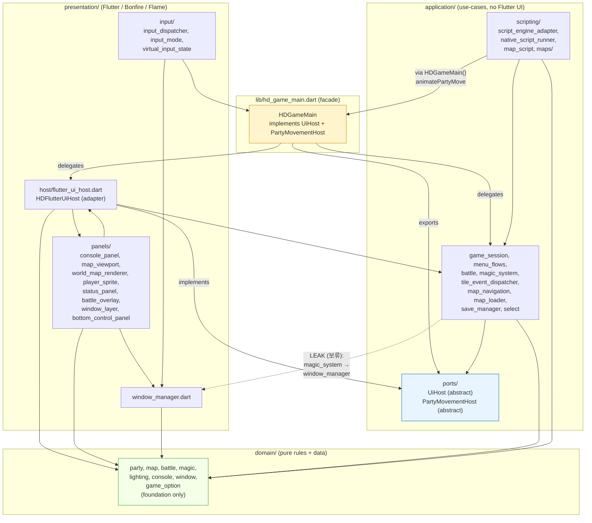

# Hadar2026 — Module Dependency Map

`hadar2026_app/lib/` is layered as **domain → application → presentation** with a thin facade on top. The diagram below shows what depends on what after the ports-and-adapters refactor.

> Renders as a graph on GitHub / IntelliJ / VS Code (Mermaid). The text-only summaries below cover the same content for terminals.

## Diagram



## Layer rules

```
domain/         ── 누구에게도 의존하지 않음 (foundation의 ChangeNotifier만 허용)
application/    ── domain/ + application/ports/ 만 의존
  └─ ports/     ── 외부 의존 0건 (pure abstract: UiHost, PartyMovementHost)
presentation/   ── application/ + domain/ + Flutter/Bonfire/Flame
  └─ host/flutter_ui_host  ← application/ports/* 의 어댑터(impl)
hd_game_main    ── facade. ports를 implements + 두 레이어 위임
```

## Dependency direction (left depends on right)

```
domain                 ←──── application/ports
                       ←──── application/* (use-cases, scripting)
                       ←──── presentation/* (host adapter, panels, input)
                       ←──── hd_game_main (facade)

application/ports      ←──── application/* (use-cases가 ports로 통신)
                       ←──── presentation/host/flutter_ui_host (adapter)
                       ←──── hd_game_main (facade)

application/*          ←──── presentation/host/flutter_ui_host (game_session, party.move 호출)
                       ←──── hd_game_main (facade)

presentation/host/     ←──── presentation/panels/* (bonfireGame ref 조회)
                       ←──── hd_game_main (facade)
```

## Ports & adapters pattern

```
                   application
        ┌─────────────────────────────┐
        │  use-cases (battle, ...)    │
        │            │                │
        │            ▼                │
        │  ┌─────────────────────┐    │
        │  │ ports/              │    │   ← 추상 인터페이스만, 외부 의존 0
        │  │  UiHost             │    │     (showMenu, addLog,
        │  │  PartyMovementHost  │    │      waitForAnyKey, beginNarrative,
        │  └──────────▲──────────┘    │      endNarrative, preloadAssets,
        └─────────────┼───────────────┘      animatePartyMove)
                      │ implements
                      │
        ┌─────────────┴───────────────┐
        │  presentation/host/         │
        │   flutter_ui_host.dart      │   ← Flutter/Bonfire 어댑터
        │   (Flame.images, sprite,    │
        │    TextPainter wrap, ...)   │
        └─────────────────────────────┘
                      ▲
                      │ implements 같은 인터페이스
                      │
                  (CLI/MUD adapter)         ← 추가 시 application/domain 무변경
```

## Remaining leak (1건)

```
application/magic_system.dart
        │
        │  HDMagicSelectionWindow + HDWindowManager 직접 사용
        ▼
presentation/window_manager.dart        ← 사용자 보류 (window 시스템 의존)
```

이 한 줄을 제외하면 application은 자기 폴더 안 + domain만 보고, presentation 위치를 모르는 상태입니다.

## Verification commands

```bash
cd hadar2026_app

# 1. domain has no Flutter/Bonfire/Flame (foundation 허용)
grep -rn "package:flutter\|package:bonfire\|package:flame" lib/domain/ | grep -v foundation
# 기대: 0건

# 2. application → presentation leak (보류된 magic_system 1건만)
grep -rn "import.*presentation" lib/application/
# 기대: lib/application/magic_system.dart 만

# 3. application/ports has no external imports
grep -rn "^import" lib/application/ports/
# 기대: 0건

# 4. HDGameMain has no Bonfire/Flame
grep -n "bonfire\|flame\|Flame\.\|Bonfire" lib/hd_game_main.dart
# 기대: 주석 외 코드 0건
```
