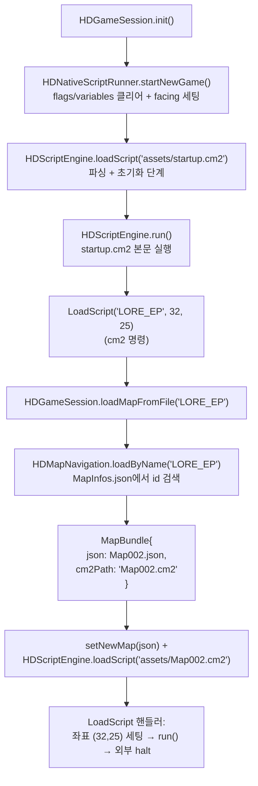

# 부팅 & 맵 로딩 시퀀스

게임이 처음 시작될 때 첫 맵(스크립트 + JSON 데이터)을 어떻게 찾아 읽어오는지를 설명합니다. 진입점은 [`HDGameSession.init()`](../hadar2026_app/lib/application/game_session.dart) 이고, 실제 "어떤 맵을 시작 맵으로 쓸지"는 코드가 아니라 [`assets/startup.cm2`](../hadar2026_app/assets/startup.cm2) 가 결정합니다.

## 1. 한눈에 보기



## 2. 단계별 동작

### 2.1 부팅 시퀀스 — `HDGameSession.init()`

[game_session.dart](../hadar2026_app/lib/application/game_session.dart)

```dart
Future<void> init() async {
  await HDNativeScriptRunner().startNewGame();
  await HDScriptEngine().loadScript(HDConfig.startupScript);
  // setScriptMode(0)는 부팅 경로에서 no-op이므로 주석 처리됨.
  await HDScriptEngine().run();
}
```

세 단계로 끝납니다:

1. **`startNewGame()`** — 네이티브 스크립트의 `flags`/`variables`를 클리어하고 파티 facing을 1로 세팅. **맵은 로드하지 않습니다.**
2. **`loadScript(startup.cm2)`** — 시작 스크립트를 파싱. 이때 엔진의 `clearRuntimeState()`가 호출되므로 `variables`/`contexts`/`halted`가 리셋됩니다 (`scriptMode`는 리셋되지 않음).
3. **`run()`** — `startup.cm2`의 본문을 실행. 여기서 시작 맵 결정과 로딩이 모두 일어납니다.

### 2.2 시작점 지정 — `startup.cm2`

[startup.cm2](../hadar2026_app/assets/startup.cm2)

```cm2
if (Equal(ScriptMode(), 0))
    LoadScript("LORE_EP", 32, 25)
```

- `ScriptMode()` 는 `ScriptEngine.scriptMode` 값을 반환. 부팅 직후에는 기본값 `0` 이므로 분기에 진입.
- `LoadScript("LORE_EP", 32, 25)` 는 cm2 명령. **이 한 줄을 바꾸는 것이 시작 맵을 바꾸는 유일한 방법**입니다 (Dart 코드 수정 불필요).

### 2.3 cm2 명령 → Dart 핸들러 — `LoadScript`

[script_engine_adapter.dart `e.registerCommand('LoadScript', ...)`](../hadar2026_app/lib/application/scripting/script_engine_adapter.dart)

```dart
e.registerCommand('LoadScript', (stmt, eng) async {
  // 1) 인자(name) 추출
  // 2) 맵으로 해석 시도 → 실패 시 cm2 파일로 폴백
  bool isMap = await HDGameMain().loadMapFromFile(path);
  if (!isMap) {
    await loadScript('assets/$path');
  }
  // 3) 좌표 인자 적용 (없으면 맵 중앙)
  HDGameMain().party.setPosition(nx, ny);
  // 4) 새로 로드된 스크립트 실행
  setScriptMode(0);
  await run();
  eng.halted = true;  // 바깥쪽(startup.cm2) 실행 종료
});
```

`LoadScript` 는 두 역할을 겸합니다 — **(a)** 맵 이름이면 맵 번들을 로드, **(b)** cm2 파일명이면 그 스크립트로 교체. 둘 중 하나가 성공하면 좌표를 세팅하고 새 스크립트를 즉시 실행합니다.

### 2.4 이름 → 번들 해석 — `MapInfos.json`

[map_navigation.dart `loadByName()`](../hadar2026_app/lib/application/map_navigation.dart)

`assets/maps/MapInfos.json` 은 다음과 같은 엔트리 배열입니다:

```json
{ "id": 2, "name": "LORE_EP", "order": 6, "parentId": 5, ... }
```

해석 규칙:

| 입력 | 출력 |
|---|---|
| `name` 매칭 (예: `"LORE_EP"`) | 해당 엔트리의 `id` 추출 (예: `2`) |
| 기본 JSON 경로 | `assets/maps/Map{id:03d}.json` (예: `Map002.json`) |
| 기본 cm2 경로 | `Map{id:03d}.cm2` (예: `Map002.cm2`) |
| `info.json` 필드가 있으면 | JSON 경로를 override |
| `info.cm2` 필드가 있으면 | cm2 경로를 override |

매칭되는 엔트리가 없으면 입력 이름을 그대로 `*.json` 으로 시도(폴백).

### 2.5 번들 로드 — `HDGameSession.loadMapFromFile()`

[game_session.dart](../hadar2026_app/lib/application/game_session.dart)

이 함수는 모든 맵 전이의 **단일 진입점**입니다. cm2 `LoadScript`, 네이티브 `HDNativeScriptRunner.loadMapScript`, save/load 모두 여기로 모입니다.

`MapBundle{ mapName, json?, cm2Path? }` 을 받아 다음 순서로 처리:

1. `HDBattle().init()` — 이전 맵에서 등록만 되고 소비되지 않은 enemies/playerCommands 정리.
2. `json` 이 있으면 `setNewMap(json)` — `mapVersion++` 트리거 → 뷰포트 재생성, progress 로그 클리어.
3. `currentMapCm2Path` 갱신 — 타일 이벤트 디스패처가 cm2 fallback 단계에서 사용.
4. `cm2Path` 가 있으면 `HDScriptEngine.loadScript(cm2Path)` — **엔진의 `currentScript` 가 새 cm2 로 교체됨**.
5. **네이티브 스크립트 swap** — `currentMapScript` 가 있으면 `onUnload()`, 그 다음 `mapScriptFactory[bundle.mapName]` 으로 새 스크립트 인스턴스 생성 (등록 안 된 맵이면 `null`). swap 후 `onPrepare()` + `onLoad(mapName, 0, 0)` 호출.

추가로 [`HDGameMain.loadMapFromFile()`](../hadar2026_app/lib/hd_game_main.dart) 가 위 호출 직전에 `HDWindowManager().clear()` 로 overlay 윈도우 스택을 정리합니다 (presentation 계층은 application 에서 직접 못 만지므로 facade 가 처리).

## 3. 알아두면 좋은 패턴

### 3.1 `LoadScript` 의 재진입

`LoadScript` 핸들러는 자기가 속한 `run()` 안에서 또 한 번 `loadScript()` + `run()` 을 부릅니다. 이게 가능한 이유:

- `loadScript()` 가 `clearRuntimeState()` 를 거쳐 `currentScript` 를 새 statement 리스트로 교체.
- 새 `run()` 은 교체된 `currentScript` 를 끝까지 실행.
- 핸들러 마지막의 `eng.halted = true` 가 **바깥쪽(이미 statement 리스트가 교체된) 루프**를 즉시 종료시킴.

`startup.cm2` 의 경우 본문이 `LoadScript(...)` 한 줄뿐이라 halted 가 없어도 자연스럽게 끝나지만, 일반적인 in-game 전이에서는 halted 플래그가 안전망 역할을 합니다.

### 3.2 cm2 로드 시 엔진 globals 가 리셋됨

`HDScriptEngine.loadScript()` 는 내부적으로 `_engine.clearRuntimeState()` 를 호출하므로 **맵 전이마다 `ScriptEngine.variables` / `_contexts` 가 비워집니다**. 맵을 가로질러 살아남아야 하는 상태는:

- 네이티브 스크립트의 `HDNativeScriptRunner.flags` / `variables` 에 저장하거나,
- `HDGameMain().gameOption.flags` / `variables` (Flag::Set / Variable::Set 명령으로 접근) 에 저장.

cm2 안에서 `variable foo = 0` 같은 글로벌 선언은 같은 cm2 안에서만 의미가 있습니다.

### 3.3 native 스크립트는 어느 경로로 들어와도 자동 swap

이전에는 cm2 `LoadScript` 경로에서 `currentMapScript` 가 stale 한 채 남아 잘못된 native 핸들러가 발동할 수 있었습니다. 지금은 [`HDGameSession.loadMapFromFile()`](../hadar2026_app/lib/application/game_session.dart) 안에서 swap을 처리하므로 cm2 / native / save-load 어느 경로로 들어와도 `currentMapScript` 가 `bundle.mapName` 과 일관됩니다 (등록 안 된 맵이면 `null`).

[`HDNativeScriptRunner.loadMapScript()`](../hadar2026_app/lib/application/scripting/native_script_runner.dart) 는 좌표 세팅 + `loadMapFromFile` 위임만 담당하는 thin wrapper 가 되었습니다. `mapScriptFactory` 에 등록된 이름(예: `TOWN1`, `GROUND1`, `TOWN2`, `DEN1`)에 한해 native가 활성화됩니다. 타일 이벤트 디스패치 우선순위(native → cm2 → JSON)는 [CLAUDE.md](../CLAUDE.md) 의 "Scripting: three event tiers per tile" 절을 참조.

## 4. 시작 맵을 바꾸려면

대부분의 경우 [`assets/startup.cm2`](../hadar2026_app/assets/startup.cm2) 한 줄만 고치면 됩니다:

```cm2
if (Equal(ScriptMode(), 0))
    LoadScript("TOWN1", 10, 10)   # 이름과 좌표만 바꾸기
```

조건:
- `name` 은 `MapInfos.json` 에 등록되어 있어야 함.
- 해당 id 의 `Map{id:03d}.json` / `Map{id:03d}.cm2` 가 `assets/maps/` 에 있거나, MapInfos 엔트리에서 `json` / `cm2` override 가 정의되어 있어야 함.
- cm2 가 없는 맵으로 시작하려면 네이티브 스크립트(`mapScriptFactory`) 가 등록되어 있어야 정상 동작.

## 5. 관련 파일

| 파일 | 역할 |
|---|---|
| [`hadar2026_app/lib/application/game_session.dart`](../hadar2026_app/lib/application/game_session.dart) | `init()`, `loadMapFromFile()` |
| [`hadar2026_app/lib/application/scripting/native_script_runner.dart`](../hadar2026_app/lib/application/scripting/native_script_runner.dart) | `startNewGame()`, native 스크립트 팩토리 |
| [`hadar2026_app/lib/application/scripting/script_engine_adapter.dart`](../hadar2026_app/lib/application/scripting/script_engine_adapter.dart) | cm2 명령 등록 (`LoadScript`, `Map::*`, ...) |
| [`hadar2026_app/lib/application/map_navigation.dart`](../hadar2026_app/lib/application/map_navigation.dart) | `MapInfos.json` 기반 이름→번들 해석 |
| [`hadar2026_app/lib/domain/map/map_bundle.dart`](../hadar2026_app/lib/domain/map/map_bundle.dart) | `MapBundle{ mapName, json?, cm2Path? }` |
| [`hadar2026_app/assets/startup.cm2`](../hadar2026_app/assets/startup.cm2) | 시작 맵 지정 (단일 진입점) |
| [`hadar2026_app/assets/maps/MapInfos.json`](../hadar2026_app/assets/maps/MapInfos.json) | name → id, json/cm2 override 인덱스 |
| [`packages/cm2_script/lib/src/cm2_script.dart`](../packages/cm2_script/lib/src/cm2_script.dart) | `ScriptEngine` 본체 (`run`, `clearRuntimeState`, ...) |
