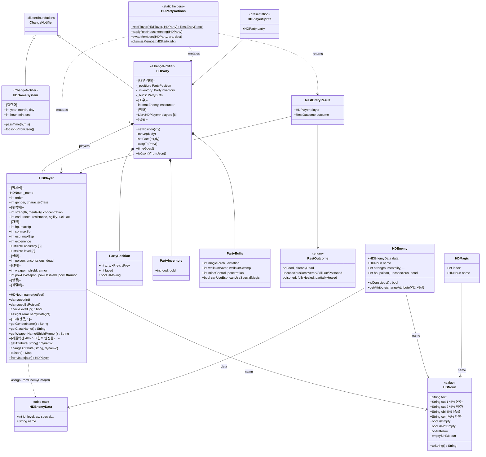

# Player / Party 도메인 구조 분석

> 같은 디렉터리의 `player_structure.md` / `party_structure.md` / `enemy_structure.md` 는 옛 `lib/models/` 시절 작성된 단편 메모입니다. 이 문서가 최신 상태이며 두 클래스의 구조적 이슈를 함께 다룹니다.

## 0. 이 문서의 목적

- 현재 `HDPlayer` / `HDParty` 의 구조와 주변 의존을 한 장으로 보여준다.
- "다음에 손댈 만한 구조적 이슈"의 후보 리스트를 보존한다.
- 새 대화 세션에서 이 문서만 읽고 바로 다음 리팩토링을 이어갈 수 있도록 컨텍스트를 자족적으로 적어둔다.

## 1. 현재 구조 (다이어그램)

## 2. 파일 위치

| 클래스 | 경로 |
| --- | --- |
| `HDNoun` | `hadar2026_app/lib/domain/text/noun.dart` |
| `HDPlayer` | `hadar2026_app/lib/domain/party/player.dart` |
| `HDParty`, `PartyPosition` 등 | `hadar2026_app/lib/domain/party/party.dart` |
| `HDGameSystem` | `hadar2026_app/lib/domain/system/game_system.dart` |
| `HDPartyActions`, `RestOutcome`, `RestEntryResult` | `hadar2026_app/lib/domain/party/party_actions.dart` |
| `HDEnemy` | `hadar2026_app/lib/domain/battle/enemy.dart` |
| `HDEnemyData`, `enemyTable` | `hadar2026_app/lib/domain/battle/enemy_data.dart` |
| `HDMagic`, `HDMagicMap` | `hadar2026_app/lib/domain/magic/magic.dart` |

테스트:
- `hadar2026_app/test/domain/text/noun_test.dart`
- `hadar2026_app/test/domain/party/party_actions_test.dart`

## 3. 현재까지 정리된 부분 (참고용 기록)

- **i18n: 한국어 조사 처리** → `HDNoun` 으로 추출 (도메인의 `text/` 서브폴더). `HDPlayer`/`HDEnemy`/`HDMagic` 셋이 똑같이 갖고 있던 `name` + `josaSub1/Sub2/Obj/With` 4필드 + `_hasJongsung` 휴리스틱이 한 군데로 합쳐짐.
- 모든 호출처는 `${e.name.sub1}` 등으로 통일. `name` 자체가 `HDNoun` 이므로 `${e.name}` 은 `toString()` 통해 동작.
- 한국어/영어 어미를 모두 처리하는 종성 추정 규칙(영어는 모음/`w` 끝나면 종성 없음으로 간주) 통합. 이전엔 `HDPlayer` 와 `HDEnemy` 가 살짝 달랐다.
- **검토했지만 적용하지 않음**: `extension type HDNoun(String text) implements String` 으로 만들면 `.text` 명시가 사라지지만, (1) 도메인 타입 구분 손실, (2) 시스템 언어 일반화 시 시그니처 재설계 비용, 두 가지 이유로 보류. 일반 클래스 형태 유지.
- **파티 응집도 및 캘린더 분리**: 시간 흐름과 캘린더 변수를 `HDGameSystem` 으로 독립시켰으며, `HDParty` 에 흩어져 있던 위치/인벤토리/버프 변수들을 `PartyPosition`, `PartyInventory`, `PartyBuffs` 로 구조체화하여 내부로 캡슐화 완료 (하위 호환성을 위해 getter/setter 노출 중).

## 4. 남아있는 구조적 이슈 (우선순위순)

다음 세션에서 다룰 후보 목록입니다. 각 항목마다 *증상 → 원인 → 제안* 순.

### A. (大) `HDPlayer` 가 파티원 + 적 두 역할을 겸함

- 증상: `HDPlayer.assignFromEnemyData(int)` 가 적 데이터로 자기 자신을 채움. `lib/application/battle.dart` 곳곳에서 적 객체를 `HDPlayer t` 로 다룸.
- 원인: 원작 C++ 가 한 구조체로 처리하던 흔적.
- 제안:
  - `HDEnemy` 는 이미 분리돼 있음. 전투 파라미터를 공유하는 `Combatant` 추상을 만들고 `HDPlayer` / `HDEnemy` 둘 다 그 인터페이스를 구현.
  - 또는 `HDEnemy` 만 쓰도록 전투 코드를 옮기고 `assignFromEnemyData` 와 그 호출 경로를 제거.
  - 둘 다 `getAttribute/changeAttribute` 같은 리플렉션 API 가 있는데, `Combatant` 가 그걸 들고 있어야 스크립트 엔진 어댑터를 한 곳에서 다룰 수 있음.

### B. (中) `HDPlayer` 의 표시 책임 잔여

- `getGenderName()` / `getClassName()` / `getWeaponName()` / `getShieldName()` / `getArmorName()` — 모두 한국어 UI 문자열을 반환. 도메인이 표시 규칙 보유.
- 제안: `presentation/` 또는 별도 `domain/text/labels.dart` 에 라벨러 함수로. 또는 enum 기반 `Gender`/`CharacterClass` 도입 후 enum 의 `toLabel()` 이 i18n 매니저에 위임.

### C. (中) `getAttribute` / `changeAttribute` — 문자열 키 리플렉션

- `HDPlayer` (player.dart:122–189, 324–421) 와 `HDEnemy` (enemy.dart) 모두 거대한 switch. 키는 스크립트 엔진(`'level(magic)'`, `'pow_of_weapon'` 등) 문법이 그대로 들어와 있음.
- 제안: 스크립트 엔진 어댑터(`application/scripting/script_engine_adapter.dart`) 쪽으로 책임 이동. 도메인은 보통의 게터/세터만 갖고, 어댑터가 이름→필드 맵을 보유. 또는 코드 생성으로.

### E. (中) Max 자원의 진실 소스가 둘

`maxHp` 가 필드로 저장되는데:
- `party_actions.dart:76` 은 `endurance * level[0]` 로 즉석 재계산해서 cap 사용.
- `player.dart:232-234` `checkLevelUp` 도 `endurance * level[0]` 로 덮어씀.
- `changeAttribute('max_hp', ...)` 로는 직접 덮어쓰기 가능.

→ 공식인지 저장값인지 결정 필요. 둘 다일 수 없음. 같은 패턴이 `maxSp`/`maxEsp` 에도 존재.

### F. (中) `HDParty.players` 의 하드코딩 초기화

- `party.dart:40-86` 필드 선언 자리에 6명 슬롯과 "슴갈/유리" 초기 데이터를 박아둠.
- `final List` 인데 `players[i] = HDPlayer.fromJson(...)` 으로 슬롯 교체 — `final` 의미가 참조만 final 이라는 흔한 함정.
- `fromJson` 으로 6보다 짧은 리스트 로드 시 인덱스 2~5 는 슴갈/유리 잔여 슬롯이 그대로 남음.

→ `HDParty.fresh()` / `HDParty.empty()` 팩토리, 초기 캐릭터는 `NewGameSeed` 로 분리.

### G. (小) `HDPlayer.damagedByPoison` 비결정적 난수

- `player.dart:96-99` 의 `DateTime.now().millisecondsSinceEpoch % 20`. 결정적 테스트 작성 불가, 같은 프레임 두 번 호출 시 동일 값.
- 제안: `Random` 주입(생성자 또는 인자).

### H. (小) 행동 위치의 일관성 결여

같은 도메인인데 어떤 건 메서드, 어떤 건 static helper:

- `HDPlayer.checkLevelUp()` / `damaged()` — 메서드
- `HDParty.passTime/timeGoes()` — 메서드
- `HDPartyActions.restPlayer/swapMembers/dismissMember` — static
- 휴식 후 버프 감쇠는 `HDPartyActions.applyRestHousekeeping`, 그러나 `timeGoes` 의 버프 감쇠는 `HDParty` 안.

규칙: "엔티티 단일 불변식 = 메서드, 다중 엔티티 트랜잭션 = static service" 정도로 정렬.

### I. (小) `HDPlayer` exp 테이블 중복

`player.dart:194-216` 와 `player.dart:277-298` 에 같은 테이블이 두 번. 한쪽 21개, 한쪽 20개 — 미세한 비대칭.

### J. (小) 상태 플래그 타입 — `int` 인데 `bool` 처럼 쓰임

- `dead` 는 항상 0/1 → bool 이어야.
- `unconscious` 는 카운터로도 쓰임 (`party_actions.dart:61` `-=`).
- `poison` 도 카운터.
- 같은 표현이 의미가 다름.

→ `dead: bool`, `poison/unconscious` 는 `int turnsLeft` 또는 `Status` 객체.

### K. (小) `josa` 외에도 `josaRo` 같은 잔여물

- `application/battle.dart:451` 에 `_getJosaRo(p.getWeaponName())` 사용. 이 함수는 무기 이름 끝 자음 받침에 따라 `(으)로` 붙임. `HDNoun` 의 일반화로 흡수 가능 (`로/으로` 게터 추가).

### L. (小) `HDParty.notifyListeners()` 의 microtask 래핑

- `party.dart:6-12` 와 `HDGameMain` 양쪽에 microtask 디바운싱 — 한쪽에서만 해도 충분.

## 5. 다음 작업 시작 가이드

새 세션에서 어디부터 손댈지 정할 때:

1. **A 부터** 가는 게 임팩트 가장 큼. 다만 전투 코드(`battle.dart`) 전체에 걸쳐 영향. 한 시간 짜리 작업 아님 — 별도 세션 잡고 진행.
2. **F 부터** 해도 비슷하게 큰 효과. (기존 D 이슈였던 Party 분리는 해결됨)
3. **E** (max 자원 진실 소스) 는 한 세션에 끝나는 작은 작업이지만 영향 범위가 곳곳. 결정 → 일괄 수정.
4. **K** (조사 일반화) 는 `HDNoun` 의 자연스러운 다음 단계. 코드 영향 적음.

각 작업 시작 시 체크리스트:
- 이 문서의 다이어그램이 여전히 맞는지 확인 (코드는 변하지만 문서는 갱신 안 됐을 수 있음).
- `flutter test` 가 깨끗한 상태에서 시작.
- `lib/application/`, `lib/presentation/` 의 호출처 grep 으로 영향 범위 먼저 가늠.
- 파일이 이동/삭제되면 다이어그램의 "파일 위치" 표를 갱신.

## 6. 관련 외부 컨텍스트

- 전체 레이어링: `CLAUDE.md` 의 *Architecture > `lib/` is layered* 섹션. 도메인은 `package:flutter/foundation.dart` 만 import 허용.
- `HDPartyActions` 의 휴식 규칙 의도는 [party_actions.dart:39-49](../../hadar2026_app/lib/domain/party/party_actions.dart#L39-L49) 의 doc comment 에 보존돼 있음 (원작 Hadar 메커니즘과 1:1).
- `application/ports/` 인터페이스들은 도메인 ↔ 프레젠테이션 사이 seam — Player/Party 변경이 그쪽까지 영향을 주는지 매번 확인.
