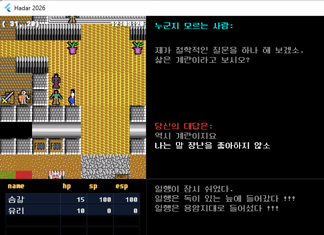

# Hadar 2026 App (또 다른 지식의 성전 복각 프로젝트)

classic 한국 고전 RPG **"또 다른 지식의 성전 (Hadar)"**의 Flutter/Dart 리메이크 클라이언트 애플리케이션입니다.  
타일 맵 월드는 `Bonfire` / `Flame` 엔진을 기반으로 구현되었으며, 데스크톱 셸 구동을 위해 `window_manager` 패키지를 사용합니다.

### 🎮 웹 데모 (Web Demo)
* **데모 실행 URL**: [https://smgal.github.io/Hadar2026/](https://smgal.github.io/Hadar2026/)

### 📸 스크린샷 (Screenshot)


---

## 🚀 실행 및 빌드 방법 (Run & Build)

### 패키지 의존성 가져오기
```bash
flutter pub get
```

### 앱 실행 (데스크톱 및 모바일 기기)
```bash
flutter run
```

### 웹 빌드 (GitHub Actions 배포 설정과 동일)
```bash
flutter build web --base-href "/Hadar2026/" --release
```

---

## 🧪 테스트 실행 (Run Tests)

도메인 로직 및 핵심 엔진에 대한 단위 테스트가 포함되어 있습니다.

```bash
# 전체 테스트 실행
flutter test

# 특정 폴더의 테스트 실행 (예: party 도메인)
flutter test test/domain/party/

# 특정 파일 테스트 실행
flutter test test/domain/console/text_utils_test.dart
```

---

## ⚠️ 중요: 종속성 버전 고정 (Dependency Constraints)

현재 `Flame` 엔진 및 `Bonfire` 패키지의 버전은 다음과 같이 엄격하게 고정되어 있습니다. 임의로 버전을 올리지 마세요.
*   **Flame**: `1.35.1` (`dependency_overrides`를 통해 강제 고정)
*   **Bonfire**: `3.16.1`

> [!WARNING]
> Bonfire `3.17.x` 버전 이상은 Flame `1.36.x` 이상을 상정하고 작성되어 `RenderGameWidget(behavior:)` 시그니처 불일치로 인해 **컴파일 에러가 발생**합니다.

---

## 📐 화면 구성 스펙 (UI Specification)

본 프로젝트는 고전적인 정취를 재현하기 위해 고정 해상도 및 패널 레이아웃 시스템을 따릅니다.
*   **총 화면 영역**: 고정 **800 x 480 px** (데스크톱 및 웹은 `FittedBox`를 통해 비율 유지 상태로 스케일링됨)
*   **주요 뷰포트 레이아웃**:
    *   **HDMapViewport** (0,0 / 288x320 px): Bonfire 타일 월드 렌더러. 카메라는 항상 플레이어 캐릭터에 고정 스냅됩니다.
    *   **HDConsolePanel** (288,0 / 512x320 px): 스크립트 대화 상자(`Talk`), 시스템 로그, 사용자 선택 프롬프트를 텍스트로 표시합니다.
    *   **HDStatusPanel** (0,320 / 800x160 px): 최대 6명의 파티원 정보(이름, HP, SP, ESP 등)를 표시하는 격자 레이아웃입니다.
    *   **HDBottomControlPanel**: 모바일 디바이스용 가상 패드(D-pad 및 액션 버튼) 레이아웃입니다.
    *   **HDWindowLayer**: 메인 월드 화면 위에 오버레이로 렌더링되는 스택 창 레이아웃(전투 화면, 마법/초능력 선택 등)입니다.

자세한 시각 스펙은 [`UI_SPEC.md`](UI_SPEC.md)을 참고하세요.

---

## 🏗️ 프로젝트 구조 (Project Layout)

본 애플리케이션의 `lib/` 폴더는 파일의 성격이 아닌 **역할(Layered MVC)**을 기준으로 엄격하게 분리되어 있습니다.

```
lib/
├─ main.dart                        # 앱 부트스트랩 및 UI 최상단 빌더
├─ hd_config.dart                   # 화면 크기, 폰트 크기 등 전역 설정 상수
├─ hd_game_main.dart                # 레이어들을 하나로 묶어주는 얇은 퍼사드(Facade) 클래스 (UiHost 구현체)
│
├─ domain/                          # 순수 Dart 데이터 모델 및 순수 게임 룰
│   │                               # (Flutter material, Services, Bonfire 의존성 0건 지향)
│   ├─ party/                       # 파티(HP/SP/ESP 소모, 휴식, 멤버 정렬/퇴출 등) 규칙
│   ├─ map/                         # 맵 타일 속성, 이벤트 데이터, RPG Maker 호환 파서
│   ├─ battle/                      # 전투 상태 모델 및 전투 계산기
│   ├─ magic/                       # 마법 및 초능력 데이터, 시전 룰
│   ├─ lighting/                    # 시야 계산기 (시간대별 광원 범위 계산 등)
│   ├─ console/                     # 콘솔 로그 상태 데이터 구조체
│   ├─ system/                      # 게임 시스템 설정 및 상태
│   ├─ text/                        # 한글 조사의 종성 규칙(을/를, 이/가 등) 및 텍스트 파서
│   └─ window/                      # 게임 오버레이 윈도우의 데이터 추상 레이어
│
├─ application/                     # 유스케이스 레이어 (UI 비의존 비동기 워크플로우 제어)
│   ├─ game_session.dart            # 게임 세션 상태 (진행 시간, 로딩된 맵 정보 등)
│   ├─ menu_flows.dart              # 메뉴 선택 플로우 (장비 장착, 난이도 조율, 세이브/로드 등)
│   ├─ battle.dart                  # 전투 시스템 로직 (전투 메뉴 대기, 차례 제어)
│   ├─ magic_system.dart            # 마법 시스템 캐스팅 플로우
│   ├─ map_navigation.dart          # 맵 전환 및 파일 로드 제어
│   ├─ tile_event_dispatcher.dart   # 맵 타일 이벤트 감지 및 처리
│   ├─ save_manager.dart            # JSON 직렬화/역직렬화를 사용한 게임 세이브/로드 관리
│   └─ scripting/                   # CM2 스크립트 실행 제어 및 Native 스크립트 결합 어댑터
│
├─ presentation/                    # UI 표현 레이어 (Flutter / Bonfire / Flame 종속적 요소)
│   ├─ host/                        # 화면 및 대화 렌더러의 concrete 구현부 (`UiHost` 어댑터)
│   ├─ input/                       # 글로벌 키보드/패드 입력 디스패처 및 입력 상태 관리
│   ├─ panels/                      # 각 패널(맵, 콘솔, 스테이터스 등)과 플레이어 스프라이트 렌더러
│   └─ window_manager.dart          # 오버레이 윈도우 스택 관리 및 윈도우별 키 입력 핸들러
│
└─ utils/                           # 공통 유틸리티 (텍스트 줄바꿈 래퍼 등)
```

> [!IMPORTANT]
> **레이어 규칙(Layering Rule)**:
> 1. `domain/` 하위 코드는 `package:flutter/material.dart`나 `package:bonfire/...` 등을 임포트할 수 없으며 오직 순수 Dart 비즈니스 규칙만 포함해야 합니다. (ChangeNotifier를 위한 `foundation.dart` 수준만 제한적으로 허용)
> 2. `application/` 코드는 프레젠테이션(`presentation/`) 레이어 요소를 임포트할 수 없습니다. 대신 `ports/` 에 정의된 추상 인터페이스(`UiHost` 등)를 통해 비동기식으로 상호작용합니다.

---

## 📜 스크립팅 엔진 (Scripting Engine)

타일의 이벤트 감지 시 `HDTileEventDispatcher`가 **3단계 우선순위 체인**을 통해 이벤트를 처리합니다:
1.  **Native Map Script**: `lib/application/scripting/maps/` 경로 하위의 Dart 파일입니다. IDE의 자동완성 및 정적 타입 컴파일을 활용하며 복잡한 규칙 제어에 사용됩니다. (`true` 반환 시 핸들링 완료로 판정하여 아래 체인 생략)
2.  **CM2 Paired Script**: `assets/` 하위의 `.cm2` 텍스트 스크립트 파일입니다. 런타임에 동적으로 핫 로드 가능한 DSL 형태입니다. `Event::Override()` 구문을 포함시켜 JSON fallback을 제어합니다.
3.  **JSON MapEvent Dialogue**: RPG Maker 사양의 `MapNNN.json` 파일에 지정된 대화 라인(`dialogLines`)을 읽어 출력하는 최종 fallback입니다.

CM2 스크립트 인터프리터 자체는 독립된 로컬 패키지인 `packages/cm2_script/`로 분리되어 관리됩니다.

---

## 🔗 관련 문서 링크 (See Also)
*   [`UI_SPEC.md`](UI_SPEC.md) — 800x480 UI 및 렌더링 명세
*   [`task.md`](task.md) — 아키텍처 재구성을 완료한 히스토리 및 남은 리팩토링 체크리스트
*   [`../CLAUDE.md`](../CLAUDE.md) — 전체 멀티 패키지 프로젝트의 빌드 가이드 및 전체 아키텍처 설명서
